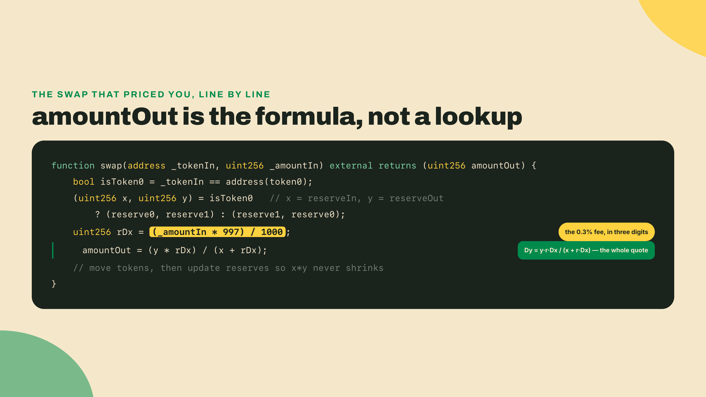
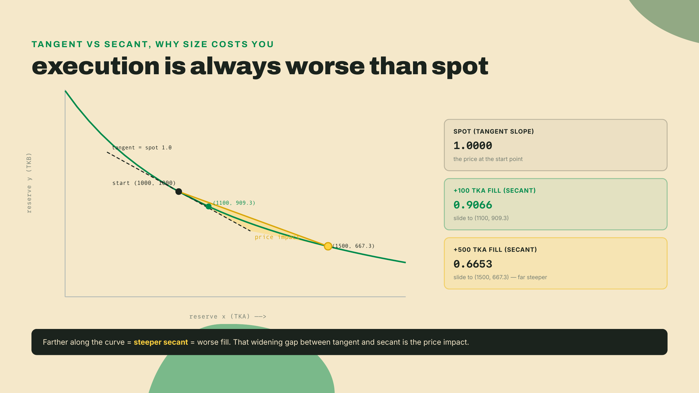
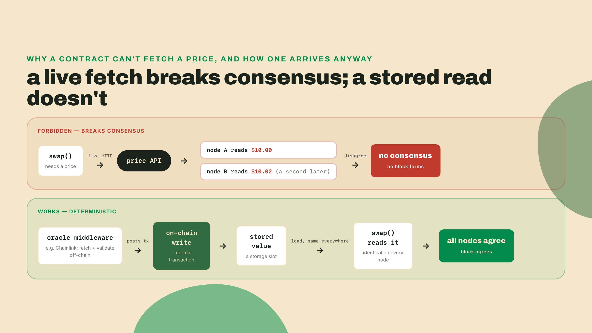
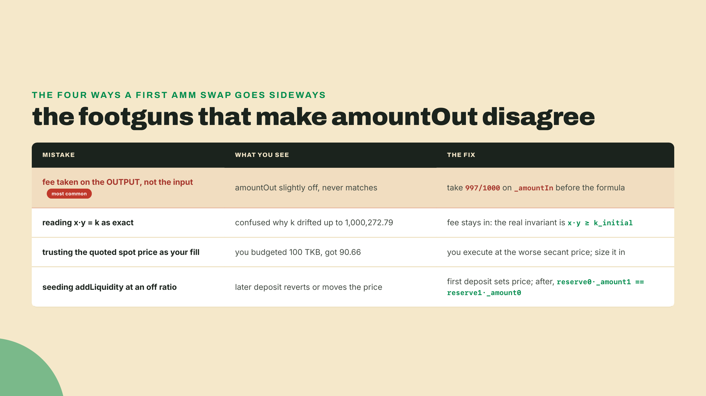
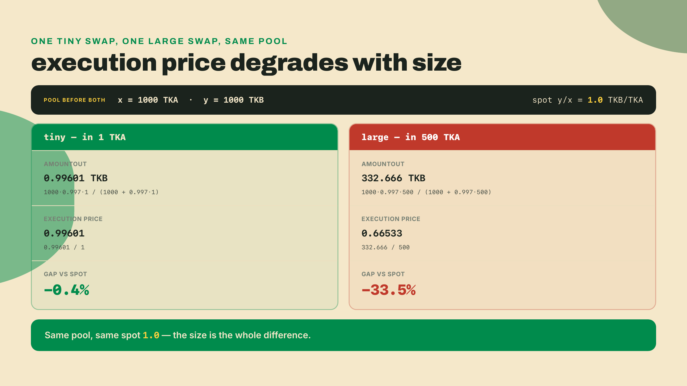

# A market with no market maker: deploy an AMM and swap against it

Last lesson your contract's state lived on-chain in its own storage: you wrote a value and read it back from the contract itself, no server in the loop. Now that same storage holds two token balances, and those two numbers are about to behave like a market.

You deploy a contract, hand it a pile of two tokens, and sixty seconds later you type one swap command: no order book, no counterparty, nobody on the other side of the trade, and it fills instantly at a price it made up from nothing but its own two balances. A market with no market maker just quoted you. Where did that price come from, and what stops you from draining it dry?

Don't take the story on faith. Build it and run it before we name a single thing. Three files, one command, and no new tools: `forge` and `cast` and `anvil` are the Foundry trio from last lesson, and `node` is the JavaScript runtime (`node --version` should print something; if it doesn't, install the LTS build from nodejs.org). Leave `anvil` running in its own terminal the whole time, exactly as you left it last lesson.

```bash
mkdir -p toolkit/amm/contracts && cd toolkit/amm
printf '[profile.default]\nsrc = "contracts"\nout = "out"\nlibs = []\n' > foundry.toml
```

Save this as `contracts/TestToken.sol`. It is the smallest thing that can be a token: a balance per address, and permission for someone else to move yours.

```solidity
// SPDX-License-Identifier: MIT
pragma solidity ^0.8.26;

/// A throwaway ERC-20 with a fixed supply, minted to whoever deploys it.
contract TestToken {
    string public name;
    string public symbol;
    uint8 public constant decimals = 18;
    uint256 public totalSupply;

    mapping(address => uint256) public balanceOf;
    mapping(address => mapping(address => uint256)) public allowance;

    constructor(string memory _name, string memory _symbol, uint256 _supply) {
        name = _name;
        symbol = _symbol;
        totalSupply = _supply;
        balanceOf[msg.sender] = _supply;
    }

    function approve(address spender, uint256 amount) external returns (bool) {
        allowance[msg.sender][spender] = amount;
        return true;
    }

    function transfer(address to, uint256 amount) external returns (bool) {
        balanceOf[msg.sender] -= amount;
        balanceOf[to] += amount;
        return true;
    }

    function transferFrom(address from, address to, uint256 amount) external returns (bool) {
        allowance[from][msg.sender] -= amount;
        balanceOf[from] -= amount;
        balanceOf[to] += amount;
        return true;
    }
}
```

Save this as `contracts/AMM.sol`. This one is the market. Read it later; run it first.

```solidity
// SPDX-License-Identifier: MIT
pragma solidity ^0.8.26;

interface IERC20 {
    function transfer(address to, uint256 amount) external returns (bool);
    function transferFrom(address from, address to, uint256 amount) external returns (bool);
    function balanceOf(address who) external view returns (uint256);
}

contract AMM {
    IERC20 public immutable token0;
    IERC20 public immutable token1;

    uint256 public reserve0;
    uint256 public reserve1;
    uint256 public totalShares;
    mapping(address => uint256) public sharesOf;

    constructor(address _token0, address _token1) {
        token0 = IERC20(_token0);
        token1 = IERC20(_token1);
    }

    function addLiquidity(uint256 _amount0, uint256 _amount1)
        external returns (uint256 shares)
    {
        if (totalShares == 0) {
            shares = _sqrt(_amount0 * _amount1);          // geometric mean
        } else {
            require(reserve0 * _amount1 == reserve1 * _amount0, "off-ratio deposit");
            uint256 s0 = totalShares * _amount0 / reserve0;
            uint256 s1 = totalShares * _amount1 / reserve1;
            shares = s0 < s1 ? s0 : s1;                   // the minimum ratio
        }
        require(shares > 0, "zero shares");

        token0.transferFrom(msg.sender, address(this), _amount0);
        token1.transferFrom(msg.sender, address(this), _amount1);
        sharesOf[msg.sender] += shares;
        totalShares += shares;
        _sync();
    }

    function swap(address _tokenIn, uint256 _amountIn)
        external returns (uint256 amountOut)
    {
        bool isToken0 = _tokenIn == address(token0);
        (uint256 x, uint256 y) = isToken0
            ? (reserve0, reserve1)
            : (reserve1, reserve0);

        uint256 rDx = _amountIn * 997 / 1000;
        amountOut   = y * rDx / (x + rDx);

        _transferIn(_tokenIn, _amountIn);
        _transferOut(isToken0, amountOut);
        _sync();              // update reserves; asserts x*y did not shrink
    }

    function _transferIn(address _tokenIn, uint256 _amountIn) internal {
        require(
            _tokenIn == address(token0) || _tokenIn == address(token1),
            "unknown token"
        );
        IERC20(_tokenIn).transferFrom(msg.sender, address(this), _amountIn);
    }

    function _transferOut(bool isToken0, uint256 amountOut) internal {
        if (isToken0) token1.transfer(msg.sender, amountOut);
        else token0.transfer(msg.sender, amountOut);
    }

    function _sync() internal {
        uint256 kBefore = reserve0 * reserve1;
        reserve0 = token0.balanceOf(address(this));
        reserve1 = token1.balanceOf(address(this));
        require(reserve0 * reserve1 >= kBefore, "k shrank");
    }

    function _sqrt(uint256 n) internal pure returns (uint256 z) {
        if (n == 0) return 0;
        z = n; uint256 w = n / 2 + 1;
        while (w < z) { z = w; w = (n / w + w) / 2; }
    }
}
```

Save this as `swap.js`, beside `foundry.toml`. It is not the market; it is the harness that deploys the market and drives it. It shells out to the `forge` and `cast` you already installed, so there is nothing to `npm install` and no `node_modules` anywhere.

```javascript
// swap.js - deploy the AMM and two throwaway tokens on the anvil node from the
// last lesson, seed it with liquidity, then sell it 100 TKA. Uses only forge and
// cast, which you already have; no npm packages, no node_modules.
const { execFileSync } = require("node:child_process");

const RPC = "http://127.0.0.1:8545";
const KEY = "0xac0974bec39a17e36ba4a6b4d238ff944bacb478cbed5efcae784d7bf4f2ff80";
const ME  = "0xf39Fd6e51aad88F6F4ce6aB8827279cffFb92266";  // anvil account (0)
const ONE = 10n ** 18n;                    // both test tokens use 18 decimals

const run = (cmd, args) => execFileSync(cmd, args, { encoding: "utf8" }).trim();
const deploy = (what, ctorArgs) =>
  run("forge", ["create", what, "--broadcast", "--rpc-url", RPC,
                "--private-key", KEY, "--constructor-args", ...ctorArgs])
    .match(/Deployed to: (0x[0-9a-fA-F]{40})/)[1];
const send = (to, sig, args) =>
  run("cast", ["send", to, sig, ...args, "--rpc-url", RPC, "--private-key", KEY]);
const call = (to, sig, args = []) =>
  BigInt(run("cast", ["call", to, sig, ...args, "--from", ME,
                      "--rpc-url", RPC]).split(" ")[0]);

// print a wei-scale amount in whole token units, rounded to dp decimals
const fmt = (wei, dp = 4) => {
  const scale = 10n ** BigInt(dp);
  const r = (wei * scale + ONE / 2n) / ONE;           // round, don't truncate
  return `${r / scale}.${(r % scale).toString().padStart(dp, "0")}`
    .replace(/0+$/, "").replace(/\.$/, "");
};

const supply = (1_000_000n * ONE).toString();
const tka = deploy("contracts/TestToken.sol:TestToken", ["Test Token A", "TKA", supply]);
const tkb = deploy("contracts/TestToken.sol:TestToken", ["Test Token B", "TKB", supply]);
const amm = deploy("contracts/AMM.sol:AMM", [tka, tkb]);
console.log("deployed: AMM + 2 test tokens (TKA, TKB) [solidity ^0.8.26]");

const MAX = (2n ** 256n - 1n).toString();
send(tka, "approve(address,uint256)", [amm, MAX]);
send(tkb, "approve(address,uint256)", [amm, MAX]);

const seed = (1000n * ONE).toString();
const shares = call(amm, "addLiquidity(uint256,uint256)(uint256)", [seed, seed]);
send(amm, "addLiquidity(uint256,uint256)", [seed, seed]);
console.log(`addLiquidity(1000, 1000) -> LP shares: ${fmt(shares)}`);

const reserves = () => [call(amm, "reserve0()(uint256)"), call(amm, "reserve1()(uint256)")];
const [x0, y0] = reserves();
console.log(`reserves: x = ${fmt(x0)} TKA | y = ${fmt(y0)} TKB (product k = ${fmt(x0 * y0 / ONE, 2)})`);

const amountIn = 100n * ONE;
console.log(`\nswap(TKA, ${fmt(amountIn)})`);
const out = call(amm, "swap(address,uint256)(uint256)", [tka, amountIn.toString()]);
send(amm, "swap(address,uint256)", [tka, amountIn.toString()]);
const [x1, y1] = reserves();
console.log(`amountOut: ${fmt(out)} TKB`);
console.log(`reserves now: x = ${fmt(x1)} TKA | y = ${fmt(y1)} TKB (product = ${fmt(x1 * y1 / ONE, 2)})`);

// acceptance: dy = y*r*dx/(x + r*dx), and the product must not shrink
const rDx = (amountIn * 997n) / 1000n;
const expected = (y0 * rDx) / (x0 + rDx);
console.log(out === expected && x1 * y1 >= x0 * y0
  ? "\nacceptance: OK - amountOut matches y*r*dx/(x+r*dx) and k did not shrink"
  : `\nacceptance: FAILED - formula says ${fmt(expected)} TKB, contract returned ${fmt(out)} TKB`);
```

Now run it:

```bash
node swap.js
```

```
deployed: AMM + 2 test tokens (TKA, TKB) [solidity ^0.8.26]
addLiquidity(1000, 1000) -> LP shares: 1000
reserves: x = 1000 TKA | y = 1000 TKB (product k = 1000000)

swap(TKA, 100)
amountOut: 90.6611 TKB
reserves now: x = 1100 TKA | y = 909.3389 TKB (product = 1000272.8)

acceptance: OK - amountOut matches y*r*dx/(x+r*dx) and k did not shrink
```

Read that output before anything gives it a name. The script deployed a contract, deployed two throwaway ERC-20 test tokens, poured 1000 of each into the contract, and then sold it 100 TKA. It handed back 90.6611 TKB. You never posted an order. Nobody accepted it. There was no bid and no ask sitting in a book waiting to match. The contract looked at the two piles it was holding, ran arithmetic, and quoted a fill on the spot.

## Name what you just ran

That contract is an **automated market maker** (AMM): a program that quotes and fills trades straight from a formula over its own token balances, with no order book and no human on the other side. The two balances it holds are its **reserves**, and the pile of tokens you deposited is the **liquidity** it trades against.

When you seeded 1000 and 1000, you were the pool's liquidity provider, and the `LP shares: 1000` line is your receipt. Those shares are not a token count you can spend; they are a proportional claim on whatever the pool holds when you come back to withdraw. The contract mints them on the very first deposit as the geometric mean of the two amounts, `sqrt(amount0·amount1)`, and `sqrt(1000·1000)` is exactly 1000. The geometric mean is a deliberate choice: it makes the opening share price independent of which of the two tokens you happen to value the pool in, so nobody can game the initial accounting by denominating in the cheaper side.

Every deposit after the first is measured against the pool as it already stands. The contract mints new shares in proportion to how much you grow the reserves, `totalShares · min(Δx / reserve0, Δy / reserve1)`, and it takes the *minimum* of the two ratios on purpose: taking the larger one would let an off-ratio deposit mint shares it did not pay for. Production pools stop there and let the `min` do the work, so an off-ratio deposit still mints, and the excess on the richer side is simply donated to the existing providers. This toy is stricter than that: it refuses the deposit outright, `require(reserve0 * _amount1 == reserve1 * _amount0)`, so the `min` never has anything to trim and the donation path is unreachable. Both designs enforce the same rule from opposite ends, and the reason is the same either way: a deposit that arrives off the pool's live ratio would move the price instead of merely scaling the pool. And because every swap leaves its fee behind in the reserves, the pool your shares represent keeps growing even when nobody adds liquidity; redeem later and you burn your shares for a larger slice than you deposited, which is the entire economic reason to provide liquidity in the first place.


The first deposit is the exception that proves the rule. An empty pool has no ratio yet, so whoever opens it sets the price outright by choosing the two amounts. Seed 1000 and 1000 and you declare TKA and TKB equal; seed 1000 and 2000 and you declare one TKA worth two TKB, and the pool will believe you until a trader corrects it. Misprice that opening deposit and you have handed the first arbitrageur a free lunch, which is the earliest place a careless AMM leaks money.

Here is the rule the whole machine turns on. Multiply the two reserves together and you get a number the contract refuses to let a trade shrink: `x·y = k`, the **constant-product invariant** (the product of the two reserves is held fixed across a swap once you set the fee aside; the fee makes it ratchet upward instead, which we come back to below). Before your trade, `1000 · 1000 = 1,000,000`. That product `k` is the pool's law. To pull TKB out, you must push enough TKA in to keep the product where it was, and that single constraint is what generates a price out of thin balances.

Solve the constraint for what you receive and the quote falls out directly. Deposit `Δx` of one token and the amount `Δy` of the other you get back is:

`Δy = y·r·Δx / (x + r·Δx)`, where `r = 1 − fee`.

The `r` is the fee haircut. This pool charges 0.3%, so `r = 0.997`, and that number is not an abstraction: it is literally sitting in the contract as `997/1000`. That fee rate is not arbitrary either. Uniswap put `x·y = k` on Ethereum mainnet in November 2018. Vitalik Buterin had sketched the constant-product market maker in a blog post before Hayden Adams turned it into a shipping product, and Uniswap V2's flat 0.3% fee, the `997/1000` you are about to fill in yourself, became the de facto default across DeFi. When you type those three digits, you are copying a convention the whole ecosystem standardized on.

Plug your run into the formula and it reconciles to the digit: `1000 · 0.997 · 100 / (1000 + 0.997·100) = 99700 / 1099.7 = 90.6611`. The number the contract printed is the number the math predicts.



## The price you saw is not the price you got

Before your swap, the pool's price was clean: 1000 TKB for 1000 TKA, so one TKA was worth one TKB. That instantaneous rate `y/x` is the **spot price**, the price of the very next infinitesimal unit. Your run started at a spot price of exactly 1.0.

Now look at what you received. You put in 100 TKA and got out 90.6611 TKB, an average of 0.9066 TKB per TKA. That average is the **execution price**, and it came in about 9% below the 1.0 you were quoted. Some of that gap is the flat 0.3% fee. Most of it is not.

The reason is geometric, and it is worth seeing rather than memorizing. Plot the invariant `x·y = k` and you get a hyperbola. The spot price is the slope of the tangent to that curve at your starting point: the rate for a trade so small it doesn't move you. But a real trade of size `Δx` does move you. It drags the pool along the curve from where you started to where you ended, and the price you pay is the slope of the straight line (the secant) connecting those two points. A secant across a curve that bends away from you is always steeper than the tangent at its start, so **the execution price is always worse than the pre-trade spot price**, and the gap grows the farther you travel. That gap is **price impact** (also called slippage): the cost of moving the pool with your own order.

It helps to split that 9% into its two causes. The flat fee accounts for only 0.3 of it; the rest, the lion's share, is pure price impact from moving the pool. On a 100-TKA trade against a 1000-TKA pool that impact is mild. Scale the trade toward the size of the pool itself and impact swamps the fee entirely, which is why traders quote a "slippage tolerance" as a separate number from the fee and abort a fill that drifts past it.

Push the same pool harder and the effect compounds fast. Send 500 TKA instead of 100 and the formula gives `1000 · 0.997 · 500 / (1000 + 0.997·500) = 498500 / 1498.5 = 332.666` TKB, an execution price of `332.666 / 500 = 0.66533`. That is about 33.5% below the 1.0 you were quoted, against the roughly 9% the 100-TKA trade cost. Five times the order size, but nearly four times the percentage penalty on top of a far larger absolute one: price impact grows faster than the trade that causes it. The geometry says why. A 500-TKA order drags you five times farther along the hyperbola than a 100-TKA order, and the curve steepens the farther out you travel, so each additional TKA you push in buys progressively less TKB than the one before it. The tangent at the start no longer describes anything you can get. The practical lesson is to size trades against the pool you are hitting: a thin pool punishes a large order brutally, which is why serious traders split orders across blocks or venues, and why sandwich bots make their living front-running the ones who don't. That is the payoff the mempool lesson promised you: the quiet queue you learned to diff is the arena, and the pool you just deployed is what makes a pending swap worth front-running. A searcher reads your large trade before it settles, buys ahead of it, lets your own price impact move the pool, and sells into the price you made. Everything that attack needs is now in front of you at once: a watcher that sees pending transactions, and a market whose price is a pure function of a balance your trade is about to change.



Here is the footgun that gap creates, and I paid for it personally. The first time I tried to predict a swap by hand, I took the amount out and shaved the 0.3% off *that*. My number never matched the contract, and I spent twenty minutes convinced the deployment was buggy. It wasn't. The fee comes off the **input** before it ever touches the formula; that is what `(_amountIn * 997) / 1000` does, so the order of operations is not decoration. Take the fee on the output and you compute a fill the pool will never give you.

## The pool that cannot be emptied

So can you drain it dry? Look back at the hyperbola. As you push more and more TKA in, the curve bends toward the x-axis but never touches it: `x·y = k` is asymptotic to both axes, which means driving one reserve to zero would demand an infinite quantity of the other token. In plain terms, the last unit of TKB costs unbounded TKA. **The pool can never be fully emptied.** It will always quote you something, right up to prices no sane trader would pay.

Now watch the invariant more carefully, because reading it as `x·y = k` exactly is the next trap. Your run started at `k = 1,000,000` and ended at `1100 · 909.3389 ≈ 1,000,272.8`. The product grew. It grew because the 0.3% fee never leaves: the full 100 TKA landed in the reserves, but only 99.7 of it counted toward the output math, and that leftover stays in the pool forever. So the honest invariant is `x·y ≥ k_initial`, and every swap ratchets `k` upward. That drift is not a rounding error. It is the liquidity providers' yield, compounding into the reserves one trade at a time.


## The wall this market cannot climb

You now have a market that always quotes and never runs out. It has one structural blind spot, and it is the one that matters most. The AMM prices from its own two reserves and nothing else. It has no idea what TKA trades for anywhere else on Earth. If the outside market moves and your pool does not, the pool is wrong until someone trades it back into line, and that someone is an **arbitrageur**: a trader who buys the cheap side here and sells it at the true price elsewhere, pocketing the difference.

It is worth being precise about how far the arbitrageur pushes, because that is what pins your pool to reality. Say TKA is worth 1.1 TKB on some deep external market while your pool still quotes 1.0. The arbitrageur buys TKA from your pool, which is cheap, and every purchase nudges the pool's spot price upward along the curve. They keep going until buying one more unit would cost more than 1.1, because past that point the trade stops being profitable. They stop exactly when your pool's spot price meets the outside price. So the pool does not track the world because it can see the world; it tracks the world because self-interested strangers are paid, in the size of the gap, to close it. The corollary is uncomfortable: your pool is only as accurate as arbitrage is cheap and fast. Widen the gap with high gas or thin liquidity and the pool can sit visibly mispriced for whole blocks, and every trader who hits it in the meantime eats the error.

The obvious reflex is to make the contract fix its own blindness: have `swap()` call a price API, fetch the real quote, and refuse a bad fill. It cannot. Not "there is no library for it" cannot, but structurally cannot. Blockchains require fully deterministic computation: every node must reach identical state from identical inputs, or consensus falls apart. An external HTTP call would return different values at different times on different nodes, and the instant two validators disagree on what the contract read, they disagree on the block. This is **the oracle problem**, and it is a consequence of the same determinism that made your hash from module 0 reproducible on every machine.


On-chain code still ends up knowing off-chain prices, but it reaches them by a different route: a separate transaction writes the price into storage first. **Oracle middleware**, with Chainlink as the standard example, fetches prices off-chain, validates them across many independent sources, and posts the agreed result on-chain as an ordinary transaction. The contract then reads that value the same way your last lesson's contract read its own stored number: a plain load from storage, fully deterministic. The price still comes from the outside world; it just arrives through the front door of a state write instead of a live fetch mid-execution.

Skip that separate feed and trust a pool's own spot price as if it were the truth, and you have built the exact hole a whole class of 2020 exploits climbed through. The lever was the **flash loan**: an uncollateralized loan that borrows and repays inside a single transaction, which lets an attacker wield millions they do not own for a few instructions. The playbook ran like this. Borrow a huge amount through a flash loan, dump it into a thin AMM to wrench that pool's spot price far from reality for the span of one transaction, then call into a lending or derivatives protocol that naively reads the manipulated pool as its price oracle. That victim protocol now values collateral or settles a position at a fabricated price, so the attacker borrows against inflated collateral or liquidates someone at a fake number, extracts the difference, unwinds the pool trade, and repays the flash loan, all atomically in one block. Nobody needed starting capital, and the manipulated price existed for only a handful of instructions, which was long enough. That wave drained tens of millions across several protocols and is the concrete reason serious DeFi never reads a raw spot price as an oracle. The fixes that followed all add friction the attacker cannot fake in a single block: a time-weighted average price that an instantaneous swing cannot move, or a dedicated, multi-source feed like the middleware above. The blindness we just named has a body count, and it is worth naming out loud every time you build on a pool.



## Build: complete the swap

You ran the pricing engine before you understood it, which was the point. Now take it out and put it back from the formula instead of from scrollback. Open `contracts/AMM.sol` and blank the two load-bearing lines of `swap()` yourself:

```solidity
function swap(address _tokenIn, uint256 _amountIn)
    external returns (uint256 amountOut)
{
    bool isToken0 = _tokenIn == address(token0);
    (uint256 x, uint256 y) = isToken0
        ? (reserve0, reserve1)
        : (reserve1, reserve0);

    // TODO(you): take the 0.3% fee on the INPUT, then compute the output
    uint256 rDx = 0;      // <- replace
    amountOut   = 0;      // <- replace

    _transferIn(_tokenIn, _amountIn);
    _transferOut(isToken0, amountOut);
    _sync();              // update reserves; asserts x*y did not shrink
}
```

Save and rerun `node swap.js`. The pool now takes your 100 TKA and hands back nothing, and the harness says so:

```
acceptance: FAILED - formula says 90.6611 TKB, contract returned 0 TKB
```

That is your red. Now go green with two lines, from the constraint rather than from memory: the fee comes off the **input** first (`rDx = _amountIn * 997 / 1000`), and the output is what keeps the product where it was (`amountOut = y * rDx / (x + rDx)`). You already reconciled the number by hand: 100 TKA in against reserves of 1000/1000 with `r = 0.997` gives 90.6611 TKB out. Fill them, save, rerun. Acceptance is exact within integer rounding: the returned `amountOut` must match `Δy = y·r·Δx / (x + r·Δx)`, and the post-swap reserve product must come out `≥` the pre-swap `k`. Both are what the harness's last line checks. If your fill matches the formula, you have re-derived the pricing engine of a live DeFi primitive from one constraint.

Four ways to get it wrong. The two that are coding errors are caught for you: the harness's acceptance line catches a mispriced fill, and the contract's own `require`s catch a shrinking `k` and an off-ratio deposit. The other two are thinking errors, and only you can catch those.



That last row is the one to respect when you extend the pool, and it is the mechanic from the LP-shares section wearing its consequences on the outside. The first deposit into an empty pool sets the price outright, whatever ratio you choose; every deposit after that has to match the pool's current ratio (`reserve0·_amount1 == reserve1·_amount0`) or you hand the pool a free price move, and the contract stops you.

## The trade-off, named

A constant-product AMM buys you two genuinely rare things: it will always quote a price, and it will never run dry. No counterparty needs to show up. No market maker needs to be awake. Liquidity is permissionless and always on. That is the win, and for your toolkit it is a real graduation: `toolkit/amm/` now holds a harness that can deploy, read, and trade a live pool, not just watch a chain go by. This is the toolkit's first DeFi rung, and in the capstone it is one of the three rungs you can pick from when you wire a supervised agent with your own hands.

You pay for it in two currencies. Every non-trivial trade pays price impact plus the flat 0.3% fee, and the impact grows with size, so a whale eats a worse price than a minnow on the same pool. And the pool is structurally blind to the outside market: it prices from its own reserves alone and only tracks the true price because arbitrageurs, informed by off-chain oracles, keep dragging it back. You bought always-on liquidity at the cost of slippage on size and a permanent dependence on external price signals the contract itself can never fetch. Name that dependence out loud every time you build on a pool, because the exploits live exactly where people forget it.

## Do it yourself

Add a view function `getSpotPrice()` that returns `reserve1 * 1e18 / reserve0` (the `y/x` spot price, scaled so you can read the decimals), then run two swaps against a fresh 1000/1000 pool and compare: a tiny 1 TKA trade, and a large 500 TKA trade. The trade size is one line near the bottom of `swap.js`, `const amountIn = 100n * ONE;`, so both runs are a one-character edit apart. Print the pre-trade spot price and each swap's execution price (`amountOut / amountIn`). The tiny trade should land within a whisker of spot; the large one should be visibly, measurably worse. Price impact, in your own output.



If you want to push it, run the large swap twice in a row and watch the second fill come out worse than the first: you have already moved the pool, so the second trade starts farther down the curve. That is the same mechanic an arbitrage bot lives on, viewed from the inside.

## Checkpoint

Run it and confirm the acceptance conditions, which are the harness's own last line: `node swap.js` prints `acceptance: OK`, meaning the returned `amountOut` matched `Δy = y·r·Δx / (x + r·Δx)` within rounding and the post-swap reserve product came out `≥` the pre-swap `k`. Then close the notes and answer two sentences out loud. First: why was the price you got worse than the quoted spot price? A good answer says the quote is the tangent slope `y/x` at the start, but your trade slides the pool along the hyperbola, so you pay the steeper secant price, plus the flat 0.3% fee on top. Second: why can't the contract fetch the real market price itself? Because deterministic consensus forbids a live external call: every node must compute the same result, so a price can only arrive as a value an oracle first writes into storage, which the contract then reads.

Your pool works, but every swap you ran competed for the same single-file block space, and whoever wanted priority paid whatever gas it took. Next: what happens to your market when a thousand bots all want the same swap in the same block, and why that pressure is exactly why the last third of this course leaves the EVM behind.
