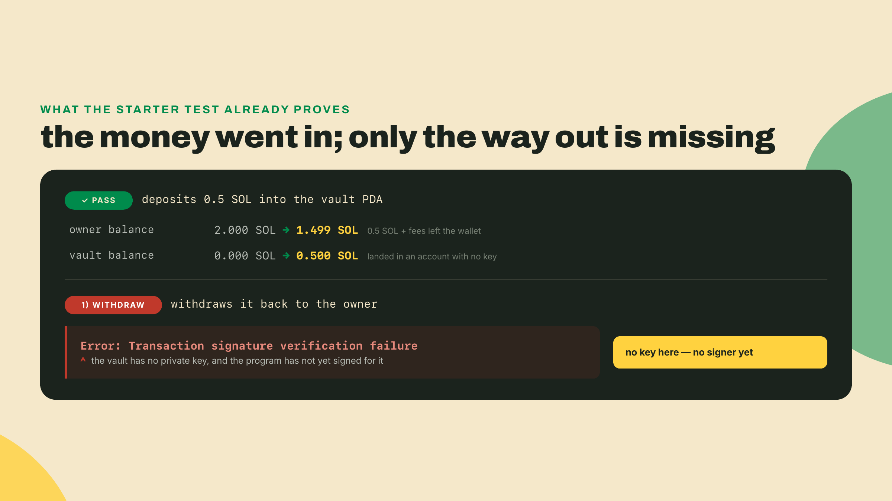
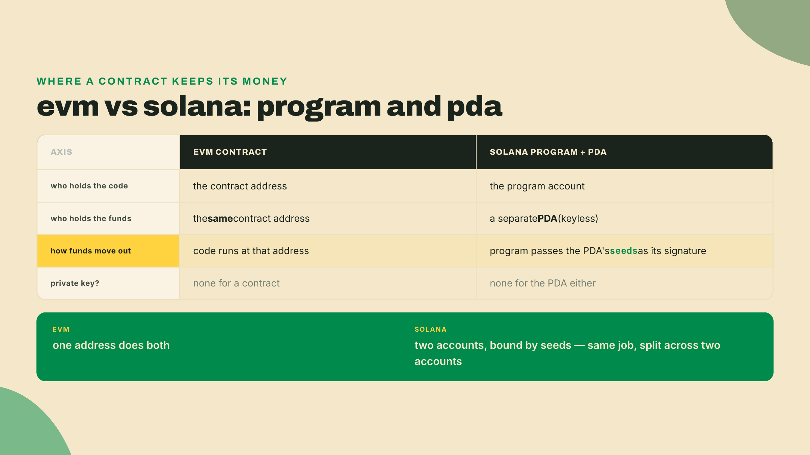
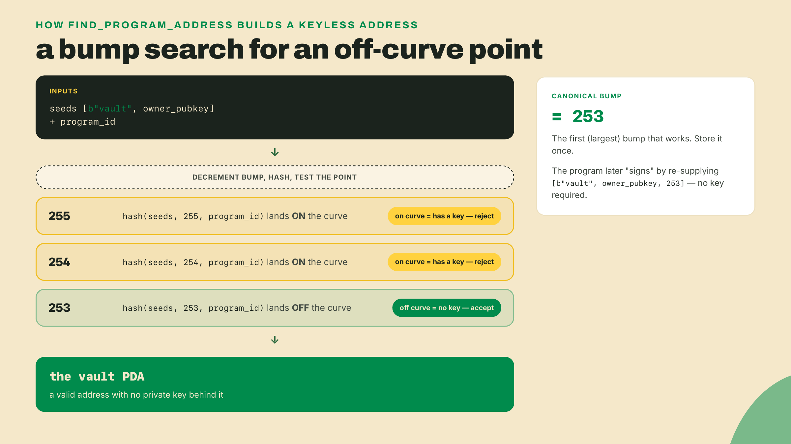
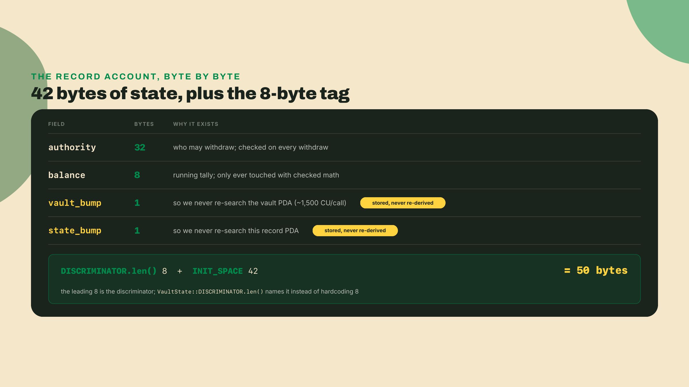
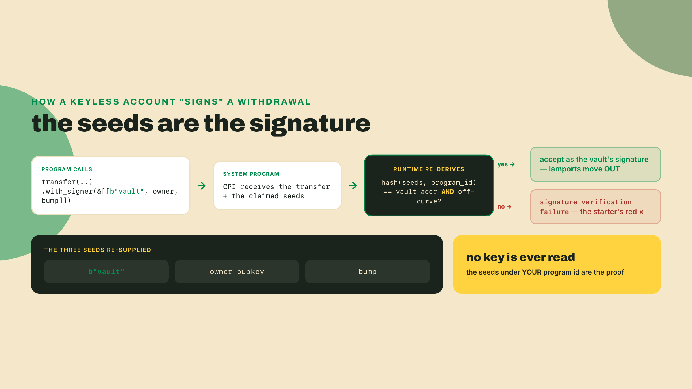
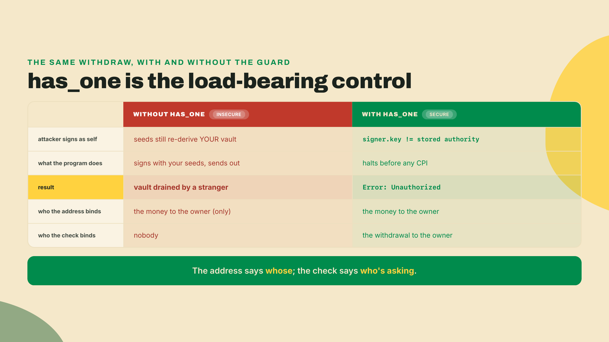
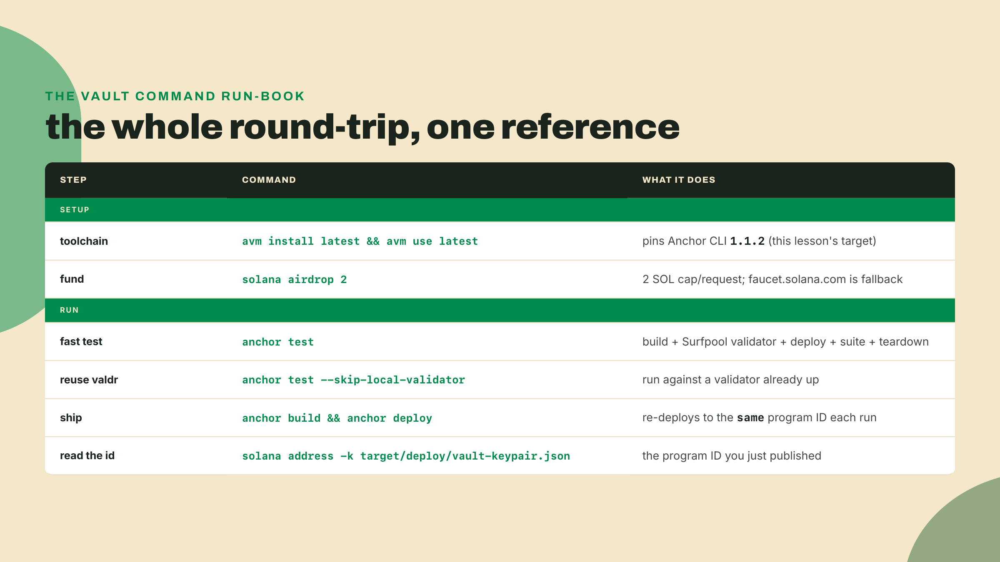
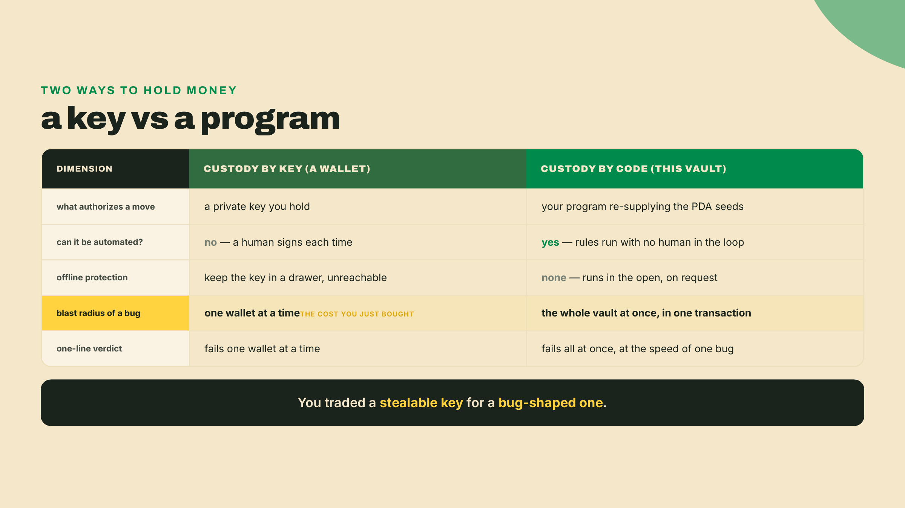
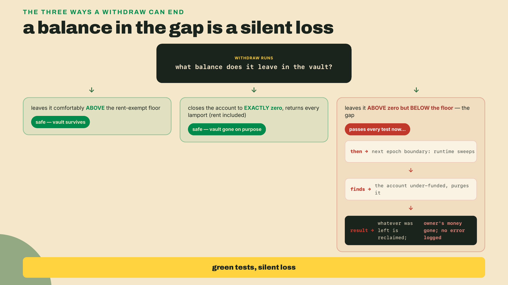
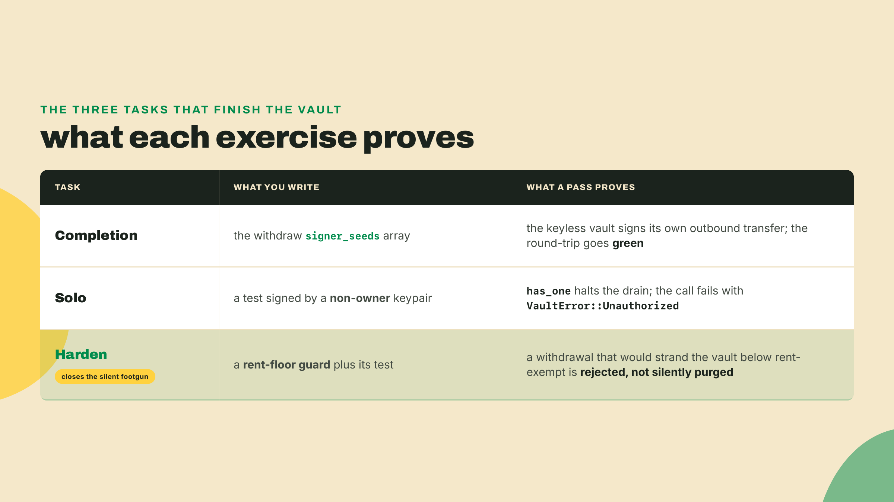

# A vault only its program can open

Last module you made a bet and won it. The throughput bet got you a live Solana program that stored a single number, and the price of Solana's parallel execution was declaring every account you touch up front, so the scheduler can prove two transactions won't collide before it runs them side by side. Those declared accounts were empty scaffolding then. Now they start holding real SOL.

Here is the problem with every wallet you have built so far. Each one is exactly one stolen key away from empty. Leak the key, sign the wrong transaction once, and the funds are gone with no appeal and no undo. So put the SOL somewhere there is no key to steal: an account whose only authorized signer is your program's own code. Then try to drain it from the wrong wallet, and watch the chain refuse.

Don't take my word for any of it. Open the starter and run the test.

```bash
cd toolkit/vault        # fresh vault starter, last lesson's program does not carry over
anchor test
```

The tail of the output:

```
 vault
 ✔ initializes a per-owner vault (409ms)
 ✔ deposits 0.5 SOL into the vault PDA (517ms)
 1) withdraws it back to the owner

 2 passing (3s)
 1 failing

 1) vault withdraws it back to the owner:
 Error: failed to send transaction: Transaction signature verification failure
```

Two green checks and one red X, and the red one is the entire lesson. Read the three result lines top to bottom, because each is a piece of state you now own. The first check initialized a per-owner vault: a record account now exists on chain, tagged to your wallet and ready to track a balance. The second check deposited half a SOL and passed, which means money moved out of your wallet and into an account you have never held a key for, and the runtime raised no objection at all. The third check tried to send that same half-SOL back to you, and the chain answered with a signature verification failure.

Sit with why that exact pairing happens. Deposit succeeds and withdraw fails in the same file, against the same account, written in the same style. That asymmetry is not a flaw in the starter; it is the shape of the whole problem drawn in two lines of test output. The account the withdraw tries to move money *out of* has no private key, so it cannot produce the signature a transfer demands, and nobody has yet taught the program to sign in its place. The deposit never needed a signature from the vault because money flowing *in* is the sender's decision alone. That single red line is the thing you will fix, and by the end of the lesson you will have written the one array that turns it green.

**Never written a line of Rust? Good, you do not need to.** Read this lesson the way you read a recipe: follow the steps and you finish with a working vault. Three things are about to show up on screen, and not one of them asks you to be a systems programmer. The first is Rust, the language Solana programs are written in. You will read far more of it than you type, and every line you do type is handed to you. The second is those `#[...]` tags stacked above each block, called macros: treat them as pre-written machinery you stamp onto your code, so the framework generates the tedious parts instead of you. The third is the PDA, and here is the whole idea in one breath: an address with no password, that only your program is allowed to use. Hold those three and every code block below reads as a recipe, not a wall.



## What you just watched, named

The account holding your half-SOL is a **Program-Derived Address**: a PDA, an account whose address is computed from your program's ID plus a handful of seeds, and which has no private key at all. That last clause is the whole trick, so let me say the plain version once. A PDA is an address with no private key that only your program is allowed to sign for. Deposit worked because sending money *into* an account never needs the recipient's signature. Withdraw failed because sending money *out* does, and there is no key to produce one.

If you're coming from the EVM, this is the one mental move that trips everyone. Over there, a contract simply holds funds at its own address, and the same address that stores the code also stores the balance. Solana splits that single thing into two. The code lives in one account, the program. The money lives in another, the PDA. And the program proves it may move the PDA's money not with a signature from a key, but by handing the runtime the exact seeds the address was built from. Name that difference out loud now, because half of Solana's account model is downstream of it.



## Why the vault has no key by construction

Here's the part that sounds like a paradox until you see the mechanism. Every ordinary Solana address is an ed25519 public key, and every public key has exactly one matching private key sitting on the ed25519 curve, the math object those keypairs are generated on. Hold the private key, you can sign. That is what an address *is* on this chain: a point on a curve with a secret twin.

Building an address that provably nobody can sign for means going the other way. You pick one that is deliberately *not* a valid point on that curve. A PDA has no private key by construction: it is an address chosen to fall off the ed25519 curve, which is exactly why the runtime is willing to let a program, and only that program, sign for it. There is no secret twin to steal because the address was engineered to have none.

The engineering is a short search. `find_program_address` takes your seeds (say `b"vault"` and the owner's public key) plus your program ID, appends one extra byte called the bump, and hashes the whole thing. If the resulting 32 bytes happen to land on the curve, that address would have a private key, which is forbidden, so it throws that bump away, subtracts one, and tries again. It counts the bump down from 255 until it finds the first value that produces an off-curve address. That first working value is the **canonical bump**: the single, largest bump that yields a valid, keyless PDA for those seeds. Store it once and you never search again.



## The layout: one record, one vault

A `SystemAccount` PDA like our vault holds lamports and nothing else, so it has nowhere to store its own bump. That's fine: we keep the bump, plus the owner and a running balance, in a second small account, the record. Two PDAs per user, then. One holds the money and stays keyless. One holds the bookkeeping and gets initialized once.

Anchor exists to make that record account painless. The framework grew out of Project Serum's toolchain and was created by Armani Ferrante, and its entire job is to hide the byte-layout and signer-seed plumbing you are about to touch by hand.

**What Anchor is doing for you here.** Strip the framework away and this one small record account is an afternoon of fiddly work. You would compute its exact byte size by hand, write the code that turns your struct into raw bytes and back, derive the PDA address yourself, call the System Program to allocate and fund the account, and tag it with an 8-byte marker so a later read can tell your data from anyone else's. Anchor does all five from the annotations you are about to read. `#[account]` handles turning the struct to bytes and back, `#[derive(InitSpace)]` does the size math, the `init` constraint does the allocate-and-fund, and the `seeds` plus `bump` pair does the derivation. Your job shrinks to naming the fields and naming the seeds. That is the bargain: you accept Anchor's conventions, and in return you stop hand-writing the plumbing.

Here is the record struct, walked field by field.

```rust
#[account]
#[derive(InitSpace)]
pub struct VaultState {
    pub authority: Pubkey,   // 32 - the only key allowed to withdraw
    pub balance: u64,        //  8 - running tally of deposited lamports
    pub vault_bump: u8,      //  1 - canonical bump of the lamport-holding PDA
    pub state_bump: u8,      //  1 - canonical bump of this record PDA
}
```

`#[derive(InitSpace)]` reads those field types and generates a `VaultState::INIT_SPACE` constant totaling their bytes: `32 + 8 + 1 + 1 = 42`. When you create the account you ask for `VaultState::DISCRIMINATOR.len() + VaultState::INIT_SPACE`, which resolves to `8 + 42 = 50` bytes. That leading `DISCRIMINATOR.len()` is the Anchor account discriminator, an 8-byte tag Anchor prepends to every account so it can tell a `VaultState` from any other struct on read. Naming it `DISCRIMINATOR.len()` instead of a hardcoded `8` is the Anchor 1.0-idiomatic form: since v0.31 the discriminator length is no longer fixed at 8, so you let the type report its own length. You will still see `8 + VaultState::INIT_SPACE` in older code; it computes the same 50 here, but the named form is the one that stays correct if the discriminator ever changes.

Now the `initialize` instruction. It creates the record, seeds the vault so Anchor can hand us its bump, and writes both canonical bumps into state so no later instruction ever has to search again.

```rust
#[derive(Accounts)]
pub struct Initialize<'info> {
    #[account(mut)]
    pub owner: Signer<'info>,

    #[account(
        init,
        payer = owner,
        space = VaultState::DISCRIMINATOR.len() + VaultState::INIT_SPACE,
        seeds = [b"state", owner.key().as_ref()],
        bump
    )]
    pub vault_state: Account<'info, VaultState>,

    #[account(seeds = [b"vault", owner.key().as_ref()], bump)]
    pub vault: SystemAccount<'info>,

    pub system_program: Program<'info, System>,
}

pub fn initialize(ctx: Context<Initialize>) -> Result<()> {
    let state = &mut ctx.accounts.vault_state;
    state.authority = ctx.accounts.owner.key();
    state.balance = 0;
    state.vault_bump = ctx.bumps.vault;         // canonical bump, stored once
    state.state_bump = ctx.bumps.vault_state;
    Ok(())
}
```

Walk the accounts struct in the order the runtime processes it, because every field is doing a specific job. The `owner` is marked `mut` because it is also the `payer`: creating the record account costs lamports, and those come out of the owner's balance. The `vault_state` constraint carries `init`, which is the heavy one. It tells the System Program to allocate `VaultState::DISCRIMINATOR.len() + VaultState::INIT_SPACE` bytes (50), assign the fresh account to your program as its owner, and fund it to the rent-exempt minimum, all before a single line of your instruction body runs. Its `seeds` and bare `bump` also make it a PDA, derived from `b"state"` and the owner's key, so there is exactly one record per owner and nobody can be tricked into creating two. The `vault` account carries no `init`: you are not allocating it in this instruction, only deriving its address so Anchor computes and hands back its canonical bump. The `system_program` rounds out the list because `init` is, under the hood, a CPI into it.

By the time control reaches the function body, the record account already exists on chain and its bytes are zeroed. Now you populate it, and the order tells the story. `state.authority` records who owns this vault from here on; every future withdraw is checked against this exact field. `state.balance` starts at zero, because no deposit has landed yet. Then the two assignments that pay for themselves: `state.vault_bump = ctx.bumps.vault` and `state.state_bump = ctx.bumps.vault_state` lift the canonical bumps Anchor just searched for out of the transient `ctx.bumps` map and write them into permanent account storage. That copy is the whole optimization in miniature.

The bare `bump` in each constraint (no value after it) tells Anchor to run `find_program_address` for you and expose the result on `ctx.bumps`. That search costs compute, and storing the answer instead of repeating it on every future call saves roughly 1,500 compute units per access. That's the third footgun on this lesson's list, prevented in one line: recomputing the PDA bump every call, when the canonical bump has been sitting in state the whole time.



## Deposit: an ordinary transfer in

Depositing is the boring half, and boring is the point. You already know it works, because the starter's deposit test was green. Every balance on Solana is counted in **lamports**, the smallest unit of SOL: one SOL is 1,000,000,000 of them. The name is a quiet credit. The lamport is named for Leslie Lamport, whose Byzantine-generals and Paxos work underpins how validators agree at all.

Moving lamports from the owner into the vault is a **cross-program invocation**, a CPI: your program calling into another program, here the System Program, in the middle of its own instruction. Anchor gives you a typed helper for exactly this transfer.

```rust
use anchor_lang::system_program::{transfer, Transfer};

pub fn deposit(ctx: Context<Deposit>, amount: u64) -> Result<()> {
    transfer(
        CpiContext::new(
            ctx.accounts.system_program.key(),
            Transfer {
                from: ctx.accounts.owner.to_account_info(),
                to: ctx.accounts.vault.to_account_info(),
            },
        ),
        amount,
    )?;

    let state = &mut ctx.accounts.vault_state;
    state.balance = state
        .balance
        .checked_add(amount)
        .ok_or(VaultError::Overflow)?;
    Ok(())
}
```

Trace what `transfer` actually does, because the same three-part shape returns in every CPI you will ever write. First, `CpiContext::new` bundles two things: the program you are calling into, passed as `system_program.key()` (a `Pubkey` in Anchor 1.x), and a typed `Transfer` struct naming the two accounts that call touches, `from` and `to`. Second, you hand that context plus the `amount` to the `transfer` helper, which serializes it into a System Program instruction and invokes it. Third, the System Program runs inside your transaction, verifies the `from` account authorized the move, shifts the lamports, and returns control to you at the very next line.

The reason this CPI needs no special signing is the `from` account. The owner signed the outer transaction, and the System Program sees that signature carried into its own frame, so it moves the money without complaint. Hold that thought, because it is precisely the piece that will be *missing* in withdraw, where `from` is the keyless vault instead of a live signer.

The CPI moves lamports, but it does not touch your `balance` field. That running tally in `vault_state` is your own bookkeeping, invisible to the System Program, so you update it by hand in the same instruction. Notice the last three lines and never write them any other way. That `checked_add` is not decoration. Bare `+` on a `u64` in a Solana program does not throw when it overflows on a release build; it wraps silently around to a tiny number, and a balance that wraps is a balance an attacker can play with. Checked arithmetic is mandatory in program code, and so is the rule that goes with it: no `unwrap()`, no `expect()`. You return an error, you never panic. `checked_add(amount).ok_or(VaultError::Overflow)?` is the whole pattern, and the fourth footgun on the list, unchecked add or subtract on the tracked balance, dies right there.

## Withdraw: teaching the vault to sign

This is the instruction that failed, and the reason it failed is the reason PDAs exist. The vault holds the money and has no key. A System Program transfer moving money *out* of an account demands that account's signature. So the program has to sign on the vault's behalf, and it does it by proving it knows the seeds the address was born from.

The mechanism is a re-supply of the recipe. The program hands the runtime the exact ingredients the address was built from: the byte string `b"vault"`, the owner's public key, and the canonical bump. The runtime re-runs the derivation, confirms those seeds produce this exact address under this exact program ID, and accepts that as the vault's signature. No key is ever involved, and no other program on the chain can forge it, because only your program can present seeds that hash to a PDA under your program's ID.

That seeds array is the TODO in the starter. Here it is, filled in.

```rust
pub fn withdraw(ctx: Context<Withdraw>, amount: u64) -> Result<()> {
    let authority_key = ctx.accounts.vault_state.authority;
    let bump = ctx.accounts.vault_state.vault_bump;

    // The vault has no private key; its seeds ARE its signature.
    let signer_seeds: &[&[&[u8]]] =
        &[&[b"vault", authority_key.as_ref(), &[bump]]];

    transfer(
        CpiContext::new(
            ctx.accounts.system_program.key(),
            Transfer {
                from: ctx.accounts.vault.to_account_info(),
                to: ctx.accounts.authority.to_account_info(),
            },
        )
        .with_signer(signer_seeds),
        amount,
    )?;

    let state = &mut ctx.accounts.vault_state;
    state.balance = state
        .balance
        .checked_sub(amount)
        .ok_or(VaultError::Overflow)?;
    Ok(())
}
```

The only difference between a transfer that moves your money and one the chain rejects is `.with_signer(signer_seeds)`. That method is what turns a plain CPI into a PDA-signed CPI. The `program_id` you pass to `CpiContext::new` is `ctx.accounts.system_program.key()`, a `Pubkey`: that is the type `CpiContext::new` takes for the program in Anchor 1.x, not an `AccountInfo` (hand it `.to_account_info()` and the program will not compile). When you later move SPL tokens instead of SOL you switch to a different helper, `transfer_checked`, which also takes the mint and its decimals, while native SOL through the System Program stays on the plain `transfer` shown here. Same shape, different program, different helper.



## The one check between the funds and everyone else

Signing is solved. The next decision the code has to make is who is allowed to make the program sign, and that decision is custody itself, not plumbing. Look at the withdraw accounts, and look hard, because this is custody code and the check below is load-bearing, not a detail.

```rust
#[derive(Accounts)]
pub struct Withdraw<'info> {
    #[account(mut)]
    pub authority: Signer<'info>,

    #[account(mut, has_one = authority @ VaultError::Unauthorized)]
    pub vault_state: Account<'info, VaultState>,

    #[account(
        mut,
        seeds = [b"vault", vault_state.authority.as_ref()],
        bump = vault_state.vault_bump
    )]
    pub vault: SystemAccount<'info>,

    pub system_program: Program<'info, System>,
}
```

The vault is derived from `vault_state.authority`, the owner stored at init, so the money account is bound to the person who created it no matter who submits the transaction. `has_one = authority` then checks that the signer's key equals the stored `authority`. Strip that one constraint and here is what happens: an attacker passes your record and your vault as accounts, signs with their own keypair, and the program cheerfully re-derives your vault, signs for it with your seeds, and forwards your SOL to them. Nothing else stops it. The seeds bind the vault to you; the authority check is the only thing binding the *withdrawal* to you.

I have shipped that bug. Early on, in a hackathon vault, I left the check off because the PDA seeds already used the owner's key and I reasoned the address alone was protection enough. It was not. The address said whose money it was; it said nothing about who was asking. A friend drained my devnet vault from a second wallet in about thirty seconds to make the point, and I have written the authority check first, every time, since. Do not treat it as a formality. It is the fifty lines of trust the whole module is about, compressed into one constraint.



## Run it for real, on devnet

A test passing in-process is a promise; devnet is the proof. First, the toolchain. This lesson is written against Anchor CLI 1.1.2. If `anchor --version` disagrees, install the current toolchain through AVM, Anchor's version manager:

```bash
cargo install --git https://github.com/solana-foundation/anchor avm --force
avm install latest && avm use latest
```

`anchor test` is doing more than running mocha. It builds every program in the workspace, spins up a local validator (in Anchor 1.0 that's Surfpool, not the old `solana-test-validator`), deploys your programs to it, runs the suite, then tears the whole thing down. Pass `--skip-local-validator` to point it at a validator you already have running instead. The default Rust test template is now LiteSVM, an in-process VM that executes your program with no validator at all, which is why the checks above returned in milliseconds.

To move the same round-trip onto the live devnet, set the cluster and fund a wallet.

```bash
# Anchor.toml -> [provider] -> cluster = "devnet"   (or: --provider.cluster devnet)
solana airdrop 2
anchor build
anchor deploy
```

The airdrop caps at 2 SOL per request; if it's dry, the Solana Foundation web faucet is the fallback. One thing that will save you a confused hour: unlike `solana program deploy`, `anchor deploy` re-deploys to the *same* program ID on every run, reading it from `target/deploy/vault-keypair.json`. You can confirm which ID you're publishing with `solana address -k target/deploy/vault-keypair.json`. Then run your deposit and withdraw against devnet and read the balances change on a public explorer, not just in a log line you wrote yourself.



## The trade-off you just bought

Every design in this course gets its cost named, and this one's bill is the whole reason vaults are worth teaching. You moved custody from a key to a program, and that buys real things: automation, rules the funds obey without a human in the loop, an account nobody can drain by stealing a phrase off a sticky note. A key you can keep offline in a drawer and no online attacker can reach it. But a withdraw check you get slightly wrong drains the entire vault in a single transaction, and there is no drawer to hide the program in: it runs in the open, on request, forever. Custody by key fails one wallet at a time. Custody by code fails all at once, at the speed of one bug.



There's a second, quieter cost, and it's the one that eats beginners. **Rent-exemption**: an account only stays alive on Solana if it holds at least a minimum balance, and that minimum scales with how much data the account stores. Your vault is a `SystemAccount` holding no data of its own, so its floor is small, but it is not zero, and that non-zero floor is the trap.

Walk a withdraw through it. Say the vault holds one SOL and the owner asks to pull almost all of it out, leaving only a sliver behind. The transfer succeeds, the balance math checks out, and every test you wrote passes clean. Then, at the next epoch boundary, the runtime sweeps for accounts that have fallen below their rent-exempt minimum, finds your under-funded vault, purges it, and reclaims whatever was left. The owner's money is simply gone, and nothing in your program logged an error, because by its own rules your program did nothing wrong. The rule it broke belongs to the runtime, not to your code.

So a correct withdraw has only two safe endings. It either leaves the vault comfortably above the rent-exempt floor, or it closes the account out to exactly zero on purpose and returns every last lamport, the rent deposit included, to the owner. Anything in the gap between those two, a balance above zero but below the floor, is a slow leak with a deadline attached. That's the second footgun on the list, and it is the meanest kind: it passes every green check on your machine and then loses somebody's money on a Tuesday, in production, with no stack trace to catch it.



Two more sharp edges worth knowing exist. Duplicate mutable accounts are now disallowed by default, so you can't accidentally pass the same writable account into two slots; you opt back in with the `dup` constraint on the rare instruction that genuinely needs it. And the client you'll reach for next lesson does not talk to this program by hand: it is generated straight from this program's IDL and speaks to it through `@solana/kit`, so you never hand-write a call. File both away.

## Do it yourself

The starter is where you finish this.



**Completion.** Fill in the withdraw instruction's `signer_seeds` array so the vault PDA signs its own outbound transfer, and make the failing test pass. It's the one line you saw above: `&[&[b"vault", authority_key.as_ref(), &[bump]]]`. Run `anchor test`, watch the red X turn green, and watch the 0.5 SOL complete the round-trip back to the owner.

**Solo.** The authority check above is the guard. Prove it works. Write a test that submits a withdrawal signed by a *different* keypair against the owner's vault, and assert it fails with `VaultError::Unauthorized`. A passing solo means the vault drains for the owner and refuses everyone else, on devnet, with your own error message.

**Harden.** The rent-exempt trap from earlier is not hypothetical, and right now nothing in `withdraw` stops it. Close it. Add a guard at the top of the instruction that reads the vault's own rent-exempt floor, `Rent::get()?.minimum_balance(0)` (zero bytes, because the `SystemAccount` vault stores no data of its own), and rejects any withdrawal that would leave the vault holding something above zero but under that floor. Return a new `VaultError::BelowRentExempt` instead of letting the transfer through. Then write the test that fires straight at it: deposit half a SOL, try to withdraw an amount that would strand the vault a handful of lamports below its minimum, and assert the call fails with `BelowRentExempt`. Without the guard, that withdrawal passes green and the account is swept at the next epoch, taking the remainder with it. With the guard, the silent loss is impossible to write. A footgun this quiet is one you can only prove you closed by aiming a test at it.

Checkpoint, from memory, one sentence out loud: why does the vault need no private key of its own? A good answer lands on the mechanism, not the vibe. The program signs for the account by re-supplying its seeds, so a private key wouldn't add security, it would only add a second way in, a liability the design deliberately doesn't have.

A vault only its program can open is still a vault only a Rust test can open. Next, a TypeScript bot picks up these exact instructions, `initialize`, `deposit`, `withdraw`, and starts driving your vault from outside the chain, no `anchor test` harness holding its hand. The keyless account you just built is about to get its first real client.
