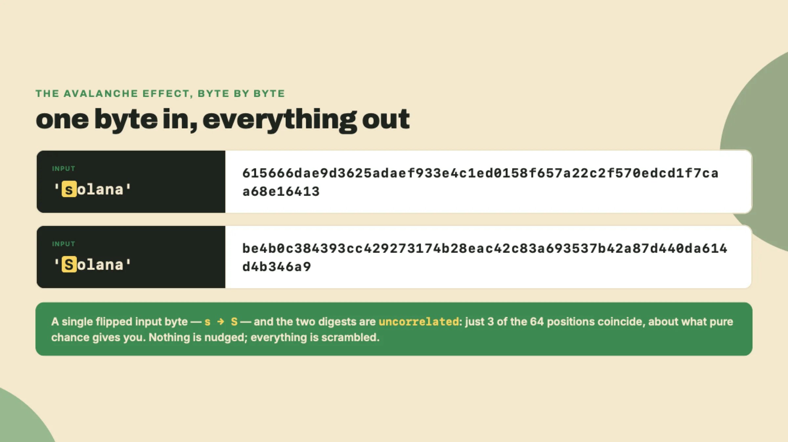
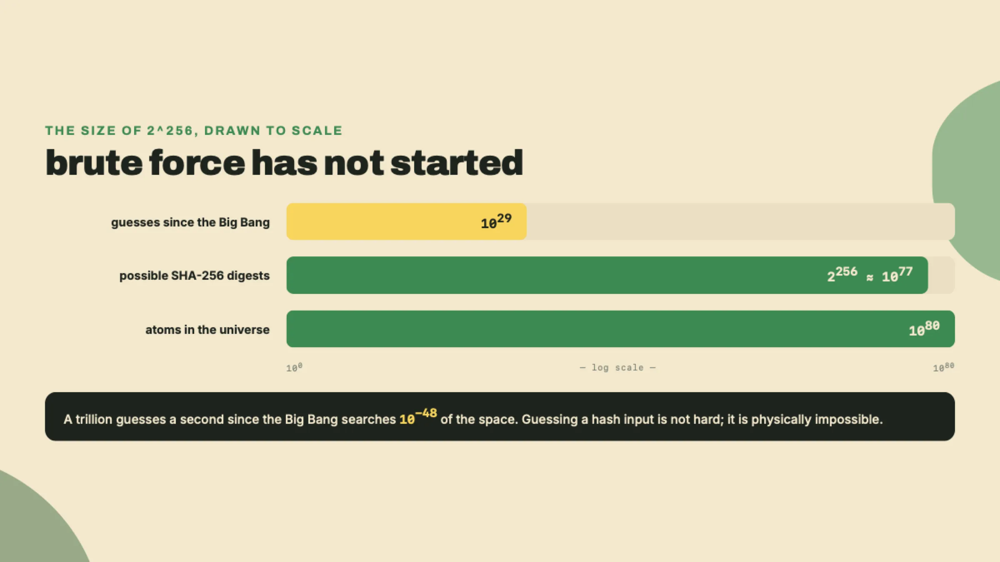
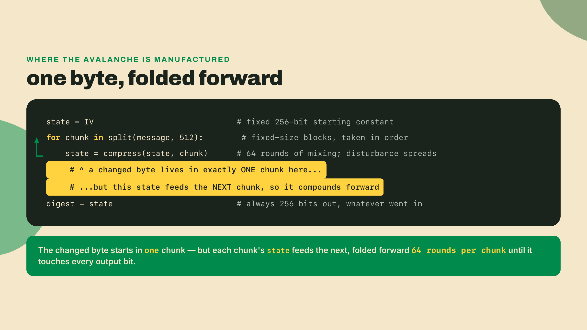
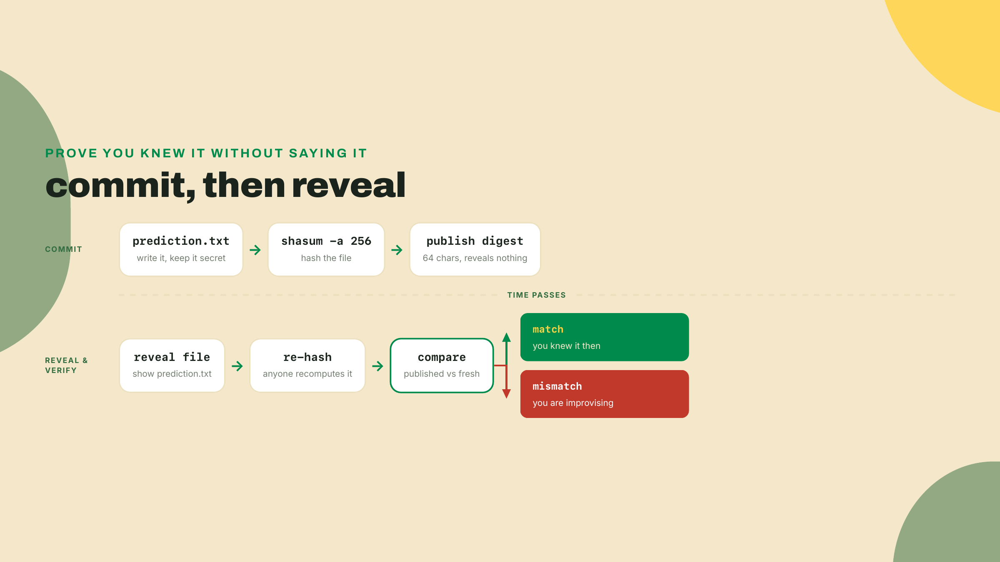
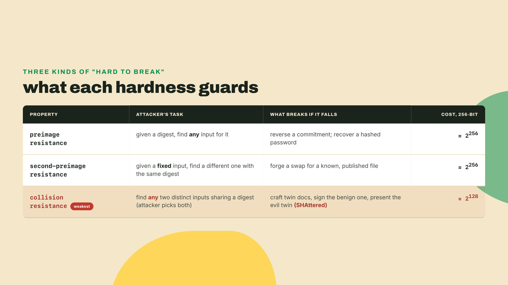
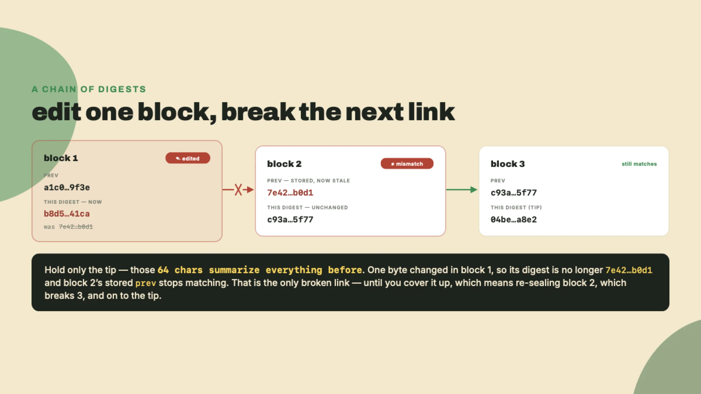
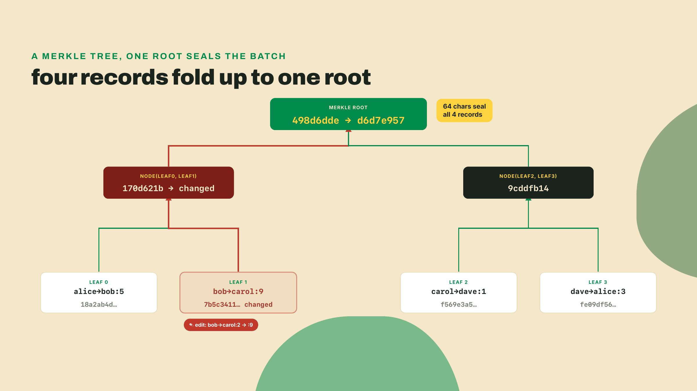

# Hash everything: the 64 characters under every blockchain

Last lesson ended on a promise: you run the thing first, and it gets named after. The graveyard companies, DigiCash and the rest, all had access to the primitive you're about to run, and it wasn't what killed them. It's the foundation everything else in this course stands on, which is exactly why it goes first. Not consensus, not coins, not cryptography-with-a-capital-C. One function. Terminal open. Go:

```bash
printf 'solana' | shasum -a 256
```

You get `615666dae9d3625adaef933e4c1ed0158f657a22c2f570edcd1f7caa68e16413`.

Run it again. Same 64 characters. Run it tomorrow, on a different laptop, in a VM on the other side of the planet, and you get the same 64 characters, every time, forever. Now notice everything that didn't matter: your username, your OS, the time of day, whether you were online at all. No account, no server, no shared state anywhere in sight. Stop and let that register, because it's genuinely strange: a one-line command just made you a promise about every computer on Earth, and it will keep it.

Now change one letter:

```bash
printf 'Solana' | shasum -a 256
```

`be4b0c384393cc429273174b28eac42c83a693537b42a87d440da614d4b346a9`.

One byte of input changed. Compare the outputs character by character: they might as well be strangers. Not "a few characters shifted." A total, unrecognizable scramble, from a single capital letter.



Third experiment. Same computation from Python, so you can see there's no shell trickery:

```python
import hashlib
print(hashlib.sha256(b"solana").hexdigest())
```

Same `615666da...` output. `shasum` and `hashlib` are independent implementations written by different people in different decades, sharing no code, no config, no vendor. They agree because they're computing the same math, not because they coordinate. That matters more than it looks: you can check a stranger's claim without trusting the stranger's tooling, and the stranger can check yours the same way. The agreement is mathematical, not social.

One more, because this is where it gets useful. Hash a file. Any file, the bigger the better:

```bash
shasum -a 256 some-huge-video.mp4
```

A 4 GB video and a 6-byte string produce the same shape of answer. The output is called a **digest** (the fixed-length fingerprint a hash spits out): a SHA-256 digest is 256 bits rendered as 64 hex characters (hexadecimal, base-16, digits 0 through 9 plus a through f), no matter what went in. The whole universe of possible inputs, every file, every string, every blockchain that will ever exist, maps into fingerprints of identical, tiny size. That fixed size is doing quiet work: 64 characters are cheap to store, cheap to compare, and small enough to embed inside other data. Hold that last one. It's the entire second half of this lesson.

## Naming what you just watched

You've now personally observed the three properties that make a **cryptographic hash function** (a function engineered to have exactly these behaviors, on purpose) worth building financial systems on. Time to give them their names.

**Deterministic.** Same input, same digest, everywhere, forever. You watched two unrelated implementations agree; the property says every correct implementation ever written will too. This is what turns the output from a summary into a *fingerprint*: two parties who have never met can each hash a document and compare 64 characters instead of gigabytes, and a match settles it. Notice what that quietly removes: nobody needed a trusted third party to vouch for the files. The math vouched. That removal is the seed of everything the opener said was impossible, and it fires again every time a node re-checks a stranger's work later in this course.

**Avalanche.** The one-capital-letter demo, and the reason your two digests share nothing worth circling. Any change to the input, however small, scrambles the entire output; the formal name is the avalanche effect (one flipped input bit flips, on average, half the output bits). The practical consequence: you cannot sneak an edit past a stored digest, because there's no such thing as a "small change" to a hash. A tampered contract with one moved decimal point rings exactly as loud as a complete rewrite, which is precisely the alarm behavior you want standing guard over money.

**One-way.** Given `615666da...`, there's no procedure to recover `solana` except guessing inputs and checking. Put numbers on "guessing": 256 bits means 2^256 possible digests, roughly 10^77, within a few orders of magnitude of the estimated count of atoms in the observable universe. Run a trillion guesses per second, every second since the Big Bang, and you'll have tried about 10^29 inputs, which against 10^77 rounds cleanly to having not started. Forward takes a microsecond. Backward takes never. This asymmetry, trivial to compute and infeasible to invert, is the trapdoor all of applied cryptography walks through, and the rest of the course keeps spending it.



## Why one byte avalanches

The demo left one thing hanging: how does flipping a single letter blow up the entire output? You don't need the math to get the intuition, and the intuition is worth having, because it's the same shape you'll meet again in a minute when we fingerprint a whole batch of records.

SHA-256 doesn't stare at your whole input at once. It chews it in fixed-size chunks, 512 bits at a time, and keeps a running internal state of 256 bits that starts from a fixed constant. Each chunk gets folded into that state by a **compression function** (a fixed routine that mixes one chunk into the running state through 64 rounds of shifts, additions, and XORs). Then the updated state feeds forward into the next chunk's round of mixing. Chunk in, mix, carry the state forward, repeat, and whatever state survives the last chunk is your digest. This build-a-big-hash-from-small-steps shape has a name, the Merkle-Damgard construction (a way to hash any-length input by folding fixed-size chunks into a fixed-size state), and it's why the output is always 256 bits no matter how much you fed in.

Here's where the scramble comes from. Change one input byte and you've changed exactly one chunk. That chunk runs through all 64 rounds of mixing, and each round smears its disturbance across more of the 256-bit state. That already-scrambled state then feeds the next chunk, which smears it further, on to the end. One flipped bit doesn't stay local. It compounds through every round after it, so by the final chunk there's effectively no output bit it hasn't touched. The scramble you saw between `solana` and `Solana` isn't a special case; it's the machine doing exactly what its wiring forces it to do.



Notice the shape, because it recurs: a fixed-size state, fed forward, each step committing to everything before it. A blockchain is that same shape one level up, with blocks sitting where the compression function sat. Hold the pattern.

## Prove it before you say it

Determinism plus one-wayness buys a party trick that sounds impossible on first hearing: proving you knew something without revealing it. Try it. Write a prediction and hash it:

```bash
printf 'the module 3 live demo breaks on first run' > prediction.txt
shasum -a 256 prediction.txt
```

Now publish those 64 characters anywhere public: a group chat, a tweet, a git commit message. The digest reveals nothing about your sentence, because one-way. And it pins you completely, because deterministic plus avalanche: there's no second sentence you could later cook up that hashes to the same value. When the moment comes, reveal:

```bash
cat prediction.txt
shasum -a 256 prediction.txt
```

Anyone re-runs that second line against your revealed file and compares with what you posted weeks earlier. Match: you knew. Mismatch: you're improvising. Nobody trusted you at any point, and nobody needed to.



This move has a name, a **commitment** (you lock in a value now, reveal it later, and the digest keeps you honest in between), and it comes with one sharp edge worth naming immediately. If your secret is one of a few obvious strings, a skeptic just hashes every candidate and reads your answer straight off the digest. Watch it break:

```python
import hashlib
for guess in [b"yes", b"no"]:
    print(guess.decode(), hashlib.sha256(guess).hexdigest()[:16], "...")
```

```
yes 8a798890fe938171 ...
no 9390298f3fb0c5b1 ...
```

If you committed to a plain `yes`, anyone who suspected the menu precomputes both and matches yours. One-wayness protects unguessable inputs, never small menus. The standard fix is appending random bytes, a **salt** (unpredictable padding mixed in before hashing), then revealing them alongside the text:

```python
import hashlib

def commit(msg: bytes, salt: bytes) -> str:
    return hashlib.sha256(salt + msg).hexdigest()

salt = bytes.fromhex("9f86d081884c7d659a2feaa0c55ad015")  # real code: secrets.token_bytes(16)
print(commit(b"yes", salt))
```

Now the digest of `yes` is indistinguishable from the digest of anything else, because the skeptic can't guess the salt. A commitment is only as private as its input is unguessable, and salt is how you make a two-item menu unguessable again.

That upgrade buys a real mechanism: the sealed-bid auction, run with nobody trusted to hold the envelopes. Say Alice and Bob bid on the same lot. In the commit phase each publishes only the salted digest of their bid, so the numbers stay hidden while the bids are locked in:

```python
alice = commit(b"1200", bytes.fromhex("9f86d081884c7d659a2feaa0c55ad015"))
bob   = commit(b"1500", bytes.fromhex("a3f5c9e17b2d4e6f8a0b1c2d3e4f5061"))
print("alice:", alice)
print("bob:  ", bob)
```

```
alice: 05ce96812b65ee7a4af5b46cfed6d9319c9ce16d3536c4f354af21ae2d016ee4
bob: d50c3455fa5f7ae7ccf884b8517a1ece923875b0102c5a2f69aa6374da80c64f
```

Neither can see the other's number during bidding (one-way), and neither can change their own after seeing the other's (avalanche plus determinism: no second bid hashes to a digest you already published). In the reveal phase both open their salt and amount, everyone recomputes, and the high honest bid wins. The same trick runs a fair coin-flip: each side commits to a random bit, both reveal, and the result is the two bits XORed, so neither party could rig it alone.

Name the cost, because this one bites in production: a commitment binds the committer only if they eventually reveal. A bidder who dislikes where things are heading can simply refuse to open, stalling the whole auction. Real systems bolt on reveal deadlines and forfeitable deposits to punish that, none of which the hash gives you for free. File the whole pattern away, because next lesson's signatures are this trick with the ceiling raised.

This function did not come from Bitcoin. SHA-2, the family SHA-256 belongs to, was designed at the NSA; NIST published the final standard (FIPS 180-2) in August 2002. Government cryptography, built for verifying documents and communications, sat in the open toolbox for six years before anyone used it to make money. That's a pattern you'll see all course long: nothing in Bitcoin was new. The genius was the assembly.

And you've been trusting this exact machinery for years without noticing, because git identifies every commit by hash. Run this in any repo you have around:

```bash
git log --format='%H %s' -3
```

Every line starts with 40 hex characters, and every `git log` you've ever read is a chain of fingerprints, each commit committing to its parent. Fingerprints can also break, and git's did. Its original function, SHA-1, died in public when the first practical SHA-1 collision (SHAttered) was announced in 2017 by CWI Amsterdam and Google: two different PDFs, one digest. A **collision** (two inputs sharing one fingerprint) is fatal for a hash function, because a fingerprint two things can wear is no longer a fingerprint. That's why git migrated, and why this course uses SHA-256, which has no known practical collision. Hash functions aren't magic; they're engineering with a shelf life, and the industry watches that shelf date closely.

## Three flavors of hard

"Fatal" is doing a lot of work in that last paragraph, and it hides a distinction worth making sharp, because "hard to reverse" is really three different guarantees. A hash can lose one while keeping the others, and you've already used all three without separating them.

**Preimage resistance** is the one-wayness from the `615666da...` demo: given a digest, you cannot find any input that produces it. This is what hides the secret behind a commitment, and what lets a system store the hash of a password instead of the password.

**Second-preimage resistance** is subtler: given a specific document everyone already has, you cannot find a different document with the same digest. This is what stops someone swapping a known, published file for a forgery that keeps its fingerprint. The original is fixed, so the attacker has to hit its exact digest using different bytes.

**Collision resistance** is the strongest guarantee and the first to fall: you cannot find any two distinct inputs that share a digest, and crucially the attacker gets to choose both. That freedom is what SHAttered exploited: craft two PDFs together, one benign and one malicious, sharing a digest, get the benign one signed, then present the twin. The attacker's extra freedom is exactly why collisions are cheaper to hunt than preimages. A counting argument (the birthday bound) says you only need to search about 2^128 inputs on a 256-bit hash, not 2^256, because you're hunting for any matching pair, not a match to one fixed target. Halve the output size and you halve that exponent, which is why SHA-1's 160-bit digest (collision bound near 2^80, pushed lower by cryptanalysis) cracked while SHA-256's hasn't.



Keep the ranking in your head: if collision resistance holds, the other two almost always do, which is why "is it collision-resistant" is the question the industry actually tracks.

## From fingerprints to ledgers

Now connect this to the opener's problem. A blockchain is, at bottom, a list of blocks (batches of records) where **each block contains the digest of the previous block**. That's it. That one design decision does more work than any other in this course, so walk it slowly, with a villain.

Say Alice wants to rewrite history. She paid Bob in block 1, regrets it, and edits her copy of block 1 to erase the payment. Watch the properties fire in order. Avalanche: her edit, one field in one old record, scrambles block 1's digest entirely, so there was never any hope of a quiet touch-up. Determinism: everyone who re-hashes her block 1 computes the same new digest, so the damage isn't a matter of opinion. But block 2 *contains* block 1's old digest, embedded when block 2 was made, so block 2 no longer matches the block it points at; block 2's own digest sits inside block 3, which sits inside block 4, all the way to the tip. Her one edit didn't alter one record. It visibly broke every seal from that point forward.

Run the implication the other direction and it gets better. Anyone holding just the *latest* digest, 64 characters, small enough to read aloud on a phone call, can detect whether anything, anywhere in gigabytes of history, was touched. Re-hash the chain, compare one string, done. The tiny fixed size from the file demo is exactly what makes this cheap.



Be precise about what you now have, because the gaps matter as much as the win. Tamper-*evidence* is not tamper-*prevention*: nothing in the math stops Alice from re-running the sealing herself, recomputing every digest from her edit to the tip and presenting a chain that's internally perfect. The hashes prove "unchanged since sealing," never "this seal is the legitimate one." And nothing here says whose chain wins when two internally consistent histories disagree, or even what order events happened in. Those two gaps, who gets to seal and who wins, are the entire job of the Bitcoin module, and the fix turns out to be economic rather than cryptographic. For now, hold the bedrock: the reason thousands of strangers can even *argue* about a shared history is that the history carries its own seals.

## Fingerprinting a whole batch: Merkle trees

The chain commits each block to the one before it, which handles a sequence. But a block is not one record. It's a batch of thousands. So how do you fingerprint a thousand records into a single digest without re-hashing all thousand every time you want to check just one? You build a tree.

Hash each record into a leaf digest. Pair the leaves up and hash each pair into a parent. Pair the parents and hash those. Keep climbing, halving the count at every floor, until one digest is left at the top: the **Merkle root** (a single fingerprint that commits to the entire set of records beneath it). The root is to the batch what the previous-block digest is to the chain: 64 characters that seal everything under them.

Build one:

```python
import hashlib

def h(b: bytes) -> str:
    return hashlib.sha256(b).hexdigest()

def node(a: str, b: str) -> str:            # fold two child digests into a parent
    return h(bytes.fromhex(a) + bytes.fromhex(b))

def merkle_root(leaves: list[bytes]) -> str:
    level = [h(x) for x in leaves]          # every record becomes a leaf digest
    while len(level) > 1:                   # climb: hash pairs, floor by floor
        level = [node(level[i], level[i + 1]) for i in range(0, len(level), 2)]
    return level[0]                         # the last digest standing is the root

records = [b"alice->bob:5", b"bob->carol:2", b"carol->dave:1", b"dave->alice:3"]
print(merkle_root(records))
```

```
498d6ddea16e4e139d7c5d1aabf2152db816066abde7371619b6d5ab42e60c42
```

Now flip one character in one record, the way Alice tried to on the chain, and re-run:

```python
records[1] = b"bob->carol:9"   # a 2 becomes a 9: one leaf, one character
print(merkle_root(records))
```

```
d6d7e957bbd9140bc2d9cba9ca1fbb6496bcbbb68a4cfcd0c302e010f3c58b68
```

One touched leaf, and the root at the top is a total stranger. The avalanche you saw on a string now propagates up the tree: the changed leaf changes its parent, which changes its parent, which changes the root. Same behavior as the chain, one dimension up.



Here's the payoff the plain chain couldn't give you, and it's the reason light clients exist. To convince someone a single record sits in a batch of a thousand, you don't ship the thousand. You ship the record plus the handful of sibling digests along its path to the root, about ten of them for a thousand-leaf tree, and they re-hash just that path and check it lands on the root they already trust. Verify one record against a batch of a million by touching roughly twenty digests instead of a million. That's what lets a **light client** (a node that verifies transactions without storing the full chain) run on a phone: it holds roots, not history, and asks for short proofs on demand.

Name the cost. The root proves a record is *in the committed set*, and nothing more. It doesn't say the record is valid, that the batch is complete, or that two conflicting batches don't both exist. And the proof only works if everyone agrees on the leaf ordering and on how odd levels get padded. This toy assumes an even count at every floor; production trees duplicate the last leaf, and getting that convention wrong is a classic way to compute a root nobody else agrees with. Same lesson as always: the structure certifies membership, never truth.

## Build: `hashit`

Time to make the first tool of the toolkit: the repo that, module by module, grows into your capstone bot. It starts embarrassingly small, and that's the point. Every component of a cross-chain ops bot begins life as something you fully understand, and this one is fifteen lines.

```python
#!/usr/bin/env python3
"""hashit: sha256 for strings and files."""
import hashlib, sys
from pathlib import Path

def digest(data: bytes) -> str:
    # TODO(you): return the sha256 hex digest of `data`
    ...

if __name__ == "__main__":
    arg = sys.argv[1]
    p = Path(arg)
    data = p.read_bytes() if p.is_file() else arg.encode()
    print(digest(data))
```

Fill the TODO. It's one line, and you already ran it in the Python demo. The acceptance test is brutal and fair: `./hashit solana` must match `printf 'solana' | shasum -a 256` exactly, and so must a file, including a binary one. Three inputs, byte-identical or wrong. Hashes don't grade on a curve, and that's a feature: a verifier that's 99% sure is a verifier you can't build on.

If they disagree, you hashed different bytes, and here's my confession from when I learned this. I lost most of an hour convinced SHA-256 itself was broken, because `echo 'solana'` and `printf 'solana'` gave me different digests. They should:

```bash
echo 'solana' | shasum -a 256     # hashes 7 bytes: s o l a n a \n
printf 'solana' | shasum -a 256   # hashes 6 bytes
```

`echo` appends a newline, so I was hashing a seven-byte input and getting exactly the determinism I'd been promised. The hash was right the entire hour. That's precisely what makes your own byte-handling bugs so loud, and why the second classic footgun deserves respect too: hashing the hex *string* of a digest instead of the 32 raw bytes it represents. Both are deterministic. Both look plausible. Only one matches what everyone else computes, and once digests start living inside other digests (a Merkle root over raw child bytes, exactly like the demo above), that representation slip becomes a chain that quietly disagrees with the rest of the world.

## The trade-off

Every tool in this course gets its cost named; here's this one's, in two parts.

First: a hash proves *integrity*, not *truth*. It guarantees the bytes haven't changed since someone fingerprinted them. It cannot tell you those bytes were honest, accurate, or worth anything. Garbage in, immutably sealed garbage out. Blockchains inherit this limit wholesale, and it resurfaces with real money attached when oracles arrive in the EVM module: a chain can seal a price feed perfectly and still be sealing a lie. Keep those two words separate in your head, integrity and truth, because whole exploit categories live in the gap between them.

Second, subtler: the speed paradox. SHA-256 is fast on purpose, and that speed is what lets a node verify years of history in minutes; verification wants hashing as cheap as possible. Password storage wants the exact opposite, because there every guess an attacker makes should hurt, which is why a separate family of deliberately slow, expensive hashes exists (bcrypt, scrypt, Argon2: names for later, not today). Same mathematics, opposite fitness. The right property in one seat is a vulnerability in another, and "which seat is this" becomes a question you ask about every primitive from here on.

## Do it yourself

Extend `hashit` with a `--check` mode:

```bash
./hashit --check <file> <expected-digest>
```

Exit 0 on a match, nonzero with a complaint otherwise. You've built a file-integrity verifier, the same primitive package managers and release pages use when they publish checksums next to downloads, and the seed of the verification loop every bot in this course runs before acting on anything: never trust bytes you haven't fingerprinted against an expectation that arrived some other way.

Checkpoint before moving on, from memory: why does one changed byte scramble the whole digest, and what does that buy a ledger? Two sentences, out loud. A good answer names the avalanche effect in the first sentence (bonus for the fold-forward reason: one byte compounds through every later round) and lands on tamper-evidence, not tamper-prevention, in the second; extra credit if you can say where the previous block's digest actually lives.

So the toolkit can now prove bytes are untouched, seal a whole batch under one root, and even prove you knew something before you admitted it. What it can't do is prove *who* wrote them: a fingerprint has no author, and a commitment shows knowledge, never identity. Next lesson you make an identity out of 32 random bytes, sign a message a stranger can verify without trusting you, and discover you've accidentally built the thing crypto exchanges charge you to custody: a wallet. Happy hacking.
