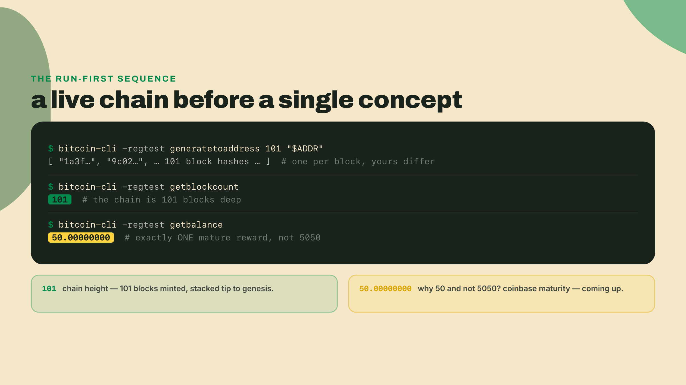
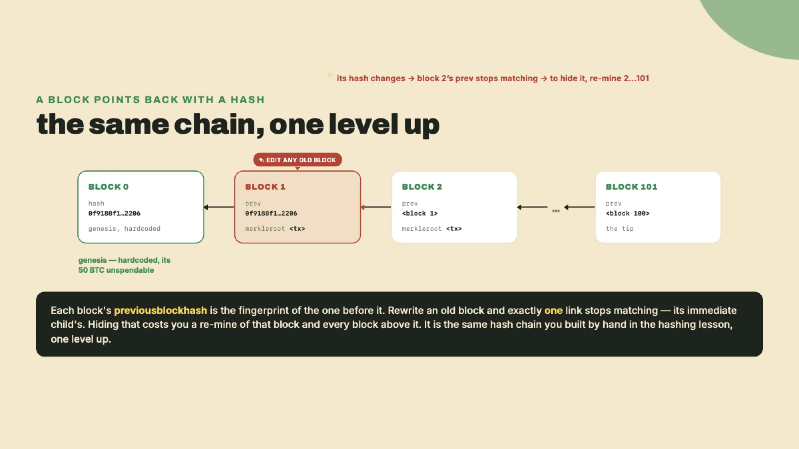
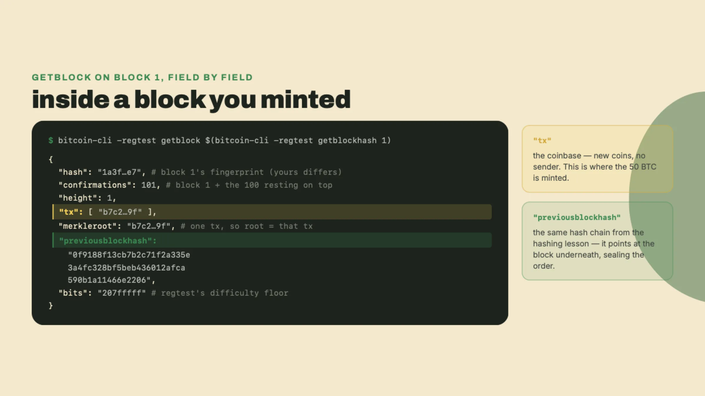
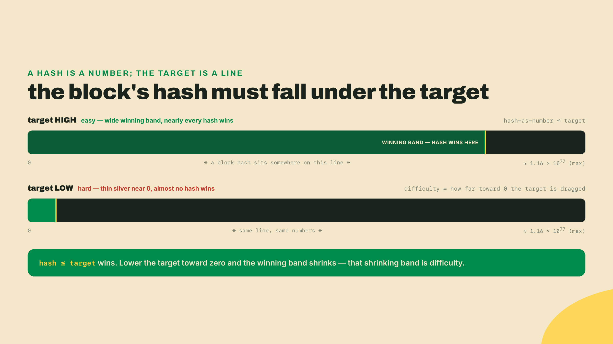
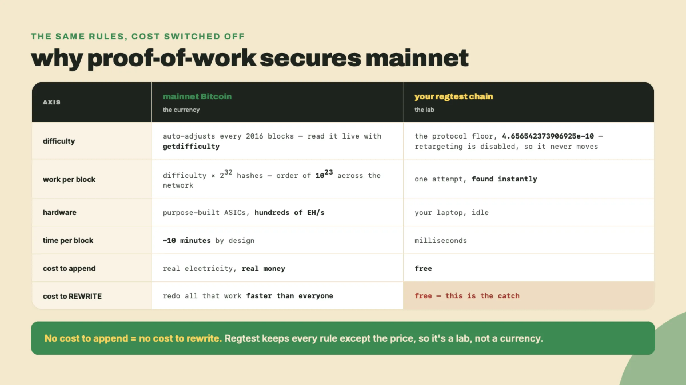
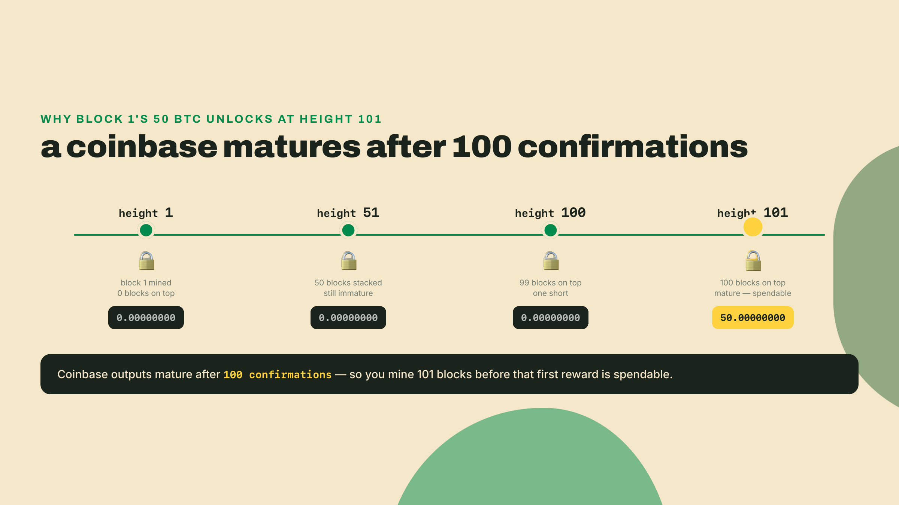
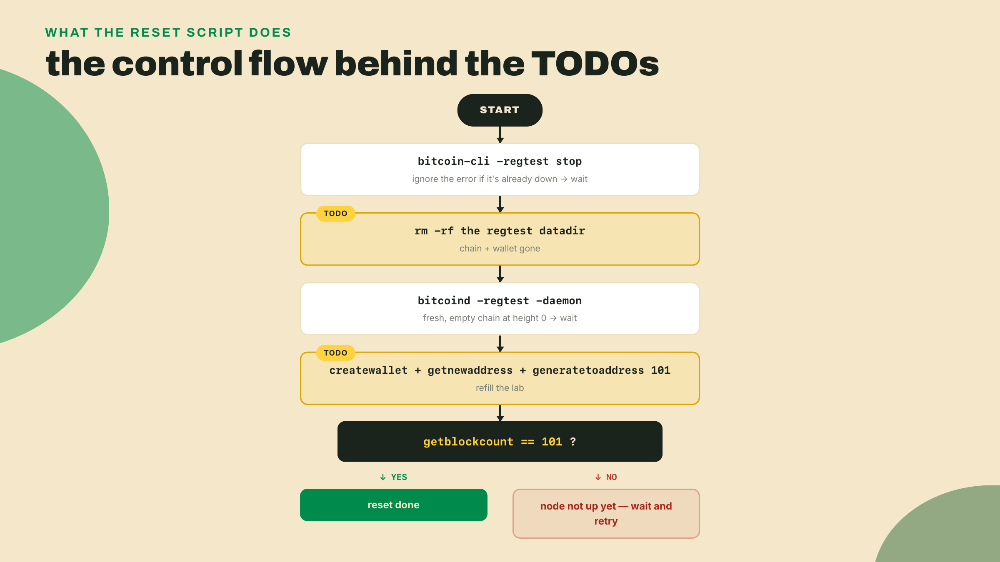
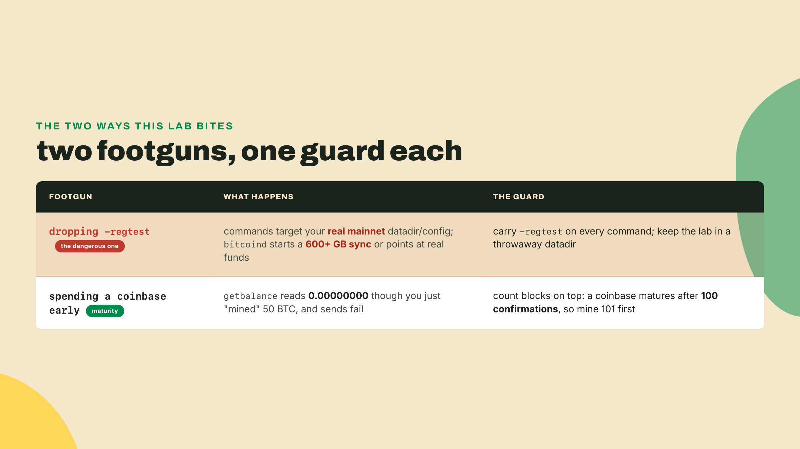

# Mine your own chain: Bitcoin with nobody else on it

Your toolkit can already do two things, and each one took a full lesson to earn. It can hash: fingerprint any bytes into 64 characters that scramble completely if a single bit moves. It can sign: prove a message came from a key nobody else holds, and let a stranger verify that without ever trusting you. Those are the exact two primitives the graveyard companies from the opener had too. DigiCash shipped both, years ahead of everyone, and still died. What none of them ever assembled is the thing you build in the next fifteen minutes: a way to append to a shared history that has no owner.

So build one. Bitcoin, minus the internet: your laptop, a private chain, and a mining command that returns before you finish reading it, because the difficulty is dropped to the floor. No peers, no pool, no real electricity. You need Bitcoin Core installed (the `bitcoind` daemon plus the `bitcoin-cli` client) and a terminal.

```bash
bitcoind -regtest -daemon
bitcoin-cli -regtest createwallet "lab"
ADDR=$(bitcoin-cli -regtest getnewaddress)
bitcoin-cli -regtest generatetoaddress 101 "$ADDR"
bitcoin-cli -regtest getblockcount
```

The last line prints `101`. That is a working blockchain, 101 blocks deep, and every block on it was minted by you. Now ask it for your money:

```bash
bitcoin-cli -regtest getbalance
```

`50.00000000`. Fifty BTC, mined in seconds, worthless on every exchange on Earth and priceless as a lab. You mined 101 blocks, yet the balance reads one reward, not a hundred and one. Hold that gap; it is the whole back half of this lesson.



## What you actually just did

Take the command apart, because every flag is load-bearing.

`-regtest` put you in regression-test mode: a private Bitcoin network, identical to the real one in every rule that matters, except that you alone run it and the mining difficulty is trivial. Regtest exists because Bitcoin Core's own developers needed a chain where difficulty is ~1, so their test suites could mine blocks on demand instead of waiting on a global race. You are borrowing their test harness. Everything it touches lives in its own datadir, the directory where the node keeps the chain and your wallet, walled off from any real Bitcoin config.

`createwallet` made a keypair store: the same signing primitive from last lesson, the one your `keytool` already builds, wearing a wallet's clothes. `getnewaddress` derived one address to receive coins. And `generatetoaddress`, the current regtest mining command, did the interesting part. It built 101 blocks and paid each block's reward to that address.

A block is a batch of transactions plus a small header, and the header carries one field that changes everything: the digest of the block before it. That field is called `previousblockhash`, and it holds the SHA-256 fingerprint of the previous block. Read that twice, because you have seen it before. A block committing to the block before it is the exact hash chain you built by hand in lesson 1, where editing any record broke every seal downstream. Bitcoin is that chain one level up, with whole blocks sitting where single records sat. The genesis block, block 0, is the anchor at the bottom, hardcoded into every copy of the software so that no two honest nodes can disagree about where the chain starts. On regtest, its hash is the same on your machine as on mine: `0f9188f13cb7b2c71f2a335e3a4fc328bf5beb436012afca590b1a11466e2206`.



## Read your own block

Do not take my word that the field is there. Pull block 1 off the chain and look:

```bash
bitcoin-cli -regtest getblock $(bitcoin-cli -regtest getblockhash 1)
```

The inner call turns a height into a block hash, and `getblock` returns the block. Walk the fields that carry weight. `previousblockhash` is the genesis hash you just saw, so block 1 is literally bolted to block 0. `tx` is a list with a single entry, because your empty regtest blocks hold exactly one transaction each: the coinbase, the special transaction that mints the block reward out of nothing and has no sender. `merkleroot` is the single digest that commits to every transaction in the block; with only one transaction here, the root just equals that transaction's own digest, the same Merkle-root shape from lesson 1 collapsed to its simplest case. And `bits` reads `207fffff`, the encoded difficulty target: regtest's easiest-possible setting.

The rest of the fields fill in the block's identity, and none of them are decoration. `height` is 1, its position counted up from genesis. `nonce` holds whatever number satisfied the target, which on regtest was almost certainly the first one the node tried. `time` is the Unix timestamp the block claims to have been mined at, and `version` plus `nTx` record the block format and the transaction count, one, matching that single-entry `tx` list. A real node on the real network checks every one of these before it will accept the block from a peer, and any that fails to add up gets the block rejected on sight.



That `confirmations: 101` is worth a beat, because the number carries the answer to your opening puzzle. It counts block 1 plus every block resting on top of it: one for itself, one hundred more piled above. Confirmations are the depth of a block, not a stamp of approval. Keep that reading; the balance mystery turns on it.

Prove the link closes rather than trusting the diagram. Ask the chain for block 2 and read one field out of it:

```bash
bitcoin-cli -regtest getblock $(bitcoin-cli -regtest getblockhash 2) | grep previousblockhash
```

The value it prints is block 1's own `hash`, the `1a3f...e7` from the output above. Block 2 names block 1 as its parent, block 1 names genesis as its parent, and you could walk that thread all the way to the tip without ever finding a gap. That is the hash chain from lesson 1, made of blocks, and you just read one of its links off a live chain instead of taking it on faith.

## The ticket to append: proof-of-work

Now the field that regtest quietly switched off. On the real network, you cannot just append a block because you feel like it. You have to earn the right, and the toll is proof-of-work: the requirement to find a number, the nonce, that makes the whole block's hash fall below a target so low that the only way to hit it is to try again, and again, billions of times, until one guess lands. Finding it is expensive. Checking it is instant, one hash. That asymmetry is the entire mechanism, and it is the same one-way trapdoor you metered in lesson 1, now pointed at a different job: turning electricity into an unforgeable ticket to add one block.

It helps to make the target concrete, because "below a target" is doing quiet work. Read a block's 64-character hash not as text but as a single enormous number, 256 bits wide, sitting somewhere between zero and roughly 1.16 times ten to the seventy-seventh. The target is just another number in that same range, and the rule is blunt: your block's hash, read as a number, must come out less than or equal to it. Set the target near the top of the range and almost every hash qualifies. Push the target down toward zero and the band of winning hashes narrows to a sliver, so the fraction of random guesses that fall inside it shrinks in exact proportion. Difficulty is nothing more elaborate than how far down that target has been dragged.



The nonce is the one field in the header you are free to spin. Change it and you have changed the header's bytes, which means the whole thing rehashes into a completely unrelated 64 characters, the avalanche effect from lesson 1 doing exactly what it did to your file: one flipped bit, a totally scrambled digest. There is no way to nudge a hash gently toward a smaller number. Each new nonce is a fresh, blind dice roll across that 256-bit range, and the only strategy anyone has ever found is to roll again. That is why finding a valid block is a matter of raw volume, billions of rolls, while checking one is a single throw: hash the header once, read it as a number, compare it to the target, done. Anyone on Earth can verify a winning block in the time it takes to hash 80 bytes, even though the winner had to try astronomically many times to produce it.

On mainnet that instant command of yours is a planet-spanning race. Purpose-built machines, hundreds of exahashes per second across the network, burn real gigawatts guessing for the roughly ten minutes it takes the honest crowd to land one valid block. The network mints new coins to whoever wins, so the machines keep guessing, so the wall of work keeps rising. That wall is what makes Bitcoin's history hard to rewrite: to erase an old block you would have to redo its proof-of-work and every block since, faster than the entire honest network builds forward. Nobody has that much electricity lying around.


The ten-minute cadence is not a happy accident; it is enforced. Every 2016 blocks, roughly every two weeks, each node independently checks how long that stretch actually took against the fortnight it was supposed to take, and rescales the target to compensate. If hashing power flooded in and the 2016 blocks arrived early, the target drops and the next stretch gets harder. If miners left and blocks came slowly, the target rises and mining gets easier. The rule runs on every node from the same block data, so there is no committee and no vote; the difficulty simply tracks the total work the world is throwing at the chain, holding block time near ten minutes whether the network is ten laptops or ten million machines. Your regtest node runs the same adjustment code. It just never has enough blocks or enough elapsed time to move off the floor.

Regtest deletes the wall. The `207fffff` target is the loosest the protocol allows, a `bits` value that decodes to a target sitting almost at the very top of that 256-bit range, so the first nonce your node tries already clears it and a block appears in milliseconds. That is why `generatetoaddress 101` returned before you could blink: there was no race to win, only a formality to stamp 101 times.



## Why your 101 blocks bought only 50 BTC

Back to the gap. You minted 101 blocks, each paying a 50 BTC reward, and `getbalance` insists on 50. It is not lying, and no coins went missing. The other rewards exist; they are just locked.

Coinbase outputs mature after 100 confirmations. A freshly minted reward cannot be spent until 100 more blocks are stacked on top of the block that created it. The one-block answer to why it is 101 and not 1 is that a brand-new reward is provisional. Blocks at the very tip can still be undone by a reorganization, where a longer competing chain arrives and orphans the last few blocks, and any reward inside an orphaned block evaporates.

Watch how that plays out on the real network, because it is not a rare edge case. Suppose you mine block 101 and pocket its reward, and at nearly the same moment a miner on the other side of the planet mines a different block 101, one your node has never seen. For a few seconds the chain has two tips of equal height, a temporary fork, and different nodes believe different blocks. The tie breaks the instant someone mines block 102 on top of one of them. Say it lands on the stranger's 101. Now that fork is longer, every honest node switches to it because the rule is to follow the most-work chain, and your block 101 becomes an orphan: still valid-looking, still sitting on your disk, but no longer part of the history anyone else recognizes. The 50 BTC it paid you never happened on the winning chain. Any ordinary transactions your block carried slide back into the pool of unconfirmed transactions to be mined again, but a coinbase has no such second life; it is minted by the block itself, so when the block dies the coins die with it.

Forcing a 100-block wait means that by the time you spend a reward, the network has effectively committed to the block that minted it, so you are never spending money that might vanish from under a merchant. That is the whole reason for the delay: it protects the person you pay, not you. Reorganizations 100 blocks deep do not happen on a healthy network; rewriting that much history would cost more work than the entire honest crowd can muster, which is the same wall of proof-of-work you just met, seen from the other side.

Run the arithmetic against your chain. Block 1 minted 50 BTC. To make it spendable, 100 blocks must sit on top of it, which puts the tip at height 101. That is why you mined 101 blocks before spending, and it is why exactly one reward matured: block 1 has its 100 blocks on top, but block 2 has only 99, block 3 only 98, and so on down to the tip, all still locked. One mature reward, 50 BTC, and a hundred more waiting their turn.



There is a coinbase out there that never matures, no matter how long you wait. The genesis block's 50 BTC coinbase is unspendable, a quirk of the original client that Satoshi never fixed: block 0's reward was simply never written into the database of spendable outputs the way every later reward is. Fifty perfectly real bitcoin, permanently frozen at the bottom of the chain, on mainnet and on your regtest chain alike. It is a fitting monument. The very first coins the system ever created are the one batch it will never let move.

## Build the artifact: a chain you can reset

You now hold the lesson's artifact: `private-regtest-chain`, a running node with 101 mined blocks and a funded wallet. It joins the toolkit repo next to `hashit` and `keytool`, and like everything in this course it will get reused, not thrown away. But a lab you cannot reset is a lab you are afraid to break, so the artifact ships with one more piece: a script that wipes the chain and rebuilds it from block 0.

The flow is four moves. Stop the node so nothing is writing to the datadir. Delete the datadir, which erases the chain and the wallet together. Start a fresh node, which comes up at height 0 with only genesis. Recreate the wallet and re-mine 101 blocks. Here is the skeleton, with the two interesting moves left for you to fill in:

```bash
#!/usr/bin/env bash
# reset-chain.sh - wipe the private regtest chain and re-mine from block 0
set -euo pipefail

# 1. stop the node (ignore the error if it is already down)
bitcoin-cli -regtest stop 2>/dev/null || true
sleep 1

# 2. TODO(you): wipe the regtest datadir so the chain starts empty.
#    Linux default is below; on macOS it is "~/Library/Application Support/Bitcoin/regtest".
DATADIR="$HOME/.bitcoin/regtest"
# rm -rf "$DATADIR"        # <- fill this in

# 3. restart the node on a now-empty chain
bitcoind -regtest -daemon
sleep 2

# 4. TODO(you): recreate the wallet and re-mine 101 blocks to a fresh address
# bitcoin-cli -regtest createwallet "lab"
# ADDR=$(bitcoin-cli -regtest getnewaddress)
# bitcoin-cli -regtest generatetoaddress 101 "$ADDR"

bitcoin-cli -regtest getblockcount   # expect: 101
```

The reason a wipe-and-rebuild is safe to lean on, and worth scripting at all, is that regtest is deterministic where it counts. Genesis never changes: every fresh chain you spin up starts from the identical `0f9188f1...2206` anchor, so "reset" really does return you to the same starting line rather than some subtly different one. What does change is everything you generated, and that is the point of deleting the whole datadir rather than just the blocks. The datadir holds your wallet too, so wiping it discards the old keys and addresses along with the chain; the rebuilt lab hands you a brand-new identity funded from scratch, with none of the previous run's state lurking to confuse a later experiment. The `set -euo pipefail` line at the top enforces the discipline: the script aborts the moment any command fails, so you never end up half-reset, staring at a node that is up but empty and wondering which step silently died.

The routine moves are already written for you. The two `TODO` lines are the point: uncomment the wipe, then reproduce the exact three commands you ran at the top of this lesson. Run the finished script and the final line should print `101` again, a clean chain rebuilt in seconds. That last check is your acceptance test, and it is deliberately unforgiving. Either the height is 101 or your reset did not work; there is no partial credit on a block count.



## The trade-off

Every design in this course gets its cost named out loud, and this one's cost is the sharpest yet, because you did not add a feature. You subtracted a bill.

Proof-of-work buys permissionless append-rights with electricity. Anyone, with no permission from anyone, can spend real energy for the right to add the next block, and that spent energy is exactly what makes the history behind it expensive to rewrite. Regtest hides that cost by setting difficulty to the floor, which is precisely why your private chain is a lab and not a currency. With no cost to append, there is no cost to rewrite. A second person with a laptop could mine a longer competing chain in seconds and orphan your entire history, and nothing in the math would stop them, because the thing that stops them on mainnet was never in the code. It was in the electricity bill. You are holding a working blockchain with its one security guarantee unplugged, on purpose, so you can study the machine without paying to run it.

It is worth being precise about which guarantee got unplugged, because the cryptography is all still running. The hash chain is intact on regtest: edit an old block and every `previousblockhash` downstream still stops matching, exactly as it would on mainnet, so tampering stays instantly detectable. What regtest removes is not detection but deterrence. On mainnet the two work as a pair, cryptography making a rewrite visible and proof-of-work making it ruinously expensive, and it is the second half that turns "I can tell you cheated" into "you cannot afford to cheat." Strip the cost away and detection alone is toothless, because the attacker simply mines an alternative history that is internally perfect, every hash valid, every link intact, and offers it up as the longer chain. Nakamoto consensus, the rule that nodes follow the chain with the most accumulated work, has nothing to weigh that against when work is free. That is the exact sense in which Bitcoin's security is economic rather than mathematical: the math tells you what happened, and the money is what makes the honest version the one that survives.

## Two ways this bites

Both footguns here come from a switch being in the wrong position, and the first one is genuinely dangerous.

Drop `-regtest` and every command aims at your real mainnet configuration instead of your sandbox. On a fresh machine that just kicks off a 600-plus-gigabyte download you did not want. On a machine with a funded wallet, you are now pointing live commands at real money, in a mode where mistakes do not reset. The guard is boring and non-negotiable: carry `-regtest` on every single command, and keep the lab in a throwaway datadir so there is nothing real for a slipped flag to touch.

The second footgun I walked into myself. Early on I mined a single block, tried to send its 50 BTC, and watched `getbalance` sit stubbornly at `0.00000000`. I spent a solid twenty minutes convinced my wallet was broken and re-reading the send syntax before I counted the blocks on top and remembered the number. One. A coinbase needs a hundred. The wallet was right the whole time; I was trying to spend money the network had not committed to yet.



## Do it yourself

Try to hand a second wallet ten spendable BTC by mining, and watch the maturity rule refuse.

Create a second wallet, take an address from it, and mine ten blocks straight to that address. Your chain climbs from height 101 to height 111. Now check the new wallet's balance:

```bash
bitcoin-cli -regtest createwallet "wallet2"
A2=$(bitcoin-cli -regtest -rpcwallet=wallet2 getnewaddress)
bitcoin-cli -regtest generatetoaddress 10 "$A2"
bitcoin-cli -regtest -rpcwallet=wallet2 getbalance   # 0.00000000
bitcoin-cli -regtest -rpcwallet=lab getbalance       # 50.00000000
```

Ten fresh blocks, 500 BTC minted to `wallet2`, and its spendable balance is `0.00000000`. Maturity blocked you at block 111, exactly as designed. The proof is in the depth: `wallet2`'s first reward sits in block 102, which at height 111 has only 9 blocks on top, far short of 100. Work out where it finally unlocks. Block 102 needs 100 blocks above it, so the tip has to reach height 202 before that first reward is spendable, and the tenth reward waits even longer. Your acceptance check is the two balances above: `lab` still holds its mature `50.00000000`, and `wallet2` holds `0.00000000` no matter how many blocks it mints, until the depth is there. The `-rpcwallet` flag is how you aim a command at one named wallet when several are loaded; forget it with two wallets open and the node will not know which balance you mean.

## Checkpoint

Run it, then say it. Two commands confirm the artifact is real:

```bash
bitcoin-cli -regtest getblockchaininfo   # "chain": "regtest", "blocks": 101
bitcoin-cli -regtest getbalance          # 50.00000000
```

`getblockchaininfo` reports 101 blocks on the regtest chain, and `getbalance` reports 50 mature BTC. The one-line verifier is `bitcoin-cli -regtest getblockcount`, which should answer `101`. Now close the terminal and explain, out loud, in two sentences and no notes: what is the `previousblockhash` field doing?

A good answer says the field stores the digest of the block right before it, so the 101 blocks form the exact hash chain you built in lesson 1. And it lands on the consequence: change any old block and its digest changes, so the next block's `previousblockhash` stops matching and every seal after it breaks, which is why nobody can quietly rewrite the history you just mined.

You own 50 regtest BTC, and the chain says so. But where, exactly, does it say so? Not in an account, and not in any field called `balance` anywhere in those 101 blocks; `getbalance` is a question your wallet answers, not a number the chain stores. Next lesson you go hunting for your money inside the chain itself and find the balance does not exist as a stored figure at all. It has to be reassembled, from scratch, every single time, out of the leftovers of transactions that nobody ever deleted.
