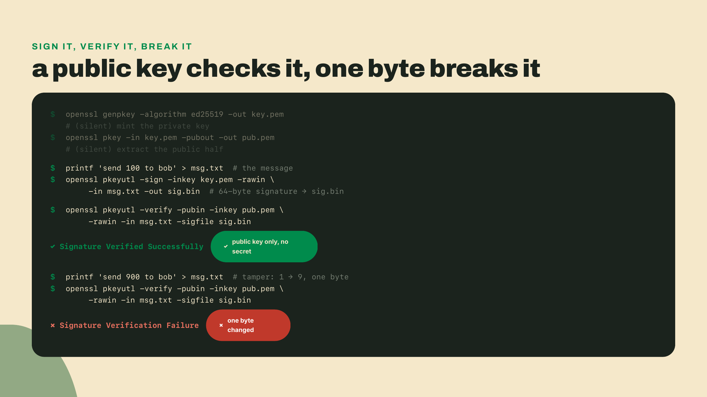
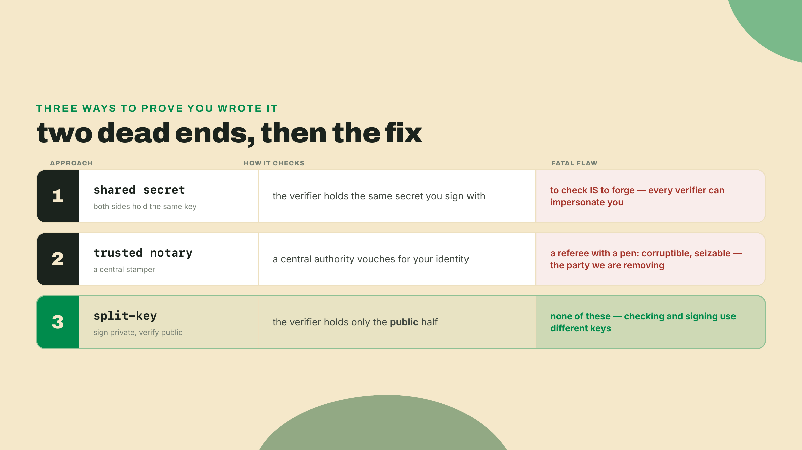
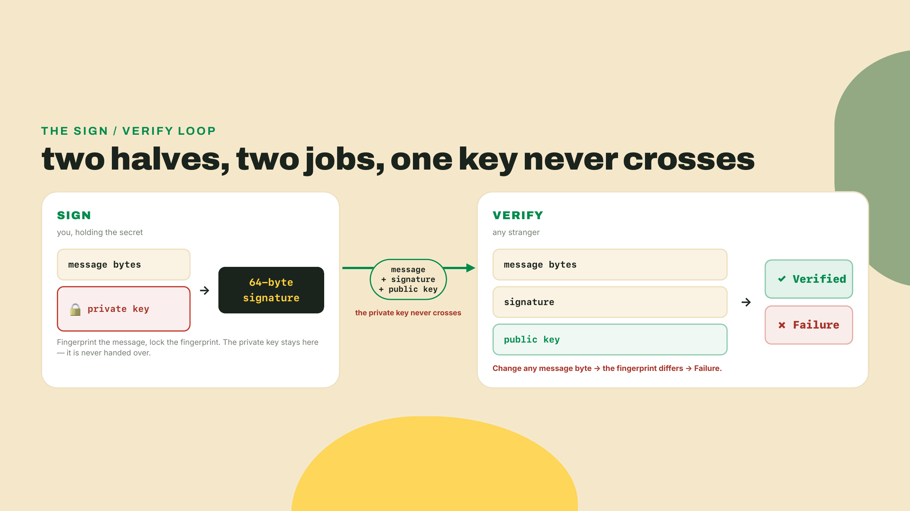
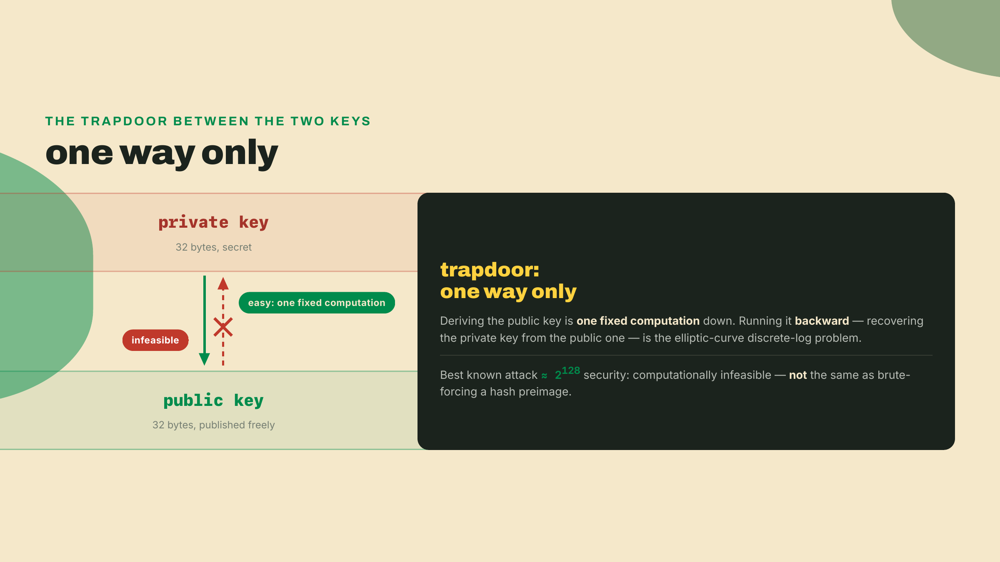
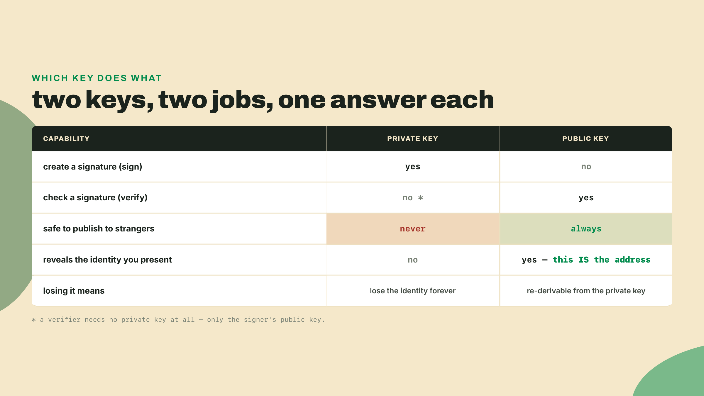
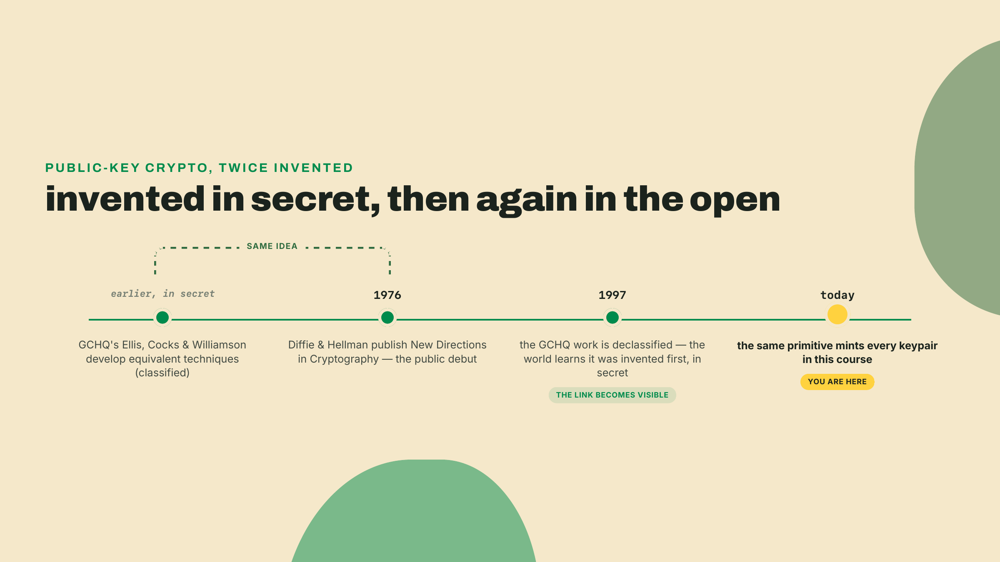
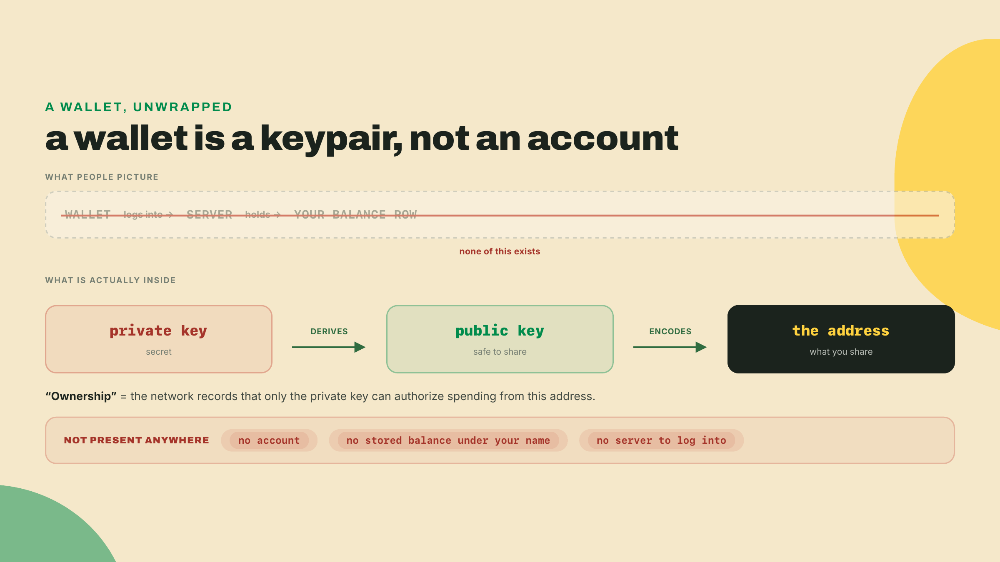
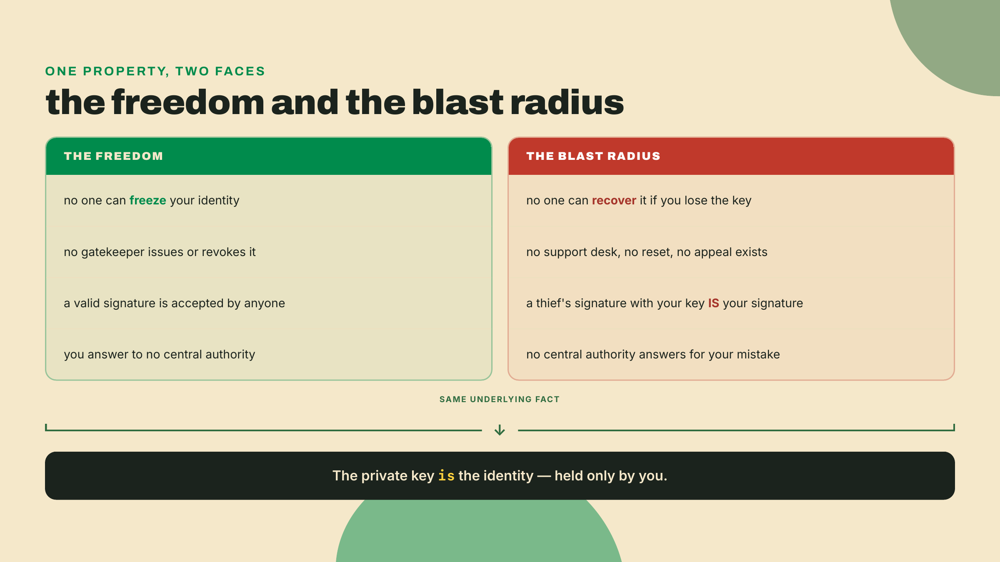
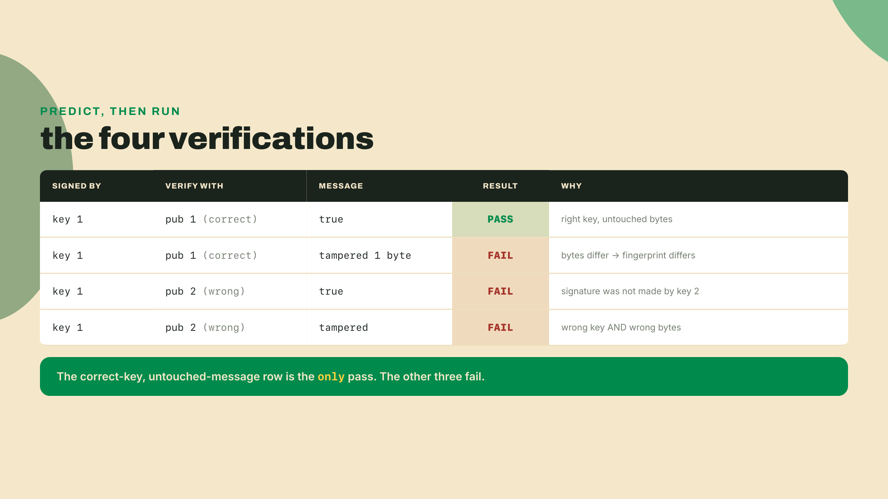

# Sign and verify: making an identity out of 32 random bytes

Last lesson closed on a gap. `hashit` can fingerprint anything: a string, a 4 GB video, a batch of a thousand records folded into one Merkle root. What it cannot do is tell you who made the fingerprint. A digest has no author. Anyone can hash `send 100 to bob`, and every one of them gets the identical 64 characters, which is exactly the property that makes a hash useless for proving *who* authorized a payment.

There is no "create account" button on a blockchain. No signup form, no email confirmation, no support line to reset a password you forgot. You are about to make an identity out of 32 random bytes, prove you own it, and hand the proof to a stranger who can check it without trusting you, your laptop, or anyone who vouches for either. Terminal open. Before any of it gets a name:

```bash
openssl genpkey -algorithm ed25519 -out /tmp/k.pem
echo hi | openssl pkeyutl -sign -inkey /tmp/k.pem -rawin | wc -c
```

```
64
```

That's it. That's the whole primitive, and you just ran it. The first command minted a fresh identity: an ed25519 key, generated from randomness, no server contacted, no account registered anywhere. The second command used that identity to sign the word `hi` and counted the result: 64 bytes. Not a password, not a login token, not a row in somebody's users table. Sixty-four bytes of proof that whoever holds that key stood behind that exact message. Run it again and you'll get a different keypair and a different signature, because the randomness is fresh every time, but the shape never changes: identity in, message in, 64 bytes of proof out.

## Sign a file, verify it, break it

The `hi` demo is too small to feel. Sign something that looks like money moving, then prove it, then try to cheat it. Four commands to set the stage:

```bash
openssl genpkey -algorithm ed25519 -out key.pem
openssl pkey -in key.pem -pubout -out pub.pem
printf 'send 100 to bob' > msg.txt
openssl pkeyutl -sign -inkey key.pem -rawin -in msg.txt -out sig.bin
```

The first line makes your private key. The second extracts the public half of it into `pub.pem`, a separate file you can hand out freely. The third writes the message. The fourth signs the message bytes with the private key and drops the 64-byte signature into `sig.bin`. Now the moment that matters. Give a verifier three things: the message, the signature, and your public key. Nothing else, and crucially not the private key:

```bash
openssl pkeyutl -verify -pubin -inkey pub.pem -rawin -in msg.txt -sigfile sig.bin
```

```
Signature Verified Successfully
```

Stop and notice what just did not happen. The verifier never saw your private key. It held only the public half, the message, and 64 bytes, and it concluded that the holder of the matching private key signed exactly `send 100 to bob`. Now cheat. Change one byte of the message, a `1` into a `9`, and ask again with the same signature:

```bash
printf 'send 900 to bob' > msg.txt
openssl pkeyutl -verify -pubin -inkey pub.pem -rawin -in msg.txt -sigfile sig.bin
```

```
Signature Verification Failure
```

One byte. That command also exits nonzero, so a script can branch on it without reading the text. The signature was proof about a specific string of bytes, and the instant the bytes stopped matching, the proof evaporated. This is the avalanche behavior from last lesson wearing a badge: the signature commits to the message's fingerprint, so there is no "close enough," no partial credit, no way to nudge a `100` into a `900` and keep the proof intact.



## What a keypair actually is

Time to name what you have been running. A **keypair** is two mathematically linked keys generated together in one shot: a private key you never share, and a public key you hand out to anyone. They are born as a pair and useless apart. The private key can do one special thing the public key cannot, and the public key can do one special thing that needs no secret at all. That split is the entire idea, and it has a name: **public-key cryptography** (also called asymmetric cryptography), a scheme where the key that *creates* a proof and the key that *checks* it are different, so you can publish one half to the world and keep the other half to yourself.

That split looks like needless machinery until you try to live without it. Consider the naive fix first, because ruling it out is what makes the real answer land. You want to prove `send 100 to bob` came from you. The obvious move is a shared secret: you and the verifier agree on a password, and you attach some function of the password to the message. The verifier knows the password, so it can recompute and check. It works exactly once, then dies, because to *check* your proof the verifier must hold the same secret that *makes* your proof, and anyone who can check can also forge. Verification power and forging power are the same power. Give a thousand people the ability to confirm your payments and you have given a thousand people the ability to sign as you.

You might reach for a second naive fix: appoint a trusted notary who checks everyone's identity and stamps their messages. It works, and it is exactly what last lesson spent its whole length indicting. A notary is a central referee with a pen, the single party whose corruption or seizure or one bad Friday takes the system down, and the entire point of what you are building is to need no such party. Rule it out for the same reason `ledger.py` failed: whoever holds the stamp owns the truth. The fix has to live in math the signer holds alone, not in an authority everyone else has to trust.



That is the wall, and public-key cryptography is the way through it. It splits the one shared secret into two unequal halves. The private key makes proofs. The public key checks them and can do nothing else. You can broadcast the public key to every stranger on Earth, publish it on a billboard, and none of them gains an ounce of forging power, because checking a signature and producing one are now genuinely different operations backed by different keys.

A **digital signature**, then, is the 64 bytes you kept generating: a value that proves a specific message was authored by the holder of a specific private key, and that the message has not changed by a single bit since. The mental model the whole industry teaches is *sign = fingerprint the message, then lock the fingerprint with the private key; verify = use the public key to check that lock against a fresh fingerprint of the message*. Hold that model loosely on one point: with ed25519 the private key does not literally "encrypt" anything you could later decrypt and read, so do not imagine the public key unlocking a hidden message. There is no hidden message. There is only a proof that checks out or does not. The lock-and-check picture is right about the shape; it is just a picture.

So how does a key that everybody has check a proof it could never have produced? That is the one trick of the public half, and it is worth seeing as a loop rather than a slogan.



One thing should nag you here. The two keys are "mathematically linked," and you hand out the public one, so a stranger ought to be able to run the link backward and recover the private key. They cannot, because the link runs one way by design. Generating the public key from the private key is easy: a single fixed computation. Running it backward, recovering the private key from the public key, is the elliptic-curve discrete-log problem, and the best known attack on it (Pollard's rho) still leaves a security level around 2^128: not shortcut-free, but far beyond what any machine that could ever be built would finish. That makes recovery computationally infeasible, and it is a different kind of hardness than reversing a hash, so do not picture it as the same brute-force search. The link is a trapdoor: trivial one way, infeasible the other. That is why publishing the public key leaks nothing, and why both keys can be the same tiny 32 bytes each and still keep their secret.



The asymmetry is the whole product. One key mints proofs, the other only audits them, and the auditing key is safe to give to the exact people you are trying to prove things to. Draw the two capabilities against each other and the shape gets sharp.



## Cross-check it: OpenSSL signs, Python verifies

Here is the property that makes signatures worth building a financial system on, and it is the same one that made hashing trustworthy last lesson: the agreement is mathematical, not social. You signed with OpenSSL. Verify with a completely different toolchain and watch it agree. Python's `cryptography` library shares no code with OpenSSL's command-line tool, was written by different people, and has never spoken to your terminal session. Feed it the public key and the signature OpenSSL produced:

```python
from cryptography.hazmat.primitives.serialization import load_pem_public_key
from cryptography.exceptions import InvalidSignature

pub = load_pem_public_key(open("pub.pem", "rb").read())
sig = open("sig.bin", "rb").read()

def check(message: bytes) -> str:
    try:
        pub.verify(sig, message)
        return "OK: signature valid"
    except InvalidSignature:
        return "FAIL: signature invalid"

print(check(b"send 100 to bob"))   # the bytes OpenSSL signed
print(check(b"send 900 to bob"))   # one byte tampered
```

```
OK: signature valid
FAIL: signature invalid
```

Two independent programs, one verdict. Python confirms the exact signature OpenSSL made, and rejects the exact tamper OpenSSL rejected. Nobody coordinated that. The two tools land on the same answer because they are computing the same math over the same 32-byte public key, not because they trust each other or phone a shared server. That is what lets a validator on the far side of the planet check your signature against your public key and reach the same conclusion your own machine would, with no channel of trust between them. A signature you make travels to strangers and keeps meaning the same thing.

Notice the cost you just paid for this, quietly: your public key had to reach the verifier over some trustworthy channel. The signature proves the message came from *whoever owns this public key*. It says nothing about whose key it is. If an attacker can swap the public key in transit, they can present their own signatures as yours. Signatures nail down authorship relative to a key; binding a key to a human is a separate problem, and every real system solves it separately. Bitcoin and Solana mostly punt it to you: the address you publish *is* the binding, so it is on you to make sure the address a payer copies really came from you and not from someone standing in the middle.

## Where this came from

This machinery is older than most people assume, and its history has a strange fold in it. Public-key cryptography reached the public in 1976, when Diffie and Hellman published *New Directions in Cryptography* and proposed splitting the key in two: the idea that a scheme could hand out one key openly and keep another secret, which until then had sounded like a contradiction. It was one of those papers that reorganizes a field in an afternoon.

Except it was the second time the idea was invented. Inside GCHQ, the British signals-intelligence agency, Ellis, Cocks, and Williamson had worked out equivalent techniques earlier, in secret, and the work stayed classified until 1997. So the public timeline and the real timeline disagree by decades, and the primitive under every signature you will make in this course spent years as a state secret before a pair of academics rediscovered it in the open and gave it away.



## The aha: this keypair is a wallet

Here is the part worth slowing down for, because it is the bridge the rest of the course walks across. You did not build a toy. You built a wallet.

Strip a crypto wallet down to its core and there is no account inside it, no balance stored in it, no server it logs into. There is a keypair. The private key is the thing you guard, the public key is the thing you share, and the "address" a stranger pastes to pay you is that public key wearing an encoding convention so it fits on a screen. When you "own" coins, no system stored a row that says so under your name; it stored records that only your private key can authorize spending from, and your public key is the name those records point at. Ownership is not a field in a database. It is the ability to produce a signature nobody else can.

That reframes the whole "no create-account button" problem from the intro. There is no account to create because the account is a mathematical fact about a key you generated yourself, offline, in the time it took `openssl genpkey` to run. Nobody issued it to you. Nobody can revoke it. Nobody even knows it exists until you sign something and show them. Bitcoin and Solana each add conventions on top of exactly this: how to encode the public key into an address, what a "transaction" message looks like before you sign it, which curve and which rules. Conventions, not new physics. The 32-byte identity underneath is what you already made.

Peek at the raw numbers if you want the point in the flesh. The private seed `openssl` generated is 32 bytes. The public key is another 32. Your entire identity, the thing that will be worth more than any password you have ever chosen, is 64 bytes total, half of it secret and half of it safe to shout across a room. No account was ever smaller, and none was ever more yours.



Which is exactly why the trade-off lands where it does.

## The trade-off: the key is the identity

Every tool in this course gets its cost named out loud. This one's is the sharpest in the whole curriculum, because it is not a performance cost or a complexity cost. It is existential.

The private key *is* the identity. Not a credential for the identity, not a way to access it. It is the identity, fully, and that single fact cuts both directions with the same blade. Lose the key and the identity is gone permanently: there is no reset link, no support desk, no human anywhere with the authority to restore it, because restoring it would mean someone else could mint your signatures, which is precisely the power the design refused to grant anyone. Coins that only your key can authorize become coins nobody can ever authorize again. On the other side, leak the key and the thief does not *impersonate* you. The thief *is* you, indistinguishably, because a signature made with your private key is your signature by definition, and no verifier on Earth can tell a theft from a legitimate use. The signature is valid. That is all the system knows how to ask.

Self-custody's freedom and its blast radius are the same property. The reason no government can freeze your account is the same reason no one can unfreeze it when you lose the key. You cannot keep the upside and delete the downside; they are one mechanism seen from two sides.

Set it against the realistic alternative. A bank account has a reset button precisely because a bank can overrule you, which is the same authority that lets it freeze, seize, or reverse a payment without asking. You are not choosing between risk and safety. You are choosing which failure you would rather own: a stranger's power over your money, or your own responsibility for a key. Neither option is free, and anyone who tells you otherwise is selling one side of the trade. This course will keep making you pay one bill or the other, out loud, every time a design demands it.



There is a second, humbler cost that bites long before you lose a real key, and I will confess how I met it. Early on I wrote a signing script, tested it against a keypair I generated in a tutorial, watched everything verify, and left that keypair wired into the code because it worked. The demo key was fine as a demo. It stopped being fine the moment the same key touched anything I cared about, because a keypair that has appeared in a tutorial, a git repo, or a screenshot is a public key masquerading as a private one. Treat any key you did not generate privately, and keep privately, as already compromised. A demo key is for demos. Generate a fresh one the instant you mean it.

## Build: `keytool`

Time to add the second tool to the toolkit, the repo that grows into your capstone bot. Last lesson gave you `hashit`, which proves bytes are untouched. `keytool` proves *who* touched them, and the two are meant to sit side by side: fingerprint, then attribute.

The keygen and sign paths are handed to you, because you already ran their exact commands above. The verify path has a hole in it. Fill it:

```python
#!/usr/bin/env python3
"""keytool: generate an ed25519 keypair, sign a message, verify a signature."""
import subprocess, sys

def keygen(priv="key.pem", pub="pub.pem"):
    subprocess.run(["openssl", "genpkey", "-algorithm", "ed25519",
                    "-out", priv], check=True)
    subprocess.run(["openssl", "pkey", "-in", priv, "-pubout",
                    "-out", pub], check=True)

def sign(msg_file, priv="key.pem", sig="sig.bin"):
    subprocess.run(["openssl", "pkeyutl", "-sign", "-inkey", priv,
                    "-rawin", "-in", msg_file, "-out", sig], check=True)

def verify(msg_file, pub="pub.pem", sig="sig.bin") -> bool:
    # TODO(you): run `openssl pkeyutl -verify -pubin -inkey <pub> -rawin
    #            -in <msg_file> -sigfile <sig>` and return True on success.
    # Hint: subprocess.run(...).returncode is 0 when the signature verifies.
    ...

if __name__ == "__main__":
    cmd = sys.argv[1]
    if cmd == "keygen":
        keygen()
    elif cmd == "sign":
        sign(sys.argv[2])
    elif cmd == "verify":
        print("OK" if verify(sys.argv[2]) else "FAIL")
```

The TODO is a few lines, and every flag you need is in the commands you ran by hand. The acceptance test is the same brutal-and-fair standard as `hashit`: a valid signature must return `OK`, and any tampered byte must return `FAIL`. No partial credit, because a verifier that is "pretty sure" is a verifier you cannot build a payment on.

Two footguns wait for you in that verify function, and both are quiet. The first: sign or verify the *file bytes*, never the filename. It is a quiet, common mistake. Pipe `msg.txt` as a string into a sign command and you will cheerfully sign the six characters `m s g . t x t` instead of the message inside the file, get a signature that verifies against the wrong thing, and lose an afternoon before you notice. `-rawin -in msg.txt` reads the file's contents; `printf 'msg.txt' | ...` reads the name. They both "work." Only one signs what you meant. The second footgun is the demo-key trap from the trade-off, now in code: do not leave `key.pem` from a tutorial checked into anything real.

## Do it yourself

Generate a *second* keypair, so you have two identities on the bench:

```bash
openssl genpkey -algorithm ed25519 -out key2.pem
openssl pkey -in key2.pem -pubout -out pub2.pem
```

Now sign a message with key 1, and run four verifications: the right public key against the true message, the right public key against a one-byte-tampered message, the *wrong* public key (`pub2.pem`) against the true message, and the wrong public key against the tampered message. Before you run each one, predict pass or fail and say why in one clause. Then run it and see if the machine agrees with you.



The wrong-key rows are the ones that teach. A signature is not just proof that *a* key signed the bytes; it is proof that *this specific* key did, and `pub2.pem` has no relationship to a signature `key.pem` produced, so it rejects it outright. Swap the keys around, sign with key 2 and verify with pub 1, and the failure flips to the other side. The only combination that ever passes is the right public key checking untouched bytes signed by its own private partner. Everything else is a `Failure`, and now you can say exactly why for each one.

## Checkpoint

Do not move on until you can pass this from a cold terminal, no notes:

Run it. Generate a keypair, sign a message, and show two outputs back to back: your signature verifies with OpenSSL against the true message, and it fails after you flip a single byte. That is the artifact; the whole lesson is worthless if you cannot make the machine print both.

Then explain-back, out loud, which key does what, one sentence each. A good answer sounds like: *the private key signs, and I never share it; the public key verifies, and I hand it to anyone.* Bonus if your second sentence names the asymmetry that makes it safe to publish, that checking a signature and producing one are different operations backed by different keys, so giving away the public key gives away no forging power at all.

You now hold both halves of the toolkit's foundation. `hashit` proves bytes are unchanged. `keytool` proves who stood behind them, to anyone, without a trusted middleman in sight. Fingerprints plus identity: that pairing is nearly the entire kit a currency needs. Next module you stop borrowing crypto's parts and start assembling them, mining a chain of your own, block by block, where every entry is fingerprinted into the last and every spend is signed by a key like the one you just made. Identity plus fingerprints is everything Bitcoin needs. The first block you seal, you will sign.
