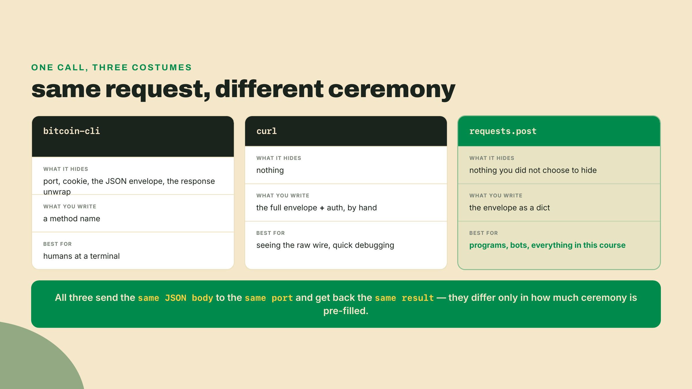
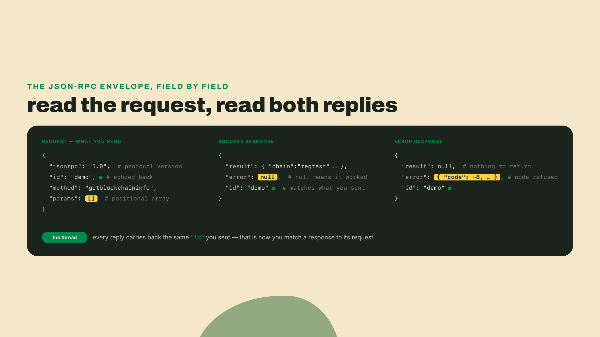
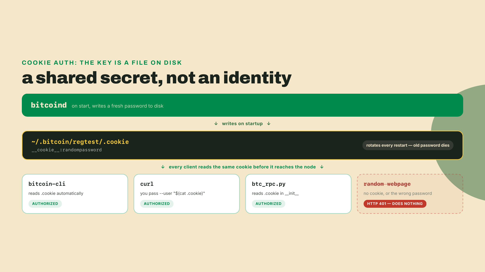
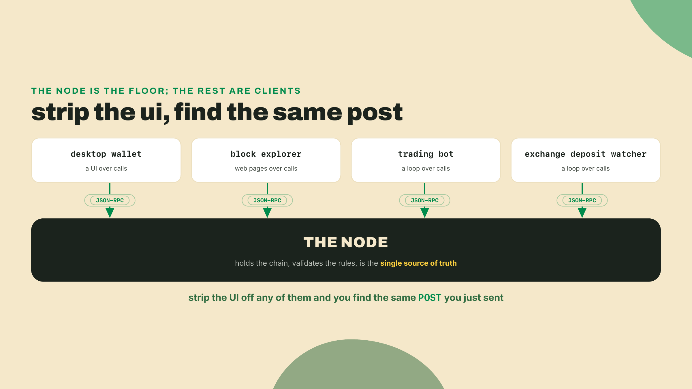
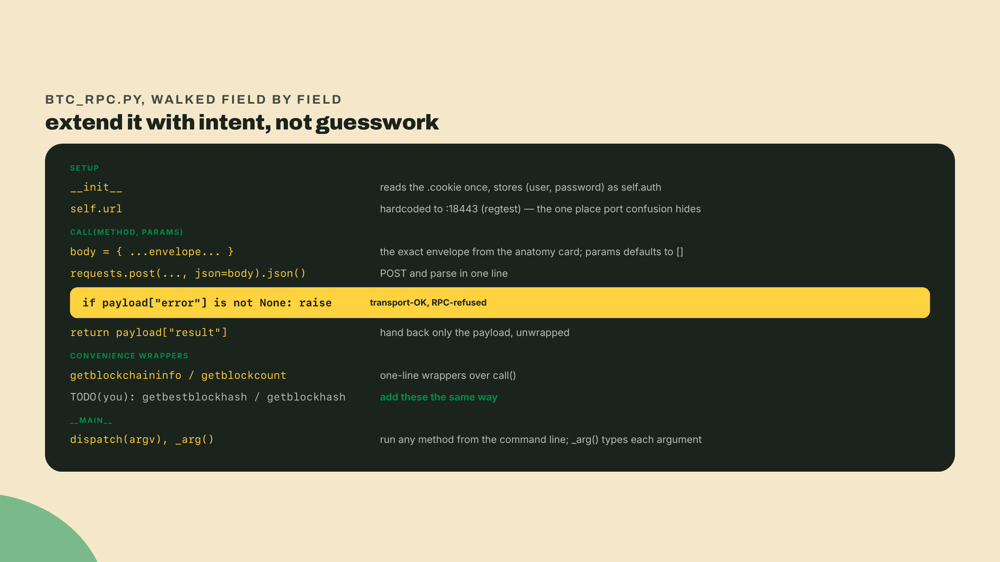
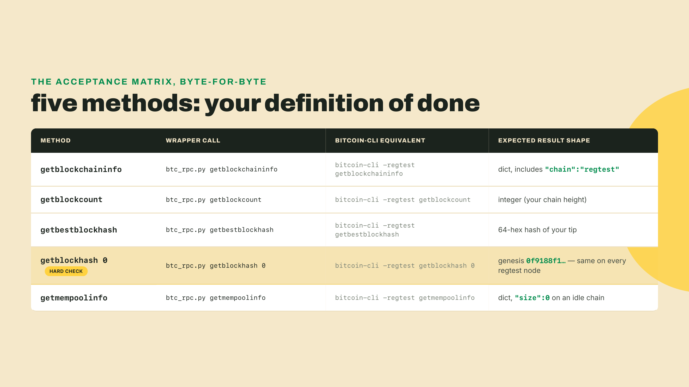
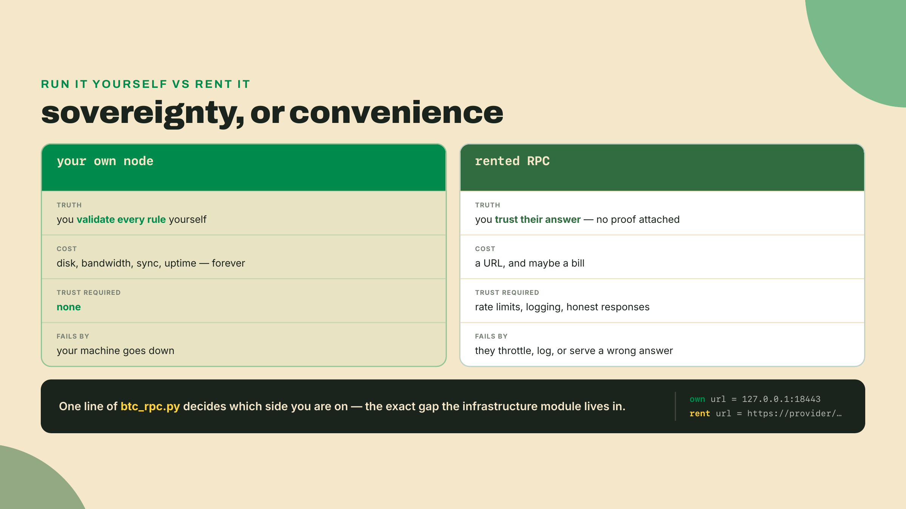
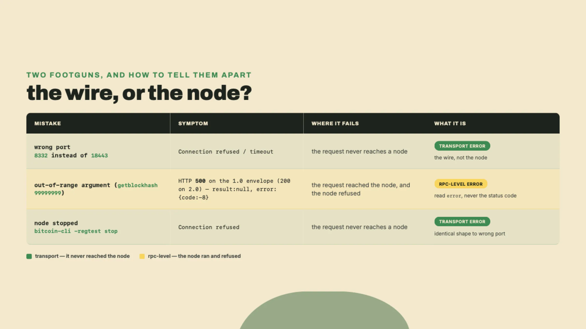

# Speak RPC: your node is just an API server

Last lesson you mined a private chain and spent a UTXO: real coins, a real transaction, your own node confirming it into a block. Every move went through `bitcoin-cli`, and every move felt like the command was reaching some secret hand into the machine. It wasn't. `bitcoin-cli` is a costume, and this lesson takes it off.

Your regtest node from last lesson is still running. Before I name a single thing, point this at it and hit enter:

```bash
curl --user "$(cat ~/.bitcoin/regtest/.cookie)" \
  --data-binary '{"jsonrpc":"1.0","id":"demo","method":"getblockchaininfo","params":[]}' \
  -H 'content-type: text/plain;' \
  http://127.0.0.1:18443/
```

One line of JSON comes back, something like this (your block counts reflect however many blocks you mined; the shape is identical for everyone):

```
{"result":{"chain":"regtest","blocks":101,"headers":101,"bestblockhash":"5f...","difficulty":4.656542373906925e-10},"error":null,"id":"demo"}
```

That's it. That is the whole trick. You just sent an HTTP POST to a web server running on your laptop, and it answered with your chain's state. No special protocol, no binary handshake: a JSON body over plain HTTP to port `18443`, the same shape of request your browser makes a thousand times a day.

So here is the collapse the lesson is built on. `bitcoin-cli` is just that `curl` command with the boring parts hidden. It finds the port, reads your password, wraps your arguments in the JSON envelope you see above, POSTs it, and prints the `result` field. Strip those conveniences and there is nothing underneath but a request and a response. Every `getbalance`, every `sendtoaddress`, every block you mined last lesson: HTTP the entire time.

You have actually run this exact call before, dressed differently. Try the version you already know:

```bash
bitcoin-cli -regtest getblockchaininfo
```

Same numbers, pretty-printed, minus the `{"result": ..., "error": null, "id": ...}` wrapping. The CLI unwrapped it for you. Now do it a third way, from Python, so you can see there is no shell sorcery involved either:

```python
import requests
from pathlib import Path

user, password = Path.home().joinpath(".bitcoin/regtest/.cookie").read_text().strip().split(":", 1)

resp = requests.post(
    "http://127.0.0.1:18443/",
    auth=(user, password),
    json={"jsonrpc": "1.0", "id": "py", "method": "getblockchaininfo", "params": []},
)
print(resp.json()["result"]["chain"])
```

```
regtest
```

Three separate programs just made the same call. `bitcoin-cli` is a C++ binary, `curl` is a shell utility, and this last one is Python's `requests`, none of them shares a single line of code with the others. They agree because they are speaking the same wire protocol, not because they were built together. That agreement is the whole point of everything that follows.



## The envelope has a name

The convention you just used three times has a name: **JSON-RPC** (a minimal way to call a function on a remote machine, you POST a JSON object naming a `method` and its `params`, and you get back a JSON object holding either a `result` or an `error`). That is the entire specification worth caring about today. A method, some params, a result or an error. No classes, no schemas, no code generation. If you can build a dict and make an HTTP request, you can drive any node on Earth.

Here is a detail most tutorials skip, and it reframes the whole ecosystem: JSON-RPC is older than Bitcoin. Satoshi did not invent a wire format. He bolted an existing web standard, JSON-RPC 1.0, onto `bitcoind`, which is exactly why every chain built since speaks a dialect of the same idea. Ethereum answers a POST with a `method` and `params`. Solana answers a POST with a `method` and `params`. Learn the shape once and you have learned the front door to every blockchain you will ever touch; only the method names change.

Look at the request and both kinds of response side by side, because you need to read all three fluently before you build a client that produces them.



Two fields on that card will bite you later, so mark them now. `params` is a positional array: the node reads arguments by position, not by name, so order is the contract. And `error` being `null` is how you know a call worked. A response can arrive perfectly, HTTP 200 and all, while `error` holds a complaint and `result` is `null`. That distinction between "the request reached the node and the node said no" versus "the request never arrived" is the seam your solo exercise pries open at the end.

That leaves the field you have been ignoring: `id`. On a single call it looks like pure ceremony. You send `"id":"demo"`, the node echoes `"id":"demo"` straight back, and nothing you do seems to depend on it. Its purpose only shows up the moment you stop making one call at a time. JSON-RPC lets you POST an *array* of request objects in a single HTTP round trip, and the node answers with an array of results, but it does not promise to hand them back in the order you asked. Watch what returns when you batch a height query and a hash query into one request:

```
[
 {"jsonrpc":"1.0","id":"a","method":"getblockcount","params":[]},
 {"jsonrpc":"1.0","id":"b","method":"getbestblockhash","params":[]}
]
```

```
[
 {"result":"5f...","error":null,"id":"b"},
 {"result":101,"error":null,"id":"a"}
]
```

The answer for `"b"` came back first. Without the `id`, you would be holding two results and no reliable way to say which one is the block count and which is the hash, because position in the response no longer maps to position in the request. With it, re-pairing is trivial: match each response's `id` to the request that carried the same label. For a bot firing dozens of calls to fill a single screen, or an explorer bundling every transaction in a block into one POST to cut round trips, that label is what keeps concurrent answers from getting shuffled into nonsense. Give every distinct call a distinct `id`, and you can always sort the mail no matter what order it lands in.

## Who holds the password

You slipped one thing past yourself in that first `curl`: `--user "$(cat ~/.bitcoin/regtest/.cookie)"`. That is authentication, and it is worth understanding, because it is the reason a random webpage can't POST to your node and drain it.

Bitcoin Core will not answer an unauthenticated RPC request. The default scheme is **cookie auth** (a random `username:password` pair Bitcoin Core writes to a `.cookie` file every time it starts, so a local client can authenticate without you ever choosing a password). Read yours:

```bash
cat ~/.bitcoin/regtest/.cookie
```

```
__cookie__:9f3a...c1
```

The username is always `__cookie__`; the password is regenerated on every restart. `bitcoin-cli` reads that file for you automatically, which is the last piece of magic to evaporate: it wasn't authorized by being the official client, it was authorized by reading a file sitting on your disk. Your `curl` command read the same file. Your Python read the same file. Three different programs, one shared secret pulled off the disk, and the node never knew or cared which of them was knocking.

There is a second way to authenticate, and naming its trade-off matters because you will reach for it the moment you deploy anything. You can set a fixed `rpcuser` and `rpcpassword` in `bitcoin.conf` instead of relying on the rotating cookie. Convenient: the credentials survive restarts, so a long-running bot doesn't have to re-read the cookie every time the node bounces. The cost is real: a static password in a config file is a static password in a config file, and it lives forever until you change it, which means a leaked config is a leaked node. The cookie's whole virtue is that it rotates out from under an attacker on the next restart. Pick fixed credentials for a service you control tightly; keep the cookie for local development. Either way, the node checks a password before it does anything, and that check is the only thing standing between the open internet and your coins.



## Every tool you have ever used is an RPC client

Now the payoff the hook promised, the one that reorganizes your mental map of the whole industry. Your node is the only source of truth. It holds the chain, validates every rule, and answers questions about state. It does not have a screen, a wallet UI, a price chart, or a mobile app. Every one of those things is a separate program that talks to the node exactly the way you just did: JSON-RPC over HTTP.

Take a block explorer, the kind of site you have pasted a transaction id into a hundred times, and follow what actually happens when it renders a single block page. You click into block 101. The URL carries a height, something like `/block/101`, but a height is not something the node will hand you a block for directly, so the explorer's first move is a call you have already run a cousin of: it POSTs `getblockhash` with `params:[101]` and gets back that block's hash. Now it holds a hash, so it fires a second POST, `getblock` with `params:["<that hash>"]`, and the node returns the block's contents: its timestamp, its size, the miner's coinbase, and the list of transaction ids the block contains. To fill in the table of transactions you see on the page, the explorer walks that list and POSTs `getrawtransaction` once per id. Three method names, a dozen POSTs, and a web page assembles itself out of nothing but envelopes, every value on the screen pulled from a node through the exact request you built by hand a few minutes ago.

Peel that page off and your `curl` command is sitting underneath it, run in a loop by a server instead of by you. The other tools are the same skeleton in different clothes. Your desktop wallet is that loop with a balance screen bolted on, calling `getbalance` and `listunspent` and rendering the numbers. A trading bot is the loop with no screen at all, polling state and reacting. An exchange's deposit-detection system is the loop watching specific addresses for incoming transactions so it can credit your account. Strip the interface off any of them and you are back at the block page's underbelly: a small set of methods, POSTed on repeat.

There is no metaphor hiding in that. The node is a database with a JSON-RPC API in front of it, and everything else is a client that dresses those calls up for a human to look at. That single fact tells you where every capability and every failure in this space actually lives. When a wallet shows the wrong balance, the node was queried wrong or the node is behind. When an explorer is down, its node connection is down. The node is the floor. Everything stands on it.



## Build: `btc_rpc.py`

Time for the tool. This is the seed of every bot in this course, and it is small enough to hold in your head. Its whole job is to erase the ceremony you have been typing by hand: read the cookie once, wrap a method and params in the envelope, POST it, check `error`, hand back `result`. Save this as `btc_rpc.py`:

```python
#!/usr/bin/env python3
"""btc_rpc.py - a tiny typed JSON-RPC client for your regtest node."""
import json
import sys
from pathlib import Path
from typing import Any

import requests

DEFAULT_URL = "http://127.0.0.1:18443/"              # regtest, NOT 8332
DEFAULT_COOKIE = Path.home() / ".bitcoin/regtest/.cookie"


class BitcoinRPC:
    def __init__(self, url: str = DEFAULT_URL, cookie: Path = DEFAULT_COOKIE) -> None:
        user, password = cookie.read_text().strip().split(":", 1)
        self.url = url
        self.auth = (user, password)

    def call(self, method: str, params: list[Any] | None = None) -> Any:
        body = {"jsonrpc": "1.0", "id": "btc_rpc",
                "method": method, "params": params or []}
        payload = requests.post(self.url, auth=self.auth, json=body).json()
        if payload["error"] is not None:          # node ran, node refused
            raise RuntimeError(payload["error"])
        return payload["result"]

    def getblockchaininfo(self) -> dict:
        return self.call("getblockchaininfo")

    def getblockcount(self) -> int:
        return self.call("getblockcount")

    # TODO(you): getbestblockhash(self) -> str
    # TODO(you): getblockhash(self, height: int) -> str   # params=[height]


def _arg(raw: str) -> Any:
    try:
        return json.loads(raw)                     # "0" -> 0, "true" -> True
    except json.JSONDecodeError:
        return raw                                  # a bare hash stays a string


if __name__ == "__main__":
    rpc = BitcoinRPC()
    method, *rest = sys.argv[1:]
    print(json.dumps(rpc.call(method, [_arg(a) for a in rest])))
```

Start at the top, with the two module-level constants, because they set up everything below them. `DEFAULT_URL` pins the address to `http://127.0.0.1:18443/`, and the comment beside it, `regtest, NOT 8332`, is not decoration; it is the single place in the whole file where port confusion is allowed to live, so it lives as a named default you set once and stop worrying about. `DEFAULT_COOKIE` does the same for the credential path. Both are constructor defaults rather than literals buried inside `call`, which is the detail that pays off later: the day you point this client at a rented node, you change one argument at the call site and the rest of the file never notices.

The `call` method is the engine and the only thing that touches the network; every convenience method is one line that delegates to it. The `split(":", 1)` on the cookie caps the split at the first colon, so a password that happens to contain a colon still parses cleanly. And `_arg` is the small usability choice worth pausing on: command-line arguments arrive as strings, but `getblockhash` wants an integer height in its positional array, so `_arg` tries to read each argument as JSON first and falls back to a raw string. That is what lets `getblockhash 0` send `params=[0]` (a number) while `getblock <hash>` sends `params=["<hash>"]` (a string), from the same dispatcher, with no per-method parsing.

The section title promised a *typed* client, and the annotations are where that promise is kept. `call` declares `params: list[Any] | None` going in and `-> Any` coming out, which is the honest signature: the params are always a list or nothing, but the result's shape depends entirely on which method you called, so `Any` is the truthful return. The convenience methods are where the typing earns its keep. `getblockchaininfo(self) -> dict`, `getblockcount(self) -> int`, and the two `TODO` stubs annotated `-> str` each write down the shape that specific call returns. Those return types are a contract: an editor can autocomplete against a real `int` instead of a mystery, and a reader six months from now knows what a call hands back without POSTing it to find out. An untyped wrapper leaves you guessing at every call site; a typed one answers the question in the signature.

Finally the `__main__` block, which is what turns a library into a command-line tool. `sys.argv[1:]` is everything you typed after the filename, and `method, *rest = ...` peels the first token off as the method name while keeping the remainder as a list of raw string arguments. Each of those runs through `_arg` before reaching `call`, which is precisely why `python3 btc_rpc.py getblockhash 0` arrives at the node as `params=[0]` and not `params=["0"]`. That one line of dispatch is the reason you can drive *any* method the node supports straight from the shell, even methods you never bothered to write a convenience wrapper for, and it is exactly the path the acceptance test's fifth method rides through.



## Run it and prove it

Now earn the acceptance test. The verify command for this artifact pipes the wrapper's output straight into a one-liner that reads the `chain` field:

```bash
python3 btc_rpc.py getblockchaininfo | python3 -c 'import json,sys; print(json.load(sys.stdin)["chain"])'
```

```
regtest
```

If you see `regtest`, your wrapper read the cookie, built a valid envelope, hit the right port, parsed the response, and unwrapped the result. That single word certifies the entire pipeline end to end.

The bar for this tool is the same brutal, fair bar as every tool in this course: `btc_rpc.py` must return byte-identical data to `bitcoin-cli` for five methods. Not "close," not "looks right." Identical, because a client that disagrees with the node is a client you cannot build a bot on. Here is the matrix. Two of these methods are already written; two are your `TODO`s; the fifth rides the generic dispatcher with no convenience method at all.



The `getblockhash 0` row is your anchor, because block 0 is the genesis block and every regtest node in the world shares the same genesis hash, `0f9188f1...`. If your wrapper prints that and so does `bitcoin-cli`, positional params are working. And `getmempoolinfo` returning `"size": 0` is a small gift from next lesson to this one: it proves the mempool is empty right now, which is the exact thing you are about to teach the wrapper to watch.

## The trade-off: whose node is it

Every tool in this course gets its cost named, and this one's cost is the largest bill in the whole infrastructure industry. You just built a client that talks to *your* node. In practice, for most chains, you will point that same client at *someone else's* node, and that swap is the trade-off.

Why pay a company to run a node you could run yourself? Because the node you just queried is trivial to run for Bitcoin regtest and genuinely punishing to run for a live, high-throughput chain: you would carry the disk, the bandwidth, the sync time, and the uptime, forever, just to read state. So a market appeared. RPC providers run the nodes and rent you a URL. You change one line, the `url` in `BitcoinRPC.__init__`, and your bot suddenly reads a chain you never had to host. That convenience is the entire product, and it is a good product.

Name the cost plainly, because it is the theme of the whole infrastructure module. Using someone else's RPC node trades sovereignty for convenience. They can rate-limit you, so your bot stalls at the worst moment under load. They can log you, so every address you ever query becomes a row in their analytics. And in the limit they can lie to you: an RPC provider that serves you a wrong balance or hides a transaction is a provider you have no cryptographic way to catch in the moment, because a JSON-RPC response carries no proof, only an answer. Your own node validated every rule before it spoke. A rented node asks you to trust that it did. Light trust, real cost, and the entire infra industry lives in exactly that gap.



## Two footguns that look like a dead node

Both of these cost me time, and one of them cost me my confidence in the whole setup for about twenty minutes, so learn them from my scar instead of your own.

The first time I wrote a client like this, I was certain my node had crashed. Every request came back `Connection refused`, over and over, and the error looked exactly like a process that had died. The node was fine. I was POSTing to port `8332`, the mainnet port, while my regtest node was listening on `18443`. Nothing was on `8332`, so the OS refused the connection instantly, and a refused connection and a dead node produce the same-looking failure. Mainnet is `8332`, regtest is `18443`. Hardcode the right one and never guess.

The second footgun hides inside `params`. The node reads arguments positionally, from an array, in order. If you hand a method an object with a guessed key name where it expected a positional array, you don't get a crash and you don't get silence: you get a well-formed response with `error` populated and `result` set to `null`. Your wrapper already handles this correctly by always sending `params` as a list and raising when `error` is not `null`. The lesson is to notice which failure you're looking at, because the two footguns produce opposite symptoms from the same-looking mistake.



## Do it yourself

Two rungs, and the second is the one that makes this a real client instead of a demo.

Completion: fill the two `TODO`s. Add `getbestblockhash` and `getblockhash`, each one line, each delegating to `call`. Remember `getblockhash` takes a positional height, so its call is `self.call("getblockhash", [height])`. When all five methods in the acceptance matrix print output identical to `bitcoin-cli`, you're done with this rung.

Solo: make the wrapper honest about failure. Right now `call` raises on RPC-level errors but says nothing useful when the node is unreachable, a `requests` exception just bubbles up raw. Wrap the `requests.post` in a `try`/`except` and raise two distinct exceptions: one for transport failure (the connection never landed) and one for RPC-level refusal (the node answered with `error`). Then prove the split. Stop your node with `bitcoin-cli -regtest stop`, run any method, and confirm you get your transport error and not your RPC error. Restart the node, send a deliberately bad method name, and confirm you get the RPC error instead. Once each failure surfaces under its own name against a live node, you have crossed the line from a script into a tool a bot can actually rely on.

Checkpoint before you move on, from memory, out loud, no notes. Two prompts. First: run `btc_rpc.py` against all five methods and confirm each matches `bitcoin-cli` byte for byte. Second: say in one sentence what an RPC provider actually sells. A good answer to the second is one line, something like "access to a node they run so you don't have to, in exchange for trusting their answers and living with their rate limits", if your sentence names both the convenience they sell and the trust you give up, you have it, because that trade is the entire business.

So look at what's in your toolkit now. `btc_rpc.py` can ask your node anything about the chain and get a trustworthy answer, in Python, on demand. That is genuinely half of every bot in this course. The other half watches. A client that only asks questions is blind between the moments it asks; it sees the chain in still frames, one `call` at a time. Next lesson `btc_rpc.py` grows eyes. You teach it to watch the mempool and catch transactions the instant they arrive on the network, seconds before any block agrees to hold them, which is exactly where every deposit detector, front-runner, and alert bot makes its living.
