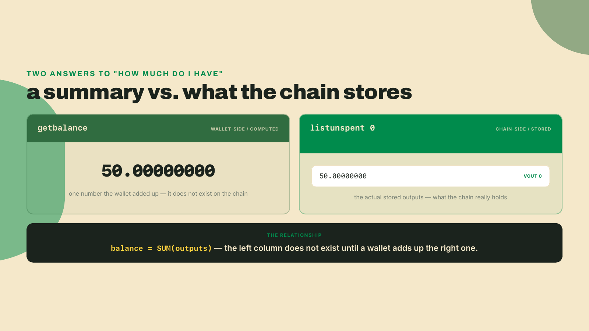
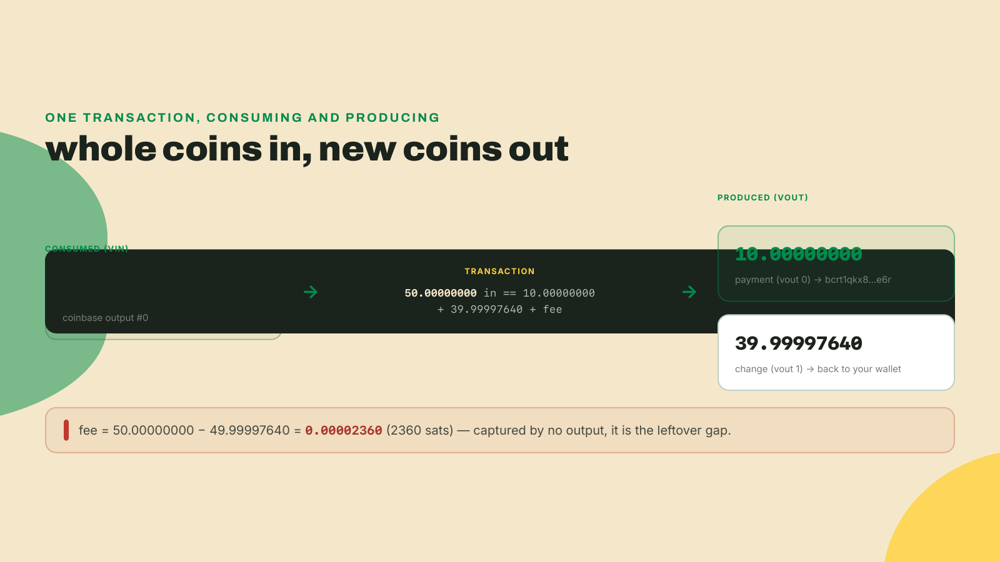
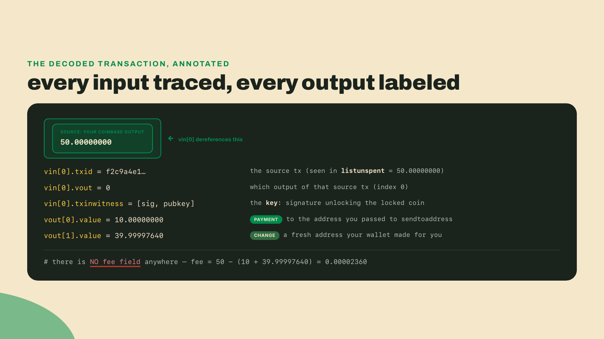
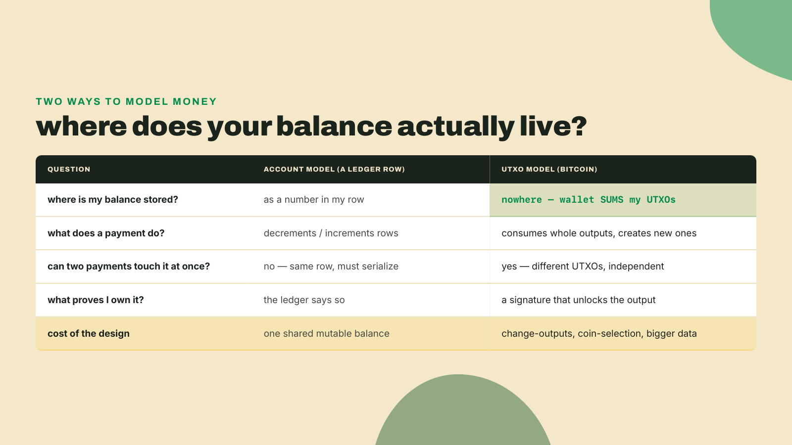
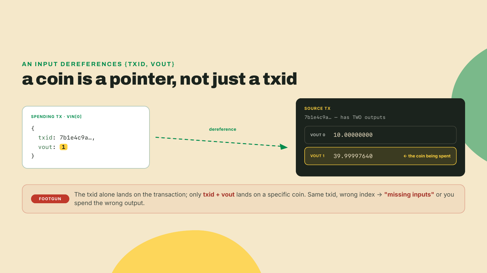
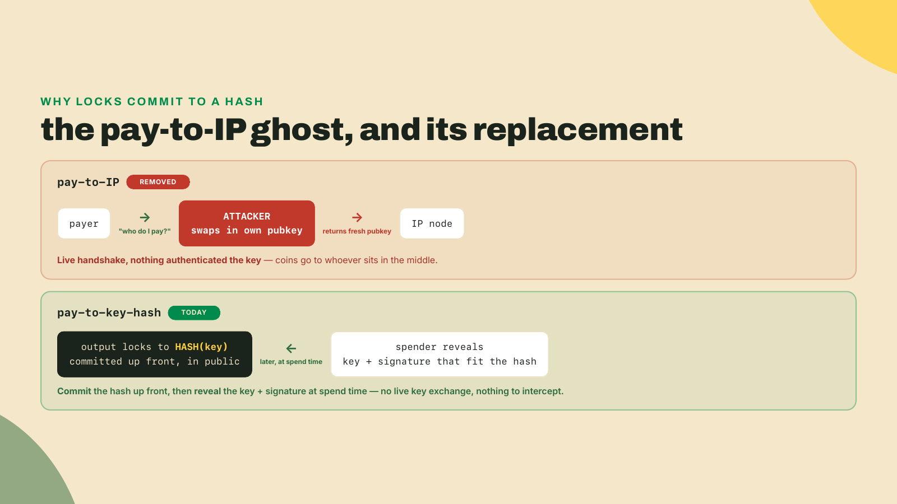
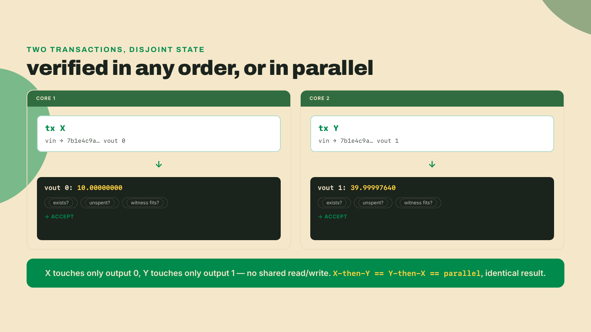
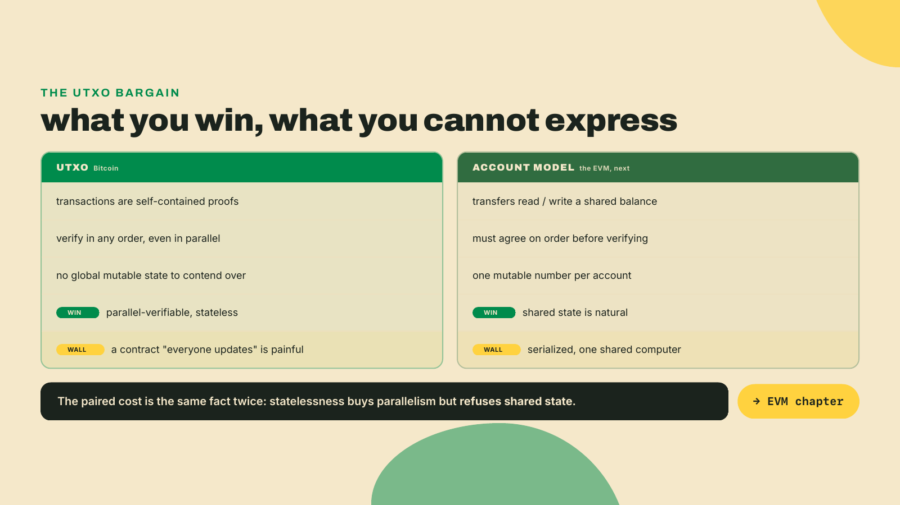
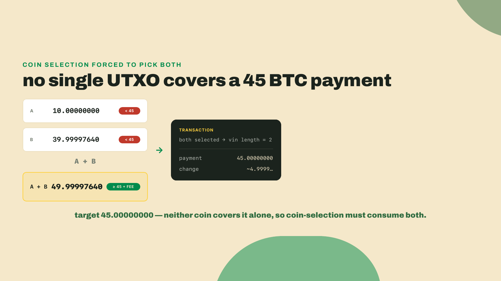

# Spend a UTXO: there is no balance, only unspent outputs

Last lesson you mined 101 blocks on a chain nobody else runs, and your wallet lit up: 50 BTC, spendable, yours. Real coins on a real, if private, Bitcoin. So start that node again, because I am about to take that number away from you, and I mean it literally. It is not stored anywhere on the chain. Terminal open.

```bash
bitcoin-cli -regtest getbalance
bitcoin-cli -regtest listunspent 0
```

Expected (your txid and address will differ; every regtest wallet rolls its own):

```
50.00000000
[
 {
 "txid": "f2c9a4e17b3d8056c1a9e04f7b2d6c8a3e5f0917d4b6c2a80e3f1957c6d4b0a2",
 "vout": 0,
 "address": "bcrt1q7f3d9s2a6g0h4j8k1l5p9q3w7e2r6t0y4u8i2o",
 "amount": 50.00000000,
 "confirmations": 101,
 "spendable": true,
 "safe": true
 }
]
```

Two commands, two very different answers to the same question. `getbalance` hands you one tidy number. `listunspent` (list unspent transaction outputs) hands you a list, and here it holds exactly one entry: a single 50 BTC output sitting at output index `0` of some transaction, matured after 101 confirmations. That single output is your whole fortune. The tidy number was your wallet doing arithmetic on it.



## Send it, then read it back

Naming the pieces can wait. Send a payment first, then dissect the receipt. Make yourself a fresh address to pay, then pay it 10 BTC:

```bash
DEST=$(bitcoin-cli -regtest getnewaddress)
bitcoin-cli -regtest sendtoaddress "$DEST" 10
```

You get back a single line, a transaction id:

```
7b1e4c9a2f6d0358e9c4a7b1d5f8203c6e9a4b7d0f2c58a1e6b3d9f04c7a2e85
```

That is the txid of the transaction you just broadcast into your node's **mempool** (the waiting room of transactions not yet mined into a block).

Right now that transaction is unconfirmed. It lives only in the mempool, signed and broadcast but not yet written into any block, and it will sit there until a miner picks it up. On mainnet that miner is a stranger racing thousands of others for the fee you attached; on regtest the miner is you, and nothing gets mined until you say so. This is the lifecycle every payment walks, without exception. A wallet builds and signs it, the transaction lands in the mempool at zero confirmations, a miner eventually packs it into a block and it earns its first confirmation, and each block stacked on top afterward deepens that count by one. A merchant selling something real watches that number climb before handing over the goods, because a zero-confirmation transaction is only a promise: it can still be dropped by a node that runs low on memory, or replaced by a competing version that pays a higher fee. Depth is what turns a promise into settlement. That confirmation count is also the reason you have been typing `listunspent 0` and not plain `listunspent`. The trailing `0` is a minimum-confirmations filter, and it means "show me outputs with at least zero confirmations," which includes the ones still sitting unconfirmed in the mempool. Drop the `0` and the default floor of one confirmation would hide every output your brand-new, unmined transaction just created, and you would swear the coins had vanished. They have not. They are waiting for a block, exactly like the payment you just sent.

Notice the shape of what happened. You had one 50 BTC output. You wanted to move 10. Bitcoin does not have a subtract button that shaves 10 off a coin and leaves 40 behind in place. It cannot edit an output. It can only do two things: consume outputs whole, and create new ones. So to pay 10 from a 50 it must swallow the entire 50 and hand you the remainder back as a brand-new output. Watch it do exactly that.

## Decode: inputs on the left, outputs on the right

Pull the raw transaction and decode it into something you can read. Save the txid, fetch the hex, and expand it:

```bash
TXID=7b1e4c9a2f6d0358e9c4a7b1d5f8203c6e9a4b7d0f2c58a1e6b3d9f04c7a2e85
RAW=$(bitcoin-cli -regtest getrawtransaction "$TXID")
bitcoin-cli -regtest decoderawtransaction "$RAW"
```

Trimmed to the fields that carry the lesson (your txids, addresses, and the payment/change order will differ, and that last point matters more than it looks):

```json
{
  "txid": "7b1e4c9a...c7a2e85",
  "version": 2,
  "vin": [
    {
      "txid": "f2c9a4e17b3d8056c1a9e04f7b2d6c8a3e5f0917d4b6c2a80e3f1957c6d4b0a2",
      "vout": 0,
      "txinwitness": [ "3044...01", "02e9...4c7a" ],
      "sequence": 4294967293
    }
  ],
  "vout": [
    {
      "value": 10.00000000,
      "n": 0,
      "scriptPubKey": { "address": "bcrt1qkx8z3m9v0n7c2a5s6d4f8g1h3j7l0p9q2w4e6r",
                        "type": "witness_v0_keyhash" }
    },
    {
      "value": 39.99997640,
      "n": 1,
      "scriptPubKey": { "address": "bcrt1q9w2e6r4t7y0u3i5o8p1a4s7d0f3g6h9j2k5l8z",
                        "type": "witness_v0_keyhash" }
    }
  ]
}
```

There it is: one input (`vin`), two outputs (`vout`). Look hard at that single input. It carries no amount. It carries a pointer: a `txid` and a `vout` index. Read the pointer. Its `txid` is `f2c9a4e1...` and its `vout` is `0`, which is the exact coin you saw in `listunspent` at the top of this lesson: output index 0 of your matured coinbase (the special first transaction of a block that mints new coins to the miner). The transaction you just built reaches back, names that 50 BTC output by address, and eats it.



## Trace it by hand: the artifact

This decoded transaction is the artifact you keep from this lesson. Not a file the toolkit runs; a thing you learn to read, because every watcher bot and explorer you build later is this act of reading, automated. So do it manually now, once, slowly.

Annotate three things, and do each one against the JSON on your screen rather than against my prose.

Start with the input. Put your finger on `vin[0]` and read only its two identifying fields. Its `txid` is `f2c9a4e1...` and its `vout` is `0`. Now scroll back to the very first `listunspent` you ran, before you spent anything, and read its one entry: `txid` `f2c9a4e1...`, `vout` `0`, amount 50 BTC. Same txid, same index. That is not a coincidence and not a database lookup; it is a literal pointer, and following it by eye is the entire skill this lesson exists to teach. Write beside `vin[0]`: source is the coinbase output, index 0, worth 50 BTC. Notice what you had to do to get that number. The input itself has no `value` field, so the 50 came from the output it names, not from the input. That fetch, done automatically, is what a node performs on every input it validates before it can even begin the arithmetic.

Now the outputs, one at a time. Read `vout[0]`: value 10 BTC, address `bcrt1qkx8...`. Compare that address to the `$DEST` that `sendtoaddress` created and paid. They match, so `vout[0]` is the **payment**, the coin leaving for someone else. Label it. Read `vout[1]`: value 39.99997640, a different address, one you never typed and never saw until this decode. That is the **change-output** (the leftover an output sends back to you when the input you spent is bigger than the amount you wanted to send). Your wallet minted a fresh address, addressed the remainder to itself, and never asked your permission. Label it change, and write down its value, because you will predict it again in the solo exercise.

Last, look at the input's `txinwitness`, the two-element array holding a signature and a public key. This is the reveal from the keys-and-signatures lesson doing its one job right here: it unlocks `vin[0]`, proving you hold the private key that the coinbase output was locked to. Strip that witness out and the transaction becomes a claim with no proof behind it, and every honest node on the network rejects it on sight. An output is a lock; the witness is the key turning in it. Read those three annotations back in order, input to source, each output to its role, witness as the unlocking proof, and you have narrated a whole transaction straight from raw JSON. That narration is exactly what every block explorer does behind its pretty tables, and now you can do it without one.



## Your balance is a bedtime story

Now settle the bet from the top. Run the two commands again:

```bash
bitcoin-cli -regtest getbalance
bitcoin-cli -regtest listunspent 0
```

```
49.99997640
[
 { "txid": "7b1e4c9a...c7a2e85", "vout": 0, "amount": 10.00000000... },
 { "txid": "7b1e4c9a...c7a2e85", "vout": 1, "amount": 39.99997640... }
]
```

The 50 BTC coin is gone from the list. It was consumed, and a consumed output never reappears. In its place sit two outputs, both yours, both children of the transaction you sent: the 10 BTC payment (your fresh address was in your own wallet, so it counts) and the 39.99997640 change. Your `getbalance` fell to 49.99997640, which is 50 minus exactly 0.00002360, the fee. And here is the reveal the whole lesson was pointed at. Where is the 50 living, then? Nowhere: your wallet added it up. A **UTXO** is an unspent transaction output, a discrete chunk of bitcoin created by one transaction and not yet eaten by another, and your wallet's "balance" is nothing but the sum of every UTXO it holds a key for. Spend one, and the sum recomputes. There is no account, no row, no field named `balance` on the chain that a transaction increments or decrements. There are only outputs: created, then later destroyed, whole.



## The fee hides in the gap

Go back to that decoded transaction and hunt for the fee. You will not find it. There is no `fee` field, and that absence is the first footgun that bites everyone. The fee is not declared; it is inferred, as the gap between what went in and what came out. Every satoshi of an input must be either spent to an output or left on the table for the miner, and whatever you leave on the table is the fee. Compute it yourself, in satoshis, because satoshis are the real unit and BTC is the display fiction (100,000,000 sats to a coin):

```bash
python3 -c "print(5000000000 - 1000000000 - 3999997640)"
```

```
2360
```

Fifty coins in, as 5,000,000,000 sats. Two outputs out, 1,000,000,000 plus 3,999,997,640, which is 4,999,997,640. The 2,360 sat difference is the fee, and it is captured by no output at all, which is precisely why the decode has no field for it. This is also why you should stop thinking in BTC the moment arithmetic matters: had I subtracted those numbers as floating-point BTC, Python would have handed me `2.3599999...e-05` and a wave of doubt. Integers of satoshis never lie to you. The chain reasons in satoshis; so should you.

## An input is a pointer, not a coin

The second footgun is quieter and cost me an afternoon once, so let me pay that lesson forward. When I built my first raw transaction by hand, I copied the txid I wanted to spend and set the input's `vout` to `0` out of habit, because the coin I wanted happened to be the first output in my head. It was the second. My node rejected the transaction with a flat "missing inputs," and I spent an hour re-reading signature code that was perfectly fine. The bug was one integer. An input names its prey with two numbers, not one: the `txid` of the transaction that created the output, and the `vout` index of which output in that transaction. A txid alone is ambiguous, because one transaction can create many outputs, and here yours creates two that share the same txid and differ only by index 0 versus 1.

That is why `listunspent` reports both `txid` and `vout` on every entry, and why the payment/change order in your decode being possibly flipped from mine is not a cosmetic detail. If your wallet put change at index 0 and payment at index 1, then "spend the change" means `vout: 1` for you and `vout: 0` for me. Confuse the txid you sent with the output index you spend, and you either point at nothing or point at the wrong coin.



## Addresses are hashes because of a ghost

Look once more at each output's `scriptPubKey`. That field is the lock: the condition a future spender must satisfy, and here it is `witness_v0_keyhash`, meaning "spendable by whoever can sign with the key that hashes to this value." The address `bcrt1q...` you saw is just that key-hash, wrapped in a friendly encoding (bech32, the regtest variant prefixed `bcrt`). Notice what the lock commits to: a hash of a key, never the key itself. There is a historical reason for that, and it is a good ghost story.

Early Bitcoin had a pay-to-IP mode, removed as insecure. You could point your client at an IP address, and the node behind it would hand back a fresh public key to pay to, live, over the wire. Convenient, and fatally so: nothing authenticated that the key came from who you meant to pay, so anyone sitting between you and that IP could swap in their own key and pocket the coins. It was removed as trivially attackable, and its ghost is the reason ownership today is expressed as a hash of a key baked into the output. You commit, in advance and in public, to the fingerprint of who may spend, and the spender later reveals the key and a signature that fit it. No live handshake, nothing to intercept. That is the same commit-then-reveal shape you built with hashes two lessons ago, now guarding coins, and the `txinwitness` you traced is the reveal half firing.



## Why count this way, and where it hurts

The obvious design is the one you would reach for on any Tuesday: store a balance per person and add and subtract from it. Bitcoin refuses, and the refusal buys something specific. Because every UTXO is independent, two transactions that spend different outputs never touch the same piece of state, so a validator can check them in any order, or at the same time, and reach the identical answer. Each transaction carries its own proof: name the outputs it consumes, show signatures that unlock them, and the math is complete without consulting a global "balance" that another transaction might be editing this instant. Verification is local and order-free.

Make that concrete with the two coins you now hold. Say two transactions arrive at a node in the same instant. Transaction X spends your 10 BTC output, `vout` 0 of `7b1e4c9a...`. Transaction Y spends your 39.99997640 output, `vout` 1 of the very same transaction. A validator picks up X, follows its input pointer to output 0, confirms that output exists and is still unspent, checks the witness against the lock, and accepts. It picks up Y and does the same walk to output 1, wholly independently. Feed them in the order X then Y, or Y then X, or hand X to one CPU core and Y to another running in parallel: every path reaches accept, because the two proofs never read the same byte of state. Neither transaction needs to know the other exists. The node does not have to decide which one went first, because going first means nothing when the state each transaction touches is disjoint from the other.



The account model works the other way, and this is where the cost lands. Picture the same value living as a single balance row that reads 49.99997640. Transaction X wants to subtract 10 from that row; transaction Y wants to subtract 39.99997640 from it. Both must read that one number, and both must write it back, so the system cannot check them independently no matter how many cores it owns. Run X first and the row holds 39.99997640 by the time Y reads it; run Y first and it holds 10 when X reads it; run them at the same instant on two cores and they can clobber each other's write and leave the row holding a wrong total, with coins conjured or destroyed. To stay correct, the system must serialize those two transfers and agree on their order before it can even begin to check them. That forced ordering is the tax the account model pays on every conflicting transfer, and the UTXO model simply does not owe it.

That independence is not a free win, and this course names the bill every time. Grant the account model its real strength first: a single mutable balance is the natural home for shared state, for a pot of money that many parties update by a common rule, which is exactly what a contract is. UTXOs make that miserable. There is no "the pool's balance" to nudge; there is a scattering of discrete outputs, and expressing "everyone can add to this and the rule decides who withdraws" means threading logic through outputs that were built to do one thing: sit locked until one key unlocks them. So the trade-off, stated plainly: UTXOs give Bitcoin parallel-verifiable, stateless transactions, but make shared state, like a contract everyone updates, miserable to express. Hold that thought until the EVM chapter, where a different chain pays the opposite bill to get contracts back.



## Build: annotate the decode

Your completion task is the reading, not new code. Take the decoded transaction you produced above and annotate it by hand, in the toolkit repo, as a comment block or a short note beside the JSON. Three claims, each provable from what you ran:

- Every input traced to its source output. For `vin[0]`, write the source txid and vout, and its value, which you read off `listunspent` before you spent it. One input here, so one trace.
- Every output labeled payment or change. Say which `n` is the payment (matches the address you passed to `sendtoaddress`) and which is change (an address your wallet made), with each value.
- The fee, computed as source value minus the sum of outputs, in satoshis, matching the `2360` you printed.

That annotated decode is the whole artifact. It feeds the watcher you build in the infrastructure module, which does this same tracing on transactions it never sent, for wallets it does not own.

## Do it yourself: force two inputs

Now the solo half, where you make coin selection show its hand. You currently hold two UTXOs: 10.00000000 and 39.99997640. **Coin-selection** is your wallet's algorithm for choosing which UTXOs to feed into a payment. It is not as dumb as grabbing coins at random, and understanding the two strategies it runs tells you exactly why change appears when it does.

Bitcoin Core tries two approaches in sequence. First it attempts branch-and-bound, a search for some subset of your outputs whose total lands on the target plus fee almost exactly. An exact match is the prize, because it lets the wallet skip creating a change output at all, and a transaction with no change is smaller, cheaper to confirm, and leaks less about which coins are yours. When no such tidy subset exists, the wallet falls back to a knapsack-style selection that, in the simple case, behaves largest-first: take the biggest output you own, and if that one alone does not cover the bill, add the next biggest, and keep adding until the running total clears the target plus fee. Here is the part that produces change. Whatever the running total overshoots the target by does not evaporate and cannot be left inside an input, because a payment must account for every satoshi of every input it consumes. The overshoot has to go somewhere, so the wallet hands it back to you as a second output. Leftover is the cause of change, every single time, and branch-and-bound exists precisely to avoid leftover when it can.

Now give the algorithm a problem that only one answer solves: send 45 BTC. Branch-and-bound hunts for a subset that sums near 45 and finds none, because neither 10 nor 39.99997640 nor any single coin you hold sits anywhere near 45. Largest-first takes over: it grabs the 39.99997640, sees that it falls short of 45, and is forced to add the 10 as well, producing a transaction with exactly two inputs. Their sum, 49.99997640, overshoots 45 by just under 5 BTC, so that leftover comes straight back as a change output. You have engineered both a two-input transaction and a fresh change output at once, out of a single carefully chosen number. Predict the before and after, then run it and check.

```bash
DEST2=$(bitcoin-cli -regtest getnewaddress)
bitcoin-cli -regtest listunspent 0 | python3 -c 'import json,sys; print(len(json.load(sys.stdin)))'
bitcoin-cli -regtest sendtoaddress "$DEST2" 45
bitcoin-cli -regtest listunspent 0 | python3 -c 'import json,sys; print(len(json.load(sys.stdin)))'
```

You should see `2`, then a txid, then `2` again. Decode that new txid and confirm `vin` has length 2 and the two pointers match the coins you predicted.



In your write-up, explain the selection in one line: the wallet chose both because 45 exceeds every single UTXO you hold, and the only subset that clears 45 plus fee is the whole set. That sentence is the analyze objective, earned from a number you forced.

## Checkpoint

Close the terminal and answer from memory, out loud, in two sentences: where does your 50 BTC "balance" actually live, and what does a transaction do to the outputs it touches? A good answer says the balance lives nowhere on the chain, that your wallet computed it by summing the UTXOs it can unlock, and that a transaction consumes whole outputs and creates new ones, with the fee being the unclaimed gap between inputs and outputs. Bonus if you can state why an input needs both a txid and a vout index. And your annotated decode should stand on its own: every input traced to its source output, every output labeled by role, and `listunspent` before and after matching what you predicted.

You just drove all of this through `bitcoin-cli` like a magic wand: type an English verb, coins move, JSON appears. Next lesson you find out the wand was HTTP all along. `bitcoin-cli` is a thin client that has been quietly POSTing JSON-RPC calls to a server on your own machine the entire time, and once you can speak that protocol raw, you can drive a node from anything: a script, a bot, a service that never sleeps. That is where the toolkit stops being a pile of commands and starts becoming infrastructure.
