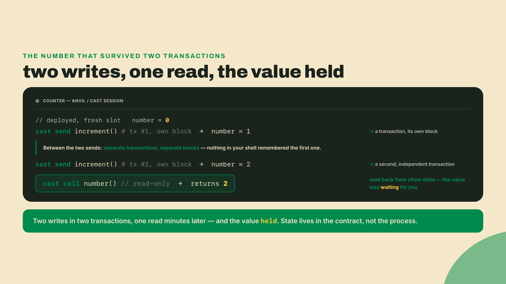
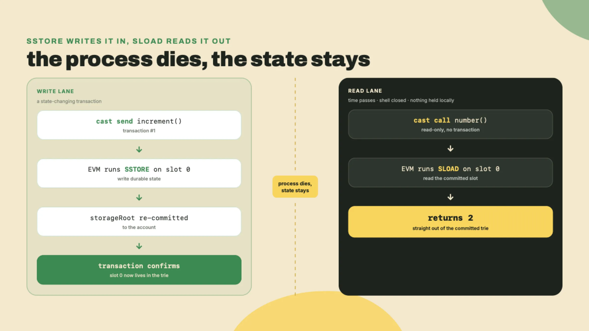
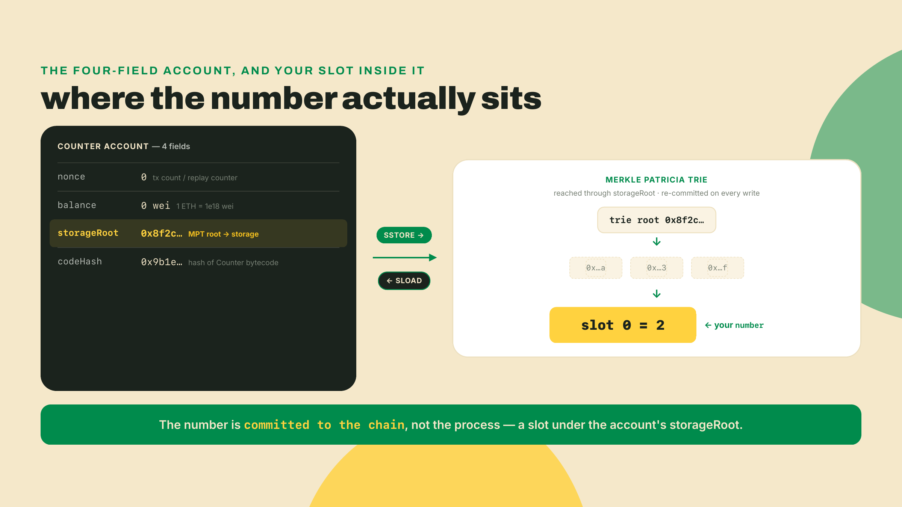
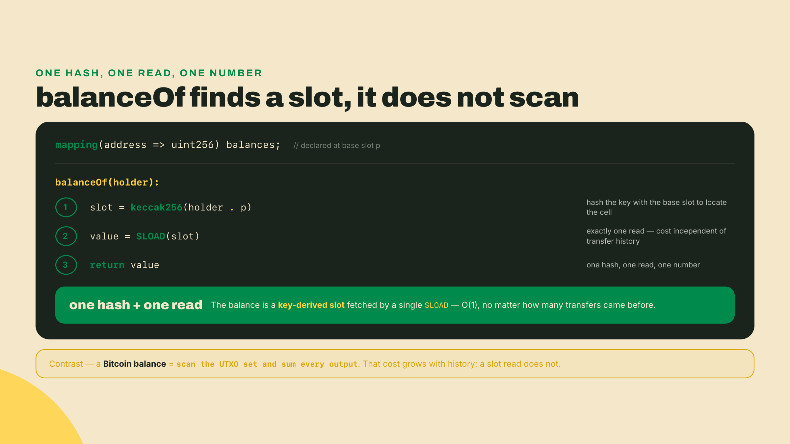
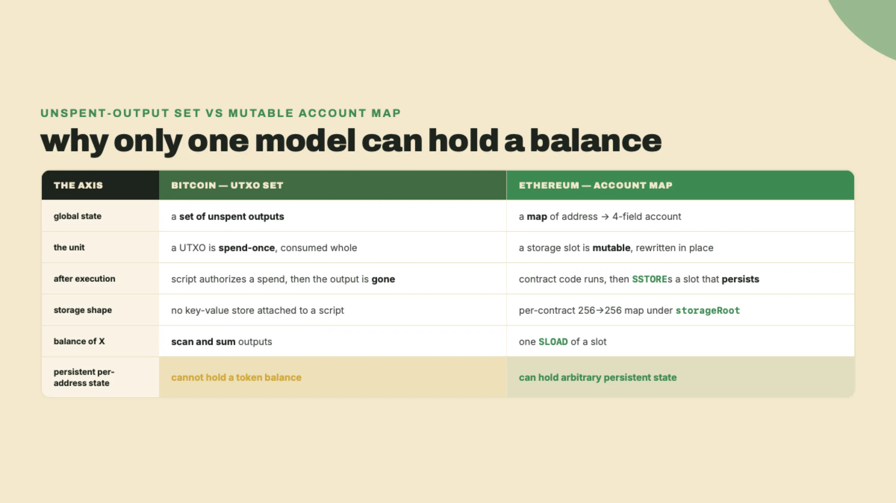
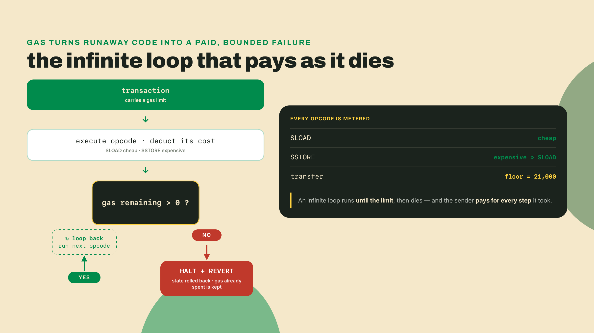
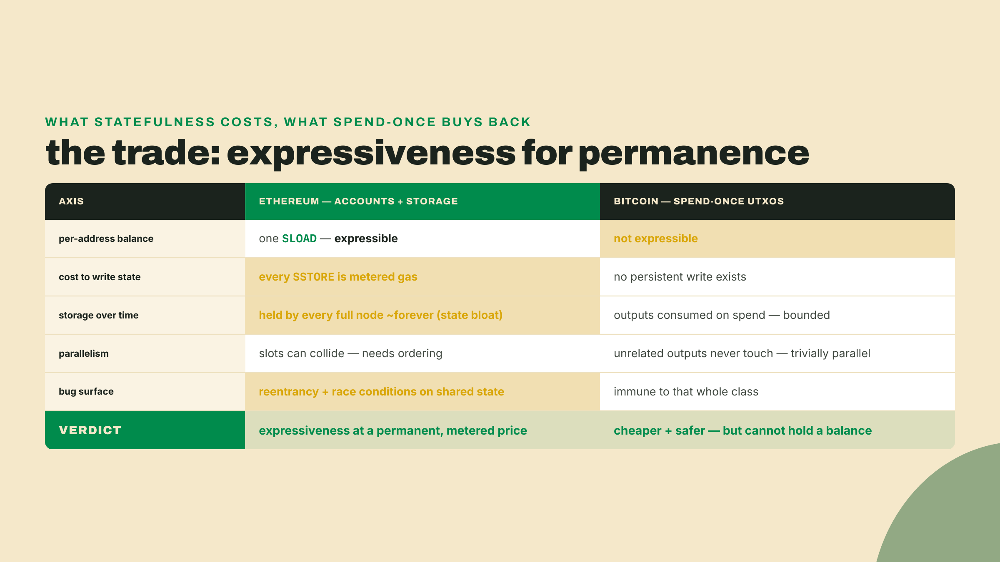

# The number that remembers: why a coded ledger needs accounts, not UTXOs

Last lesson you watched unconfirmed transactions stream through the mempool: raw movement, no memory. Money changed hands, and the wire forgot it the instant the transaction confirmed. Now we chase where the numbers those transactions change actually live.

Start with a question Bitcoin structurally cannot answer: how many USDC does one address hold? There is no such number anywhere in Bitcoin. To produce it you would have to sum every unspent scrap that address ever received, one by one, by hand. Yet ask an ERC-20 token contract (the standard fungible-token contract on Ethereum) the same thing and it answers instantly, from a single slot it just... remembers. Where does that number physically live, and why can no Bitcoin output ever hold it?

Don't theorize. Boot a machine that has the number and watch it remember. Terminal open.

```bash
anvil
```

```
Available Accounts
==================
(0) 0xf39Fd6e51aad88F6F4ce6aB8827279cffFb92266 (10000.000000000000000000 ETH)
(1) 0x70997970C51812dc3A010C7d01b50e0d17dc79C8 (10000.000000000000000000 ETH)
... (8 more, 10 accounts total)

Private Keys
==================
(0) 0xac0974bec39a17e36ba4a6b4d238ff944bacb478cbed5efcae784d7bf4f2ff80
... (9 more)

Wallet
==================
Mnemonic: test test test test test test test test test test test junk

Listening on 127.0.0.1:8545 (Chain ID: 31337)
```

That banner is the canonical local EVM devnet in 2026: Anvil, part of Foundry, a full Ethereum Virtual Machine (the EVM, the runtime every Ethereum node executes contract code on) speaking JSON-RPC at http://127.0.0.1:8545 on chain ID 31337. It hands you ten accounts, each preloaded with 10,000 ETH, unlocked and ready.

Look hard at the wallet line, because it is a footgun with a body count. The mnemonic is `test test test test test test test test test test test junk`, identical on every Anvil, on every machine, forever. Account (0), `0xf39Fd6e51aad88F6F4ce6aB8827279cffFb92266`, is one of the most-known addresses in crypto, and its private key `0xac09...ff80` is printed in a million tutorials, this one included. On localhost that sameness is pure convenience. Send one cent of real ETH to that address on mainnet and it is drained before the next block confirms, because automated sweepers watch it around the clock. Never let that key touch a network you care about.

Leave `anvil` running. Open a second terminal. We need something to remember.

## A ten-line contract, deployed and poked

One beat first, because this is the first code you author in this whole course, and it is Solidity. You do not need to know Solidity to follow along here, so read this 30-second version as if you already know a little Python.

A `contract` is basically a class: a named box that bundles some data with the functions that act on it. The one word that makes it different is persistent. An ordinary class forgets its fields the instant the program exits; a contract writes its fields to the chain, where they survive, which is the entire subject of this lesson. `uint256` is the type of our single field, an unsigned integer up to 256 bits, which is just a whole number that is never negative and can get astronomically large. Solidity makes you spell out a type for every value, the way Python type hints do, except here it is mandatory. `public` asks the compiler to generate a free read function for that field, so anyone outside can ask what it currently holds. And the very top line, `pragma solidity ...`, is not code the contract runs at all: it is a version stamp telling the compiler which Solidity releases this file may build with. That is the whole vocabulary you need for the ten lines coming up.

Scaffold a Foundry project and write the smallest thing that can hold a number. `forge init` drops a sample contract, a test, and a script into the new folder; move into it and clear the two samples, because they call a `setNumber` method our minimal contract will not have, and a leftover test that references a missing method fails the whole build:

```bash
forge init counter && cd counter
rm test/Counter.t.sol script/Counter.s.sol
```

Now drop this into `src/Counter.sol`, replacing the sample the template left there:

```solidity
// SPDX-License-Identifier: MIT
pragma solidity ^0.8.20;

contract Counter {
    uint256 public number;

    function increment() public {
        number += 1;
    }
}
```

One line there earns a pause: `pragma solidity ^0.8.20`. The caret means "0.8.20 or any compatible newer release." Pin `^0.8.20` for broad compatibility: it is old enough that every toolchain understands it and new enough to carry the safety features this lesson leans on. If you would rather pin to the newest stable release, check the current one at soliditylang.org, because which version counts as latest rots fast and any number I write here goes stale quickly. For a lesson contract, `^0.8.20` is the safe default.

Deploy it to the node you just booted:

```bash
forge create src/Counter.sol:Counter \
  --rpc-url http://127.0.0.1:8545 \
  --private-key 0xac0974bec39a17e36ba4a6b4d238ff944bacb478cbed5efcae784d7bf4f2ff80
```

```
Deployer: 0xf39Fd6e51aad88F6F4ce6aB8827279cffFb92266
Deployed to: 0x5FbDB2315678afecb367f032d93F642f64180aa3
Transaction hash: 0x2f5c...
```

Treat `forge create` as live fire. The moment you hand it `--private-key`, it signs and broadcasts a real deployment transaction to that RPC. On Anvil the gas is play money. Point the same command at a real network and it spends real ETH, with no preview step to save you.

Save the address it printed, then poke the contract with two separate transactions and read the result:

```bash
export COUNTER=0x5FbDB2315678afecb367f032d93F642f64180aa3

cast send $COUNTER "increment()" --rpc-url http://127.0.0.1:8545 \
  --private-key 0xac0974bec39a17e36ba4a6b4d238ff944bacb478cbed5efcae784d7bf4f2ff80
cast send $COUNTER "increment()" --rpc-url http://127.0.0.1:8545 \
  --private-key 0xac0974bec39a17e36ba4a6b4d238ff944bacb478cbed5efcae784d7bf4f2ff80

cast call $COUNTER "number()(uint256)" --rpc-url http://127.0.0.1:8545
```

```
2
```

Sit with what just happened, because it is subtler than "a program counted to two." Each `cast send` is a fully independent transaction, mined into its own block, with nothing in your shell holding a value between the two commands. You could close the terminal between them. The second `increment()` had no memory of the first inside your machine, yet the number came back `2`. It climbed, and it stayed, across a boundary that should have wiped it.



Here is the cruel footnote, and my own first stumble on it. The first time I built on Anvil I lost an afternoon to a contract that kept resetting to zero. I had a shell script restarting `anvil` between test runs, quietly wiping the very state I was trying to inspect. The node was behaving exactly as documented: Anvil holds all state in memory, so persistence here is per-run, not durable. Kill the process and your Counter and its number vanish. The value survives independent transactions, which is the whole point of this lesson. It does not survive the machine. Real Ethereum keeps this same state on thousands of disks, effectively forever, and that difference is a cost we will put a number on before we finish.

## Where the number actually lives

Heads up before this next stretch: this is the conceptually dense heart of the lesson, and it is completely fine to take the EVM account model slowly, rereading or circling back until it settles.

Now you have earned the word. That number lives in the contract's **storage**: a per-contract key-value map, and each 256-bit cell in it is a **storage slot**. Your `number` sits in slot 0.

To see how storage attaches to a contract, name the thing that owns it. An Ethereum account is a 4-field tuple: nonce (tx count / replay-attack counter), balance (in wei, 1 ETH = 1e18 wei), storageRoot (256-bit Merkle Patricia Trie root of contract storage), codeHash (hash of contract bytecode; for EOAs = keccak256 of empty string). That tuple is the whole account. Every address on Ethereum, yours and your Counter's alike, is exactly those four fields.

The one to stare at is `storageRoot`. Contract storage is a per-contract 256-bit integer to 256-bit integer key-value map, committed as a **Merkle Patricia Trie** (a hash tree that folds an entire key-value map down to a single 256-bit root). That root, `storageRoot`, sits in the account header. When `increment()` ran, the EVM executed an `SSTORE` **opcode** (opcodes are the EVM's individual machine instructions; `SSTORE` writes a storage slot, `SLOAD` reads one) that wrote slot 0. When you called `number()`, it ran `SLOAD`. Both persist across transactions because the map is committed to the chain, not to the process. The number was never in memory waiting for you. It was in the trie, sealed under a root, where any node on Earth can recompute it.



But why fold storage into a single number at all, instead of just keeping the map and looking things up? Because a root is a *commitment*: a value you can check against without trusting whoever hands you the data underneath it. The Merkle Patricia Trie hashes every slot into its parent node, and every parent into its parent, until the entire map collapses into one 256-bit hash. Change a single slot anywhere in the map and that top hash changes with it; there is no way to alter a value and leave the root untouched. That property is what turns stored state into *provable* state. Suppose some node claims your Counter's slot 0 holds `2`. Rather than take its word, you demand a proof: the value itself, plus the handful of sibling hashes along the path from that leaf up to the root. You hash your way up the path yourself, and if you arrive at the `storageRoot` you already hold, the value is confirmed. You verified one slot without ever downloading the other slots, and without trusting the node that served it. The proof stays small, logarithmic in the size of the map rather than the whole thing, which is exactly why this scales to millions of accounts.

The commitment also nests, and that is the part that matters for the whole chain. The `storageRoot` lives inside the account, and every account hashes into a single global **state root** that is sealed into the block header the validators agree on. So one slot is checkable all the way up the ladder: slot → storageRoot → state root → block header. A light client holding nothing but block headers can query some untrusted node for a single balance and verify the answer against a header it already trusts. This is not an academic nicety, either: it is precisely how a bridge, or a light client running on another chain, reads an Ethereum value without running a full Ethereum node. They hold headers and check proofs. Committing to a root, rather than merely keeping a map, is what makes state something anyone can prove without storing any of it.



Now walk back to the question that opened this lesson: how many USDC does an address hold? You can finally answer it, and the answer runs on exactly the machinery you just watched. A token balance does not sit in slot 0 the way your `number` does, because a token contract has to remember a balance for every holder at once. It keeps them all in a single `mapping(address => uint256)`: a map from a holder's address to their amount. When you call `balanceOf(someAddress)`, the contract scans nothing and sums nothing. It takes the mapping's declared base slot `p` and the holder's address as the key, hashes the two together, `keccak256(key . p)`, to derive the one storage slot where that holder's balance lives, and issues exactly one `SLOAD` against it. One hash to locate the slot, one read to fetch it, one number back. Reading it is a single `SLOAD` whose cost does not grow with how many transfers the holder ever received, which is the opposite of a Bitcoin balance that must sum a lifetime of outputs.

That is the "single slot it just remembers" from the opening image, made concrete. The balance was placed there by an earlier `SSTORE`, a transfer in or a mint, and it has waited in the trie ever since, addressable by anyone who knows `p` and the address. Any node can recompute the same slot from the same two inputs and prove the returned value against the state root, so the balance is not merely fast to read, it is verifiable to read. Bitcoin has no `p`, no key-derived slot, and no `SLOAD` to serve one, which is precisely why the same question has no answer there, as the rest of this lesson makes structural.



Where a variable sits inside that map is a real enough problem that the language now has opinions about it. Solidity 0.8.35, released April 29, 2026, added the `erc7201` builtin for computing namespaced storage slots: a language-level admission that "which slot does this variable occupy" is a first-class design question, not an afterthought you can leave to chance.

Two kinds of account share that four-field tuple, and the difference between them is the whole model. An **externally-owned account (EOA)** is controlled by a private key and can initiate transactions. Account (0), the one that deployed your Counter, is an EOA. A contract account is controlled by its bytecode: it holds storage and code, but it can only respond to incoming transactions, never start one. Your Counter is a contract account. It did nothing until you sent it `increment()`, then it ran its code and wrote its slot. Key signs; code responds.

There is one honest blur to name, because 2026 tooling leans on it. Since EIP-7702, shipped in the Pectra hardfork (mainnet May 7, 2025), an EOA can temporarily set its `codeHash` to point at a contract for the duration of a single transaction, borrowing contract behavior for one call. It is the first time an externally-owned account could wear code at all, bending a line Ethereum drew at launch in 2015. But it bends the line; it does not erase it. The borrowed code runs, then the `codeHash` reverts. A contract account still holds persistent, autonomous storage that outlives any single transaction, and a borrowing EOA does not. Persistent per-contract state is still the thing only contract accounts own.


## Why no UTXO can hold that number

Now map hard from what you already watched. Back in the mempool, Bitcoin's global state is not a table of balances at all. It is the unspent-output set: a pile of **UTXOs** (unspent transaction outputs). A UTXO is spend-once and immutable. It is created by one transaction's output and consumed entirely by the single transaction that spends it. There is no persistent key-value store attached to a Bitcoin script, and no slot anywhere that survives a spend.

So "how many USDC does this address hold across all its interactions" has no home in Bitcoin. Watch the obvious fixes fail, one tier at a time, because ruling them out *is* the derivation.

The first instinct: just sum the address's UTXOs. That gives you a quantity of BTC, computed by scanning the set, not a stored per-token number that any contract can read in a single step. And it only works for the one native coin. There is no "USDC" object sitting in the set to sum, because there is no place to have written one. What you get back is a total recomputed by walking the set, the one thing reading a stored slot never makes you do.

The second instinct: teach the Bitcoin script to keep a balance. A script is a spend condition. It authorizes whether an output may move, and then the output is consumed and gone. It cannot write a value that outlives the spend, because the thing it guards ceases to exist the moment it succeeds. There is nowhere for the number to persist past the transaction that used it.

The third instinct: bolt a side table of balances next to the chain. Do that and you have invented an account map, which is exactly the Ethereum model wearing a disguise, and you still need code that runs on read and write to maintain it. You did not fix UTXOs. You replaced them.

That is the whole argument. A ledger that runs code needs accounts plus storage precisely because scripts can only authorize coin movement, never mutate shared state that persists. The number that remembers requires a place built to remember: a mutable slot in a per-account map, committed to a root, written by `SSTORE` and read by `SLOAD`. Bitcoin never built one, on purpose. Ethereum built exactly one, on purpose, and that single decision is what lets a contract answer a balance query in one read while Bitcoin cannot answer it at all.



## The meter that makes code safe

One loose end dangles. If a contract can run arbitrary code, what stops a contract with an infinite loop from freezing every node on Earth? A malicious `while (true) {}` would hang the whole network the moment it confirmed.

Gas.

Gas is the EVM's metering unit, and you pay for it in ETH (whose smallest unit is the wei: 1 ETH = 1e18 wei). Every opcode costs a fixed amount of gas. `SLOAD` costs a little; `SSTORE` costs a lot, because writing durable state is the expensive thing on the whole machine. A plain ETH transfer that touches no contract costs exactly 21,000 gas, a fixed floor you can count on. Every transaction carries a gas limit, and if execution exceeds it, the EVM halts and reverts, keeping the gas already spent. An infinite loop does not hang the network. It runs until it burns through its limit, then dies, and the sender pays for every step it took on the way down. Infinite loops are not forbidden by a rule. They are made economically impossible, which is a stronger guarantee: you do not have to detect them, you only have to charge for them.

That pricing is also why `SSTORE` is the costly opcode. You are not paying for a computation that ends. You are paying every full node to hold your written bytes on disk indefinitely, and the fee is the closest thing the system has to rent on permanence.



## The trade-off

Every design in this course gets its bill named out loud. Here is this one, and it comes due in full.

Persistent accounts buy expressiveness. A single slot that answers "how much does X hold" in one read. Code that enforces rules on that slot. A whole class of contracts, tokens and auctions and pooled logic, that Bitcoin's outputs simply cannot express. The bill for that is real and permanent. Every `SSTORE` is metered gas, so state costs money to write. Worse, the written state must be held by every full node effectively forever: this is state bloat, and it grows without a natural ceiling as long as the chain lives, because nothing ever consumes a slot the way a spend consumes a UTXO. And the very feature that makes contracts powerful, shared mutable state, is what makes reentrancy and race conditions possible. Two calls touching the same slot in the wrong order is a bug class that cannot exist when there is no shared slot to fight over.

Set that against the honest baseline: Bitcoin's spend-once UTXOs. They cannot express a token balance, which is a genuine loss, not a quirk to wave away. But they are cheaper to verify, trivially parallel (two unrelated outputs never touch the same state, so a validator can check them at the same time with zero coordination), and immune to the entire family of shared-state bugs. Statefulness is not a free upgrade. It is a cost you choose to pay because, for programmable money, the expressiveness is worth more than the parallelism and the safety you give up. Say that trade out loud every time, because the next chapter of this course pays for it in a completely different currency.



## Build: the deploy-and-poke harness

`Counter.sol` is not a throwaway. It is the first EVM-side tool in your ops-bot toolkit. Until now the toolkit only watched: the mempool watcher from last lesson reads the chain and reacts. This one writes and reads contract state: deploy a contract, send it a transaction, read a slot back. The cross-chain bot reuses exactly this harness every time it needs to poke an EVM contract, and it sits right beside the mempool watcher it already carries. Add it to the toolkit now.

Here is the canonical artifact, with one blank where the work is:

```solidity
// SPDX-License-Identifier: MIT
pragma solidity ^0.8.20;

contract Counter {
    uint256 public number;

    function increment() public {
        // TODO(you): make the stored number go up by one
    }
}
```

Completion: fill the `increment()` body so the stored number rises. You already ran the answer; write it from memory. Redeploy, run `cast send` twice, and confirm `cast call number()` returns 2.

Solo, unguided: give the contract a per-address ledger. Add `mapping(address => uint256) public balances` and a `credit()` function that bumps `balances[msg.sender]` by one. Deploy it, then call `credit()` from two different Anvil prefunded accounts (account (0) and account (1) from the boot banner, each signing with its own printed key), and read both balances back. You are done when the two addresses show different, persistent balances after their calls, and you can state in one sentence why this per-address map is impossible to express as a Bitcoin UTXO script. That sentence is the entire lesson, and if you can say it cold, you own the account model.

## Checkpoint

Gate on doing first, no shortcuts. From a fresh `anvil`: deploy `Counter.sol`, run `increment()` twice via two separate `cast send` calls, and show `cast call number()` returns 2. The state survived two independent transactions, which no UTXO can do.

Then, no notes, out loud: name the four fields of an Ethereum account, and in one sentence say why the unspent-output set cannot hold a token balance. A full answer lists nonce, balance, storageRoot, and codeHash, and lands the sentence somewhere near "a UTXO is spent once and consumed whole, with no slot that persists past the spend, so there is nowhere for a running balance to live." If both halves come easily, you have the thing this lesson exists to install.

## What Solana does instead

Ethereum stapled storage inside the contract itself: code and state in one account, one tuple, sealed under one root. It is a tidy design, and you just watched it work. Solana rips the two apart. The program holds no state at all, and every byte of state lives in a separate account you must create and pay rent on. Next you will deploy code that literally cannot remember anything, run it, and watch it come up blank, and then go find where Solana forces it to remember.
