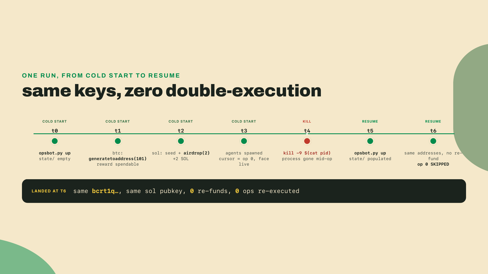
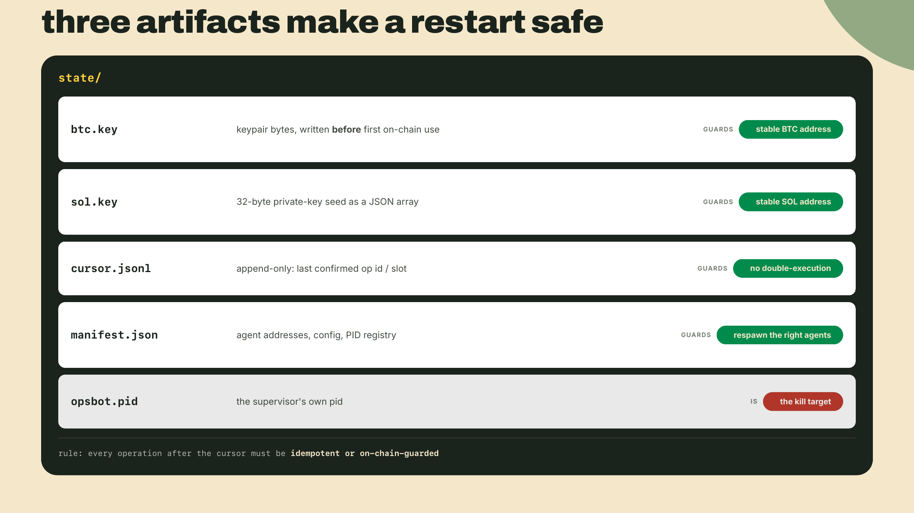
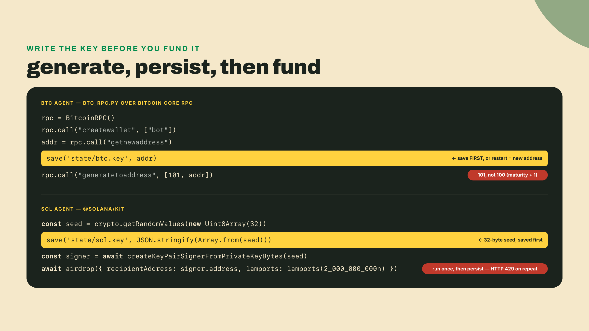
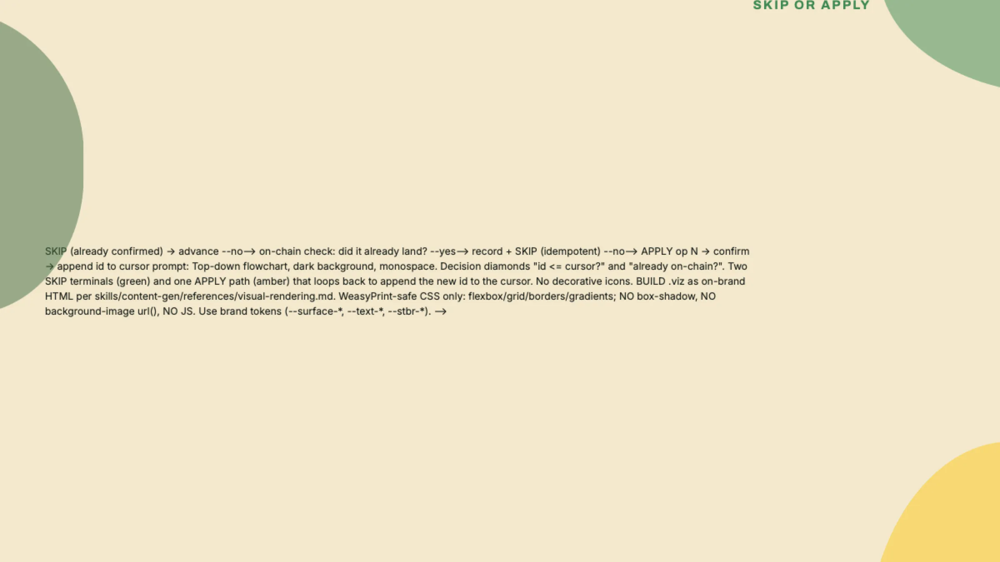
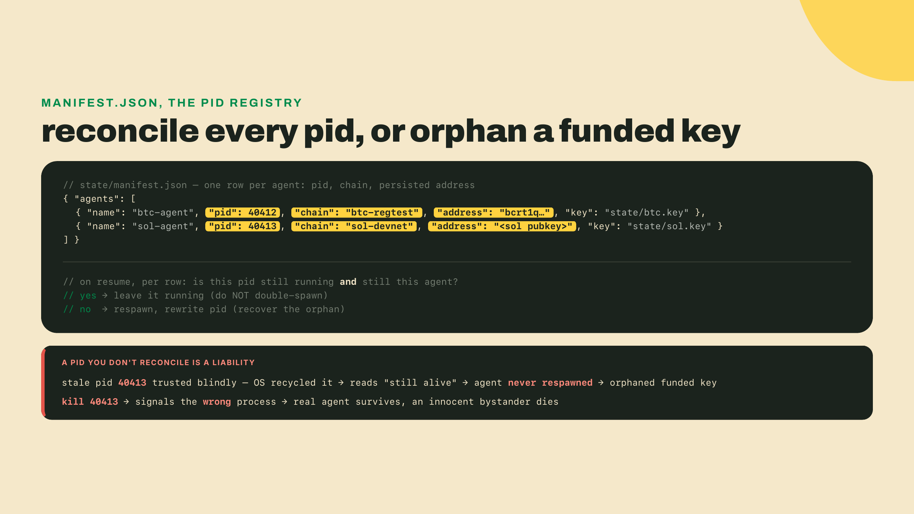
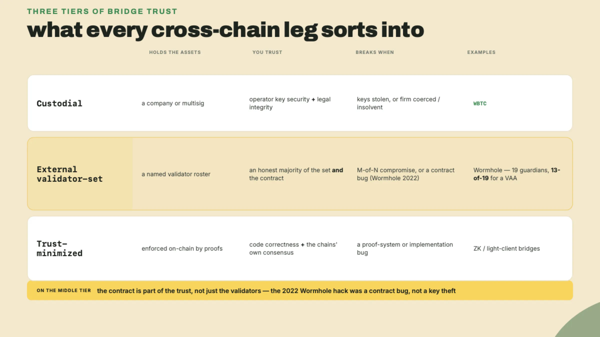
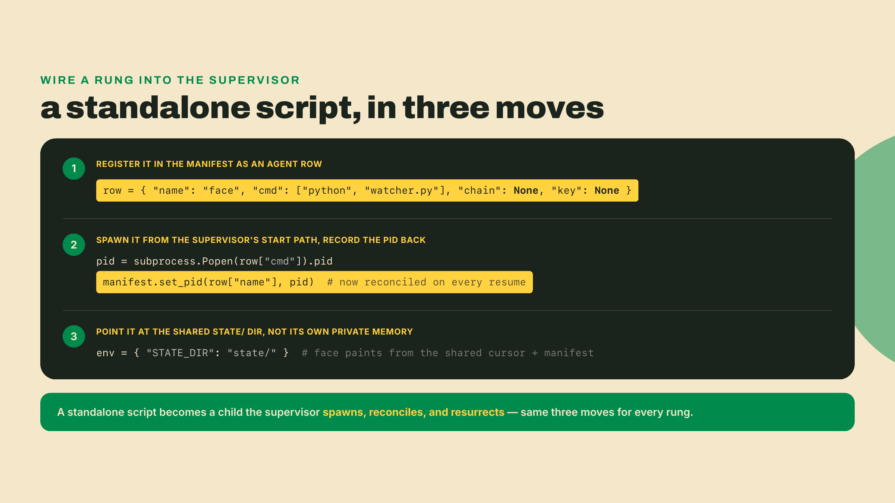
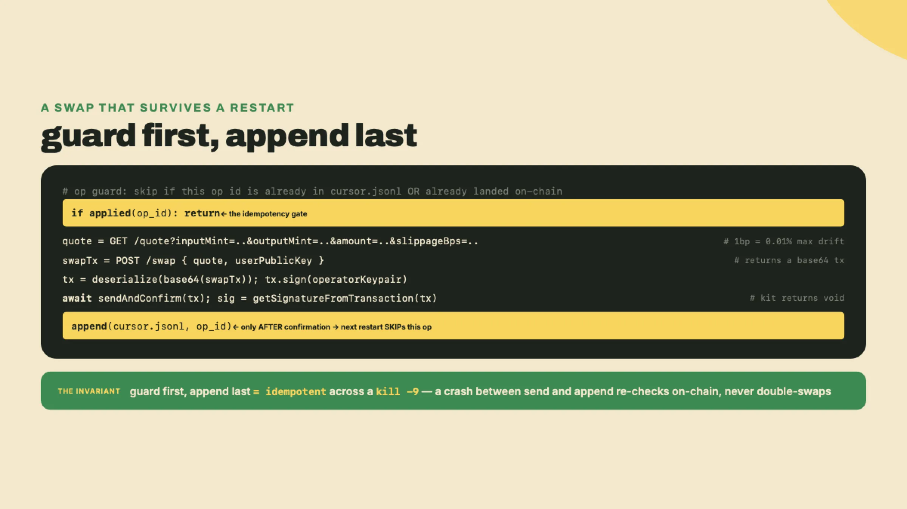

# Pull the plug: the cross-chain operator that wakes up where it left off

Last lesson you wired a bot to a face: a headless script and a browser button, both driving the same vault. They worked, right up until you closed the laptop and both forgot everything. The toolkit is complete now: every rung you built is sitting in the repo, waiting. Today you wire those rungs into one operator that doesn't forget.

Here is the scenario that decides whether any of it was real. Your bot funds a wallet, submits a swap, and is halfway through a second operation when the process dies at 3am. You restart it. Does it pick up where it left off, or does it re-fund the wallet and re-send that swap, paying twice? Right now you have no idea, because nothing it did was written to disk.

So don't reason about it. Build it and run it. The supervisor is three files at the root of your toolkit, and they wire together pieces you already shipped: `btc_rpc.py` from module 2, and the `@solana/kit` client work from the Solana module.

Two things have to be up before you start, both of them things you already ran: your regtest node (`bitcoind -regtest -daemon -fallbackfee=0.0002`), and a Node toolchain in the toolkit root.

```bash
cd toolkit
npm init -y && npm pkg set type=module
npm install @solana/kit && npm install -D tsx
```

Save this as `btc_agent.py`. It is the Bitcoin half: it opens a wallet, takes an address, writes that address to disk *before* any coins exist, and only then mines to it.

```python
#!/usr/bin/env python3
"""btc_agent.py - the Bitcoin half of the operator. One job per run, one JSON line out."""
import json
import os
import sys
from pathlib import Path

from btc_rpc import BitcoinRPC, DEFAULT_URL, DEFAULT_COOKIE

WALLET = "bot"
KEY = Path("state/btc.key")


def rpc_for_wallet() -> BitcoinRPC:
    base = os.environ.get("BTC_RPC_URL", DEFAULT_URL).rstrip("/")
    cookie = Path(os.environ.get("BTC_COOKIE", str(DEFAULT_COOKIE)))
    return BitcoinRPC(url=f"{base}/wallet/{WALLET}", cookie=cookie)


def main(job: str) -> None:
    Path("state").mkdir(exist_ok=True)
    base_rpc = BitcoinRPC(
        url=os.environ.get("BTC_RPC_URL", DEFAULT_URL),
        cookie=Path(os.environ.get("BTC_COOKIE", str(DEFAULT_COOKIE))),
    )
    if WALLET not in base_rpc.call("listwallets"):
        try:
            base_rpc.call("loadwallet", [WALLET])       # already on disk from a past run
        except RuntimeError:
            # name, disable_private_keys, blank, passphrase, avoid_reuse,
            # descriptors, load_on_startup
            base_rpc.call("createwallet",
                          [WALLET, False, False, "", False, True, True])

    rpc = rpc_for_wallet()
    restored = KEY.exists()
    if restored:
        addr = KEY.read_text().strip()
    else:
        addr = rpc.call("getnewaddress")
        KEY.write_text(addr)                            # persist BEFORE funding
    if job == "fund" and not restored:
        rpc.call("generatetoaddress", [101, addr])      # 100-block maturity + 1 to spend

    print(json.dumps({
        "agent": "btc-agent", "job": job, "restored": restored,
        "address": addr, "balance": rpc.call("getbalance"),
    }))


if __name__ == "__main__":
    main(sys.argv[1] if len(sys.argv) > 1 else "report")
```

Notice the `/wallet/bot` in `rpc_for_wallet`. That path segment is the HTTP form of the `-rpcwallet` flag you met in the Bitcoin module: with more than one wallet loaded, a bare RPC call cannot know which balance you mean and answers `error code: -19`. The agent names its wallet in the URL and never has to care what else is open.

Save this as `sol_agent.ts`. Same law, different chain: 32 random bytes to disk first, airdrop second.

```typescript
// sol_agent.ts - the Solana half of the operator. One job per run, one JSON line out.
import { existsSync, mkdirSync, readFileSync, writeFileSync } from "node:fs";
import {
  airdropFactory, createSolanaRpc, createSolanaRpcSubscriptions,
  createKeyPairSignerFromPrivateKeyBytes, lamports,
} from "@solana/kit";

const rpc = createSolanaRpc(process.env.SOLANA_RPC ?? "https://api.devnet.solana.com");
const rpcSubscriptions = createSolanaRpcSubscriptions(
  process.env.SOLANA_WS ?? "wss://api.devnet.solana.com");

mkdirSync("state", { recursive: true });
const KEY = "state/sol.key";

// generate, persist, THEN fund - in that order, every time
let restored = true;
if (!existsSync(KEY)) {
  const seed = crypto.getRandomValues(new Uint8Array(32));
  writeFileSync(KEY, JSON.stringify(Array.from(seed)));
  restored = false;
}
const seed = new Uint8Array(JSON.parse(readFileSync(KEY, "utf8")));
const signer = await createKeyPairSignerFromPrivateKeyBytes(seed);

const job = process.argv[2] ?? "report";
if (job === "fund") {
  const airdrop = airdropFactory({ rpc, rpcSubscriptions });
  await airdrop({
    commitment: "confirmed",
    recipientAddress: signer.address,
    lamports: lamports(2_000_000_000n),
  });
}
const { value: balance } = await rpc.getBalance(signer.address).send();
console.log(JSON.stringify({
  agent: "sol-agent", job, restored, address: signer.address, lamports: Number(balance),
}));
```

And save this as `opsbot.py`. This one is the lesson: it owns `state/`, decides skip-or-apply, and reconciles its roster on every boot.

```python
#!/usr/bin/env python3
"""opsbot.py - the supervisor. Owns state/, spawns one agent per chain, and
resumes instead of replaying after a kill -9."""
import json
import os
import signal
import subprocess
import sys
import time
from pathlib import Path

STATE = Path("state")
CURSOR = STATE / "cursor.jsonl"
MANIFEST = STATE / "manifest.json"
PIDFILE = STATE / "opsbot.pid"

# the operation queue: id -> (label, the job every agent runs for it)
OPS = [(0, "provision both chains", "fund"), (1, "report balances", "report")]

AGENTS = [
    {"name": "btc-agent", "cmd": [sys.executable, "btc_agent.py"], "chain": "bitcoin",
     "key": "state/btc.key"},
    {"name": "sol-agent", "cmd": ["npx", "tsx", "sol_agent.ts"], "chain": "solana",
     "key": "state/sol.key"},
]


def log(tag, msg):
    print(f"[{tag}] {msg}", flush=True)


def confirmed_ops():
    if not CURSOR.exists():
        return set()
    return {json.loads(line)["op"] for line in CURSOR.read_text().splitlines() if line.strip()}


def confirm(op_id):
    with CURSOR.open("a") as fh:                     # append-only; never rewritten
        fh.write(json.dumps({"op": op_id, "at": time.time()}) + "\n")


def load_manifest():
    return json.loads(MANIFEST.read_text()) if MANIFEST.exists() else None


def alive(pid):
    try:
        os.kill(pid, 0)
        return True
    except OSError:
        return False


def run_agent(agent, job):
    """Run one agent for one job and parse its single JSON status line."""
    proc = subprocess.run(agent["cmd"] + [job], capture_output=True, text=True)
    if proc.returncode != 0:
        raise RuntimeError(f"{agent['name']} failed: {proc.stderr.strip()[-400:]}")
    return json.loads(proc.stdout.strip().splitlines()[-1])


def up():
    STATE.mkdir(exist_ok=True)
    PIDFILE.write_text(str(os.getpid()))
    manifest = load_manifest()
    cold = manifest is None
    log("opsbot", "state/ empty -> COLD START" if cold else "state/ populated -> RESUMED")

    if not cold:
        for row in manifest["agents"]:
            was = row.get("pid")
            state = "still up" if was and alive(was) else "gone -> respawn"
            log("opsbot", f"reconcile {row['name']} pid {was}: {state}")

    done = confirmed_ops()
    skipped = 0
    for op_id, label, job in OPS:                     # skip-or-apply, one op per run
        if op_id in done:
            log("opsbot", f"op {op_id} ({label}) already confirmed -> SKIP")
            skipped += 1
            continue
        rows = []
        for agent in AGENTS:
            status = run_agent(agent, job)
            tag = "btc" if status["agent"] == "btc-agent" else "sol"
            verb = "restored" if status["restored"] else "created"
            held = (f"balance {status['balance']}" if "balance" in status
                    else f"{status['lamports']} lamports")
            log(tag, f"{verb} {status['address']} ({held})")
            rows.append({"name": agent["name"], "chain": agent["chain"],
                         "key": agent["key"], "address": status["address"],
                         "pid": None, "cmd": agent["cmd"]})
        confirm(op_id)
        log("opsbot", f"op {op_id} ({label}) confirmed")
        break
    else:
        rows = manifest["agents"]                      # nothing left to do; keep the roster
        log("opsbot", "no unconfirmed operations left")

    children = []
    for row in rows:
        child = subprocess.Popen(row["cmd"] + ["report"],
                                 stdout=subprocess.DEVNULL, stderr=subprocess.DEVNULL)
        row["pid"] = child.pid
        children.append(child)
    MANIFEST.write_text(json.dumps({"agents": rows}, indent=2))
    log("opsbot", "spawned " + ", ".join(f"{r['name']} (pid {r['pid']})" for r in rows))
    log("opsbot", f"cursor = op {max(confirmed_ops())} | pid -> {PIDFILE} | "
                  f"re-executed 0 confirmed operations ({skipped} skipped) | face live")

    for child in children:
        child.wait()
    log("opsbot", "agents idle; supervisor holding the terminal (Ctrl-C or kill the pid file)")
    try:
        signal.pause()
    except KeyboardInterrupt:
        log("opsbot", "shutting down")


if __name__ == "__main__":
    if (sys.argv[1:] or ["up"])[0] != "up":
        sys.exit("usage: python opsbot.py up")
    up()
```

Now run the cold start. `up` holds the terminal by design — there is no daemon mode here — so background it, which also gives you the shell back for the kill you are about to do.

```bash
python3 opsbot.py up &
```

```
[opsbot] state/ empty -> COLD START
[btc] created bcrt1qfygvmcf0wd3cljn9v0njynhn5rkxjw9j4mgg9j (balance 0.3113349)
[sol] created 7NGbqdNswCYznndzxyamNzcPL1S3kdLEryBdVkFBfNRs (2000000000 lamports)
[opsbot] op 0 (provision both chains) confirmed
[opsbot] spawned btc-agent (pid 41779), sol-agent (pid 41780)
[opsbot] cursor = op 0 | pid -> state/opsbot.pid | re-executed 0 confirmed operations (0 skipped) | face live
[opsbot] agents idle; supervisor holding the terminal (Ctrl-C or kill the pid file)
```

Two wallets, two chains, one process. (Your Bitcoin balance will differ from mine and will usually not be 50: on a long-lived regtest chain the block subsidy has halved every 150 blocks, so a fresh 101-block mine on an old chain pays out far less than a fresh one does. The number does not matter here; the fact that it is the *same* number after a restart does.)

Now the cruel thing the scenario promised, as a sequence you can paste in one shot:

```bash
kill -9 $(cat state/opsbot.pid)       # pull the plug mid-run
python3 opsbot.py up                  # bring it straight back
```

```
[opsbot] state/ populated -> RESUMED
[opsbot] reconcile btc-agent pid 41779: gone -> respawn
[opsbot] reconcile sol-agent pid 41780: gone -> respawn
[opsbot] op 0 (provision both chains) already confirmed -> SKIP
[btc] restored bcrt1qfygvmcf0wd3cljn9v0njynhn5rkxjw9j4mgg9j (balance 0.3113349)
[sol] restored 7NGbqdNswCYznndzxyamNzcPL1S3kdLEryBdVkFBfNRs (2000000000 lamports)
[opsbot] op 1 (report balances) confirmed
[opsbot] spawned btc-agent (pid 42279), sol-agent (pid 42280)
[opsbot] cursor = op 1 | pid -> state/opsbot.pid | re-executed 0 confirmed operations (1 skipped) | face live
```

Read the last four lines twice. Same Bitcoin address. Same Solana public key. No second airdrop, no duplicate anything, and the operation it had already confirmed got skipped instead of replayed. You just watched a process come back from a `kill -9` knowing exactly what it had and hadn't done. Nothing about that is automatic. You paid for every line of it, and the rest of this lesson is the bill, itemized.



## Name the machine

Now that you've watched it recover, it earns a name. What you ran is a **supervisor**: a parent process whose entire job is to create its child agents, watch them, restart them when they die, and own the shared state they all depend on. It runs one agent per chain and does nothing else itself. The agents do the chain work. The supervisor keeps them alive and keeps the memory.

That discipline is not a crypto invention, and pretending it were would throw away decades of prior art. "Assume the process dies, then make the restart safe" is the founding idea behind Erlang's OTP supervision trees at Ericsson, and behind the Unix process supervisors (init, supervisord) that have quietly held up server uptime for a generation. Telephone switches and web servers solved persist-and-resume long before a bot needed to survive a swap. Your opsbot is that same shape, aimed at two blockchains at once.

One detail the demo glossed over: those two agents are not written in the same language. The supervisor and the Bitcoin agent are Python, but the Solana agent is TypeScript, because TypeScript is what the Solana SDK, `@solana/kit`, speaks. You do not need to know TypeScript to follow this, so here is the 30-second version of how the two talk. The Python supervisor treats the Solana agent as a black box it launches as a child process, literally `subprocess.Popen(["npx", "tsx", "sol_agent.ts", "fund"])`, which is the `cmd` field of its row in `AGENTS`. The TypeScript agent does its chain work, writes its results into the shared `state/` directory, and prints one JSON status line to stdout, which the Python parent reads to update the face and the cursor. No shared memory, no foreign-function bindings, no rewriting one language into the other: two processes, one directory, and stdout as the wire between them. That is the whole polyglot bridge, and it is why a Python supervisor can own a TypeScript agent without either side knowing the other's syntax.

A safe restart comes down to exactly three artifacts on disk. Miss one and the clean recovery you just saw decays into the double-spend the scenario threatened.

**One: keypair byte files, written before first on-chain use.** The address you fund has to survive the reboot, which means the secret that derives it has to exist on disk before a single satoshi or lamport ever moves. Generate, persist, then fund, in that order, every time.

**Two: a cursor.** A **cursor** is the last confirmed slot, sequence number, or operation ID the bot got through. On resume it reads the cursor and skips every operation at or below it, so confirmed work is never replayed.

**Three: the agent manifest.** Addresses, per-agent config, and a PID registry, so on restart the supervisor knows which agents to respawn and where each one left its money.

One rule binds all three: every operation submitted after the cursor must be idempotent or guarded by an on-chain check. **Idempotent** means safe to run more than once, because the second run changes nothing. That rule is the load-bearing beam of the whole machine. Everything else is scaffolding bolted around it.



## Write the key before you spend a cent

The first artifact sounds trivial and hides the most expensive footgun in the build. Persist the keypair before the first on-chain use, or the address changes on restart and you orphan the funds you already sent to the old one.

Watch the ordering on Bitcoin first. Your BTC agent talks to a local regtest node over Bitcoin Core's RPC. It opens the `bot` wallet, takes an address with `addr = rpc.call("getnewaddress")`, and only then mines to it with `rpc.call("generatetoaddress", [101, addr])`. The address is written to `state/btc.key` in between: after `getnewaddress`, before any coins arrive. The 101 is not a sloppy round number. A freshly mined reward is frozen by **coinbase maturity**: a coinbase output (the block reward) cannot be spent for 100 blocks after the block that created it. Mine 100 and the reward is still locked, so `generatetoaddress` with 100 leaves you with an unspendable balance and a baffling bug; you need the 101st block on top before the first reward can move. The rule is not padding. It exists so that a chain reorganization can't hand you coins that later vanish when a competing branch wins, and 100 blocks is Bitcoin's bet on how deep a reorg can plausibly reach.

```python
# btc_agent.py, the ordering that matters, lifted out of the file you saved
addr = rpc.call("getnewaddress")
KEY.write_text(addr)                            # persist BEFORE the reward exists
rpc.call("generatetoaddress", [101, addr])      # 100-block maturity + 1 to spend
```

One trap sits underneath that Bitcoin code, and reusing your own work is how you sidestep it. Your BTC agent does not reach for a fresh library at all: it imports the thin `btc_rpc.py` wrapper you hand-built back in module 2, the one that already speaks exactly the JSON-RPC calls (`createwallet`, `getnewaddress`, `generatetoaddress`) your regtest node understands. Reuse over migrate here for one blunt reason: the external-library namespace is a minefield, `python-bitcoinlib` (petertodd) and `1200wd/bitcoinlib` (v0.7.8) share no code and expose different APIs, so swapping in either one now would trade a wrapper you already understand for an import you would have to relearn and pin. Your own `btc_rpc.py` works today and carries none of that ambiguity, so keep it.

The Solana side keeps a different secret under the same ordering law. The Solana agent uses `@solana/kit`, and it generates a fresh key as 32 random bytes, `crypto.getRandomValues(new Uint8Array(32))`, the private-key seed. It persists that seed as a JSON array straight to `state/sol.key`, then turns it into a signer with `createKeyPairSignerFromPrivateKeyBytes(seed)`. On restart it reads the same 32 bytes and calls the same function, and because an ed25519 keypair is fully determined by its seed, it gets the identical address back every time. Funding is where the second footgun waits. The agent funds once with kit's `airdropFactory`, `await airdrop({ recipientAddress: signer.address, lamports: lamports(2_000_000_000n) })`, and records it against the cursor, never on every boot. Devnet's public faucet caps a single airdrop at 2 SOL per call and rate-limits hard: hammer it and you get HTTP 429 back instead of lamports.

I learned that one by shipping the wrong order. An early version of this bot called the airdrop inside the agent's startup path with no cursor check. It worked twice. On the third restart devnet returned 429, the funding step that should never have re-run threw, and the agent crash-looped over money it already had. The fix was not a retry loop. It was moving the airdrop behind the cursor so the second boot skips it entirely. Provision once, persist, resume.



## The cursor is the only thing between you and a double-send

The keypair files make your addresses stable. They do nothing to stop a replay. That job belongs to the cursor, and it is where the load-bearing rule earns its keep.

Picture the run again. The bot confirmed op 0 (funding), then died mid-op 1 (a swap). On resume it has to answer two questions about the work in flight: has this already happened, and if it has, do not do it again. The guard against a replay? The cursor, read before the bot acts.

Concretely, the cursor is a small store you own, and the brief hands you two honest shapes for it: an append-only JSONL file (one confirmed operation id per line, never rewritten) or a SQLite table. Append-only JSONL is the simpler of the two and the harder to corrupt by accident, because you only ever add a line, never edit one. SQLite buys you queries and transactions at the cost of a lock that can dangle if the process dies at the wrong instant. Either way, on resume the supervisor reads the highest confirmed id and makes a skip-or-apply decision about the next queued operation.

That decision is the completion TODO in the code you are about to finish, and it is not a single `if`. A cursor alone trusts its own bookkeeping, and bookkeeping drifts. The stronger version pairs the stored op-id with an on-chain check: before applying op N, ask the chain whether it already landed. If the swap's output already sits in the wallet, or the funding transaction already confirmed, record it and skip, even when the cursor never got the memo because the process died between "send" and "write." Idempotent-or-guarded is belt and suspenders, and a cross-chain bot needs both belts fastened.



## The manifest: so the supervisor respawns the right thing

The third artifact is the least glamorous and still not optional. The **agent manifest** is the supervisor's roster: each agent's addresses, its per-agent config, and a PID registry. The addresses and config are the easy half. Config is the handful of facts an agent needs to come back as itself and not some default stranger: which key file it reads, which RPC endpoint it talks to, which chain it is responsible for, and what its restart policy is. The registry is the half people skip, and it is the half that makes a restart deterministic instead of hopeful.

Concretely the registry maps three things in one row per agent: the child process id, the chain that child owns, and the persisted address that child funds. `btc-agent -> pid 40412 -> bcrt1q…`. `sol-agent -> pid 40413 -> <sol pubkey>`. Read across a row and you know which live process is responsible for which key on which chain. Read the whole file and you have the exact roster the supervisor rebuilds itself from. Without that mapping a restart is amnesia with extra steps: the supervisor could restore both key files and a perfect cursor and still not know it was supposed to run a Bitcoin agent and a Solana agent, or which restored address belongs to which of them. It would spawn something, then guess.

Now make the failure concrete, because a PID that looks fine is exactly the one that hurts. Suppose the manifest records `sol-agent -> pid 40413`, the process at 40413 has already exited, and the operating system has recycled that number for an unrelated program. The supervisor, trusting a stale PID, reads 40413, sees a live process, and concludes the Solana agent is still up, so it never respawns it. You now hold a funded Solana key with no agent minding it: an orphaned agent in everything but name, and the money it guards drifts with nobody watching. Flip the same stale PID toward teardown and it turns dangerous. A shutdown that runs `kill` against 40413 signals whatever process inherited that number, so it ends an innocent bystander while the real Solana agent keeps running and keeps spending. A bare PID with no chain and no address recorded next to it is just an integer, and an integer the OS is free to reassign the instant its owner exits is a liability the moment you trust it across a reboot.

That reconciliation is why the manifest, not the cursor and not the key files, is the artifact that disambiguates cold start from resume. `up` on an empty `state/` finds no manifest and can only mean cold start. `up` on a populated one reads the manifest, checks each recorded PID against what is actually running under that agent's identity, respawns only the agents that are genuinely gone, and rewrites the registry with the new PIDs. That check is the difference between resuming a roster and blindly re-spawning it. It is also the file that turns `kill -9 $(cat state/opsbot.pid)` from a guess about which process to end into a teardown you can test: the supervisor's own PID lives in `opsbot.pid`, every child's lives in the manifest, and killing the parent is defined to take its reconciled roster down with it. That is what let the run at the top of this lesson end the bot by its PID file and trust that exactly the right processes came down with it.



## Name the cost

Every design in this course gets its price read out loud, and cold-restart safety has a real one.

First: it is not a library you import. You pay for it in code you write and maintain. Every operation has to be made idempotent or on-chain-guarded by hand, which means a `state/` directory you now have to back up and a cursor store that can itself corrupt or drift from chain truth. A JSONL file half-written during a crash, a SQLite lock left dangling, a confirmed transaction the cursor never recorded: each is a new failure mode you took on in exchange for surviving a `kill -9`. The safety is real and the maintenance is real, and the second does not evaporate because the first is nice.

Second, and this one no amount of clean supervisor code can refactor away: the moment value crosses from Bitcoin to Solana, you have added a trust assumption that survives every reboot. Persistence makes your bot honest about what it did. It does nothing to make a bridge trustless. Restarting the operator a thousand times cleanly does not shrink the bridge's trust surface by a single validator. So the honest move is not to eliminate that assumption. It is to name it, out loud, for every leg. Which is the last thing this lesson does.

## Every leg, tagged

There is a tempting way to think about bridges that you should reject on sight: "a bridge is just a lockbox, lock it here, mint it there." That collapse buries the only question that matters, which is who you are trusting while the value is in transit. Sort every cross-chain path into one of three tiers and the trust becomes impossible to wave away.

**Custodial.** A company or a multisig holds the locked assets. You trust the operator's key security and legal integrity: that the keys are not stolen and the entity is not coerced or insolvent. WBTC is the wrapped BTC representation of exactly this kind. renBTC used to be the other name on that list, and it is worth knowing why it is not: Ren shut down in December 2022 when the exchange funding it collapsed, and the bridge went with it. Wrapped assets inherit their operator's mortality, which is the custodial tier's failure mode stated as a fact rather than a risk.

**External-validator-set.** A fixed roster of named validators attests to transfers. Wormhole is the canonical example: 19 named guardians (a **guardian set**), with a 13-of-19 proof-of-authority quorum required to produce a **VAA**, the guardian-signed message that authorizes the mint on the destination chain. You trust an honest majority of that named set, and any M-of-N compromise of it breaks the bridge.

**Trust-minimized.** ZK or light-client proofs enforce the transfer on-chain. You trust only code correctness and the underlying chains' own consensus, with no separate roster to compromise.

Here is why "trust an honest majority of validators" is not the whole sentence. In 2022 the Wormhole bridge was drained through a signature-verification flaw in its Solana contract. The 19 guardians were honest the entire time. The code let an attacker forge a message they never signed. External-validator-set trust means trusting the contract too, not only the validators: the tier reads "honest majority AND correct code," and the second clause is where the money actually left.



Now walk the legs of your own design and place each in the frame. Measure each one against a baseline that adds no trust at all, and the legs that genuinely add trust stop hiding.

Your Bitcoin funding leg mines on your own regtest node. There is no counterparty and no bridge: it is free money on a network you fully control, trust-minimized in the only sense that matters here. Your Solana funding leg pulls test SOL from the devnet faucet through kit's `airdrop`. That is a custodial faucet, but the value is zero, so the trust is academic. The Jupiter swap is the leg people miscount: it moves value, but it never leaves Solana. It is a same-chain operation where you trust the aggregator's routing and the pools it touches, all of it settled by Solana's own consensus. No bridge trust there either.

Which leaves exactly one leg that adds a trust assumption surviving every reboot: an actual BTC-to-Solana bridge. This is the stretch leg, and you will document it, never wire it. Start from a fact that eliminates the obvious pick: Wormhole, as of 2025, does not natively bridge native BTC. Its guardian set secures message passing across EVM, Solana, and 30-plus chains, but Bitcoin is not a supported chain in its core protocol. So a documented BTC leg to Solana uses one of two other paths. tBTC, from the Threshold Network, holds BTC under a threshold ECDSA multisig and is audited: a signer set plus audited code, which lands it in the external-validator-set tier. Or a wrapped representation like WBTC, which is custodial. Native BTC does not reach Solana without choosing one of those, and each choice is a trust assumption you carry forever after.


## Build: wire one rung in, then prove the resume

You have watched the supervisor recover, but so far you have taken the wiring on faith. The core of this build is to make "the toolkit becomes the bot" something you did with your own hands, not something I asserted: pick ONE rung you already built and wire it into the supervisor as a supervised agent.

Here is the pattern, worked once so you can copy its shape. Take `watcher.py`, the Bitcoin mempool watcher from module 2 — the toolkit's eyes, not last lesson's browser button. Wiring it in is three moves. First, register it in the manifest as an agent row, so the supervisor knows to spawn it and reconcile its PID, roughly `{ "name": "face", "cmd": ["python", "watcher.py"], "chain": null, "key": null }`. Second, spawn it from the supervisor's start path the same way every other agent is launched, `subprocess.Popen(row["cmd"])`, and record the returned PID back into that manifest row so the reconcile check can find it on resume. Third, give it its input: point the watcher at the same `state/` directory the other agents write to, so its baseline and its sightings live beside the shared cursor and manifest instead of in its own private memory. That is the whole wiring. The rung stops being a standalone script and becomes a child the supervisor creates, watches, and brings back after a `kill -9`.



Now do it once yourself with a different rung, and you have three to choose from. The Anchor vault-and-bot from the Solana module is the obvious one: a manifest row, a supervised spawn that records its PID, and a pointer at the shared `state/`. The `toolkit/amm/` harness from the EVM module is the second, and it is the one that makes the toolkit genuinely three-chain — spawn `anvil` as a supervised child, run `node swap.js` as its operation, and record the deployed pool addresses in the manifest so a resume reads them back instead of redeploying. The `Counter.sol` deploy-and-poke harness from the lesson before it is the third and smallest. Pick one, wire it with the same three moves, and when it respawns cleanly on resume alongside the agents that were already there, you have shown the claim instead of trusting it.

The one guard every wired rung has to honor is the resume decision. After the supervisor reloads the cursor, it decides skip-or-apply for the next queued operation, guarded by a stored op-id or an on-chain check. Wire that decision to be both: consult the cursor first, and when the cursor is silent or you do not trust it, ask the chain. That single function is what turns "restarts cleanly" from a claim into a property you can prove, and it is the check any operation your newly-wired rung submits must pass.

Beyond this course, two optional stretch legs are waiting if you want them. Neither is required to pass and neither is a core deliverable: they exist for the reader who wants to push past the finish line.

**(a) Optional, beyond this course: add a Jupiter swap as a new idempotent agent operation.** Two facts first, because getting either wrong wastes an evening. The old `quote-api.jup.ag/v6` host no longer resolves at all; the current base is `https://api.jup.ag/swap/v1`. And Jupiter has never routed on devnet — its liquidity is mainnet liquidity — so this leg belongs against a **mainnet fork**, exactly the way the next lesson's outro tells you to rehearse anything that touches real pools, and never against the devnet your other agents use.

The shape is four steps. Fetch a quote from `/swap/v1/quote` with `inputMint`, `outputMint`, `amount`, and `slippageBps` (**slippageBps** is the maximum price movement you will tolerate, in basis points, where 1 bp is 0.01%). POST that quote plus your `userPublicKey` to `/swap/v1/swap`. Decode the returned base64 transaction and sign it with the operator keypair. Then send it the way the rest of your Solana agent does — `sendAndConfirmTransactionFactory` from `@solana/kit`, not the `connection.sendRawTransaction` you will find in every older tutorial, which is a web3.js v1 idiom and has no `connection` object anywhere in this toolkit. The seam is worth naming because you will hit it constantly: a third-party guide hands you a serialized transaction, and it is your job to bring it into your own client instead of importing theirs. In kit that means decoding the base64 into bytes and handing those to the transaction decoder, rather than reaching for a second SDK.

The whole point of this track is the last requirement: make it survive a restart mid-swap, which means guarding it with the same idempotency check as every other operation. Send is not the same as confirmed, and a bot that appends to the cursor before confirmation will cheerfully skip a swap that never landed.



**(b) Optional, beyond this course: write a one-page BTC-to-Solana bridge-leg design doc.** Name the specific bridge (tBTC or a wrapped representation), state its audit status, and tag its trust tier. No live code. This is the security-writing muscle the whole module has been building toward, and the deliverable is a page a reviewer could argue with, not a diagram. Never route value through unaudited bridge code in a course, and never in production without reading the audits yourself.

Accept for the core build: wire one prior rung into the supervisor, then `kill -9` the bot during any operation and watch it resume with stable addresses and zero double-execution, every cross-chain leg in your design tagged with its trust tier. The two stretch legs are credit, not the bar.

## Checkpoint

Two gates, and the first is pure doing. Run the operator, `kill -9` it during a funded operation, and run `up` again (background the first run with `up &` so you can kill it and resume in one shell). It must come back with the same persisted Bitcoin regtest and Solana devnet public keys and re-execute zero already-confirmed operations: no re-fund, no duplicate swap. That is the verify sequence from the top of this lesson, and RESUMED with matching keys is the only passing output.

The second gate is out loud. Point at the running system and name the trust tier of every cross-chain leg: custodial, external-validator-set, or trust-minimized. A pass is a clean cold-restart resume plus every leg tagged. Clear both and the toolkit has stopped being a folder of scripts and become one machine, and the machine knows what it did.

You have killed your bot and watched it wake up knowing exactly what it did. But everything so far ran on regtest and devnet: free money, forgiving networks. The only question left is the one that costs money. What breaks the first time this operator touches real value, and which of the trust assumptions you just named is the one that bankrupts you?
