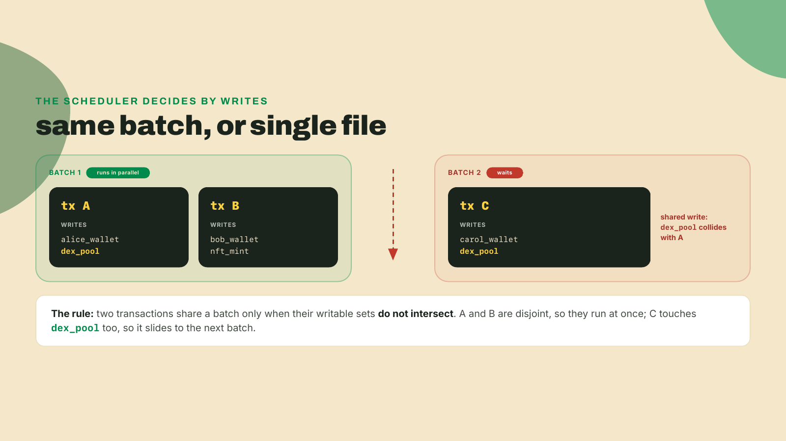
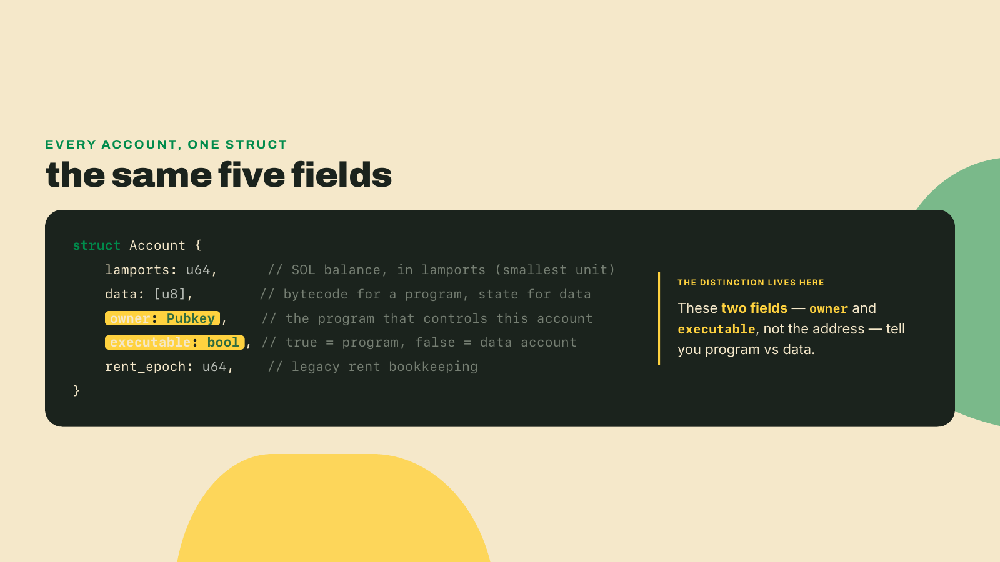
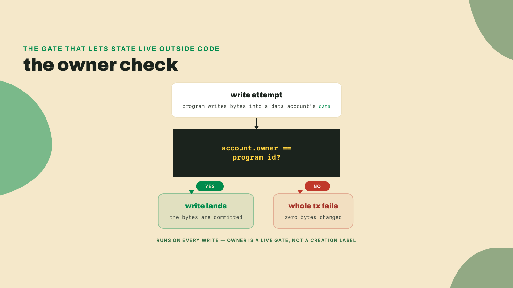
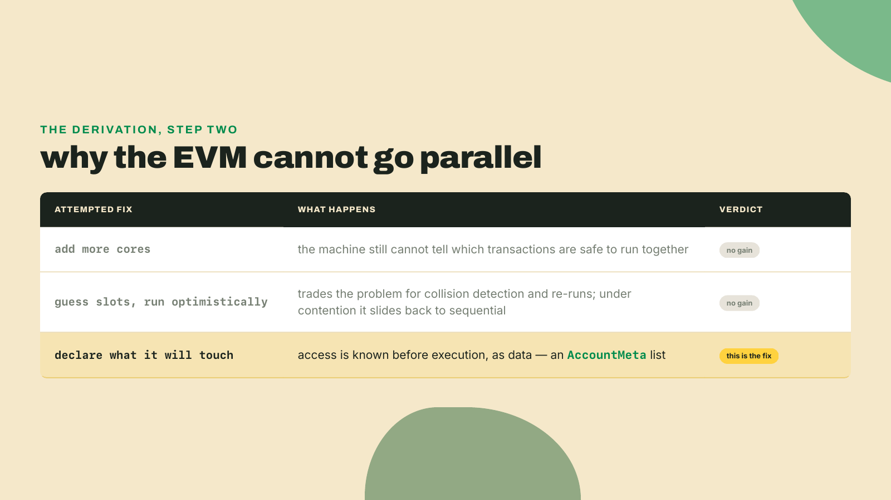
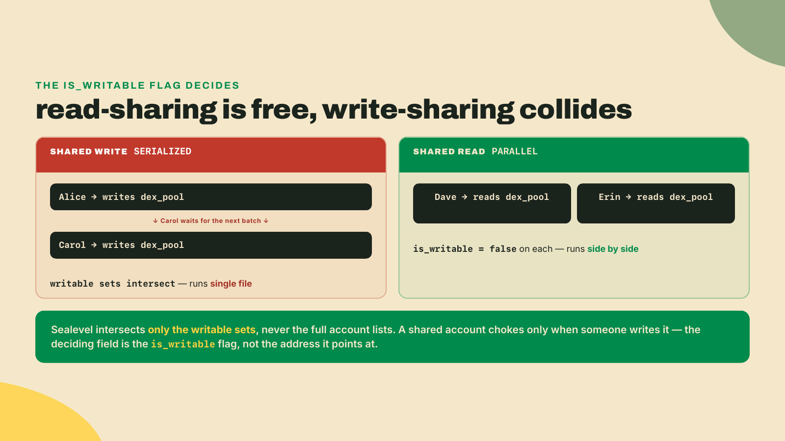
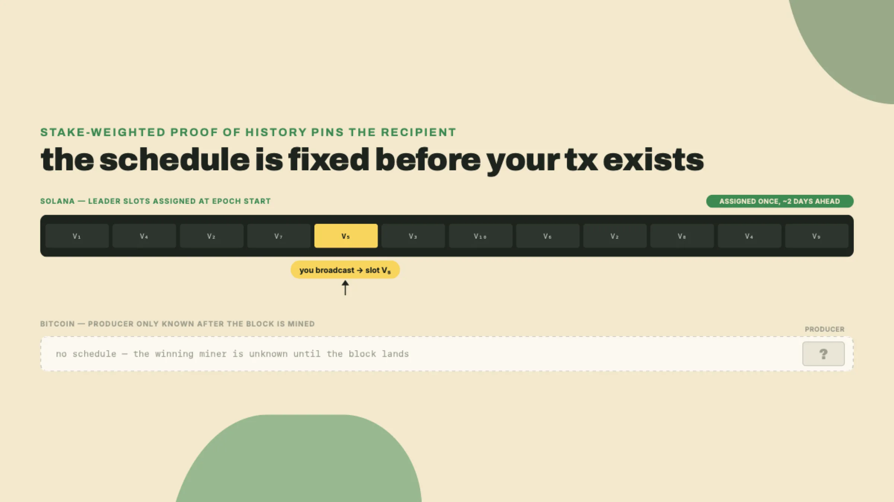
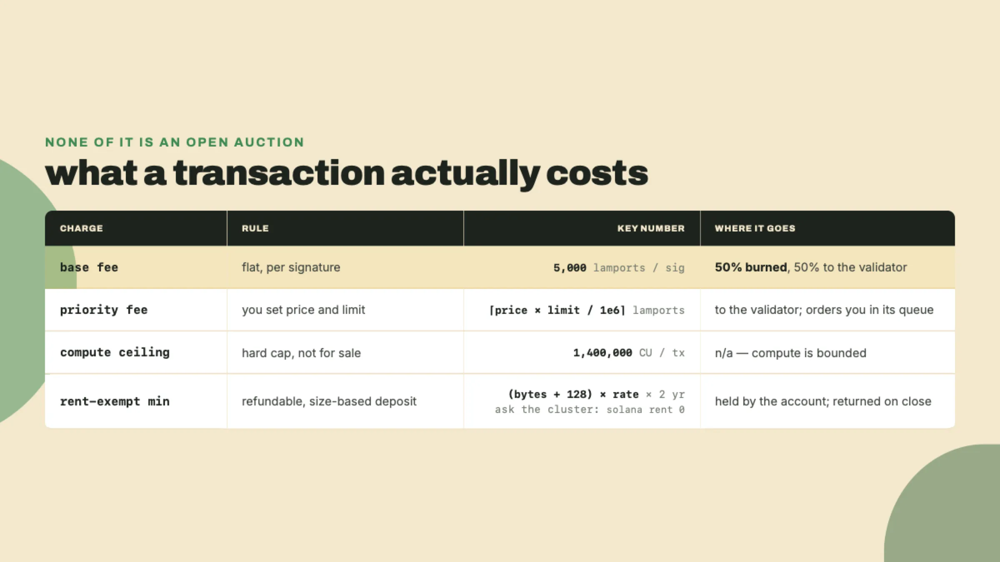
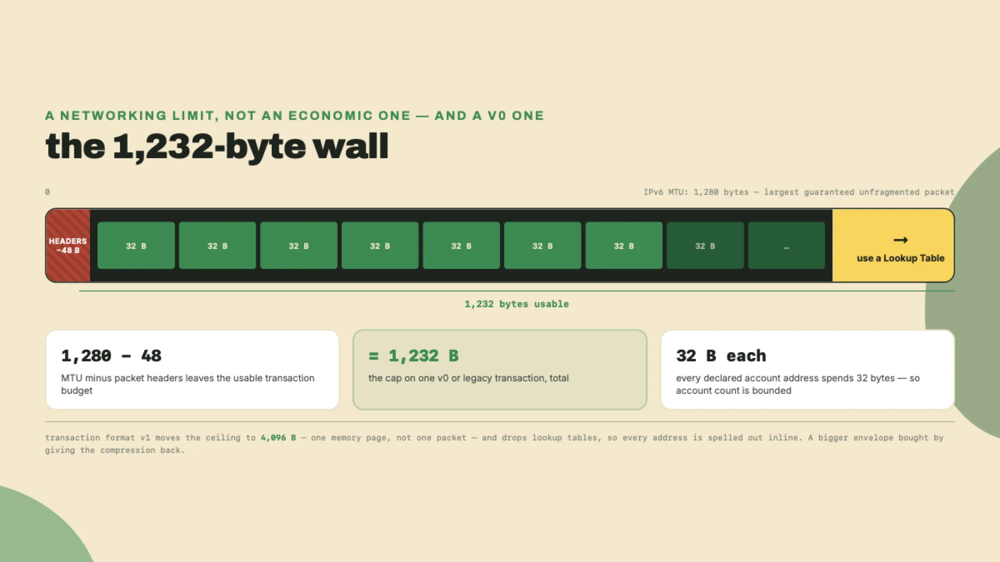
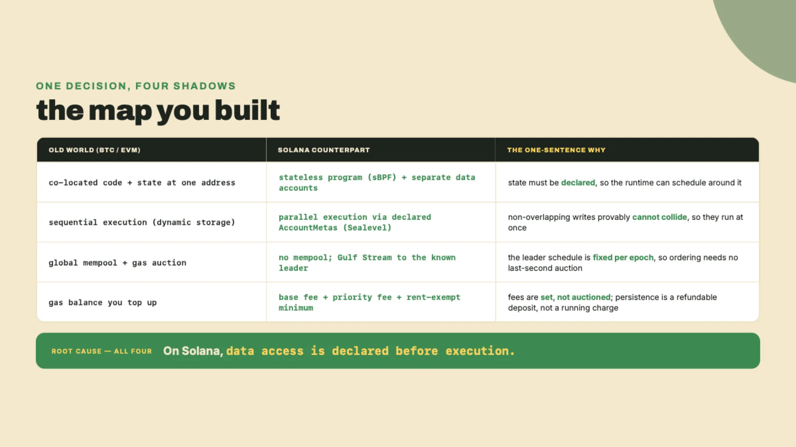

# The throughput bet: why Solana runs in parallel and what it costs

Last lesson you shipped your first program to devnet and proved it was stateless: bytecode that cannot even write to itself, so every scrap of mutable state has to live in separate accounts handed to it from outside. And you met the rule that rides along with that split: a transaction names every account it will touch up front, before a single instruction runs. Not fetched mid-run, not discovered on the fly, declared in advance, like a warehouse pick-list stapled to an order before anyone walks the aisles. It felt like paperwork, and you followed the ceremony without being told why.

Here is the payoff: that paperwork is the engine. It is the whole reason one Solana validator can execute thousands of transactions in the same instant, while Ethereum grinds through them one after another, single-file.

Do not take that on faith. Before I name one piece of the machine, run a crude version of it. Ten lines of Python that do, clumsily, what Solana's scheduler does for real:

```python
# scheduler.py - toy Sealevel: which transactions can share a batch
txs = {
    "A": {"alice_wallet", "dex_pool"},    # writes these accounts
    "B": {"bob_wallet", "nft_mint"},      # disjoint from A
    "C": {"carol_wallet", "dex_pool"},    # shares dex_pool with A
}

batches, pending = [], dict(txs)
while pending:
    used, batch = set(), []
    for name, writes in list(pending.items()):
        if used.isdisjoint(writes):       # no write collides with this batch
            batch.append(name); used |= writes; del pending[name]
    batches.append(batch)

for i, b in enumerate(batches, 1):
    print(f"batch {i} (parallel): {sorted(b)}")
```

Run it:

```bash
python3 scheduler.py
```

```
batch 1 (parallel): ['A', 'B']
batch 2 (parallel): ['C']
```

Read the output. `A` and `B` ran together. `C` waited. Nothing about `C` was slower or costlier; it simply wrote to `dex_pool`, the same account `A` had already claimed for that batch, so the scheduler could not prove the two would stay out of each other's way. It queued `C` behind. That single rule, applied to the account lists you declare, is the throughput bet in one sentence: work that provably does not overlap runs at the same time.

The scheduler has a name, Sealevel (Solana's parallel transaction-processing engine), and the account lists it reads have one too. Each entry is an AccountMeta: an address plus two flags, `is_writable` and `is_signer`. Sealevel never inspects your program's logic. It reads the AccountMetas, sorts transactions into non-colliding batches, and runs each batch across every core it has.



## One decision, four shadows

Here is the claim worth the rest of this lesson. Almost everything that feels foreign about Solana, coming from Ethereum or Bitcoin, falls out of one design decision made once and paid for everywhere: on Solana, data access is declared before execution. Not discovered during it. Declared.

That choice looks small. It is not. Four things you think you know about how a chain works invert because of it, and I want each to feel like a consequence you could have derived yourself, not a feature someone bolted on. State stops living with code. Execution stops being sequential. The mempool vanishes. And the fee stops being an auction. Take them in order, and keep asking the same question of each: how does this fall out of "access is declared"?

## Shift one: state moves out of the program

You proved shift one last lesson, so take it as known: programs are stateless, holding only sBPF bytecode (Solana's flavor of compiled eBPF, the format the on-chain virtual machine executes), and every scrap of mutable state lives in separate data accounts you pass in. No need to re-derive it. Here is the part that was still owed you, and the reason this shift matters to the other three: because those accounts are declared before the program runs, the runtime can read the entire list ahead of time and schedule non-overlapping transactions side by side. Declared access is the hinge, and shift two is where you turn it. First, though, one field has to make it safe for state to live outside the code at all.

Every account on Solana, program or data, wallet or mint, is the same five-field struct. Learn it once and you have learned all of them.



Two of those fields carry the whole distinction. `executable` is true for a program account and false for a data account. `owner` names the program allowed to change the account's `data`, which is how the runtime guarantees that only your program can mutate your program's state, without your program holding that state inside itself.

Watch that check fire, because it is the guarantee the whole model rests on. When a transaction hands a data account to your program and the program tries to write bytes into that account's `data`, the runtime first compares the account's `owner` field against the id of the program attempting the write. If they match, the write lands. If they do not, the entire transaction fails before a single byte changes, because a program is only ever allowed to mutate accounts it owns. That one comparison runs on every write, which is why an account's `owner` is not a label recording who created it; it is the live gate deciding who may change it. Strip that field out and any program could scribble over any other program's state at will. The `owner` check is what lets state live outside the program and still stay protected, and it is enforced by the runtime, not by anything you write.



In the EVM those guarantees are implicit in the co-located design; the address is the boundary. On Solana they are explicit fields the runtime checks on every access. Explicitness is the tax. Schedulability is what it buys, and the next shift is where you collect.

## Shift two: execution goes parallel

Now the payoff of the split, derived. Because the EVM lets a contract choose its storage slot mid-execution, the network cannot know what a transaction will touch until it runs it. And if you cannot know what two transactions touch before running them, you cannot prove they will not collide, so you must run them one at a time in a fixed order, or risk two of them writing the same slot and disagreeing about the result. Sequential execution is not a performance oversight in Ethereum. It is forced by dynamic state access. Every validator re-runs every transaction in the same order and lands on the same state; correctness is bought with single-file redundancy.

Try to fix that inside the EVM model and watch it fail in tiers. Adding more cores does nothing, because the machine still cannot tell which transactions are safe to run together. Guessing the accessed slots ahead and running optimistically only trades the problem for collision detection and re-runs; under contention you slide right back to sequential with extra bookkeeping. The clean fix is not more hardware or cleverer guessing. It is to make the transaction tell you what it will touch, in advance, as data. Which is exactly what an AccountMeta list is.



Given those lists, the scheduling rule is blunt. Two transactions that read the same account but write nothing to it run in parallel; two that write the same account are serialized, forced into single file. Read-only sharing is free. Write sharing is the collision.

Walk one concrete pass, the way Sealevel does. Alice sends a transfer that writes her wallet and the `dex_pool`. Bob sends one that writes his wallet and an `nft_mint`. Carol sends one that also writes the `dex_pool`. Sealevel reads three account lists, sees Alice and Bob share nothing writable, and drops them into one batch that runs across two cores at once. Carol's list intersects Alice's on `dex_pool`, so Carol is not slower or under-priced; she is simply behind Alice for that one account, and lands in the next batch. That is the entire scheduler: set intersection over declared writes. The chain gets its throughput not from faster execution but from doing safe work concurrently, and it can only prove work is safe because you declared the accounts.

Now flip the shared account from a write to a read, because that is the case where the rule earns its keep. Say two more traders, Dave and Erin, each submit a transaction that reads the same `dex_pool` to quote a price against it but writes only to its own separate wallet. Both account lists name `dex_pool`, so on a careless reading they look like they collide the way Alice and Carol did. They do not. The `dex_pool` entry in each of their lists carries `is_writable` set to false, and Sealevel intersects writable sets, not the full account lists. Neither transaction can change what the other one reads, so there is nothing for them to disagree about, and both drop into the same batch and run side by side across two cores. That is what "read-only sharing is free" means as a mechanism instead of a slogan: any number of transactions may read the same account in the same instant, and that account only turns into a chokepoint the moment one of them needs to write it. Notice the toy scheduler you ran models exactly this and no more; the sets it intersects are the write sets, which is why it never had to track reads at all. The flag on the AccountMeta, not the address it points at, is what decides whether sharing is free or fatal.



## Shift three: the mempool disappears

Bitcoin and Ethereum both keep a global mempool: a shared waiting room where every broadcast transaction floats, unordered, until some miner or validator reaches in and picks which ones to include and in what order. That waiting room is where the fee auction happens. You bid, others bid, and whoever assembles the next block sorts by price and takes the top. Ordering is decided at the last second, by whoever happens to build the block, and you do not know in advance who that will be.

Solana deletes the waiting room. There is no global mempool. Instead, Gulf Stream (Solana's mempool-less transaction-forwarding protocol) routes transactions directly to the current and next scheduled leader: the validator whose turn it is to produce blocks. You can address it that precisely because the leader schedule is not a surprise. It is fixed for the whole epoch (Solana's roughly 2-day scheduling window) in advance, assigned by stake-weighted Proof of History, or PoH (a verifiable clock that stamps a cryptographic ordering onto time, so validators agree on sequence without stopping to poll each other). Stake-weighted means the more SOL staked to a validator, the more leader slots it draws.

Follow why that fixed schedule is what dissolves the auction, not merely the waiting room, because the two are easy to conflate. On Bitcoin and Ethereum the order transactions execute in is decided at the last possible instant, by whoever wins the right to build the next block, and that builder is free to sort the pending set however pays best. The auction exists precisely because ordering stays up for grabs right until block time; the fee is what you pay to move up a queue that nobody has committed to yet. Solana settles ordering before anyone can bid on it. PoH is the verifiable clock doing that work: it stamps a cryptographic sequence onto time itself, so every validator already agrees what came before what without stopping to poll the others for a vote. Stake-weighted assignment then pins which validator owns each slot for the whole epoch, so both the identity of the orderer and the ordered flow of time are settled well in advance of your transaction existing. There is no last-second builder left to outbid, because the leader for your slot was fixed when the epoch began, and the position your transaction takes is governed by that clock rather than by a live sort of the highest offers. The auction was not banned; it was dismantled by leaving it nothing to auction. Ordering stopped being a scarce, sellable moment and became a property the network computes.


Sit with the inversion, because it is the exact opposite of Bitcoin. On Bitcoin, any miner might pull your transaction from the mempool, and you find out who mined it after the fact. On Solana, the schedule is public roughly two days out, so you know which validator will process your transaction before you broadcast it. You are not throwing a bottle into the sea. You are addressing an envelope.



Which kills a reflex EVM developers carry in their hands, and it is worth naming as a footgun. There is no auction to win, so paying more does not out-bid anyone for inclusion the way gas does. Your priority fee only orders you inside one leader's local queue. Nobody is bidding against you for a slot in a global room, because there is no room. A "higher fee wins the block" instinct fires at nothing here.

## Shift four: fees are set, and accounts pay a deposit

So what do you actually pay, if not an auction price? Two fees and one deposit.

Start with the base fee. Every transaction pays 5,000 lamports per signature, flat. One signer means 5,000 lamports, a vanishingly small slice of one SOL, and it does not move with congestion. Here is the detail that rhymes across ecosystems: 50% is burned and 50% goes to the validator. Half of every base fee, 2,500 of those 5,000 lamports, is destroyed. Ethereum reached the same deflationary move from the opposite architecture with EIP-1559's fee burn. Two different designs, one instinct: make the base fee sink value instead of handing all of it to the block producer.

The base fee buys inclusion. The priority fee buys ordering inside the leader's queue, and it is set, not bid. You declare two numbers to the ComputeBudgetProgram (the on-chain program that sets a transaction's compute limits and price): a `compute_unit_price` in micro-lamports, and a `compute_unit_limit` in compute units, or CU (Solana's unit of execution cost, one CU per small quantum of work). The total is arithmetic, not a market:

```
total priority fee = ceil(compute_unit_price * compute_unit_limit / 1,000,000) lamports
```

The divisor is a million because the price is quoted in micro-lamports, millionths of a lamport, per CU. Put numbers on it: set `compute_unit_price` to 1,000 and `compute_unit_limit` to 200,000, and the formula returns `ceil(1,000 * 200,000 / 1,000,000)`, which is 200 lamports. No counterparty, no bidding war, just your two inputs. And there is a hard ceiling on the limit: a single transaction may consume at most 1,400,000 CU, no matter what you are willing to pay. Compute is capped, not for sale beyond the cap. That ceiling, not a gas market, is what bounds how much work one transaction can do.

The deposit is the strange one, and it trips people who expect a running gas balance. An account does not pay a recurring charge to keep existing. It must hold a rent-exempt minimum: enough lamports, computed from its size, that it is never swept. The formula is fixed:

```
rent-exempt minimum = (account_data_len + 128) × 3,480 lamports/byte-year × 2 years
```

The 128 is bookkeeping overhead added to your data length, 3,480 lamports per byte-year is the rate, and two years of it is the threshold. Compute it once for any size and you know the deposit. Run it:

```python
def rent_exempt_min(data_len):
    return (data_len + 128) * 3480 * 2   # lamports

for n in (0, 200):
    print(n, "bytes ->", rent_exempt_min(n), "lamports")
```

```
0 bytes -> 890880 lamports
200 bytes -> 2282880 lamports
```

An empty account still costs 890,880 lamports to keep alive, because of that 128-byte overhead; a 200-byte one costs 2,282,880. Now name what this is not, because the mistake bites. It is not rent you pay down over time; periodic rent deduction is no longer applied. Fund the account above the minimum and it persists indefinitely; close it and the deposit comes back. Treat it as a refundable, size-based bond, not a subscription.

I learned that the slow way. Early on I funded a devnet account and then sat refreshing its balance, waiting for the "rent" to start ticking down, certain I had misconfigured something because nothing was being deducted. Nothing ever was. The account just sat there, funded and permanent. There was no bill. I had invented one out of pure EVM habit, and burned an afternoon watching for a charge that does not exist.



## Recap, then the bill

Quick recap before the cost comes due. Four shifts, one cause. State moved out of the program into declared data accounts. Execution went parallel because declared access can be scheduled ahead of time. The mempool vanished because the leader is known in advance. Fees became set numbers plus a refundable deposit instead of an auction. Every one of those traces back to a single line: access is declared before execution. Now the part this course never skips.

## The trade-off: what declaring accounts costs you

Declaring accounts up front buys parallelism. It costs flexibility, and it costs it in three specific places.

First, you cannot discover accounts mid-execution. An EVM contract dereferences storage on the fly, following a mapping to wherever the data turns out to live. A Solana instruction cannot. If your program needs an account, it had to be in the declared list before the transaction ran. Logic that naturally wants to "look up X, then go read wherever X points" has to be restructured so every possible destination is named in advance, or split across several transactions. The scheduler's superpower and this limitation are the same fact seen from two sides: it can plan because you committed, and you are stuck with what you committed to.

Second, there is a hard ceiling on how many accounts one transaction can even name. A Solana transaction is capped at 1,232 bytes total. And that number is not crypto-economics; it is plumbing. 1,232 is the IPv6 MTU of 1,280 bytes minus 48 bytes of headers: the largest packet the network guarantees it can carry without fragmenting. Every account address you declare is 32 bytes eating into that budget, so a networking constant, decided by people who never heard of Solana, bounds how many accounts a transaction can touch. That ceiling is the entire reason Address Lookup Tables exist, a mechanism that lets a transaction reference many accounts by short index instead of full 32-byte address. You will hit this wall for real next lesson.



Third, and this is the one that humbles a fresh hardware budget: any popular writable account is a serialization bottleneck. Go back to the toy scheduler. `C` waited on `A` because they shared one writable account. Now picture a wildly popular program whose every transaction writes the same global counter, or the same liquidity pool. It does not matter whether the validator has 8 cores or 128. Every transaction that writes that account queues single-file, because two writes to one account can never run in parallel without disagreeing on the result. More cores buy nothing for hot shared state. This is the trap that turns a launch-day success into a stall: the account everyone wants to write is the account nobody can write at the same time. The steelman for the EVM is worth granting here. Its sequential model is simpler to reason about, and it never makes you predeclare anything or restructure logic around a byte budget. Solana trades that simplicity, and cheap flexibility, for concurrency you have to design for.

## Build it: the concept map

Time to turn all of this into a tool you keep. Not code this lesson: a map. Open your toolkit repo and create `concept-map.md`. Its job is to force the derivation into your own words, one row per shift, each row naming the old-world concept, its Solana counterpart, and the one-sentence why. Fill every cell before you commit.

```markdown
# BTC/EVM -> Solana concept map

Root cause (everything below falls out of this): ______________________________

| shift | old world (BTC/EVM) | Solana counterpart | one-sentence why |
| -------------- | ------------------- | ------------------ | ---------------- |
| state location | | | |
| execution | | | |
| mempool | | | |
| fees & persist | | | |
```

Commit it so it joins the toolkit that becomes your capstone bot:

```bash
git add concept-map.md && git commit -m "module 4: BTC/EVM -> Solana concept map"
```

A filled version looks like this, and if your rows do not each end at the same root cause, you have written a feature list, not a derivation.



## Checkpoint

This one is spoken, not typed. Close the map, no notes, and reconstruct the four rows aloud: for each shift, say the old-world concept, the Solana counterpart, and the one-sentence why. Then answer three things from memory. Why do declared accounts let the runtime execute transactions in parallel. Why is there no mempool. And what is the base fee for a one-signature transaction. If that last answer is not "5,000 lamports" without a pause, the number has not landed yet. And if every why does not trace back to the same root, that data access is declared before execution, the map is still a list of features. It should feel like one decision casting four shadows.

You now know state lives in data accounts you pass in. You have never made one. Next you conjure an account out of nothing, paying its rent-exempt minimum in real lamports to bring it into existence, and then you run straight into that 1,232-byte wall: the moment your transaction needs to name more accounts than a single packet can hold.
