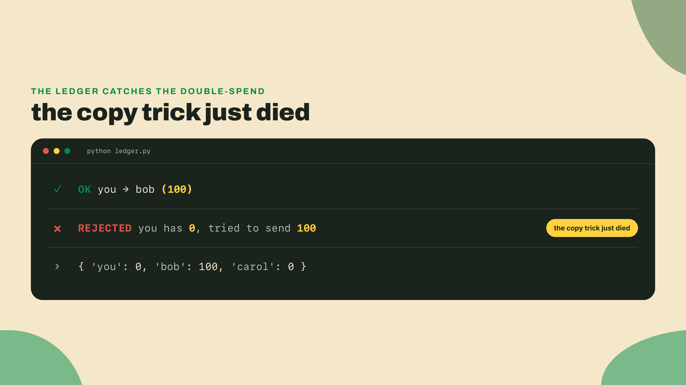
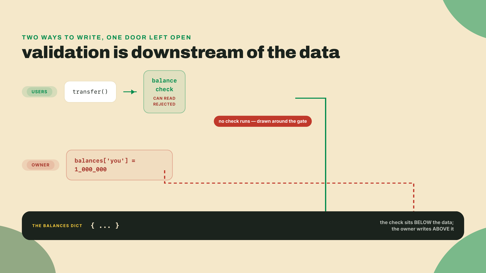
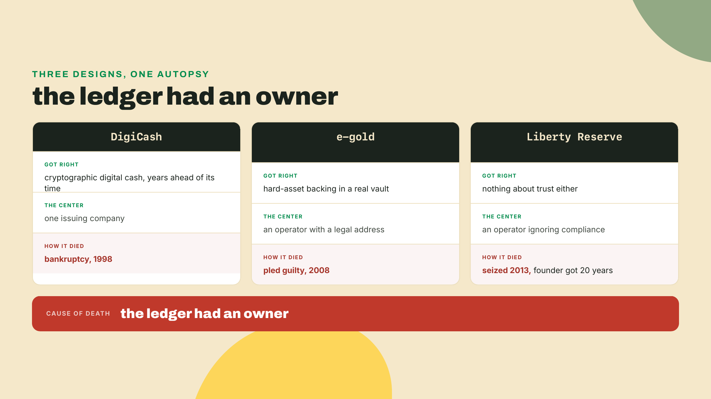
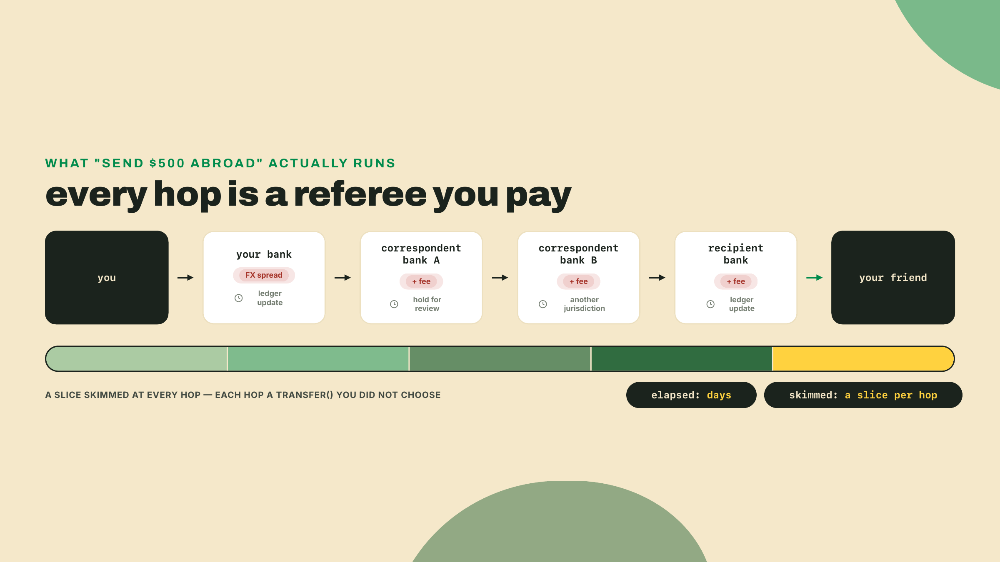
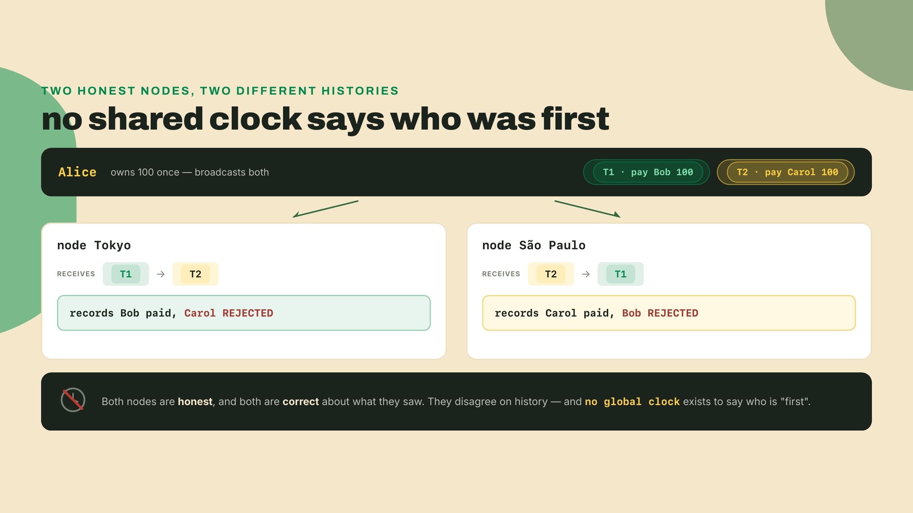
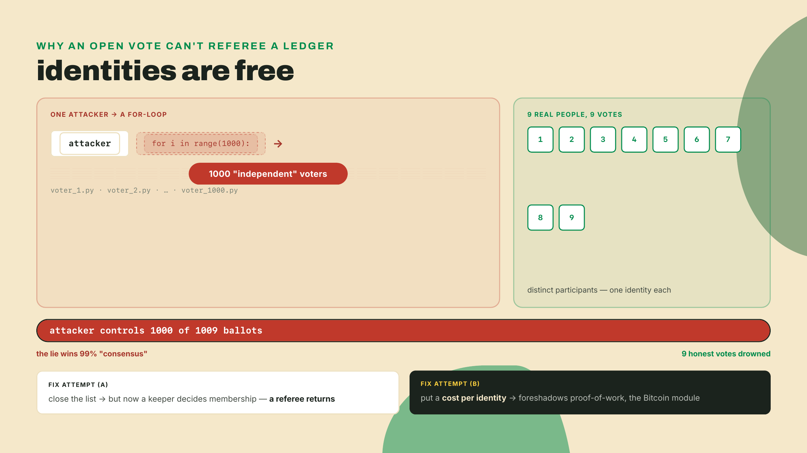
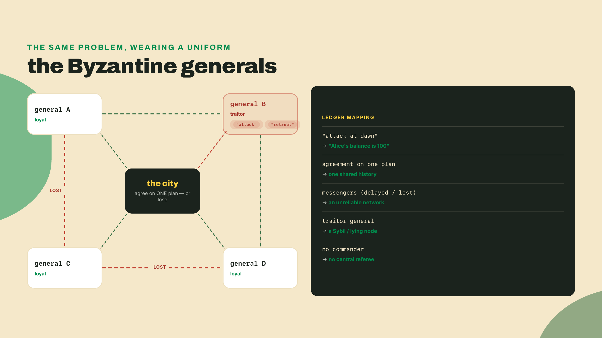
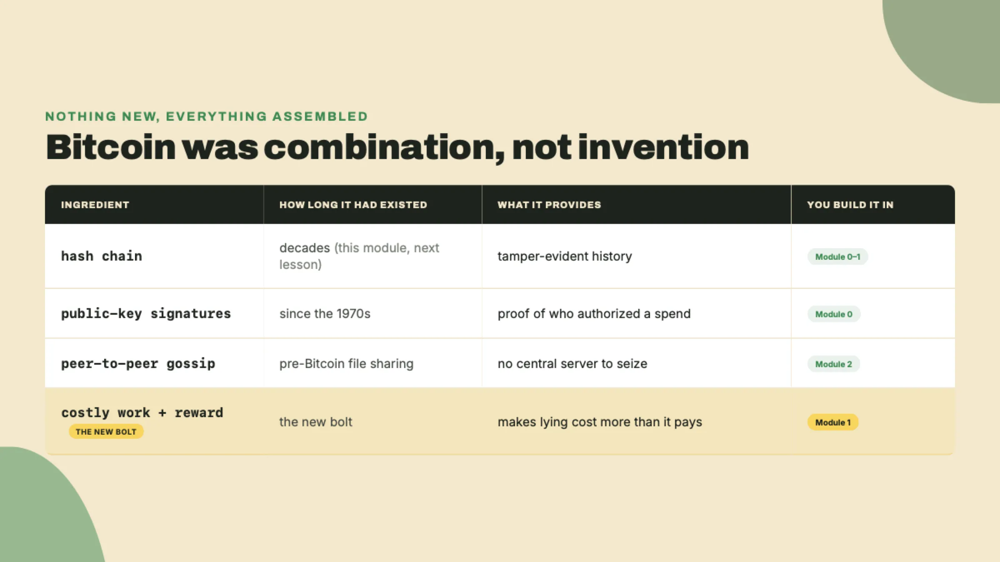
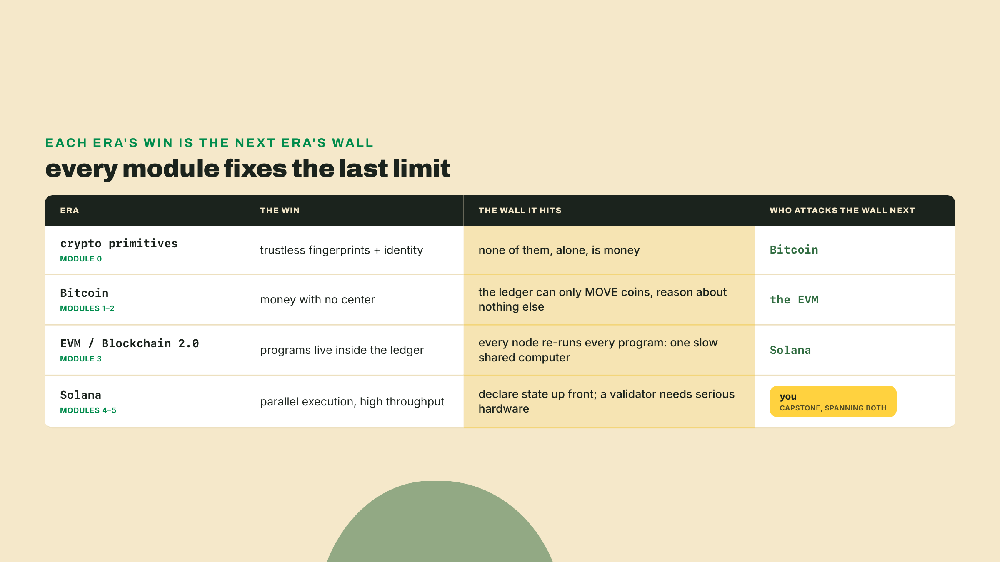

# Double-spend yourself: the fifty-year bug

In the next five minutes you will counterfeit digital money on your own laptop, build the fix every bank on Earth runs, and then find the flaw in that fix that took computer science fifty years to crack. No installs, no signups, no theory first. Terminal open.

```bash
echo '{"coin_id": 1, "value_usd": 100, "owner": "you"}' > coin.json
cp coin.json coin_for_bob.json
cp coin.json coin_for_carol.json
```

Done. You just double-spent: you spent the same money twice, the one crime a currency cannot survive. One coin, three files, and if Bob and Carol each accept their copy as payment, you bought $200 of goods with $100 that only ever existed once. Nothing on your machine objected. Nothing *could* object, because copying is the single thing computers do best, and they do it perfectly, instantly, and for free, which is wonderful for photos and MP3s and lethal for anything whose entire job is being scarce. Money's job is being scarce. A file has no scarcity at all, and a currency anyone can `cp` is worth exactly nothing.

Sit with how little that took. No exploit, no privilege escalation, no clever timing: two `cp` commands any first-week user could type by accident. The copy is not a forgery you would catch under a microscope; it is byte-for-byte the original, so there is no "real" coin and no fake one to tell apart. A currency that anyone can duplicate at zero cost and zero skill is priced by the market at exactly that: zero. For fifty years, every serious attempt to mint digital cash slammed into this wall before anything else could matter.

So fix it. The move every engineer reaches for is the same one: stop passing coin files around and keep one shared score sheet instead. That score sheet is a ledger, a single authoritative record of who owns what, where money moves by updating rows instead of copying files. Twelve lines:

```python
#!/usr/bin/env python3
"""ledger.py - the obvious fix: one balance sheet, one referee."""
balances = {"you": 100, "bob": 0, "carol": 0}

def transfer(sender, receiver, amount):
    if balances[sender] < amount:
        return f"REJECTED: {sender} has {balances[sender]}, tried to send {amount}"
    balances[sender] -= amount
    balances[receiver] += amount
    return f"OK: {sender} -> {receiver} ({amount})"

print(transfer("you", "bob", 100))
print(transfer("you", "carol", 100))
print(balances)
```

Run it:

```bash
python3 ledger.py
```



The second spend bounces. Look at what actually happened there, because it's subtler than an `if` statement: the ledger made history *global*. Your payment to Bob and your payment to Carol are no longer two independent files that never meet; they're two entries competing for the same row, and the second one loses. In twelve lines you rebuilt the core of every bank, payment processor, and fintech since the invention of bookkeeping: one ledger, one referee, no double-spends. Two wins in five minutes. Feel free to feel smart; this genuinely is the whole mechanism, and most of the financial system is this loop wearing a compliance department.

Now the uncomfortable part. Close the editor, look at the filename, and ask one question: **who runs this script?**

You do. It's your file, on your laptop, in your process's memory. The referee that just protected Bob and Carol works for you, and referees do what their employer says. Watch:

```bash
python3 -c "
import ledger
ledger.balances['you'] = 1_000_000
print(ledger.balances)
"
```

The import replays the three ledger lines, and then the last line prints your million. Read that output carefully, because the detail that matters is the one that's missing: no `REJECTED`. `transfer()` never ran. You didn't beat the validation; you went around it, straight to the data, and the validation had nothing to say because validation code cannot defend data its owner can rewrite. The check lives downstream of the dict, and the owner writes upstream of it. There is no patch for this. Add signatures, add audit logs, add a second approval function, and everything you've added is more lines in a file whose owner holds the delete key.



And notice who "you" really stands for. In a toy script it is literally you at the keyboard. In production it is a widening cast that all sit upstream of the check: the database administrator with write credentials, the cloud provider that holds the physical disk, the engineer who ships the next migration, and any authority that can compel all of them with a court order. The balance check protects users from each other. It has never once protected them from the house. Every one of those parties can do to the whole ledger what one line just did to yours, and the logs look identical either way.

Which means Bob and Carol were never trusting mathematics when they accepted your transfers. They were trusting you, personally, not to touch the dict. Trust is a line item in this design, invisible while things go well, priced the moment they don't. And I can tell you the temptation is real, because I've been the referee. Years ago I shipped a loyalty-points system for a side project, which was `ledger.py` with a Postgres accent, and when a migration bug ate a user's balance one Friday I fixed it the honest-feeling way, live, in a production shell:

```sql
UPDATE balances SET points = points + 500 WHERE user_id = 42;
```

It worked. It was even the right thing to do. But nothing in the system could have told you the difference if it hadn't been: the row changed, the app displayed it, and the audit trail was whatever I said it was. A bank is that shell session at scale, wrapped in an org chart, regulators, and better marketing, but with the same write access at the center. Usually that's fine. The next fifty years of computer science hang on the word *usually*.

History kept score on the times it wasn't fine. DigiCash had cryptography years ahead of its time: real digital cash you could hold, built by people who saw this exact problem coming. But the tokens were cryptographic and the company was not. Every unit was issued and settled through one firm, so the currency's lifespan was pinned to that firm's runway, its bank partnerships, its payroll, and when the deals didn't close fast enough the money died of cash flow. DigiCash filed for bankruptcy in 1998. Nothing about its cryptography failed. Its center did.

e-gold made the opposite bet: back every digital unit with metal in a real vault, so the value question is settled forever. That solved the wrong problem. Vaults have street addresses, addresses appear on court orders, and the operator of a money system is, legally, the system, so its exposure becomes yours. e-gold pled guilty in 2008, and the currency's fate was decided in a courtroom its users never entered. Backing answers "is this worth anything." It says nothing about who holds the pen.

Liberty Reserve stopped pretending and skipped compliance entirely, which works right up until it doesn't. It was seized in 2013 and its founder was sentenced to 20 years. Line the three up. One died of business, one of jurisdiction, one of prosecution: three different proximate causes, one structural cause. Each system had a center, and the center is where digital money dies.



And the referees that survive don't die; they bill. You've paid that bill even if you've never itemized it. Send money across a border and watch it shed a slice at every hop while taking days to settle, because each intermediary on the route is a `transfer()` you must trust and pay. Have an account frozen "pending review" and discover that the appeal process is a phone tree, because the referee owes you no reason. Open a breach-notification letter and realize your entire transaction history now sits in a stranger's dossier, because a central ledger is also a central archive of everyone's behavior. Then read the fine print on the account itself: your balance is a claim on the institution, not a possession, good exactly as long as the institution is. None of these are scandals. They're the standing costs of the design you wrote twelve lines ago.

Take the border-crossing case, because it's the one where the hidden `transfer()` calls become visible. You wire $500 from a bank in São Paulo to a friend in Lisbon and picture one arrow between two accounts. The reality is a relay race. Your bank rarely holds an account at your friend's bank, so it hands the payment to a bank that does, which hands it to another, and the money walks a chain of *correspondent* banks that each keep ledgers with the next: often four or five hops, each in a different jurisdiction, each running its own `ledger.py`, each taking a fee and a cut of the exchange rate, each free to hold the transfer for "review." Nobody on that chain is doing anything unusual. Every one of them is a referee you didn't choose, being paid to update a row, and the days of delay are just the sum of their processing windows. The fee you see is the toll for trusting a chain of strangers to each move a number correctly.



So here is the real problem statement, the one worth fifty years. Keep the ledger (you proved it's necessary; the shared score sheet is what killed the copy trick), but let *nobody* hold the pen (you proved a held pen is fatal). Concretely that means thousands of strangers spread across the planet, each holding a copy of the score sheet, agreeing on every single update, over a network that delays, drops, and reorders messages, while some participants lie for profit and no administrator exists anywhere to break ties. Every intuitive fix collapses back into a referee. Replicate the ledger across many machines and the copies drift apart the instant one message arrives late.

Watch why that drift is fatal, not just annoying, and notice that nobody has to cheat for it to happen. Alice owns her 100 once. She broadcasts two payments almost together: "pay Bob 100" and "pay Carol 100." On an *asynchronous* network (one with no shared clock, where each message arrives whenever the wires feel like delivering it), a node in Tokyo might see the Bob payment land first and the Carol payment second, while a node in São Paulo sees them in the opposite order. Both nodes are honest. Both apply the same rule: first valid spend wins, the second bounces. So Tokyo records that Bob got paid and São Paulo records that Carol did, and now two truthful machines hold two different histories of the same money. No traitor, no fake voters, no lie: just light-speed and routing. To reconcile them you need someone to declare which payment was *really* first, and "really first" has no meaning without a clock everyone trusts. Hand them that clock and you've hired a referee. Take it away and honest nodes disagree forever.



That is the drift, and honesty does not dissolve it. To reconcile the two histories you need a tie-breaker, and a tie-breaker is a referee with a new job title. Fine, then vote. Majority rules. Try it:

```bash
for i in $(seq 1 1000); do cp ledger.py voter_$i.py; done
ls voter_*.py | wc -l
```

One thousand voters. One keystroke. Zero cost. On the internet, identities are free, so any open vote is won by whoever scripts fastest, this is a Sybil attack, manufacturing fake participants until your lie is the majority opinion, and you just ran one against yourself. Close the voter list to known, vetted members and you've reinvented the consortium: a list with a keeper, and the keeper is a referee. The formal name for the underlying puzzle is distributed consensus among adversaries, and for decades the expert answer was a shrug with credentials: pick one, no referee or no double-spends, because you cannot have both.



Strip the money away and the puzzle underneath is a famous one in distributed systems, usually told with generals. Picture several armies camped around a city, each led by a general who can only send messengers to the others. To win they must all attack at the same hour; if some attack and some retreat, they lose. Now poison it: the messengers can be delayed or lost, and some of the generals are traitors actively sending different plans to different peers to split the group. The generals need to agree on one plan anyway, using only messages, with no commander to settle it. That is your ledger problem wearing a uniform, replace "attack at dawn" with "Alice's balance is 100," replace the traitors with the person running a thousand voter scripts, and replace the messengers with an internet that reorders and drops packets.

What makes it genuinely hard, not just annoying, is the combination. If the network were reliable, you could take a vote and trust the count. If everyone were honest, a delayed message would sort itself out, the way two honest nodes could eventually compare notes and pick an order. It's *unreliable messages plus dishonest participants at the same time* that had no known open solution: you can never quite distinguish a traitor lying from an honest general whose messenger got mugged, so you can never be fully sure the agreement you reached is the real one. Every workaround the field tried leaned on a trusted party somewhere, a known list of generals, a leader who breaks ties, a central clock, and a trusted party is the pen you're trying to put down.



Then a nine-page paper by a pseudonymous author claimed you could have both: the Bitcoin whitepaper was published on 2008-10-31, in the middle of a global banking collapse, and the system it described went live weeks later. Bitcoin's genesis block (2009-01-03) embeds 'The Times 03/Jan/2009 Chancellor on brink of second bailout for banks', the first block of the chain, hardcoded into every copy of the software. Read it twice. It's a timestamp, since quoting that morning's headline proves the block wasn't minted earlier. And it's a mission statement: the very first entry in the new ledger is a headline about the old one failing. Later in this course you'll pull that block from a node yourself and read the line raw.

The trap is to imagine one brilliant invention hiding in that paper. There isn't one. Every part had been sitting in the open toolbox for years: hash chains that make history tamper-evident, public-key signatures that prove who authorized what, peer-to-peer gossip that spreads messages with no central server, and the plain idea of making an action expensive. DigiCash held some of these pieces and still died. The move nobody had made was the assembly, bolting the pieces together so that lying costs more than it pays. If forging history means redoing the expensive work faster than the entire honest network combined, and the network hands out new coins to whoever does the honest work, then self-interest and honesty point the same direction. Consensus stops being a matter of trusting anyone's character and becomes a matter of arithmetic. You will build every one of these pieces by hand over the next modules; for now, just hold the shape of the trick.



If you're the kind of engineer who argues with a lesson, you're probably forming an objection right now, and it's the right one: *why not just a database everyone can read, where every entry is digitally signed?* Signatures are real cryptography, not trust, so on the face of it they ought to kill the referee outright. Hold onto that instinct, because you're two-thirds correct, and the missing third is the whole game. Signatures do solve *authorization*: next lesson you'll build them, and once you have them, nobody can move Alice's coins without Alice's key, no central approver required. That genuinely deletes one referee.

But authorization is not the hard part. Two problems survive every signature you can add. The first is *ordering.* Alice signs "pay Bob 100" and, a breath later, signs "pay Carol 100," and she has exactly 100. Both messages are perfectly valid, perfectly signed. Whoever decides which one counts as first is the referee, and a signature says nothing about time. The second is *canonicity: whose copy of the database is the real one.* If everyone keeps their own and they disagree, signatures don't break the tie, they just prove each version was authored by someone. You've moved the referee from "approves payments" to "decides the order and the official copy," which is a promotion, not a firing. That surviving job, ordering and canonical history in an open crowd where identities are free, is precisely what took fifty years and what the Bitcoin module solves with cost instead of authority. Keep the objection; you'll watch it get answered with your own mined blocks.


## The arc you're on

Everything after that paper is generations of engineers attacking the limits of the previous generation, and that succession is the spine of this course:


Module by module, here's the ground you'll cover, and notice the shape: each era fixes the previous era's fatal limit and then reveals a new one, which is the entire reason there's a *next* module.

The rest of **module 0** is crypto primitives: hashes and keys, fingerprints and identity, the exact parts DigiCash also held. You run each one before it gets a name, because consensus is assembled out of these pieces and you can't judge an assembly you've never handled. By the end you own a toolkit of tiny, trustworthy tools and understand why none of them, alone, is money.

**Bitcoin** assembles them. You'll run a full node on your own machine, mine a private chain, watch blocks link into tamper-evident history, and make a payment, then discover your "balance" is nowhere in the system as a stored number, only as the leftovers of transactions. The era's breakthrough is money with no center. Its limit, the one that spawns everything after, is that the ledger can only *move* coins and reason about nothing else: you can write "Alice paid Bob," but not "pay Bob only when the shipment scans as delivered," and not "let this pool of coins follow a rule instead of an owner." There is room for ownership and nothing else, and that missing room is the wall the next era climbs.



**Infrastructure** is the unglamorous module that makes the rest possible, because a chain is useless to software that can't talk to it. You'll build RPC tooling and watcher bots, the plumbing every wallet, explorer, and exchange actually runs on, and your toolkit graduates from scripts to services that watch the chain and react.

**Blockchain 2.0** is the EVM's answer to Bitcoin's "only moves coins" limit: put programs *inside* the ledger, so the chain can run arbitrary logic, hold balances, and enforce rules. That one change births oracles (how does on-chain code learn an off-chain price?) and AMMs (a market with no market-maker), and you'll build a small version of each. Its own limit surfaces fast: every node re-runs every program, so the whole world shares one slow computer. To stay in agreement, every validator has to execute every instruction of every contract, in the same order, and land on the same result; correctness is bought with brute redundancy. That caps the whole network's throughput at what one ordinary machine can do in a moment, and the fee to use it spikes the instant demand outruns that single core.

**Solana** attacks exactly that limit: run independent programs at the same time instead of single-file, and stop making the planet share one core. The redesign is not free, and this course names the bill out loud: programs must declare up front which accounts they touch, so the scheduler can prove two of them won't collide before it runs them in parallel, and a validator that keeps up needs far more hardware than a hobby machine. You trade simplicity and cheap participation for throughput. You'll deploy a program, drive it from a bot, and wire a front end to it, and you'll watch every concept you've already met map over, usually part-for-part with a new name: accounts, signatures, fees, programs.

And the **capstone** is yours: a personal ops bot that creates and manages wallets and automated agents across Bitcoin and Solana at once, with DEX and bridging as stretch goals. Every tool you build along the way joins one toolkit repo, and that toolkit *becomes* the bot. Nothing in this course is a throwaway exercise, starting right now with the foil:

```bash
mkdir -p toolkit && mv ledger.py toolkit/ && rm -f coin*.json voter_*.py
```

`ledger.py` stays. It's the foil: the thing every later module replaces piece by piece, and the benchmark that keeps us honest.

Two dates to pin against that timeline before we move. Ethereum mainnet (Frontier) launched 2015-07-30. Solana mainnet-beta launched 2020-03-16. That's 45 years of cryptography and 11 of programmable money. You're not late; the field is barely older than some of your dependencies.

Two house rules, and they're promises. One: you run the thing before it gets a name. You'll hash before hearing "preimage resistance," mine before hearing "consensus," exactly like today: you double-spent before I defined it. Two: every design we adopt gets its cost named out loud, starting with the one we just indicted. `ledger.py` is fast, simple, instantly consistent, and nearly free to operate, and on every one of those axes it beats every blockchain ever shipped. Its single flaw is needing a trusted owner. Everything this course builds trades coordination cost, latency, or complexity to remove exactly that party, and every era pays the price differently, so we will name it every time. The entire rest of this course is the bill for deleting one line of trust, and the bill is real.

## Break it yourself

You already robbed your bank once by rewriting its data. Before moving on, rob it a second, quieter way: corrupt the referee instead of the books. Open `toolkit/ledger.py` and edit `transfer()` itself so it skips the balance check whenever the sender is `"you"`, then rerun it. Both of your payments now print a confident `OK`, Bob and Carol both get "paid," and the double-spend from the top of this lesson sails through the very system you built to stop it. That's the sharper lesson: from the outside, an honest referee and a corrupt one print the same logs.

Then close the laptop and say the answer to this out loud, one sentence, no notes: why can't the fix be more code in the same script?

If your sentence lands anywhere near "because whoever runs the script owns the truth," you have the exact thought that opens the next lesson. The fix begins somewhere strange, 64 hex characters that behave unlike anything else in computing. One command. Everything built since 2009 stands on what it prints.
