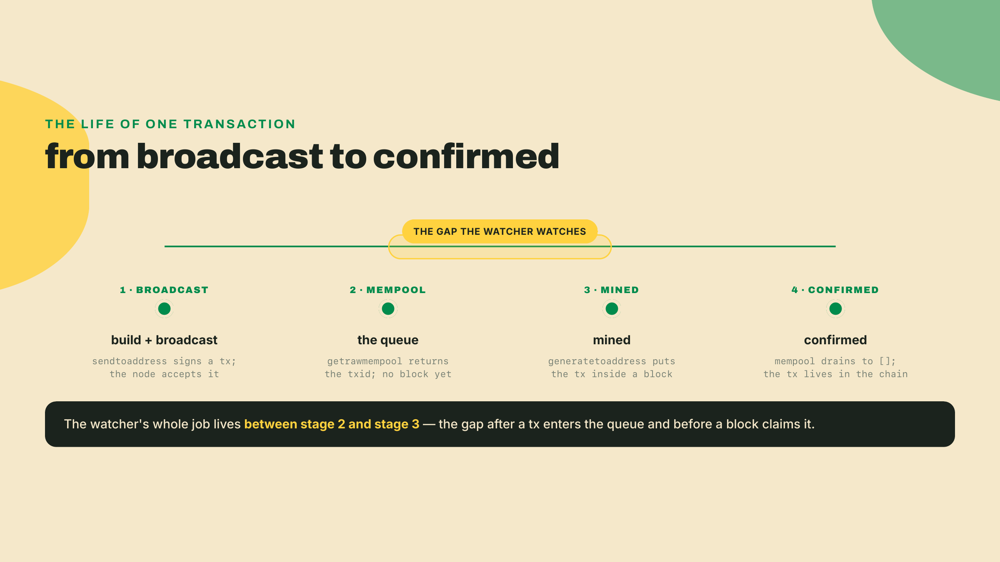
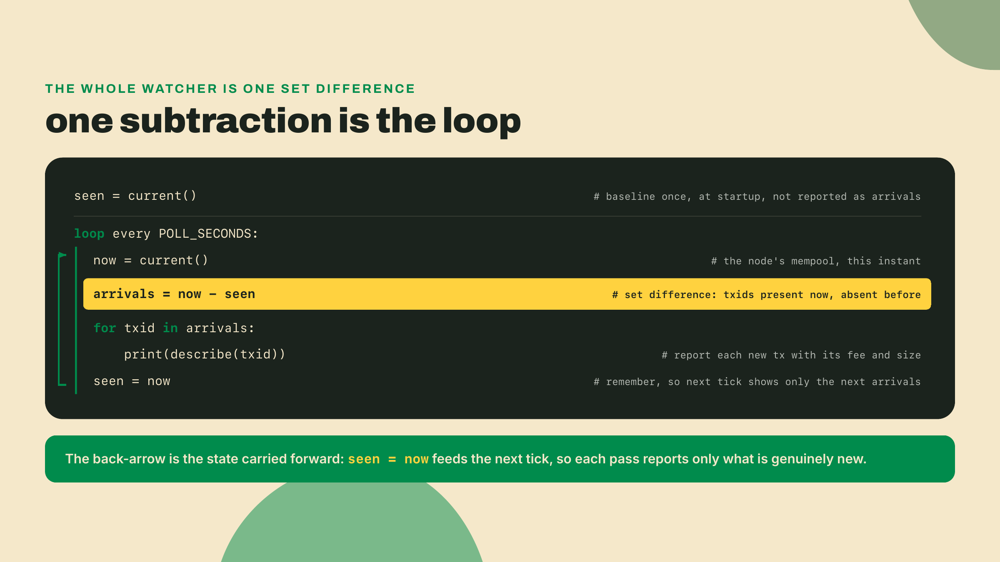
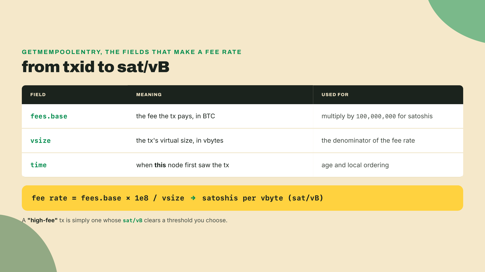
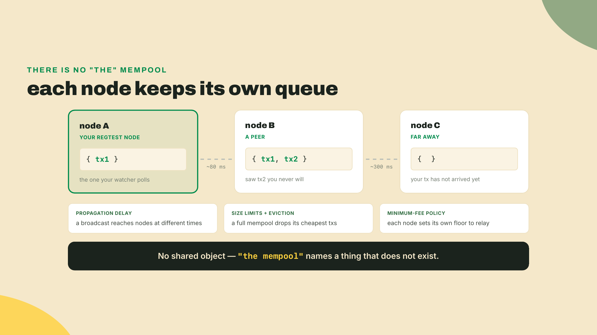
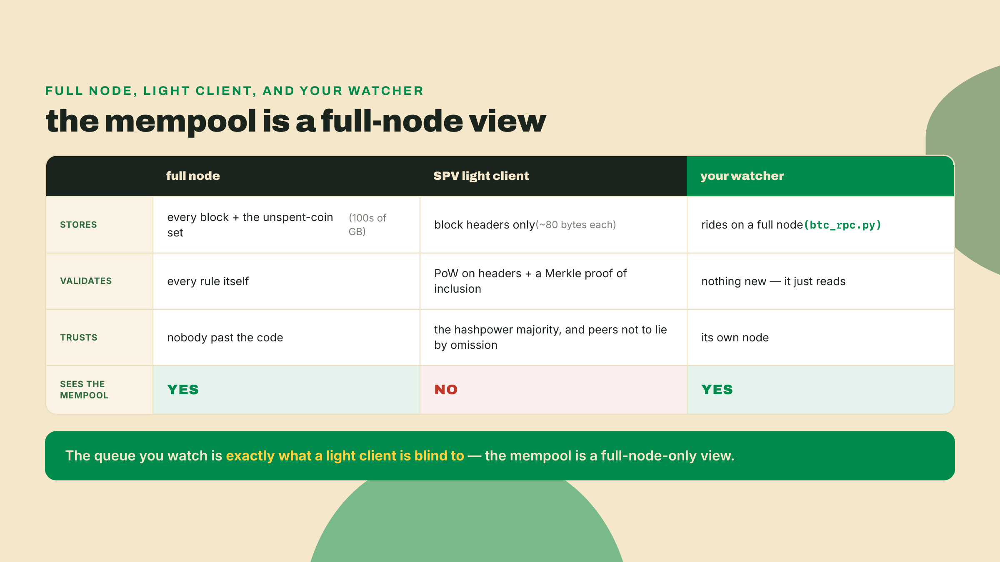
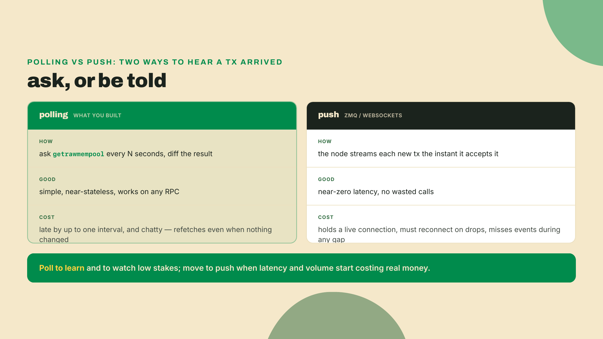
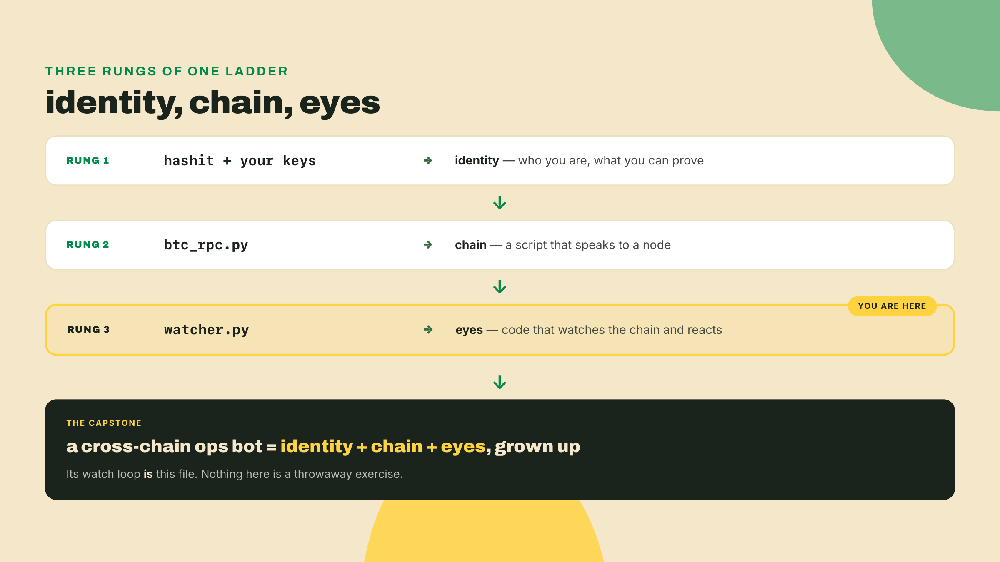

# Watch the mempool: your first chain-watching bot

Last lesson you taught a script to talk to a Bitcoin node. `btc_rpc.py` opens a connection, fires a JSON-RPC call (a request that names a method plus its arguments and gets back one JSON answer), and hands you the result. You asked the chain questions; it answered. That was rung two of the toolkit. The half-course artifact, a bot that watches a live chain and reacts to it, is now one loop away from that file.

Here is the trick this lesson turns. You will send a payment in one terminal and catch it in another, with your own code, before any block confirms it. Two terminals, one node, and the gap between them.

Open two terminals. In the first, ask your regtest node (the private test network where you mine your own blocks on demand) what is waiting in line to be mined right now:

```bash
python3 -c "from btc_rpc import BitcoinRPC; print(BitcoinRPC().call('getrawmempool'))"
```

On a quiet node you get an empty list:

```
[]
```

Nothing waiting. Now put something in the room. In the second terminal, spend a coin to a fresh address of your own. The wallet you funded last lesson still holds spendable regtest coins:

```bash
ADDR=$(bitcoin-cli -regtest getnewaddress)
bitcoin-cli -regtest sendtoaddress "$ADDR" 1.0
```

The node prints a transaction id. Yours will differ, because a txid is a hash of the exact transaction you just built:

```
3f8a9c2b7e1d4a6f0c5b8e2a1d9f7c3b6a4e0d2f8c1b5a7e9d3f6c0b2a4e8d1f
```

Back in the first terminal, ask again:

```bash
python3 -c "from btc_rpc import BitcoinRPC; print(BitcoinRPC().call('getrawmempool'))"
```

```
['3f8a9c2b7e1d4a6f0c5b8e2a1d9f7c3b6a4e0d2f8c1b5a7e9d3f6c0b2a4e8d1f']
```

There it is. You caught a payment mid-flight: broadcast, accepted by the node, standing in line, but not yet inside any block. If you never mine, it can sit there for a long time. That waiting room, and the gap it represents, is the entire lesson.

Finish the cycle. Mine one block and point the reward at that same address:

```bash
bitcoin-cli -regtest generatetoaddress 1 "$ADDR"
```

Ask the mempool one last time:

```bash
python3 -c "from btc_rpc import BitcoinRPC; print(BitcoinRPC().call('getrawmempool'))"
```

```
[]
```

Empty again. The transaction did not vanish; it graduated. It left the queue and moved into a block, where it now lives for good. That move, from queue to block, is what people mean by a **confirmation**: a transaction gets its first confirmation when a block includes it, and one more each time a block is stacked on top. You just drove the whole arc by hand: broadcast, wait, confirm, drain.



## Turn the arc into a loop

Doing this by hand proves the mechanism. Doing it on a timer is the tool. A watcher is almost embarrassingly simple in shape: ask for the current queue on an interval, compare it to what you saw last time, and report anything new. Here is the skeleton. It runs today, but the two interesting lines are yours to write:

```python
#!/usr/bin/env python3
"""watcher.py - poll the mempool, report new transactions as they arrive."""
import sys, time
from btc_rpc import BitcoinRPC

rpc = BitcoinRPC()          # the client you built last lesson
POLL_SECONDS = 2

def current():
    """The node's current mempool as a set of txids."""
    return set(rpc.call("getrawmempool"))

def describe(txid):
    """Fee and size for one txid, so an arrival reports an amount."""
    e = rpc.call("getmempoolentry", [txid])   # params is a positional array
    fee_sat = round(e["fees"]["base"] * 1e8)
    return f"{txid[:12]}...  fee={fee_sat} sat  vsize={e['vsize']} vB"

def snapshot():
    txids = rpc.call("getrawmempool")
    print(f"mempool: {len(txids)} tx")
    for t in txids:
        print("  " + describe(t))

def watch():
    seen = current()  # baseline: what is already waiting is NOT an arrival
    print(f"watching mempool via btc_rpc: baseline {len(seen)} tx")
    while True:
        # TODO(you): read the current set, diff it against `seen`,
        #            print describe(txid) for each arrival, then update `seen`
        # TODO(you): a node restart makes rpc.call() raise. Catch it, back off,
        #            and resume the loop. Do NOT let the bot die with the node.
        time.sleep(POLL_SECONDS)

if __name__ == "__main__":
    snapshot() if "--once" in sys.argv else watch()
```

Two design choices in there are worth naming plainly, because they are the whole difference between a toy and something that survives a night unattended.

The first is that baseline. When the watcher starts, it reads the mempool once and calls that `seen`, without reporting a single line. If it skipped that step, then every restart would dump the entire current queue at you as if it had all just arrived, which is noise, not news. You want arrivals, meaning transactions that showed up after you started looking. So the baseline is the point you start counting from, and everything past it is the diff.

The diff itself is the tool's beating heart, and it is one line of set arithmetic. New arrivals are the transactions present now that were absent before: `current() - seen`. Report them, then fold them into `seen` so the next tick only surfaces the next arrivals. No database, no bookkeeping, no clever data structure. A set and a subtraction.



The second choice is the one that separates a demo from a bot: the node will go away sometimes, and your watcher must not die when it does. Restart bitcoind, and every `rpc.call()` in flight raises an error. The naive loop crashes on the first exception and you find it dead in the morning. The resilient loop catches that one failure, waits a beat, and tries again, so a node that bounces for a config change or an upgrade is a hiccup, not a funeral. Keep the handler narrow: one `except` around the RPC call, a short sleep, then continue. That is the second TODO, and it is the difference between "ran once on my laptop" and "still running on Tuesday."

## Reporting an amount, not just an id

A bare txid tells you something arrived, but not what it is worth paying attention to. That is what `describe()` is for. Given a txid, `getmempoolentry` returns the node's bookkeeping on that pending transaction: the fee it pays, its virtual size, and when this node first saw it. The fee arrives denominated in BTC, so `describe()` multiplies by `1e8` to get satoshis (a satoshi is the smallest bitcoin unit; 100,000,000 of them make one BTC). Divide that fee by the virtual size and you get a **fee rate** in satoshis per vbyte, the number miners actually sort by when they decide which transactions to pull out of the queue first.

Walk one through with real numbers, because the formula only becomes useful once it produces a value you can act on. Say `getmempoolentry` hands back a transaction whose `fees.base` reads `0.00001` BTC and whose `vsize` is `141` vB. First convert the fee out of BTC into satoshis: `0.00001 * 1e8 = 1000` sat, since a whole BTC is a hundred million of them. Then divide by the size to get the rate: `1000 / 141 ≈ 7` sat/vB. That single number, roughly seven satoshis per vbyte, is the transaction's bid for block space, and its whole virtue is that it is comparable across transactions of wildly different shapes. A lean one-input payment and a fat batch paying many recipients both collapse to the same unit, price per byte, so a miner filling the next block can rank them against each other directly. This is also why the raw fee misleads: a large transaction paying a big absolute fee can still be a worse deal per byte than a tiny one, and it is the per-byte figure that decides who gets mined first and who gets evicted when a full pool has to shed its cheapest tenants. When the Solo exercise below asks you to flag anything above a threshold you pick, that threshold is measured in exactly these units, so the 7 you just computed would slip under a 50 sat/vB bar untouched, while the `fee_rate=100` transaction the lab hands you clears it loudly.



## Whose waiting room was that?

You have been calling it a mempool this whole time. Now that you want the word, take it. A **mempool** (short for memory pool) is the set of valid transactions a node has received and is holding in its own memory, waiting to be mined. It is a staging area, not a ledger. Nothing in it is settled. Everything in it is a candidate.

And here is where most people carry a wrong mental model for years. There is no global mempool floating above the network that every node reads from. When you broadcast a transaction, it gossips across the peer-to-peer network node by node, arriving at different machines at different times. Some nodes accept it; some have not heard of it yet; some drop it because it pays too little, or because their pool is full and they evicted the cheapest tenants to make room. Two honest nodes, sitting side by side, can hold genuinely different queues at the same instant, and neither is wrong.

The lesson's one hard fact, the thing to carry out of this room: each node maintains its own mempool, 'the mempool' is a misnomer.

The waiting room you were watching, then, belonged to your node, and only your node. The `getrawmempool` you polled read one machine's memory. A peer across the network might have shown you an extra transaction you will never see, or none at all.



This is not a pedantic distinction. It is the reason two of your future bugs will exist. A watcher pointed at node A will never fire on a transaction that only reached node B, and if you build anything that assumes "the network saw it because my node saw it," you have quietly hard-coded a lie. Confirmation is the only global truth here, because a mined block propagates to everyone and the winning chain is shared. The queue in front of it is a thousand slightly different local guesses about what the next block might contain.

## What a light client cannot see

That raises a fair question, and it is worth chasing all the way down rather than waving at. Your watcher rides on a full node: a machine that downloads every block, validates every rule itself, and keeps the entire set of unspent coins in memory. That is hundreds of gigabytes and an always-on connection. You do not, it turns out, need all of that just to check whether you got paid, and the two obvious shortcuts both fail in instructive ways.

The naive answer is to trust a block explorer's website. Type your address into a browser, read the balance, done. The fatal flaw is that you are now trusting that server's word for it, which is exactly the trusted referee this whole course exists to delete. The next naive answer is to run a full node on your phone. The fatal flaw is physical: phones do not carry hundreds of gigabytes for one app, and would not want to. There is a real answer between those two, and it is old.

It is called **SPV**, Simplified Payment Verification, and it comes straight from section 8 of the Bitcoin whitepaper. An SPV client, also called a light client (a node that verifies payments without storing the full chain), keeps only the block headers, roughly eighty bytes each instead of a whole block. To check that a specific payment landed, it asks a full node for a Merkle proof: the transaction plus the handful of sibling digests on its path up to the Merkle root, the same root you built by hand two modules ago. The client re-hashes that short path, confirms it lands on a root sitting inside a header it holds, and confirms that header chain carries real proof-of-work. A phone can do that in milliseconds.

Now name precisely what SPV buys and what it borrows. It proves inclusion under work: the transaction sits in a block buried beneath the most cumulative proof-of-work the client has seen. What it takes on faith is validity. The light client never re-checks the transaction itself; it did not confirm there was no double-spend, did not run the scripts. It trusts that the majority of hashpower validated the block before building on it. It also trusts the full nodes it queries not to lie by omission, hiding a transaction or feeding it a minority chain. Average case, that is fine. The worst case is an eclipse attack, where a client's every peer is the attacker, and the honest chain is simply never shown to it.



Notice the punchline, because it closes the loop with your own tool. The mempool is not in any block. No Merkle proof covers it, because it is not committed to anything yet. An SPV client can prove a payment was confirmed, and it cannot see that payment while it waits. The waiting room is a full-node-only view. Your watcher's eyes are exactly the thing a light client gives up. That is the honest cost of running light: you trade storage and bandwidth for confirmed history, and you go blind to everything still pending.

## The gap is a market

On your regtest node this gap is a quiet queue you drive yourself. On a public chain it is contested ground. Every transaction that broadcasts sits in the open for a moment before it settles, and anyone watching the mempool can read pending trades before they execute. That is not a bug in someone's code. It is the natural consequence of a public queue with a mining step after it, and money pools in exactly that kind of gap.

On EVM chains, the ones where the ledger can run programs, this pooling got a name: **MEV**, Maximal Extractable Value, the profit a block producer or a searcher can extract by choosing which transactions to include and in what order. Make the searcher concrete rather than abstract. Suppose a trader broadcasts one large swap: sell a big pile of token X for token Y on an automated market maker, a trade so large that filling it will visibly move the price. A searcher's bot, polling the mempool with the very same diff loop you just wrote, spots that pending swap before any block includes it. It builds two transactions of its own and pays just enough fee to have them ordered on either side of the victim's: one that buys token Y an instant before the big swap lands, and one that sells that same Y back an instant after. The large swap drags the price up between them; the searcher bought at the old price and sells into the new one, and the spread is pure profit. The original trader gets a worse fill than they would have received alone and never agreed to carry those two passengers. The maneuver has a name, a sandwich, and it depends on exactly one capability: reading a trade in the queue before it settles. That is precisely the power your watcher just handed you, minus the money and minus the adversaries.


Your regtest watcher, polling a private queue on your laptop, is looking at the embryo of that whole economy. Same gap, same visibility, none of the stakes yet. When the ledger learns to run code a couple of modules from now, that quiet queue turns into the arena where this plays out, and the plumbing you are writing tonight is the first instrument anyone points at it.

## Simple and honest, late and chatty

Every tool in this course gets its cost named, and this one's is a design fork you will meet again. The watcher polls: it asks `getrawmempool` on a timer and diffs the answer. Polling is simple, close to stateless, and works against any RPC endpoint on Earth, which is why it is the right first move. Its price is that it is late and chatty. Late, because you learn about a transaction up to one full interval after it arrived; drop `POLL_SECONDS` to shrink that lag and you make more calls per minute. Chatty, because you re-fetch the entire set every tick even when nothing changed, most of those calls returning news you already have.

The alternative is push: let the node tell you the instant a transaction lands. Bitcoin Core exposes this through **ZMQ** (ZeroMQ, a messaging library the node uses to stream raw events like new mempool transactions and blocks over a socket). Hosted services expose it through **websockets** (a connection that stays open both directions so the server can push events without being asked). Push is near-instant and wastes no calls. Its price is connection state: you now hold a live socket, must reconnect cleanly when it drops, and you miss whatever streamed past during any gap in your connection.



The capstone bot inherits this exact fork. When it watches two chains at once and reacts to real balances, "late and chatty" stops being free and you will pay to move to push. For now polling is correct, because you are learning the shape of the thing, and the shape is clearer when it is a loop you can read top to bottom.

## Two footguns, one confessed

There is a way to make polling actively harmful, and I walked into it. The first time I ran a watcher against a live node, I set the interval to zero: a tight `while` loop calling `getrawmempool` as fast as the CPU would allow, because faster felt strictly better. Within a minute the node started refusing my calls. I had built a bot whose only job was to watch a node, and its first act was to knock that node over by hammering it. The fix is boring and it is the reason `POLL_SECONDS` exists at all: a sane interval, and, against any hosted endpoint, a hard respect for the provider's rate limit. Watching a node should cost the node almost nothing.

The second footgun is the misnomer wearing a disguise. It is tempting to write "if my watcher saw it, the network saw it," and that sentence is false. Your watcher sees one node's queue. A transaction sitting in a peer's mempool that has not reached yours does not exist as far as your loop is concerned, and code that assumes otherwise will fire late, or never, and you will blame the wrong thing. When your logic needs certainty, it needs a confirmation, not a mempool sighting.

## The eyes of the toolkit

Save the tool. `watcher.py` is rung 3 of the ladder, and it is the direct ancestor of the capstone bot:

```bash
mv watcher.py toolkit/
```

Say the lineage out loud, because it is the point of the whole half-course. The toolkit now holds three things. Something that gives you an identity, the keys and the wallet you built back in module 0: who you are and what you can prove. Something that speaks to the chain, `btc_rpc.py`: a script that asks a node questions. And now something that watches the chain and reacts, `watcher.py`: eyes. Identity, chain, eyes. Stack those three and you have the skeleton of every bot this course will ever build.



## Do it yourself

Two parts, and the fading is real this time: I gave you the skeleton, you own the loop.

**Completion.** Fill the two TODOs in `watch()`. First the set-diff: read the current mempool, subtract `seen`, print `describe(txid)` for each arrival, update `seen`. Then restart-resilience: wrap the RPC call so a node that goes down does not take the bot with it. Catch the error, back off (wait before retrying so you do not spin), and resume when the node returns.

**Solo.** Extend the watcher to flag any transaction paying more than a fee-rate threshold you pick. The number is `fees.base * 1e8 / vsize` in satoshis per vbyte, straight from the `getmempoolentry` table above. Print a loud marker on anything that clears the bar.

**Accept it when** the demo transaction is reported within one poll interval of your send, and the flag fires on a high-fee transaction. To produce one on regtest, set the fee rate explicitly:

```bash
bitcoin-cli -regtest -named sendtoaddress address=$ADDR amount=1.0 fee_rate=100
```

That posts a transaction at 100 sat/vB. Point your watcher at the node, run the send, and watch your own flag trip.

## Checkpoint

Run it for real. Start `watcher.py`, send yourself a transaction, and confirm the watcher reports it before you mine its block. Then, while it is still running, stop and start bitcoind. The watcher should ride out the outage and resume polling once the node is back, never having crashed. `python3 watcher.py --once` should print a line beginning with `mempool:` any time you want a one-shot look.

Then close the laptop and answer this from memory, in one breath: why is "THE mempool" a misnomer? A good answer says each node keeps its own mempool in its own memory; that these queues differ because of propagation delay, size-limit eviction, and each node's minimum-fee policy; and therefore that there is no single global object, only the local queue your node happened to hold when your watcher asked. Extra credit if you can say why a light client cannot see any of it.

Your watcher sees the waiting room of one chain, a queue where the only thing that can ever happen is coins moving from one owner to another. The next era poses a stranger problem: a ledger that can itself run code. The queue stops being a line of simple payments and fills with programs racing to execute, and that quiet waiting room becomes a battlefield.
