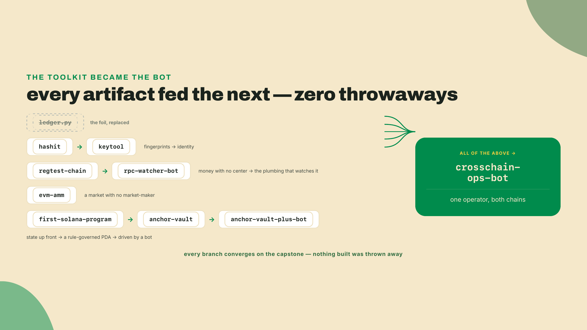
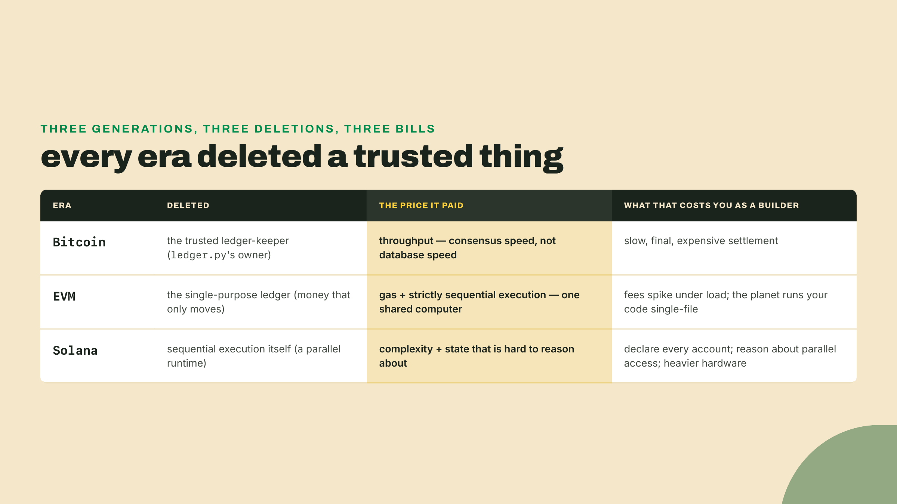
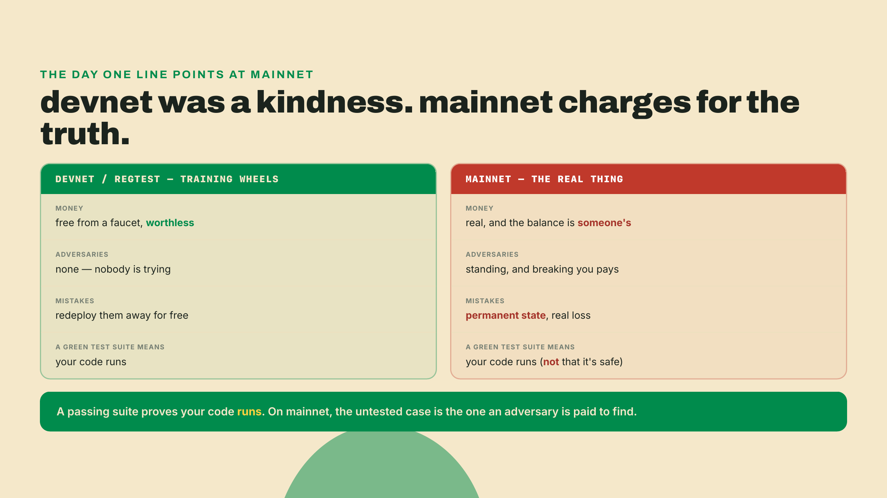
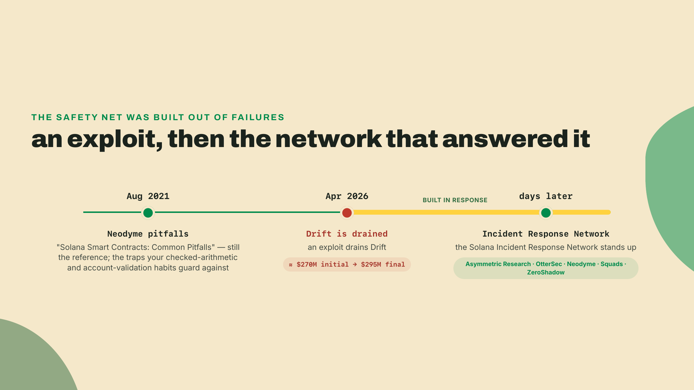
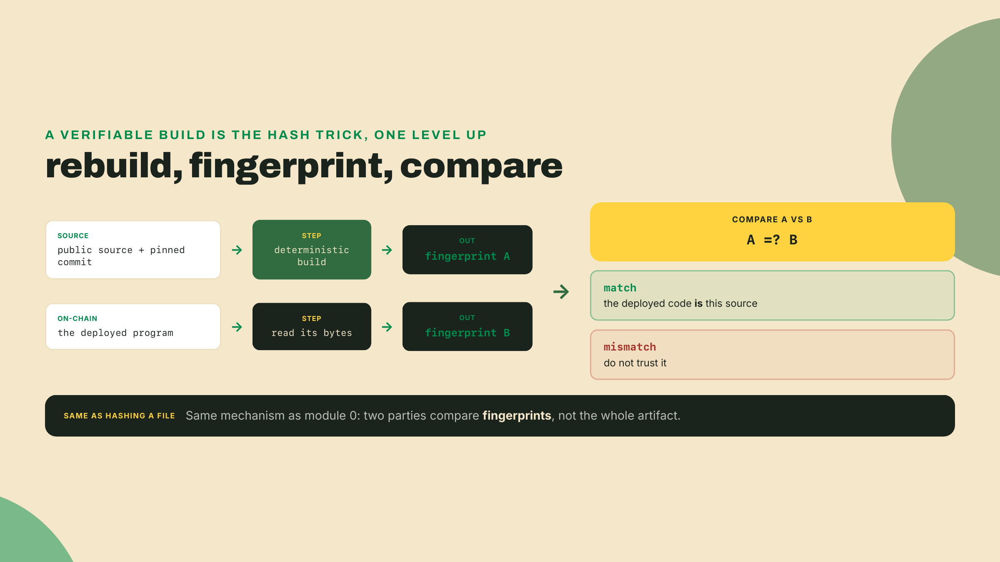
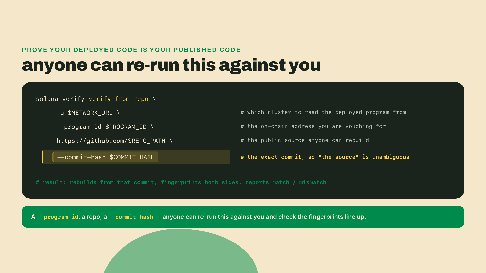
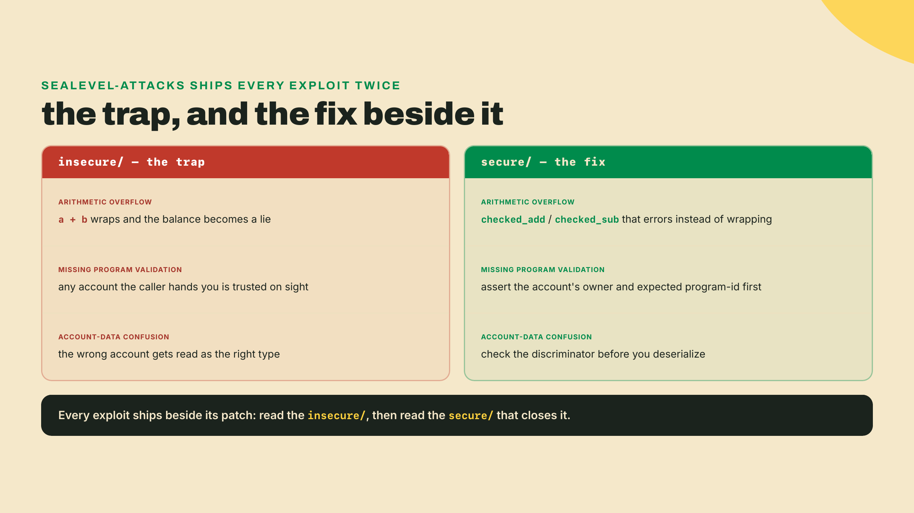
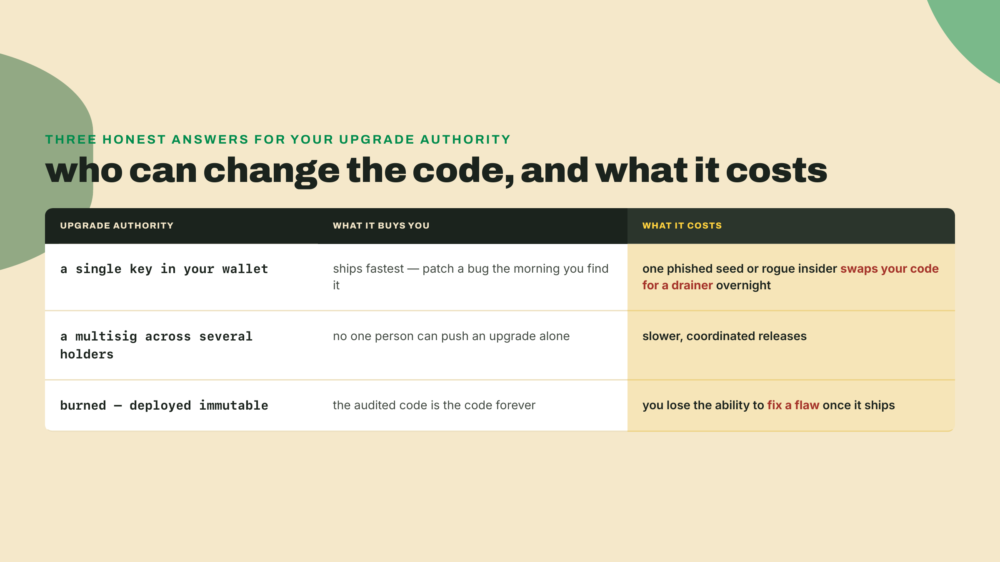
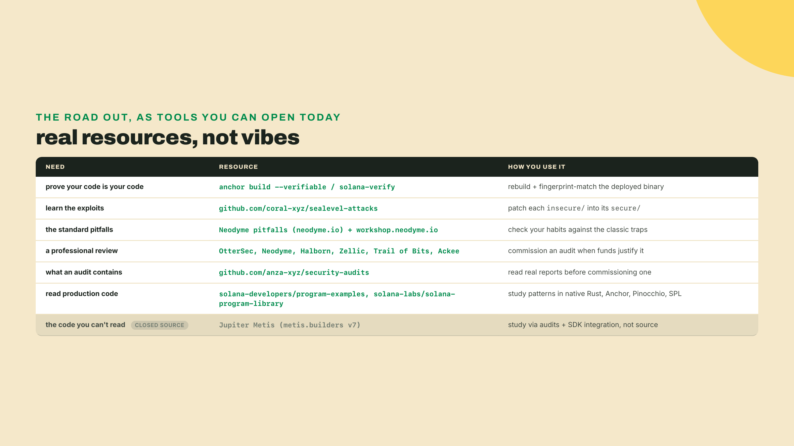
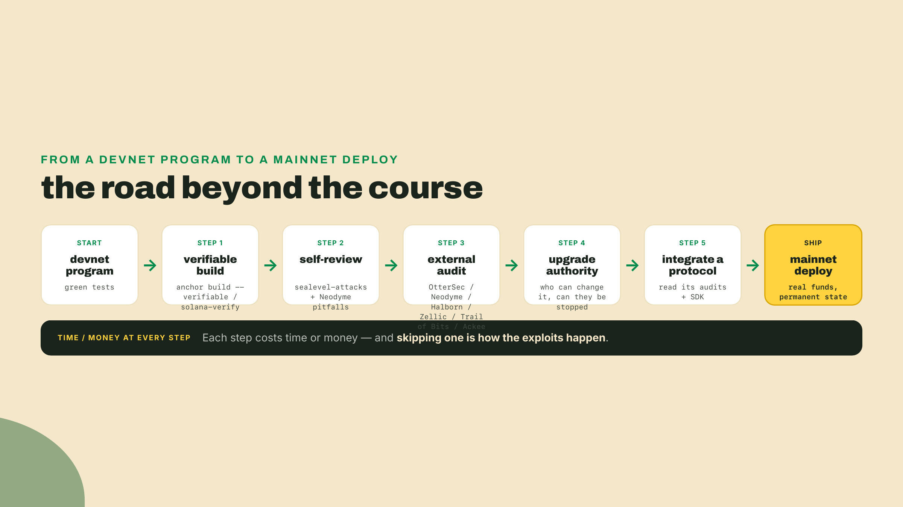

# Cut the net: where you go from here

Last lesson you wired the final leg. The crosschain-ops-bot now creates and manages wallets and agents across Bitcoin and Solana at once, from one repo, on your word. Sit with the distance for a second. The thing that opened this course as a 12-line `ledger.py`, the referee you put on trial in lesson one, is now a working cross-chain operator. You didn't fork it from a template. You built every piece by hand, and the pieces grew into the machine.

And every coin it touches is worthless.

Regtest BTC, devnet SOL: free to mint, free to lose, and nobody on Earth is trying to take it from you. That was the deal the whole course ran on, and for learning it was exactly the right deal. But the day one line points at mainnet, all three of those facts flip in the same instant. The money turns real. The state turns permanent. And someone you will never meet starts probing your program for a way to drain it, because now there is finally something inside worth draining.

Before we name any of that, run the arc back out loud. This prints exactly what you built, in the order you built it:

```bash
cat <<'LADDER'
ledger.py             m0  the trusted referee you indicted
hashit + sign/verify  m0  fingerprints, and identity from 32 random bytes
regtest chain         m1  a private bitcoin you mined block by block
rpc-watcher-bot       m2  the plumbing that watches a chain and reacts
evm-amm               m3  a market with no market-maker
first solana program  m4  state declared up front, run in parallel
anchor-vault          m5  a PDA that holds funds under a rule, not an owner
crosschain-ops-bot    m6  all of it, wired into one operator
LADDER
```

Output, byte for byte, every time:

```
ledger.py             m0  the trusted referee you indicted
hashit + sign/verify  m0  fingerprints, and identity from 32 random bytes
regtest chain         m1  a private bitcoin you mined block by block
rpc-watcher-bot       m2  the plumbing that watches a chain and reacts
evm-amm               m3  a market with no market-maker
first solana program  m4  state declared up front, run in parallel
anchor-vault          m5  a PDA that holds funds under a rule, not an owner
crosschain-ops-bot    m6  all of it, wired into one operator
```

Eight rungs, one repo, zero throwaways. Read them top to bottom and you're reading the argument of the entire course in miniature.



`ledger.py` is the foil: twelve lines that solved the double-spend and, in the same breath, proved that whoever runs the referee owns the truth. Everything above it exists to delete that owner. `hashit` gave you fingerprints, the deterministic 64 characters that let strangers agree on bytes without agreeing on trust, and then signatures gave those bytes an author nobody can forge. The regtest chain bolted those primitives into money with no center, mined block by block on your own machine. The rpc-watcher-bot was the unglamorous turn: the plumbing that lets software actually talk to a chain and react, the layer every wallet and explorer quietly runs on. The EVM AMM was the jump from a ledger that only moves coins to one that runs programs, a market that sets prices with no market-maker sitting in the middle. Your first Solana program flipped the model again: state declared up front, programs running side by side instead of single-file. The Anchor vault put funds under a PDA, an account governed by a rule instead of a person. And the crosschain-ops-bot swallowed all of it, so a repo that began as a toy balance sheet now drives wallets and agents across two chains at once. Notice what that ladder really is: a chain of things you ran before anyone named them, and every one of them still completely safe to break.

## The map, from memory

Close the ladder and draw the other picture, the one you should be able to sketch on a napkin with no laptop in the room: three generations, each deleting one trusted thing the last one still needed, each handing you a bill for the deletion. That is the single discipline this whole course drilled into you. Nobody deletes trust for free. Name the thing that got removed, then name what removing it cost. Every era, no exceptions.

Bitcoin deleted the ledger-keeper. Your `ledger.py` worked perfectly, and its one flaw was fatal: whoever ran the script owned the truth and could rewrite it upstream of every check. Bitcoin replaced that single owner with thousands of strangers and a race to burn energy, so no one party holds the pen. The cost is throughput. To keep a crowd of strangers agreeing with no referee to break ties, the network settles at the speed of global consensus, not the speed of a local database, and it always will. You bought money nobody can freeze or forge, and you paid in transactions the system can clear per second.

The EVM deleted the single-purpose ledger. Bitcoin's chain could move coins and reason about almost nothing else: you could record "Alice paid Bob," but never "pay Bob only when the shipment scans as delivered." Ethereum put programs inside the ledger, so money could finally follow code. Programmable money. The bill arrived in two parts. You pay gas for every step of every program, metered so nobody can grief the network with an infinite loop for free. And you pay in strictly sequential execution: to stay in agreement, every node re-runs every contract in the same order and must land on the same result, so the entire planet shares one slow computer. Correctness bought with brute redundancy, capped at what one ordinary machine can do in a moment.

Solana deleted sequential execution itself. The reasoning is almost aggressive in its simplicity: if the bottleneck is that everyone runs everything single-file, stop running it single-file. Make each program declare up front which accounts it will touch (accounts-as-arguments: the transaction ships the list of state it needs, so the scheduler can prove two programs won't collide before it runs them), then run the non-overlapping ones at the same time. Bolt on PDAs (program-derived addresses: accounts a program owns and signs for, with no private key behind them) and a parallel runtime, and throughput stops being pinned to a single core. The price is complexity, and state you have to reason about with real care. Declare your accounts wrong and the transaction just fails. Reason about parallel access wrong and you ship bugs a single-threaded chain could never have shown you. And a validator that keeps pace needs serious hardware, not a spare laptop.



Here's the honest footnote the map needs, the same one from lesson one: on raw speed, cost, and simplicity, your original `ledger.py` still beats every chain in that table. A centralized database is faster than Solana, cheaper than Ethereum, and simpler than Bitcoin, on all three axes at once. It has exactly one flaw, the flaw the seven rungs above it on that ladder exist to delete: it needs a trusted owner. That is the trade the entire field is built on. You give up speed, cost, and simplicity, and in return you delete the one party who could quietly rewrite the truth. Whether that trade is worth it depends entirely on whether the trusted owner is a problem for what you're building. Sometimes it isn't, and the boring database is the right answer. Knowing when is the map's real payoff, and it's worth more than any single command in this lesson.

## What devnet didn't tell you

Now the part the course owes you before it lets you go, and I'll say it without softening. Everything you built ran on regtest and devnet, and devnet's entire value was that it lied to you kindly. Infinite free SOL from a faucet. An adversary list that was empty. Mistakes you could redeploy over before your coffee cooled. That kindness is what let you move fast and build the whole arc inside one course. It is also exactly what will hurt you the day you mistake it for a rehearsal of the real thing.

Mainnet does not lie, and it does not do refunds. It hands you the truth and charges for it: real money sitting in the accounts, permanent state you cannot quietly redeploy over, and a standing incentive for a stranger to break your program, because breaking it pays them. The verifiable-build-and-audit path that answers that reality costs real time and real money, and it slows down every ship you make. Naming that cost is the honest thing to do. Skipping the path anyway is precisely how eight- and nine-figure exploits happen. Call that arithmetic rather than a scare line: the more value you park behind unaudited code, the larger the bounty you have quietly posted for whoever finds the flaw first, and someone is always looking.



So let's state the limits plainly, because a limit you can name is a limit you can plan around. First, and most important: nothing you built has ever faced an adversary. A test suite that goes green on devnet proves your code does what you told it to do. It says nothing about what your code does when someone who wants your funds feeds it an input you never imagined. I'll confess the exact mistake, because I've made it: I shipped a program to devnet, watched every test pass green, and caught myself calling it "done." It wasn't done. It was untested against anyone hostile, and hostile is the only test that counts once there's money inside. Treating a green suite as proof of mainnet-safety is the first footgun, and it feels the safest, which is what makes it dangerous.

Second: not one program you wrote in this course was audited. An audit is an expert manual review of your program by people whose full-time job is finding the flaw you're structurally unable to see in your own code, because you're the one who wrote the assumption the flaw hides behind. It's the gap between "I couldn't break it" and "someone paid to break it couldn't either." Picture the kind of finding an auditor actually writes up, because it teaches the point better than any definition. Say your withdraw instruction takes a vault account and moves its funds to the caller. Every test you wrote passes, because in every test you hand it the real vault. The auditor probes the case you never did: nothing in the code checks that the account passed in as the vault is the vault this depositor actually owns. So an attacker supplies a different account, one they control, the instruction trusts it on sight, and the real vault empties while your green suite sits there having never once tried the substitution. That single class of bug, an account you trusted without proving it was the right account, has drained live programs on mainnet. The beginners' instinct races straight past the honest framing: a single audit lowers your risk, it does not zero it. Audited programs have been drained for real money. An audit is a floor you raise, never a shield you flip on. Anyone who says "it's audited" as if that's the end of the sentence is selling something.

Third: the standard advice, "go read a real protocol," walks face-first into a wall this course has to be honest about. Not all of them are open source. Jupiter's core routing program, Metis, is closed-source (metis.builders v7, with access gated behind staked JUP). A closed-source program is one deployed on-chain as compiled bytes with the source never published: you can call it, integrate against it, and depend on it, but you cannot read it. None of that is a knock on Jupiter or some loophole to route around; it is simply the texture of the real map. Some of the best code you'll want to learn from, you study through its published audits and its SDK integration, never the program source itself.

And the stakes under all of this stopped being hypothetical recently. In April 2026 the Solana Foundation stood up the Solana Incident Response Network (an incident-response network is a coordinated group of security firms kept on standby to react fast when a live exploit is draining a protocol), with Asymmetric Research, OtterSec, Neodyme, Squads, and ZeroShadow as founding members. It was announced days after an exploit drained Drift, roughly $270M initially, about $295M final per Drift's recovery plan. The order of those two events is the whole lesson in one line: the safety net you're stepping onto got woven out of exactly the kind of failure this lesson has been warning you about. I'm not telling you that to make you afraid to ship. I'm telling you because it's the clearest possible answer to "why does the audit path cost so much, and why is it worth it."



## The road out

Everything past this point is the road beyond this course, not a box you already ticked inside it: going to mainnet, getting a program audited, wiring in a live protocol. The good news? The tools that answer all three of those limits already exist, they cost nothing to open, and you've already met the idea under the most important one. A verifiable build is a deterministic, reproducible build: anyone can rebuild your program from your public source and confirm that the bytes running on-chain are exactly the bytes your source produces. If that sounds familiar, it should. It's the hashing lesson from module 0, one level up. The same trick that let two strangers who'd never met compare 64 characters instead of gigabytes, now aimed at a compiled program instead of a text file. Rebuild the source, fingerprint the result, compare it to the fingerprint of the deployed binary. Match, and the code is provably the code. Nobody has to trust you, your build machine, or your CI. The math vouches, exactly like it did on day one. That gap matters more than it sounds: your public GitHub source and the bytes actually deployed on-chain are two different things, and without a verifiable build a user is trusting that whoever hit "deploy" shipped the source they published. Verification deletes that trust too.



Two roads get you there, and you should know both. If you're building in Anchor, one flag does the whole thing:

```bash
# deterministic, Docker-sandboxed binary written to ./target/verifiable/
anchor build --verifiable   # requires Docker installed locally
```

The Docker sandbox is the point, not an inconvenience. It pins the toolchain so the build comes out bit-for-bit identical on anyone's machine, which is the only way a stranger's rebuild can ever match yours. The standalone path works for any Solana program, Anchor or not, and is maintained by Ellipsis Labs and the Solana Foundation:

```bash
cargo install solana-verify
solana-verify build
```

Building reproducibly is only half of it. The half a stranger actually cares about is the verify, because that's the step that ties a specific program-id on-chain to a specific public repo at an exact commit, then proves the link by rebuilding and fingerprinting both sides:



Run that against your own program and you've handed the world a way to check you without asking your permission first. That single command is the entire trust model of open-source on-chain code.

A verifiable build proves the code is yours. It says exactly nothing about whether the code is safe. For that you read the exploits, and Solana's happen to be catalogued better than almost any ecosystem's. The canonical corpus is `github.com/coral-xyz/sealevel-attacks`, and its whole teaching move is that every attack ships twice: an `insecure/` version sitting right next to a `secure/` version, in Rust and Anchor, so you learn each exploit by patching it with your own hands instead of reading about it. Spend an evening in there. You'll recognize the traps on sight, because they're the same ones your checked-arithmetic and account-validation habits were quietly guarding against all course long: arithmetic overflow, missing program validation, account-data confusion. Those three are also the spine of Neodyme's "Solana Smart Contracts: Common Pitfalls and How to Avoid Them" (neodyme.io/en/blog/solana_common_pitfalls/), dated August 2021 and still the reference the pros hand new auditors. Their hands-on Security Workshop (workshop.neodyme.io) is live too, and it's free.



When a program is worth more than your own eyes can protect, you pay the people who break programs for a living. As of mid-2026 the working roster on Solana includes OtterSec (osec.io), Neodyme (neodyme.io), Halborn, Zellic, Trail of Bits, and Ackee Blockchain. You don't have to guess what you're buying, either: `github.com/anza-xyz/security-audits` publishes every audit report the Solana Foundation has commissioned, so you can read real findings against real programs, in the auditors' own words, long before you pay for one. Read a few. They teach you what "safe" actually means in specifics, not slogans.

Before you deploy anything with real money behind it, though, decide the one thing no auditor and no tool will decide for you: your upgrade authority, the key that can replace the program's code after launch. Treat this as the most consequential choice you make at deploy time, because it has three honest answers and each one is a different promise to the people whose funds sit behind the program. A single key in your own wallet ships fastest and lets you patch a bug the morning you find it, but it also means one phished seed phrase or one rogue insider can swap your reviewed code for a drainer overnight, and every user is trusting you personally not to let that happen. A multisig spreads the authority across several holders so no one person can push an upgrade alone, which turns a single point of failure into a group that would have to collude or be compromised together; you buy that safety with slower, coordinated releases. Burning the authority, deploying the program immutable so its code can never change again, gives your users the strongest guarantee on offer, the code that was audited is the code forever, and in the same stroke strips away your own ability to fix a flaw once it ships. None of the three is free. Pick the trade-off you can defend to the holders of that money, and pick it on purpose. Deploying without a decided answer is a footgun aimed straight at your users' funds.



As for reading real code to learn the patterns: `github.com/solana-developers/program-examples` is the Foundation's curated teaching repo, with native Rust, Anchor, and Pinocchio versions of the common patterns side by side, and `github.com/solana-labs/solana-program-library` is production SPL code a great deal of the ecosystem already runs on. Read those for how it's actually done. And when you hit a closed door like Jupiter's Metis, don't treat it as a dead end; work the boundary instead. Integrating against a binary means you never open the routing logic at all. You take the account layout and the instruction shape the published SDK hands you, build the instruction against Metis's on-chain program-id, and let your own program call into it. What you can verify is the edge, not the internals: you assert on the account balances before and after the call, you pin the exact program-id you expect so nobody can slip a lookalike program into that slot, and you run the whole flow against a fork of mainnet state so the counterparty behaves like the real one before a single real dollar is on the line. You are treating the closed program as a contract with observable inputs and outputs, then testing that contract hard. Learning a system you can't fully see, through its interfaces and its reviewed behavior, can feel like a downgrade from reading source. In practice it becomes most of the job the moment you start building against other people's protocols, where the source is rarely yours to open.

One concrete first target for that boundary work, wiring a live token swap through Jupiter, is the obvious one to reach for, and it belongs firmly on the road beyond this course: treat it as an explicit unguided bonus, not a graded step. There's no walkthrough for it here, you're on your own working the SDK and the docs. And a warning that will save you an afternoon: devnet routing may be unavailable; use a mainnet-fork so a router actually quotes you a real route instead of failing on a chain where the liquidity was never deployed. That is the whole reason the boundary-testing move above runs against forked mainnet state rather than devnet.



## Your first real deploy

Line all of that up and it stops reading like a homework list and starts reading like a route. None of it happens inside this course; it's the road that begins after it. Here's the path from the program sitting on your devnet right now to one with real money behind it, in the order the steps actually go:



Before you close this, do two things from memory, no notes, out loud. One: redraw the Bitcoin to EVM to Solana map and say what each era deleted and what it paid. Bitcoin deleted the ledger-keeper and paid in throughput. The EVM deleted the single-purpose ledger and paid in gas and sequential execution. Solana deleted sequential execution and paid in complexity and hardware. Two: write your own three-line ship plan. Line one is a verifiable-build step, and you name the command (`anchor build --verifiable` or `solana-verify build`). Line two is a security review, and you name the resource (sealevel-attacks, the Neodyme pitfalls, or one of the firms). Line three is one real protocol you'll integrate. You're done when you can state the map aloud without looking, and every line of your plan points at a real, specific tool instead of a good intention.

You hold both now, and that is the whole point of the course. You hold the map, so nobody can sell you a chain on its wins with the bill hidden, because you'll know to ask what it deleted and what that cost. And you hold the toolkit: eight artifacts in one repo that began life as twelve lines of Python, plus the resources above to make it safe to point at something real. None of that was true when you double-spent a JSON file in lesson one, and you got here one rung at a time, running each thing before it had a name.

So there is no next lesson. The next thing you run lives outside this repo entirely: a `solana-verify` command pointed at a program with your name on it and real money behind it, yours to write, on a chain that doesn't lie and doesn't do refunds. The course ends exactly where your first real deploy begins.

Happy building.
