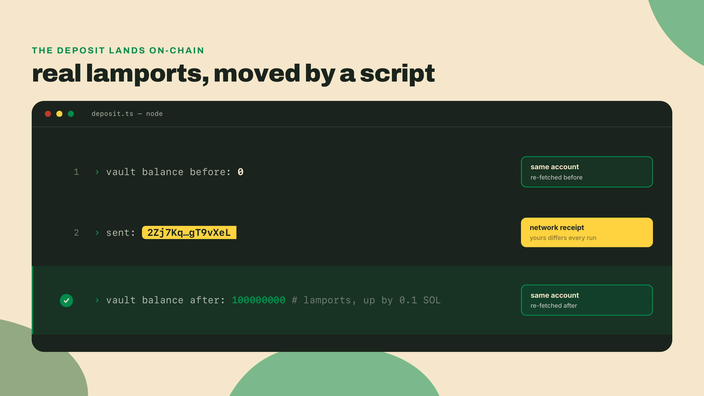
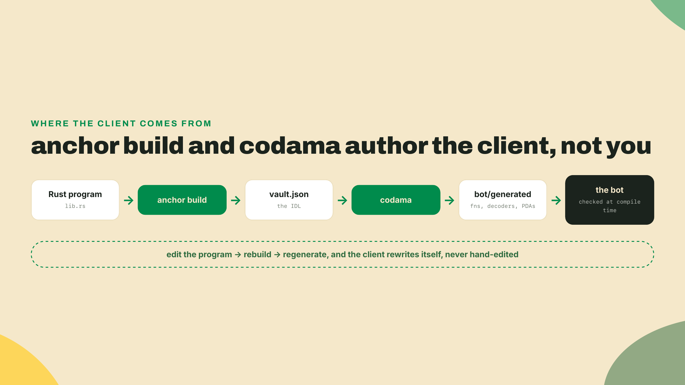
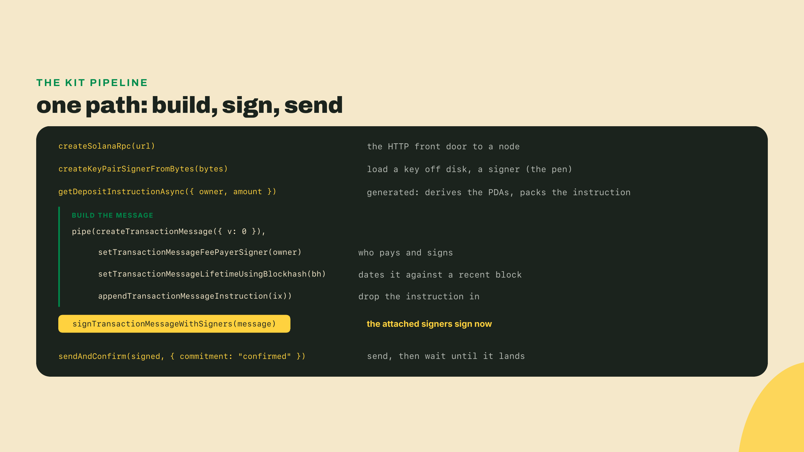
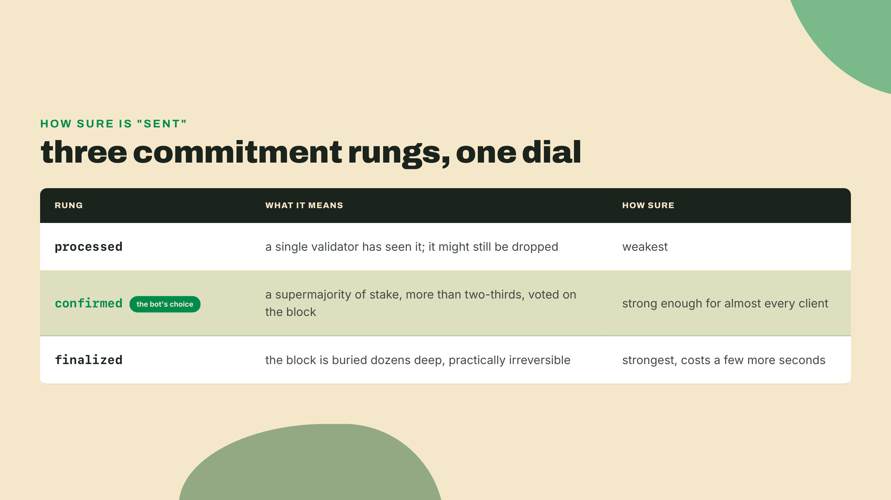
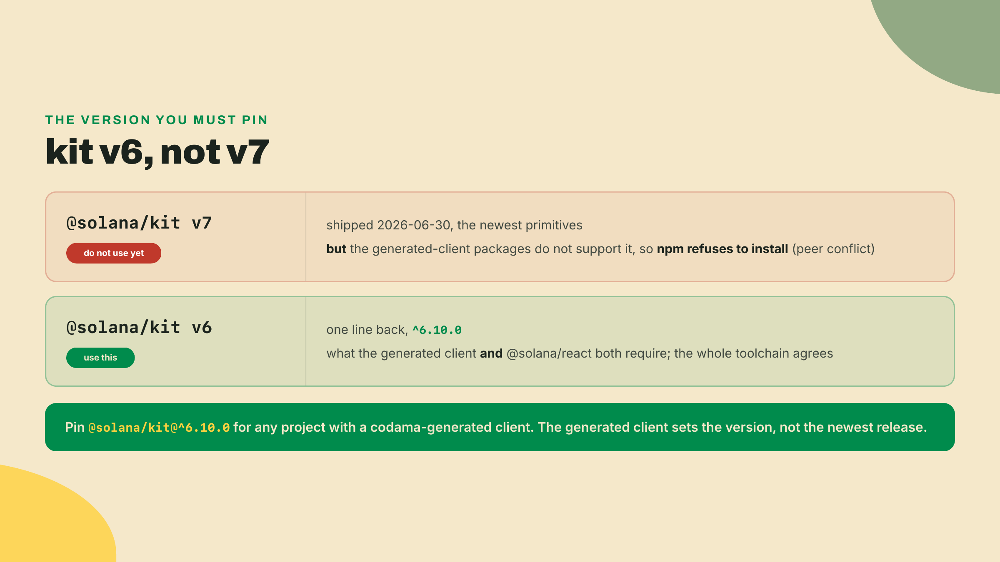
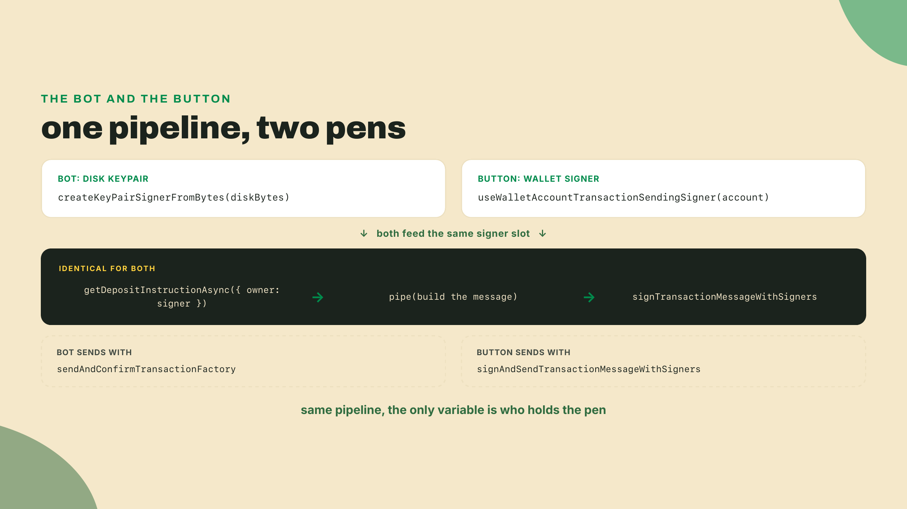
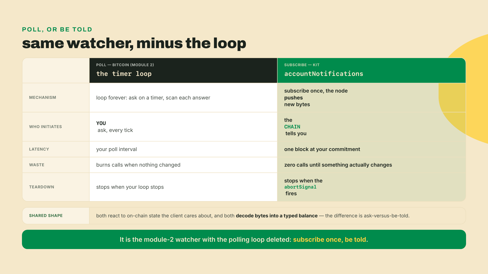

# Sign it yourself: a bot for the vault, then a button

You closed the last module with a vault deployed and green under `anchor test`: a real PDA vault whose only caller, so far, has been your own test file. That was the point of the exercise, and it is also the problem. Your vault is deployed and it does nothing. The only thing that has ever called it is a test file, and test files don't ship. A real deposit needs something to build the transaction, sign it, and put it on the wire, and right now that something does not exist, so the vault just sits there holding zero.

So build the something. There is a `bot/` folder in the repo, already wired for you. Don't read it yet. Run it.

```bash
npx tsx bot/deposit.ts
```

Three lines come back:

```
vault balance before: 0
sent: 2Zj7Kq...gT9vXeL (yours will differ)
vault balance after: 100000000
```

The last line is the vault's balance in lamports (the smallest unit of SOL, a billionth of one), and it went up by exactly the 0.1 SOL the bot deposited. The middle line is your receipt from the network. Nothing about that receipt was faked: re-run the script and the balance climbs again, because a second, separate read confirmed it against the chain, not against a variable in memory. You just did the thing test files pretend to do, from a program that will still be running when the test harness is long gone.



## Read the bot you just ran

You ran the thing before you read it. Now read it, top to bottom, because every line is a named idea you will reuse for the rest of this course.

**A 30-second sidebar for absolute beginners: how to read TypeScript.** You do not need to know TypeScript to follow this bot; read it the way you read a recipe. An `import` line at the top pulls a named tool in from another file, the way you would fetch a whisk from a drawer before you start cooking. A line like `const name = value` gives a value a name so you can call it back later. Any line that starts with `await` is a step that talks to the network, so the word just means "wait right here until the chain answers before running the next line." The bits with a colon are labels that tell your editor what shape a value should be, so it can underline a typo in red before you ever hit the network; they do nothing when the code actually runs. That is the entire vocabulary you need here. You are reading these lines, not inventing them: every one was written for you already in the `bot/` folder.

The client never wrote itself, and it never hand-wrote your program's shape either. It was generated. Last module `anchor build` emitted a file to `target/idl/vault.json`, the **IDL** (Interface Description Language: the generated contract Anchor writes down). It lists every instruction your program exposes, every argument each one takes, and every account each one touches. Then one small script turns that JSON into a typed client:

```javascript
// codama.mjs, run once after every anchor build
import { rootNodeFromAnchor } from "@codama/nodes-from-anchor";
import { createFromRoot } from "codama";
import { renderVisitor } from "@codama/renderers-js";
import { readFileSync } from "node:fs";

const idl = JSON.parse(readFileSync("./target/idl/vault.json", "utf-8"));
const codama = createFromRoot(rootNodeFromAnchor(idl));
codama.accept(renderVisitor("./bot/generated"));
```

Run `node codama.mjs` and a `bot/generated/` folder appears, holding a typed function for every instruction, a decoder for every account, and a helper for every PDA. `codama` reads the IDL and writes the client so you never do. Change the program, rebuild, regenerate, and the client rewrites itself. That is why you never hand-write an ABI here (the Application Binary Interface an Ethereum client has to maintain by hand, and keep in sync by hand, and get subtly wrong by hand). The build step is the source of truth, and the generated client is a reader of it, not a second author who can disagree.



## One shape for every transaction

Here is the whole of `bot/deposit.ts`, and the shape it teaches is the shape of every Solana transaction you will ever send from a client. There is exactly one path: build a message, sign it, send it. Read it once, then we name each move.

```typescript
import { readFileSync } from "node:fs";
import {
  createSolanaRpc, createSolanaRpcSubscriptions, sendAndConfirmTransactionFactory,
  createKeyPairSignerFromBytes, pipe, createTransactionMessage,
  setTransactionMessageFeePayerSigner, setTransactionMessageLifetimeUsingBlockhash,
  appendTransactionMessageInstruction, signTransactionMessageWithSigners,
  assertIsTransactionWithBlockhashLifetime,
} from "@solana/kit";
import { getDepositInstructionAsync } from "./generated";

const rpc = createSolanaRpc("http://127.0.0.1:8899");
const rpcSubscriptions = createSolanaRpcSubscriptions("ws://127.0.0.1:8900");
const sendAndConfirm = sendAndConfirmTransactionFactory({ rpc, rpcSubscriptions });

const secret = new Uint8Array(JSON.parse(readFileSync("state/sol.key", "utf8")));
const owner = await createKeyPairSignerFromBytes(secret);

const ix = await getDepositInstructionAsync({ owner, amount: 100_000_000n });

const { value: latestBlockhash } = await rpc.getLatestBlockhash().send();
const message = pipe(
  createTransactionMessage({ version: 0 }),
  (tx) => setTransactionMessageFeePayerSigner(owner, tx),
  (tx) => setTransactionMessageLifetimeUsingBlockhash(latestBlockhash, tx),
  (tx) => appendTransactionMessageInstruction(ix, tx),
);
const signed = await signTransactionMessageWithSigners(message);
assertIsTransactionWithBlockhashLifetime(signed);
const signature = await sendAndConfirm(signed, { commitment: "confirmed" });
```

Start at the top. `createSolanaRpc` opens a plain HTTP connection to a node, the same JSON-RPC front door you built by hand back in module 2, now typed. `createSolanaRpcSubscriptions` opens the websocket twin of it, which the send helper uses to hear when your transaction confirms. `createKeyPairSignerFromBytes` loads a 64-byte keypair off disk and hands back a **signer**: an object that holds a key and knows how to sign. That signer, `owner`, is the pen for this whole script.

Now the instruction. `getDepositInstructionAsync` is one of the functions `codama` generated from your IDL, and the `Async` in the name is doing real work. You hand it only `{ owner, amount }`, and it derives the vault's two PDAs for you, off-chain, from the same seeds the program declared, then packs the discriminator, the `amount`, and the account list into a single instruction. You never spell out the vault address. The generated helper recomputes it, deterministically, exactly the way the on-chain program will.

Then the part that is identical for every transaction on Solana. `createTransactionMessage({ version: 0 })` starts an empty versioned message, and `pipe` threads it through three edits in order: name who pays the fee and signs (`setTransactionMessageFeePayerSigner`, handed the `owner` signer), stamp it with a recent blockhash so the network can date it (`setTransactionMessageLifetimeUsingBlockhash`, from `rpc.getLatestBlockhash()`), and drop your one instruction in (`appendTransactionMessageInstruction`). `pipe` is just left-to-right function application: each line takes the message so far and returns the next version of it, so you read the transaction being assembled top to bottom.



`signTransactionMessageWithSigners` is the payoff for attaching the signer to the message earlier. It walks the message, finds every account that must sign, and asks each attached signer to do it. Here that is just `owner`, so one signature goes on. This is the seam the whole lesson turns on, so mark it: the transaction does not care *which kind* of pen signed it. A key loaded off disk and a browser wallet both produce a signer, and both slot into this exact line. Swap the signer and every other line stays the same.

`assertIsTransactionWithBlockhashLifetime` is a one-line safety check that narrows the signed transaction to the blockhash-based kind the sender expects; without it the types stay loose and the next line won't accept the transaction. Then `sendAndConfirm`, the function you built from `sendAndConfirmTransactionFactory({ rpc, rpcSubscriptions })`, does the two jobs its name spells out. It sends the signed transaction, and then it blocks, listening on the websocket, and does not return until the cluster reports the transaction reached the commitment level you asked for.

## How sure is "sent"

That commitment level is `"confirmed"`, and it is worth a full paragraph because it is the dial between speed and certainty. Commitment is Solana's answer to how sure you want to be that a transaction is real, and it has three rungs. `"processed"` means a single validator has seen it and it might still be dropped. `"confirmed"` means validators representing a supermajority of stake, more than two-thirds, have voted on the block that holds your transaction, which is strong enough for almost every client. `"finalized"` means the block is buried dozens deep and is practically irreversible, at the cost of a few more seconds. The bot asks for `"confirmed"`, so when that line returns, you know the deposit landed, not merely that you fired it into the dark.



The base-58 string it returns, captured here as `signature`, is your **transaction signature** (the identifier that pins your exact transaction on-chain: your permanent receipt). Paste it into a block explorer, Solana Explorer or Solscan, and you can pull up the whole transaction: which program ran, which accounts changed and by how much, the compute it burned, the fee it paid. In the bot it is proof for you; in a frontend you turn it into a clickable link so a user can watch their own deposit settle.

That is the whole `bot/deposit.ts`: open an RPC, load a signer, build the instruction from the generated client, thread the message through `pipe`, sign, send. Nothing hidden, and no second path. There is no shortcut door and no verbose door, the way older Solana clients split into a one-line convenience call and a build-it-yourself call. Kit gives you one pipeline, and the only thing you ever vary is the signer.

## The version you must pin

Look back at the imports. Every primitive, the RPC, the signer, the message builders, the send helper, came from `@solana/kit`. Kit is the modern Solana SDK (formerly web3.js v2): tree-shakable, typed, built on native Web Crypto, and the one you reach for on anything new. But there is a version fact you cannot skip, and it will cost you an evening if you learn it the hard way. Kit's latest is v7, released 2026-06-30. You should install v6, not v7.

The reason is the generated client. The `@solana-program` packages and the client `codama` renders both depend on kit, and as of now they require `@solana/kit@^6.4.0`. Kit v7 shipped ahead of that ecosystem, so if you install `@solana/kit@7` alongside a generated client, `npm` throws a peer-dependency error and nothing installs. Pin kit to the 6 line and everything agrees. Concretely: `npm install @solana/kit@^6.10.0`, and let the generated client pull its matching pieces. This is not kit being broken; it is a young ecosystem where the client generators trail the core SDK by one major version, and the fix is simply to install the version the whole toolchain shares.



## The face: a button that signs

The bot proves the vault works. Nobody but you can drive it, because it needs your keypair on disk. A person with a browser wallet has to be able to walk up and deposit, and that means a frontend. The whole trick of the frontend is a single substitution: everywhere the bot loaded a signer off disk, the browser hands you a signer backed by the user's wallet instead. Every other line you already wrote stays.

Wallets announce themselves to a page through a browser standard called **wallet-standard**, and `@wallet-standard/react` gives you two hooks to reach them: `useWallets` lists every wallet the browser found, and `useConnect` opens one and returns the accounts the user approved. That is the entire connect flow, and you render it however you like:

```tsx
import { useState } from "react";
import { useWallets, useConnect } from "@wallet-standard/react";

function ConnectButton({ wallet, onAccount }) {
  const [isConnecting, connect] = useConnect(wallet);
  return (
    <button disabled={isConnecting} onClick={async () => {
      const accounts = await connect();
      if (accounts[0]) onAccount(accounts[0]);
    }}>
      Connect {wallet.name}
    </button>
  );
}

export function App() {
  const wallets = useWallets();
  const [account, setAccount] = useState(null);
  return (
    <div>
      {wallets.map((w) => <ConnectButton key={w.name} wallet={w} onAccount={setAccount} />)}
      {account && <DepositButton account={account} />}
    </div>
  );
}
```

Once the user picks a wallet and approves, you hold a `UiWalletAccount`, and that is the bridge to signing. `@solana/react` turns it into a kit signer with one hook, `useWalletAccountTransactionSendingSigner`, and from there the deposit is the bot's pipeline with `owner` swapped for the wallet's signer:

```tsx
import { useWalletAccountTransactionSendingSigner } from "@solana/react";
import {
  createSolanaRpc, pipe, createTransactionMessage,
  setTransactionMessageFeePayerSigner, setTransactionMessageLifetimeUsingBlockhash,
  appendTransactionMessageInstruction, signAndSendTransactionMessageWithSigners,
} from "@solana/kit";
import { getDepositInstructionAsync } from "./generated";

function DepositButton({ account }) {
  const signer = useWalletAccountTransactionSendingSigner(account, "solana:devnet");

  async function onDeposit() {
    const rpc = createSolanaRpc("https://api.devnet.solana.com");
    const ix = await getDepositInstructionAsync({ owner: signer, amount: 100_000_000n });
    const { value: latestBlockhash } = await rpc.getLatestBlockhash().send();
    const message = pipe(
      createTransactionMessage({ version: 0 }),
      (tx) => setTransactionMessageFeePayerSigner(signer, tx),
      (tx) => setTransactionMessageLifetimeUsingBlockhash(latestBlockhash, tx),
      (tx) => appendTransactionMessageInstruction(ix, tx),
    );
    const signature = await signAndSendTransactionMessageWithSigners(message);
    console.log("sent", signature);
  }

  return <button onClick={onDeposit}>Deposit 0.1 SOL</button>;
}
```

Put the two files side by side and the point lands on its own. The `getDepositInstructionAsync` line is identical. The `pipe` block is identical. The one signer produced by `useWalletAccountTransactionSendingSigner` is passed to `setTransactionMessageFeePayerSigner` exactly where the bot passed `owner`, and it is the same signer the deposit instruction names as its `owner` account, because the connected wallet is now the vault's owner. The only real difference is the send call: the bot's local key signs and then a separate helper sends, while the wallet's signer signs and sends in one motion (`signAndSendTransactionMessageWithSigners`), because the wallet is the one holding the connection to the network. Same pipeline, a different pen.



## The bot grows an ear: listen instead of poll

The bot can push now. It cannot hear. It fires a deposit and forgets, blind to whether the balance actually moved or whether someone else touched the vault a second later. Back in module 2, the Bitcoin watcher fought the same blindness the only way Bitcoin allows: it sat in a loop, asked the node "anything new?" on a timer, and scanned each answer. That is polling. Ask, wait, ask again, forever, and your news is only ever as fresh as your last trip around the loop.

Kit lets you turn that inside out with the subscriptions connection you already opened. Instead of asking on a timer, you subscribe once and the node pushes the new bytes to you the instant the account changes:

```typescript
import { fetchVaultState, findVaultStatePda } from "./generated";

const [vaultStateAddr] = await findVaultStatePda({ owner: owner.address });

const notifications = await rpcSubscriptions
  .accountNotifications(vaultStateAddr, { commitment: "confirmed" })
  .subscribe({ abortSignal: AbortSignal.timeout(60_000) });

for await (const notification of notifications) {
  const state = await fetchVaultState(rpc, vaultStateAddr);
  console.log("vault moved, balance now:", state.data.balance);
}
```

`accountNotifications` takes the account you care about, here the vault's record PDA that `findVaultStatePda` derived, and `subscribe` hands back an async stream. `for await` then blocks on that stream, waking your code only when the chain has something to say. When it does, `fetchVaultState` decodes the account through the very generated codec the client has been using all along, turning raw bytes back into a typed object with a real `balance`, exactly the way the deposit read it, except this time you never asked. The chain volunteered it. That trailing `"confirmed"` is the same commitment rung from earlier, so you react to what is real, not to a maybe that might still get dropped, and the `abortSignal` is your off switch: when it fires the stream closes and the loop ends, instead of leaking an open socket for the life of the process.



## Name the cost

Every tool in this course gets its bill read out loud, and kit's is two clauses, both real.

The first is verbosity. That `pipe` block is four lines to do what an older typed client could collapse into a single chained call that built, signed, and sent all at once. Kit made a deliberate trade: nothing is hidden, every step is a named function you can inspect, reorder, or swap, and in return you write the assembly out by hand every time. On a script that sends one instruction, that reads like extra typing. On a bot that needs to attach a compute-budget instruction, batch three deposits into one transaction, or sign with one key and pay fees with another, the explicit pipeline is the only thing that makes those possible, because there is a seam at every step to reach into. You pay a few lines on the simple case to keep the hard case reachable.

The second is the version fragmentation you already met. Because the generated client pins `@solana/kit@^6.4.0` while kit itself is at v7, you are living one major version behind the newest release until `@solana-program` and `@solana/react` publish their v7 lines. That is the toll of being early: the pieces are real, they work, and they do not all move in lockstep yet. Pin v6, keep the whole toolchain on one version, and revisit when the ecosystem catches up.

## Finish the bot, then the button

The bot deposits. The withdraw path is yours to close, and it hides one honest wrinkle worth meeting now. Open `bot/withdraw.ts` and reach for the generated builder, but notice it is `getWithdrawInstruction`, not `getWithdrawInstructionAsync`. Deposit got an `Async` builder that derived its PDAs for you because your `Deposit` accounts are seeded from the owner, which the client can recompute. Withdraw's record account is validated a different way in the program, so `codama` cannot derive it blind, and the sync builder asks you to pass the two accounts yourself.

```typescript
// bot/withdraw.ts - your completion
import { getWithdrawInstruction, findVaultStatePda, findVaultPda } from "./generated";

const [vaultState] = await findVaultStatePda({ owner: owner.address });
const [vault] = await findVaultPda(/* TODO(you): the seeds findVaultPda asks for */);

const ix = getWithdrawInstruction({ authority: owner, vaultState, vault, amount });
// then the same pipe -> signTransactionMessageWithSigners -> sendAndConfirm you already wrote
```

Derive the two accounts with the generated helpers, hand `getWithdrawInstruction` the `vaultState`, the `vault`, the `authority` signer, and the `amount`, then thread it through the same `pipe`, `sign`, `send` you already know. The lesson that wrinkle teaches is real: an async builder is a convenience the client can only offer when it can recompute every account, and when it can't, you supply what it cannot.

Then the harder one, unaided. Add a Withdraw button to the frontend, wired the same way the Deposit button is: the same `useWalletAccountTransactionSendingSigner`, the same `pipe`, `signAndSendTransactionMessageWithSigners`, pointed at your withdraw instruction instead of deposit, with the same before-and-after read so you can watch the balance fall.

You are done with this lesson when three things are true, and you prove each one by re-fetching the on-chain vault account and reading the changed balance, never by trusting a `console.log`. First: your headless bot deposits, returns a confirmed base-58 signature, and a follow-up `fetchVaultState` shows the vault balance risen. Second: your bot withdraws, returns a second confirmed signature, and the balance falls. Third: your browser button completes a deposit signed by a connected wallet, and a re-fetch of the vault account shows the effect. Balance up, balance down, and a wallet-signed deposit whose result you can read off the chain. That is the whole gate.

Say the answer to one question out loud before you move on, one sentence: the bot and the button send the same deposit; what single thing differs between them? A good answer lands on the signer. The bot loads a keypair off disk with `createKeyPairSignerFromBytes` and the button gets one from the wallet through `useWalletAccountTransactionSendingSigner`, and every other line, the generated instruction, the `pipe`, the signing, is identical. If your sentence names "who holds the pen," you have the one idea that runs under this entire lesson.

This bot and this button both point at the same vault your test file used to poke, and now the toolkit that started as a Bitcoin-RPC script drives a Solana program and listens to it too, one rung closer to the cross-chain ops bot. Your bot is no longer deaf: it pushes a transaction, and it hears the chain answer back when the vault moves. But it still lives on one side of a wall. The Bitcoin watcher from module 2 knows only Bitcoin, and this Solana bot knows only Solana, and neither has ever heard of the other. Next they finally report to a single brain, and the two lonely scripts become one cross-chain ops bot that watches both chains at once.
