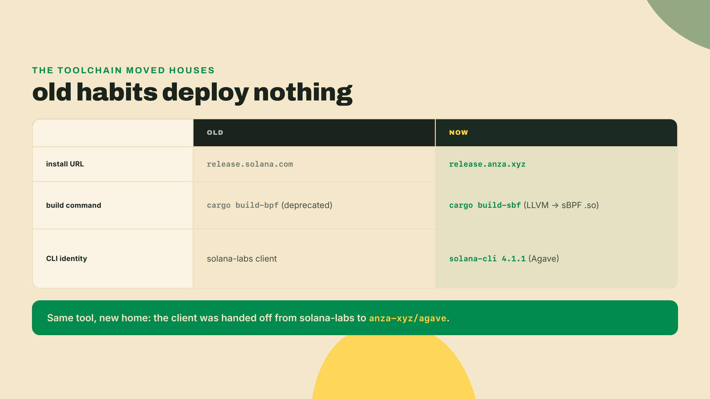
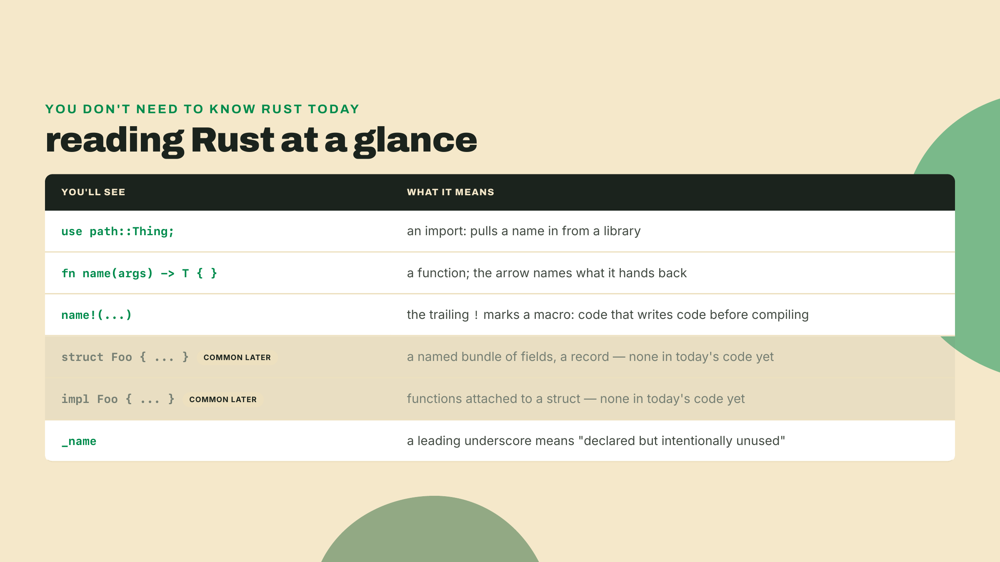
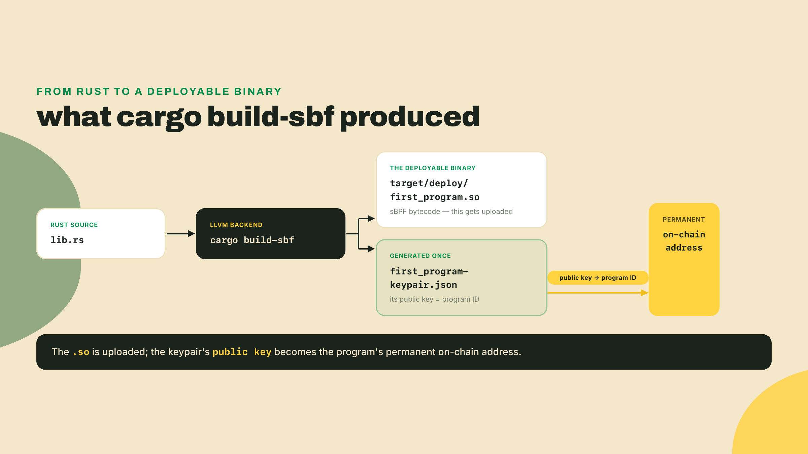
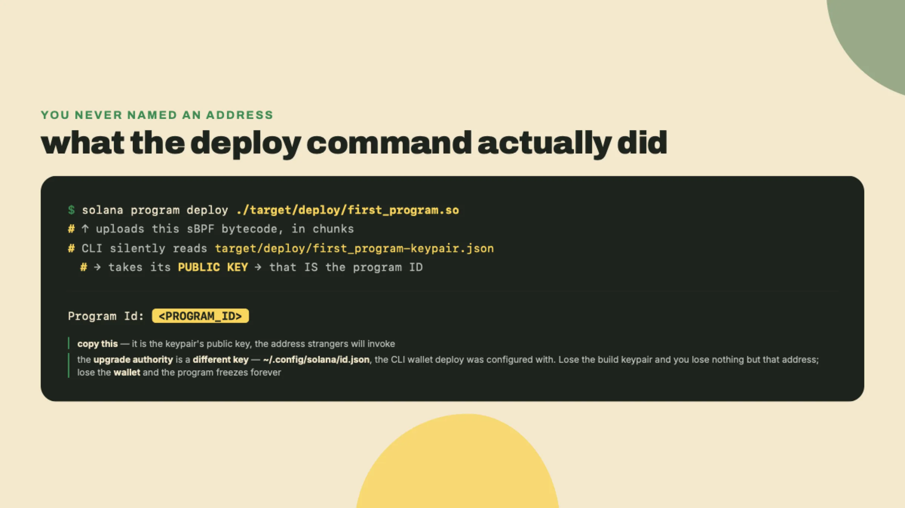
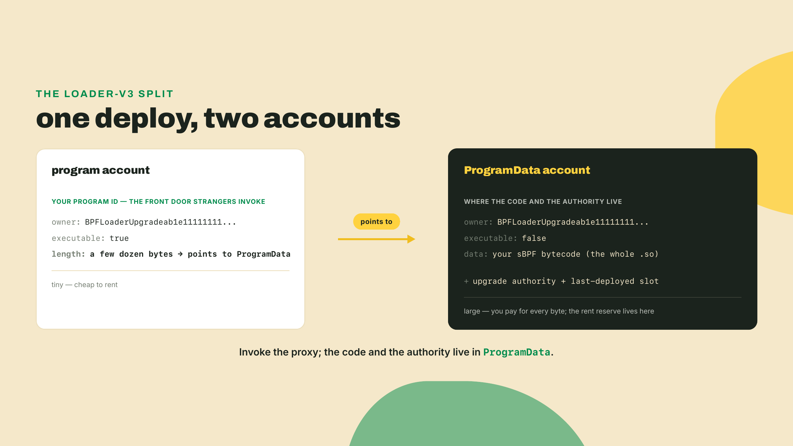
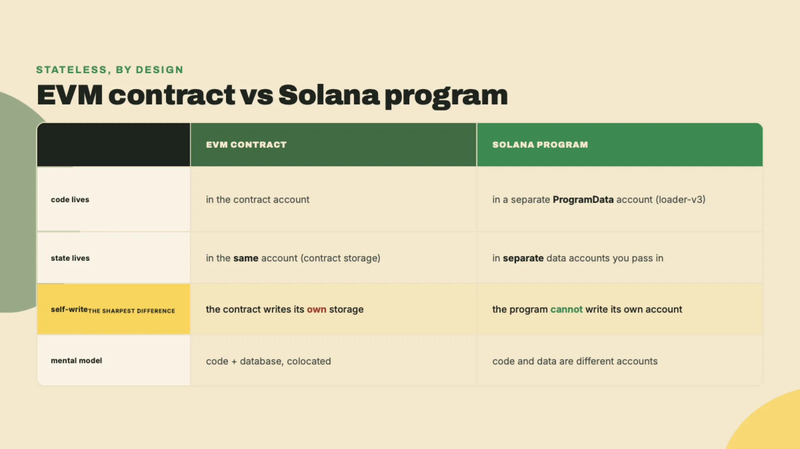
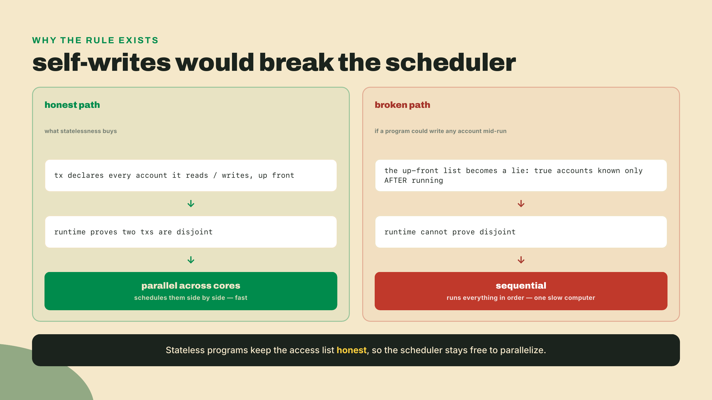
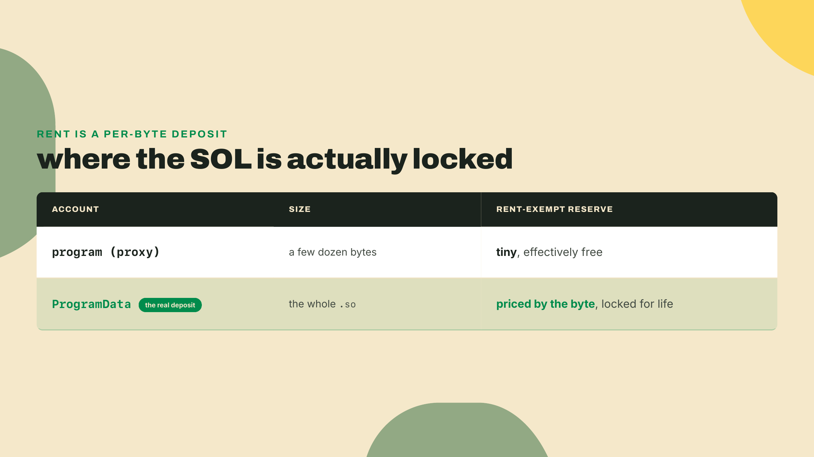
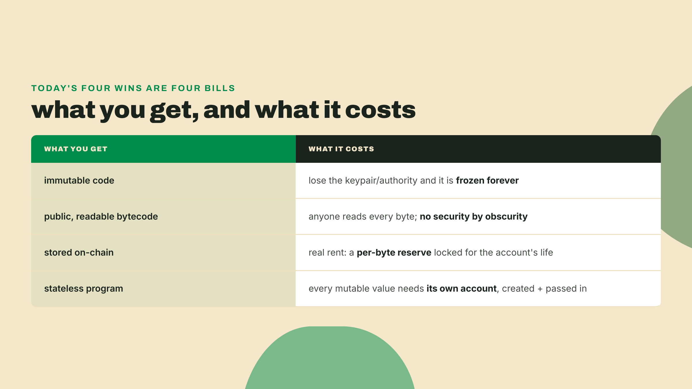
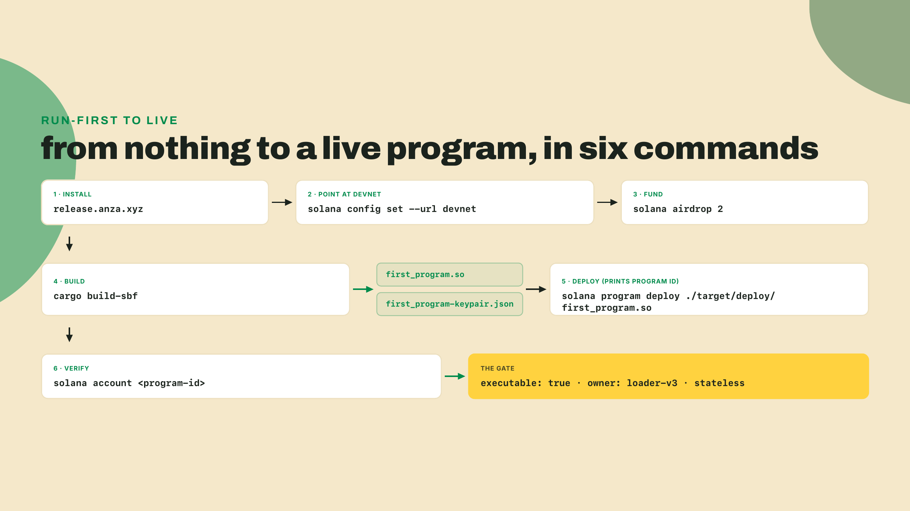

# Push code you can never edit: your first program on devnet

Last lesson you watched a market clear with no marketmaker: an automated market maker running as live code on-chain, matching trades with no human on the other side of any of them. But that was always someone else's program. You drove it. You never shipped it. Today you put your own bytes up there.

You have deployed to Heroku, to Vercel, to a Lambda. On every one of them your code and its database sit side by side, and you can reach in and change either whenever you like: hotfix the handler, patch a row, roll back last night's migration at 2am. That reach is the ergonomic your whole career is built on. In the next fifteen minutes you will push code to a public network where you can never edit it, it can never write to itself, and any stranger on Earth can read every byte of it. And you will prove all three from your own terminal.

No theory first. Install the toolchain and check the version:

```bash
sh -c "$(curl -sSfL https://release.anza.xyz/stable/install)"
solana --version
```

```
solana-cli 4.1.1
```

That is v4.1.1, the current stable release as this lesson was written; versions move fast, so verify yours against the current Agave docs before you lean on any specific behavior. If your terminal printed a version, you have the whole kit: the `solana` client, the keypair tooling, and the `cargo build-sbf` compiler you'll reach for in a minute.

One trap before anything else, because it's the single most common way a good tutorial wastes your afternoon. If you copied that install line from an older gist, you probably typed `release.solana.com`. That domain is dead for this. The client was handed off from the original `solana-labs/solana` repository to Anza's `agave` repo, and the installer moved with it: the live domain is `release.anza.xyz`. That handoff is exactly why the banner says `solana-cli` under the hood of Agave and not something older. When a command in this lesson resembles one you've seen before but the URL differs, trust the URL here.



## Point at devnet and get funded

With the client installed, aim it somewhere. By default the CLI talks to a local cluster that isn't running, so point it at devnet:

```bash
solana config set --url devnet
solana config get
```

```
Config File: ~/.config/solana/cli/config.yml
RPC URL: https://api.devnet.solana.com
WebSocket URL: wss://api.devnet.solana.com/
Keypair Path: ~/.config/solana/id.json
```

devnet is Solana's public test network: a real, running cluster where the SOL carries no market value and exists so you can break things in the open. It sits alongside a couple of siblings you will meet as you go: a local validator you can spin up on your own machine for instant, private iteration, and mainnet-beta, the one real network where SOL has value and every mistake is permanent. devnet is the middle ground, a shared public cluster that behaves like mainnet in every mechanical way while handing out worthless tokens, which is exactly what you want while you are still learning to aim. That second command, `solana config get`, is the confirmation step, and it is not optional ceremony. Deploying is the one moment where aiming at the wrong cluster costs real money, so confirm the RPC URL says devnet every single time before you ship anything.

Now get funded, because deploying is not free. Grant yourself some test SOL with an airdrop (a faucet handout of devnet tokens sent straight to your keypair):

```bash
solana airdrop 2
```

Two is the ceiling. The per-request cap on devnet is 2 SOL, so `solana airdrop 2` is the most you'll pull in a single call. The public RPC also rate-limits these hard, and when it's busy the command simply fails. When it does, don't hammer it in a loop: open the Solana Foundation's web faucet at https://faucet.solana.com, paste your address, and draw the SOL from there instead.

A deploy costs SOL even here, and that catches web2 engineers off guard, because pushing to a staging environment is usually free. Devnet mirrors mainnet's economics exactly, valueless tokens and all. The reason storage costs anything is worth holding onto: your bytecode does not live on one server you rent, it is replicated onto the disk of every validator in the cluster, and a network cannot let anyone consume that shared, permanent space for free without inviting abuse. So the chain charges for it. The mechanism is identical to production, and you will see exactly where those bytes come to rest in a few minutes.

## Build the program

Before the code, a thirty-second orientation, because this is the first place in the whole course where you author a real programming language instead of a shell command. You do not need to learn Rust to finish today. You need to recognize six shapes. Here they are at a glance, and then we move:



You have a funded identity on a live network and nothing to deploy. Fix that. The program itself is deliberately boring, because today's payoff is not the code: it's what the network does to the code. Here is a minimal native program, no framework, just the raw entrypoint:

```rust
use solana_program::{
    account_info::AccountInfo, entrypoint, entrypoint::ProgramResult,
    msg, pubkey::Pubkey,
};

entrypoint!(process_instruction);

fn process_instruction(
    _program_id: &Pubkey,
    _accounts: &[AccountInfo],
    _instruction_data: &[u8],
) -> ProgramResult {
    msg!("first program: alive on-chain");
    Ok(())
}
```

And the `Cargo.toml` beside it:

```toml
[package]
name = "first_program"
version = "0.1.0"
edition = "2021"

[lib]
crate-type = ["cdylib", "lib"]

[dependencies]
solana-program = "4.0.0"
```

One dependency, pinned to solana-program 4.0.0. Pin it, but verify the current version at crates.io before you build: the crate tracks the Agave release train and moves fast. And because APIs move across majors, check the docs if a symbol in that `use` line has shifted since. The `entrypoint!` macro wires `process_instruction` to be the function the runtime calls. The whole program does one thing: log a line and return `Ok`. It reads no accounts, stores nothing, decides nothing. That emptiness is the point. I want the smallest thing that can still be a real, live program, so that when we inspect it later there is nowhere for state to hide.

Compile it to a deployable binary:

```bash
cargo build-sbf
```

Mind the command: it is `cargo build-sbf`, not `cargo build-bpf`. The older `cargo build-bpf` is deprecated. `cargo build-sbf` runs your Rust through LLVM and down to sBPF (Solana's fork of the BPF bytecode format, the instruction set the on-chain virtual machine actually executes), and the `.so` file it emits is the deployable binary. That fork exists so the chain can run untrusted code from any stranger inside a tightly metered sandbox, counting every instruction as it goes so no program can hang a validator or run forever on someone else's hardware. When it finishes, look in `target/deploy/`:

```bash
ls target/deploy/
```

```
first_program.so first_program-keypair.json
```

Two files, and the second one matters more than it looks. `target/deploy/first_program.so` is the compiled bytecode, the thing you'll upload. `target/deploy/first_program-keypair.json` is a fresh keypair the build generated for you on this first `cargo build-sbf`, and its public key is about to become your program's permanent address on-chain. Guard it. We'll come back to exactly how much it matters.



## Deploy

This is the moment. One command uploads the bytecode to devnet and registers it (in general, `solana program deploy ./target/deploy/<name>.so`):

```bash
solana program deploy ./target/deploy/first_program.so
```

```
Program Id: <PROGRAM_ID> # base58, unique to your keypair, copy it
```

The CLI never asked which address to use. It didn't need to: it read `target/deploy/first_program-keypair.json`, took its public key, and used that as the program's address. Then it did something less obvious. A single Solana transaction is capped at a small size, far smaller than any compiled program, so the CLI could not upload the `.so` in one shot. Instead it opened a temporary on-chain buffer account, streamed the bytecode into it across many transactions, and only once the whole binary had landed did it finalize that buffer into your program's storage and print the ID. That is why deploying a real program takes a moment and a fistful of transactions rather than a single call. Copy that string. It's the artifact this whole lesson exists to produce, and later modules of this course point a bot straight at it.

Here's my confession, and it's the reason I keep saying guard that keypair. The first devnet program I ever shipped, I ran `git clean` on the repo a week later to reclaim disk, and `target/` went with it, `first_program-keypair.json` included. The program is still up there. I can read every byte of it. I can never change it, never upgrade it, never reclaim its rent, because the key that authorized all of those is gone. The CLI doesn't warn you about that. It's just Tuesday. The keypair is the program ID and the upgrade authority at the same time, and losing the file loses both.



## Invoke it: hand over an account list

Live is a claim until you make it run. A deployed program sits inert; something has to send it a transaction before a single line of it executes. There's no `solana` subcommand for calling your own program, so you write the smallest client that can: a short TypeScript file that builds one instruction and fires it at your program ID. You don't need to follow every line. Copy it, paste in your ID, and run it:

```typescript
// invoke.ts: hand your live program an account list and watch it run
import {
  createSolanaRpc, createSolanaRpcSubscriptions, sendAndConfirmTransactionFactory,
  createKeyPairSignerFromBytes, address, AccountRole, pipe, createTransactionMessage,
  setTransactionMessageFeePayerSigner, setTransactionMessageLifetimeUsingBlockhash,
  appendTransactionMessageInstruction, signTransactionMessageWithSigners,
  assertIsTransactionWithBlockhashLifetime,
} from "@solana/kit";
import { readFileSync } from "node:fs";

const rpc = createSolanaRpc("https://api.devnet.solana.com");
const rpcSubscriptions = createSolanaRpcSubscriptions("wss://api.devnet.solana.com");
const sendAndConfirm = sendAndConfirmTransactionFactory({ rpc, rpcSubscriptions });

// your default CLI keypair, the one the airdrop funded
const secret = new Uint8Array(JSON.parse(readFileSync(`${process.env.HOME}/.config/solana/id.json`, "utf8")));
const payer = await createKeyPairSignerFromBytes(secret);

const programAddress = address("<PROGRAM_ID>"); // paste the ID your deploy printed

const instruction = {
  programAddress,
  accounts: [{ address: payer.address, role: AccountRole.READONLY_SIGNER }], // the account list you hand over
  data: new Uint8Array([]), // no instruction data today
};

const { value: latestBlockhash } = await rpc.getLatestBlockhash().send();
const message = pipe(
  createTransactionMessage({ version: 0 }),
  (tx) => setTransactionMessageFeePayerSigner(payer, tx),
  (tx) => setTransactionMessageLifetimeUsingBlockhash(latestBlockhash, tx),
  (tx) => appendTransactionMessageInstruction(instruction, tx),
);
const signed = await signTransactionMessageWithSigners(message);
assertIsTransactionWithBlockhashLifetime(signed);
const signature = await sendAndConfirm(signed, { commitment: "confirmed" });
console.log("invoked:", signature);
```

Two fields in that instruction carry the whole point. `programAddress` is the ID your deploy printed, the front door you're knocking on. `accounts` is the account list: the set of accounts you hand the program at call time, each flagged with a role (signer, writable, or both). Today you hand over exactly one, your own wallet, and the program ignores it. That's fine, the mechanism is the lesson, not the payload.

Run it, then ask the network what it saw:

```bash
npx tsx invoke.ts
```

```
invoked: <SIGNATURE>
```

```bash
solana confirm -v <SIGNATURE>
```

```
Transaction executed in slot <SLOT>:

  Signature: <SIGNATURE>
  Result: Ok
  Account 0: <YOUR_WALLET_ADDRESS>   # the account you handed over
  Account 1: <PROGRAM_ID>            # your program, being invoked
  Log Messages:
    Program <PROGRAM_ID> invoke [1]
    Program log: first program: alive on-chain
    Program <PROGRAM_ID> success
```

Read that top to bottom. The account list you handed over is sitting right there, your wallet, declared in the transaction before the program ran. Below it, the program's own words: `Program log: first program: alive on-chain`, your `msg!` firing on devnet, on hardware you'll never own, because a transaction you signed told it to. The program read none of those accounts, it never does, but the transaction still carried the list across and named it up front. Keep that image. Handing a program an account list at call time is the exact machinery the next lesson turns into stored state. Today the list is an empty courtesy. Next lesson it's where every balance lives.

## Now name what happened

This is where the web2 model you walked in with starts coming apart. First, prove the ID really is the keypair's public key:

```bash
solana address -k target/deploy/first_program-keypair.json
```

That prints the same string the deploy did. The address isn't assigned by the network or bought from a registry. It's just the public half of a keypair sitting in a file on your disk, which is why you could know your program's address before you ever went online. Now inspect the account living at that address, which is also the verify command for this lesson (the pattern is `solana account $(solana address -k target/deploy/<name>-keypair.json)`):

```bash
solana account $(solana address -k target/deploy/first_program-keypair.json)
```

```
Public Key: <PROGRAM_ID>
Balance: <rent> SOL
Owner: BPFLoaderUpgradeab1e11111111111111111111111
Executable: true
Length: <a few dozen> bytes
```

Read the three lines that matter. `Executable: true`: the network has flagged this account as code it will run, not data it stores. `Owner: BPFLoaderUpgradeab1e11111111111111111111111`: your account isn't owned by you, it's owned by the BPF Upgradeable Loader, loader-v3, the built-in program that owns, runs, and can upgrade deployed programs. And `Length: <a few dozen> bytes`. A few dozen.

Sit on that size, because it's the reveal. You uploaded a compiled binary, kilobytes of sBPF. This account holds a few dozen bytes. So where's the code? One account over.

Under loader-v3, a single `deploy` creates two accounts, not one. The account at your program ID is a thin proxy: those few dozen bytes are essentially a pointer that says "the real code lives over there." The bytecode itself, the entire `.so` you built, sits in a separate ProgramData account (the loader-owned account that actually stores your sBPF along with your upgrade authority and the slot it was last deployed at). Your program ID is the front door everyone knocks on; the ProgramData account is the room the furniture is in.

That split is doing real work, and it is worth understanding why the loader bothers to keep two accounts instead of one. Separating identity from implementation is the whole trick behind upgrades. Callers, other programs, and later modules of this course all reference you by program ID, and that ID must never change. When you redeploy, the loader does not mint a new address; it overwrites the bytecode inside the ProgramData account and bumps the last-deployed slot, leaving the proxy untouched. Every caller that hard-coded your program ID still lands on the same front door and now finds new furniture behind it. Collapse the two accounts into one, the way a non-upgradeable deploy does, and the address and the code become the same object: change the code and you necessarily change the address, breaking everyone pointing at you. The proxy exists precisely so the code can move while the name stays put. At execution time the runtime takes the program ID you invoke, follows the pointer to the ProgramData account, loads the sBPF from there, and runs it. The indirection you are staring at in that tiny account size is the same indirection that fires on every single call.

One thing to file away for when you read newer proposals: SIMD-0162 proposes removing the `executable` flag entirely, on the logic that being owned by a loader is the real signal that an account is code. It hasn't shipped. As of Agave 4.x the flag is still set, and `solana account <program-id>` still shows you `Executable: true`. When it does land, ownership by the loader stays the thing that actually makes a program a program.



## Three things you can now prove

Count what that one `solana account` call certifies, because the three promises from the top are all sitting in that output.

You can never edit it. The bytecode is fixed at the address. Changing it at all requires the upgrade authority to authorize a fresh deploy, and even that writes a new version rather than letting you reach in and mutate a byte. Lose the authority and "never" becomes literal.

It can't write to itself. Here the account model underneath Solana starts to show through, and it's worth stating as a general rule, because the next lesson is built on it: every account on Solana has an owner, and that owner is always a program, and only the owning program is allowed to change the account's data or move its lamports. Your program account is owned by the loader, not by your program. So your program is not merely discouraged from writing there, it is structurally incapable of it, because the runtime rejects any attempt by a program to mutate an account it does not own. This is the sentence that breaks the web2 reflex, so say it plainly: programs are stateless. The program account stores only bytecode. It cannot hold your app's data, because it cannot write to itself at all.

Any stranger can read every byte. The ProgramData account is public, like every account on a public chain. Anyone with your program ID pulls the bytecode down and disassembles it. There is no private code path on-chain, and no security that leans on nobody looking.

This is exactly where the mental model from Heroku and friends has to go. Steelman the EVM version first, because it's genuinely convenient: an EVM contract account holds its code and its storage together, the contract writes to its own storage every time it updates a balance, and code plus data live in one place you think of as "the contract." That colocation is why so much web2 intuition ports cleanly to Ethereum. Solana splits them on purpose, and pays for it in exactly that convenience.



The naive fix a web2 engineer reaches for is to let the program own its own account and write to it directly, EVM-style, the way a service owns its database and updates rows whenever it likes. Solana forbids precisely that, and the reason traces straight back to the parallelism the last course module foreshadowed. Start from what makes Solana fast: it does not process transactions one at a time down a single line. It runs many of them at once, spread across cores, whenever they do not touch the same state. To pull that off, the runtime needs one thing before it executes anything: a complete, up-front list of every account each transaction will read and write. Given those lists, it can prove that two transactions are disjoint and schedule them side by side, with no risk of one clobbering what the other is mid-way through changing.

Now watch what a self-writing program would do to that guarantee. If a program could reach in and mutate its own account, or any account it felt like, in the middle of running, the up-front list would be a lie: the true set of accounts touched would only be knowable after the code had already run, which is exactly too late to schedule around. The runtime could no longer prove two transactions are disjoint, so it would have to fall back to running everything in sequence, and the entire performance story collapses into one slow computer everybody shares. Statelessness is the price of not living there. By making programs unable to write themselves, and forcing every writable account to be named in the transaction before it executes, Solana keeps those access lists honest and the scheduler free to parallelize.

That state still has to live somewhere, and it goes into other accounts. Each piece of mutable data gets its own account, owned by your program so your program is permitted to write it, created explicitly and passed into each instruction by whoever calls it. Your code is one account. Every balance, every record, every counter it manages is a different account, handed to it at call time and declared in the transaction that touches it. You proved the half that forces the other half.



## The trade-off

Every design in this course gets its cost named out loud, and this one's bill has four lines, each the flip side of something you were just told to celebrate.

Immutability and public readability are the entire point and the entire price. You wanted code a stranger can trust without trusting you. The cost is code you can't quietly fix and can't hide: no `UPDATE` in production, no obscuring a flaw, the bytecode right there for anyone, including anyone hunting for a bug. The same transparency that lets an integrator verify exactly what your program does before they route real money through it also lets an attacker study your defenses at their leisure. No security posture on-chain can rest on the code being secret, because it never is.

That devnet SOL was real rent, not a gas fee you pay once and forget. It looks like play money because it's valueless, but the mechanism is mainnet's exactly. Every validator in the cluster keeps a full copy of your account on its own disk, so persistent on-chain storage is one of the network's scarcest shared resources, and the chain prices it explicitly, by the byte. Rather than dripping a fee out of the account every block, Solana has you deposit enough SOL up front to make the account rent-exempt, an amount that scales directly with the account's size and then sits locked inside it for as long as the account exists. A bigger program is a bigger account and a bigger locked deposit. The split you just uncovered decides where that cost lands: the proxy program account is tiny and nearly free, while the ProgramData account carrying the whole `.so` is where the real reserve is tied up. Close a program you still control and its authority can reclaim that SOL; lose the authority and the deposit is stranded on-chain forever, paying to keep alive a program nobody can ever touch again.



The upgrade path hangs on a single file. `target/deploy/first_program-keypair.json` is the program ID and, under loader-v3, the upgrade authority. (In a real deployment you'd usually transfer that authority to a separate, well-guarded key or a multisig, so a leaked build keypair can't touch the program.) Lose the authorizing key and the program is frozen exactly as it stands, forever. That is the immutability you asked for, finally showing its teeth.

And "stateless" is the ergonomic tax. The convenience you took for granted your whole career, a service that just writes to its own database, is gone. A counter needs its own account, created up front and passed in on every call. Every mutable value becomes one more account to allocate, fund to rent-exemption, track, and pass in at the right position, and a whole class of bug that barely exists in web2 (forgetting to pass an account, or passing the wrong one) shows up to take its place. What you buy with that overhead is the parallelism from a moment ago, plus state that is isolated, independently verifiable, and impossible for one program to silently corrupt inside another's storage. The tax is real; so is what it purchases.



## Build: `first-solana-program`

What you made today is the first on-chain rung of the toolkit this course assembles. Call it `first-solana-program`: a minimal native program compiled to `target/deploy/first_program.so`, deployed live to devnet, plus its recorded program ID and the keypair at `target/deploy/first_program-keypair.json`. It does nothing useful yet, and that's fine. It's a rung, not a summit. Later modules point a cross-chain ops bot at this exact program ID, invoke it, and read the accounts around it, so the ID you copied is a real coordinate you'll use again, never a throwaway.

Here's the whole path you just walked, start to live, so you can run it from memory:



The one command that certifies the whole thing:

```bash
solana account $(solana address -k target/deploy/first_program-keypair.json)
```

If that returns `executable: true` and `owner: BPFLoaderUpgradeab1e11111111111111111111111`, your program is live on devnet and owned by loader-v3. That's the gate. Not "the code compiled," not "the deploy didn't error." The network is reporting, from its own state, that your bytecode is up there and runnable.

## Do it yourself

You've watched the full deploy command-by-command. Now run it end to end on your own machine and produce the artifact.

Completion. The `.so` is built. Fill in the two steps this walkthrough handed you and finish the deploy yourself: point the CLI at devnet with `solana config set --url devnet`, fund your keypair with `solana airdrop 2` (reach for https://faucet.solana.com if the public RPC rate-limits you), then run `solana program deploy ./target/deploy/first_program.so`. Paste your program ID back as proof it's live. That ID is your submission.

Solo. Now reason about what you deployed. Run `solana account <program-id>` and look at the size of the account. Note how small it is. Then write two sentences: where the actual sBPF bytecode lives, and why the program cannot store your app's data. A strong answer names the separate ProgramData account for the first, and "the program account is owned by the loader, not by the program, so the program can't write to it" for the second.

Accept when `solana account <program-id>` returns `executable: true` owned by `BPFLoaderUpgradeab1e11111111111111111111111`, and you can point to the ProgramData account as the home of the bytecode and say, without notes, that programs are stateless.

Checkpoint before you move on, from memory, out loud, one sentence: why can't the program account hold your app's data, and where must that data live instead? If your sentence lands near "because the program account is owned by the loader and stores only bytecode, so state lives in separate accounts the program owns and gets passed at call time," you have it.

You just proved your program can't store a thing: it's frozen bytecode that can't even write to itself. So where does every balance, every counter, every user record on Solana actually live? Next lesson you go find it: accounts, and the rent you pay to keep them alive.
