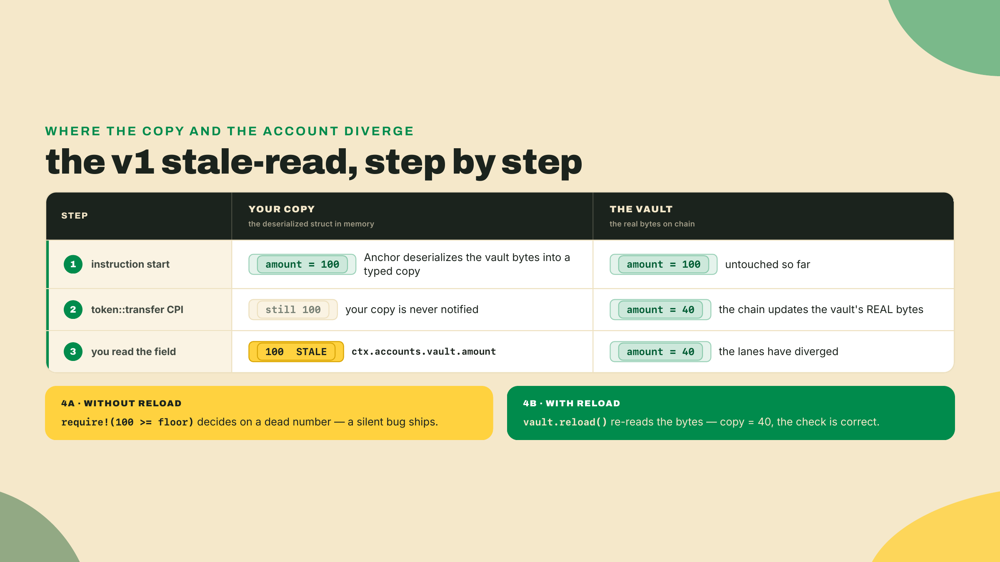
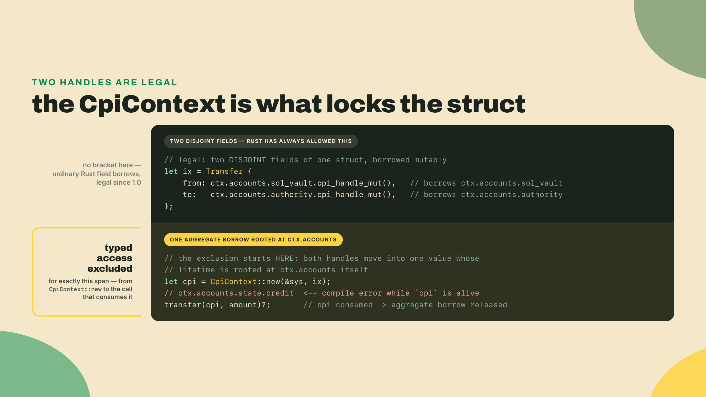
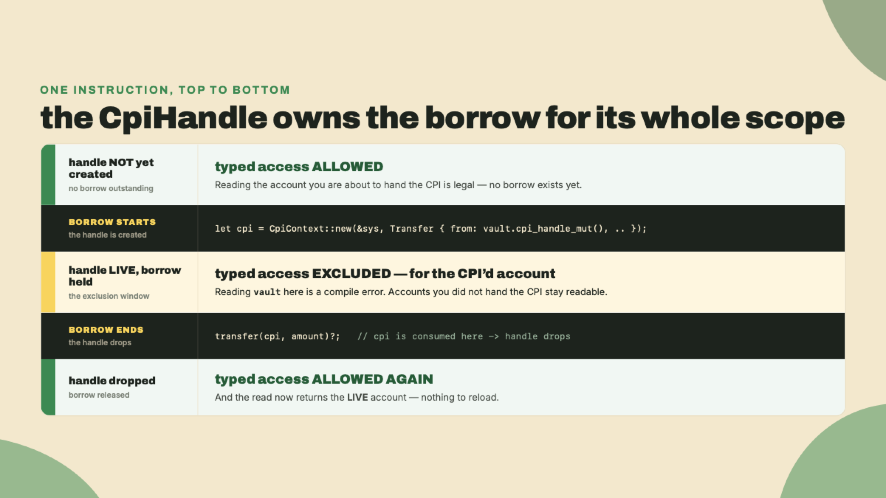
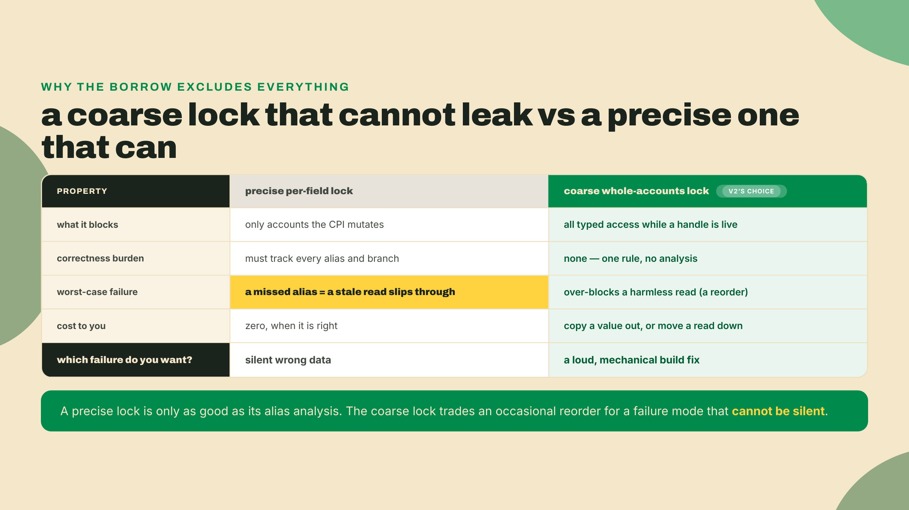
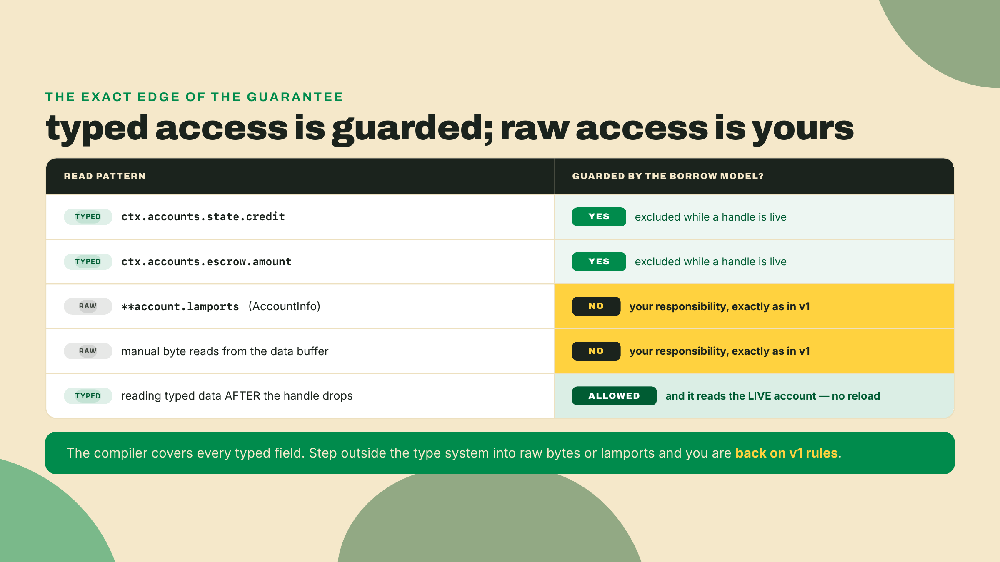
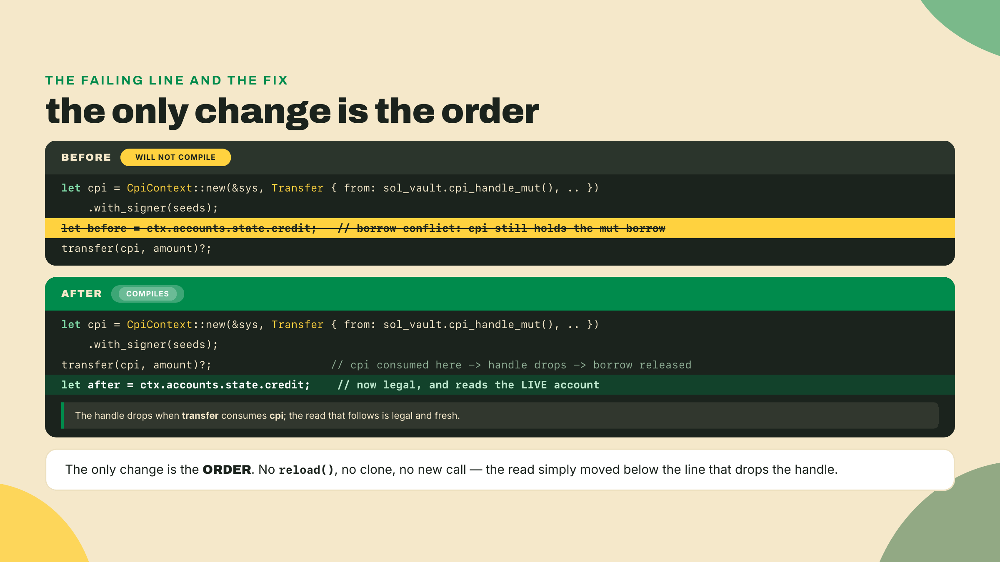
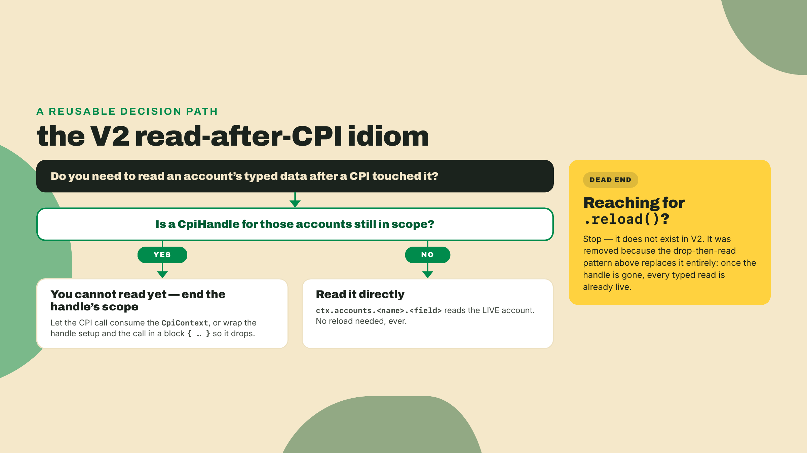

# The reload footgun is gone

Last lesson the vault learned to pay out. You reconstructed its signer seeds from the seeds plus the stored canonical bump, called `invoke_signed` through `CpiContext::new(...).with_signer(...)`, and moved real lamports out of a keyless PDA under program authority. The vault signs for itself now. Lamports leave it on the program's say-so, not a human's keypair.

There is a bug that lives exactly one line past that withdrawal, and in the older Anchor line it shipped constantly. The shape is this: you do a CPI, then you read the account you just changed, and you act on the old value. It compiled. It ran. It passed the happy-path test. And then in production it made a decision on a number that was already wrong. Everyone who wrote Anchor for a living hit this at least once. In V2 the same code refuses to build.

So let us break it on purpose. Open the R2 program from last lesson and find the `withdraw` handler. Right after you construct the `cpi` value, before `transfer` consumes it, drop in one line:

```rust
let before = ctx.accounts.state.credit;
```

Now run `anchor build`. It will not compile, and the error it throws is the entire point of this lesson. Read the next section before you try to fix it, because the fix is trivial and the reason is not.

## Summary

One concept, and it is a why, not a how: reading an account's typed data while a `CpiHandle` is live is a compile error in Anchor V2, and that single rule retires v1's `.reload()`-after-CPI footgun for good. Not softened. Not linted. Made unwritable.

We are going to reconstruct why the framework's authors chose to enforce this with the borrow checker instead of a warning, walk the naive alternatives and watch each one fail, and pin down the exact edge of the guarantee, because a safety promise you misjudge is worse than none. The v1 hazard was silent and it ran; the V2 replacement is loud and it stops the build. Moving a failure from runtime-and-quiet to compile-time-and-obvious is the whole thesis of V2, and this is that thesis applied to the moment one program calls another.

The gate you are working toward is small and sharp. Given a snippet that reads typed account data during a live `CpiHandle` and refuses to compile, you reorder the read to after the handle drops so the program builds and the borrow test passes, and you name the bug class V2 eliminated in one sentence. That is it.

The autonomy fades the usual way. In the Lab I show you the failing shape and the fix in full, because I want the borrow-checker error in your eyes and the reorder in your fingers. In the Challenge you get a different broken snippet with no scaffolding, and you fix it and name the class yourself. Read, break, fix, name.

## Why the compiler now has your back

### The v1 footgun, precisely

Start with how this worked before, because you cannot appreciate the fix until you have felt the wound. In the 1.0 line, `CpiContext::new` took the program as a plain by-value `Pubkey` (and in the 0.x line before it, an `AccountInfo`), and the accounts you handed it were ordinary deserialized structs. Anchor read the account's bytes off the chain once, at the top of your instruction, and handed you a typed copy to work with.

That copy is the problem. When you fire a CPI that mutates an account, the change lands in the account's real bytes on-chain. Your deserialized copy, the struct sitting in your instruction's memory, does not move. It still holds whatever it held when Anchor first read it. So the classic sequence looked innocent and lied:

```rust
// Anchor v1. This compiles, runs, and is wrong.
token::transfer(cpi_ctx, amount)?;              // the vault's on-chain amount drops
let remaining = ctx.accounts.vault.amount;      // reads the STALE pre-transfer copy
require!(remaining >= floor, VaultError::TooLow); // decides on a number that is already false
```

The vault's real balance went down. Your `remaining` did not. You then gated a payout, or a mint, or a liquidation on a value the chain had already invalidated. The fix v1 offered was a method you had to remember to call: `.reload()`, which re-read the account's bytes and refreshed your copy.

```rust
token::transfer(cpi_ctx, amount)?;
ctx.accounts.vault.reload()?;                   // re-read the live bytes; NOW the copy is fresh
let remaining = ctx.accounts.vault.amount;
```

One line. Cheap. And catastrophic to omit, because omitting it produced no error, no warning, no panic. Just a program that quietly read the past.



Sit with why this was so dangerous. It was not that the fix was hard. It was that the failure was invisible. A missing `checked_sub` panics and you see it in the logs. A missing `.reload()` succeeds, and the only witness is a value that is subtly wrong on a code path a test rarely exercises. Silent-and-wrong is strictly worse than loud-and-broken, because loud gets fixed on Tuesday and silent gets fixed after an incident.

Before we pile on v1, though, grant it the honest defense, because the design was not stupid, it was a reasonable trade that aged badly. Deserializing an account once, at the top of the instruction, and reusing that copy is genuinely faster than re-reading the bytes every time you touch a field. For an instruction that never fires a CPI, and plenty do not, the copy is always correct and always cheap. v1 optimized for the common case and left a sharp edge on the uncommon one. That is a defensible call right up until the uncommon case is "moving money," at which point the edge is exactly where you cannot afford it.

And notice the shape of the failure, because it is worse than "sometimes wrong." Separate the average case from the worst case, the way you should with any hazard. In the average case, the account you read after a CPI was not actually changed by that CPI, so the stale copy happens to equal the live value and your code is accidentally correct. That is the trap: the bug tests clean, demos clean, and sits dormant for months. The worst case is the one specific path where the CPI did move the number you then read, and that path tends to be the high-stakes one, a payout sized against a balance, a mint gated on a supply. A mechanism that is right on the boring paths and wrong on the one path that matters is not a mechanism you want guarding a vault. It is a landmine with good odds.

### The question that forces the design

So here is the question the V2 authors actually had to answer. How do you make the stale post-CPI read not merely discouraged, not documented, but *impossible to write*? Not "the docs tell you to call `.reload()`." Impossible. The programmer should not be able to express the bug even if they want to.

That is a higher bar than it sounds, and the obvious ways to clear it all fail. Watch them fail, because ruling them out is what makes the real answer feel inevitable instead of arbitrary.


### The naive fixes, ruled out in tiers

The first naive fix is the one v1 already tried: write it in the docs. "Remember to call `.reload()` after a CPI that mutates an account you read." This fails on contact with human memory. It is not a mechanism, it is a hope, and it is precisely the hope that failed for a decade. A rule enforced by remembering is a rule that is broken the week you are tired.

The second naive fix is a lint. Ship a clippy rule that flags a read after a CPI. Better, because a machine checks it. But a lint is advisory by construction. You can `#[allow]` it, you can not run clippy in CI, and worse, a lint that tries to track "is this account the one the CPI mutated, through this alias, across this helper function" is exactly the kind of whole-program dataflow that lints are bad at. It will miss the interesting cases and cry wolf on the boring ones. A guarantee you can silence is not a guarantee.

The third naive fix is the tempting one: make the framework refresh the account for you. After every CPI, silently re-deserialize every account you hold, so your copy is never stale. Correct, and it never forgets. But now measure the cost against the realistic baseline, because "compared to what" is the only honest way to judge it. Eager deserialization of `Account<T>` was already the framework's single largest compute expense. The V2 manifesto that kicked off this whole redesign, issue #4390, "Zero-copy account deserialization by default," named exactly that: `Account<T>` was the slow path, and the number-one performance complaint from Anchor developers. Auto-refreshing on every CPI would take the most expensive thing the old framework did and do it *more often*, on every account, on every call, whether or not you ever read the thing again. You would buy safety with the exact tax V2 was built to abolish. And it still would not cover raw byte reads, so it is not even complete.

So the naive tier collapses, and the requirement sharpens into something narrower and stranger. We do not want to refresh the data, and we do not want to warn about the read. We want to make it so that you cannot *hold* the read and the live CPI at the same time. If those two things are mutually exclusive, the stale-read line simply cannot be typed. That is not a runtime check and it is not a lint. That is the borrow checker.

### The mechanism: a CpiHandle is a borrow

Here is the load-bearing idea, defined precisely. In V2 you no longer hand a CPI an `AccountInfo` clone. You hand it a `CpiHandle`, which you get with `.cpi_handle()` or `.cpi_handle_mut()`. And a `CpiHandle` is not a copy of anything. It is a live Rust borrow of the account, held for as long as the handle is in scope.

That one design choice does all the work. While a `CpiHandle` is alive, the account it points at is borrowed, so the borrow checker will not let you form a second, conflicting borrow to read typed data. The read and the handle cannot coexist.



Be exact about *what* is borrowed, because the code you are about to write takes two handles at once and that looks like it should be illegal. `cpi_handle_mut()` borrows a single field: `ctx.accounts.sol_vault` and `ctx.accounts.authority` are disjoint paths, and Rust has always allowed two mutable borrows of two different fields of one struct. So the pair inside the `Transfer { from, to }` literal is fine. The exclusion arrives one step later. Both handles get moved into a `CpiContext`, a single value whose lifetime is tied to the accounts struct they came from, and from the moment that value exists until the moment the CPI consumes it, the compiler is holding a live borrow rooted at `ctx.accounts` itself. That is what the error message you will see in the Lab names, and it is why the block is coarse: not two fields fighting, but one aggregate borrow standing over the whole struct. Call it borrow-checker exclusion: the handle's lifetime *excludes* typed data access for its duration.

If it helps, think of the handle as checking a file out of a library. While the book is checked out to the CPI, nobody else can read from that shelf, and the moment it comes back, the shelf is open again and whatever you pull is the current edition, not a photocopy you made last week. The analogy carries the important part, that the checkout is exclusive and time-bounded, and it breaks in one place worth flagging: a library book is one physical object, while the borrow here is enforced entirely at compile time, before a single instruction runs. Nothing is locked at runtime. The compiler simply refuses to emit a program in which the two overlap, so the "conflict" is never a race, it is a build failure. Keep the exclusivity from the analogy and drop the physicality.



Now look back at last lesson with new eyes. Remember the very first thing the withdraw handler did? It copied values *out* of `ctx.accounts` before building any handle:

```rust
let owner = ctx.accounts.authority.address();   // copied out FIRST
let sol_bump = ctx.accounts.state.sol_bump;     // copied out FIRST
```

I told you then only that the ordering was load-bearing rather than stylistic, and promised the reason this lesson. This is that reason. You had to grab the owner's address and the stored `sol_bump` before the handles went live, because once a handle exists, `ctx.accounts` is off limits. Last lesson you obeyed the rule. This lesson you learn why it exists.

And notice what this buys you at the far end. In v1 you read after the CPI and got a stale copy unless you called `.reload()`. In V2 there is no `.reload()`, because there is nothing to reload.

That claim rests on module 2, so join the two facts rather than taking it on faith. v1's stale read existed because `Account<T>` deserialized a *copy* at the top of the instruction: your handler held an owned struct on the stack, and a CPI mutating the on-chain bytes had no way to reach it. V2's `Account<T>` is a zero-copy view over the account's live buffer, so `ctx.accounts.state.credit` is not a field of a copy, it is an offset read into the bytes the CPI just wrote. There is no second copy anywhere to go stale. That is why `.reload()` could be deleted rather than replaced: the borrow model does not refresh your data, it gates *when* you are allowed to read, and the zero-copy account model is what makes the read you are then allowed to do already fresh. Two halves of the same thesis, and this is where they meet.

### Why the lock is coarse, and why that is the right call

A sharp reader raises an objection here, and it is a good one, so let us answer it instead of dodging it. The stale-read hazard only involves the *specific* account the CPI mutates. So why does the borrow lock out reads of *every* account in `ctx.accounts` for the handle's lifetime, including accounts the CPI never touches? When the SOL vault's handle is live, you cannot read the entirely unrelated `state` account either, which is why last lesson made you copy `sol_bump` out first. That is stricter than the bug strictly requires. Is the framework just being clumsy?

No. It is choosing a coarse lock on purpose, and the reasoning is the same average-versus-worst-case discipline from a minute ago, pointed the other way. A precise, per-field lock, one that borrowed only the exact accounts handed to the CPI and left the rest readable, sounds nicer and is a trap. To be *correct*, that fine-grained tracking would have to follow every account through every alias, every helper, every branch, and prove which ones the CPI can reach. Get that analysis slightly wrong and you have a leak: a read the compiler waved through that was actually stale. The coarse rule cannot leak, because it does not try to be clever. If a handle is live, typed access is off, full stop. It over-blocks in the average case, where you get told to move a harmless read, and it never under-blocks in the worst case, where under-blocking is the whole disaster.



This is a recurring V2 instinct, so it is worth naming as a rule you can carry: prefer the guarantee that fails safe and loud over the one that fails leaky and silent, even when the safe one is coarser than strictly necessary. The cost of coarse is a refactor you can see. The cost of leaky is a bug you cannot.

### The exact edge of the guarantee

This is where a lazy explanation would tell you the compiler now handles account freshness and send you on your way. Do not believe that, because it is false in a way that will bite you. Knowing the precise edge of a safety guarantee is part of using it well, so let us draw the line exactly.

The compiler guards *typed account access*. That is it. If you go around the typed layer and read raw `AccountInfo` lamports directly, or pull bytes out of an account's data buffer by hand, the borrow model does not protect you. Those reads are yours to reason about, exactly as they were in v1. A teammate who tells you the borrow checker means you never think about freshness again is wrong on both counts: it does not refresh anything, and it does not cover raw reads.



And name the trade-off honestly, because there is one. The borrow model buys compile-time safety with a little flexibility. A handful of ergonomic v1 patterns, the ones that interleaved a read in the middle of setting up a CPI, now need restructuring: you drop the handle, then you read. The cost is a mechanical refactor, usually moving one line down a few lines. That is the whole bill. You trade "I can write the code in any order" for "the order I am allowed to write cannot be the wrong one." On a path that moves other people's money, that is a trade I take every single time. Cheap insurance against a silent bug is the best kind.

The doubt that usually follows is fair: what if I genuinely need a value mid-CPI, something I have to read while the call is being assembled? Nearly always, you do not, you only think you do out of v1 habit. If the value comes from an account, capture it *before* you build the handle, exactly as last lesson captured `owner` and `sol_bump` into locals at the top. Those locals outlive the borrow because they are plain copies, not references into `ctx.accounts`, so the handle cannot conflict with them. And if what you want is the account's state *after* the CPI, that is not a mid-CPI read at all, it is a post-CPI read, and it belongs below the line that drops the handle where it will be fresh anyway. The pattern that has no clean answer, reading an account's live typed data at the precise instant it is committed to a CPI, is the pattern that had no correct answer in v1 either. V2 just stops pretending it did.

### The thesis, and the framework holding itself to it

Zoom out for a second, because this is not one clever trick, it is a worldview. The #4390 manifesto argued that `Account<T>` being the slow path was not a performance footnote, it was the central flaw: the safe thing and the fast thing had drifted apart, so people paid a tax for safety and some of them stopped paying it. V2's answer was to make the safe path the fast path and the fast path the default. The borrow model is that same thesis carried one level up, into composition. Instead of making a safe post-CPI read cheap, it makes an unsafe one impossible. Same instinct, different lever: turn a whole class of bug into a compile error rather than a lint or a line in the docs.


That last beat is worth more than a footnote. A framework that hands you compile-time guarantees ought to earn them itself, and this one did the work. The V2 changelog credits fuzzing with finding four correctness bugs in the framework's own code, tracked in #4431, and the test suite ships Miri witnesses and Kani configs. Miri catches undefined behavior in unsafe code; Kani proves properties hold across all inputs, not just the ones a test author thought of. The framework subjects itself to the same "prove it, do not hope it" discipline it now imposes on your program. When a tool tells you to trust the type system, that is the receipt you want to see behind it.

One last widening, because the borrow model is a single instance of a pattern you will see all over V2, and spotting the pattern is worth more than memorizing this one rule. The through-line is a preference for moving failures earlier and louder. A stale read that used to surface at runtime, silently, on one path, in production, now surfaces at compile time, loudly, on every path, on your machine. That is the same move as replacing a runtime `require!` with a type that cannot hold an invalid state, or a hand-written check with a constraint the macro enforces. Each one takes a class of "you had to remember" and turns it into "you cannot forget." A test proves your code works on the inputs you tried; Kani-style proof and a borrow rule work on the inputs you did not. When you evaluate any framework guarantee from here on, that is the axis to grade it on: does it catch the bug when it is cheap to fix, or when it is expensive, and can you accidentally opt out.

## Lab: make the borrow checker stop you

You are going to reproduce the compile error, read what rustc actually says, and fix it by reordering. No new artifact today. The vault you built last lesson is the specimen. First, make sure you are on the right toolchain, because none of this holds on the V1 line.

**Step 1. Pin the V2 toolchain.** This course runs on the Anchor V2 release candidate, not the 1.1.2 V1 line that ships by default on many machines. As m01-l2 showed, `avm` cannot install the RC: attestation hangs off a GitHub Release object and the v2 tag has none, so avm refuses. The documented channel is a cargo git install off the `anchor-next` branch:

```bash
cargo install --git https://github.com/otter-sec/anchor.git \
  --branch anchor-next anchor-cli --locked --force
anchor --version   # must report the V2 line (2.0.0-rc.1 as of 2026-08-12), not 1.1.2
```

Freshness note: as of 2026-08-22 the V2 line ships as release candidates, so there is no blessed stable version number to hardcode. `2.0.0-rc.1` is the newest tag on `anchor-next` and the newest `anchor-lang`/`anchor-cli` on crates.io (published 2026-08-12); re-check both before you build, and pin whatever `anchor --version` reports in your `Anchor.toml` and CI so a teammate builds the same bytecode you did. When V2 tags a stable release, pin that instead.

**Step 2. Write the bug on purpose.** Open the `withdraw` handler from last lesson. Here is the shape you want, with the offending read placed where a v1 habit would put it, in the middle of the CPI setup while the handle is live:

```rust
pub fn withdraw(ctx: &mut Context<Withdraw>, amount: u64) -> Result<()> {
    // --- the guard block from last lesson stays EXACTLY as you wrote it ---
    // require!(amount > 0, ...), require!(amount <= vault_lamports, ...),
    // and the checked remainder against the rent-exempt floor. Those three
    // lines are the security boundary of this handler; nothing in this lesson
    // touches them, and deleting them to shorten the snippet is how a teaching
    // edit becomes a custody bug. Elided below only for length.

    let owner = ctx.accounts.authority.address();
    let sol_bump = ctx.accounts.state.sol_bump;
    let system_program = ctx.accounts.system_program.address();
    let signer_seeds: &[&[&[u8]]] = &[&[b"sol", owner.as_ref(), &[sol_bump]]];

    let cpi = CpiContext::new(
        &system_program,
        Transfer {
            from: ctx.accounts.sol_vault.cpi_handle_mut(),
            to:   ctx.accounts.authority.cpi_handle_mut(),
        },
    )
    .with_signer(signer_seeds);

    // The footgun: read typed account data while `cpi` (holding live handles) is still alive.
    let before = ctx.accounts.state.credit;   // <-- this line will not compile

    transfer(cpi, amount)?;

    let state = &mut ctx.accounts.state;
    state.credit = state.credit.checked_sub(amount).ok_or(VaultError::Underflow)?;

    let _ = before;
    Ok(())
}
```

**Step 3. Read the error.** Run `anchor build`. You get a borrow-checker rejection, not a logic warning. It looks like this:

```text
error[E0502]: cannot borrow `ctx.accounts` as immutable because it is also borrowed as mutable
   --> programs/quarter_vault/src/lib.rs:41:18
    |
33  |           from: ctx.accounts.sol_vault.cpi_handle_mut(),
    |                 --------------------------------------- mutable borrow occurs here
...
41  |       let before = ctx.accounts.state.credit;
    |                    ^^^^^^^^^^^^ immutable borrow occurs here
...
44  |       transfer(cpi, amount)?;
    |                --- mutable borrow later used here
```

Read what it is telling you, because it is telling you the truth. The `cpi_handle_mut()` took a mutable borrow of `ctx.accounts`. That borrow is still needed at line 44, where `transfer` consumes `cpi`. Your read at line 41 tries to borrow `ctx.accounts` immutably in the gap between. Two conflicting borrows, one span, no build. The compiler is not guessing that your read might be stale. It has made the stale read structurally unexpressible.



**Step 4. Fix it and prove it.** Move the read below the `transfer` line, exactly as the AFTER panel shows, and delete the doomed `before` line. Rebuild:

```bash
anchor build
```

Green. Then run the withdraw test from last lesson to confirm the payout path still behaves:

```bash
anchor test
```

Checkpoint: the build succeeds, the withdraw test passes, the vault's lamports drop by the amount withdrawn, and the balance debits with checked math. You did not add a `.reload()`. You did not clone anything. You moved one read to the far side of the handle's drop, and the borrow checker signed off. That reorder *is* the V2 idiom. The handle exists for the CPI and only for the CPI; once it drops, the live data is yours again.

One thing to internalize before the Challenge: the compiler did not stop you because the read was stale. It stopped you because the read *could not be proven fresh* while the handle was live, so it forbade it entirely. That is stricter than v1 and it is the good kind of strict. Strict at compile time is a conversation. Silent at runtime is an incident.

## Challenge: fix it and name the bug class

No scaffolding this time. Here is a different broken handler on the same R2 program. `refund` pays lamports back out of the vault and wants to emit the balance the refund *leaves behind*, but it reads that number in the wrong place, and it never debits the books. It will not compile.

It needs two declarations you do not have yet, so take them as given and add them to the program. The event is the plain `#[event]` shape from m01-l4, and the accounts struct is `Withdraw` under a different name:

```rust
#[event]
pub struct Refunded {
    pub authority: Address,
    pub remaining: u64,
}

#[derive(Accounts)]
pub struct Refund {
    #[account(mut, address = state.owner @ VaultError::NotVaultOwner)]
    pub authority: Signer,
    #[account(mut, seeds = [b"vault", authority.address().as_ref()], bump = state.bump)]
    pub state: Account<Vault>,
    #[account(mut, seeds = [b"sol", authority.address().as_ref()], bump = state.sol_bump)]
    pub sol_vault: SystemAccount,
    pub system_program: Program<System>,
}
```

One pit stop before the broken handler, because the event you just pasted is where a fresh workspace meets m01-l2's dependency wall: `#[event]` derives wincode `SchemaWrite` for `Refunded`, and `authority` is an `Address`. If your program crate is missing the two pins every program `Cargo.toml` in this course carries — `wincode = { version = "0.5", features = ["derive"] }` and `solana-address = "=2.6.0"` — the build dies right here, with `error[E0277]: Address: SchemaWrite<...> is not satisfied` plus a note about multiple versions of `wincode` in the dependency graph, or `error[E0433]: could not find wincode`, long before the borrow error this Challenge is actually about. That is issue #4937's class again, the one m01-l2 narrated: rc.1 pins `wincode 0.5`, `solana-address 2.7.0` moved to `0.6`, and an unpinned resolve puts both majors in one graph. Confirm the pins, then go meet the real bug.

And here is the broken handler:

```rust
pub fn refund(ctx: &mut Context<Refund>, amount: u64) -> Result<()> {
    let owner = ctx.accounts.authority.address();
    let sol_bump = ctx.accounts.state.sol_bump;
    let system_program = ctx.accounts.system_program.address();
    let signer_seeds: &[&[&[u8]]] = &[&[b"sol", owner.as_ref(), &[sol_bump]]];

    let cpi = CpiContext::new(
        &system_program,
        Transfer {
            from: ctx.accounts.sol_vault.cpi_handle_mut(),
            to:   ctx.accounts.authority.cpi_handle_mut(),
        },
    )
    .with_signer(signer_seeds);

    // The event wants the post-refund balance. This read is in the wrong place.
    let remaining = ctx.accounts.state.credit;   // <-- will not compile: a handle is live

    transfer(cpi, amount)?;

    emit!(Refunded { authority: owner, remaining });
    Ok(())
}
```

Two things are required to pass.

1. Reorder the code so it compiles and is correct: the read of `remaining` must land after the `CpiHandle` values are no longer live, and after the balance is debited with `checked_sub`, so `remaining` is the true balance the refund leaves behind. The `emit!` uses that value.
2. In one sentence, name the bug class V2 eliminated here, the one v1 merely compiled and shipped.

Acceptance criteria the review checks directly:

- the handler compiles on the V2 toolchain
- `remaining` is read strictly after `transfer` consumes `cpi`, and after the `checked_sub` debit, so it reflects the post-refund balance rather than the pre-refund one
- the debit uses `checked_sub`, so an over-refund returns an error instead of panicking
- no `.reload()` appears anywhere (it does not exist in V2, and reaching for it is the muscle-memory footgun)
- your one-sentence answer names the eliminated class: a silent, post-CPI stale read, where the program reads an account's pre-CPI copy after a cross-program call and acts on a value the chain has already changed, the class v1 required you to remember `.reload()` to avoid.



If you can state the class in a sentence and your reorder builds, you own the concept, not just the fix.

## Where this leaves you

Take the win. You just watched the borrow checker refuse to compile a bug that used to ship in production Anchor programs by the hundred, and you fixed it by moving one line. That is a strange and good feeling: the compiler caught something that used to require a code review, a careful reviewer, and a little luck. The stale-read-after-CPI class is not something you now avoid. It is something you can no longer write.

Keep the edge sharp in your head, because it is the part people get wrong. The guarantee covers typed account access only. Raw `AccountInfo` lamports and hand-rolled byte reads are still yours to reason about, and the borrow model does not refresh anything, it gates when you are allowed to read so that the read you are allowed to do is fresh. If your fix built and the withdraw test is still green, you have hit the gate. If it did not build, the culprit is almost always a read that is still sitting above the line that drops the handle: move it down, past the call that consumes the `CpiContext`, and try again.

Here is the diagnostic set to carry out of this lesson, because the next time a borrow error stares back at you during a CPI, three questions resolve it every time. Is this read of an account's typed field, or of raw lamports or bytes? If it is raw, the compiler is not the one stopping you and the freshness is on you. If it is typed, is a `CpiHandle` for those accounts still in scope at this line? If yes, that is the whole error, and the fix is to end the handle's scope before the read, not to reach for anything new. And do I want the account's state before the CPI or after it? Before means capture a copy into a local up top; after means read below the drop, where it is already live. Run those three and the borrow checker stops being a wall and becomes a checklist.

There is a natural next question hiding in all of this. If one program signing for itself is custody, what happens when a payout depends on two parties and a condition, and the deposit needs to live inside a vault you already built? That is composition, and it is where the borrow-tracked handle stops being a safety rule and starts being the thing that lets one program safely build on another's state. Next lesson you build R3, the prize-escrow: it reserves a deposit into a real R2 quarter-vault instance through a worked CPI, and releases the prize only when the win condition holds and the caller checks out. The escrow trusts the vault, and V2 makes that trust something the compiler helps you keep.

You broke it, you fixed it, you named it. Happy building.
