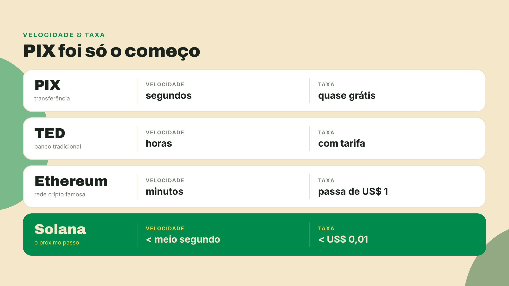
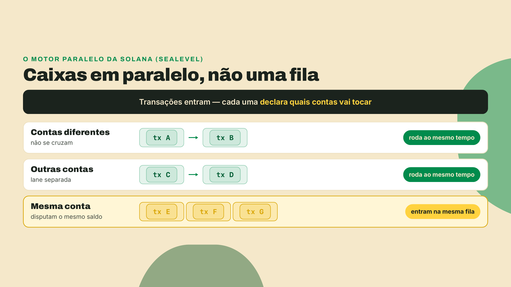
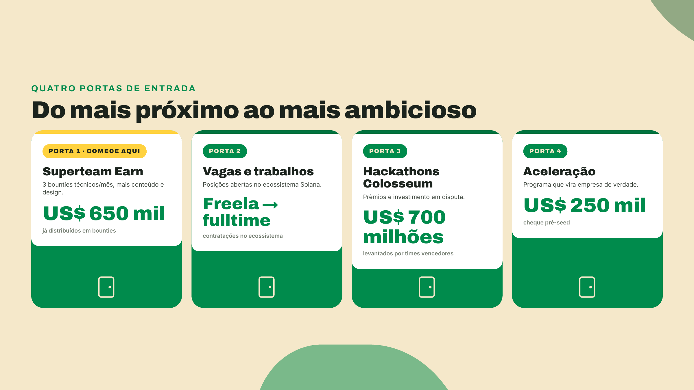

# Solana em 2 minutos (e como ganhar dinheiro nela)

Você manda um PIX e o dinheiro cai antes de guardar o celular no bolso. Agora imagina essa mesma velocidade valendo pra qualquer ativo: dólar digital, ações americanas, ouro. Isso já existe e roda na Solana, uma rede aberta pra qualquer pessoa com um celular. Cada operação confirma em menos de meio segundo e custa menos de 1 centavo. Já são mais de 60 ações americanas negociadas assim, direto do celular.

E não é aposta de nicho. Visa, BlackRock e PayPal já constroem na rede pública, com dinheiro de verdade. O caso mais forte é recente: em dezembro de 2025, a JPMorgan, o maior banco dos Estados Unidos, estruturou uma emissão de dívida de curto prazo nativa na Solana para a Galaxy Digital, liquidada em USDC, o dólar tokenizado. Não foi teste de laboratório: foi na própria rede pública.

O truque da velocidade é simples de sentir. A Solana é um computador global mantido por milhares de máquinas independentes: ninguém desliga, ninguém adultera. E o pulo do gato é que, em vez de uma fila única, ela abre vários caixas ao mesmo tempo, como num mercado. Transações que não têm nada a ver uma com a outra rodam em paralelo. Por isso a fila anda e a taxa fica em centavos.

E é aqui que você entra. A Superteam Brasil é a comunidade oficial da Solana no país, e aqui ninguém precisa comprar moeda pra participar: você ganha trabalhando. No Superteam Earn tem bounties, desafios abertos com prêmio em dólar, de código a design e conteúdo. Entregou bem, recebeu. Já saíram mais de US$ 650 mil por esse caminho. Tem também vagas, hackathons e aceleração pra quem quer abrir empresa: a BlindPay, por exemplo, venceu a trilha brasileira do hackathon e entrou num batch da Y Combinator.

Agora é com você. Responde o quiz aqui embaixo e passa no nosso estande pra retirar o brinde. É rápido, é de graça, e é o seu primeiro passo dentro da Solana.
