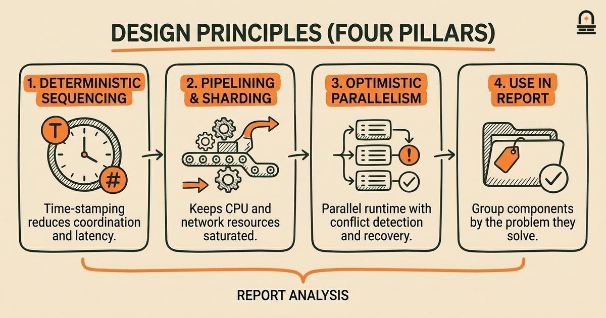
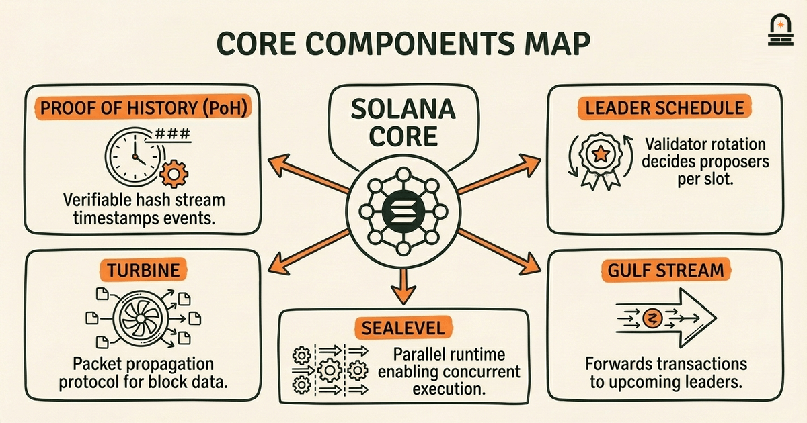
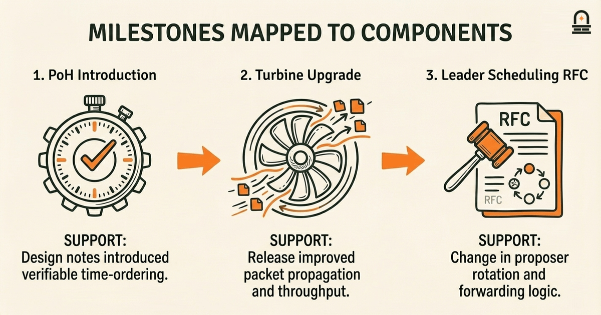
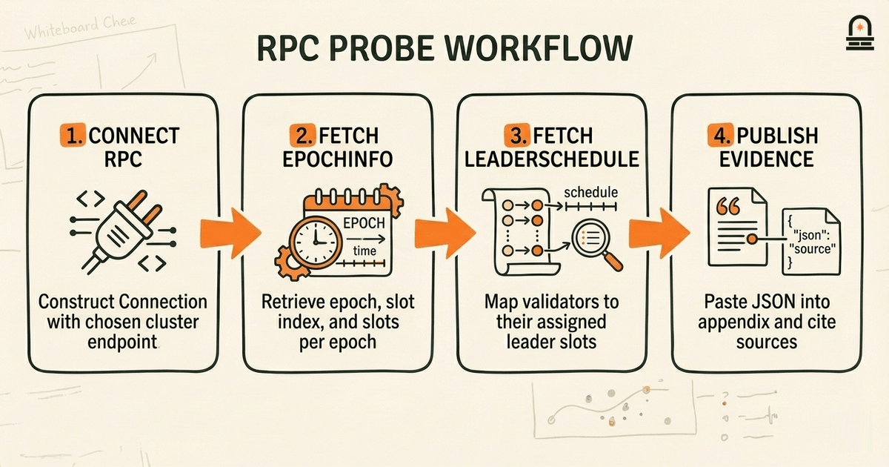

### Listen to the audio version

[Listen to this episode on Spotify](https://open.spotify.com/episode/7znWxelg8LXiNOVouXuRzz)

---

**Objective:** Identify and summarize core architectural principles and their implications to include in the report's technical overview.

**Why now:** After historical synthesis, we extract architectural themes for the report's technical overview.

**Concepts:** Solana architecture; architectural design principles; component roles and responsibilities; implications for usability and performance; mapping architecture to historical decisions; limitations and tradeoffs

**Read time:** 35 min

---

## Recap & Introduction

You are identifying Solana's core architectural principles and translating them into evidence-backed summaries for the capstone report's technical overview. You have already defined the scope and method for this capstone, collected primary and secondary sources, and produced a historical synthesis of Solana's development; this lesson converts that historical work into an architecture-focused analysis you can cite and include in the report.

Concretely, from "Framing the Capstone: Scope and Method for Solana's Story" you brought forward the capstone structure, the evidence-gathering spreadsheet, and the reporting template that defines a technical overview section. From "Synthesizing Solana History" you brought the historical timeline, the milestone annotations, the evidence-evaluation matrix, and the draft narrative linking milestone decisions to architectural changes. Those artifacts — the scope document, evidence matrix, timeline, and draft history — are your starting materials here.

In this lesson we guide you through extracting architecture-level themes (design principles, component responsibilities, and system tradeoffs) from that historical material, mapping components to observed decisions and citing evidence. You will practice converting historian-style claims ("network latency shaped validator design") into architecture statements ("Gulf Stream moves transaction forwarding to validators to minimize mempool latency, enabling higher throughput under certain network assumptions") that can be slotted directly into the technical overview of the capstone report.

The goal for this module step is not to rewrite low-level protocol specs from memory but to produce concise, evidence-linked architectural claims you can paste into your draft report: clear statements of what each major component does, why it was introduced historically, and what the practical implications and tradeoffs are. We also establish a repeatable workflow you will use to add citations and code-level evidence in the next lesson when drafting and polishing the final report.

---

## Learning Objectives

By the end of this lesson you will be able to:

- **Identify** the core components in Solana's architecture and state, in your own words, what each component is responsible for in the live cluster.
- **Explain** the primary architectural design principles (for example: pipelining, parallel execution, optimistic assumptions) and how they relate to component responsibilities.
- **Map** at least three historical decisions or milestones from your timeline to concrete architectural changes or emphases and provide supporting evidence from primary sources.
- **Draft** 2–3 short, citation-ready paragraphs for the capstone technical overview that synthesize component roles, design principles, and tradeoffs.
- **Use** a small code-based probe (RPC calls) to extract cluster metadata that supports one architectural claim and explain how you would cite that output in the report.

These objectives are actionable: you should leave with paragraphs suitable for insertion into the report and a reproducible method for turning historical claims into architecture statements with evidence.

---

## Core Architectural Concepts and Component Roles

Solana's architecture organizes around a small set of interlocking components and a handful of design principles. At a high level, the architecture focuses on maximizing single-node throughput and cross-node parallelism by shifting work earlier in the transaction lifecycle, introducing a verifiable time source, and enabling concurrent program execution. The most consequential components to understand for the report are: Proof of History (PoH), the leader/leader schedule, Tower BFT, Turbine, Gulf Stream, Sealevel, Pipelining/Stages, Cloudbreak, and Archivers. Each plays a specific role that matches an architectural principle.

Mechanically, the system's design choices cluster into three principles: (1) deterministic sequencing and time-stamping to reduce coordination overhead (PoH), (2) aggressive pipelining and sharding of responsibilities to keep CPU and network resources saturated (Turbine, Pipelining, Cloudbreak), and (3) optimistic parallel execution with runtime checks to recover from conflicts (Sealevel). These principles are useful as headings in your report's technical overview because they allow you to group components by the problem they solve rather than by implementation detail.

Use the following table in the report to summarize component responsibilities and immediate implications; it helps readers scan the architecture quickly and connects each component to an actionable implication you can cite from your historical timeline.

| Component | Primary Responsibility | Implication for Performance or Usability |
| --- | --- | --- |
| Proof of History (PoH) | Provides a cryptographic time-ordering stream to timestamp events without global consensus. | Reduces coordination latency and enables leaders to sequence transactions locally, improving throughput. |
| Leader / Leader Schedule | Designates which validator proposes the next block/entry stream. | Counters conflicting proposals; centralized short-term proposer reduces cross-node negotiation costs. |
| Tower BFT | Implements finalized consensus decisions using PoH as a clock. | Leverages PoH for lock-in semantics; trades some cross-validator latency for faster finality under certain connectivity. |
| Turbine | Breaks block propagation into chunks and uses a fanout tree to reduce bandwidth bottlenecks. | Improves propagation speed at scale but assumes reasonably low packet loss and modern networking. |
| Gulf Stream | Forwards transactions to validators ahead of being included to reduce mempool size and latency. | Enables high throughput by reducing leader work; increases reliance on predictable network behavior. |
| Sealevel | Parallel runtime that executes non-overlapping transactions concurrently. | Permits high concurrency for transactions that touch disjoint accounts; requires careful runtime checks for conflicts. |

When drafting the technical overview, always pair each component description with two short sentences: one describing what it does (mechanism) and one describing why that design choice matters (implication). For example, for PoH write: *"PoH encodes a verifiable sequence of hashes to provide a global logical time. This choice reduces coordination overhead by allowing leaders to locally sequence transactions, enabling higher per-node throughput."* That pattern keeps the report focused and directly links architectural description to historical design intent and observable outcomes.

Finally, avoid treating the components as isolated; emphasize the composition: PoH enables Tower BFT to reference time without additional messaging, while Turbine and Gulf Stream together optimize block propagation and transaction distribution. Those joint behaviors are often where tradeoffs appear, and they form useful subsections in the technical overview.

---

## How This Shows Up in the Real World: Mapping Architecture to Historical Decisions

To make architecture meaningful in the report, you need concrete mappings from historical events to architectural emphasis. Start by selecting three milestones from your timeline where an engineering decision or public statement influenced architecture — for example: the introduction of PoH in early design notes, a specific release that improved Turbine or packet propagation, and a vote or RFC that changed leader scheduling or transaction forwarding logic. For each milestone, produce a short claim that ties the event to a component change and then attach the primary evidence (commit, blog post, or RFC) from your evidence matrix.

Here is a repeatable workflow you will use to create those mappings and paragraphs for the report. Follow these steps in order and keep your evidence links ready.

1. **Pick a milestone:** From your timeline choose a dated event with supporting sources (e.g., a patch note or whitepaper excerpt).
2. **Identify affected components:** Read the sources and note which components are mentioned or implied (PoH, Turbine, Gulf Stream, Sealevel).
3. **Write the mechanism sentence:** Describe, in one sentence, how the component works or what was changed (use active voice and specifics).
4. **Write the implication sentence:** Describe, in one sentence, what the change enabled or traded off (performance, usability, resource requirements).
5. **Attach evidence:** Link to the commit, timeline entry, or documentation and quote 1–2 lines verbatim if helpful.
6. **Cross-check with code or RPC output:** If available, add a small code-derived data point (e.g., current leader schedule or epoch parameters) as a supporting artifact.
7. **Repeat and synthesize:** Group related claims under architecture principles (pipelining, optimistic execution) and summarize them in a single paragraph per principle for the report.

As a concrete example: take the introduction of PoH. Your mechanism sentence could read: *"Proof of History was introduced as a verifiable hash sequence that timestamps events, allowing validators to consume a leader's local sequence without extra coordination."* The implication sentence could read: *"This reduced inter-node consensus traffic and enabled leaders to optimize block construction for throughput, but it increased the system's reliance on a leader-driven sequencing model."* Then attach your timeline entry and the whitepaper excerpt as evidence, and optionally include a short code probe that shows current PoH-driven epoch parameters or leader rotation to indicate the concept is live in the cluster.

Use this workflow to generate three such mappings; when assembled, those mappings become the backbone of the technical overview section of your report. Each mapping is short, factual, and evidence-linked so the reader can quickly see not only what the architecture does but when and why that choice was made historically.

---

## Code Walkthrough: Using RPC to Collect Evidence for an Architecture Claim

Small, reproducible probes are useful evidence for the report: they show the current cluster state and can validate claims about leader rotation, epoch length, or transaction throughput settings. Below is a compact TypeScript example using `@solana/web3.js` that fetches epoch information and the leader schedule. Run this against the cluster you cited in your timeline (testnet or mainnet as appropriate) and paste the JSON output into your evidence appendix.

`import { Connection, clusterApiUrl } from '@solana/web3.js';

async function probeCluster() {
 const url = clusterApiUrl('mainnet-beta');
 const conn = new Connection(url, 'confirmed');

 const epochInfo = await conn.getEpochInfo();
 console.log('epochInfo:', epochInfo);

 const leaderSchedule = await conn.getLeaderSchedule();
 console.log('leaderSchedule:', leaderSchedule);
}

probeCluster().catch(console.error);
`
Line-by-line explanation and how to use the output:

**Imports and connection:** `import { Connection, clusterApiUrl }` pulls the client utilities. `clusterApiUrl('mainnet-beta')` returns a canonical RPC endpoint; if your timeline references testnet or devnet, substitute that string. `new Connection(url, 'confirmed')` constructs a client with the desired commitment level — the commitment affects what state snapshot you receive.

**Getting epoch info:** `getEpochInfo()` returns a structure describing the current epoch, slot index, and slots per epoch. In the report you can cite `epochInfo.slotsInEpoch` and `epochInfo.slotIndex` when discussing leader rotation cadence and how frequently the leader schedule changes.

**Getting leader schedule:** `getLeaderSchedule()` returns a mapping of validator identities to the slots they are assigned as leader. Use this output as concrete evidence when you claim "leaders rotate every N slots" or when you want to show the distribution of leadership across validator identities. Paste the JSON snippet (redacting keys if necessary) into your appendix and reference it in-text: "Current leader schedule (snapshot taken YYYY-MM-DD) shows X slots per leader."

**How to integrate into the report:** Save the printed JSON and include a one-line caption that explains why the probe matters: for example, "Snapshot of leader schedule demonstrates the frequency of leader rotation and supports the claim that leader-driven sequencing is a practical design choice in current deployments." Keep probes small and dated — they are point-in-time evidence that complements your historical timeline rather than replaces it.

Note: this snippet is designed for evidence gathering only. Do not include wallet keys, signing, or transaction submission in these probes; the goal is read-only validation of current cluster parameters.

---

## Conclusion & Key Takeaways

You now have a practical method for converting historical milestones into architecture statements: identify a milestone, map it to affected components, write a concise mechanism sentence and an implication sentence, and attach primary evidence. That pattern converts narrative claims into citation-ready technical paragraphs that will make the capstone's architecture section both authoritative and traceable.

Three principles to remember as you finalize the architecture section: (1) describe mechanism first, implication second — this keeps explanations crisp; (2) group components under shared design principles (for example, pipelining or optimistic parallelism) rather than enumerating isolated features; and (3) pair each claim with a small piece of evidence — either a primary source from your timeline or a point-in-time RPC probe — so readers can verify the claim without deep protocol knowledge.

These takeaways position you to assemble the report's technical overview quickly: use the component table and the three mapped milestone paragraphs as the core of that section, then supplement with one or two code probes (like the RPC example in this lesson) to ground claims in current cluster state. That preparation leads directly into the next lesson, where we will stitch the history and architecture content into draft report sections and apply editorial polishing to produce the final capstone deliverable.

---

## Quick Recap

- Turn historical milestones into architecture claims by naming a component, stating its mechanism, and stating its implication.
- Summarize key components (PoH, Turbine, Gulf Stream, Sealevel, Tower BFT) with a short table of responsibilities and implications.
- Collect small read-only probes (RPC output) as dated evidence to support claims in the report's technical overview.

---

## Next Steps

Prepare for the next lesson, "Final Report: Drafting and Polishing the Comprehensive Solana Report," by selecting three milestone-to-architecture mappings you will expand into draft paragraphs. For each mapping, attach the primary source from your evidence matrix and optionally the RPC JSON snapshot produced using the code probe in this lesson. Bring those artifacts to the next lesson so we can integrate them directly into the report's technical overview and apply editorial polishing and citation formatting.

---

## Glossary

### Proof of History (PoH)

A verifiable cryptographic sequence of hashes that encodes ordering information and provides a local, reproducible time source for sequencing events without additional consensus messaging.

### Turbine

A block propagation strategy that partitions data into chunks and uses a fanout tree to distribute those chunks efficiently, reducing per-node bandwidth pressure during propagation.

### Gulf Stream

A transaction forwarding mechanism that pushes transactions to validators ahead of confirmation to reduce mempool contention and allow validators to pre-process and prioritize incoming transactions.

### Sealevel

A parallel runtime that executes transactions concurrently when they operate on disjoint sets of accounts, enabling high concurrency while relying on runtime conflict detection.

### Leader Schedule

The mapping of validators to slot ranges that designates which validator is responsible for proposing entries during specific slots, determining short-term sequencing authority.

### Tower BFT

A consensus mechanism that builds on classical BFT ideas but leverages Proof of History as a clock to record votes and reach finality with reduced coordination messaging.

---

## References & Further Reading

- [Solana: A new architecture for a high performance blockchain (Whitepaper)](https://solana.com/solana-whitepaper.pdf) — *Solana Labs* (Architecture Overview)
- [Solana Docs — Overview & Core Concepts](https://docs.solana.com/overview) — *Solana Documentation* (Technical Documentation)
- [Proof of History and Consensus Concepts](https://docs.solana.com/overview#proof-of-history) — *Solana Documentation* (Component Details)
- [solana-web3.js API Reference](https://solana-labs.github.io/solana-web3.js/) — *Solana Labs / GitHub Pages* (APIs & Tooling)
