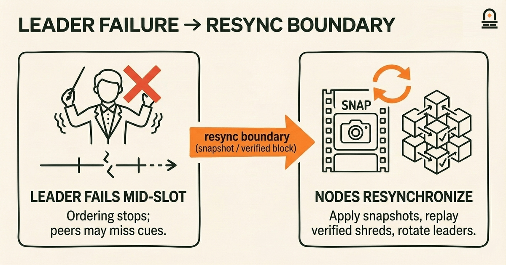
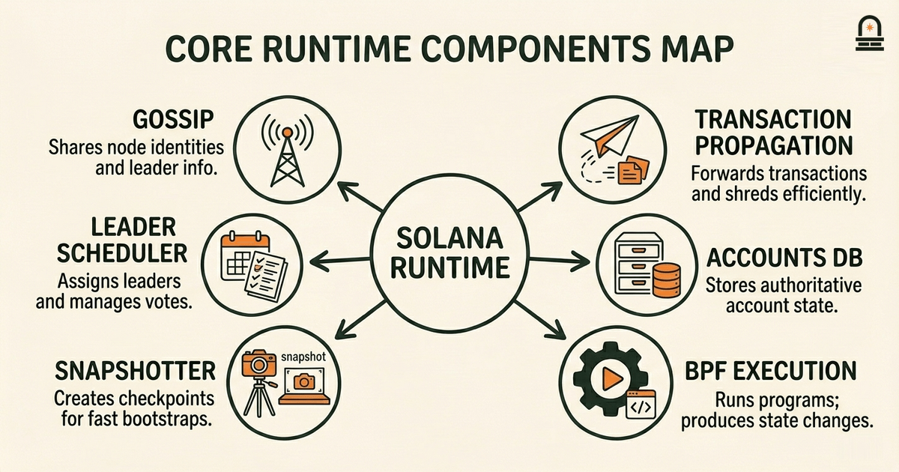
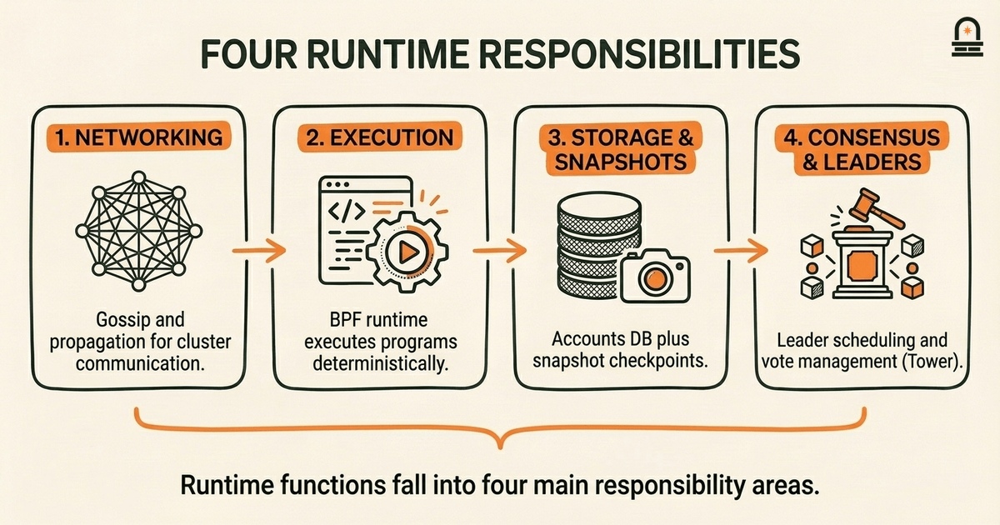
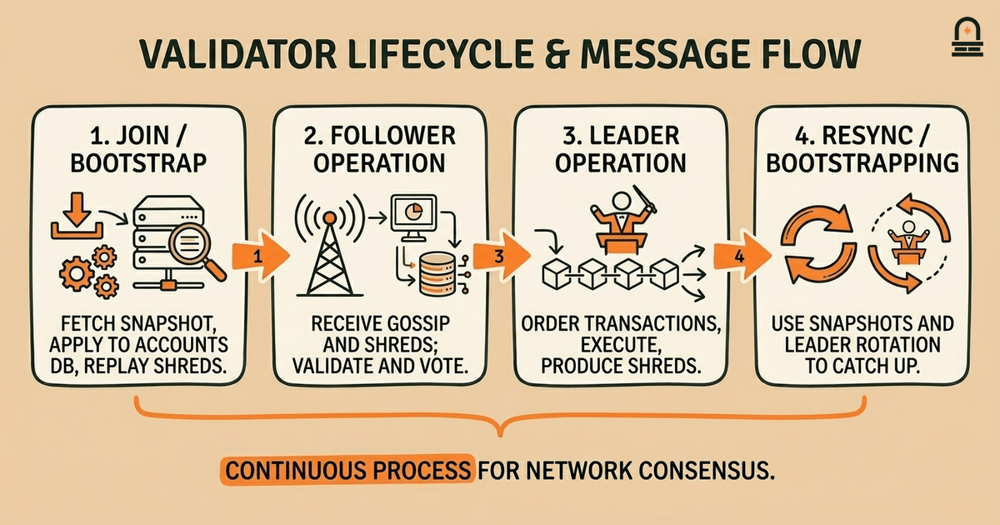

### Listen to the audio version

[Listen to this episode on Spotify](https://open.spotify.com/episode/4tAIMGPCTTQmN7a4DBMGc0)

---

**Objective:** Explain the responsibilities of core runtime components and how validators participate within the network architecture.

**Why now:** After the overview, learners need to map high-level parts to the concrete runtime components.

**Concepts:** runtime component responsibilities; validator duties and lifecycle; message routing between nodes; state storage and snapshots; component interfaces and boundaries

**Read time:** 30 min

---

## Recap & Introduction

Core runtime components in Solana coordinate execution, message routing, and state management across validator nodes. Recall from the previous lesson that Solana uses a single global ledger split into shreds, a notion of leader schedule, and distinct node roles such as leader, validator, and RPC node; those concepts let you picture where runtime responsibilities must live. The ledger structure and state organization you examined earlier are the substrate that runtime components read from and write to; mapping those high-level pieces to concrete runtime services is the goal of this lesson.

We move to runtime components now because understanding which piece does what makes the transaction flow lesson meaningful: when you later trace a transaction through the system, you will already know which service validates signatures, which component orders or gossips messages, which piece applies instructions to accounts, and where snapshots of state are taken. By the second paragraph we introduce the lesson's key concepts: runtime component responsibilities, validator duties and lifecycle, message routing between nodes, state storage and snapshots, and the interfaces and boundaries that keep components composable. These topics let you annotate the architecture diagram from the prior lesson with concrete responsibilities and decision points.

Throughout this lesson you will map named runtime actors (for example, the runtime thread that executes BPF programs, the accounts database, the gossip layer, and the snapshotter) to the responsibilities they carry. We will also unpack the validator's lifecycle: how a validator participates as a leader, how it handles incoming replica work, and what operational responsibilities keep the network healthy. That mapping is practical: when you take notes you should be able to point at a component and explain one concrete thing it must do and one type of message it either consumes or emits.

---

## Learning Objectives

By the end of this lesson you will be able to:

- List the main runtime components used in Solana and describe at least one specific responsibility for each, using plain language.
- Explain the core duties of a validator during normal operation, including the lifecycle transitions between follower and leader roles.
- Describe how messages are routed between nodes (gossip, block propagation, RPC) and where state reads and writes occur.
- Identify where state snapshots are created, why they matter for bootstrapping, and how component boundaries affect snapshot consistency.

These objectives are concrete and testable: prepare annotated notes that map components to responsibilities and validator duties, and use those notes as a quick checklist when you follow the next lesson on transaction flow.

---

## Mental Model: Orchestra and Conductor

**The Mental Model:** Use the orchestra-and-conductor metaphor to think concretely about the runtime. Picture the network as an orchestra performing a symphony where the score is the global ledger and each musician is a node. In this model, a validator node is a musician: it holds its copy of the score (the accounts and ledger data), watches the conductor when it is summoned to lead, and plays its part when it receives its cues. The leader is the conductor for a short time slice: it orders notes (transactions) into a performance (a block) and signals the rest of the orchestra to follow the score. The runtime components are the sections of the orchestra — strings, winds, percussion — each responsible for a specific family of tasks like execution, state storage, or message routing.

Translate that metaphor back into concrete components. The accounts database corresponds to the sheet music folders you open to find which notes to play: it stores the authoritative state for accounts so execution components can read and write account values. The BPF execution runtime acts like the musician interpreting the notes into sound: given instructions and account state, it produces new state and logs. The gossip layer is the orchestra’s rehearsal wireless channel, carrying short signals and membership information so every node knows who is playing and where the conductor is. The snapshotter is the stage manager who periodically photographs the stage setup so a late musician can join and match everyone else’s arrangement without replaying the entire rehearsal from the beginning.

Why this metaphor helps you reason about boundaries and failure modes: if a musician misses a cue, the orchestra temporarily tolerates it but must resync at a clear boundary (a measure or movement); similarly, Solana constructs boundaries (snapshots, verified blocks, leader rotation) that let nodes resynchronize without full replay. When the conductor fails mid-performance, the score and the rehearsal signals determine how quickly a new conductor is elected and how much the orchestra must redo. In Solana, those failure-recovery signals are the leader schedule and the block propagation/gossip protocols. The orchestra model also highlights the difference between deterministic interpretation and coordination: musicians deterministically interpret the same score; validators deterministically execute the same transactions given equivalent inputs and state snapshots, which is critical because consistency of results across nodes is required for consensus.

Use this mental model as you form annotated notes: for each component ask, 'Is this a score-holder, an interpreter, a messenger, or a stage manager?' That classification quickly narrows down what interfaces the component needs and what failure modes to watch. As you prepare to trace a transaction in the next lesson, hold this metaphor in mind: you will see the conductor order, the musicians interpret, the messenger relay, and the stage manager snapshot the state.

---

## Core Runtime Components and Responsibilities

Here we enumerate the main runtime components you will encounter and what each concretely does. Treat this as a mapping exercise: for each component, note one primary responsibility and one type of input or output it handles. We present a compact table, then expand each row with operational implications and interfaces.

| Component | Primary Responsibility | Key Inputs / Outputs |
| --- | --- | --- |
| Gossip (cluster membership) | Share node identities, leader schedule updates, and small metadata | Inputs: peer messages; Outputs: validator lists, contact info |
| Transaction Propagation (Turbine-like layer) | Efficiently distribute transactions and block shreds across nodes | Inputs: transactions, shreds; Outputs: forwarded shreds/packets |
| Accounts Database | Store and serve account state (on-disk + in-memory caching) | Inputs: writes from execution; Outputs: reads for execution |
| BPF Execution Runtime | Execute program instructions against account state deterministically | Inputs: transactions + account data; Outputs: state changes, logs |
| Snapshotter / Snapshot Storage | Create consistent state checkpoints for fast bootstrapping | Inputs: serialized state; Outputs: snapshot artifacts |
| Leader Scheduler / Tower (consensus hints) | Coordinate leader election windows and manage vote locking | Inputs: ledger progress; Outputs: leader assignments, votes |
| RPC and Indexing | Serve queries, aggregate logs, and expose operational APIs | Inputs: client queries; Outputs: account data, transaction status |

Now expand: the gossip layer must remain lightweight and timely; it does not carry full blocks but conveys membership and liveness so other components can connect. Its interface is small messages with contact info and metadata TTLs. Transaction propagation sits on top of that, using a broadcast pattern optimized for bandwidth and latency: it receives transactions from RPC or local clients and fragments/forwards them to the cluster in a way that attempts to minimize redundant transmission while preserving delivery probability.

The accounts database combines an on-disk ledger of shreds and a memory-optimized tree for account lookups. Its primary interface is read and apply: execution threads ask for account slices and return diffs to be written. Snapshot consistency matters here: snapshots must capture the database at a point where the execution model agrees that all preceding transactions have been applied. That is why snapshotters coordinate with the block-commit pipeline to avoid capturing partial state.

The BPF execution runtime is deterministic and sandboxed. Its inputs are a transaction's instructions and the account data the transaction touches; its outputs are written account diffs and program logs. Execution failures (e.g., out-of-compute) are handled at the runtime boundary and propagated as transaction results. The division of responsibility between execution and the accounts DB is explicit: execution computes new state; the accounts DB persists and serves it.

Why this matters in practice: knowing these boundaries helps you predict where performance bottlenecks appear and where to instrument when debugging. For example, slow disk writes in the accounts DB show up as delayed commitment; excessive gossip chatter increases CPU and network pressure without improving finality. When you map each component in your notes, also note its dominant resource: CPU, memory, disk, or network. That mapping will be directly useful in operations, performance tuning, and in understanding why validators behave differently under load.

---

## Workflow: Validator Lifecycle, Message Routing, and State Snapshots

**Process Overview:** Walk through the typical validator lifecycle and the message flows that connect components. Present the lifecycle as phases: join/bootstrap, follower operation, leader operation, and resync/bootstrapping. For each phase we describe the messages exchanged, which components are active, and what state transitions occur.

Join / Bootstrap: when you start a validator node, the snapshotter and accounts DB are central. The node first attempts to locate a recent snapshot from peers or object storage. If a snapshot is available, the snapshotter applies it to the local accounts DB to avoid replaying the entire ledger. Key messages here are snapshot advertisements (via gossip metadata or RPC endpoints) and targeted object fetches. After the snapshot is applied, the node replays shreds and ledger entries after the snapshot point to reach the current slot. In your notes, mark that the accounts DB transitions from empty to snapshot-applied to replay-caught-up.

Follower Operation: as a follower you continuously receive gossip updates and transaction shreds. The turbined propagation layer and shred receivers write incoming shreds to disk; the RPC or fee-paying clients submit transactions that the node may forward. The consensus voting component (Tower) watches the ledger and sends votes when conditions are met. The key messages are forwarded transactions (to the leader), shreds for blocks, and gossip for leader identity. During follower operation the node validates received blocks and verifies that local execution matches expected results but does not become the ordering authority.

Leader Operation: when the leader schedule assigns the node to lead a slot, the node shifts into ordering mode. The leader gathers transactions from local clients or the transaction pool, assembles them into a block, executes programs via the BPF runtime, and produces a block expressed as shreds. Those shreds are propagated efficiently to peers via the propagation layer. The leader also signs and broadcasts any votes or leader-specific metadata required by Tower. In this phase the node must coordinate the execution threads, accounts DB writes, and outbound propagation; failures or slowdowns in any of these components directly reduce block throughput. Note in your annotated notes which components are synchronous (execution then write) and which are asynchronous (propagation to peers).

Resync / Failure Recovery: if the node detects it is out-of-date or misses many slots, it will use snapshots or request missing ledger entries from peers. The snapshotter plays a central role: a validated snapshot lets the node skip heavy replay. Message routing here includes targeted RPC fetches and gossip-driven peer discovery to find the best snapshot sources. Your notes should include the triggers for resync (e.g., ledger gap thresholds) and the mechanisms used (snapshot fetch vs. full replay).

Message routing patterns summarized: gossip carries small, authoritative metadata and peer lists; propagation layers carry high-volume payloads (transactions and shreds) using fanout or tree-based distribution; RPC carries on-demand queries and targeted transfers, especially for large artifacts like snapshots. Each pattern has tradeoffs: gossip is low-latency but limited in payload, propagation is efficient at scale but more complex, and RPC is reliable for large or targeted transfers but increases the load on the serving node.

Why this workflow view matters: when you later trace a single transaction through the system, you will refer to these phases to decide where to look for delays or mismatches. Annotate your notes with expected component interactions per phase and with example messages (e.g., 'client -> RPC -> leader pool -> execution -> accounts DB write -> shred propagation'). That sequence is the skeleton you will embellish in the next lesson's transaction flow diagrams.

---

## Conclusion & Key Takeaways

Remember three principles that summarize how runtime components and validators fit together. First, clear separation of concerns: components have narrowly defined responsibilities — gossip for membership, propagation for payload distribution, accounts DB for state persistence, BPF runtime for deterministic execution, and snapshotter for bootstrapping. That separation matters because it makes behavior predictable and fault domains understandable.

Second, validator lifecycle phases determine which components are active and which interfaces are critical at any time. As a follower, your node emphasizes validation, gossip, and propagation ingestion. As a leader, it emphasizes ordering, execution, and outbound propagation. Understanding those phase-based responsibilities lets you diagnose performance and correctness by narrowing the focused set of components to inspect.

Third, snapshot boundaries and component interfaces are the practical levers for resynchronization and scaling. Snapshots reduce replay cost, and clear interfaces between execution and storage ensure deterministic outcomes across nodes. When you prepare your annotated notes, capture for each component: one responsibility, one primary input, one primary output, and the dominant resource constraint (CPU, memory, disk, or network). Those four fields give you a compact operational model that will be directly useful in the next lesson when you trace transaction processing end-to-end.

---

## Quick Recap

- Map: gossip = membership, propagation = payload distribution, accounts DB = state store, BPF runtime = deterministic execution, snapshotter = fast bootstrapping.
- Validator phases: join/bootstrap → follower → leader → resync; each phase emphasizes different components.
- Message routing patterns: gossip for metadata, propagation for large-volume payloads, RPC for targeted fetches.

---

## Next Steps

Prepare brief annotated notes mapping each runtime component to one responsibility and one input/output pair; those notes are your artifact for this lesson. When you are ready, move to the next lesson: "Transaction Flow and Processing Model." There you will apply these component mappings to trace a transaction from client submission through ordering, execution, commitment, and finality.

As a quick exercise before continuing, pick a component from your notes and answer: which resource (CPU, memory, disk, network) would you instrument first if that component slowed under load? Keep that answer handy for the next lesson's debugging examples.

---

## Glossary

### Gossip

A lightweight membership and liveness protocol that exchanges small metadata and contact information between nodes to enable peer discovery and leader awareness.

### Accounts Database

The on-disk and in-memory store that holds account state; it serves reads for execution and persists writes produced by the execution runtime.

### BPF Execution Runtime

A sandboxed interpreter that deterministically executes on-chain programs (BPF bytecode) against provided account data, producing state diffs and logs.

### Snapshot

A point-in-time serialized capture of the node's state used to bootstrap or resynchronize a node without replaying the entire ledger chain.

### Propagation Layer

The network subsystem responsible for high-throughput distribution of transactions and block shreds between nodes using bandwidth-efficient forwarding.

### Leader

A validator temporarily assigned to order transactions and produce a block for a slot; it assembles, executes, and broadcasts shreds to peers.

### Tower (Consensus Component)

A component that manages voting behavior and lockouts to help validators reach consensus on ledger progress and leader slots.

---

## References & Further Reading

- [Solana Architecture Overview](https://docs.solana.com/cluster/architecture) — *Solana Docs* (Core Architecture)
- [Running a Validator](https://docs.solana.com/running-validator) — *Solana Docs* (Validators & Operations)
- [Programs and the BPF Runtime](https://docs.solana.com/developing/on-chain-programs/overview) — *Solana Docs* (Runtime & Execution)
- [Snapshots and Ledger](https://docs.solana.com/cluster/snapshots) — *Solana Docs* (State & Storage)
