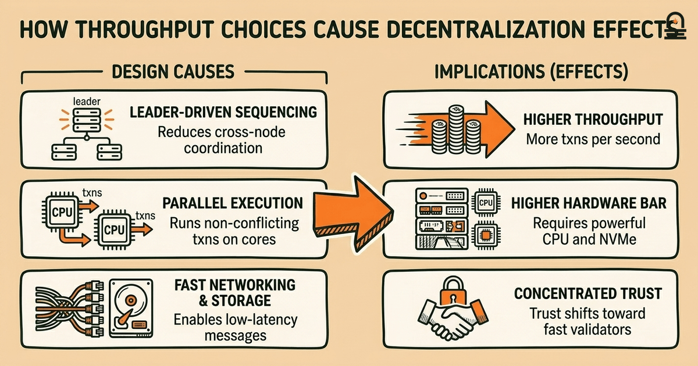
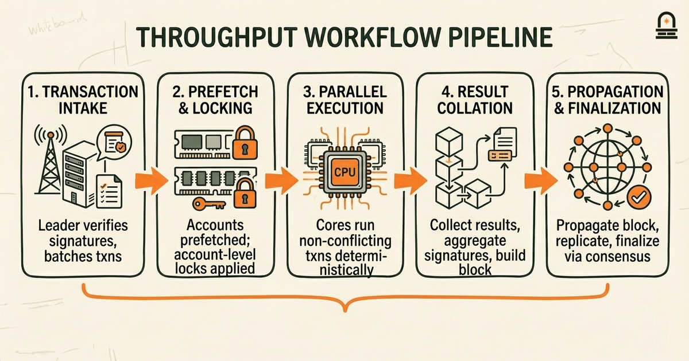
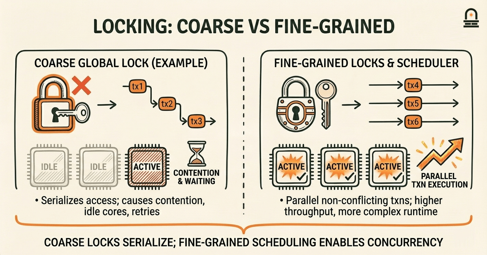

### Listen to the audio version

[Listen to this episode on Spotify](https://open.spotify.com/episode/00YQAHNUP26WrkfD1wteCf)

---

**Objective:** Analyze key architectural tradeoffs and recognize the distinctive design choices that shape Solana's operation.

**Why now:** After component and flow analysis, learners can evaluate tradeoffs and how they affect system behavior.

**Concepts:** scalability versus decentralization tradeoffs; throughput and latency design considerations; hardware and software coordination implications; failure modes and resilience at a system level; operational and maintenance considerations

**Read time:** 30 min

---

## Recap & Introduction

Solana's transaction pipeline relies on a specific ordering and validation sequence: incoming transactions are signature-checked, pushed into the leader's queue, staged through prefetching and accounts locking, and then executed with conflict detection before finalization. You should recall how ordering and conflict handling shape which transactions can be parallelized and which must be serialized; that concrete interaction between ordering and account-level locking is central to how Solana achieves high throughput.

We now move from the mechanics of transaction flow to the architectural tradeoffs that make those mechanics possible. You will connect the concrete details you remember — signature validation, the leader role, the conflict graph, and finalization — to the larger design decisions that trade off decentralization for performance, trade off generalized programmability for deterministic execution speed, and tie software behavior to specific hardware expectations.

By the end of this lesson you will have a structured way to name three major tradeoffs Solana accepts, explain how throughput and latency are balanced against decentralization, and trace how hardware and software coordination affects both normal operation and failure modes. These are the topics we cover next: scalability versus decentralization tradeoffs, throughput and latency design considerations, hardware and software coordination implications, and system-level failure and operational considerations. Each topic will link concrete processing behaviors to architectural consequences so you can synthesize notes ready for the next module on consensus and security.

---

## Learning Objectives

You will be able to clearly articulate the tradeoff between scalability and decentralization and describe two concrete ways that tradeoff appears in Solana's runtime. You will explain how Solana prioritizes throughput and low latency, and identify the mechanisms that drive that prioritization (for example, aggressive pipelining and minimized inter-node coordination). You will map hardware assumptions — such as CPU, network, and SSD performance — to specific software optimizations and explain how those assumptions affect operational maintenance and validator requirements. Finally, you will produce a short synthesis (notes) that lists three architecture tradeoffs and frames at least two open questions about security or consensus to carry forward into the next module.

---

## Scalability vs Decentralization: Concrete Tradeoffs

At a concrete level, the scalability-versus-decentralization tradeoff asks: which constraints are relaxed to increase transactions per second, and which constraints are tightened as a consequence? In Solana's design, throughput gains come from reducing coordination overhead across validators and pushing responsibility into leader-driven sequencing, aggressive parallel execution, and deterministic transaction processing. These choices reduce the need for frequent cross-node synchronization, allowing higher block rates and larger batch sizes, but they also raise the bar for validator hardware and can concentrate some trust in the leader and in validators that meet high-performance requirements.

Mechanism matters. When you prioritize throughput, you accept that many validators must run similar high-end hardware and that some tasks are centralized temporarily (for example, the leader sequencing role). When you prioritize decentralization, you accept lower sustainable throughput because more nodes participate in consensus decisions and more metadata must be exchanged to keep state consistent. That tradeoff shows up in three concrete areas: leader rotation and its impact on ordering attacks, the runtime's reliance on parallel execution assumptions, and the need for fast, low-latency networking between validators.

The short table below summarizes how a choice to favor throughput manifests across design dimensions and what it implies for decentralization and operational cost.

| Design Choice | How It Improves Throughput | Decentralization & Operational Implication |
| --- | --- | --- |
| Leader-driven fast sequencing | Reduces cross-node coordination; enables larger batches | Requires trust in leader availability; fast leaders need strong hardware |
| Parallel transaction execution (Sealevel-style) | Runs independent transactions concurrently on multiple cores | Requires deterministic conflict detection; increases runtime complexity |
| Assume high-performance networking and storage | Low latency consensus messages; rapid ledger IO | Raises validator hardware bar; limits participants by cost |

You should be able to name each row and explain how the mechanism (what) leads to both performance benefits (how) and constrained decentralization (why that matters). In practice, these tradeoffs explain why a network that achieves thousands of transactions per second can also have concentrated validator requirements and why operators often measure both TPS and accessible validator participation when assessing decentralization.

---

## Throughput, Latency, and Hardware–Software Coordination (Workflow)

**Process Overview:** You should view Solana's high-throughput behavior as a coordinated workflow that ties software ordering choices to hardware capabilities. Start with the leader: the leader receives transactions and performs batching and pre-processing. Those batches are forwarded to the runtime where accounts are prefetched into memory, read/write locks are applied at the account granularity, and parallel execution proceeds under deterministic scheduling. After execution, results are collected, signatures aggregated, and the block is propagated. Each stage of this pipeline is tuned to reduce latency and maximize utilization of CPU cores, network bandwidth, and NVMe throughput.

Why this matters in practice: if any hardware assumption weakens — slower SSD throughput, higher NIC latency, reduced core count — the pipeline develops backpressure. Backpressure causes larger queues at the leader, longer tail latencies for some transactions, and potentially more aborted or retried operations due to account lock contention. You will recognize this behavior when monitoring: tail-latency spikes often correlate with IO saturation or network jitter rather than pure CPU exhaustion. That observation is practical and actionable when you plan or assess validator capacity and incident response.

Here is the high-level workflow you should be able to trace and explain when reasoning about performance incidents:

1. Transaction intake and signature verification at leader.
2. Batching, prefetching of account state, and account-level locking.
3. Parallel execution across cores with conflict detection and retries where necessary.
4. Result collation, block construction, and propagation to validators.
5. Replication and finalization via consensus steps.

Each stage depends on preceding hardware and software assumptions. For example, the prefetch stage assumes fast random reads from local storage; if reads are slow, parallel cores wait idle or execute less work, lowering effective throughput. Likewise, network jitter increases effective latency for propagation and reduces the leader's ability to maintain fast sequencing. These dependencies create operational levers: you can improve throughput by reducing per-transaction IO (optimize data layout), increase concurrency with careful account sharding, or reduce tail latency by prioritizing low-jitter network hardware. When you write your synthesis notes, map each workflow stage to a potential bottleneck and to one operational mitigation. That mapping helps you translate architecture-level tradeoffs into actionable monitoring and maintenance steps.

---

## Code Walkthrough: Simplified Parallel Execution and Conflict Handling (Rust-like)

The code below is a small, simplified Rust-like sketch that models parallel execution across a pool of worker threads. It focuses on account-level locking and how conflicts cause retries. You will use this snippet to reason concretely about why deterministic scheduling, fine-grained locks, and fast memory access matter to throughput.

`// Simplified pseudo-code for parallel transaction execution
use std::sync::{Arc, Mutex};
use std::thread;

struct Account { id: u64, balance: u64 }
struct Transaction { reads: Vec<u64>, writes: Vec<u64> }

fn execute_transactions_parallel(mut txs: Vec<Transaction>, accounts: Arc<Mutex<Vec<Account>>>) {
 let pool: Vec<_> = (0..4).map(|_| {
 let accs = Arc::clone(&accounts);
 thread::spawn(move || {
 loop {
 let tx_opt = {
 // Pop must be synchronized; this is simplified and intentionally coarse
 let mut t = txs.pop();
 t
 };
 if tx_opt.is_none() { break; }
 let tx = tx_opt.unwrap();
 // Acquire locks for accounts involved (simplified)
 let mut a = accs.lock().unwrap();
 // perform reads and writes directly
 for r in &tx.reads { let _ = a.iter().find(|x| x.id == *r); }
 for w in &tx.writes { if let Some(ae) = a.iter_mut().find(|x| x.id == *w) { ae.balance += 1; } }
 // release lock automatically at end of scope
 }
 })
 }).collect();

 for t in pool { let _ = t.join(); }
}
`Line-by-line and block explanation:

- Import and types: The snippet uses shared-memory synchronization primitives. In the real runtime, locks are more fine-grained and avoid a single global `Mutex`; this example intentionally shows the cost when locks are coarse.
- `Account` and `Transaction` structs: each transaction lists account IDs it reads and writes. In production, Solana's runtime computes read/write sets and schedules non-conflicting transactions concurrently.
- `execute_transactions_parallel`: threads are spawned to process transactions in parallel. The critical problem in this pseudocode is the single `Arc<Mutex<Vec<Account>>>` which serializes access. You should notice how that bottleneck kills parallelism even though multiple threads exist.
- Lock acquisition and work: acquiring a global lock serializes all transaction execution. In a realistic implementation, you would lock only the relevant accounts (fine-grained locking), or structure execution so read-only operations proceed without exclusive locks, or use deterministic scheduling to avoid deadlocks.
- Conflict and retry behavior: this sketch lacks retry logic. In Solana's runtime, a transaction that conflicts is either ordered to avoid conflict or aborted and retried by the client; retries increase latency and reduce effective throughput.

How to use this example when you analyze tradeoffs: imagine replacing the global `Mutex` with per-account locks and adding a deterministic ordering where transactions acquire locks in account ID order. You will reason about how that change increases parallelism but adds complexity to lock management and increases per-transaction bookkeeping. That is the heart of the hardware–software coordination tradeoff: you gain throughput, but only if memory access patterns, thread scheduling, and IO subsystems align with the software assumptions.

---

## Conclusion & Key Takeaways

You should now understand three concrete principles that summarize Solana's design tradeoffs. First, prioritizing throughput leads to leader-driven sequencing and parallel execution mechanisms that reduce cross-node coordination but increase validator hardware requirements and operational complexity. Second, low latency and high throughput are achieved by aligning software behavior with hardware assumptions: fast SSDs, low-latency network links, and multi-core CPUs are not optional—they are design inputs that shape runtime choices. Third, fine-grained locking and deterministic execution increase effective parallelism but require additional complexity in conflict detection and retry handling, which in turn affect tail latency and failure behavior.

Frame these takeaways as actionable mental models: (1) throughput-as-resource-exchange — you trade decentralization and hardware accessibility for higher TPS; (2) pipeline-coupling — per-stage hardware degradation creates measurable tail-latency artifacts; (3) lock-complexity paradox — finer concurrency reduces serialization but raises runtime bookkeeping and potential for retry storms. Use those models when writing your synthesis notes and when preparing questions about consensus and security in the next module.

---

## Quick Recap

- **Throughput tradeoffs:** leader sequencing and parallel execution increase TPS but constrain validator diversity.
- **Hardware alignment:** software optimizations assume fast networks and storage; misaligned hardware causes backpressure and tail latency.
- **Locking and conflicts:** fine-grained locks enable concurrency but require deterministic scheduling and retry management.
- **Synthesis task:** produce brief notes listing three tradeoffs and two open security/consensus questions.

---

## Next Steps

Prepare a short synthesis: list three architecture tradeoffs you can explain in two sentences each, and add two questions about how those tradeoffs affect consensus and security. That artifact will be your visual check for mastery. Then proceed to the next lesson, **Rust Syntax and Basic Types**, where we introduce the Rust building blocks you will need to read runtime code and explore concrete implementations of the mechanisms discussed here.

---

## Glossary

### Throughput

The number of transactions processed per unit time; drives choices about batching, parallelism, and network capacity.

### Latency

The time from transaction submission to confirmation; tail latency is especially sensitive to IO and network jitter.

### Leader Sequencing

A leader node's role in ordering transactions before execution; reduces cross-node coordination at the cost of centralizing ordering responsibility.

### Fine-grained Locking

Locking strategy that targets individual accounts or small state units to enable concurrent execution of non-conflicting transactions.

### Deterministic Scheduling

A runtime policy that enforces a repeatable order of operations to avoid nondeterministic state changes across validators.

### Backpressure

When a pipeline stage slows due to resource limits, causing upstream queues to grow and increasing latency or aborts.

### Tail Latency

The high-percentile latency experienced by the slowest transactions; often reveals resource contention or hardware mismatches.

---

## References & Further Reading

- [Solana: A New Architecture for a High Performance Blockchain (Whitepaper)](https://solana.com/solana-whitepaper.pdf) — *Solana Labs* (Architecture & Design)
- [Sealevel: Solana's Parallel Smart Contract Runtime](https://docs.solana.com/developing/runtime/overview) — *Solana Docs* (Runtime & Parallel Execution)
- [Validator Hardware & Performance Recommendations](https://docs.solana.com/running-validator/validator-reqs) — *Solana Docs* (Operational Guidance)
- [Tower BFT: Solana's Consensus Mechanism Overview](https://docs.solana.com/cluster/consensus) — *Solana Docs* (Consensus and Finalization)
