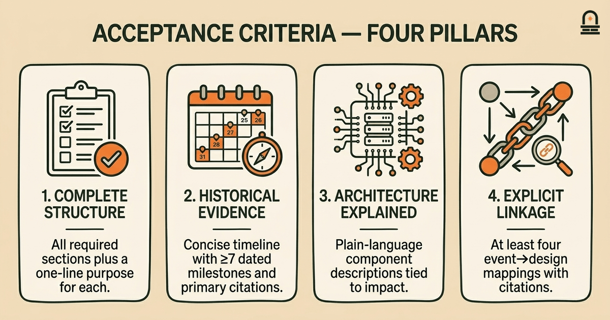
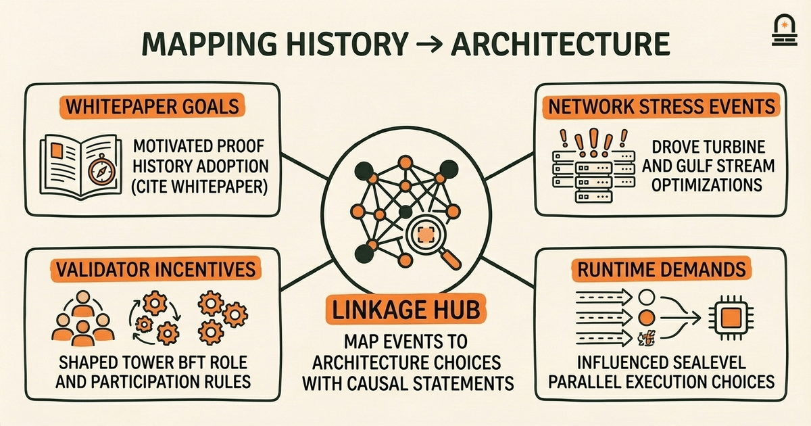
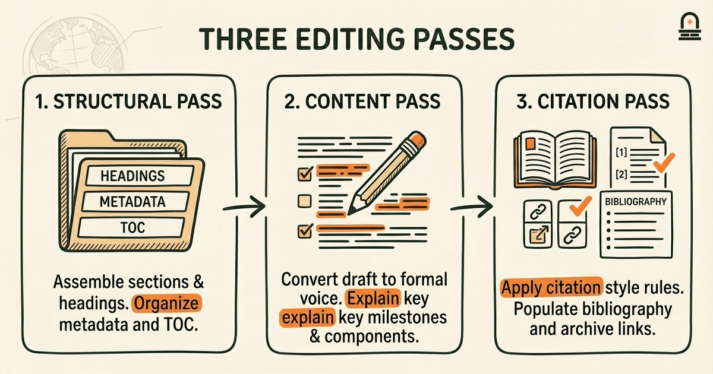
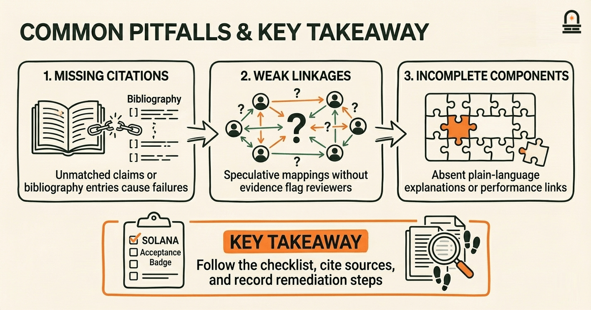

### Listen to the audio version

[Listen to this episode on Spotify](https://open.spotify.com/episode/5OLjz3HN0kmCWK2pjhZtLy)

---

**Objective:** Produce the comprehensive report summarizing Solana's historical development and architectural overview, polished to submission quality.

**Why now:** This lesson consolidates prior work into the final capstone deliverable on Solana's history and architecture.

**Concepts:** Solana history; Solana architecture; report synthesis and structure; sourcing and citation standards; executive summary and conclusions; revision and peer feedback

**Read time:** 20 min

---

## Recap & Introduction

You will consolidate your historical draft, architectural notes, and capstone outline into a single, submission-ready Solana report that connects chronology to design. You already produced three concrete deliverables: the capstone outline from "Framing the Capstone: Scope and Method for Solana's Story," the historical draft from "Synthesizing Solana History," and the architectural notes from "Analyzing Solana Architecture for the Report." These artifacts are the raw materials we now synthesize, polish, and format for formal submission.

From Lesson 1, you have a capstone outline that defined the report structure, evaluation criteria, and sourcing standards; that outline determined section order, target audience, and required evidence types. From Lesson 2, you have a historical draft containing a timeline of Solana milestones, primary-source citations, and narrative segments that tie events to technical decisions. From Lesson 3, you have architectural notes that describe core components such as Proof of History, Tower BFT, Turbine, Gulf Stream, and Sealevel, plus an analysis that maps those components to performance and usability outcomes.

We now bridge these prior pieces into a coherent whole: you will integrate the timeline and narrative voice from your historical draft with the technical explanations and diagrams from your architectural notes, then refine the capstone outline into a finalized table of contents and executive summary. The deliverable for this lesson is a polished, submission-ready comprehensive report that evidences explicitly how historical developments shaped architectural choices and includes a properly formatted bibliography and citations consistent with the standards you set in Lesson 1.

Practical expectations for this session: you will run a focused revision pass that enforces clarity, evidence, and linkage across sections; perform a citation and bibliography sweep to ensure all claims are sourced; and complete a peer-review checklist so the artifact meets the rubric-based validation process described in the module. We will not re-teach the technical components you already analyzed; instead we will show you precisely how to arrange, argue, and present them so the report meets the capstone success criteria and is ready to grade.

---

## Learning Objectives

By the end of this lesson you will be able to: clearly state a concise executive summary that captures Solana's developmental arc and main architectural principles; assemble a report structure that links historical events to specific architectural choices; edit and polish narrative sections for clarity, coherence, and evidence; apply consistent citation formatting and produce a complete bibliography; and pass a rubric-based peer review demonstrating the report meets submission standards.

Each objective maps to the deliverable checklist you used in Lesson 1 and the evidence-gathering practices from Lesson 2. You will use the architectural mappings from Lesson 3 to support explanatory claims rather than repeating technical descriptions. Success will be measured against concrete acceptance criteria in the next section.

---

## Acceptance Criteria

The acceptance criteria define exactly what "done" looks like for this capstone increment. You must produce a single document that meets the following checkable standards; each criterion below maps to the module rubric and can be validated by peers or instructors.

1) Structural completeness: the report contains a title page, executive summary (maximum one page), table of contents, introduction, historical timeline and narrative, architecture overview, linkage section that maps history to architecture, limitations/tradeoffs, conclusions, citations in-text, and a bibliography. Each major section must include a brief purpose statement so a reviewer immediately understands why it exists.

2) Historical evidence: the timeline is concise (one to two pages), includes at least seven dated milestones, and each milestone has at least one primary or high-quality secondary citation. Statements that attribute motives, decisions, or outcomes must cite the original source or a verifiable secondary report. Avoid speculative language; where uncertainty exists, label it and provide supporting evidence.

3) Architectural explanation: core components identified in Lesson 3 (Proof of History, Tower BFT, Turbine, Gulf Stream, Sealevel, validator roles) are explained in plain language and linked to concrete implications for throughput, latency, and developer experience. Each component explanation must include at least one sentence on why it mattered at a particular point in the historical timeline.

4) Explicit linkage: provide a dedicated section that maps at least four historical events to specific architectural choices. Each mapping must include a short causal statement (how the event influenced design) and a citation. For example, link the early performance goals documented in a whitepaper source to the adoption of Proof of History as a synchronization mechanism.

5) Citation and bibliography standards: all in-text citations follow a single consistent style (choose one: APA, Chicago author-date, or MLA) and every citation appears in the bibliography. Include URLs or DOIs for web sources and note dates accessed for dynamic pages. Provide full bibliographic entries for at least ten sources, of which at least three are primary-source documents (whitepapers, engineering blogs from the protocol team, or official docs).

6) Clarity and length: the report reads at professional level, avoids unnecessary jargon, and stays within the length guidance set in your capstone outline. Executive summary must be ≤300 words. The full report length target is 2,000–4,000 words depending on scope decisions in Lesson 1; justify deviations briefly in a metadata note.

7) Peer-review readiness: the report passes a peer checklist that includes: accurate table of contents, consistent heading levels, working citations, readable figures or diagrams (with captions), and a one-paragraph cover note listing outstanding questions and known limitations. Attach any raw diagrams or appendix material separately if needed.

Meeting these acceptance criteria means your artifact satisfies the module rubric and is ready for submission. If any item fails, flag it in the cover note and record which sections need further revision.

---

## Build / Implement / Test

Begin by creating a working document based on your capstone outline from Lesson 1. Use the outline as the skeleton and import the historical draft sections from Lesson 2 and the architectural notes from Lesson 3 into discrete folders or sections in the document. Your immediate task is organization: convert scattered notes into the final report flow, then run three types of passes—structural, content, and citation—to reach the acceptance criteria.

Step 1 — Structural pass: assemble the document in this order: title page, metadata (author, date, version), executive summary, table of contents, introduction (scope and methodology), historical timeline (concise), history narrative, architecture overview, linkage section (history ↔ architecture), limitations and tradeoffs, conclusions, acknowledgments, bibliography, and appendices. Use clear headings and subheadings so a reviewer can scan for required elements. Create a document metadata header noting the sources that remain to be integrated and the date of this revision.

Step 2 — Content pass: edit each imported section to shift from draft style to formal report voice. For the historical timeline, compress notes into dated bullets and then write 1–3 paragraphs that explain each milestone's significance. For architecture, convert your Lesson 3 component notes into explanatory subsections: define each component in simple terms, explain its mechanism at a high level, and describe its practical effect on performance and developer experience. In the linkage section write explicit statements that connect events to design choices; prefer active verbs and causal phrasing ("X motivated Y which produced Z").

Step 3 — Citation pass: choose a citation style and apply it consistently. Replace parenthetical web links in your drafts with properly formatted in-text citations. Populate the bibliography with complete entries and ensure each in-text citation has a matching entry. For online sources include access dates. If you use diagrams, add figure captions that reference their source or your own creation date.

Step 4 — Formatting and figures: ensure headings use consistent levels, fonts are readable, and any figures or tables include captions and alt text. Convert any hand-drawn or rough diagrams into clean digital images (simple labeled block diagrams are sufficient). For tables, include a table that summarizes the report structure and target lengths to help reviewers assess scope. For example:

| Section | Purpose | Target Length |
| --- | --- | --- |
| Executive Summary | Convey core findings in one page | <=300 words |
| Historical Timeline | Concise milestone list with citations | 1-2 pages |
| Architecture Overview | Explain core components and implications | 800-1,200 words |
| Linkage Section | Map history to architecture | 500-800 words |

Step 5 — Test edits: after these passes, read the report aloud to yourself or to a peer to catch awkward phrasing and verify logical flow. Confirm that every factual claim has a citation or a qualified note if uncertain. Use the peer-review checklist from the acceptance criteria to mark items as complete.

Submission/Demo checklist (attach as final page): a) Executive summary ≤300 words, b) Timeline with 7+ milestones and citations, c) Architecture subsections for each core component from Lesson 3, d) Linkage section mapping ≥4 events to architectural choices, e) Bibliography with ≥10 entries and 3 primary sources, f) Cover note listing remaining questions, g) Figures/tables with captions. If all boxes are checked, export to PDF and prepare your short cover email or submission form per course instructions.

If time permits, perform a final polish for tone and clarity: remove passive voice where it weakens causality, replace ambiguous qualifiers with evidence-backed phrasing, and ensure the bibliography entries use consistent punctuation and capitalization. Save a versioned copy and prepare the peer-review packet containing the report, a one-page peer-review guide, and any appendices or raw notes for transparency.

---

## Checkpoint: Verify Milestone Completion

At this checkpoint you will validate whether the document meets the acceptance criteria. Use the following concrete checks to determine if the milestone is complete. Each check is pass/fail and must be recorded in a short review note that accompanies your submission. If any check fails, list the remediation steps and estimated time to fix.

Check 1 — Executive summary validation: confirm the executive summary is present, is no more than 300 words, and accurately states the report's three main findings. Read the summary aloud to a peer or record it; a concise summary should be understandable without further context. If the summary omits an essential conclusion or overstates a claim, revise the wording and note the change.

Check 2 — Timeline and historical evidence: verify the timeline contains at least seven dated milestones and each milestone cites at least one primary or reputable secondary source. Open each citation and confirm it supports the underlying claim; correct mismatches immediately. For dynamic web pages include an access date and, where possible, archive the page using a web archive link recorded in your bibliography notes.

Check 3 — Architecture coverage: confirm each core component from Lesson 3 has a dedicated subsection, a plain-language definition, a brief mechanism description, and at least one sentence linking it to performance or developer impact. If a component lacks linkage, add a short explanatory paragraph referencing the source that supports the connection.

Check 4 — Linkage accuracy: examine the dedicated linkage section and ensure it contains at least four mappings from historical events to architectural choices. Each mapping must state the causal relationship and include a citation. If a mapping is speculative, mark it as "hypothesis" and add supporting evidence or remove the claim.

Check 5 — Citation and bibliography consistency: run a quick scan to ensure every in-text citation appears in the bibliography and that bibliography entries are complete with author, title, publisher, date, and URL or DOI where applicable. Use a consistent citation format. If you find dangling citations or missing details, update the bibliography and record the changes.

Check 6 — Peer-review readiness: ensure the peer-review packet contains the report PDF, a one-page peer-review guide explaining the rubric, and the cover note listing outstanding issues. Attach all figures and raw diagrams in an appendix. If the packet is incomplete, identify which component is missing and estimate the fix time.

Expected checkpoint outputs: a) a signed short review note with pass/fail results for each check, b) the finalized PDF report if all passes succeed, or c) a remediation plan with prioritized fixes if any check fails. When you pass all checks, mark the milestone as complete and upload the document to the submission area defined in the course instructions. If a peer flagged issues, schedule a short revision sprint and re-run this checkpoint after fixes.

---

## Conclusion & Key Takeaways

You should now have a clear path to transform the materials from Lessons 1–3 into a submission-ready comprehensive report that ties Solana's developmental history to its architectural design. Keep three guiding principles front and center: evidence anchors claims, explicit linkage shows causality, and clarity enables assessment. Evidence anchors claims by ensuring each historical or technical assertion has a verifiable source; without that, reviewers will treat statements as unsupported. Explicit linkage forces you to show why a design choice existed and how a milestone influenced it, which is the core intellectual contribution this capstone requires. Clarity means removing jargon, labeling assumptions, and presenting diagrams that can be scanned by a technical reviewer within minutes.

When you finalize the document, you will have converted scattered notes into a cohesive narrative that demonstrates both historical understanding and architectural literacy. That combined ability—narrative plus technical mapping—is what differentiates a good report from a submission-ready capstone. Carry forward the document metadata you created during the build process: versioning, remaining questions, and a peer-review log; these make grading transparent and show professional project practice. Completing this milestone positions you to move into next lessons that require hands-on Rust familiarity, where the polished report will serve as a reference for technical comparisons.

---

## Quick Recap

• Combine the capstone outline, historical draft, and architectural notes into one document.

• Follow the acceptance criteria: timeline with citations, architecture explanations, explicit linkages, and a complete bibliography.

• Complete the build passes (structural, content, citation), run the checkpoint checklist, and prepare the peer-review packet.

---

## Next Steps

After submitting this capstone increment, prepare for the next lesson, "Rust Syntax and Basic Types." The polished report you produce here will be a reference when you compare architectural design decisions to implementation choices in Rust. Save your final report and peer-review notes in an accessible location; in the next lesson you will start writing small Rust examples that relate to concepts like concurrency and state representation referenced in your architecture section.

---

## Glossary

### Executive summary

A concise one-page statement that captures the report's main findings, key evidence, and recommended conclusions for quick review.

### Proof of History (PoH)

A Solana-specific synchronization technique that orders events via verifiable timestamps, enabling high throughput while reducing global coordination overhead.

### Tower BFT

A Solana-adapted Practical Byzantine Fault Tolerance variant that uses PoH as a clock to streamline leader election and finalize blocks.

### Linkage section

A dedicated report section that maps specific historical events to architectural decisions with causal statements and supporting citations.

### Primary source

An original document or direct evidence such as a whitepaper, engineering blog post from the protocol team, or official documentation used to support factual claims.

### Peer-review packet

A submission bundle including the report PDF, a one-page peer-review guide, cover note listing open questions, and any appendices or raw diagrams.

### Turbine / Gulf Stream / Sealevel

Names of Solana runtime and networking components; each term denotes a system responsibility (propagation, transaction forwarding, and parallel runtime execution respectively).

---

## References & Further Reading

- [Solana: A new architecture for a high performance blockchain (Whitepaper)](https://solana.com/solana-whitepaper.pdf) — *Solana Labs* (Primary Source)
- [Solana Architecture](https://docs.anza.xyz/architecture) — *Solana Docs* (Official Documentation)
- [Cluster Overview and Validator Responsibilities](https://docs.anza.xyz/clusters) — *Solana Docs* (Official Documentation)
- [Agave Validator Architecture (design notes)](https://docs.anza.xyz/architecture) — *Agave / Anza Docs* (Engineering Blog)
