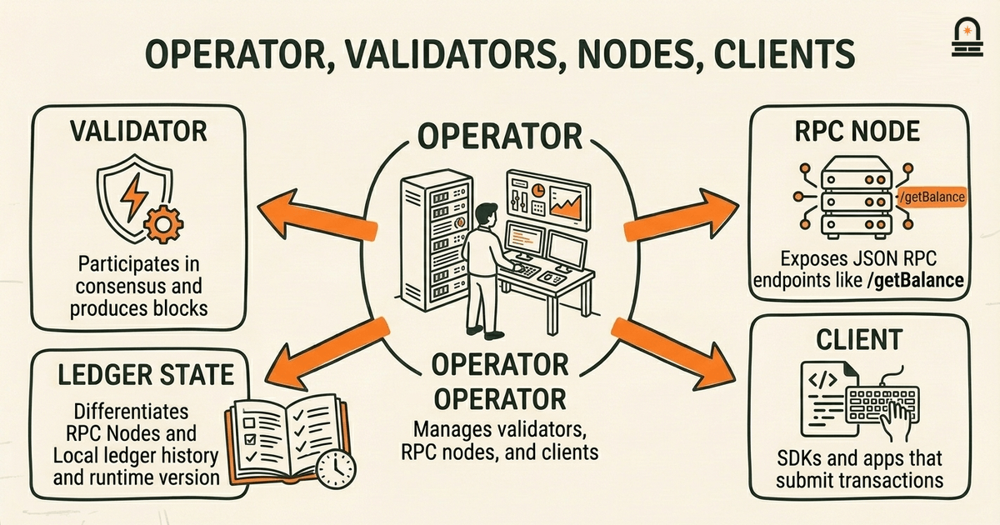
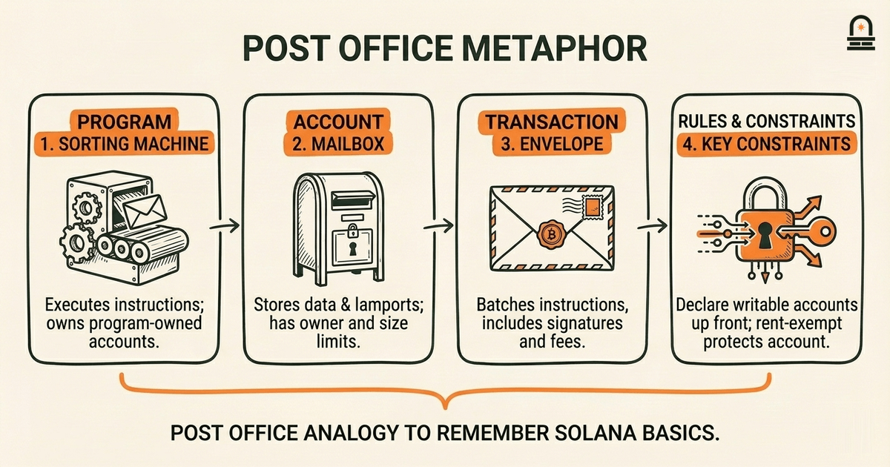
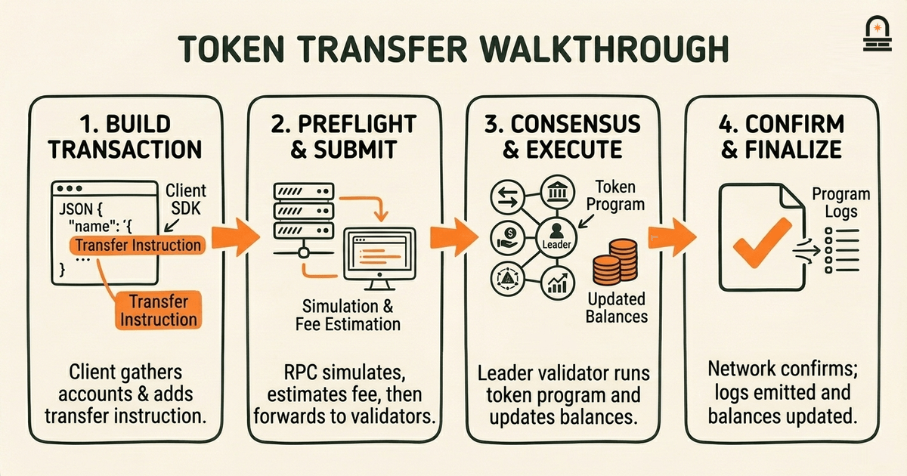

### Listen to the audio version

[Listen to this episode on Spotify](https://open.spotify.com/episode/3w6Yyueit3XjKyK9L1EH0E)

---

**Objective:** Explain the most common Solana terminology and interpret those terms in short, concrete scenarios.

**Why now:** Clarifying terms now helps learners confidently read documentation and project descriptions later.

**Concepts:** Definitions of validators, nodes, and clients in Solana terminology; Concepts of programs, accounts, and transactions in Solana terms; Units and fees as described in Solana terminology; Explorers and resource references common to Solana; How to read protocol-related glossaries and docs for Solana terminology

**Read time:** 20 min

---

## Recap & Introduction

You already know that Solana separates responsibilities across network participants and software: validators maintain consensus, programs implement logic, and clients submit transactions. From the previous lesson you should recall that a validator is not a single monolithic service but an actor running software on a node, and that developers mainly interact with programs and accounts rather than with validators directly.

We now move from that high-level map to the working vocabulary you'll encounter when reading docs, RPC logs, block explorers, and project READMEs. Clear, contextual definitions let you interpret short sentences like "the transaction failed because the account lacks rent-exemption" or "check the program logs for a program-id mismatch." By placing terminology into short, concrete scenarios you will reduce guesswork when you later inspect transactions or read protocol references.

Beginning in the next paragraph, we introduce the concrete terms you'll practice with here: validators, nodes, clients, programs, accounts, transactions, lamports and fees, and explorers and documentation references. You will see how each term is used technically, how they relate to each other in a transaction lifecycle, and how the same word can appear with slightly different meaning depending on context (for example, *account* as storage versus an account as a wallet keypair). That contextual interpretation is the core skill we build now so you can read Solana technical material with confidence.

---

## Learning Objectives

By the end of this lesson you will be able to:

- Explain the difference between validators, nodes, and clients and describe the practical role each plays during a transaction.
- Describe what Solana means by programs, accounts, and transactions and identify which pieces are mutable versus read-only in a typical operation.
- Interpret units and fees: convert lamports to the SOL unit used in documentation and explain how fees and rent interact with accounts.
- Locate and read basic transaction data in a block explorer, identifying signatures, status, logged messages, and implicated program IDs.
- Use a short checklist when reading protocol glossaries or docs so you can disambiguate terms that have multiple usage contexts in Solana.

---

## Core Concepts: Validators, Nodes, and Clients

Start by separating three related but distinct roles: validator, node, and client. A validator is an actor that participates in consensus and block production by proposing, voting, and executing the runtime. Practically, when documentation says "validator," it often refers to the software configuration and the economic identity that receives rewards and participates in consensus; the validator's public key and stake determine its weight in leader schedules. A node refers to the actual running process or instance—its machine, its RPC port, and its local ledger state. You will encounter "node" when reading about logs, runtime versions, or troubleshooting when an RPC endpoint behaves differently.

Clients are the programs or libraries that talk to nodes. When a README instructs you to "use the client SDK to submit a transaction," that means you run code that formats instructions, serializes a transaction, signs it, and sends it to an RPC node. Clients do not produce blocks; they only submit operations and observe chain state. Recognize that a single operator can run multiple nodes and clients: an operator might run a validator node for consensus and a separate RPC node for public queries, while developers use client libraries to submit transactions to that RPC node.

Mechanically, validators run the runtime that executes programs and updates accounts. Nodes expose RPC endpoints such as `/getBalance`, `/getTransaction`, and other methods specified in the Solana JSON RPC API. When an RPC node returns differing results from another node, the difference often traces to the node's ledger history or the RPC configuration (for example, whether it prunes certain data or indexes program logs). When reading operational guidance, pay attention to whether a document mentions "validator health," "node sync status," or "RPC endpoint"—each phrase signals a different troubleshooting surface.

Implication: when a guide tells you to "ask a validator to confirm", it usually means consult the state produced by consensus; when it tells you to "call the RPC", it references the node's API. This distinction matters when interpreting error messages. For example, a transaction rejected by an RPC node with a preflight error may still be acceptable to a differently configured node if that node offers different preflight simulation settings. Understanding these roles means you will better parse operational instructions and identify whether an instruction refers to consensus state (validator) or a service interface (node/RPC) that clients connect to.

---

## Mental Model: Programs, Accounts, and Transactions (the Post Office Metaphor)

**The Mental Model:** Use a concrete metaphor to hold details in memory: think of Solana as a distributed post office. Programs are the post office's rules and machinery—sorting machines and clerk procedures that define how items are processed. Accounts are the physical mailboxes and envelopes that carry data and tokens; they have owners, sizes, and balances. Transactions are the envelopes you hand to the clerk with instructions about which machines to run and which mailboxes to touch.

This metaphor helps you reason about mutability and authority. In Solana, programs own accounts when the account's `owner` field points to the program's ID; only the owning program can change an account's data. That is like a specialized mailbox that only a particular department's key can open. Accounts also carry lamport balances that pay for rent; think of those as the postage required to keep a mailbox active. When you inspect documentation that states "account must be rent-exempt," translate that to: the mailbox needs sufficient postage so it won't be reclaimed and deleted.

Below is a concise mapping table that you can reference while reading docs:

| Metaphor Element | Solana Term | Key Practical Detail |
| --- | --- | --- |
| Sorting machine / clerk | Program | Executes instructions; program ID determines authority over program-owned accounts. |
| Mailbox / envelope | Account | Stores data & lamports; has owner, rent-exempt threshold, and data size limit. |
| Customer handing envelope | Transaction | Batches instructions, includes signatures, pays fees, and declares which accounts are read or writable. |

Why this matters in practice: when you read a Solana doc that says "provide writable accounts in the transaction" you should immediately think about which mailbox needs to be opened and modified during execution. The transaction must declare writable accounts up front; you cannot add them while a program runs. That is equivalent to specifying which mailboxes a clerk is allowed to open when processing your envelope. If the account wasn't listed as writable, the program cannot modify its contents and the operation will fail with an account access error. Keep this mental model in front of you when reading contract docs, because many common errors trace to misdeclared accounts or mistaken ownership expectations.

Finally, this metaphor clarifies logs and returned errors. If a transaction fails with a "Program failed to complete" message, think of a machine jam: the clerk stopped processing when encountering an unexpected envelope format or missing postage. Knowing which account the machine was operating on (from logs or explorer trace) directs you to the exact mailbox and rule set to inspect next.

---

## Example Walkthrough: A Token Transfer Transaction (conceptual)

Walk through a concise, concrete scenario: a user sends an SPL token transfer from one wallet to another. This walkthrough focuses on how the terminology appears in practice; it is conceptual and intentionally avoids live commands.

Roles and artifacts: the sender and receiver each have a wallet keypair and an associated SPL token account (an `Account` that stores token balance for that mint). The token program is a deployed program with a known program ID; that program owns all SPL token accounts. The client is an SDK in your environment that constructs a transaction. An RPC node accepts the transaction and forwards it to validators for processing.

Step 1 — Build the transaction: The client gathers the required accounts: the sender's token account (writable), the receiver's token account (writable), the token program ID (read-only), and the system program when necessary. The client adds a Transfer instruction that names those accounts and encodes the amount. When you read a doc that lists "accounts: [sender, receiver, token_program]", interpret it as the transaction telling the runtime which mailboxes will be accessed.

Step 2 — Sign and submit (conceptually): The transaction requires the sender's signature to authorize moving tokens from their account. The client attaches signatures in the transaction header and sends the serialized transaction to an RPC node. The RPC node performs preflight simulation to detect obvious failures, quotes an estimated fee in lamports, and then forwards the transaction into the network for consensus.

Step 3 — Execution by the validators: A validator scheduled as leader includes the transaction in a block. During execution, the runtime invokes the token program logic with the provided accounts. The token program checks account ownership (verify both token accounts are owned by the token program), checks balances, subtracts lamports or token amount from the sender's account, adds them to the receiver, and emits program logs. If a required check fails—such as insufficient token balance or incorrect account owner—the program returns an error and the transaction reverts.

Step 4 — Outcome and explorer view: After the transaction is processed, explorers index and display its fields. When you open the transaction on an explorer, typical fields you will read include: signatures (the transaction signature), status (success or error), fee charged (in lamports), list of accounts touched with pre- and post-balances, program log messages, and the slot/confirmations. When a guide asks you to "inspect the program logs for the transaction signature," use the signature field to find the exact execution trace. Program logs often contain human-readable messages injected by the program developer which are invaluable for diagnosing why an instruction failed.

Implication: in documentation, when instructions list "preconditions" like "the receiver account must be initialized" they are telling you which mailboxes must already exist and be rent-exempt before the clerk handles the envelope. Recognizing each step and where specific terms appear will let you translate short protocol notes into concrete checks when you later inspect real transactions or read contract READMEs.

---

## Conclusion & Key Takeaways

Remember three practical principles. First, disambiguate role-based words: "validator" points to consensus actors and stake/leader responsibilities, "node" to a running process and RPC surface, and "client" to the program or library that composes and submits transactions. That distinction helps you interpret operational instructions and logs correctly.

Second, treat programs, accounts, and transactions as a small ontology you can reason about with the post office metaphor. Programs are the rules and machinery, accounts are the mailboxes storing state and lamports, and transactions are the envelopes that declare which mailboxes the clerk may open. This mental model is a compact diagnostic tool: when you see access errors, check ownership and whether the account was listed as writable in the transaction.

Third, when you read transaction outputs in explorers or RPC responses, focus on the specific fields that matter: signatures, status, fee in lamports, pre/post-balances for accounts, and program log messages. Those concrete data points are what documentation authors reference when they describe failures or success conditions. With these principles you will be able to read Solana protocol documentation more fluently and to map terminology to the core architecture concepts you studied earlier.

These takeaways prepare you to categorize projects and read ecosystem documentation with more precision. The next lesson maps project categories within Solana and expects you to identify what vocabulary indicates about a project's responsibilities and architecture choices.

---

## Quick Recap

- Validators = consensus actors; nodes = running processes and RPC endpoints; clients = SDKs or programs that submit transactions.
- Programs execute logic; accounts store state and lamports; transactions declare which accounts are read or written.
- Lamports are the smallest unit; fees and rent appear in transaction outputs and account balance deltas.
- Use explorers to find signatures, status, fees, account pre/post balances, and program logs when diagnosing behavior.

---

## Next Steps

Proceed to the next lesson, "Mapping Project Categories within the Solana Ecosystem," where you will apply the terminology from this lesson to classify projects by their architectural role. As you follow that lesson, use the checklist from the learning objectives: identify which components are programs, which are accounts, whether a project runs validators or relies on external RPC providers, and how fees or rent might affect its user experience. That mapping exercise depends on being able to read README examples and explorer traces with the vocabulary you practiced here.

---

## Glossary

### Validator

An actor running consensus software that proposes and votes on blocks; its stake and identity determine leader schedules and participation in consensus.

### Node (RPC Node)

A running instance of the Solana software that exposes RPC methods and maintains a local ledger; used by clients to query state or submit transactions.

### Client

A library or program that constructs, signs, and submits transactions to an RPC node; clients do not execute program logic themselves.

### Program

Deployed bytecode that defines on-chain logic; programs are invoked by transactions and can modify only accounts they own or are authorized to modify.

### Account

A storage unit on-chain that holds data and lamports; accounts have an owner program, a balance used for rent, and declared data size limits.

### Lamport

The smallest native unit on Solana used to measure balances, fees, and rent; documentation frequently reports fees in lamports.

### Transaction Signature

A base58-encoded string produced by signing a transaction; used to locate the transaction in block explorers and to verify submitter authority.

### Explorer

A web service that indexes blocks and transactions and displays signatures, status, fees, account pre/post balances, and program logs for inspection.

---

## References & Further Reading

- [Solana Docs: Core Concepts](https://solana.com/docs) — *Solana Foundation* (Core Documentation)
- [Solana JSON RPC API Reference](https://solana.com/docs/rpc) — *Solana Labs* (Developer Reference)
- [SPL Token Program](https://www.solana-program.com/docs/token) — *Solana Program Library* (Token Standards)
- [Solana Explorer](https://explorer.solana.com/) — *Solana Explorer* (Explorers & Tools)
- [Accounts and State on Solana](https://solana.com/docs/core/accounts) — *Solana Documentation* (Runtime & Accounts)
