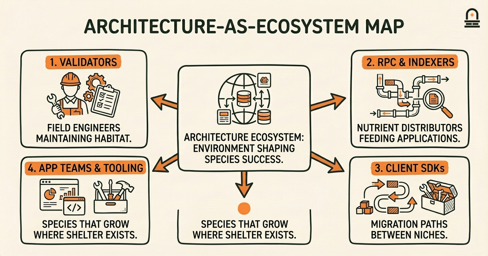
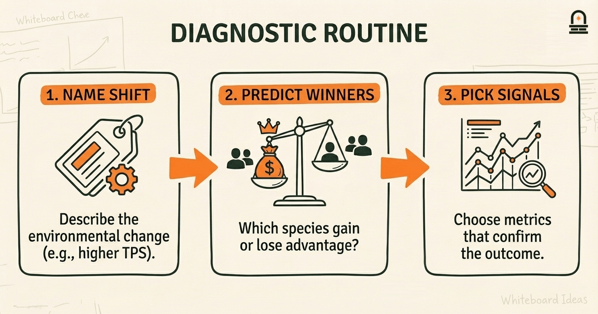
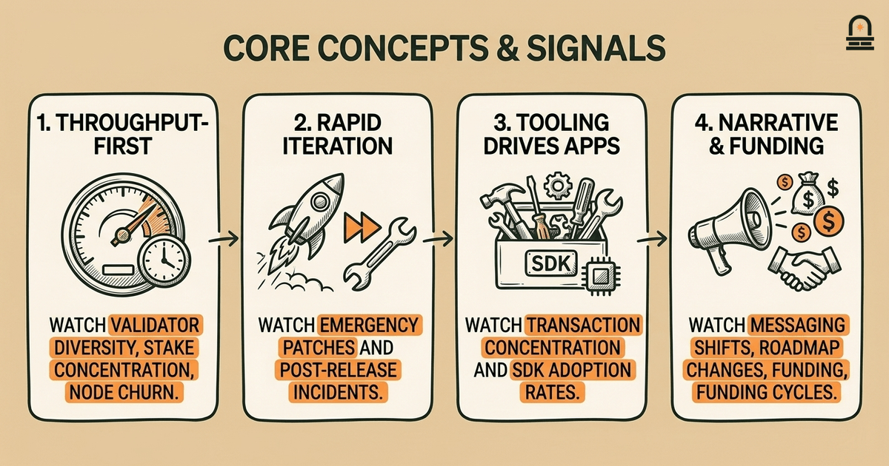
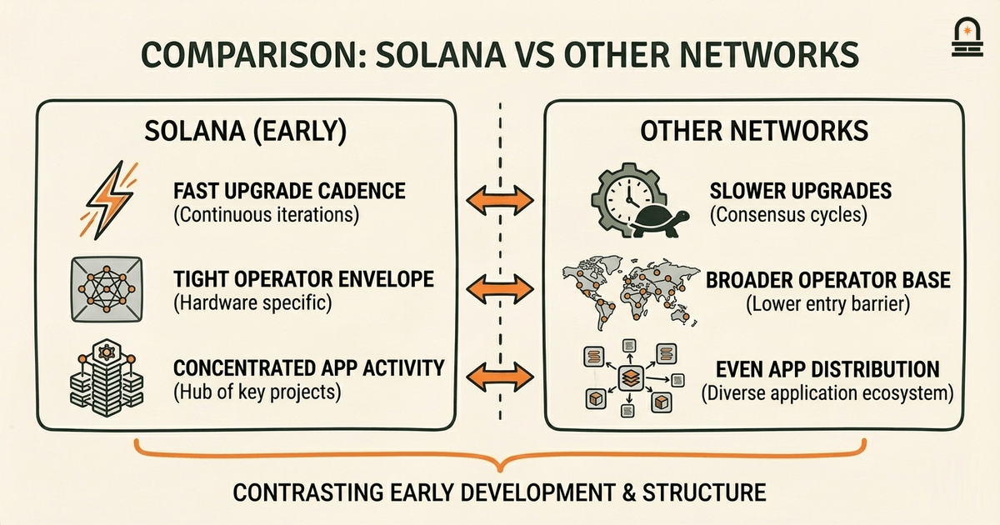

### Listen to the audio version

[Listen to this episode on Spotify](https://open.spotify.com/episode/6wLON5thqVCrqMZGlMX9Vh)

---

**Objective:** Reflect on the main lessons from Solana's early history and identify themes that shape future study of blockchain networks.

**Why now:** Concluding with reflection consolidates learning and prepares learners to compare with other networks.

**Concepts:** Recurring themes from early development; Tradeoffs that shaped strategic decisions; How early history informs later network behavior; Signals to watch in future network progress; Ways to critically evaluate historical narratives

**Read time:** 20 min

---

## Recap & Introduction

Critical reading sharpened your ability to spot authors' assumptions and implicit trade-offs inside Solana's whitepaper and follow-up technical notes, and you practiced annotating claims so they map to testable design questions. That specific skill—linking a claim to the hidden engineering choice behind it—is the bridge from criticism to synthesis you will use in this lesson.

We now shift from dissecting individual claims to stepping back and asking what the early history of Solana teaches as a whole. You will use the annotated claims and the milestone timeline you compiled earlier to identify recurring themes, translate those themes into practical signals to monitor, and form simple mental models that help you compare Solana's development arc with other networks. This synthesis is the logical next step because understanding isolated mechanics is incomplete until you can connect them to patterns of decision-making and outcomes over time.

By the end of this lesson you will be able to name the major recurring themes from Solana's early history, explain the tradeoffs that shaped early strategic choices, and apply a short checklist for critically evaluating historical narratives. Those skills prepare you to compare network-level behavior across blockchains and to pursue the next module on Bitcoin's network and transactions with a clearer lens for cause and effect.

---

## Learning Objectives

You will leave this lesson able to do the following concrete tasks:

- **Identify** at least three recurring themes from Solana's early history and link each to a concrete design or operational decision.
- **Explain** the main tradeoffs (throughput vs. resilience, centralization vectors vs. developer ergonomics) that influenced early roadmap choices.
- **Apply** a short checklist that helps you distinguish persuasive narrative from evidence-backed history when reading postmortems or team blogs.
- **Recognize** the specific signals—metrics, upgrade cadence, telemetry—that indicate whether a network is moving toward sustainable operation or repeated stress.

These objectives are testable: you should be able to list themes with supporting evidence, map tradeoffs to decisions, and use the checklist to annotate one historical claim from Module readings.

---

## Mental Model: Architecture as an Ecosystem

**The Mental Model:** Use the "architecture-as-ecosystem" mental model to reason about Solana's early history. In this model you treat protocol components, validator operators, tooling, and application teams as species in an ecosystem. Architectural choices are environmental conditions: higher throughput is like abundant but volatile food, lower-latency consensus is like a fast-moving current, and developer-friendly tooling is like rich shelter. The point of the model is to make tradeoffs tangible: an environment optimized for rapid growth favors species that can reproduce quickly but may under-support resilient, slow-growing species.

Mechanically, apply the model by mapping concrete elements to ecosystem roles: validators are field engineers who maintain habitat, RPC nodes and indexers are nutrient distributors, and client SDKs are the paths species use to migrate between niches. When a design choice increases throughput at the cost of complexity, imagine the current getting faster: some species (high-performance validators) can thrive, but many (casual operators) may struggle to stay connected. This helps you predict second-order effects, like operator centralization or the concentration of full-node infrastructure among specialized providers.

To operationalize the mental model, follow a short diagnostic routine when you read a historical event or design change: first, name the environmental shift (e.g., higher TPS goal, removal of a safety check). Second, predict which species gain advantage and which lose ground. Third, identify observable metrics that would confirm your prediction within months (validator count, RPC latency distributions, proportion of stake run by a few operators). That routine turns metaphor into testable hypotheses.

Applying the model to a concrete early Solana shift clarifies why outcomes unfolded the way they did. For example, when the project prioritized horizontal expansion of block processing and aggressive parallelization, the environment favored specialized validator implementations and high-margin cloud operators. The model suggests observable consequences: faster block production under ideal conditions, a narrower set of validator implementations in production, and greater reliance on sophisticated operator tooling. Those are precisely the patterns that later narratives attribute to early design choices; our job is to link the narrative to measurable signals rather than accept the narrative at face value.

Finally, use the model to evaluate corrective actions. If the ecosystem shows signs of fragility, interventions can be cast as environmental adjustments: add redundancy (introduce slower but more numerous species), simplify habitat (reduce operator complexity), or improve nutrient distribution (better RPC decentralization). The model keeps you focused on mechanisms—what changes the environment, how species respond, and which metrics capture the result—so you avoid purely rhetorical explanations about "community" or "vision." This is the kind of disciplined thinking you'll apply when comparing Solana's arc with other protocols.

---

## Core Concepts and Practical Signals

There are a few core concepts that recur in Solana's early history; each comes with practical signals you can monitor. Treat the concept as the high-level lesson, the mechanism as the chain of actions that produced outcomes, and the signal as what you should watch to test whether the lesson still applies.

Concept 1: Throughput-First Design Shapes Operator Ecology. Mechanism: engineering choices that prioritize high throughput often add implementation complexity and tighter performance envelopes for validators. Signal: validator diversity, percentage of stake controlled by specialized providers, and the frequency of nodes dropping out under stress.

Concept 2: Rapid Iteration Accelerates Feature Delivery and Exposure to Edge Cases. Mechanism: short release cycles and aggressive feature rollout expose the network to real-world traffic quickly, surfacing subtle bugs. Signal: cadence of emergency patches, number of post-release incident reports, and the ratio of planned upgrades to unplanned hotfixes.

Concept 3: Tooling and Developer Ergonomics Drive Application Concentration. Mechanism: rich SDKs and first-class examples lower integration cost, which encourages many teams to build on a single platform. Signal: distribution of application activity across projects, concentration of transaction volumes, and growth patterns in ecosystem tooling.

Concept 4: Narrative Framing Shapes External Perception and Funding. Mechanism: how teams communicate tradeoffs affects partner behavior and investment, which in turn changes incentives for protocol evolution. Signal: messaging changes around decentralization, observed shifts in governance or roadmap priorities, and funding cycles tied to new architectural commitments.

Use the table below as a quick reference for these core concepts and signals.

| Core Concept | Mechanism (How) | Observable Signal (What to Watch) |
| --- | --- | --- |
| Throughput-First Design | Complex validators, tighter performance envelope | Validator diversity, stake concentration, node churn under stress |
| Rapid Iteration | Short release cycles, aggressive rollout | Emergency patches, incident rate, hotfix frequency |
| Developer Ergonomics | SDKs, tooling, sample apps | App concentration, SDK adoption metrics, RPC request patterns |
| Narrative Framing | Public messaging, roadmap emphasis | Governance changes, partner commitments, funding timelines |

Why this matters in practice: you will use these signals to prioritize monitoring and to form evidence-backed comparisons. For example, if you are evaluating whether an observed outage reflects an isolated bug or a systemic fragility, check the emergency patch cadence and validator churn: a single bug with a fast, one-off patch points to implementation quality, while repeated outages with similar root causes and increasing centralization point to architectural stress. That distinction changes how you investigate further and what fixes you consider plausible.

---

## Comparison: What Solana's Early Lessons Suggest About Other Networks

**Key Differences:** Comparing Solana's early lessons with other network histories helps you tease apart which outcomes are protocol-specific and which are generic dynamics of nascent blockchains. Use the comparison to sharpen the checklist you will use when reading other projects: is the observed behavior a consequence of a unique architectural choice, or is it a common path for any project that prioritizes X? Keep the assessment neutral and evidence-focused.

Focus areas for comparison include upgrade cadence, operator diversity, and ecosystem concentration. Upgrade cadence matters because rapid iteration produces faster feature delivery but increases exposure to untested interactions. Many early networks that prioritized speed followed predictable patterns: short-term acceleration of features, followed by periods of stabilization and then refactorings. Networks that instead prioritized conservative upgrades tended to have slower innovation but fewer emergency patches. Comparing these outcomes helps you predict the tradeoffs you might see in Bitcoin-related developments, where change is intentionally slow and conservative.

Operator diversity is another comparative axis. When you compare Solana's early operator landscape to those of other chains, look at the path from early adopters (often large, technically sophisticated operators) to a more distributed operator base. Networks with tight performance envelopes or bespoke hardware/software requirements make it harder for casual operators to participate, increasing centralization risk. In contrast, networks that favor simpler, more forgiving implementations tend to maintain a broader operator base. This comparison gives you a concrete lens for reading claims about "decentralization": ask for stake distribution numbers, client diversity, and the proportion of nodes on commodity hardware versus specialized setups.

Application concentration is the third axis. If a network's SDKs and tooling are exceptionally easy, you may see rapid growth in a few dominant applications. That pattern is not unique to one chain; it is a typical ecosystem dynamic when developer ergonomics are strong but network economics favor scale. When comparing histories, separate tooling-driven concentration from economic design that incentivizes single large applications. The difference matters because tooling concentration can be addressed by ecosystem-level measures, while economic concentration requires protocol- or tokenomic-level interventions.

To evaluate historical narratives critically, adopt this short checklist when you read a postmortem or retrospective: (1) Identify the specific architectural choices made and the stated rationale; (2) Request or locate at least two independent measurable signals that support the narrative (logs, telemetry, stake distribution); (3) Check whether corrective actions address mechanisms or symptoms; (4) Consider alternative explanations that fit the same signals. Using this checklist converts persuasive prose into an empirical investigation and prevents you from accepting a single causal story without corroborating evidence.

Applying this comparative frame readies you for the upcoming module on Bitcoin. Bitcoin's history emphasizes conservative change and robust economic incentives; comparing it with Solana's early approach will illustrate how different priorities produce different operator ecologies, upgrade patterns, and application landscapes. That contrast is useful because it anchors your intuition about how design priorities map to long-term network behavior.

---

## Conclusion & Key Takeaways

You should now be able to translate isolated technical decisions into recurring ecosystem patterns: when a protocol prioritizes throughput and rapid iteration, expect specialized operators, concentrated applications, and a higher rate of emergency fixes until stabilization. That mapping is a practical rule of thumb that helps you evaluate claims about robustness versus performance.

Two concrete takeaways to carry forward: first, always pair narrative claims with at least two observable signals before accepting causal explanations; second, cast design choices as environmental changes in the architecture-as-ecosystem model to predict second-order effects like centralization or tooling concentration. These takeaways give you a disciplined way to interrogate both historical accounts and real-time reports.

We also leave you with a simple heuristic for future reading: classify each major historical event by its primary mechanism (code complexity, rollout cadence, economic incentive) and then ask which metrics would change if that mechanism truly drove the outcome. That habit moves you from rhetorical acceptance to empirical judgment and sets up an effective comparison with Bitcoin's network history in the next lesson.

---

## Quick Recap

- Identify recurring themes: throughput-first design, rapid iteration, tooling-driven concentration, and narrative framing.
- Use the architecture-as-ecosystem mental model to map choices to operator and app ecology.
- Watch concrete signals: validator diversity, emergency patch cadence, app concentration, and governance messages.
- Apply a short checklist to evaluate retrospective narratives against measurable evidence.

---

## Next Steps

Reflect on one or two items from your annotated readings: pick a claim about an outage or upgrade and apply the checklist from the comparison section. Identify the mechanisms claimed, list at least two observable signals that would support or contradict the claim, and note what additional data you would request to be confident.

After that exercise, prepare to read the next lesson on Bitcoin's network and transactions with a comparative mindset. We recommend collecting equivalent signals for Bitcoin where applicable—upgrade cadence, client diversity, and operator participation—so you can contrast how different priorities shape network outcomes in practice.

---

## Glossary

### Implicit trade-off

A design choice not explicitly stated but implied by architecture; it reveals which benefits are favored over others and affects long-term behavior.

### Validator diversity

The variety of independent software implementations and operators running consensus roles; higher diversity reduces single-implementation risk.

### Telemetry signal

A measurable metric—such as node churn, RPC latency, or emergency patch frequency—that provides evidence about network behavior.

### Operator ecology

The distribution and capabilities of parties who run nodes and infrastructure, including their incentives, concentration, and technical skill.

### Narrative framing

How a team or project describes events and tradeoffs publicly; framing shapes perception and can influence funding and partner behavior.

### Technical debt (protocol context)

Accumulated shortcuts or complex interdependencies in protocol code or design that increase maintenance burden and risk during upgrades.

### Upgrade cadence

The frequency and speed of protocol changes; rapid cadence increases exposure to interactions, while slow cadence favors stability.

---

## References & Further Reading

- [Solana: A new architecture for high performance blockchains (whitepaper)](https://solana.com/solana-whitepaper.pdf) — *Solana Labs* (Primary Source)
- [Solana Docs: Cluster Architecture and Validator Operation](https://docs.anza.xyz/clusters) — *Solana Documentation* (Technical Documentation)
- [Validator Monitoring Best Practices](https://docs.anza.xyz/operations/best-practices/monitoring) — *Agave / Anza Docs* (Postmortem & Analysis)
- [Bitcoin: A Peer-to-Peer Electronic Cash System](https://bitcoin.org/bitcoin.pdf) — *Satoshi Nakamoto* (Comparative Context)
