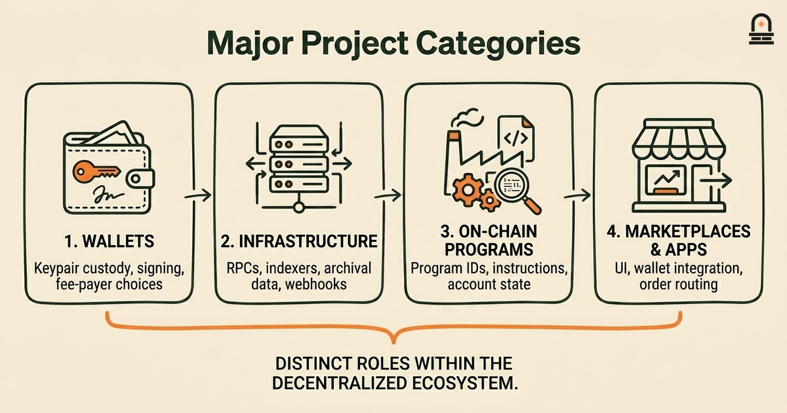
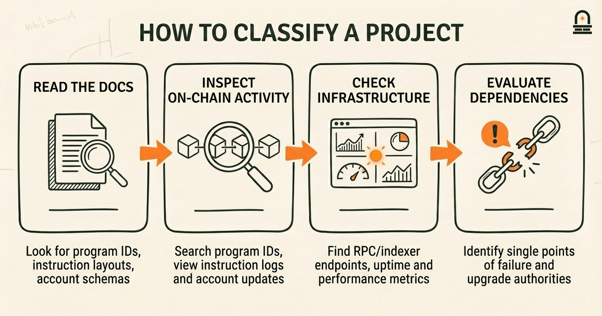
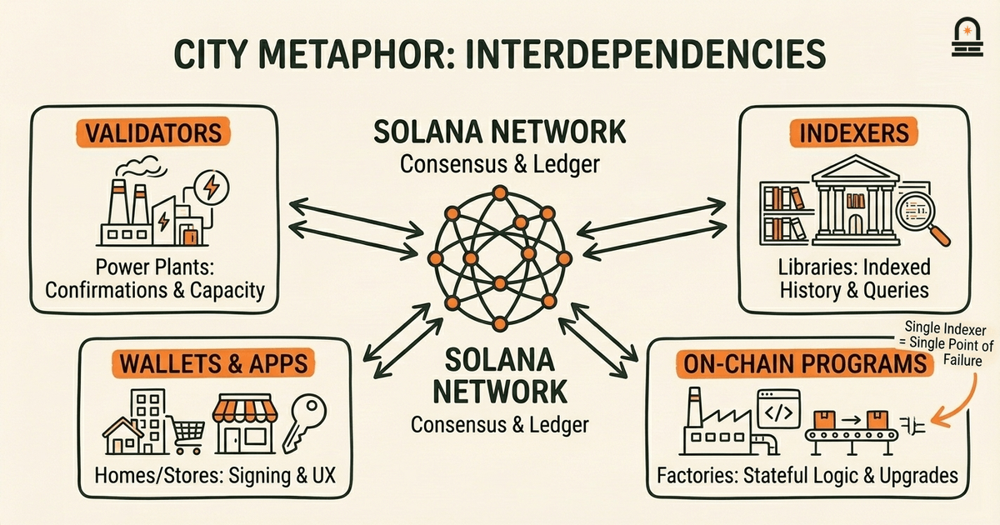

### Listen to the audio version

[Listen to this episode on Spotify](https://open.spotify.com/episode/5yYemH8NbCPdaeKX2vWpqQ)

---

**Objective:** Categorize major types of projects in the Solana ecosystem overview and describe how terminology maps to those project types.

**Why now:** With vocabulary in place, learners can classify projects and see how terms operate across real initiatives.

**Concepts:** Major project categories in the Solana ecosystem overview; How Solana terminology maps to different project types; Indicators of active developer participation and project health; Where to find authoritative resources inside the Solana ecosystem; Interdependencies between projects and platform services

**Read time:** 30 min

---

## Recap & Introduction

Validators in Solana process and confirm transactions, programs are on-chain executable code, and accounts hold state and tokens — you learned how these pieces fit together in the previous lesson. Recall specifically that a program does not store mutable user data itself; instead it operates on accounts passed in a transaction, and that transactions are the unit of change that validators agree on. That concrete separation between code (programs), data (accounts), and execution (transactions) is the practical vocabulary you'll use again in this lesson.

With that vocabulary in hand, you can now classify the kinds of projects that populate the Solana ecosystem. We move from definitions to mapping: you will group projects into categories like wallets, infrastructure, DeFi primitives, consumer apps, and tooling, and then connect each category back to the terminology you already know. This progression matters because knowing what a "program" or an "account" is only becomes useful when you can recognize which projects operate as programs, which ones primarily manage accounts, and which coordinate many programs across the network.

By the second paragraph we begin the core aim: you will see the major project categories on Solana, learn the identifying signals of healthy projects, and discover where authoritative ecosystem resources live. We will emphasize how terminology maps to function: for example, when you read a project's docs and it talks about "program ID" and "payer account", you will recognize whether you're looking at a wallet integration task, a program deployment, or an indexer/infrastructure responsibility. That mapping — from term to practical role — is the bridge this lesson provides between vocabulary and application.

---

## Learning Objectives

After completing this lesson you will be able to:

- **List and define** the major project categories found in the Solana ecosystem and describe the primary function of each category.
- **Map Solana terminology** (programs, accounts, validators, RPC nodes, SPL tokens) to concrete project responsibilities and design choices.
- **Identify indicators** of active developer participation and project health, such as repository activity, program upgrade patterns, and official roadmap signals.
- **Locate authoritative resources** for verifying project details inside the Solana ecosystem, including docs, program registries, and explorer pages.
- **Explain basic interdependencies** between categories (for example, how wallets, indexers, and on-chain programs interact) so you can reason about integration points and failure modes.

These objectives are concrete and testable: you will practice by classifying a few representative projects and justifying your classification using the terminology and indicators above.

---

## Core Concepts: Major Project Categories and How Terms Map to Roles

Start by treating the Solana ecosystem as a layered stack. At the lowest level sits the network itself: validators, blocks, and ledger state. Above that are infrastructure services — RPC nodes, indexers, and validators' telemetry — whose job is to expose ledger data and accept transactions. On top of infrastructure sit on-chain programs (smart contracts) that implement application logic. Off-chain clients — wallets, front-end apps, and backend services — craft and sign transactions and present UX around program interactions. When you map terminology to these layers, the mapping is concrete: a `program` implements logic that changes `accounts`, an RPC node exposes endpoints for sending transactions and querying account state, and a wallet manages keypairs and pays transaction fees.

Use the following table as a quick reference to map common Solana terms to project categories and their responsibilities. The table is not exhaustive but captures the most common pairings you will encounter.

| Project Category | Primary Responsibilities | Key Solana Terms You Expect to See |
| --- | --- | --- |
| Wallets / Key Management | Keypair custody, transaction signing, fee delegation, account creation | `payer`, `signature`, `account`, `associated token account` |
| Infrastructure (RPC, Indexers) | Expose ledger data, archive blocks, index events, deliver webhooks | RPC endpoint, slot, blockhash, program logs |
| On-chain Programs (DeFi, NFTs) | Encode and execute stateful logic; accept accounts as inputs | `program ID`, instruction, account meta, CPI (cross-program invocation) |
| Token Standards & Asset Tools | Define token behavior, minting, metadata, marketplaces | SPL Token, metadata account, mint, token program |
| Consumer Apps & Marketplaces | UI/UX, order routing, wallet integration, display of on-chain data | Transactions, confirmations, explorers, program interaction |

When you evaluate a project, focus on how it uses core terms. For example, a project that documents multiple `program ID`s is likely a suite of on-chain programs (infrastructure or DeFi protocol) rather than a pure front-end. Projects that emphasize indexer endpoints, webhooks, or archived logs are infrastructure providers. Projects that supply SDKs and examples centered on constructing and signing transactions are either wallets or application clients. These are practical heuristics: the terminology a project emphasizes reveals its architectural role.

Indicators of active developer participation are equally tied to these roles. For programs, look for frequent commits to the program repository, clear deploy scripts referencing program IDs, and on-chain evidence of upgrade activity or program interactions. For infrastructure projects, check uptime dashboards, RPC latency reports, and indexer sync status. For wallets and consumer apps, prioritize release notes showing compatibility with the current runtime and explicit test vectors for transaction construction. We will use these category-specific indicators in the worked example that follows.

---

## How This Shows Up in the Real World: Concrete Project Examples

You will better internalize categories by walking through three concrete projects and seeing how terminology and indicators appear in practice. For each example below, notice which terms are emphasized in docs, where state lives, and what external services they depend on. These examples show you how to classify projects quickly and defensibly.

Example 1 — A decentralized exchange built on Solana: A DEX will center on one or more `program ID`s that encode order matching, liquidity pools, and swaps. Documentation will include instruction layouts, account schemas, and examples showing how a user creates and funds token accounts (SPL tokens). A DEX repository often exposes tests that create accounts, mint tokens, and issue swap instructions. Developer health indicators include active test coverage, program upgrade notes, and on-chain transaction volume visible through explorers. You can verify program activity by searching the program ID in an explorer and observing instruction logs and account updates.

Example 2 — An indexer or RPC provider: This project emphasizes slot syncing, RPC throughput metrics, and historical block storage. Terms you will see are RPC endpoints, rate limits, event subscriptions, and webhook delivery guarantees. Documentation will include API reference for fetching transaction signatures, parsing program logs, and indexing account changes. Healthy infrastructure projects publish uptime and latency dashboards and maintain client SDKs showing example queries for program logs and deserialized account states.

Example 3 — An NFT marketplace and storefront: Marketplaces combine an off-chain UI, wallet integration for signing marketplace transactions, and on-chain programs that manage listings and bids. Look for metadata account discussions (SPL metadata), how royalties are encoded, and the expected flow of creating an associated token account, approving market program instructions, and settling transfers. Good marketplaces include concrete examples of the transaction sequence: create associated token account & approve transfer → call listing instruction with account metas → settle trade instruction. Their docs should reference explorers for traceability and show sample program IDs for their contracts.

Across these examples you will use the same classifier rules: where a project documents program IDs and account schemas, treat it as an on-chain program or protocol; where the documentation prioritizes API surface and data sync guarantees, treat it as infrastructure; where the emphasis is on signing flows, user keys, and UX, treat it as a client or wallet integration. These mappings are practical: they let you decide where to look for authoritative verification (on-chain explorers for programs, status pages for infrastructure, release notes and SDKs for wallets and clients).

---

## Mental Model: The City Metaphor for Interdependencies and Signals

**The Mental Model:** Use a city metaphor to reason about interdependencies. Treat the Solana network as the city's infrastructure: validators are power plants and transit hubs that keep the city running; RPC servers and indexers are the city's information kiosks and libraries that index and relay updates; on-chain programs are factories and public services that perform specific tasks; wallets and consumer apps are the people's homes and storefronts where citizens interact with services. This mental model makes it easier to see how changes in one part affect another.

When a factory (an on-chain program) changes its process — for example, a program upgrade that alters instruction layout — the storefronts (wallets, marketplaces) must update how they construct and deserialize transactions. If the city library (indexer) misses entries, storefronts will show stale data, leading citizens to retry operations. If a power plant (validator cluster) has reduced capacity, transaction confirmations slow and UX degrades. Mapping these roles clarifies dependencies: a healthy marketplace needs both stable factories (programs) and responsive libraries (indexers) plus reliable signing at homes (wallets).

Translate the metaphor back into concrete checks you can perform when classifying projects. For a program, ask: does the program have stable program IDs, visible on-chain activity, and documented account layouts? For an indexer, ask: does it provide historical queries, webhooks, and published sync status? For a wallet, ask: does it publish transaction construction examples, handle associated token accounts, and explain fee-payer choices? These questions map to the city roles and give you clear, testable diagnostics.

Using the metaphor also helps when evaluating interdependency risks. If a marketplace depends on a single indexer for order books, that is analogous to a storefront relying on a single library for inventory — a single point of failure. If a program's upgrade authority is centralized and not well-documented, that is like a factory with a single unlisted manager: the risk exists but is distinct from network-level risks. Keep the metaphor focused: it simplifies the architecture into stakeholders and dependencies so you can reason about where to verify facts and where to expect integration work.

Finally, the city model helps you prioritize signals of developer health. Frequent, readable commits to a program repository are like visible ongoing construction at a factory; uptime dashboards are like public notices at libraries; active SDK releases are like storefront window updates indicating compatibility with recent program changes. These analogies give you a quick checklist for classifying and validating projects in practical terms.

---

## Conclusion & Key Takeaways

You should now be able to categorize Solana projects into recognizable groups — wallets, infrastructure, on-chain programs, token tooling, and consumer apps — and map core Solana terms to the responsibilities each group carries. Remember three concrete takeaways: first, terminology reveals architectural role — if a project emphasizes `program ID` and account schemas, it's likely an on-chain program; second, project health signals depend on category — program health is best verified on-chain and via program logs, while infrastructure health is verified via uptime and latency dashboards; third, interdependencies matter — wallets, indexers, and programs form a chain where a change in one layer typically requires updates in others.

These takeaways are practical principles you can reuse when exploring ecosystem projects: use program IDs and explorer traces to validate protocol activity, consult RPC and indexer status pages for infrastructure reliability, and check SDKs and signing examples for client compatibility. We emphasized mapping because your next task is to use these mappings to find and vet resources; this lesson sets that foundation by giving you the classification tools and signals you need to evaluate projects quickly and defensibly.

Keep the city metaphor in mind as a reasoning shortcut: it makes interdependencies visible and helps you ask the right verification questions. That mental model will also make it easier to learn about incentives and mining concepts in later modules, because you'll already understand which roles capture stake, accrue fees, or depend on throughput and latency characteristics.

---

## Quick Recap

- Map terminology to role: `program` = on-chain logic; `account` = data/state; RPC/indexer = data access.
- Classify projects by what they emphasize in docs: program IDs → protocol; RPC metrics → infrastructure; signing flows → wallets/clients.
- Check health via category-specific signals: on-chain activity for programs, uptime/latency for infrastructure, SDK and release notes for wallets.
- Use the city metaphor: validators=utilities, indexers=libraries, programs=factories, wallets=homes.

---

## Next Steps

Your next concrete step is to study "Navigating Solana Resources and Next Steps," where we guide you to the official docs, program registries, and explorers that let you verify the classifications you've learned. For practice, prepare to classify three projects: one on-chain program, one RPC/indexer, and one wallet or marketplace, using the checks and terminology from this lesson. In that next lesson we will show exactly where to click and what pages to read to confirm program IDs, uptime, and transaction logs.

---

## Glossary

### Program ID

A unique on-chain identifier for a deployed Solana program; you use it to find program instructions, logs, and account interactions on explorers.

### Account (Solana)

An on-chain data container that stores mutable state and token balances; programs operate on accounts passed into instructions.

### RPC Node

A remote procedure call endpoint that accepts transactions and serves ledger data; infrastructure providers run RPC nodes to expose APIs.

### SPL Token

Solana's token standard for fungible and non-fungible tokens; includes mint, token accounts, and the token program which enforces transfers.

### Indexer

An off-chain service that processes ledger history to provide queryable event streams, account change histories, and program logs for applications.

### Associated Token Account

A standardized account for holding SPL tokens tied to a wallet address; many apps expect this pattern for token custody and transfers.

---

## References & Further Reading

- [Solana Developer Documentation: Programs](https://docs.solana.com/developing/programs/overview) — *Solana Labs* (Official Documentation)
- [SPL Token Standard (spl-token)](https://spl.solana.com/token) — *Solana Labs* (Token Standards)
- [Solana Explorer: Program and Transaction Search](https://explorer.solana.com) — *Solana Explorer* (Explorers & Tools)
- [Running an RPC Node and Best Practices](https://docs.solana.com/running-validator/validator-operations) — *Solana Labs Documentation* (Infrastructure Guides)
