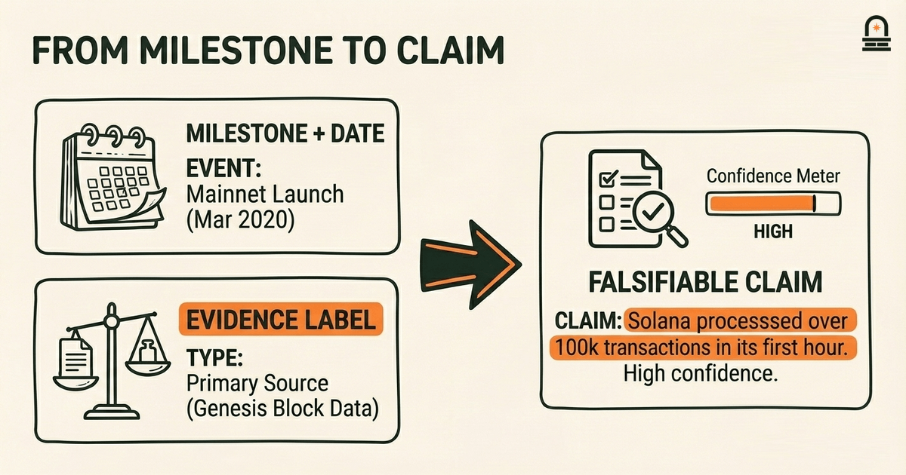
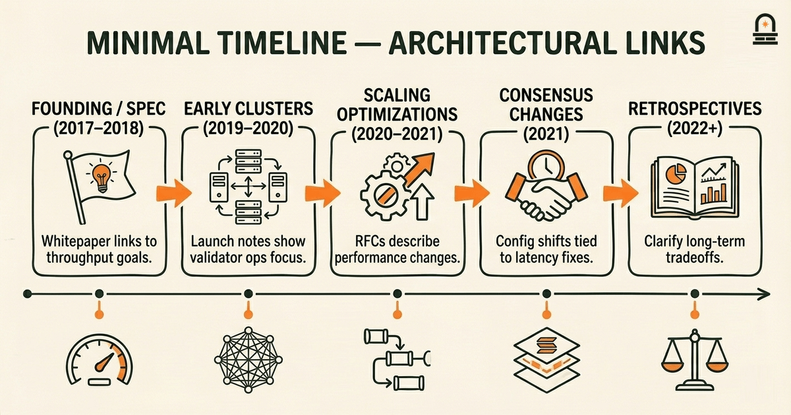
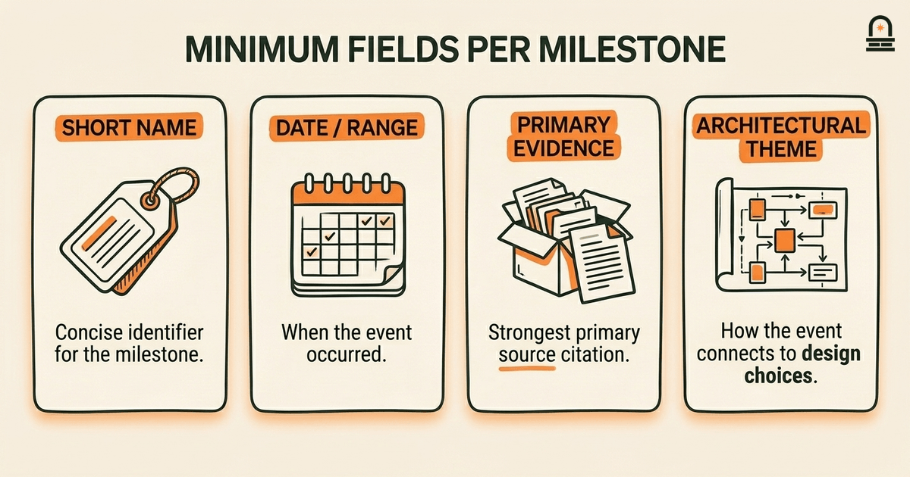
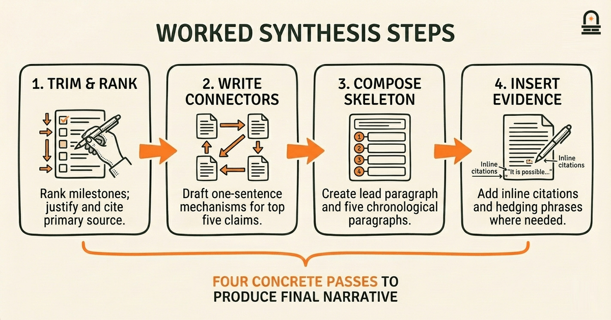
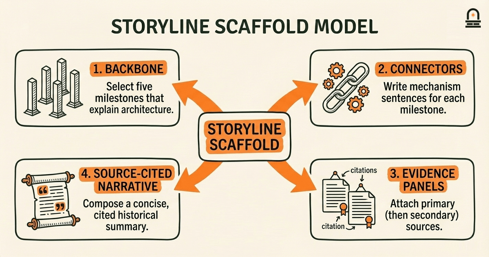

### Listen to the audio version

[Listen to this episode on Spotify](https://open.spotify.com/episode/15sbNKNncmhB7oXGYSXzcp)

---

**Objective:** Extract and synthesize key milestones and developments into a concise historical narrative focused on Solana's evolution.

**Why now:** This lesson turns planning into evidence-based historical synthesis for the report.

**Concepts:** Solana history; development timeline and milestones; founding and early development; evidence evaluation for historical claims; narrative synthesis techniques; linking historical events to architectural themes

**Read time:** 30 min

---

## Recap & Introduction

Solana's narrative is most useful when you organize events as evidence-backed milestones and then explicitly link those milestones to architectural changes. You already practiced that approach in the previous lesson by building a research plan and an evidence prioritization matrix that ranked primary sources, release notes, and contemporaneous blog posts above hearsay or retrospective summaries.

We will use that prioritized evidence and the structured narrative outline you created to produce a concise, source-cited historical summary suitable for the capstone report. By turning your raw notes and prioritized sources into a 500–800 word draft, you shift from planning to synthesis: selecting which milestones matter, evaluating their evidentiary weight, and tracing how those milestones shaped Solana's architecture. The key concepts you need for this work are already in hand: Solana history as a timeline of events, milestone selection and evidence evaluation, narrative synthesis techniques, and the practice of linking historical events to architectural themes.

Concretely, this lesson guides you to identify the major milestones that belong in a capstone historical section, attach source citations to each claim using the evidence priority rules from your plan, and write a compact narrative that connects at least two milestones to later architectural choices. We emphasize practical choices: what to include, what to leave out, and how to show causality or influence without overstating certainty. You will produce notes that form the first draft of the capstone's history section and that feed directly into the next lesson's deeper architecture analysis.

---

## Learning Objectives

By the end of this lesson you will be able to do the following in ways that are testable and reproducible:

- **Identify** the five to eight events that constitute Solana's major milestones and justify each choice using prioritized evidence from your research plan.
- **Evaluate** primary and secondary sources, applying the evidence prioritization matrix to decide which citations to include in a 500–800 word summary.
- **Synthesize** those milestones into a coherent, chronological narrative of 500–800 words that includes inline citations and at least two explicit links between events and architectural themes.
- **Prepare** the draft for peer review by flagging statements that rely on weaker evidence and annotating where additional sources would strengthen claims.

These objectives map directly to the capstone success criteria: identification of major milestones with evidence, clear sourcing, a 500–800 word summary, and concrete connections between events and architectural choices.

---

## Milestones, Evidence, and How to Turn Them into Claims

Start by turning every candidate milestone from your notes into a short, falsifiable claim. A claim follows the pattern: "Event X occurred at time Y and led to outcome Z." For example, using your evidence prioritization matrix, label each claim with the strongest available evidence type: primary (official release notes, whitepapers, contemporaneous blog posts by project maintainers), secondary (technical analyses, peer-reviewed papers, contemporaneous media coverage), or tertiary (retrospectives, encyclopedic summaries). That label is not decoration: it guides how confidently you state the claim and whether you add hedging language.

Next, construct a minimal timeline that places each claim in chronological order and identifies causal or correlative links that matter for the report. Causality in historical technical summaries rarely admits absolute proof, so explain mechanism where possible: if a performance bottleneck prompted a protocol change, show the technical mechanism connecting the bottleneck to design choices. Use short explanatory statements to link events to architecture: for instance, tie a change in consensus configuration to an architectural theme such as throughput optimization or validator economics.

Operationalize this work with a compact table that you can paste into your notes. The table below models the minimum fields to collect for each milestone: a short name, date or date range, the strongest primary evidence you have, and the architectural theme that connects the milestone to later design choices. Populate this table directly from your prioritized sources to keep claims grounded.

| Milestone | Date | Primary Evidence | Architectural Theme |
| --- | --- | --- | --- |
| Founding / Early Spec | 2017–2018 | Project whitepaper / early blog post | Consensus & transaction throughput |
| Mainnet Launchs & Early Clusters | 2019–2020 | Release notes / network announcements | Network stability & validator operations |
| Scaling Optimizations | 2020–2021 | Technical blog posts / RFCs | Performance engineering & parallelization |

For each table row, write a one-sentence evidentiary note: where did you find the primary evidence, and what does it say? Then write a one-sentence architectural link: how does this milestone help explain an aspect of Solana's architecture? That two-sentence minimum per milestone keeps you honest: it forces both documentation and interpretation.

When you convert the table into prose, follow chronological order and use the evidence label to qualify your language. If you only have secondary evidence for a claim, use language such as "contemporaneous reporting indicates" or "subsequent analyses suggest" rather than declarative verbless assertions. If you have primary evidence, quote or paraphrase briefly and include the citation inline or in a footnote format consistent with the capstone's citation style.

Finally, prioritize concision: a capstone history section is not a comprehensive history. Choose the milestones that are most explanatory for your architectural narrative and omit peripheral events unless they illuminate a specific technical theme. If you keep more than eight candidate events, create a short "also notable" list in your notes but do not force every item into the 500–800 word summary.

---

## How This Shows Up in the Real World: A Worked Synthesis

Imagine you have the following raw deliverables from previous lessons: a completed evidence prioritization matrix, a folder of scraped primary sources (release notes, official blog posts, the whitepaper), and a structured narrative outline that names seven candidate milestones. Your task is to convert these artifacts into a 500–800 word historical summary that is source-cited and connects at least two milestones to architectural choices. The steps below are the exact actions you should take, with expected outcomes for each step.

Step 1 — Trim and rank: Open your list of seven candidate milestones and rank them by explanatory power: which events best help a reader understand why key architectural choices exist? For each milestone write a one-line justification and cite the strongest primary source. Expected outcome: a ranked list of five to seven claims, each with a one-line justification and a primary-source citation.

Step 2 — Write connective sentences: For the top five claims, draft one-sentence architectural links that explain mechanism. For example, if release notes describe a change to the transaction processing pipeline, your link sentence should explain how that change affects parallelization or validator resource use. Expected outcome: five short link sentences that can be dropped directly into the final narrative.

Step 3 — Compose the narrative skeleton: Using the structured narrative outline from the prior lesson, place the ranked milestones into the outline and write a single lead paragraph of 40–75 words that frames the summary's central thesis (for example: a focus on engineering tradeoffs between throughput and decentralization). Expected outcome: a draft with a lead paragraph and five chronological paragraphs, each 50–120 words long.

Step 4 — Insert evidence and hedging: For each paragraph, add an inline citation to the primary source and a short parenthetical hedging phrase when the evidence isn't direct. Expected outcome: paragraphs that read as authoritative where evidence is primary and appropriately cautious where evidence is secondary.

Step 5 — Tighten and trim: Aim for 500–800 words total. Remove any paragraph that repeats context without adding the architectural link. Expected outcome: a coherent 500–800 word draft ready for peer review with explicit citations and at least two paragraphs that link events to architecture.

To make this concrete, here is an illustrative paragraph you can adapt for your draft. Note the structure: event, evidence citation, technical mechanism, and architectural implication.

*Illustrative paragraph (adapt and cite):* "Early public documentation and the project's whitepaper described a prioritization of single-shard high-throughput design (see primary spec). Subsequent release notes documented iterative changes to the transaction processing pipeline that increased parallel verification opportunities, indicating a deliberate engineering trajectory toward optimizing throughput. Those changes help explain later architectural choices around validator resource utilization and the decision to favor optimistic ordering strategies over multi-shard coordination (primary release notes, technical blog posts)."

Use that template: event statement, citation, mechanism explanation, architectural implication. After completing the draft, annotate any statements that rely on weaker evidence so that peer reviewers know where to ask for more support. That annotated draft is the artifact you will submit for the capstone historical section and the starting point for peer review against the success criteria.

---

## A Mental Model for Synthesis: The Storyline Scaffold

**The Mental Model:** Adopt the "Storyline Scaffold" mental model: think of the historical summary as a short scaffold that supports three layers of content — backbone, connectors, and evidence panels. The backbone is the chronological spine: the handful of milestones you selected because they best explain architectural outcomes. Connectors are short sentences that translate events into mechanisms ("release X reduced latency by changing Y"). Evidence panels are the citations and brief quotes that give each backbone item weight.

This model helps you keep different kinds of writing tasks separate and manageable. Treat backbone construction as a selection problem: which milestones produce the strongest explanatory backbone? Treat connectors as translation: convert each backbone item into a mechanism sentence that is readable by someone who understands the architecture but not the history. Treat evidence panels as cataloging: attach one primary source and one secondary source (when available) to each backbone item to show you did the archival work.

Operationally, apply the Storyline Scaffold in three passes. First pass: make the backbone by selecting five milestones and writing a one-line summary for each. Second pass: write connector sentences that explicitly explain how each milestone leads to an architectural theme — prioritize plain language and avoid jargon unless the architectural term is necessary. Third pass: add evidence panels by citing the strongest primary source and, where primary sources are thin, one secondary analysis. The separation of passes prevents editing-for-evidence from crowding out the initial creative synthesis.

To visualize the scaffold, imagine a short scaffold diagram where vertical posts are milestones and horizontal planks are connector sentences; evidence panels hang off the planks like placards. That visualization matters because it forces you to check whether each milestone has both a connector and an evidence panel. If a milestone lacks either, it is a candidate for omission or for further research.

Use the Storyline Scaffold to handle uncertainty. When evidence is inconclusive, mark the evidence panel as "requires confirmation" rather than deleting the connector. That keeps the narrative draft coherent while signaling where reviewers should probe. The scaffold also helps you prioritize edits: tightening backbone length for word-count limits first, then refining connectors for clarity, and finally strengthening evidence panels for credibility.

Finally, remember that a scaffold is designed to be temporary: the final draft should read fluidly without the scaffold structure visible to the reader. The scaffold is a production tool that keeps you focused on the three distinct tasks required to produce an evidence-based, architecture-linked historical summary.

---

## Conclusion & Key Takeaways

You should now have a clear, repeatable method for turning your prioritized research artifacts into a concise historical narrative that supports the capstone's architecture analysis. First, select a limited set of explanatory milestones and label each claim with the strongest available evidence; this keeps your narrative grounded and defensible. Second, write explicit connector sentences that translate events into mechanisms that plausibly influenced architectural decisions; these sentences are the analytic heart of the historical section. Third, annotate weaker claims so peer reviewers know where additional corroboration is needed.

Two principles to remember as you finalize your draft: prioritize evidentiary strength over exhaustiveness, and prefer mechanism-based links to simple chronological associations. Those principles keep the historical section both credible and useful for the next stage of the capstone, which dives into architecture. The draft you produce here should therefore both stand on its own as a 500–800 word historical summary and serve as a source map for the upcoming architecture analysis lesson.

---

## Quick Recap

- Select five to eight explanatory milestones and justify each with primary or strong secondary evidence.
- Use the Storyline Scaffold: backbone (milestones), connectors (mechanisms), evidence panels (citations).
- Produce a 500–800 word draft that links at least two events explicitly to architectural choices and annotate weaker claims for peer review.

---

## Next Steps

Submit your 500–800 word historical draft and annotated evidence panels for peer review against the capstone checklist. Use the peer feedback to strengthen evidence panels flagged as weak. After peer review, prepare to use this draft as the historical context in the next lesson, "Analyzing Solana Architecture for the Report," where we will extract the architectural themes you identified and analyze them in technical detail.

Before the next lesson, collect any additional primary sources your reviewers request and create a short one-page evidence map that links each paragraph in your draft to its primary citation. That map will speed the architecture analysis and ensure the capstone's historical and technical sections align tightly.

---

## Glossary

### Milestone

A discrete historical event or release that materially affected Solana's protocol, network operations, or design direction.

### Primary Source

Contemporaneous documentation such as whitepapers, official release notes, or project blog posts that directly record decisions or implementations.

### Secondary Source

Analyses, technical write-ups, or media coverage produced after an event that interpret primary sources rather than originating them.

### Architectural Theme

A recurring technical idea or design priority (for example, throughput optimization, parallelization, or validator economics) that links multiple events to system behavior.

### Evidence Prioritization Matrix

A decision tool you used to rank sources by trustworthiness and relevance to determine which citations to rely on in the draft.

### Connector Sentence

A short sentence that translates a historical event into a plausible technical mechanism or architectural consequence.

### Evidence Panel

A compact annotation for a milestone that lists the strongest primary source and any supporting secondary sources.

---

## References & Further Reading

- [Solana: A new architecture for high performance blockchains (whitepaper)](https://solana.com/solana-whitepaper.pdf) — *Solana Labs* (Primary Technical Source)
- [Solana Documentation — Introduction and Core Concepts](https://solana.com/docs) — *Solana Docs* (Official Documentation)
- [Solana Blog and Release Notes](https://solana.com/news) — *Solana Blog* (Official Blog / Release Notes)
- [Solana Labs on Medium — technical publications](https://medium.com/solana-labs) — *Solana Labs* (Technical Analysis)
- [Agave Releases (release history)](https://github.com/anza-xyz/agave/releases) — *Anza / GitHub* (Historical Timeline)
