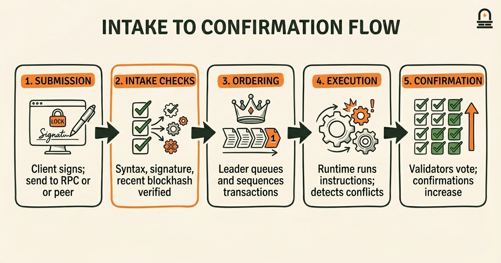
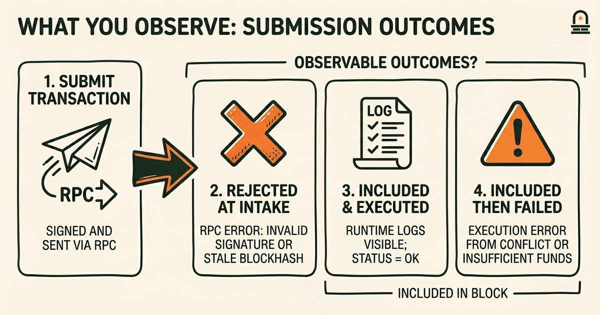
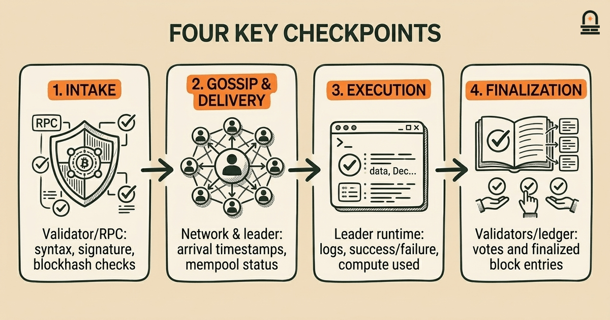

### Listen to the audio version

[Listen to this episode on Spotify](https://open.spotify.com/episode/0799sr4B2hqZTAIszRAYFC)

---

**Objective:** Trace the lifecycle of a transaction through submission, validation, ordering, and confirmation within the architecture.

**Why now:** After learning components and roles, tracing an actual transaction shows those pieces in action.

**Concepts:** transaction submission pipeline; signature and basic validation steps; ordering and conflict handling overview; finalization and confirmation concepts; latency and throughput considerations

**Read time:** 35 min

---

## Recap & Introduction

Transactions on Solana begin as messages routed into the network; you just met the concrete responsibilities of runtime components that receive, forward, and store those messages. Recall that validators run the runtime which executes programs, maintain the ledger’s state snapshots, and participate in gossip-based message routing. That concrete idea — that separate components own message intake, state application, and inter-node propagation — is the foundation you need to trace a transaction from submission to confirmation.

We now move from static roles to flow: you will trace what happens to a single transaction as it travels through submission, signature checks, preliminary validation, ordering, execution, and final confirmation. By connecting the runtime components you learned about to each stage of a transaction’s lifecycle, you will see how network routing, leader scheduling, the transaction processing pipeline, and state checkpoints interact. This lesson is next because understanding component boundaries isn’t enough until you see them coordinate under a live transaction workload.

Begin thinking of the transaction lifecycle as a short assembly line. Early stages focus on syntactic and signature correctness; mid stages focus on ordering, conflict detection, and execution by the scheduled leader; late stages focus on propagation of results, voting, and confirmation. The key concepts you will work with are the transaction submission pipeline, signature and basic validation steps, ordering and conflict handling, finalization versus confirmation, and how latency and throughput shape tradeoffs. We emphasize practical checkpoints: where a transaction is checked, which component performs that check, and what guarantees (or lack of guarantees) each checkpoint provides.

Throughout the lesson you will map each stage to the responsible component and to the verification checkpoint that proves the transaction progressed correctly. We will not perform live network operations; instead, you will build a conceptual comparison table that links stages, components, and checks so you can apply the same mapping when reading Solana protocol docs or inspecting validator logs. By the end, you will be able to point to a log entry or an RPC response and explain which stage it corresponds to and what verification you should expect.

---

## Learning Objectives

By the end of this lesson, you will be able to map each stage of a Solana transaction lifecycle to the responsible subsystem or process, explain what verification occurs at that stage, and describe the implications for latency and throughput. You will identify where signature checks, fee checks, ledger-state reads, and conflict detection occur and which component performs each. You will also produce a comparison table that links stages to verification checkpoints and expected observable artifacts (logs, RPC responses, or signatures).

Specifically, you will be able to: (1) describe the submission pipeline from client to entry point; (2) list the basic validation steps performed before ordering; (3) explain how leaders order and handle conflicting transactions; (4) distinguish confirmation from finalization in the Solana model; and (5) reason about how each stage contributes to end-to-end latency and sustained throughput. These objectives are testable: you should be able to reconstruct the mapping table from memory and to explain which checkpoint you would inspect to debug a stuck transaction.

---

## Core Transaction Concepts: Submission, Validation, Ordering, Confirmation

Start with the submission pipeline: when you construct a transaction off-chain, it contains instructions, account addresses, and a set of signatures proving authority. You sign locally and submit the transaction to a nearby RPC endpoint or directly to a validator over gossip or QUIC-style transport. At intake, the receiving node treats the message as an unprocessed candidate and performs syntactic and signature checks to confirm the message is well-formed. These receipt checks are designed to reject malformed or unsigned packets quickly so that downstream components only see plausible transactions.

Signature verification is the first meaningful cryptographic hurdle. A node verifies that the set of signatures matches the required signer set for the transaction’s instructions. This check uses the transaction’s `recent_blockhash` field to attach liveness bounds and prevent replay across epochs. If the signature block is invalid or the recent blockhash is stale, the node rejects the transaction at intake; you will see this reflected in RPC error responses that explicitly mention signature verification or blockhash expiry. The design keeps expensive operations off the leader queue if a transaction is already invalid.

After syntactic and signature checks, the node performs basic validation: fee-paying account checks, account existence checks, and a cheap preflight simulation used by RPC endpoints to forecast failure. This preflight is an optional client-facing step that replicates a subset of runtime checks without committing state. Its practical role is to avoid submission of doomed transactions and to give you deterministic failure reasons. The node also tags the transaction with metadata (arrival timestamp, originating peer) used later for ordering and metrics. Note how these early checks are primarily defensive: they prevent spurious load on the more expensive ordering and execution stages.

Ordering occurs when the scheduled leader for a slot collects transactions into a block (or packet of entries) and sequences them. Leaders choose transactions using heuristics that prioritize fees and aim to maximize throughput while avoiding conflicts. Conflict detection here is primarily optimistic: the leader sequences transactions and later, during execution, identifies read/write set conflicts against current state. If a transaction conflicts when applied, it fails at execution time and the failure is reflected in the transaction result and propagated in votes.

Confirmation and finalization are distinct outcomes. Confirmation refers to the degree of endorsement a block has from subsequent leaders/voters — you will see confirmations increase as more blocks build on top of the block containing your transaction. Finalization is the point at which the cluster considers the transaction irreversible under normal operation, often after supermajority voting or checkpointing policies. Solana’s approach emphasizes fast confirmation times with probabilistic finality; that balance impacts how you interpret observed confirmations versus absolute guarantees.

Across these stages, latency sources include network propagation to nodes and to the leader, signature verification time, queuing delays on leaders under high load, and execution time inside the runtime. Throughput is shaped by leader slot duration, block packing policies, the efficiency of forward propagation, and conflict rates among transactions. Understanding each stage’s responsibilities clarifies which logs and metrics to inspect when a transaction is slow, rejected, or repeatedly failing.

---

## How This Shows Up in the Real World: A Concrete Trace

Imagine you submit a transfer-like instruction from your client through an RPC node. The immediate artifact you receive is either an RPC success with a submitted signature or an error explaining rejection. If you receive a submission acknowledgement, the RPC node has performed intake checks and forwarded the transaction to the gossip network and to prospective leaders. Practically, the first thing you will observe is whether the RPC returned a `blockhash not found` or a signature validation error; these indicate failures at the intake checkpoint before ordering.

Next, the transaction arrives at the scheduled leader for the upcoming slot. The leader collects transactions and constructs an entry that includes your signed message. In practice, you will either observe the transaction included in recent block fetches or you will not. If included, the leader will run the transaction through the runtime: it loads account state, executes the program instructions, updates account balances, and emits logs and compute meter usage. Concrete signs of execution include logs visible in transaction metadata returned by RPC `getTransaction` calls and a status that indicates `Ok` or a runtime error such as an insufficient funds or account-not-found failure.

Conflict handling appears when two transactions touch the same writable accounts. Suppose you concurrently submit two transactions that both debit from the same account. A leader may order them back-to-back; the first will execute and update state, while the second will fail during execution due to a change in the account’s expected state or an insufficient balance. The observable result is one successful status and one failed status in the transaction receipts. For higher-level debugging, you examine the transaction logs and the slot in which each was confirmed to see sequencing.

After execution, the leader broadcasts the block and the validator set votes on the block’s validity. You will see confirmations increase as downstream validators include votes referencing the leader’s block. Practically, the RPC endpoint exposes a confirmation count and block height; watching these values over time demonstrates how confirmation accrues. If the cluster observes enough votes according to its policy, the block moves towards finalization. From an operational perspective, finalization-related events are slower and appear as persistent block commitment in archival nodes and in finalized block queries.

Finally, latency and throughput considerations surface in repeated traces. Under low contention and light load, the end-to-end latency from submission to one confirmation may be tens to hundreds of milliseconds; under heavy load, queuing delays on leaders and repeated conflict retries inflate latency and reduce effective throughput. Concrete debugging steps you will take include checking intake rejection messages, tracing inclusion in a slot via `getSignatureStatuses`, inspecting execution logs via `getTransaction`, and watching confirmation counts. These steps map directly to the verification checkpoints we will include in the comparison table artifact so you can reason about where a problem originated.

---

## Comparison Table: Stages, Responsible Components, and Verification Checkpoints

**Key Differences:** Below is a structured mapping you will use as your artifact: for each transaction stage, the responsible component(s), and the verification checkpoint you can observe or inspect. The table captures the normal path; exceptional handling (retries, rejections) will reference the same checkpoints but with error indicators.

| Transaction Stage | Responsible Component(s) | Verification Checkpoint / Observable Artifact |
| --- | --- | --- |
| Client Signing & Submission | Client software, RPC endpoint or peer node | RPC submission response, pending signature in mempool, client-side signature present |
| Intake: Syntax & Signature Checks | Receiving validator or RPC node (gossip/QUIC layer) | Immediate RPC error (invalid signature, blockhash expired), logs showing signature verification |
| Basic Validation & Fee Checks | Receiving node, preflight simulation service | Preflight response (simulation result), fee-payer balance checks, explicit error messages |
| Gossip Propagation / Leader Delivery | Network transport, scheduled leader | Inclusion in leader’s transaction queue, arrival timestamps, mempool metrics, `getSignatureStatuses` pending state |
| Ordering & Block Construction | Leader (slot producer), block assembly logic | Transaction appears in slot entries, block header metadata, leader logs showing pack/sequence |
| Execution & Conflict Detection | Runtime executor inside leader node | Execution result in transaction receipt, program logs, success/failure status, compute units used |
| Broadcasting & Voting | Leader, validators casting votes | Validator votes referencing block, confirmation count via RPC, cluster gossip messages |
| Confirmation & Finalization | Validator set, vote aggregation, checkpoint/finality policy | Finalized block queries, persistent ledger entries in archival nodes, confirmation confirmations in RPC |

Use the table as a checklist when troubleshooting. For example, if your transaction is never found in a slot, check the intake and gossip propagation rows: an intake rejection or a propagation bottleneck will show in RPC errors or in mempool absence. If your transaction appears in a slot but shows a failed execution, inspect the Runtime executor row: program logs and status codes explain the failure. If confirmations stop increasing, monitor the Broadcasting & Voting and Confirmation rows to determine whether network partitioning or validator liveness is at play.

As an exercise, attempt to annotate each table row with expected latencies under light and heavy load. Typical light-load artifacts include sub-second intake and leader inclusion within one or two slots. Under heavy load, intake may still be fast for valid transactions, but queuing at leaders and execution retries increase time-to-confirmation. That annotation trains you to predict where bottlenecks appear and which checkpoint data to collect for post-mortem analysis.

---

## Conclusion & Key Takeaways

You should now understand the transaction lifecycle as a sequence of responsibility handoffs: client submission and signature checks, basic validation and fee checks, propagation and leader delivery, ordering and execution by the leader, and finally broadcast, voting, and finalization. Remember three practical principles: first, early checkpoints (signature and preflight) are cheap defenses that prevent wasted execution work; second, ordering and execution are where conflicts surface and where observable program logs explain failures; third, confirmation and finalization are separate signals with different guarantees and latencies.

Keep two mental tools handy. The first is the mapping table you created: for any transaction state you observe, identify which stage it belongs to and then consult the table to find the responsible component and checkpoint to inspect. The second is the latency-versus-throughput lens: fast confirmation targets reduce waiting time but rely on probabilistic guarantees, while finalization-related checks reduce ambiguity at the cost of time. These tools will help you triage issues and design systems that depend on Solana confirmations appropriately.

Practically, this lesson prepares you to read implementation details and security tradeoffs in the next lesson. You will take the component-stage mapping and apply it when assessing protocol choices that affect ordering, conflict resolution, and finality. The comparison table you’ve produced is the bridge: use it to ground future discussions about consensus and validator behavior so those topics are not abstract but tied to concrete checkpoints and observables you already know how to find.

---

## Quick Recap

• Transactions pass through intake, validation, leader ordering, execution, and confirmation stages; each stage has a responsible component.

• Signature and preflight checks at intake prevent unnecessary load on leaders; execution-time failures reveal conflicts or program errors.

• Observables include RPC submission responses, inclusion in a slot, transaction receipts and logs, validator votes, and finalized block queries.

• Use the comparison table to map symptoms to checkpoints and responsible components when debugging.

---

## Next Steps

For the next lesson, proceed to "Design Tradeoffs and Distinctive Features." You will apply the stage-to-component mapping from this lesson to evaluate why Solana makes specific design choices around ordering, finality, and runtime performance. Before moving on, review the comparison table and try annotating expected latencies and failure modes for each row; that prep work will make the tradeoff discussion concrete and easier to evaluate.

We recommend keeping this table handy as a reference when you read protocol-level documentation or validator logs in the upcoming module on consensus and security.

---

## Glossary

### Intake (transaction intake)

The initial receipt and lightweight checks a node performs on a submitted transaction, including syntactic validation and signature verification before propagation or queuing.

### Preflight simulation

A client-facing, non-committing execution of a transaction on a node to forecast success or failure and surface expected runtime errors before actual submission.

### Leader (slot producer)

The validator scheduled to assemble, order, and execute transactions for a particular slot; responsible for constructing entries that become blocks.

### Confirmation

A probabilistic measure indicating that subsequent blocks reference a block containing the transaction; confirmations grow as validators vote on descendants.

### Finalization

The state where the network treats a block as irreversible under normal conditions, typically after sufficient votes or checkpointing policies are met.

### Conflict detection

The process of identifying transactions that cannot both succeed because they write to overlapping state or rely on mutually exclusive account conditions.

---

## References & Further Reading

- [Solana: Technical Overview and Architecture](https://docs.solana.com/introduction) — *Solana Documentation* (Protocol Specification)
- [Transaction Processing and Runtime: How Transactions Are Processed](https://docs.solana.com/developing/clients/jsonrpc-api#transaction-status) — *Solana Docs - Transactions* (Runtime & Transaction Processing)
- [Leader Schedule and Voting Mechanisms](https://docs.solana.com/cluster/overview#leader-schedule) — *Solana Developer Resources* (Leader Scheduling and Consensus)
- [Using RPC Methods to Trace Transaction Lifecycle](https://docs.solana.com/developing/clients/jsonrpc-api) — *Solana RPC API Guide* (Practical Debugging)
