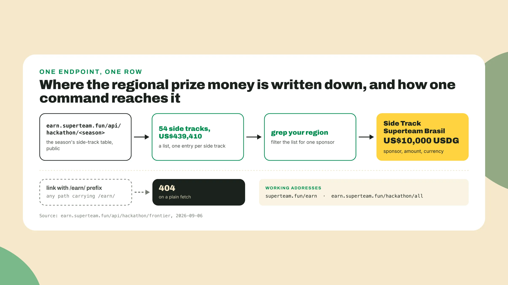
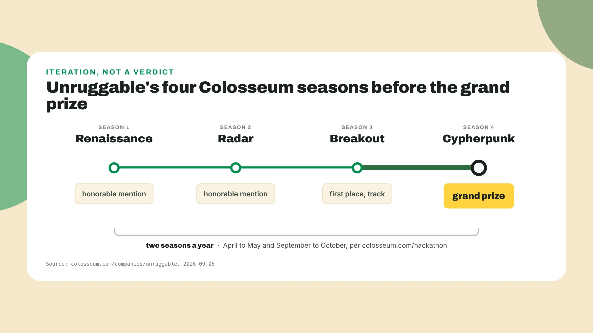
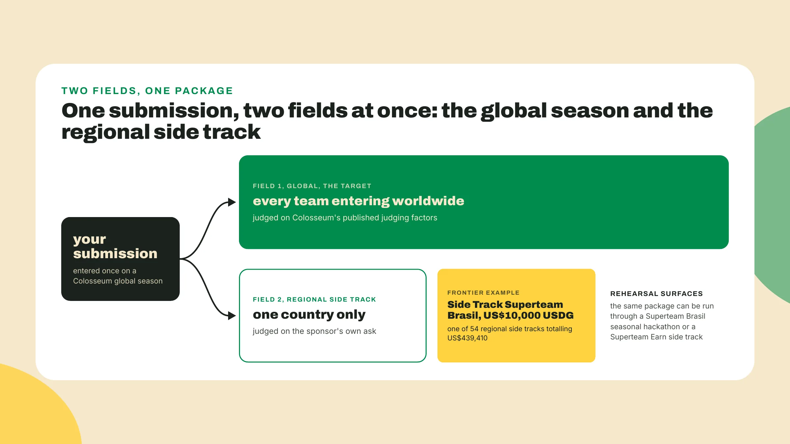

# Run the record

By David Potolski Lafeta, the course's author.

## Open the file most teams never opened

Somewhere in a public JSON file there is a line that says Superteam Brasil put ten thousand dollars on the table for Brazilian teams in the last global season. My guess is that most of the teams that could have claimed it never opened the file. You are going to open it in the next two minutes, before anything in this lesson gets a name. Open a terminal:

```bash
curl -s https://earn.superteam.fun/api/hackathon/frontier | python3 -m json.tool
```

What comes back is a list, one entry per side track that Superteam Earn ran alongside Colosseum's Frontier season. Scroll until the word Brasil shows up, or run the curl again with `grep -i brasil` on the end, then count the entries. Pulled on 2026-09-06, as of the 2026 World's Fair season, the file said this:

```text
season       Frontier (the last completed global season)
side tracks  54
total        US$439,410
one row      Side Track Superteam Brasil, US$10,000 USDG
```

None of it was hidden. It sat behind a public URL for the whole season, and the teams that read it knew something the teams that skipped it did not: a Colosseum season pays out of more than one pot, a main prize and a long list of regional prizes, each with its own sponsor and its own ask, won with the same submission. A hackathon month has a record, and the record is queryable.



## Do this

1. Write the Frontier row down while it is on your screen: 54 side tracks, US$439,410 in total, Side Track Superteam Brasil at US$10,000 USDG, the URL, and the date you pulled it.

2. Open colosseum.com/companies/unruggable in a browser, scroll to the list of hackathons the team went through, and count. Four: Renaissance, an honorable mention. Radar, another honorable mention. Breakout, first place in a track. Cypherpunk, the grand prize. That is the record as Colosseum published it on 2026-09-06, and on the same day colosseum.com/hackathon said it runs two global hackathons a year, April to May and September to October. A team that treats one season as a verdict is throwing away the second half of the year.

3. Change one word in the command and pull the season before Frontier:

   ```bash
   curl -s https://earn.superteam.fun/api/hackathon/cypherpunk | python3 -m json.tool
   ```

   Count again and find the Brazilian row again. Pulled on 2026-09-06, Cypherpunk carried 41 side tracks totalling US$341,750, and the Brazilian row read Superteam Brasil x Tangem Wallet at US$11,200. The count went up between the seasons and the row went from a co-sponsored track to a single-sponsor one with a smaller amount. Write it down with the same four things next to it.

4. Change the word once more, to worldsfair. On 2026-09-06 that endpoint returned an empty list, no side tracks published yet for a season that had not opened. Write that row down too. An empty row is part of the record, and it is the row that tells you when to come back and pull again.

5. Make a folder named after your project or after the month, and put a file called prize-table at its root, Markdown or a spreadsheet. That folder becomes the toolkit repo on day 0, in the third lesson. Every lesson from here carries the same example project, Fiado: a Brazilian corner shop's credit notebook, the name, running total and date the owner keeps by the till, turned into a stablecoin-settled tab with a repayment reminder. Fiado is Brazilian, so its regional row is the Superteam Brasil one, and its prize table looks like this:



6. Now your own row. Pull Frontier and Cypherpunk again, find the row with your region's Superteam on it in each, and record both in the same shape. If your region has no row in one of the seasons, write that down as well.

7. Pick a country that is not yours, find its row in one of the two seasons, and write one line on what its sponsor asked for.

## Four words, the month, three rules

A global season is one of Colosseum's two hackathons a year, and the clock in this course is the month between its opening and its submission deadline. A side track is a regional prize attached to a global season, a sponsor, most often a regional Superteam, putting up an amount and an ask. A regional bounty is the side track whose sponsor is your region's Superteam, which put a Brazilian team entering Frontier in two contests at once with the same submission, one global and one against only its own country. That asymmetry is, I think, the most under-used fact in Solana hackathons. A surface is any place a project can be submitted for judgment: a Colosseum global season is the target, and a Superteam Brasil seasonal hackathon before the next Colosseum season or a Superteam Earn side track alongside the season you enter is a rehearsal.

The lesson order follows the calendar. Before the clock, you read the surface and its rubric, confirm a team, write a first pitch and set up the toolkit repo on day 0. Week 1 takes an idea to evidence and a written kill, pivot or commit decision. Weeks 2 and 3 build the demoable slice on devnet. Week 4 turns the slice into the story. Submit assembles the package and writes a next-season plan, and Rehearsal, optional, exports it to the rehearsal surfaces. On the last day you hold six things: a devnet demo slice, a deck, a presentation video of two to three minutes, a demo video of three minutes or less, a GTM one-pager with named partners, and the portal answers drafted ahead of time. Every earlier rung feeds one of those six.

Three house rules:

1. You run the thing before it gets a name, and every later lesson puts a command, a query or a page inside its first few hundred words.
2. The pitch exists from day 0, and the first version is allowed to be wrong, it is not allowed to not exist.
3. Every rung is scored against the rubric before you move on, Colosseum's seven judging factors and the sponsor's ask, and the next rung does not start until the current one was scored honestly.



## Done when

- The prize-table file exists at the root of your project folder.
- Two season totals are recorded, Frontier and Cypherpunk, each with the URL and the date you pulled it.
- Two regional rows for your region are recorded, or an absent row is noted, each with URL and pull date.
- One line on a neighbouring country's sponsor ask sits under them.

Keep the file open, the next lesson asks for it.

## Watch out

- Copying last season's dates, amount or sponsor ask into this season's plan: the record tells you where the money and the crowd were last season and nothing certain about where they will be this one, so pull it again every season and put a date next to every number.
- Treating links with an /earn/ prefix in the path as canonical: on 2026-09-06 they returned a 404 to a plain fetch, and the addresses that work are superteam.fun/earn and earn.superteam.fun/hackathon/all, which lists every season Earn ran a side-track table for.
- Building for the side track and letting the main competition go: the regional row is the shortest path to a prize, and the Colosseum rubric is what makes a project worth a prize at all, so hold both.

## Checkpoint

Close the terminal and the browser. Then, no notes, out loud: name the two public records you queried and one number from each, say how many global seasons Unruggable entered before the grand prize, say the three house rules in your own words, and then, in one sentence, say what the prize table taught you about where the money is. If your sentence lands anywhere near "the money is regional and it changes every season", you have the thought the next lesson starts from. If not, run the two curls again and look at the Brazilian row in each.

## Next lesson: the seven factors

You have the prize table. Next lesson you open Colosseum's hackathon page and read the seven judging factors it publishes, one at a time, the way a judge reads them, and copy them into a file with the date on the first line. The first thing you will notice is that code quality is not one of them.
