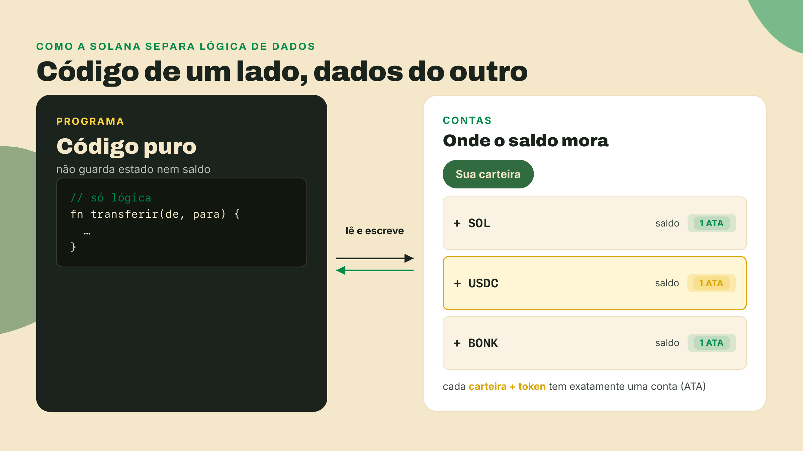
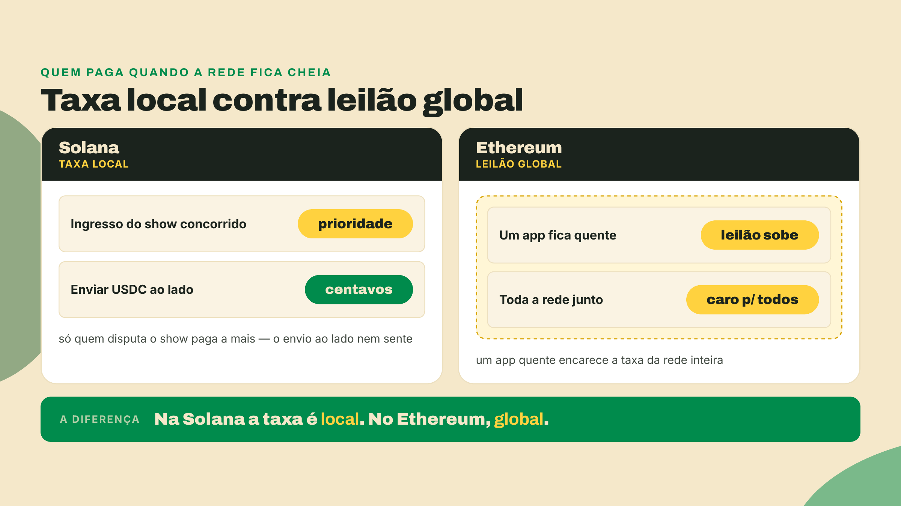
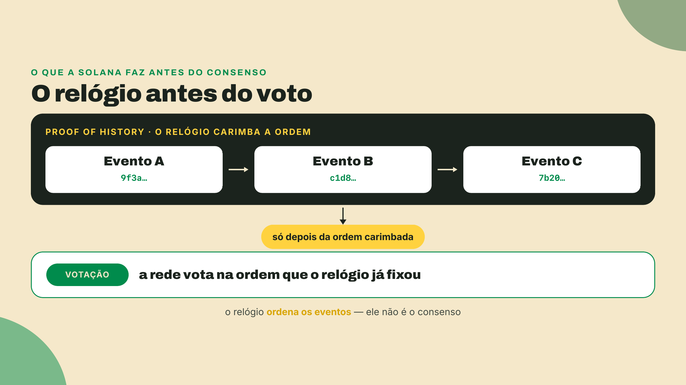
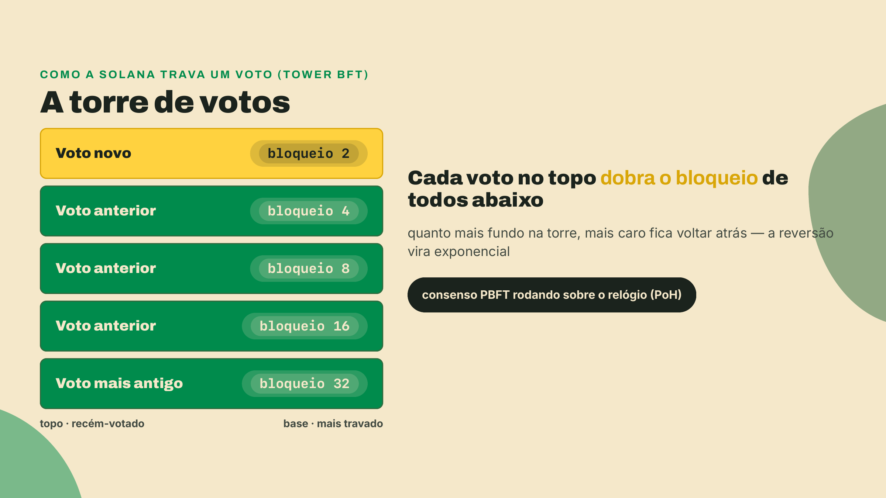

# Como isso é possível

Você já viu que a Solana é rápida e barata. Mas como uma rede aberta, sem dono, consegue ser mais veloz que o app do seu banco? Não é mágica. É uma decisão de arquitetura que as outras redes não tomaram. Vamos por partes.

Antes da mecânica, a ideia grande. A Solana é um megacomputador global e descentralizado: um computador que ninguém pode desligar, censurar ou adulterar, mantido por milhares de máquinas independentes que se comportam como uma só. O que isso destrava é enorme: qualquer pessoa pode publicar um código que vira um serviço financeiro global, no ar 24 horas por dia, sem pedir permissão a banco nem a governo. É isso que torna possível tudo o que você viu na lição anterior. A pergunta desta lição é como esse computador consegue ser tão rápido.

Comece pela ideia central: na Solana, o código e os dados moram separados. Os programas (o código que roda) não guardam nada; todo o estado vive em contas, que são só caixinhas de dados. Cada saldo de token tem a sua própria conta, a ATA (Associated Token Account), derivada da sua carteira mais o token. Uma carteira, muitas contas.

Essa separação é o que destrava a velocidade. Toda transação declara antes quais contas vai ler e escrever. Assim o motor da rede, chamado Sealevel, enxerga quais transações não se cruzam e roda todas ao mesmo tempo. Pense em vários caixas de supermercado abertos em paralelo, em vez de uma fila única, por mais rápida que ela seja.

E o congestionamento? Ele fica local. A prioridade é precificada por conta disputada (a rede chama isso de neighborhood fees, taxas de vizinhança). Se um show concorrido está vendendo ingressos onchain, quem briga por aquele ingresso paga mais. Seu envio de USDC ao lado continua custando centavos, porque toca outras contas. No Ethereum é o contrário: o estado global vira um gargalo e todo mundo paga o mesmo leilão.

Falta o tempo. Antes de a rede votar em qualquer coisa, o Proof of History (prova de histórico) já carimbou a ordem dos eventos. É um relógio criptográfico, uma corrente sequencial de cálculos que prova que uma coisa veio antes da outra. Ele não é o consenso; é o relógio em cima do qual o consenso acontece. Sobre esse relógio, o Tower BFT, o mecanismo de votação da família PBFT (um padrão clássico de consenso que aguenta falhas), registra os votos, e cada novo voto dobra o tempo de bloqueio dos anteriores, formando uma torre. Com a ordem já provada, a rede corta rodadas de conversa e fecha um bloco novo (slot) a cada 400ms.

O preço disso? Declarar as contas antes cobra dos desenvolvedores e exige validadores com hardware forte. A Solana moveu a complexidade para quem constrói, para que quem usa tenha velocidade e taxa baixa. No próximo passo, você coloca isso em prática.
