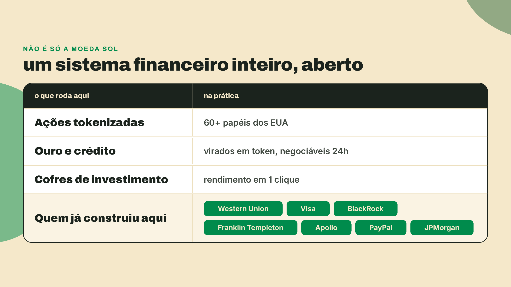
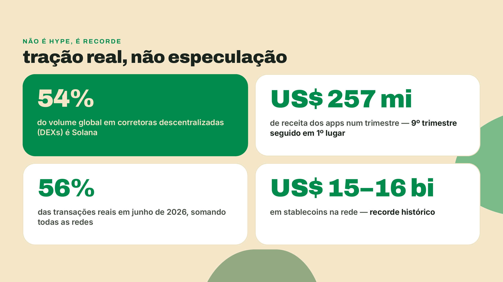
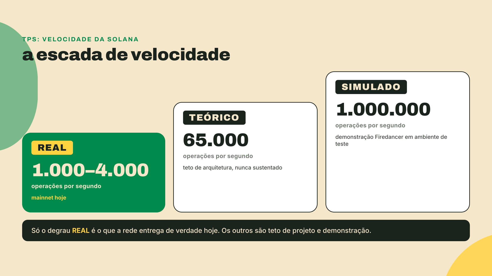

# Por que todo mundo fala de Solana

Você manda R$ 20 pelo PIX e o dinheiro chega antes de guardar o celular no bolso. Instantâneo, de graça. Agora imagine essa mesma velocidade valendo não só para uma transferência, mas para TUDO que existe em finanças: ações, ouro, crédito, apostas de mercado. Isso já existe, aberto para qualquer pessoa com um celular. E roda na Solana.

Não é promessa de futuro, é o que está no ar hoje. Já são 60+ ações americanas tokenizadas (versões digitais de ações reais que você negocia direto do celular). Ouro e crédito também viraram token. Tem cofre de investimento em que você entra com 1 clique, mercado de previsão registrado na própria rede (você aposta em quem vence a eleição, por exemplo) e até gacha de cartas colecionáveis, que já moveu US$ 1 bilhão.

E não é coisa de gente pequena. Western Union, Visa, BlackRock, Franklin Templeton, Apollo e PayPal já constroem aqui, na rede pública, com dinheiro de verdade. O caso mais forte é recente: em dezembro de 2025, a JPMorgan, o maior banco dos Estados Unidos, criou uma emissão de dívida de curto prazo nativa na Solana para a Galaxy Digital, com a entrega liquidada em USDC (o dólar tokenizado). O banco não testou num laboratório fechado: emitiu na própria rede pública.

Por que a Solana, e não outra? Porque tudo vive numa chain só (uma única rede, sem fatiar os usuários em dezenas de camadas separadas). Seu ativo e o app que você usa ficam sempre no mesmo lugar. Ela já tem infraestrutura de privacidade e de conformidade legal rodando, e está de pé desde 2020. O preço honesto disso: rodar a rede exige hardware forte. Vale a pena.

Agora os recordes, cada um com data e rótulo. A velocidade real hoje fica entre 1.000 e 4.000 operações por segundo; o teto teórico do projeto é 65.000; e uma demonstração da equipe Firedancer já simulou 1.000.000 num ambiente de teste. Em junho de 2026, a Solana processou 56% de todas as transações reais das redes somadas, mais que todas as outras juntas. Os aplicativos dela lideram receita entre todas as chains pelo 9º trimestre seguido: US$ 257 milhões num único trimestre, perto de 41% de toda a receita de aplicativos do setor. E a rede bateu recorde histórico de US$ 15–16 bilhões em stablecoins (moedas digitais atreladas ao dólar). Tudo isso com taxa típica abaixo de US$ 0,01.

No fim, um número resume o resto: a Solana já responde por 54% do volume global de negociação em corretoras descentralizadas. É para isso que todo mundo olha.
