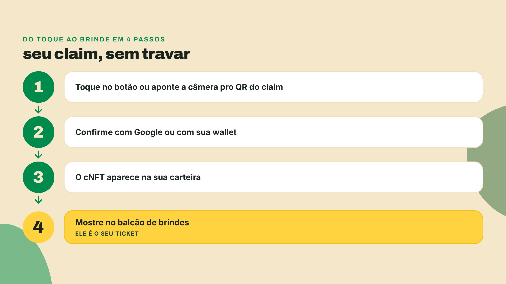
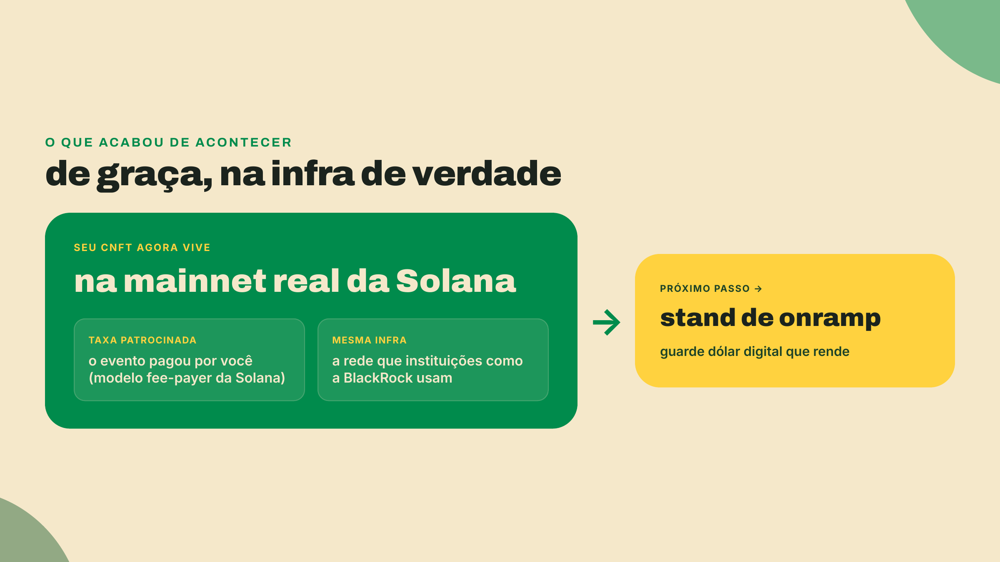
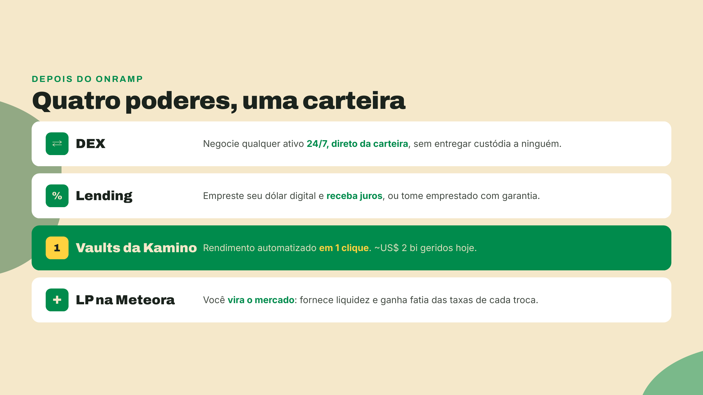
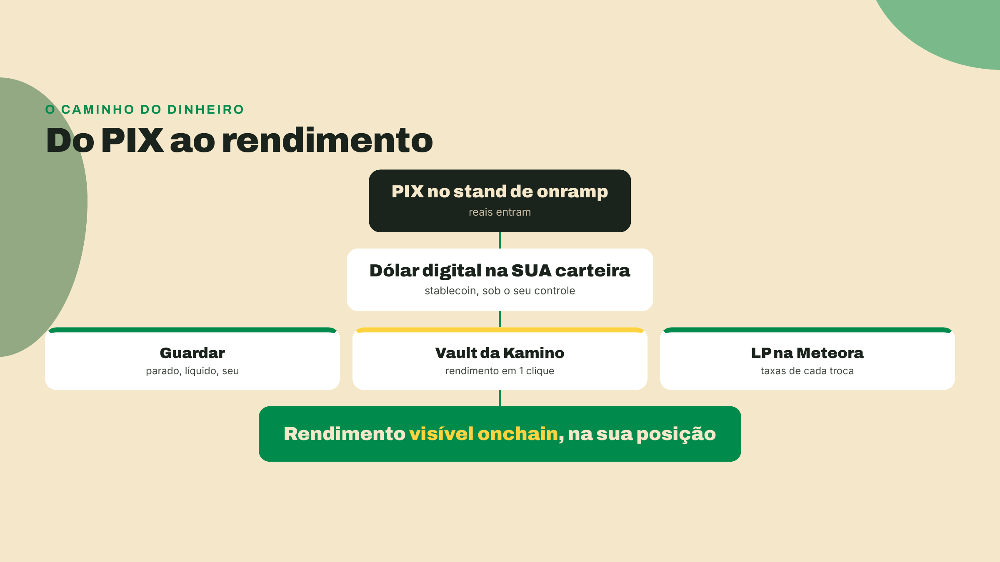

# Seu momento onchain

Chega de teoria. Nos próximos 60 segundos você coloca um ativo real, na mainnet real, dentro da sua carteira. E troca ele por brinde.

Siga os quatro passos, um de cada vez.

1. Toque no botão de claim ou aponte a câmera para o QR. A página abre em `https://claim.PLACEHOLDER.superteam.fun`.
2. Confirme com a mesma conta que você usou para entrar, seja o Google ou a sua wallet. Não feche a página antes da confirmação aparecer.
3. Veja o cNFT surgir na carteira. Um cNFT é um NFT comprimido: um ativo de verdade na mainnet cujo mint custa frações de centavo, e é por isso que dá para entregar um para cada pessoa do evento. A transação é patrocinada: o evento paga a taxa por você, e esse modelo de fee-payer é padrão na Solana.
4. Mostre o cNFT no balcão de brindes. Ele é o seu ticket, então não vá embora sem apresentar.

Sejamos honestos sobre o porquê: seu claim saiu de graça porque o evento bancou a taxa. Na mainnet real, uma transação custa frações de centavo, e nada além disso. Você acabou de usar exatamente a mesma infraestrutura que a BlackRock usa; a única diferença foi quem pagou os centavos.

E aqui está o segredo: o cNFT foi só o treino. Essa mesma carteira que agora existe é a chave de tudo que você viu na lição 1. Basta um onramp: um PIX no stand, e reais viram dólar digital direto na sua carteira, sob o seu controle. A partir daí, quatro poderes se destravam.

E os líderes de cada categoria estão a um toque, rodando agora na mesma mainnet do seu cNFT: na [Jupiter](https://jup.ag) passa a maior parte das trocas da Solana; a [Kamino](https://kamino.finance) lidera lending e vaults (~US$ 2 bi geridos); e a [Meteora](https://meteora.ag) é a casa de quem fornece liquidez. Nada de cadastro, nada de fila: abriu, conectou a carteira, está dentro.

Uma nota honesta antes de você sair correndo: rendimento em DeFi é variável, ninguém garante juro fixo, e todo protocolo tem risco. Comece pequeno, entenda o que está fazendo, e cresça no seu ritmo.

Passa no stand de onramp e ativa em 2 minutos. Bem-vindo ao mundo onchain. 🚀
