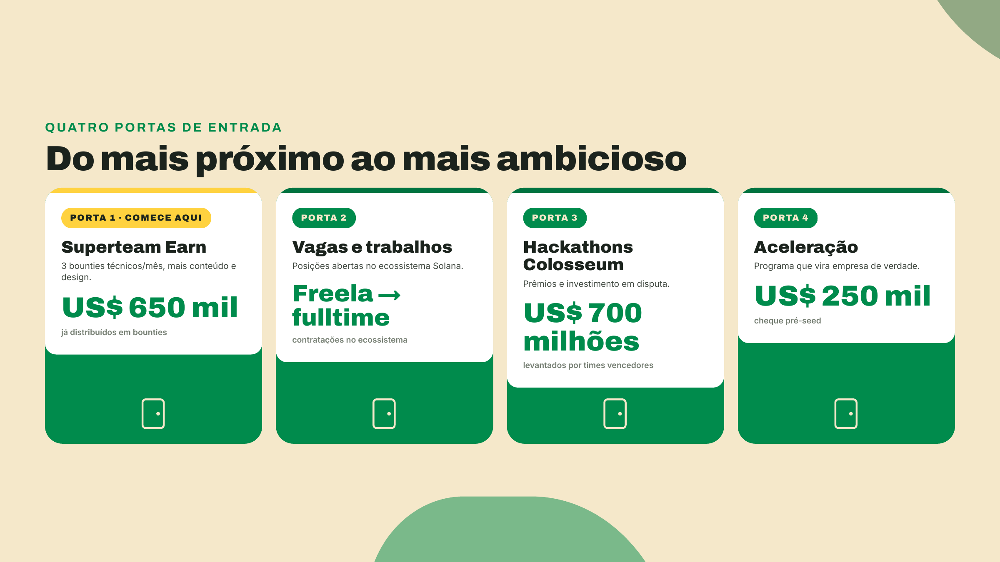
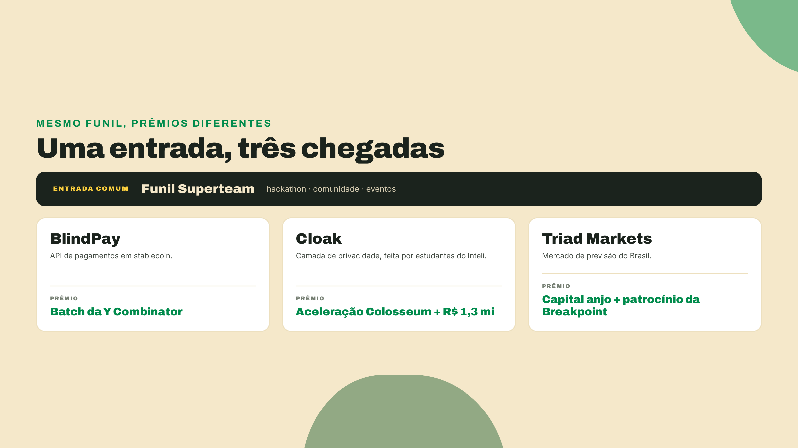
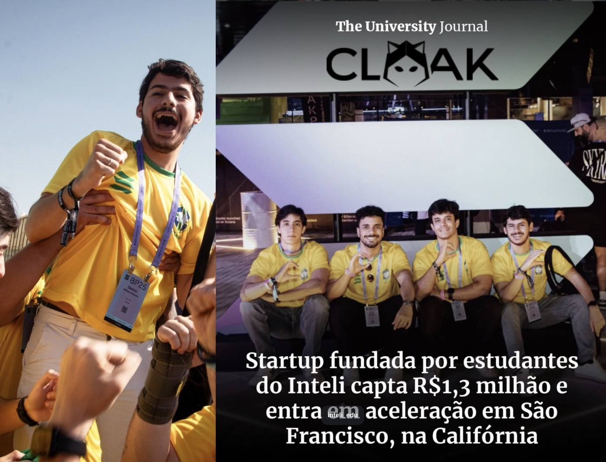
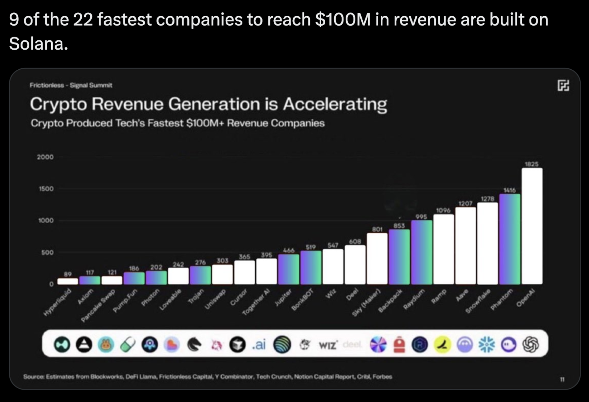

# Superteam: sua porta de entrada

O Superteam Brasil já facilitou mais de US$ 40 milhões levantados, amplificados e negociados entre os nossos membros. Não por sorteio, nem por indicação: por trabalho. Código, design, conteúdo. Se você entregou, você recebeu. Esta lição é o mapa de onde esse dinheiro está e como você pega o seu.

São quatro portas, lado a lado. A primeira é o Superteam Earn: bounties abertos, com no mínimo 3 bounties técnicos open source garantidos por mês, mais os pontuais de eventos, conteúdo e design. A segunda são as vagas e trabalhos no ecossistema, de freela a fulltime. A terceira são os hackathons da Colosseum, onde os times vencedores já levantaram US$ 700 milhões. E a quarta é a aceleração, com cheque de US$ 250 mil pré-seed.

Bounty é tarefa aberta com prêmio. Pensa como a evolução do freelancing: em vez de caçar cliente e negociar escopo, o trabalho já está publicado, com preço na frente. Ninguém precisa te convidar, ninguém decide quem "merece". Você abre, compete, entrega boa vira pagamento. Foi assim que US$ 650 mil já saíram do Earn para a comunidade. A parte honesta: é competição, nem todo mundo ganha toda vez. Mas o que você produz fica seu. Portfólio público, rede, e a próxima chance a um clique.

Quer a prova de que essas portas levam a empresa de verdade? Olha três brasileiros. Os três entraram pelo mesmo funil Superteam. O que muda é o prêmio que cada um levou.

A BlindPay, API de pagamentos em stablecoin, venceu a trilha brasileira do hackathon e entrou no batch da Y Combinator.

A Cloak, feita por estudantes do Inteli, captou R$ 1,3 milhão e foi para São Francisco receber aceleração da Colosseum.

E a Triad Markets levantou capital anjo e virou patrocinadora da própria Breakpoint.

Zoom out. Um slide da Frictionless Capital colocou o número na mesa: 9 das 22 empresas de tecnologia mais rápidas a chegar em US$ 100 milhões de receita nasceram na Solana. A mais rápida delas, a Axiom, fez isso em 117 dias, recorde da Y Combinator.

É pra isso que a gente está aqui: apoiar sua empresa, dar poder às suas finanças pessoais e corporativas, e levar seu sonho até as massas. O brinde que você vai reivindicar daqui a pouco? É, literalmente, seu primeiro earn. Bora.
