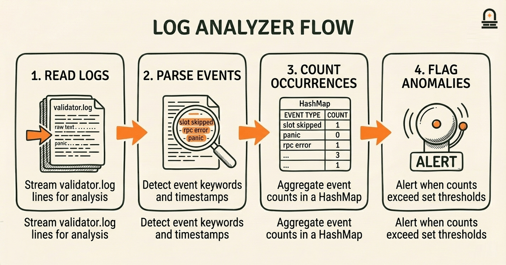
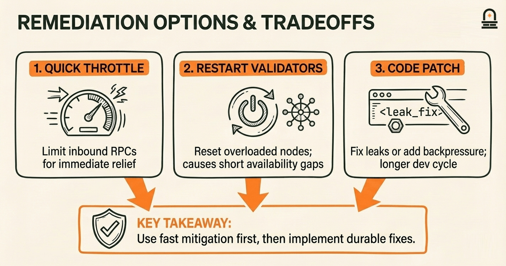
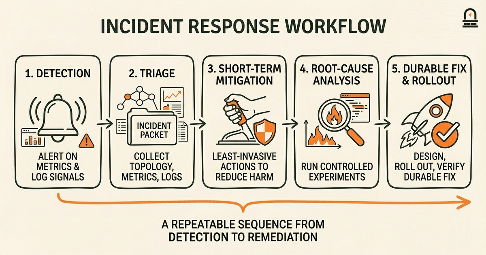

### Listen to the audio version

[Listen to this episode on Spotify](https://open.spotify.com/episode/3sTMtYchX1XBge87TQGkPg)

---

**Objective:** Identify the principal challenges Solana faced during early development and how those shaped priorities.

**Why now:** After learning the origin story, examine concrete obstacles that redirected development focus.

**Concepts:** Technical stability and reliability concerns; Network growth and operating constraints in early stages; Security incidents and early remediation efforts; Funding and resource allocation tradeoffs; Community feedback channels and early responses

**Read time:** 11 min

---

## Recap & Introduction

The whitepaper you just studied frames cryptocurrency as a peer-to-peer electronic cash system that solves double-spending with timestamping and chained blocks. You should recall the specific idea that ordering transactions consistently (via timestamping and chaining) is the mechanism that makes a single canonical ledger possible despite adversarial participants. That concrete mechanism — ordering + agreed history — is the anchor for understanding why a blockchain must prioritize both consensus progress and safety.

We now turn from the conceptual design in the whitepaper to the practical obstacles a high-throughput blockchain encountered while moving from paper to production. The connection is direct: the whitepaper assumes a particular set of tradeoffs around latency, throughput, and adversary models, but when teams attempted to implement these tradeoffs in real software and real networks, unexpected operational realities surfaced. In this lesson you will identify the principal technical and organizational challenges Solana faced early on, and see how those challenges shifted development priorities away from pure theoretical tradeoffs toward pragmatic reliability work.

Start this lesson expecting to revisit familiar failure modes and tradeoffs you should already know: network partitions, CPU and memory exhaustion, timing assumptions, and the risks of optimistic performance choices. By the second paragraph we introduce the lesson's key concepts explicitly: technical stability and reliability concerns, growth and operating constraints, security incidents and remediation, resource allocation tradeoffs, and how community feedback channels informed early responses. These are the lenses you will use to assess each historical incident and its practical consequences.

---

## Learning Objectives

By the end of this lesson you will be able to:

- **Explain** the primary technical stability problems that emerged when Solana moved from prototype to live network and why those problems matter for consensus progress.
- **Describe** at least two concrete operational constraints (resource limits, runtime scheduling) that influenced early design changes.
- **Trace** the sequence of an early security or availability incident and summarize the remediation steps taken.
- **Articulate** how funding and resource allocation decisions shaped prioritization between performance features and reliability engineering.
- **Assess** the role that community feedback channels played in surfacing issues and guiding short-term fixes.

---

## Code Walkthrough: Simple Log Analyzer for Validator Events (Rust)

When stability problems occur in a running validator, engineers often start by extracting structured events from logs and looking for patterns such as frequent "slot skipped" messages, repeated failed RPC calls, or GC pauses. The code below is a compact Rust example that parses a simplified validator log, counts event types, and flags unusually frequent "slot skipped" occurrences. This is a small diagnostic you can adapt for any runtime that emits timestamped events.

```rust
use std::collections::HashMap;
use std::fs::File;
use std::io::{self, BufRead};

fn main() -> io::Result<()> {
 let file = File::open("validator.log")?;
 let reader = io::BufReader::new(file);
 let mut counts: HashMap<String, usize> = HashMap::new();

 for line in reader.lines() {
 let line = line?;
 if let Some(event) = parse_event(&line) {
 *counts.entry(event).or_insert(0) += 1;
 }
 }

 for (event, count) in counts.iter() {
 println!("{}: {}", event, count);
 }
 Ok(())
}

fn parse_event(line: &str) -> Option<String> {
 if line.contains("slot skipped") {
 return Some("slot_skipped".to_string());
 }
 if line.contains("rpc error") {
 return Some("rpc_error".to_string());
 }
 if line.contains("panic") {
 return Some("panic".to_string());
 }
 None
}
```

Line-by-line explanation:

1. `use std::collections::HashMap;` and the subsequent `use` lines import basic I/O and collection utilities. You will need these for counting occurrences and reading files.
2. The `main` function opens a file named `validator.log` and wraps it in a buffered reader to iterate lines efficiently. If the file is missing the program returns an error — in practice you might wire this to a streaming source rather than a file.
3. `let mut counts: HashMap<String, usize> = HashMap::new();` creates a map where keys are event identifiers and values are counts. The event identifiers are normalized strings such as `slot_skipped`.Inside the loop, the program calls `parse_event` for each line. If parsing yields an event, it increments the corresponding counter. This pattern is robust: it separates parsing logic from aggregation logic so you can add more detectors without changing the counting structure.
4. The `parse_event` function demonstrates a minimal approach: simple substring checks for known markers. In production you would replace this with structured parsing (for example JSON parsing if logs are emitted in JSON) and include timestamp extraction to calculate rates per minute.
5. After aggregation the program prints each event and its count. From these counts you can quickly spot anomaly candidates, for example if `slot_skipped` appears thousands of times in a short log segment.

Why this matters: when an outage begins, knowing which event types spike tells you whether you are looking at network dropouts, RPC backpressure, runtime panics, or garbage-collection stalls. This code is intentionally small: the first practical step in many incident responses is to quantify symptoms before proposing a fix.



---

## Concrete Example: Diagnosis and Patch Cycle for a Resource-Exhaustion Outage

Examine a representative early incident: a high-throughput period triggers resource exhaustion on validators, leading to dropped packets, stalled consensus, and ultimately a partial network halt. We walk through how symptoms were observed, how engineers isolated the cause, and what remediation steps followed. This example mirrors recurring patterns in production systems and shows how technical constraints shape priorities.

First, engineers observed three simultaneous symptoms: increased RPC latency, frequent thread panics in runtime logs, and a surge in connection counts reported by system monitoring. These three signals point to a cascading resource pressure problem rather than a single, isolated bug: RPC latency rises because request handlers queue; queued handlers consume memory and threads, which increases context switching and CPU contention; panics appear when code hits unhandled corner cases under load. The practical diagnosis combined log aggregation, metrics, and a small-scale reproduction on a staging cluster.

The timeline of actions typically followed this pattern: symptom detection → triage → short-term mitigation → root-cause analysis → targeted patch → rollout and verification. Short-term mitigations might involve temporarily throttling incoming RPCs, restarting overloaded validators, or diverting traffic. The patch stage often involved fixing specific memory leaks, adding backpressure at RPC handlers, or adjusting thread pools.

To make the tradeoffs visible, compare three candidate remediation choices engineers considered during this incident:

| Option | What it changes | Pros | Cons |
| --- | --- | --- | --- |
| Quick throttle | Limit inbound RPC throughput | Immediate relief, low code risk | Reduces capacity and user-facing throughput |
| Restart validators | Reset memory/threads | Fast, effective reset of state | Causes short availability gaps and disrupts leader rotation |
| Code patch | Fix leak or add backpressure | Long-term fix, preserves capacity | Longer dev + review cycle; risk of regressions |

Engineers often combine options: apply quick throttle to stabilize the network while developing a code patch for the underlying resource leak. A concrete remediation example from early Solana practice was adding token-bucket style limits to RPC handlers so that sudden bursts couldn't exhaust CPU and memory; this change prioritizes safety over peak throughput until a more nuanced allocator or runtime fix is ready.

Why this example is pedagogically useful: it connects symptoms (what you see) to mechanistic causes (what is happening in threads, memory, and I/O) and to concrete engineering tradeoffs (short-term mitigation versus long-term fixes). When you review the code or postmortem later, ask: which signals were most informative, what temporary controls were acceptable, and how did that choice reprioritize engineering work going forward?



---

## Workflow: From Detection to Durable Remediation

**Process Overview:** Turn practical diagnosis into a repeatable workflow you can follow or evaluate. We present a stepwise incident-response workflow tailored to high-throughput blockchains where uptime, consensus safety, and fast recovery are all priorities. This workflow condenses the practices that surfaced in early Solana responses and generalizes them so you can reason about priorities rather than memorize commands.

Step 1 — Detection: maintain both high-cardinality logs and lightweight metrics. Use alerts for metric thresholds (e.g., RPC latency > 500ms, slot-skipped rate > 0.1% per minute) and pattern-based log alerts for panic or resource-exhaustion messages. Detection should be noisy by design: alarm on trends, not every transient blip, but provide enough context (recent config changes, leader schedule) to prioritize triage.

Step 2 — Triage: gather a compact incident packet that includes recent topology, leader schedule snapshot, CPU/memory/IO metrics, and representative log snippets. Reproduce the issue on a small testbed if possible. The goal is to classify the incident quickly into categories such as network, runtime, consensus, or RPC subsystem. That classification guides who owns the fix.

Step 3 — Short-term mitigation: choose the least invasive action that reduces immediate harm. Options are throttling new connections, applying circuit-breakers, temporarily disabling nonessential subsystems, or restarting particular nodes. Document the mitigation decision immediately so postmortem analysis can evaluate reaction appropriateness.

Step 4 — Root-cause analysis: with the system stabilized, run controlled experiments and instrumented tests to reproduce the failure mode. Use flame graphs, heap profiles, and thread dumps. Collect hypotheses and attempt to falsify them. This stage often reveals surprising interactions between subsystems — for example, scheduler latency amplifying GC pauses.

Step 5 — Durable fix and rollout: design a fix that minimizes behavior regressions. For high-risk patches prefer a staged rollout and feature gates. Create acceptance criteria such as no slot skips for X hours under Y load, or RPC latency stay below threshold for a 24-hour stress test. Use canaries and progressively increase traffic while monitoring.

Step 6 — Communication and community feedback: publish a concise incident summary that states facts: what happened, immediate mitigations, timeline of the fix, and next steps. Invite reproducible test cases from community operators. Early Solana practice showed that transparent incident summaries helped third-party validator operators coordinate upgrades and reduced redundant troubleshooting work.

Step 7 — Prioritization and resource allocation: finally, place the incident into the roadmap with a clear priority. Decide whether the fix is a hot patch, an engineering project requiring headcount, or an operational playbook change. Funding and staffing decisions often follow from how frequently the incident class reoccurs and its systemic impact on consensus safety.

This workflow emphasizes measurable checks at each stage: alert thresholds, triage packet completeness, test reproduction, and acceptance criteria. Those checks convert an anecdotal incident into engineering work items, which in turn change long-term priorities from feature growth to platform resilience when incidents are frequent or severe.



---

## Conclusion & Key Takeaways

You should now understand three concrete takeaways about early Solana challenges and how they shaped priorities. First, high-throughput design choices revealed practical failure modes — resource exhaustion, scheduling latency, and I/O backpressure — that required moving engineering focus from raw performance to robust, predictable behavior. That shift is not a critique; it is the natural progression when a system leaves lab conditions and encounters diverse real-world workloads.

Second, incident response emphasized measurable detection and staged mitigation. Short-term throttles and restarts are valuable tools to stop immediate cascading failures, but durable reliability required targeted patches, better instrumentation, and workflow changes. Those remediation efforts changed resource-allocation decisions: teams often delayed new performance features to invest in observability and defensive programming.

Third, community channels and transparent incident communication were crucial operational levers. Publishing timelines, mitigation steps, and upgrade guidance accelerated coordinated operator responses and reduced the operational burden on the core team. The practical principle to remember is this: when a live network exists, social coordination and clear technical triage are as important as any single code fix.

---

## Quick Recap

- Early stability issues shifted priorities from peak throughput to predictable, observable behavior.
- Diagnosis combines logs, metrics, and small reproductions; short-term throttles stabilize while patches are developed.
- Incident-response workflow: detect → triage → mitigate → root-cause → patch → communicate.
- Community transparency helped coordinate upgrades and reduce duplicated operational effort.

---

## Next Steps

Prepare to read the next lesson, "Explaining the Whitepaper's Core Mechanisms," where you will examine the technical pieces that must be implemented reliably for a blockchain to function: consensus, mempool and transaction ordering, and incentive alignment. Use what you learned here to notice where those mechanisms introduce operational constraints and where design choices trade performance for safety. Bring these questions: which mechanism requires the most defensive engineering when scaled, and how do operational realities change protocol priorities?

---

## Glossary

### Slot skipped

An event where a scheduled leader or validator fails to produce or validate a block within the expected time window, indicating liveness or scheduling issues.

### Backpressure

A defensive pattern that slows or drops incoming requests to prevent resource exhaustion and preserve system stability under load.

### Token-bucket throttling

A rate-limiting technique that allows bursts up to a capacity and refills at a steady rate, used to smooth request spikes.

### Canary rollout

A staged deployment strategy that exposes a change to a small subset of nodes or users to detect regressions before full rollout.

### Triaging packet

A compact collection of diagnostic artifacts (logs, metrics, topology) assembled quickly to classify an incident and guide responders.

### Acceptance criteria

Concrete, testable conditions that must be met before a fix is considered verified and safe to deploy network-wide.

---

## References & Further Reading

- [Validator Operation and Maintenance](https://docs.anza.xyz/operations) — *Solana Docs* (Official Documentation)
- [Solana Status - Incident History](https://status.solana.com/) — *Solana Status* (Status & Incidents)
- [Cluster Restart: Official Response Procedure](https://docs.anza.xyz/operations/guides/restart-cluster) — *Agave / Anza Docs* (Postmortem Reporting)
- [solana GitHub - example PRs and issues (searchable archive)](https://github.com/solana-labs/solana/issues) — *GitHub - solana-labs* (Source Code & Fixes)
