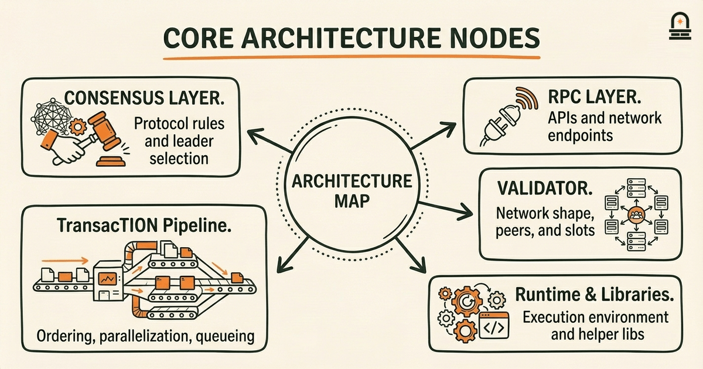
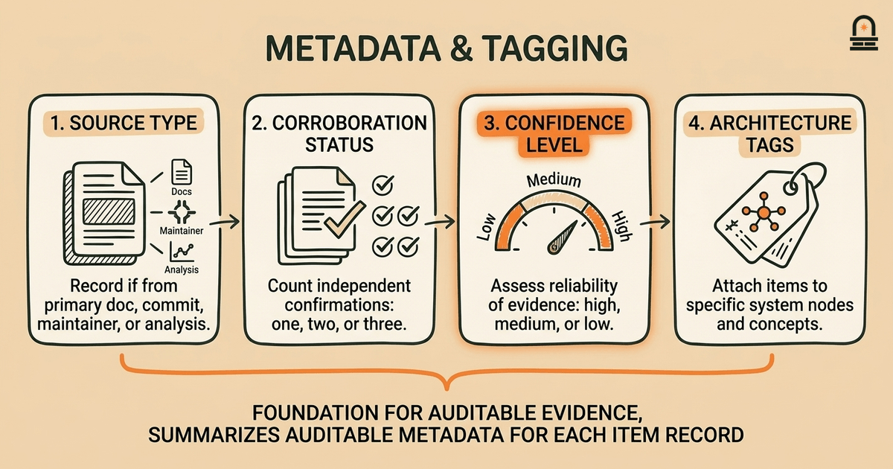
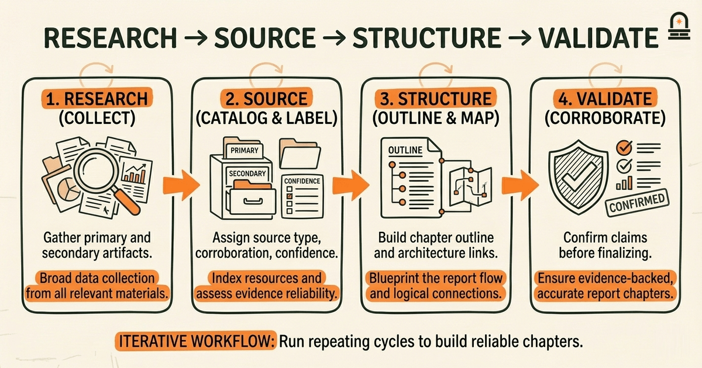
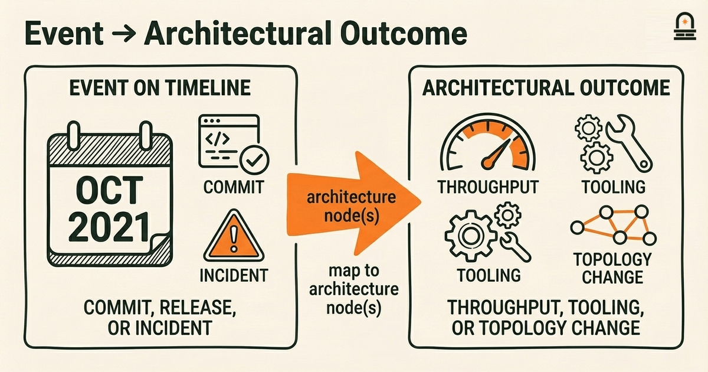

### Listen to the audio version

[Listen to this episode on Spotify](https://open.spotify.com/episode/5pKjchahIYazZBRPIKbIhG)

---

**Objective:** Define the capstone scope, success criteria, and research methods to structure a report on Solana's history and architecture.

**Why now:** Now we align accumulated knowledge toward a focused report on Solana's history and architecture.

**Concepts:** Solana history; Solana architecture; evidence collection and sourcing; structuring a historical narrative; report organization and sections; alignment of goals and evaluation criteria

**Read time:** 14 min

---

## Recap & Introduction

You recently completed "Navigating Solana Resources and Next Steps," where you practiced identifying authoritative resource types for the Solana ecosystem overview and learned how to construct and curate a glossary for Solana-specific terminology. In that lesson you worked with three concrete checks for authority: primary protocol artifacts (whitepapers, RFCs, core repo commits), canonical documentation (official docs.solana.com pages and API references), and maintained code repositories (active commits, clear maintainers, issue triage). You also used signals that indicate active projects such as recent release tags, responsive issue trackers, and updated governance proposals. Those concrete heuristics are the immediate evidence base we will reuse here.

We now move from collecting and vetting resources to framing the capstone: deciding what the report will cover, how you will evaluate success, and which methods you will use to assemble the narrative and architecture sections. This lesson explains how to translate the research habits you practiced into reproducible scope boundaries, success criteria, and documented methods for assembling a report about Solana's history and architecture. By the second paragraph we introduce the core elements you must decide now: temporal scope (what years or milestones you include), thematic scope (which architectural layers and social dynamics you treat), evidence strategy (how you convert resource signals into cited claims), and organizational layout (how sections map to sources and evaluation criteria).

Why this lesson comes next: you have the raw toolkit for identifying and assessing sources; now you need a methodological plan so your final artifact is coherent, defensible, and aligned with the module deliverable: "A comprehensive report summarizing Solana's historical development and architectural overview." You will use the heuristics from the previous lesson — authoritative resource types, glossary curation, and signal-based maintenance checks — as inputs into the capstone scope decisions. We will show how to convert those inputs into checkpoints and acceptance criteria that make the capstone manageable, reproducible, and useful for readers who may be technical or historical audiences.

---

## Learning Objectives

By the end of this lesson you will be able to:

- **Define a clear scope** for the capstone by stating temporal boundaries, architectural layers to cover, and the audience level (technical, mixed, or executive).
- **Write measurable success criteria** that tie specific deliverables (timeline, architecture diagram, source matrix) to verification checks like citation count, source diversity, and corroboration status.
- **Choose and document research methods** that map resource types from the prior lesson to report sections and explain how you will validate contested or ambiguous claims.
- **Draft a high-level report outline** that sequences history and architecture in a way that supports causal claims (for example, linking protocol changes to performance or governance events).
- **Apply vetting checkpoints** so you can prioritize primary sources and flag secondary sources for corroboration during the synthesis phase.

These objectives are testable: a scoped outline, a criteria checklist, and a documented methods paragraph will serve as artifacts you can present in the capstone planning folder.

---

## Mental Model: Timeline + Architecture Map

**The Mental Model:** Adopt a combined mental model that treats the capstone as two tightly-coupled maps: a chronological timeline of events and an architectural map of system components. The timeline captures discrete moments (mainnet launch, notable forks, major releases, validator network growth milestones, key third-party integrations), while the architectural map shows persistent structural elements (consensus layer, transaction pipeline, runtime, runtime libraries, RPC layer, validator topology). Think of the timeline as the report's narrative spine and the architectural map as the analytical lens that explains how those events changed or revealed properties of the system.

Mechanically, use the timeline to order evidence and the architectural map to categorize evidence. For example, when you encounter a commit or a release note that mentions a change to the transaction pipeline, place that item on the timeline at the appropriate date and also attach it to the "transaction pipeline" node on your architecture map. This dual placement helps you trace causality: did the transaction pipeline change follow a scaling incident? Did it precede improved throughput? By aligning items across both maps you force explicit linking between historical events and architectural consequences.

For each mapped item you will capture three metadata fields: source type, corroboration status, and confidence level. Source type uses the heuristics from "Navigating Solana Resources and Next Steps" — mark items as primary protocol artifact, official documentation, code commit, maintainer communication (issue, PR comment), or secondary analysis (blogs, academic papers). Corroboration status records whether one, two, or three independent primary sources confirm the same fact. Confidence level is your working judgment (high, medium, low) based on source type and corroboration. These metadata fields create a searchable, auditable dataset that supports the narrative and lets you justify why certain claims are emphasized.

Concretely, when you place a milestone like "implementation of a runtime optimization" on the timeline, you attach the commit hash, the release note, and any contemporaneous issue discussion as linked entries. Then on the architecture map, tag the runtime node with an annotation that references those links. If secondary sources interpret the change differently, note the divergence and keep those perspectives for the analysis section rather than the factual timeline. Maintaining this separation between verifiable facts (timeline entries with primary evidence) and interpretation (analysis that synthesizes facts) preserves clarity and prevents overclaiming.

This mental model also guides prioritization. If you have limited time, choose timeline items that connect to multiple nodes on the architectural map — those are high-leverage events that shaped several subsystems. Conversely, isolate peripheral events (for example, small tooling changes documented only in single repo issues) as "appendix candidates" that support depth without distracting the main narrative. Thinking in parallel maps converts a potentially diffuse body of evidence into a structured narrative scaffold you can trace and defend.

---

## Workflow: Research, Source, Structure, Validate

**Process Overview:** Establish a repeatable workflow that turns scattered resources into a coherent chaptered report. The workflow has four phases: Research (collect), Source (catalog and label), Structure (outline and map), and Validate (corroborate and finalize). Each phase contains concrete tasks and exit criteria you can check before moving forward. We recommend running this workflow iteratively: complete a pass for high-level themes first, then iterate deeper on prioritized chapters.

Phase 1 — Research (collect): Use the resource types and authority checks from "Navigating Solana Resources and Next Steps." Start with the Solana whitepaper and official docs, then add core repo commit logs, major release notes, and primary communications such as governance proposals or core team announcements. Record each item with bibliographic metadata: title, author/maintainer, date, URL, and type. The exit criterion for this phase is a searchable collection that covers your temporal scope with at least one primary artifact per major milestone.

Phase 2 — Source (catalog and label): For each collected item assign the metadata fields described in the mental model: source type, corroboration status, and confidence level. Tag each item with architecture node(s) from your map. Generate a source matrix that summarizes how many primary, secondary, and tertiary sources support each asserted fact. The exit criterion is a source matrix where no major narrative claim has fewer than two corroborating items, unless the claim is explicitly labeled as "single-source" with justification.

Phase 3 — Structure (outline and map): Produce a chaptered outline that places the timeline and architectural map at the core. Decide how to sequence chapters: chronological (by era) with topical architecture subsections, or topical chapters that contain mini-timelines for each subsystem. The exit criterion is a detailed outline that lists the primary evidence to be cited for each subsection and specifies the diagrams you will include (timeline, architecture map, component diagrams).

Phase 4 — Validate (corroborate and finalize): Apply cross-checks from the previous lesson: check commit authors and timestamps, evaluate maintenance signals (active branches, recent releases), and flag discrepancies. For claims that remain contested, document the disagreement, show the conflicting sources, and rate the claim's confidence. The exit criterion is a draft-ready set of sections with annotated citations and a validation appendix documenting unresolved ambiguities.

Below is a concise table that maps common report sections to recommended primary source types and example validation checks. Use this table as a checklist when you assign resources to chapters.

| Report Section | Recommended Primary Sources | Validation Checks |
| --- | --- | --- |
| Early History & Launch | Whitepaper, initial mainnet release notes, founding commits | Cross-check commit timestamps, compare release notes to on-chain genesis data |
| Consensus & Validator Topology | Protocol RFCs, validator client docs, node telemetry snapshots | Confirm telemetry dates, verify client versions, corroborate with governance logs |
| Transaction Pipeline & Performance | Core repo PRs, bench reports, network metrics dashboards | Reproduce benchmark inputs where possible, compare reported vs. observed metrics |
| Ecosystem Integrations | Partner announcements, SDK releases, documentation pages | Check partner repo activity and issue responses |

Why this matters in practice: a documented workflow prevents you from retrofitting evidence to a preferred narrative. When you work iteratively and attach exit criteria to each phase, you make the capstone defensible: readers can inspect your source matrix and see how you weighed conflicting accounts. This approach turns source vetting from an ad-hoc activity into reproducible scholarship that a technical audience can audit.

Finally, save your metadata and maps in a portable format (for example, a CSV or structured notes file) so that you, reviewers, or future maintainers can rerun the validation phase if new sources appear. The workflow's structure reduces cognitive load and keeps the report focused on substantiated claims rather than speculation.

---

## Example: Scoping an Architecture Section — From Sources to Narrative

Work through a concrete example to see how the mental model and workflow operate end-to-end. Suppose you need to draft a section titled "Transaction Processing and Throughput: 2019–2023." You will convert collected resources into a short, evidence-backed narrative plus an architecture diagram. Start by stating the objective for this section: explain how changes in the transaction pipeline affected throughput and developer tooling between 2019 and 2023, and provide an annotated diagram showing the pipeline's components and interfaces.

Step 1: Gather primary evidence. Use the research heuristics from the prior lesson to assemble three types of primary artifacts: (a) core repo PRs addressing transaction queueing and parallelization, (b) release notes documenting throughput-related changes, and (c) benchmark reports or telemetry data snapshots that claim specific TPS figures. Also collect contemporaneous discussions in issue threads where maintainers debated design tradeoffs. Record each item with metadata: date, author/committer, URL, and whether the item is a commit, release note, or telemetry snapshot.

Step 2: Map evidence to the architectural node. On your architecture map tag the "Transaction Pipeline" node with the collected artifacts. Use the mental model's corroboration and confidence fields: if a throughput claim appears only in a secondary blog post but is supported in commit logs and telemetry snapshots, mark the claim as corroborated and set confidence to high. If a claim appears only in a marketing post with no supporting telemetry or commits, mark it as low confidence and place it in an appendix or a "claims to verify" list.

Step 3: Draft the narrative outline. Structure the section into three short subsections: background (describe the initial pipeline architecture), intervention (summarize the changes, citing commits and release notes), and impact (present observed telemetry and interpret correlation). Each subsection must explicitly reference the primary artifacts. For example, in the intervention subsection provide the commit hash and release note date when describing a parallelization change, and include a short quoted excerpt from the release note as a citation anchor. Keep interpretation conservative: state that the telemetry shows a correlation rather than claiming a proven causal link unless you have experimental reproduction data.

Step 4: Build the diagram and annotate it. Your diagram should be a simple block diagram showing the pipeline stages (ingest, signature verification, parallel execution, ledger write). Next to each block annotate the primary artifacts that changed it (e.g., "PR #1234 — parallel execution scheduler; release vX.Y.Z — reduced commit latency by X ms") and the confidence level. These annotations are the practical link between architecture and evidence — they let readers see which parts of the diagram are well-supported and which are tentative.

Step 5: Validate and flag ambiguities. Run the validation exit criteria: ensure each major claim is supported by at least two corroborating primary items or explicitly labeled as single-source. For contested interpretations, present both sides and include the raw links in an appendix. Document any assumptions you had to make (for example, inferring operating conditions for benchmarks) and note how those assumptions affect confidence.

Why this matters: this example shows how you convert source signals into a defensible architecture section rather than an opinion piece. By tying annotations in diagrams to specific artifacts and confidence labels, you make the section useful to both engineers who want technical detail and historians who need traceable evidence. This approach also prepares you for the next lesson, where you will synthesize the selected timeline items into an integrated narrative with explicit citations and corroboration statements.

---

## Conclusion & Key Takeaways

You now have a clear plan for turning the raw resources you collected into a structured, defensible capstone. Three principles should guide your work going forward. First, always separate verifiable facts from interpretation: represent primary artifacts on a timeline and reserve analysis for synthesis sections with explicit confidence ratings. This makes your claims auditable and reduces the risk of overstating the evidence.

Second, use the architecture map as an organizing frame: attach evidence to components to explain why specific events mattered. That mapping converts otherwise scattered commits and release notes into an analytical narrative that non-specialist readers can follow. It also helps you prioritize: events that affect multiple architecture nodes are high-value evidence for the capstone.

Third, operationalize your workflow with exit criteria for each phase: collect until you meet minimal coverage for your temporal scope, catalog with corroboration metadata, outline chapters with mapped evidence, and validate disputed claims. These checkpoints prevent you from drifting into speculation and make the report reproducible for reviewers. As you proceed to "Synthesizing Solana History," bring your timeline, architecture map, and source matrix: they are the raw materials that the next lesson will teach you to convert into a cohesive narrative and annotated architecture chapter.

---

## Quick Recap

- Use the timeline + architecture map mental model to link events to system changes.
- Follow the Research → Source → Structure → Validate workflow and meet exit criteria before moving on.
- Annotate diagrams with primary artifacts and confidence levels so claims are auditable.
- Prioritize high-leverage events that touch multiple architecture nodes for efficient coverage.

---

## Next Steps

Prepare for the next lesson, "Synthesizing Solana History," by completing three practical items: (1) assemble your timeline spreadsheet with at least five major milestones and associated primary artifacts, (2) produce a first-pass architecture map that identifies at least four core components and tags each with one or two evidence links, and (3) draft success criteria for the capstone deliverable using the measurable checks described here (minimum corroboration thresholds, diagram requirements, and appendix content). Bring these artifacts to the next lesson; we will synthesize them into an integrated narrative and show how to present contested claims transparently.

---

## Glossary

### Primary Source

An original, contemporaneous artifact such as a whitepaper, commit, release note, or governance proposal used as direct evidence.

### Secondary Source

An interpretative or analytical item such as a blog post, article, or paper that explains or contextualizes primary sources but requires corroboration.

### Corroboration

Independent confirmation of the same fact by multiple primary sources or mutually supporting artifacts.

### Architectural Map

A diagrammatic representation of system components and their interfaces used to attach evidence and annotations.

### Confidence Level

A working judgment (high, medium, low) based on source type, corroboration, and consistency across evidence.

### Source Matrix

A tabular summary that maps claims or sections to their supporting primary and secondary sources for verification.

---

## References & Further Reading

- [Solana: A new architecture for a high performance blockchain (Whitepaper)](https://solana.com/solana-whitepaper.pdf) — *Solana Labs* (Core Protocol)
- [Solana Developer Documentation — solana-docs](https://solana.com/docs) — *Solana Docs* (Documentation)
- [Solana GitHub — core repository and release history](https://github.com/solana-labs/solana) — *Solana on GitHub* (Code Repository)
- [Solana Releases and Changelog (selected release notes)](https://github.com/solana-labs/solana/releases) — *Solana Releases* (Technical Announcement)
- [Solana Governance Proposals and Discussions](https://forum.solana.com/) — *Solana Community Forums / Governance* (Community & Governance)
