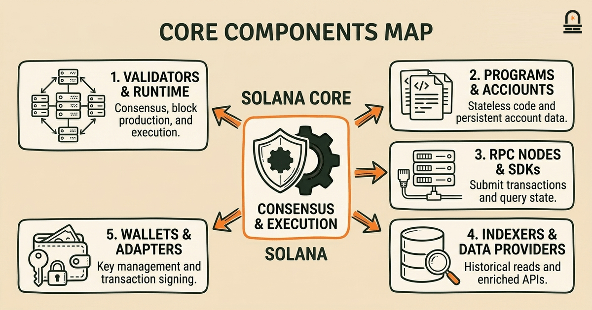
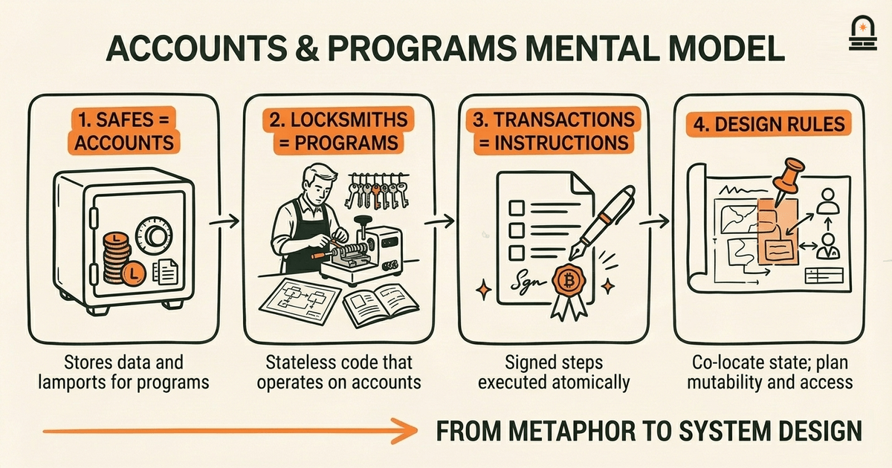
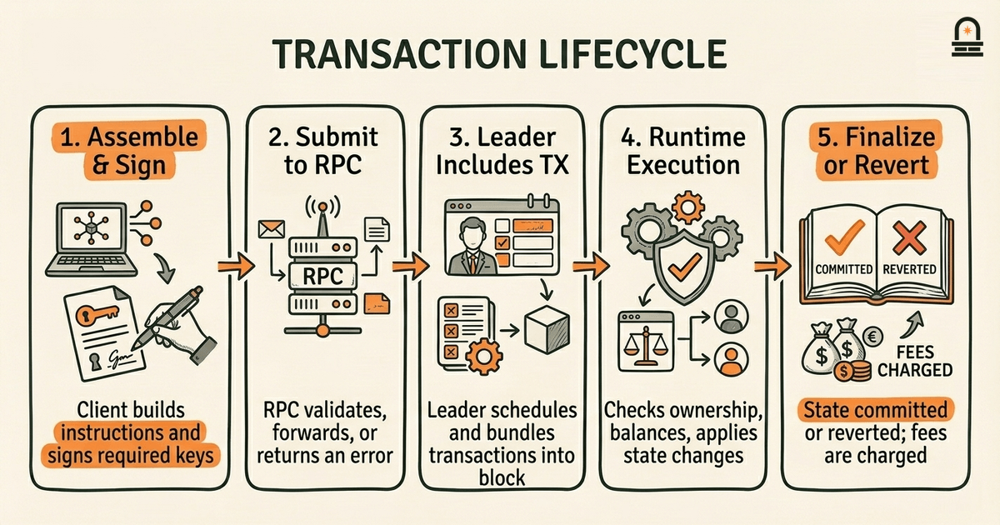
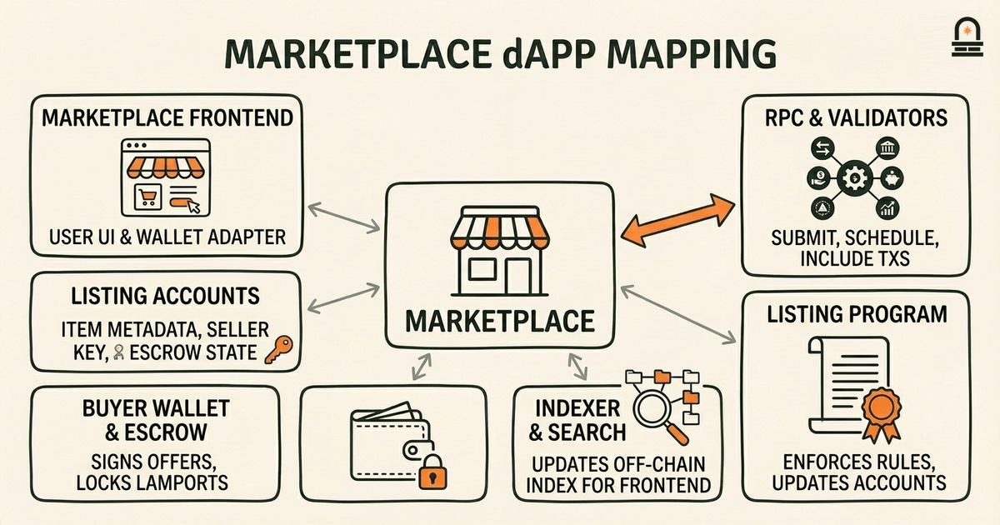
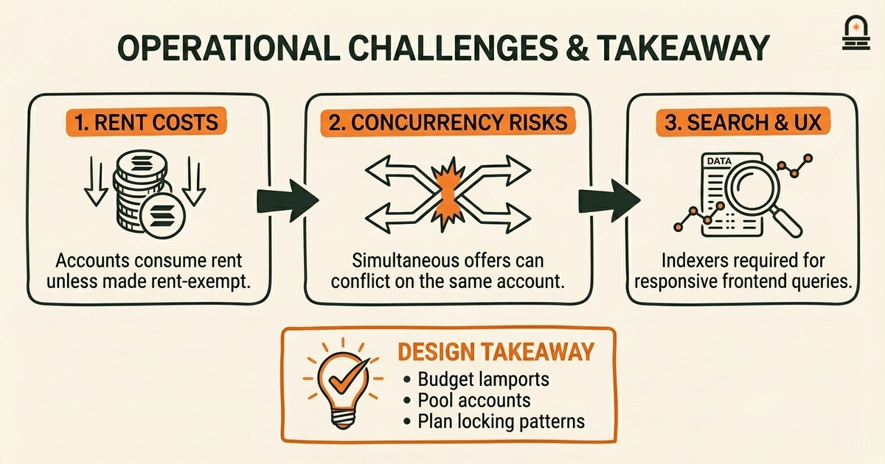

### Listen to the audio version

[Listen to this episode on Spotify](https://open.spotify.com/episode/1ub3yom55223SgCMrLn07z)

---

**Objective:** Identify the core components of the Solana ecosystem overview and define common Solana terminology relevant to newcomers.

**Why now:** Establishes a shared vocabulary and scope so subsequent lessons build on the same baseline.

**Concepts:** Components of the Solana ecosystem overview; Common Solana terminology and definitions; Roles of participants within the Solana ecosystem; How projects and infrastructure pieces fit together; Developer touchpoints in the Solana ecosystem

**Read time:** 12 min

---

## Recap & Introduction

Solana's architecture emphasizes high throughput by combining a single global ledger with techniques that let validators process transactions in parallel while preserving a consistent state. From the previous lesson you should recall a concrete tradeoff: increasing throughput requires tighter coordination between hardware (fast CPUs, high I/O network links) and software (efficient scheduling, transaction parallelization), which affects decentralization pressure and validator cost structure.

That hardware/software coordination insight connects directly to the goal of this lesson: before you start exploring projects, tools, or APIs on Solana, you need a shared vocabulary that maps components to roles and touchpoints. We move from architecture tradeoffs to an ecosystem map because knowing what each piece does—and how it sits in the stack—lets you ask the right implementation questions later. If you can name the actors and infrastructure, you can match developer needs to the correct services without confusion.

By the end of this lesson you will be able to identify core ecosystem components such as validators, RPC nodes, runtime programs, and token/identity primitives; define common Solana-specific terms like account model, rent, and epochs; and describe how projects and infrastructure pieces fit together from both a developer and an operator perspective. We establish this baseline vocabulary now so the next lesson, which places terminology into concrete examples, builds on a consistent foundation rather than repeating definitions in scattered contexts.

---

## Learning Objectives

After working through this lesson, you will be able to:

- **Identify** the primary components of the Solana ecosystem and explain each component's role in the transaction lifecycle.
- **Define** Solana-specific terms such as account model, program, rent, epoch, leader schedule, and stake with precision and context.
- **Map** common developer touchpoints—RPC nodes, SDKs, wallets, explorers—to the underlying infrastructure they rely on.
- **Explain** how validators, clusters, and off-chain infrastructure interoperate and what practical implications those interactions create for application architecture.

Each objective is testable: you should be able to match an ecosystem component to a developer task, explain why a term matters for design decisions, and describe practical implications of participant roles.

---

## Core Components of the Solana Ecosystem

Start by picturing the Solana ecosystem as a layered stack where each layer provides services to the layer above. At the base are the validators and the network fabric that maintain the shared ledger. Above that sits the runtime that executes programs (Solana's smart contracts) and enforces the account model. Surrounding those core pieces are developer-facing infrastructure components: RPC nodes for remote procedure calls, indexers and data providers for historical reads and analytics, wallets that manage keys and sign transactions, and off-chain services like oracles and backend servers that interact with on-chain programs.

Validators: validators run the Solana runtime and participate in the proof-of-stake consensus process. They process transactions, produce ledger entries, and vote on ledger states. Validators have operational roles beyond consensus: they serve RPCs when configured, store block data, and can be configured to provide archival history. The leader schedule—deterministic intervals that assign a leader to produce blocks—affects when a validator is responsible for bundling transactions and generating proof of validity.

Programs and Accounts: Solana separates code (programs) from persistent data (accounts). Programs are deployed once and executed by transactions that reference accounts. The account model is central: accounts hold arbitrary binary data and lamports (Solana's base unit), and programs operate on accounts passed in with transactions. This model influences application structure because programs do not have private storage; developers design state around accounts that clients and programs jointly access.

RPC nodes and client SDKs: RPC nodes expose JSON-RPC endpoints that let you submit transactions, query account state, and subscribe to events. Client SDKs wrap those RPCs with language idioms and utilities such as transaction building and instruction serialization. Indexers and data providers complement RPCs by offering enriched views (token balances across history, program-specific event traces) useful for front ends and analytics. Wallets mediate signing and transaction approval, connecting user keys to applications through standardized interfaces.

| Layer | Primary Responsibility | Developer Touchpoint |
| --- | --- | --- |
| Consensus & Network | Maintain ledger, schedule leaders, propagate blocks | Validator configs, cluster RPC endpoints |
| Runtime & Programs | Execute program logic, manage accounts | Program deployment, accounts, instruction construction |
| Data & Indexing | Provide historical queries, analytics | Indexers, specialized RPCs, subgraph services |
| Client & UX | Key management, transaction signing, display | Wallet adapters, SDKs, explorers |

Understanding these components in layered terms clarifies who does what and where responsibilities lie. For example, when you see a slow response from an RPC, you can determine whether the bottleneck is the node, the network, or the indexer pipeline. When you design a dApp, you pick which layers you control (programs, front end) and which you rely on (indexers, wallet providers). That mapping from responsibility to touchpoint is the practical baseline you will use across subsequent lessons.

---

## Mental Models: Accounts, Programs, and the Transaction Flow

**The Mental Model:** A practical mental model that simplifies Solana's account-program architecture is to imagine a collection of labeled safes (accounts) and a set of locksmith instructions (programs) that can open, change, or transfer contents when presented with the correct keys and authorizations. Each safe stores data and value; a locksmith has the rules for what operations are allowed on the safe. A client brings a list of safes and locksmith operations (a transaction) to the ledger, and the current leader executes the instructions against the referenced safes in a single atomic step.

Use this metaphor to reason about common developer questions. If you need persistent user state, create dedicated accounts for that user and design the program's instructions to accept those accounts as mutable inputs. If multiple programs need to operate on the same persistent data, they must share access to the same account(s), and you need to reason about concurrent access. The atomic nature of transactions means that either all modifications to the referenced safes occur or none do; that property helps you design consistent updates without multi-transaction coordination for many common flows.

Now translate the metaphor into the transaction lifecycle. A client assembles a transaction that lists program instructions and references accounts with specific roles (read-only versus read-write). The transaction is signed by the required keypairs, sent to an RPC node, forwarded to validators, and included by the leader for execution. During execution, the runtime deserializes instructions, checks account constraints (ownership, balances, rent exemption), applies state changes, and records the result in the ledger. If execution fails, the runtime reverts state changes and charges the fee payer for compute and bandwidth consumed.

This model surfaces three practical design rules you will reuse: first, plan account layout intentionally—co-locate frequently-accessed state to minimize cross-account overhead; second, minimize mutable account count in a transaction to reduce contention and keep parallelizable execution opportunities; third, factor out frequently reused logic into shared programs rather than deploying duplicate code. These rules follow directly from the mechanism: accounts are the only persistent storage and programs are stateless executors that operate on accounts you pass in.

Finally, the safe-and-locksmith mental model also helps when debugging or reading transaction traces. When a transaction fails due to an account mismatch or missing signer, treat the failure as a mis-specified safe list or missing key. When execution consumes unexpected compute units, inspect which instructions modified which accounts and whether large account copies or heavy cryptographic operations are involved. Using the metaphor makes it faster to map runtime errors to design fixes.

---

## Example: Mapping a Simple dApp to the Solana Ecosystem

Walk through a concrete example: a simple on-chain marketplace where sellers list items and buyers place offers. Use this scenario to map each actor and infrastructure piece to the components we introduced. You will see how the architecture choices and terminology apply to a real developer workflow.

Design overview: the marketplace has a program that manages listings and escrow accounts. Each listing is an account that stores item metadata and the seller's public key. When a buyer wants to place an offer, the client constructs a transaction that references the listing account, the buyer's wallet account, and a temporary escrow account. The program enforces business rules: only the seller can finalize a sale, offers lock lamports in escrow until finalized, and the program updates ownership fields in accounts when a sale completes.

Developer touchpoints and infrastructure mapping: first, you use a client SDK to create and serialize instructions for the listing program. The wallet adapter constructs and signs the transaction; the signed transaction is submitted to an RPC endpoint. That RPC either forwards the transaction to the cluster or returns an immediate error if submission fails. Validators receive and schedule the transaction for inclusion based on the current leader schedule. An indexer watches finalized blocks and updates an off-chain search index so the marketplace front end can show active listings and historical sales.

Operational considerations: storage for listing accounts consumes rent unless the account is rent-exempt. This means you must budget lamports when creating listing accounts to avoid eventual reclamation. If listing creation is frequent, you might design a pooled account model to reduce per-listing rent overhead. You also need to consider concurrency: if multiple buyers try to place offers for the same listing simultaneously, the program must handle potential conflicting transactions, possibly by using a locking pattern within the account data or by ordering offers through transactions that consume a unique nonce account.

Why this mapping matters: by explicitly connecting the marketplace features to ecosystem pieces, you can make concrete choices. For example, choose an indexer provider with fast finality-aware updates if your UI needs near-real-time listings. Choose a wallet integration that supports the signing UX you desire (pop-up approval, mobile deep link). Decide whether to host your own RPC for reliability or rely on a managed provider based on expected load and access patterns. This example shows how terminology and component roles shape practical architecture decisions you will face when building on Solana.

---

## Conclusion & Key Takeaways

You should now have a clear mental map of Solana's ecosystem: a layered stack where validators and the runtime provide the ledger and execution environment, programs implement logic and operate on accounts, and external infrastructure—RPCs, indexers, wallets, and oracles—connect developers and users to on-chain state. Keep the account-program transaction flow and the safe-and-locksmith analogy in mind when designing state and debugging execution failures.

Three practical principles to remember: 1) design account layout intentionally because accounts are the only persistent storage and rent matters for long-lived data; 2) minimize mutable account contention to preserve parallel execution and lower latency; 3) map developer touchpoints to infrastructure responsibilities so you can choose appropriate services (for example, selecting indexers for historical queries or deciding whether to run an RPC). These principles translate the terminology into actionable choices you will use across subsequent lessons.

This lesson sets the vocabulary and basic reasoning patterns you need. The next lesson—Key Solana Terminology in Context—will put these terms into specific examples and traces so you can see them used in real transactions and project architectures. With the shared vocabulary established here, you will be able to follow those contextualized examples with less friction and ask sharper questions about design tradeoffs and implementation techniques.

---

## Quick Recap

- Solana's ecosystem is layered: consensus and validators at the base, runtime and programs in the middle, and developer-facing services around the edges.
- Programs are stateless executors; accounts store persistent data and lamports—design account layouts with rent and concurrency in mind.
- RPC nodes, indexers, and wallets are developer touchpoints; map tasks to the correct service when building or debugging.
- Keep the safe-and-locksmith mental model handy to reason about transactions, permissions, and failures.

---

## Next Steps

Proceed to the next lesson, "Key Solana Terminology in Context," where we place the vocabulary from this lesson into concrete transaction traces and short code examples so you can see terms applied end-to-end. As you move on, be prepared to identify the accounts, programs, and RPC interactions in a sample transaction and trace how state changes across blocks.

Before the next lesson, review your notes on the account-program model and think of a simple on-chain flow you might want to map (for example: token transfer, marketplace listing, escrow close). Having a concrete flow in mind will make the upcoming contextual examples easier to follow.

---

## Glossary

### Account

A persistent on-chain container that stores binary data and lamports; programs operate on accounts passed into instructions.

### Program

Deployed executable code on Solana that runs deterministically when invoked by a transaction's instructions.

### RPC Node

A remote procedure call endpoint that accepts transactions, returns state queries, and forwards requests to the validator cluster.

### Validator

A node that participates in consensus, executes transactions, votes on ledger state, and helps maintain the cluster's health.

### Rent (rent-exemption)

A mechanism where accounts must hold sufficient lamports to avoid reclamation; rent-exempt accounts require a minimum balance based on storage used.

### Leader Schedule

A deterministic assignment of validators that become block producers for specific slots or time intervals.

### Epoch

A time period used to organize stake activation/deactivation and the leader schedule; epochs group slots into manageable windows.

---

## References & Further Reading

- [Solana: A Technical Overview](https://docs.anza.xyz/clusters) — *Solana Labs Documentation* (Core Protocol)
- [Accounts and Programs](https://solana.com/docs/core/programs) — *Solana Developer Docs* (Developer Documentation)
- [Setting Up an Agave Validator](https://docs.anza.xyz/operations/setup-a-validator) — *Agave / Anza Docs* (Operational Concepts)
- [Solana: A New Architecture for a High Performance Blockchain (whitepaper)](https://solana.com/solana-whitepaper.pdf) — *Solana Labs* (Design Paper)
- [JSON-RPC API Reference](https://solana.com/docs/rpc) — *Solana Labs* (Ecosystem Tools)
