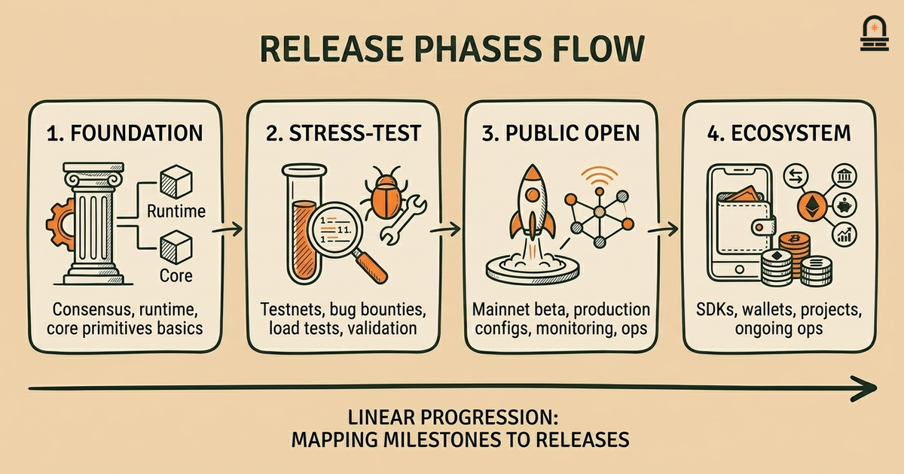
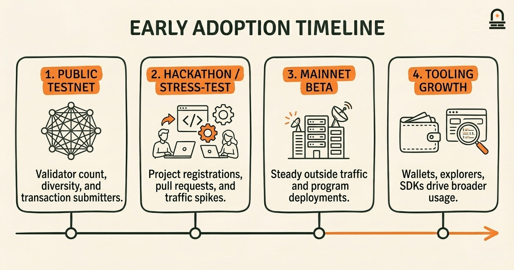
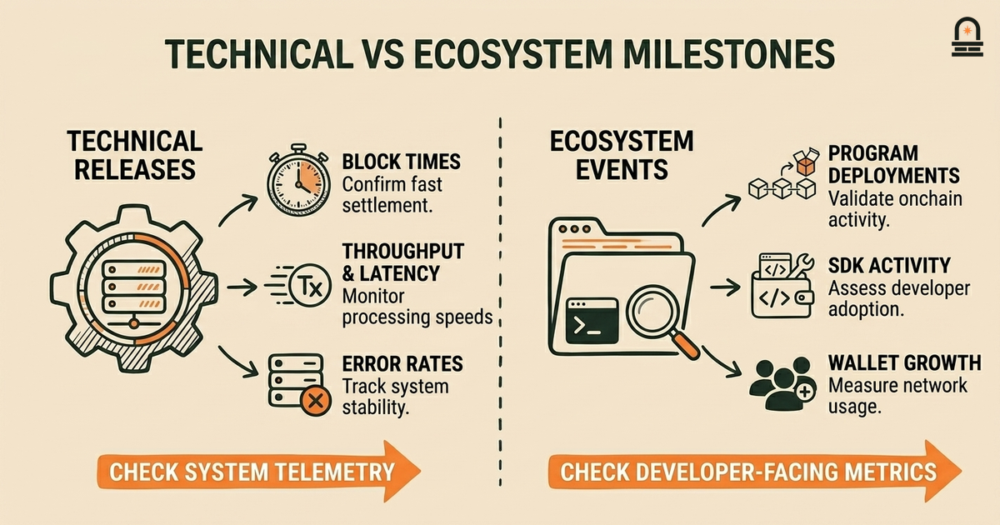

### Listen to the audio version

[Listen to this episode on Spotify](https://open.spotify.com/episode/2UvWp6tkjDAGlub3Dzxu8d)

---

**Objective:** Map the major milestones in Solana's early development and understand patterns of early adoption and project growth.

**Why now:** A timeline ties founders' goals and early problems to observable milestones in project growth.

**Concepts:** Major public releases and launches; Testnet and mainnet progression; Notable project collaborations and integrations; Indicators of early adoption and network activity; How milestones influenced subsequent priorities

**Read time:** 12 min

---

## Recap & Introduction

A timestamped chain of records enforces an ordered history: each record references prior state with cryptographic linkage so that reordering or insertion becomes detectable. You recall from the previous lesson that Solana's whitepaper places strong emphasis on ordering and time-oriented primitives to achieve throughput and finality, and that Merkle-style structures were proposed for compact proofs of inclusion. Those concrete mechanisms are the baseline tools that get exercised and validated by product milestones — every network release, testnet, and integration shows one way the design moved from theory into measurable behavior.

Mapping milestones is the natural next step after examining mechanisms because milestones reveal where design choices were implemented, stress-tested, and iterated. In practice, a milestone is not just a date; it is a technical change, a coordinated release, or a major partnership that changes what you can measure on the network: transaction rate, validator count, tooling availability, and developer onboarding. In this lesson we map the major public releases, testnet-to-mainnet progression, notable integrations, and the observable signals that indicate early adoption. You will connect those milestones back to the mechanisms you studied earlier so you can see how a timestamped ordering primitive or a consensus adjustment shows up as a measurable change in network activity.

---

## Learning Objectives

By the end of this lesson, you will be able to:

- Describe the sequence of Solana's early public milestones, including major testnets and mainnet steps, and explain why each mattered technically.
- Identify three concrete adoption indicators (for example: active addresses, transaction volume spikes, and project integrations) and map them to specific milestones.
- Analyze how early technical releases shifted project priorities (for instance, from raw throughput toward tooling or validator decentralization).
- Use a simple timeline mental model to evaluate whether a future milestone is likely to affect developer adoption or network security.

Each objective is framed to be testable: you should be able to point to a milestone and explain which mechanism it exercised, which metrics changed, and what strategic priority that change signaled.

---

## A Mental Model: Releases as Construction Phases

**The Mental Model:** Think of the network's lifecycle like building a large bridge in phases. In the first phase you lay foundational supports (consensus primitives and core runtime). Those supports are analogous to the whitepaper mechanisms: timestamped ordering, transaction processing pipeline, and compact proof structures. In the second phase you test the supports under load (testnets and bug bounties). Those tests reveal weaknesses in tooling, validator onboarding, and network parameter defaults. In the third phase you open the bridge to limited traffic (mainnet beta), monitor traffic patterns, and add signage and lanes (developer tooling, wallets, block explorers). Finally, the fourth phase brings commercial traffic and ongoing maintenance (ecosystem projects, performance optimizations, and governance adjustments). This phased model helps you evaluate milestones by role: foundational, stress-test, public-open, or ecosystem-expansion.

Use this model as a filter when you look at any milestone. Ask: which construction phase does this milestone belong to? A release labeled "mainnet beta" is rarely a finish line; it is an invitation to shift monitoring from correctness to scale. A major SDK or wallet integration is not necessarily a change to the ledger itself, but it can be the critical signage that lets traffic flow. When you map milestones against the construction phases you gain a clearer view of causality: some milestones are enablers (low-level fixes and performance gains), others are catalysts (partnerships or tooling that suddenly make the chain usable by real projects).

Concretely, this mental model helps you reason about tradeoffs. A foundation-phase milestone that increases raw throughput might later require governance or staking policy changes to preserve decentralization. A stress-test milestone that reveals bottlenecks will typically shift priorities toward profiling and developer ergonomics. Keep the model active: whenever you inspect a historical milestone, annotate it with the phase, the primary mechanism exercised, and the immediate adoption signal that followed. That short annotation habit trains you to see not just dates, but functional transitions: what changed for validators, what changed for app teams, and what changed for end users.

The bridge metaphor also makes it easier to communicate: when you explain early adoption to colleagues, use phase labels rather than vague adjectives. Say "we're in public-open phase because the mainnet beta allowed limited external traffic" instead of "the network is mature now." The phased naming helps you choose appropriate questions: foundation-phase work asks "are the supports correct?" Public-open asks "can outside traffic use the bridge safely?" and ecosystem-expansion asks "do third parties find it worth building lanes?" That clarity is the practical payoff of the mental model.

---

## Concrete Timeline Example and Adoption Signals

Walk through a concrete early timeline to see how milestones and adoption signals connect. We present a distilled sequence that emphasizes the relationship between a release, the technical mechanism it exercised, and the measurable indicator that followed. Dates are presented as reference points for ordering rather than precise timestamps.

Start with an initial public testnet release. The testnet's purpose is to exercise the ordering and consensus under distributed conditions and to validate that transaction ordering primitives behave as expected. The immediate adoption signal you should watch for is the diversity and count of validator nodes joining the testnet and the number of distinct addresses or keys submitting transactions. Rapid growth in validator diversity suggests that the onboarding story and documentation are sufficient for operators; a steady flow of transactions from a few addresses suggests stress-testing by maintainers rather than organic interest.

Next comes a stress-test or "hackathon" milestone. Here, third-party projects and independent teams build against the chain in concentrated bursts. The adoption indicators include active projects registered, pull requests against SDKs, and spikes in transaction load. A spike without an increase in independent validator participation can indicate testing is centralized (project teams driving traffic) rather than distributed.

Then a mainnet beta launch: this milestone is the formal opening to external traffic. The technical mechanism exercised at this point usually includes production-config consensus parameters, initial economic configuration, and hardened RPC endpoints. The key adoption signals are steady transaction volume outside of testing windows, growth in unique program deployments, and expanding tooling like wallets and block explorers. Observing these signals helps you separate ephemeral load from real usage: tool-based metrics such as daily active program deployments are stronger signals of developer adoption than raw transactions alone.

Finally, ecosystem integrations and partnerships follow. These are milestones where external applications, exchanges, or cross-chain bridges integrate. You watch for new types of transactions (for example, program-specific calls rather than simple transfers), increases in total locked value in non-custodial programs (presented here as "adoption of programmatic features" rather than financial advice), and new categories of developer questions on forums and repositories. The presence of independent tooling (explorers, SDK wrappers, monitoring dashboards) is an actionable sign that third-parties find the platform usable enough to invest time in tooling.

Below is a compact table you can use when annotating an early milestone timeline. Use it as a template when you examine real historical records: replace generic indicators with the actual metrics you can access from the chain's explorer or analytics providers.

| Milestone | Primary Mechanism Exercised | Early Adoption Signals |
| --- | --- | --- |
| Initial Public Testnet | Consensus under distributed nodes; ordering validation | Validator join count, distinct transaction submitters |
| Hackathon / Stress Tests | SDK and RPC robustness; tooling durability | Project registrations, SDK PRs, transaction spikes |
| Mainnet Beta | Production configs; hardened RPC and economics | Program deployments, steady non-testing transaction volume |
| Ecosystem Integrations | Cross-project interoperability; wallet and explorer support | New transaction types, tooling projects, forum activity |

When you analyze a real historical milestone, line up the milestone against this table and annotate what changed in metrics and what shifted in priorities. Over time the table will become a living checklist you apply to new releases or ecosystem news, enabling you to separate technical changes from adoption effects. That analytic habit is the practical skill you are building: it converts press releases into testable signals you can observe on-chain or in developer repositories.

---

## Comparison: Technical Releases vs Ecosystem Events

**Key Differences:** Compare two broad classes of milestones so you can quickly judge their likely effect on adoption: technical releases and ecosystem events. Treat technical releases as changes that primarily affect network behavior and performance; treat ecosystem events as changes that primarily affect developer, integrator, or user experience. The pedagogical goal is to help you prioritize which metrics to check first based on the milestone type.

Technical releases include protocol optimizations, consensus parameter updates, or runtime changes. When you see a technical release, the first place you look is system-level telemetry: block times, confirmation latency, transaction throughput, error rates in RPC responses, and validator resource utilization. A technical release that reduces confirmation latency or increases throughput is likely to show immediate telemetry improvements, but adoption impact depends on whether the community trusts the new configuration and whether tooling and SDKs keep up. For technical releases, the critical follow-up questions are: did validator participation remain stable, did error rates increase during the upgrade window, and were client libraries updated simultaneously?

Ecosystem events include major SDK launches, wallet integrations, listings, or prominent project launches on the chain. When you see an ecosystem event, the first metrics to inspect are developer-facing: number of new program deployments, SDK downloads or repository forks, questions/tag activity on developer forums, and changes in wallet address creation rates. Ecosystem events often produce a different temporal pattern: sharp bursts of new accounts and program deployments, followed by a slower ramp in sustained usage. For these events, the important follow-ups are: are the new accounts active beyond initial setup, do program deployments represent independent projects or single-platform replicas, and does the tooling ecosystem show signs of maintenance activity?

Both types of milestones matter, but they imply different interventions. If a technical release produces regressions, the project team must prioritize hotfixes and possibly rollbacks. If an ecosystem event draws new builders but tooling is lacking, the team should prioritize SDK improvements and documentation. From your perspective as an analyst or integrator, this distinction helps you decide which dashboards to monitor and which conversations to start with maintainers: telemetry for technical releases, and community channels and SDK repos for ecosystem events.

Use this comparison as a quick triage heuristic: classify a milestone, then pick the small set of metrics that are most likely to reveal whether the milestone achieved its intended effect. That targeted approach saves time and makes your assessments both faster and more reliable.

---

## Conclusion & Key Takeaways

You should now be able to map specific milestones to the underlying mechanisms you studied earlier and to the observable signals that indicate adoption. Three practical principles are especially useful: first, treat milestones as functional transitions (foundation, stress-test, public-open, ecosystem-expansion) rather than as isolated headlines; second, pick metrics that match the milestone type — telemetry for protocol work, developer activity for ecosystem work; third, annotate milestones with short cause-effect notes: what mechanism changed, what metric moved, and what priority shifted next. Those principles let you convert historical timelines into actionable analysis rather than passive chronology.

Looking forward, this mapping prepares you to read project communications critically. When a team announces a new release or partnership, you will be able to predict which adoption signals to monitor and which questions to ask: does this change validator economics, or does it simply make application-level development easier? That distinction guides whether the likely downstream effect will be altered network security posture or increased developer activity. As you prepare for the next lesson on critical reading strategies, you will find it easier to interrogate announcements because you now have a structured timeline lens: milestones are evidence, not just milestones.

---

## Quick Recap

- Milestones map implementation steps to measurable adoption signals — treat them as functional transitions, not mere dates.
- Use different metrics depending on milestone type: telemetry for protocol releases, developer activity for ecosystem events.
- Annotate each milestone with the mechanism exercised and the immediate observable indicator to convert history into analysis.

---

## Next Steps

Prepare for the next lesson, "Critical Reading Strategies and Next Steps," by collecting two items you will use as practice material: one recent project announcement or release note from the Solana ecosystem, and one block explorer or analytics snapshot showing activity around the time of that announcement. In the next lesson we will evaluate how to read those announcements critically and how to test whether their claimed effects show up in on-chain metrics. Bring your notes about which metrics you expect to change for the announcement you pick so you can apply the mental model and timeline checklist from this lesson.

---

## Glossary

### Mainnet Beta

A public launch phase where production configuration is opened to external traffic but active monitoring and adjustments continue.

### Testnet

A network environment intended for distributed testing that mirrors production behavior without using mainnet assets or configurations.

### Program Deployment

The act of publishing a smart contract or on-chain program to a network; indicates developer activity and feature adoption.

### Validator Participation

The number and diversity of nodes actively processing and validating blocks; a key signal of decentralization and operational health.

### Adoption Indicator

A measurable signal such as unique addresses, transaction types, or tooling projects that suggests increased real-world use of the network.

### SDK (Software Development Kit)

A collection of libraries and tools that make it easier for developers to build and interact with on-chain programs and APIs.

### Telemetry

System-level metrics such as block time, latency, and error rates used to assess technical health after a release.

---

## References & Further Reading

- [Solana: A new architecture for a high performance blockchain (Whitepaper)](https://solana.com/solana-whitepaper.pdf) — *Solana Labs* (Primary Technical)
- [Solana Documentation: Overview](https://solana.com/docs) — *Solana Docs* (Documentation)
- [Official Solana News and Announcements](https://solana.com/news) — *Solana News* (Announcements)
- [Solana Ecosystem Registry and Project Integrations](https://solana.com/ecosystem) — *Solana* (Ecosystem)
- [Solana Clusters: Devnet, Testnet and Mainnet Beta](https://docs.anza.xyz/clusters) — *Agave / Anza Docs* (Analysis)
