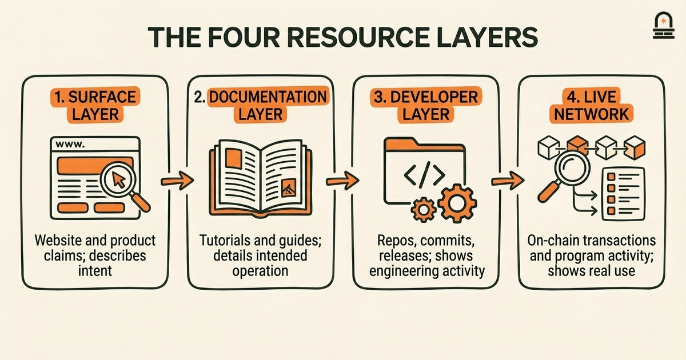
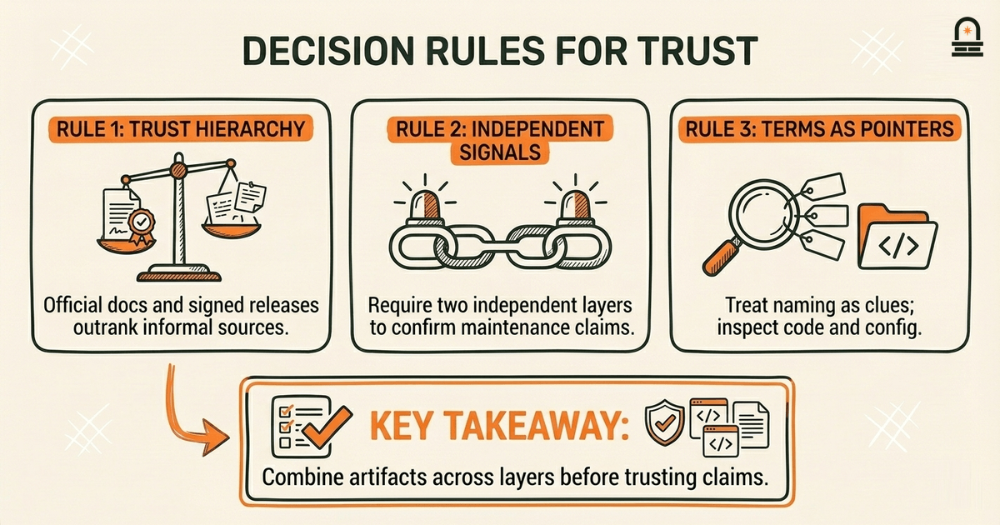
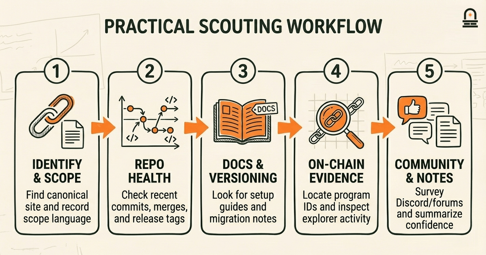
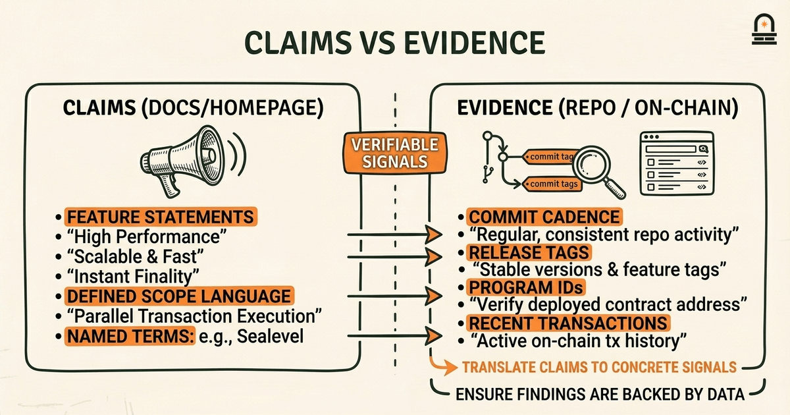

### Listen to the audio version

[Listen to this episode on Spotify](https://open.spotify.com/episode/3sXuCqoSzg4g2nLFb5qg8T)

---

**Objective:** Summarize reliable resources for continued exploration of the Solana ecosystem overview and explain how terminology will inform upcoming modules.

**Why now:** Concluding the module with navigation skills makes continued, independent learning more effective.

**Concepts:** Authoritative resource types for the Solana ecosystem overview; How to approach documentation and glossaries for Solana terminology; Signals that indicate active or maintained projects; Preparing resource-based comparisons for future modules on incentives

**Read time:** 11 min

---

## Recap & Introduction

You reinforced how to interpret on-chain activity and repository metrics as reliable signals when mapping Solana project categories: for example, that frequent commits, clear release tags, and recent deploys often correlate with active development while a healthy issue triage process correlates with maintainability. Recall how you separated projects by function — wallets, infrastructure, DeFi primitives, NFT tools — and associated different signals with each category (network usage for DeFi, API stability for infrastructure, metadata format consistency for NFT tooling).

Now we bridge from categorization to navigation: you will convert those signals into a set of dependable resources and a repeatable approach for exploring and tracking projects across the Solana ecosystem. Because you can already recognize signals of activity and health, the next step is learning where to find authoritative documentation, how to read documentation and release notes efficiently, and how to judge whether a project is actively maintained. These skills directly support independent study and prepare you for comparative analysis of incentives in the upcoming module.

By the end of this lesson you will be able to identify the types of resources that reliably convey status and intent for a Solana project, prioritize which resources to read first when assessing a project, and prepare simple side-by-side comparisons that will feed into later work on incentives and architecture. We will treat terminology not as isolated vocabulary but as labels you will use to filter, sort, and interpret evidence from official docs, developer repositories, block explorers, and community channels.

---

## Learning Objectives

By the end of this lesson you will be able to do the following concrete tasks:

- List and categorize at least five authoritative resource types relevant to Solana projects and state what each type typically reveals (for example, "release tags show version cadence").
- Apply a short checklist to quickly evaluate whether a project's documentation and repositories are current and maintained.
- Extract terminology from authoritative resources and map those terms to the project categories you already identified.
- Prepare a compact, resource-based comparison that highlights signals relevant to incentives and upcoming modules.

Each objective is testable: you will demonstrate them by collecting evidence from live resources and summarizing what those resources imply about a project's activity and focus.

---

## Mental Model: The Resource Map and Evidence Layers

**The Mental Model:** Think of the Solana ecosystem as a layered map where each resource type sits at a different altitude and reveals a different slice of the landscape. The surface layer — the visible product and website — tells you what a project claims it does. The next layer down — the documentation and tutorials — explains how the project intends to operate. Below that sits the developer layer: GitHub repositories, release history, and CI pipelines that show engineering activity. The deepest layer is the live network layer: on-chain program activity, transaction patterns, and explorer traces that reflect real usage. When you approach a project, you will interrogate each layer in order to form a composite view.

This layered mental model helps you translate terminology into signals. For example, when a project uses the term "stable release" in its docs, confirm that claim in the developer layer by checking for semantic versioning and signed release tags. When documentation mentions "mainnet-ready" features, cross-check with the live network layer for deployed program IDs and recent transactions. Terminology without corroborating evidence is a claim; the map encourages you to search multiple layers for validation.

To operationalize the map, we introduce three decision rules you will use repeatedly. First, prioritize resource types by trustworthiness: official docs maintained by the project or foundation outrank community tutorials, and cryptographic artifacts (signed releases, release tags) outrank informal changelogs. Second, require at least two independent signals across layers to accept a maintenance claim: for instance, both recent commits in GitHub and recent transactions on-chain. Third, treat naming conventions and terms as pointers rather than conclusions: a term like "epoch" or "rent-exempt" tells you what technical concerns matter for a project, but you still need to inspect how those concerns are implemented in code and config.

Apply the map to terminology as you encounter it. When you read a project's glossary entry or README, annotate the resource layer it represents and note what evidence would confirm the claim. Over time this habit trains you to read documentation not as finished truth but as one layer of evidence in a broader verification process, which is precisely the mindset you will use when preparing comparisons in later modules.

---

## Workflow: A Practical Checklist for Navigating Solana Resources

**Process Overview:** We provide a repeatable workflow you will use whenever you begin exploring a Solana project. Follow these steps in order, and treat each step as a quick heuristic rather than a guarantee. The goal is to collect consistent evidence that you can later compare across projects, especially when preparing incentive-related analysis.

1. Identify the project name and canonical homepage or documentation link. Record the project scope language and key terms used in the README or landing page.
2. Open the project's primary repository. Check the date and frequency of recent commits, the existence of release tags, and whether pull requests are being merged regularly.
3. Scan the documentation for a clear setup or architecture section and for explicit versioning or migration notes.
4. Locate any published program IDs or deployment manifests; if present, inspect recent on-chain activity via an explorer for signs of live usage.
5. Survey community channels (forums, Discord, governance threads) for recent moderator responses and active developer discussion.
6. Summarize your findings in a short table or paragraph noting: resource link, what it reveals, and confidence level.

Why this matters in practice: this workflow transforms qualitative impressions into comparable evidence. When you later compare incentives, you will need to know whether a project's on-chain usage is primarily experimental or production-grade, whether documentation suggests stable API commitments, and whether the team signals long-term maintenance. The checklist above surfaces exactly those signals in a compact, repeatable way.

Use the following table as a compact reference you can reproduce when taking notes. It maps resource types to the specific signals you should look for and how to interpret them for comparative work.

| Resource Type | Signals to Check | What It Implies |
| --- | --- | --- |
| Official Documentation | existence of versioning, migration guides, explicit API references | Intent to maintain stable interfaces; useful for integration planning |
| GitHub / Repo | recent commits, release tags, CI status, issue triage | Active engineering and release cadence; signals maintenance capacity |
| Block Explorer | program IDs, transaction volumes, recent transactions | Real-world usage, production deployments, and operational stress points |
| Community Channels | moderator responses, proposal activity, roadmap updates | Engaged user base and governance momentum; community-driven change |
| Package Registries / SDKs | recent package versions, dependency updates | Ecosystem integration and developer adoption patterns |

Apply this workflow consistently when you curate resources for a comparative matrix. The matrix rows are projects and the columns are the resource signals; this produces structured input for later analysis of incentives or architecture tradeoffs.

---

## Concrete Example: Scouting a Project and Preparing Comparison Notes

Walk through a specific scouting session you will perform on a hypothetical Solana tool called "LedgerX" (a stand-in name). You will practice the workflow and extract terminology and signals that matter for incentive analysis. Begin by locating LedgerX's canonical documentation page and record the project's stated scope: for example, "on-chain wallet middleware for token batching." That scope provides the first set of terms you will map to later categories: "wallet", "middleware", "batching".

Next, open the project's primary repository and inspect the latest commits. Note the most recent commit date and the cadence over the last three months. If you see frequent merges with meaningful commit messages (for example, "fix: batch timeout handling"), that suggests active engineering focused on operational robustness. Pay attention to the release history: are there semantic version tags like `v1.2.0`? Are there stable branches named `main` and `release`? If release tags exist, click into the release notes and scan for breaking changes or migration guidance — those items tell you how much effort integrators must invest when adopting the project.

Then, consult the documentation for integration details. Does the README include code snippets showing how to connect to an RPC endpoint, or does it provide a list of supported token standards? Extract specific terminology the docs use for primitives (for example, "batch window", "fee prioritization"). Map each term back to your project categories and note whether the term signals user experience tradeoffs or incentive structures. For example, "fee prioritization" likely implies configurable fee markets or incentive mechanisms for validators or relayers.

Now check the live network layer: find any documented program IDs and search for them on a block explorer. Record whether transactions appear recent and whether transaction types align with claimed features (e.g., batched token transfers). Transaction volume and variety indicate whether a project is being tested or used in production; low-volume but recent transactions may indicate ongoing testing while high-volume usage suggests production adoption.

Finally, inspect community signals: look for an active Discord or forum thread where developers respond to integration questions. A well-maintained project will have concise troubleshooting guides, a changelog, and an explicit roadmap or milestone list. Summarize your evidence in a short comparison row that you can later add to a matrix. For LedgerX your row might read: "Recent commits: active; Releases: semantic tags present; Docs: integration-focused; On-chain: low but recent use; Community: responsive moderators." Translate each item into a confidence score (high/medium/low) and include notes on terminology that will matter when evaluating incentives (for instance, "batch window could affect fee accrual timing").

This concrete example shows how terminology, repository evidence, docs, and on-chain traces combine into a concise, comparable summary. When you repeat this process across multiple projects you'll have standardized inputs that feed directly into the comparative work required by the next modules.

---

## Conclusion & Key Takeaways

You should now be able to treat documentation, repositories, explorers, and community channels as complementary evidence layers rather than isolated resources. Principle one: prioritize authoritative documentation and cryptographic artifacts (release tags, signed commits) when evaluating maintenance claims. Principle two: require at least two independent signals across different evidence layers before accepting status claims such as "production-ready." Principle three: extract terminology from authoritative sources and map those terms to the project categories you previously identified so terminology becomes a functional filter during comparison.

These takeaways change how you learn: instead of passively consuming project pages, you will curate evidence that can be directly compared across projects. That habit saves time and reduces ambiguity when preparing analyses about incentives, architecture, or adoption. As you move into the capstone framing and then deeper incentive-focused modules, you will reuse the same resource checklist and the layered mental model to assemble reproducible comparisons and to justify choices with documented evidence rather than impressions.

---

## Quick Recap

- Use layered evidence: docs, repo, on-chain, community — require two signals to confirm claims.
- Prioritize cryptographic and version artifacts (release tags, CI) when judging maintenance.
- Extract and map terminology to project categories so terms inform later comparisons.
- Record concise comparison rows for each project to support incentive and architecture analysis.

---

## Next Steps

Prepare for the next lesson, "Framing the Capstone: Scope and Method for Solana's Story," by selecting two projects you mapped earlier and completing one comparison row for each using the workflow above. Focus on collecting documentation links, the latest three commits, any release tags, and on-chain transaction evidence. Bring your notes to the next lesson where we will synthesize scope and method for the capstone project, using your evidence-based summaries as source material.

If you have time, pick one unfamiliar term you found in a project's documentation, map it to the resource layers from this lesson, and write a one-paragraph note explaining how that term could influence incentives or operational tradeoffs.

---

## Glossary

### Authoritative resource

A source published or endorsed by the project team or governing foundation that documents intended behavior, APIs, and release notes; used to establish canonical claims about a project.

### Release tag

A version marker in a repository that identifies released code (often semantic versioning like `v1.2.0`) and signals a project's formal release cadence and potential migration guidance.

### On-chain program ID

A public identifier for a deployed smart contract or program on Solana; finding associated transactions helps verify whether a project is active on the network.

### Issue triage

The process of managing and responding to reported bugs and feature requests in a repository; active triage indicates ongoing maintenance effort and prioritization.

### Semantic versioning

A versioning convention (major.minor.patch) that signals breaking changes versus backwards-compatible updates and helps integrators plan upgrades.

### Evidence layer

One of the resource categories (documentation, repository, on-chain, community) used as a discrete source of signals when evaluating project claims.

---

## References & Further Reading

- [Solana Documentation — Core Concepts and RPC](https://solana.com/docs) — *Solana Docs* (Official Documentation)
- [solana-labs/solana — GitHub Repository](https://github.com/solana-labs/solana) — *GitHub* (Developer Repositories)
- [Anchor Book — A Framework for Solana Programs](https://www.anchor-lang.com/docs) — *Anchor* (Framework Documentation)
- [Solana Explorer — Inspect Transactions and Program Activity](https://explorer.solana.com/) — *Solana Explorer* (On-chain Reference)
- [SPL Token Program](https://www.solana-program.com/docs/token) — *SPL* (Token Standards)
