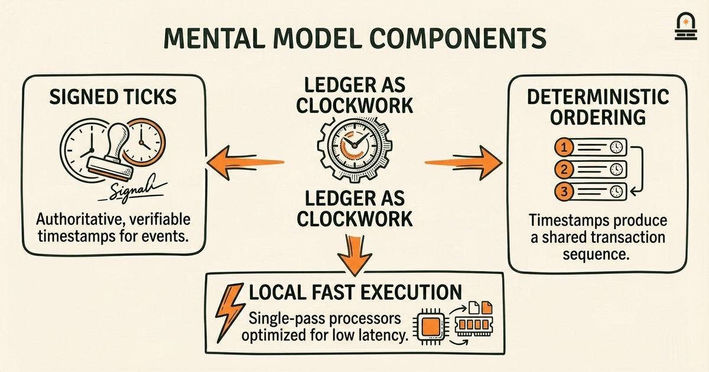
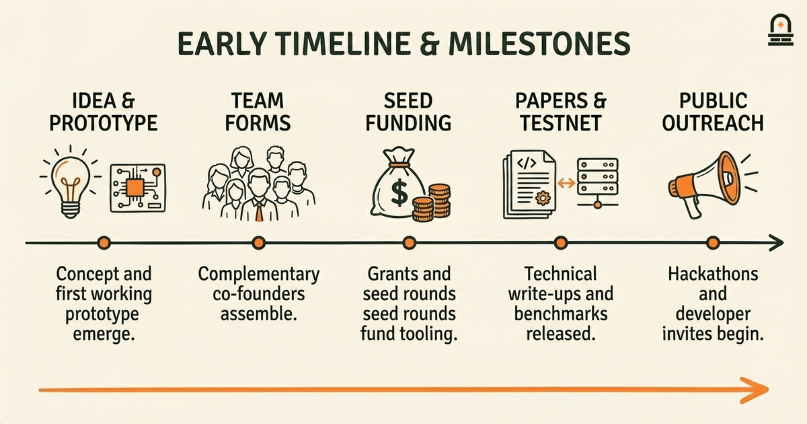
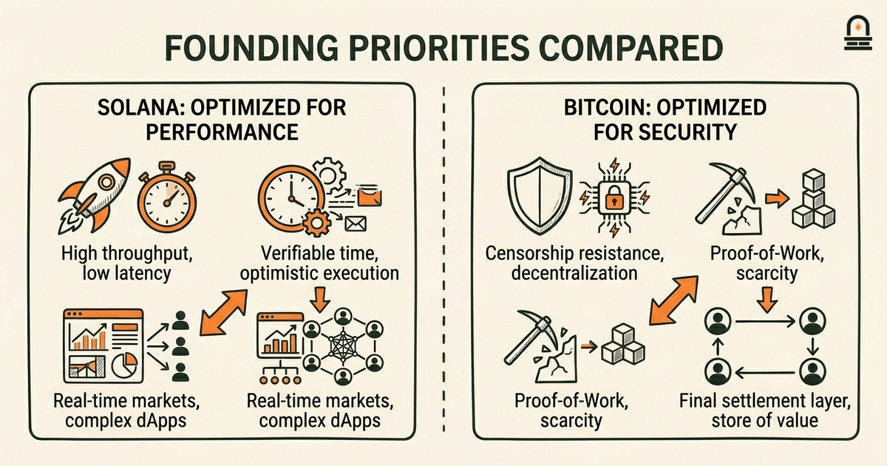

### Listen to the audio version

[Listen to this episode on Spotify](https://open.spotify.com/episode/0QmqNnQYpcV16uG7c8ydRD)

---

**Objective:** Trace Solana's origin story and identify the founding motivations and early team that launched the project.

**Why now:** Start with the origin story to ground later technical and social developments in the project's initial goals.

**Concepts:** Early motivations behind Solana's creation; Founding team and their roles; Initial technical vision and priorities; Early funding and support mechanisms; First public milestones and announcements

**Read time:** 12 min

---

## Recap & Introduction

Solana began as a response to a concrete engineering question: how do you scale a permissionless ledger without sacrificing finality or throughput? Recall from the previous lesson how the double-spend problem and the limits of centralized monetary intermediaries motivated Satoshi's design choices for Bitcoin. You already understand how Bitcoin prioritized censorship resistance and decentralized validation over transaction throughput; that prior design stance sets the contrast you need to understand why Solana's founders prioritized different tradeoffs.

We place Solana's origin story next so you can see how differing initial constraints and founder priorities produce distinct technical visions. You just examined the historical motives that led to Bitcoin's whitepaper — macroeconomic instability, lack of trust in centralized intermediaries, and a cryptographic solution to double-spend — and now you will trace how a separate set of motives produced Solana's design. By comparing the motivating problems, the founding team, early funding, and initial public milestones, you will build a map that links motivations to concrete design priorities such as high throughput, low latency, and developer ergonomics.

In the paragraphs that follow we develop each of these concepts in turn. You will see specific decisions and timelines that clarify why Solana emphasizes clock-based ordering and optimistic concurrency rather than replicating Bitcoin's exact design. Knowing these particulars will make the later technical lessons easier to decode, because you will already recognize which problems the design intended to solve.

---

## Learning Objectives

By the end of this lesson you will be able to:

- Explain the primary motivations that the Solana founding team identified when they designed the project, distinguishing those from Bitcoin-era motivations.
- Identify the principal founders and summarize each founder's role and technical contribution to the early architecture.
- Describe Solana's initial technical priorities — for example, throughput, latency, and single-state execution — and explain how those priorities map to specific design choices.
- Summarize the early funding sources and support mechanisms that enabled Solana's development and public rollout.
- Recognize the earliest public milestones and announcements, and explain how those milestones signaled the project's readiness to developers and investors.

These objectives are concrete and testable: you will reference named people, mechanisms, and dates, and connect motivations to early design decisions. We expect you to use this vocabulary in the next lesson when you read Solana's original technical documentation and public statements.

---

## Mental Model: The Ledger as Coordinated Clockwork

**The Mental Model:** Adopt the mental model of a distributed ledger as a set of machines that keep time together. Bitcoin's model emphasizes probabilistic ordering through proof-of-work, where miners race to append blocks and consensus emerges from difficulty and chain selection rules. For understanding Solana, instead imagine the network as a set of independently operating clocks that periodically agree on a common timebase. That metaphor helps you map Solana's technical choices to their intended effect: replacing probabilistic time with an explicit, verifiable notion of time simplifies ordering and reduces coordination overhead.

Why choose a clock-based model? In practical terms, if nodes can reliably agree on when an event happened, you can order transactions deterministically without large block confirmations or long propagation delays. Solana's approach introduces a verifiable timestamp mechanism — conceptualized as a network-wide clock — that each node can use to assign a position in the ledger. Use this mental model to see how many subsequent design choices become natural: you will understand why a lightweight timestamping primitive reduces the need for heavy coordination, why the network focuses on low-latency communication, and why transaction processors are optimized to run without long reorg windows.

Translate the metaphor into three concrete components you should hold in mind. First, an authoritative, easily verifiable timestamp: think of it as a signed tick that proves when an event occurred. Second, a deterministic ordering rule that leans on those timestamps so that validators and clients see the same sequence of transactions. Third, local execution engines optimized for fast, single-pass processing because they do not need to account for long reordering windows. When you picture these parts working together, the ledger-as-clockwork mental model explains the tradeoffs: you gain throughput and low confirmation latency at the cost of depending more on that shared time primitive and fast networking.

Use this framework when you read about Solana's innovations such as a verifiable delay or timestamp function and optimistic execution. The model is not perfect — it abstracts away network-level variance and attacker models — but it clarifies the intention behind design choices. You will apply this way of thinking in later lessons to predict which classes of applications will fit Solana's architecture and which will bump against its assumptions. Keep asking: how does a claimed improvement change the clockwork? Does it add extra guarantees, or does it depend on yet-unproven synchrony assumptions? That question will guide your technical reading and practical evaluation in subsequent lessons.

---

## Concrete Example: Early Timeline, Team Roles, and Public Milestones

Walk through a concrete timeline that connects people, funding, and early public signals. You will use this example as a reference point when later lessons discuss protocol changes and milestone-driven ecosystem growth. Focus on the sequence: idea formation and prototype, founding team coalescence, seed funding and grants, early technical papers, testnet launches, and the first public statements that invited developer participation. Seeing those stages together clarifies how a research prototype becomes a public blockchain.

Begin with idea and prototype. The initial concept emphasized scalable sequencing and minimizing coordination overhead. From that concept, co-founders with complementary strengths formed a core team: a protocol architect focused on novel ordering mechanisms, a systems engineer optimizing runtime performance, and a product/operations lead aligning the project with developer needs. You should note how role specialization allowed parallel work: while the architect refined the ordering primitive, systems engineers built a runtime that could make use of it, and outreach efforts started attracting early contributors and investors.

Next, early funding and support mechanisms enabled sustained development. Grants and seed rounds covered infrastructure costs — testnets, bug bounties, and developer tooling — while strategic advisors opened channels to developer communities. You will remember that early funding often targets coordination costs: paying nodes for testnet participation, sponsoring hackathons, and running incentivized programs that reveal scalability limits before mainnet rollout. These activities lowered barriers to entry for developers and produced the empirical data necessary to iterate the protocol.

Now examine the public milestones. The project released technical write-ups and a testnet that demonstrated throughput targets under controlled conditions. The team published measured benchmarks and posted update logs that documented bug fixes and performance tuning. Those public artifacts served two roles: they signaled technical credibility to engineers and offered concrete performance numbers to integrators and potential partners. Below is a compact table connecting milestone types to the signal they sent.

| Milestone | What It Demonstrated | Why It Mattered |
| --- | --- | --- |
| Prototype writeup | Feasibility of the ordering primitive | Attracted systems engineers and early reviewers |
| Private testnet | Performance under controlled conditions | Allowed tuning and internal validation |
| Public testnet | Community participation and attack surface testing | Validated assumptions at scale |
| Public benchmarks & updates | Measured throughput, latency, and stability | Provided trust signals to integrators |

Use this example to anchor later readings: when you encounter a protocol paper or a blog post about performance improvements, map it back to this timeline. Ask which milestone is being updated, which role within the original team drove the change, and which funding mechanism supported the effort. That mapping helps you separate marketing language from substantive technical progress and makes the subsequent lesson on reading whitepapers more practical and testable.

---

## Comparison: Founding Priorities Versus Bitcoin's Foundations

**Key Differences:** Compare the founding priorities of Solana with the motivations that shaped Bitcoin to clarify how initial goals influence technical design. Bitcoin emerged primarily from concerns about censorship resistance, monetary scarcity, and trust minimization; its proof-of-work mechanism and long confirmation windows reflect those priorities. Solana's founding priorities differ: they emphasize high throughput, low latency, and a developer-friendly execution environment. Recognizing this divergence helps you predict which tradeoffs each design must accept.

Start by comparing goals. Bitcoin aimed to create a censorship-resistant settlement layer where finality emerges from resource expenditure and chain security. Solana aimed to make a fast programmable ledger suitable for high-frequency or microtransaction applications. Because these goals differ, the two projects select different core mechanisms: Bitcoin relies on energy-based sybil resistance and eventual consistency, while Solana relies on a verifiable time primitive and optimistic execution to reduce coordination overhead. You should be able to explain why those two choices map to different threat models and operational characteristics.

Next, compare the role of latency and throughput. Bitcoin tolerates higher latency to strengthen reorg resistance; blocks take time and multiple confirmations increase certainty. Solana trades some of that long-window certainty for faster finality by designing the system so that blocks can be produced more quickly and transactions confirmed in fewer slots. This means that certain application classes — high-frequency markets, streaming payments, real-time games — become practical on a ledger that prioritizes low latency. Conversely, you will recognize that architectures that prioritize latency may accept different assumptions about network synchrony and validator behavior.

Finally, compare governance and ecosystem formation. Bitcoin's early growth was organic and decentralized, shaped by a volunteer developer community and miner incentives. Solana's early strategy involved targeted engineering hires, structured funding, and outreach programs to onboard developers quickly. That more active formation strategy accelerates ecosystem growth but also creates different social dynamics: faster onboarding and centralized coordination in early stages versus slower, organically emergent communities. When you evaluate a protocol claim or a governance proposal in later lessons, use this comparison to question whether a change aligns with the original founding priorities or represents a shift in goals.

Keep this comparison in your toolbox: it lets you translate design descriptions into tangible expectations about performance, risk, and suitable applications. Asking "what problem was the protocol originally trying to solve?" gives you a practical lens for interpreting technical papers, release notes, and roadmap items as you proceed through the course.

---

## Conclusion & Key Takeaways

You now have a grounded picture of Solana's founding: a project born from an engineering desire to reduce coordination costs by introducing a verifiable time construct and by optimizing for throughput and latency. Remember three concrete principles. First, founding motivations determine architecture: Solana's emphasis on speed and single-pass execution follows directly from its initial problem framing. Second, complementary team roles matter: protocol architects, systems engineers, and outreach leads created a feedback loop where design choices were validated through funded testnets and public benchmarks. Third, early funding and public milestones are not just financial events; they are practical coordination tools that pay for testing, tooling, and community signals that accelerate adoption.

These takeaways equip you for the next step: reading the project's technical documents with an eye toward intention and tradeoffs instead of surface claims. When you read protocol whitepapers or release notes, apply the ledger-as-clockwork mental model: identify the time primitive, the ordering rules, and the execution assumptions. That habit will help you separate substantive design innovations from marketing language and make your technical reading more efficient and critical.

Finally, keep the timeline and milestone example as an operational map. When you see a new performance claim, ask which milestone it updates and which founding priority it serves. This simple mapping — problem→priority→mechanism→milestone — is the practical skill that prepares you for the next lesson, where you will dissect the whitepaper's structure and central claims in detail.

---

## Quick Recap

- Solana's origin centered on reducing coordination overhead by introducing a verifiable network time primitive and optimizing for throughput and low latency.
- Founding roles combined protocol architecture, systems engineering, and developer outreach to convert prototypes into public testnets and benchmarks.
- Early funding and public milestones functioned as coordination mechanisms that validated technical assumptions and attracted developer participation.
- Use the ledger-as-clockwork mental model to map motivations to design choices as you read technical documents.

---

## Next Steps

Proceed to the next lesson, "Reading the Whitepaper: Structure and Central Claims," where you will apply the mental model and timeline from this lesson to analyze the original technical documentation. For that lesson, pay attention to how the paper defines ordering, time, and execution semantics; you will map those sections back to the founding priorities you've learned here. We recommend taking notes on any claims about timing primitives, transaction ordering rules, or benchmark methodology so you can compare them against the early milestones discussed in this lesson.

---

## Glossary

### Verifiable Time Primitive

A protocol-level mechanism that produces verifiable timestamps so nodes can deterministically order events without long probabilistic windows.

### Testnet

A public or private network used to validate performance and security assumptions before mainnet launch, often with incentivized participation.

### Ordering Primitive

The core mechanism a protocol uses to decide the sequence of transactions; designs differ in how they derive and agree on that sequence.

### Throughput

The rate at which a blockchain processes transactions, measured in transactions per second, and directly influenced by ordering and execution design.

### Finality

The condition when a transaction is considered irreversible under the protocol's security assumptions, which varies by consensus and confirmation rules.

### Public Milestone

An observable release or event—such as a testnet launch, benchmark report, or developer program—that signals progress to the broader ecosystem.

---

## References & Further Reading

- [Solana: A New Architecture for a High Performance Blockchain (technical overview)](https://solana.com/solana-whitepaper.pdf) — *Solana Foundation (technical blog)* (Primary Sources)
- [Verifiable Delay Functions (Boneh, Bonneau, Bünz, Fisch)](https://eprint.iacr.org/2018/601) — *IACR ePrint Archive* (Technical Background)
- [Official Solana News and Announcements](https://solana.com/news) — *Solana News* (Ecosystem & Milestones)
