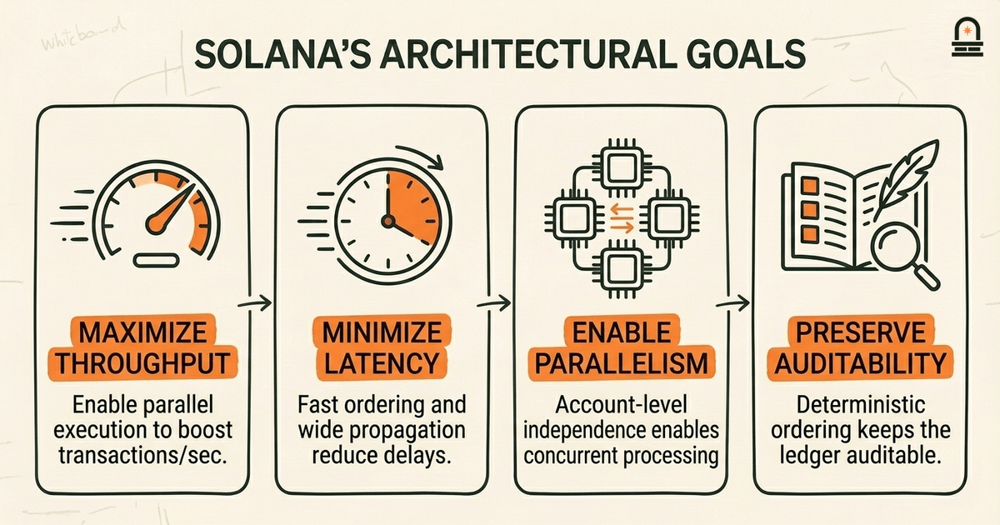
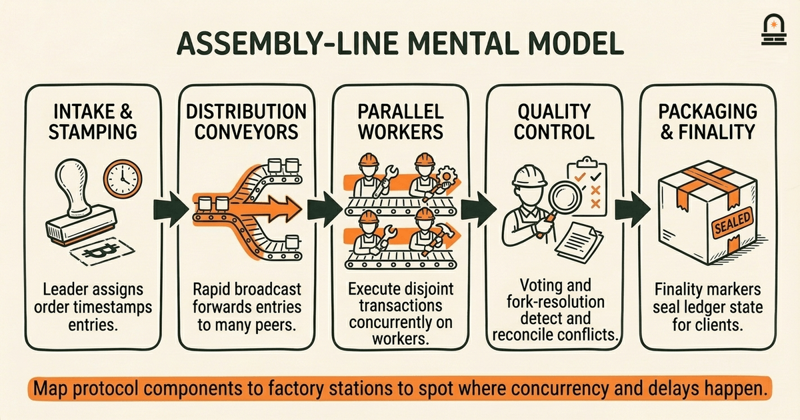
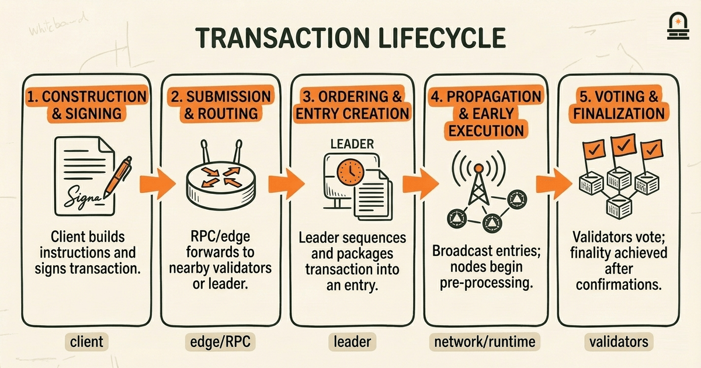

### Listen to the audio version

[Listen to this episode on Spotify](https://open.spotify.com/episode/5KJnuUexgENUIDkWsiojwS)

---

**Objective:** Describe the high-level structure and goals of Solana's architecture and identify its primary components.

**Why now:** Start with a system-level picture so learners can place later technical details into context.

**Concepts:** Solana architecture goals and design rationale; network topology and node roles; ledger structure and state organization; transaction lifecycle at a high level; interaction between components; design tradeoffs in architecture

**Read time:** 13 min

---

## Recap & Introduction

Solana's early-development tradeoffs prioritized throughput and low-latency confirmation, and you saw in the previous lesson how those strategic choices — for example prioritizing high transaction throughput over certain decentralization tradeoffs — shaped later network behavior. You should recall a concrete idea from that lesson: design tradeoffs manifest as engineering constraints that reappear when the network scales, such as how block ordering, validator incentives, and state sharding choices create recurring operational tensions.

We now move from those historical tradeoffs to a system-level map so you can place later runtime details into context. By assembling a high-level picture of Solana's architecture, you gain a mental scaffolding that makes later topics about validators, runtime components, and concurrency mechanisms easier to understand. Early in this lesson we introduce the architecture's primary goals and the major components that implement them: the ledger and its entry ordering, the network topology and node roles, the runtime that executes transactions in parallel, and the broad lifecycle a transaction follows from client to finalized state.

Start by treating the architecture as an engineered stack: goals and constraints at the top, mechanisms in the middle, and operational consequences at the bottom. You already know basic blockchain primitives and distributed-systems fundamentals; use that background to map familiar concepts (consensus, state machine replication, mempools) onto Solana's specific approaches. Throughout the lesson we distinguish general blockchain ideas from protocol-specific examples so you can reuse the mental models even if you later study a different chain.

---

## Learning Objectives

By the end of this lesson you will be able to:

- Describe the primary goals that motivated Solana's architecture and explain the rationale tying those goals to specific mechanisms.
- Identify and name the major components and node roles in the network topology and describe how they interact at a high level.
- Explain the ledger structure and state organization used to record entries and account state.
- Trace the high-level transaction lifecycle from client submission to finalization, noting where ordering, propagation, and execution occur.
- Recognize the main design tradeoffs inherent in the architecture and articulate practical implications for system behavior and development.

Each objective maps to a concrete concept you will practice recognizing in later lessons about runtime components and validator roles.

---

## Solana's Architectural Goals and Design Rationale

Solana's architecture is engineered around a compact set of goals: maximize transaction throughput, minimize end-to-end latency, enable parallel transaction execution where possible, and preserve a predictable, auditable ledger. These goals translate into specific architectural emphases: fast, deterministic ordering of entries; aggressive message propagation across peers; and a runtime model that attempts to execute disjoint transactions concurrently rather than serially. You should treat each goal as a constraint that steers choices elsewhere in the stack.

Mechanisms follow goals. For ordering and timestamping, the architecture introduces a time-derived ordering primitive to reduce the cost of consensus on the exact order of incoming messages. For propagation, the design favors wide, low-latency broadcast across a large peer set so nodes can see new entries quickly. For execution, the runtime expects account-level independence so that non-conflicting transactions can be executed in parallel, which increases throughput without requiring extreme single-threaded performance. When you see a mechanism such as aggressive pipelining or parallel execution, map it back to the goal it serves: either ordering, propagation, or execution efficiency.

Why this matters in practice: these architectural goals determine the tradeoffs you'll encounter when building or operating on the network. For example, maximizing throughput by enabling parallel execution reduces per-transaction latency under high load, but it places more burden on programs and clients to avoid unintended account conflicts. Similarly, fast ordering mechanisms can speed confirmations but make some forms of cross-shard or cross-zone atomicity harder to guarantee. When you design applications or reason about performance, ask which architectural goal a behavior supports and what it implicitly sacrifices.

Keep the distinction between general blockchain patterns and Solana-specific choices clear. Many chains balance throughput and decentralization, but protocol-specific mechanisms implement that balance differently: some use sharding, others lengthen block intervals, and Solana favors time-based ordering plus aggressive parallelism. Treat Solana's choices as an answer to the same question other chains faced; that framing helps you compare behaviors without conflating implementation details with generic concepts.

Operationally, these goals influence node roles and topology: the network expects leaders to produce ordered entries quickly, validators to execute aggressively and vote frequently, and RPC nodes to respond to client reads and writes with low-latency snapshots. You'll see those roles more closely in the next lesson, but for now remember the design chain: goals -> mechanisms -> operational consequences. That chain is the simplest way to predict how a new feature or load pattern will affect the system.

---

## Mental Model: The High-Performance Ledger as an Assembly Line

**The Mental Model:** Use an assembly-line metaphor to reason about Solana's architecture. Picture a factory floor where raw inputs (client-sent transactions) enter at one end and finished products (finalized ledger state) emerge at the other. The line has distinct stations: intake and stamping (ordering/timestamping), distribution conveyors (propagation), parallel workers (execution), quality control and joining (fork resolution and voting), and packaging (finality markers). Mapping the protocol into that metaphor helps you predict bottlenecks and where concurrency can safely happen.

Intake and stamping: imagine a rapid stamping machine that assigns an ordered serial number to each input. In Solana-specific terms, this role is served by a time-derived ordering mechanism that lets a leader produce ordered entries at high speed. The practical implication is that ordering is decoupled from heavy consensus work: the leader can sequence entries quickly, reducing wait times for the rest of the line. You should notice that stamping accuracy matters; if stamps diverge or leaders misbehave, downstream stations detect and respond via voting and fork-resolution mechanisms.

Distribution conveyors: once stamped, items are distributed across the factory via multiple conveyor belts. The network propagation layer plays the same role: it rapidly forwards entries to many peers so workers can start processing. The faster and wider the distribution, the more workers can begin parallel processing with consistent inputs, which reduces end-to-end latency. In practice, wide distribution increases network bandwidth demands and requires efficient packetization and relay to avoid becoming the new bottleneck.

Parallel workers: the assembly-line metaphor shines here because independent tasks can be processed simultaneously. In the protocol, worker stations correspond to parallel execution units that can process transactions touching disjoint sets of accounts. This is where program and account design matter: you increase throughput if you structure your transactions to avoid conflicting access to the same accounts. Treat concurrency as a cooperative property: throughput gains depend on both runtime capability and the workload's conflict profile.

Quality control and joining: items processed in parallel must be reconciled into a single coherent output. That reconciliation includes verifying results, handling dependencies, and resolving forks. In blockchain terms, validators validate execution results, exchange votes, and choose the canonical chain according to fork-choice rules. Packaging (finality markers) follows once consensus reaches sufficient confidence. If a factory line lacked an effective joining station, parallel work could produce inconsistent products — the same risk exists for parallel transaction execution without robust fork-choice and voting.

Use this mental model when you analyze performance or debug behavior: ask which station is saturated, whether items are being stamped in the correct order, whether conveyors (network links) drop or delay items, and whether workers are blocked by shared resources. The assembly-line view makes it easier to reason about where optimizations will pay off and where design tradeoffs surface, and it frames Solana-specific components as specialized stations in a familiar system.

| Assembly Stage | Functional Role | Solana-Specific Example |
| --- | --- | --- |
| Intake & Stamping | Assign ordered sequence/timestamps | Leader entry generation with PoH-style timestamps (protocol-specific) |
| Distribution Conveyors | Rapidly broadcast ordered items | Peer-to-peer propagation and packet relay |
| Parallel Workers | Execute independent tasks concurrently | Runtime parallel execution over disjoint accounts |
| Quality Control & Joining | Validate, vote, and resolve forks | Validator voting and fork-choice logic |
| Packaging | Mark finalized outputs | Finality markers and confirmed ledger state |

---

## Transaction Lifecycle: From Client to Finalized State

**Process Overview:** Trace a typical transaction at a systems level so you can see where ordering, propagation, execution, and finality occur. The lifecycle breaks into discrete stages: construction and signing, submission and routing, ordering and entry creation, propagation and early execution, voting and fork-choice, and finalization. For each stage, note whether the activity is client-side, network-level, or validator-runtime-level.

Construction and signing (client-side): you build a transaction that includes instructions, account references, and signatures. The signature proves authorization but does not, by itself, determine execution order. From a systems perspective, signing is a local gate: it ensures that only authorized changes propagate. Because this lesson is conceptual, we emphasize that signing proves intent while ordering establishes sequence.

Submission and routing (edge/RPC layer): once signed, you submit the transaction to an RPC endpoint or relay. In a high-throughput architecture, the routing layer accepts transactions and forwards them to a network node that will include them in an ordered stream. Where you submit matters: nodes with lower latency to the current leader or validator set can reduce the time before a transaction appears in the ordered log. In practice, clients often use nearby RPC endpoints to minimize submission latency.

Ordering and entry creation (leader/ordering role): an ordering node assigns the transaction a position in the ledger's sequence and packages it into an entry. In the assembly-line metaphor, this is the stamping station. The system may use time-based ordering or a leader-driven entry stream to reduce consensus overhead during initial sequencing. The ordered entry becomes the fundamental unit other nodes will process. Because ordering is authoritative, conflicting transactions that were submitted concurrently will be resolved by their assigned positions.

Propagation and early execution (network and runtime): ordered entries are propagated across the network so validators can fetch them and begin executing instructions. A high-throughput design encourages early execution: validators start work as soon as they receive entries, even before global finality. Parallel execution engines attempt to run non-conflicting transactions concurrently, improving throughput. The tradeoff is that early execution requires careful state management and mechanisms to detect and handle conflicts discovered later in the pipeline.

Voting and fork-choice (consensus layer): validators exchange votes on the ledger's progress and use a fork-choice rule to agree on the canonical chain. Votes help prune competing forks and provide the safety signal other nodes use to accept or reject branches. Voting cadence and responsiveness affect how quickly the network reaches a common view of history; faster voting reduces the window where conflicting branches coexist.

Finalization (application-visible stability): after sufficient voting weight and confirmation, transactions are considered finalized and incorporated into immutable state snapshots. Finality mechanisms vary across protocols; in Solana-specific terms, validators mark checkpoints and the ledger reflects a durable sequence. For applications, finalization is the point at which state can be treated as stable for business logic and off-chain coordination.

Why this workflow matters in practice: when you design clients or programs, the stage at which you expect confirmation determines how you handle retry logic, idempotency, and state observation. For example, if you assume finality immediately after submission, you may double-submit conflicting transactions; instead, design for the observed latency between submission and finalization and implement idempotency or conflict detection accordingly. Understanding the lifecycle also helps you pick the right integration points for monitoring, debugging, and performance tuning.

---

## Conclusion & Key Takeaways

Three practical principles should guide how you think about Solana's architecture. First, align mechanism to goal: every architectural choice you observed exists to serve a specific engineering objective such as low latency, high throughput, or parallel execution. When you encounter a protocol behavior, ask which goal it implements and what constraint it imposes elsewhere.

Second, treat ordering, propagation, and execution as separable stages. The architecture intentionally separates fast sequencing from heavy consensus and from execution. That separation is why the system can achieve high throughput, but it also creates points where transient inconsistencies and conflicts must be handled by voting and fork-choice rules. Keeping the stages distinct clarifies where to look when diagnosing performance or correctness issues.

Third, workload structure matters. Parallel execution delivers gains only when transactions touch disjoint state. For practical development, structure accounts and moves to reduce contention and make the runtime's parallelism effective. These principles prepare you to understand validator responsibilities and runtime internals in the next lesson: Core Runtime Components and Validator Roles, where we unpack the components you saw at a high level and examine how they implement the goals and stages covered here.

---

## Quick Recap

- Architecture is goal-driven: throughput, latency, parallelism, and auditable ordering guide design choices.
- Use the assembly-line mental model: ordering (stamping) → propagation (conveyors) → parallel execution (workers) → voting/joining → finalization (packaging).
- Transaction lifecycle stages to remember: construction & signing, submission & routing, ordering & entry creation, propagation & execution, voting & fork-choice, and finalization.
- Practical implication: design transactions and accounts to minimize conflicts so parallel execution delivers real throughput benefits.

---

## Next Steps

Proceed to the next lesson, "Core Runtime Components and Validator Roles," where we unpack the concrete components you met at a high level: the leader/slot role for ordering, validator execution responsibilities, and the runtime modules that enable parallel execution. Before you move on, review the transaction lifecycle and the assembly-line mapping so you can recognize each component's operational purpose when we inspect logs and configuration parameters in detail.

When you open the next lesson, be ready to map specific runtime names and processes to the stages in this lesson. That preparation will let you translate abstract concepts into practical actions when configuring nodes or designing programs that perform well under load.

---

## Glossary

### Proof of History (PoH)

A protocol-specific ordering aid that produces a verifiable sequence of timestamps or statements to reduce the cost of global ordering.

### Leader / Slot

A time-window and node role that is responsible for producing ordered ledger entries during its assigned interval.

### Account Model

The data layout where programs operate on explicit account slots; account access patterns determine execution dependencies and parallelism.

### Parallel Execution

A runtime optimization that executes transactions concurrently when their accessed accounts do not conflict, improving throughput.

### Entry

A compact ledger unit that carries ordered transactions and metadata used by validators to execute and validate state transitions.

### Fork-Choice

The rule or mechanism validators use to select a canonical chain when multiple competing branches exist.

### Finality

The point at which a transaction's effects are considered stable and safe to rely upon by applications and off-chain systems.

---

## References & Further Reading

- [Solana: A Protocol for a New Era of Blockchain Scalability (Whitepaper)](https://solana.com/solana-whitepaper.pdf) — *Solana Labs* (Protocol Design)
- [Solana Architecture Overview](https://docs.anza.xyz/clusters) — *Solana Docs* (Architecture Overview)
- [The Solana Runtime on a Validator (technical notes)](https://docs.anza.xyz/validator/runtime) — *Agave / Anza Docs* (Runtime & Execution)
- [Design Patterns for High-Performance Block Propagation](https://medium.com/solana-labs) — *Solana Engineering Blog* (Networking & Propagation)
