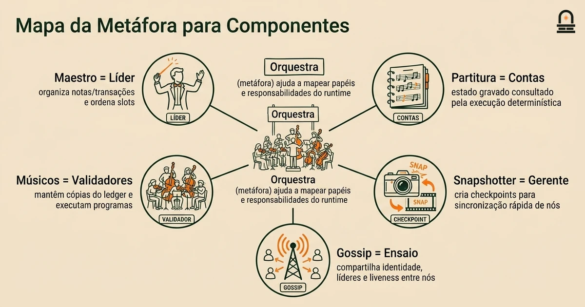
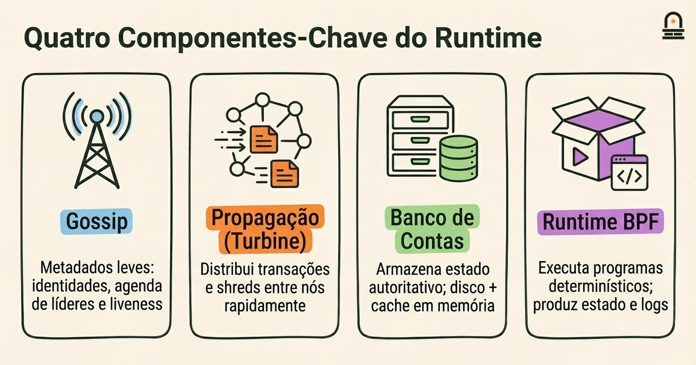
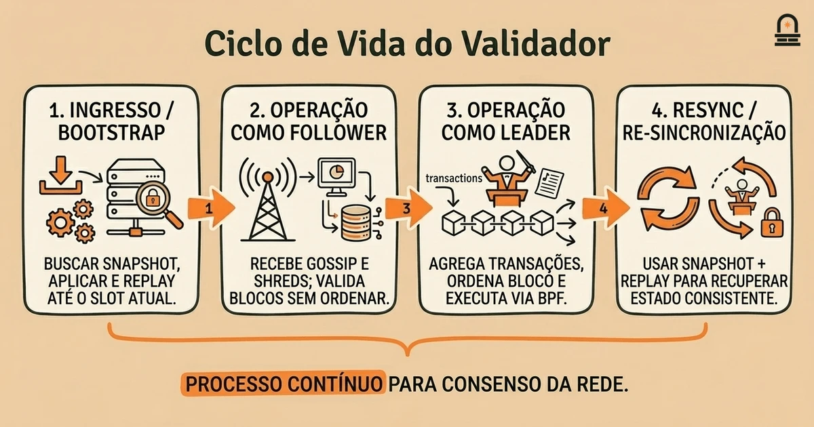

### Ouça também em áudio

[Ouvir este episódio no Spotify](https://open.spotify.com/episode/0kIUf56itD7pAdTytgta7U)

---

**Objetivo:** Explique as responsabilidades dos componentes centrais do runtime e como os validadores participam na arquitetura da rede.

**Por que agora:** Após a visão geral, os aprendizes precisam mapear as partes em alto nível para os componentes concretos do runtime.

**Conceitos:** responsabilidades dos componentes do runtime; deveres e ciclo de vida do validador; roteamento de mensagens entre nós; armazenamento de estado e snapshots; interfaces e limites dos componentes

**Tempo de leitura:** 30 min

---

## Recapitulação & Introdução

Os componentes centrais do runtime na Solana coordenam execução, roteamento de mensagens e gerenciamento de estado entre os nós validadores. Relembre da lição anterior que a Solana usa um livro-razão global único dividido em shreds, uma noção de agenda de líderes (leader schedule) e papéis distintos de nós, como líder, validador e nó RPC; esses conceitos permitem visualizar onde as responsabilidades do runtime devem residir. A estrutura do ledger e a organização do estado que você examinou antes são o substrato que os componentes do runtime leem e escrevem; mapear essas peças em alto nível para serviços concretos do runtime é o objetivo desta lição.

Avançamos para os componentes do runtime agora porque entender qual peça faz o quê torna a lição sobre fluxo de transações significativa: quando você depois rastrear uma transação pelo sistema, já saberá qual serviço valida assinaturas, qual componente ordena ou gossip mensagens, qual peça aplica instruções às contas e onde snapshots do estado são feitos. No segundo parágrafo introduzimos os conceitos-chave da lição: responsabilidades dos componentes do runtime, deveres e ciclo de vida do validador, roteamento de mensagens entre nós, armazenamento de estado e snapshots, e as interfaces e limites que mantêm os componentes compossíveis. Esses tópicos permitem anotar o diagrama de arquitetura da lição anterior com responsabilidades concretas e pontos de decisão.

Ao longo desta lição você mapeará atores nomeados do runtime (por exemplo, a thread de runtime que executa programas BPF, o banco de dados de contas, a camada de gossip e o snapshotter) para as responsabilidades que eles carregam. Também desempacotaremos o ciclo de vida do validador: como um validador participa como líder, como ele lida com trabalho de réplica recebido e quais responsabilidades operacionais mantêm a rede saudável. Esse mapeamento é prático: quando fizer anotações, você deverá ser capaz de apontar para um componente e explicar uma coisa concreta que ele deve fazer e um tipo de mensagem que ele consome ou emite.

## Objetivos de Aprendizagem

Ao final desta lição você será capaz de:

- Listar os principais componentes do runtime usados na Solana e descrever pelo menos uma responsabilidade específica de cada um, usando linguagem simples.
- Explicar os deveres centrais de um validador durante a operação normal, incluindo as transições de ciclo de vida entre os papéis de follower e leader.
- Descrever como as mensagens são roteadas entre nós (gossip, propagação de blocos, RPC) e onde ocorrem leituras e gravações de estado.
- Identificar onde snapshots de estado são criados, por que eles importam para o bootstrapping e como os limites dos componentes afetam a consistência dos snapshots.

Esses objetivos são concretos e testáveis: prepare notas anotadas que mapeiem componentes para responsabilidades e deveres do validador, e use essas notas como um checklist rápido quando seguir a próxima lição sobre fluxo de transações.

## Modelo Mental: Orquestra e Maestro

O Modelo Mental: Use a metáfora da orquestra e do maestro para pensar de forma concreta sobre o runtime. Imagine a rede como uma orquestra executando uma sinfonia onde a partitura é o livro-razão global e cada músico é um nó. Nesse modelo, um nó validador é um músico: ele mantém sua cópia da partitura (as contas e os dados do ledger), observa o maestro quando é convocado para liderar e toca sua parte quando recebe seus sinais. O líder é o maestro por um curto intervalo: ele ordena notas (transações) em uma performance (um bloco) e sinaliza o resto da orquestra para seguir a partitura. Os componentes do runtime são as seções da orquestra — cordas, sopros, percussão — cada uma responsável por uma família específica de tarefas como execução, armazenamento de estado ou roteamento de mensagens.

Traduza essa metáfora de volta para componentes concretos. O banco de dados de contas corresponde às pastas de partituras que você abre para encontrar quais notas tocar: ele armazena o estado autoritativo das contas para que os componentes de execução possam ler e escrever valores das contas. O runtime de execução BPF age como o músico interpretando as notas em som: dadas instruções e estado de contas, ele produz novo estado e logs. A camada de gossip é o canal de ensaio sem fio da orquestra, carregando sinais curtos e informações de membresia para que todo nó saiba quem está tocando e onde está o maestro. O snapshotter é o gerente de palco que fotografa periodicamente a montagem do palco para que um músico atrasado possa entrar e igualar a disposição dos demais sem reproduzir todo o ensaio desde o início.

Por que essa metáfora ajuda a raciocinar sobre limites e modos de falha: se um músico perder um sinal, a orquestra tolera temporariamente, mas deve re-sincronizar em um limite claro (um compasso ou movimento); de forma semelhante, a Solana constrói limites (snapshots, blocos verificados, rotação de líderes) que permitem que nós se ressincronizem sem replay completo. Quando o maestro falha no meio da apresentação, a partitura e os sinais de ensaio determinam com que rapidez um novo maestro é escolhido e quanto a orquestra precisa refazer. Na Solana, esses sinais de recuperação de falha são a agenda de líderes e os protocolos de propagação/gossip de blocos. O modelo da orquestra também destaca a diferença entre interpretação determinística e coordenação: músicos interpretam determinísticamente a mesma partitura; validadores executam determinističamente as mesmas transações dado entradas equivalentes e snapshots de estado, o que é crítico porque a consistência de resultados entre nós é exigida para o consenso.

Use esse modelo mental enquanto você elabora notas anotadas: para cada componente pergunte, 'Isto é um guardião da partitura, um intérprete, um mensageiro ou um gerente de palco?' Essa classificação reduz rapidamente quais interfaces o componente precisa e quais modos de falha observar. Ao se preparar para rastrear uma transação na próxima lição, mantenha essa metáfora em mente: você verá o maestro ordenar, os músicos interpretarem, o mensageiro encaminhar e o gerente de palco criar snapshots do estado.

## Componentes Centrais do Runtime e Responsabilidades

Aqui enumeramos os principais componentes do runtime que você encontrará e o que cada um faz de forma concreta. Trate isto como um exercício de mapeamento: para cada componente, anote uma responsabilidade primária e um tipo de entrada ou saída que ele trata. Apresentamos uma tabela compacta e depois expandimos cada linha com implicações operacionais e interfaces.

| Componente | Responsabilidade Primária | Entradas / Saídas Chave |
| --- | --- | --- |
| Gossip (membros do cluster) | Compartilhar identidades de nós, atualizações da agenda de líderes e metadados pequenos | Entradas: mensagens de pares; Saídas: listas de validadores, informações de contato |
| Propagação de Transações (camada tipo Turbine) | Distribuir de forma eficiente transações e shreds de blocos entre os nós | Entradas: transações, shreds; Saídas: shreds/pacotes reenviados |
| Banco de Dados de Contas | Armazenar e servir estado de contas (armazenamento em disco + cache em memória) | Entradas: gravações vindas da execução; Saídas: leituras para execução |
| Runtime de Execução BPF | Executar instruções de programas contra o estado das contas de forma determinística | Entradas: transações + dados de contas; Saídas: mudanças de estado, logs |
| Snapshotter / Armazenamento de Snapshots | Criar checkpoints consistentes do estado para bootstrapping rápido | Entradas: estado serializado; Saídas: artefatos de snapshot |
| Agendador de Líder / Tower (pistas de consenso) | Coordenar janelas de eleição de líder e gerenciar bloqueios de votos | Entradas: progresso do ledger; Saídas: atribuições de líderes, votos |
| RPC e Indexação | Atender consultas, agregar logs e expor APIs operacionais | Entradas: consultas de clientes; Saídas: dados de conta, status de transações |

Agora, expandindo: a camada de gossip deve permanecer leve e oportuna; ela não transporta blocos completos, mas transmite membresia e liveness para que outros componentes possam conectar-se. Sua interface é de mensagens pequenas com informações de contato e TTLs de metadados. A propagação de transações se apoia nisso, usando um padrão de broadcast otimizado para largura de banda e latência: recebe transações do RPC ou clientes locais e fragmenta/encaminha para o cluster de modo a minimizar transmissões redundantes preservando a probabilidade de entrega.

O banco de dados de contas combina um ledger on-disk de shreds e uma estrutura em memória otimizada para buscas de contas. Sua interface primária é ler e aplicar: threads de execução pedem fatias de contas e devolvem diffs a serem gravados. A consistência de snapshots importa aqui: os snapshots devem capturar o banco de dados em um ponto onde o modelo de execução concorde que todas as transações precedentes foram aplicadas. Por isso os snapshotters coordenam com o pipeline de commit de blocos para evitar capturar estado parcial.

O runtime de execução BPF é determinístico e sandboxed. Suas entradas são as instruções de uma transação e os dados de contas que a transação toca; suas saídas são diffs de contas escritos e logs de programas. Falhas de execução (por exemplo, falta de compute) são tratadas na fronteira do runtime e propagadas como resultados de transação. A divisão de responsabilidade entre execução e banco de dados de contas é explícita: a execução calcula o novo estado; o banco de dados de contas persiste e serve esse estado.

Por que isto importa na prática: conhecer esses limites ajuda a prever onde surgem gargalos de desempenho e onde instrumentar ao depurar. Por exemplo, gravações lentas em disco no banco de dados de contas aparecem como comprometimento atrasado; chatter excessivo no gossip aumenta CPU e pressão de rede sem melhorar a finalização. Ao mapear cada componente nas suas notas, também anote seu recurso dominante: CPU, memória, disco ou rede. Esse mapeamento será diretamente útil em operações, ajuste de performance e para entender por que validadores se comportam de forma diferente sob carga.

## Fluxo de Trabalho: Ciclo de Vida do Validador, Roteamento de Mensagens e Snapshots de Estado

Visão do Processo: Percorra o ciclo de vida típico do validador e os fluxos de mensagens que conectam os componentes. Apresente o ciclo de vida em fases: join/bootstrap, operação como follower, operação como leader e resync/bootstrapping. Para cada fase descrevemos as mensagens trocadas, quais componentes estão ativos e quais transições de estado ocorrem.

Join / Bootstrap: quando você inicia um nó validador, o snapshotter e o banco de dados de contas são centrais. O nó primeiro tenta localizar um snapshot recente entre pares ou no storage de objetos. Se um snapshot estiver disponível, o snapshotter o aplica ao banco de dados de contas local para evitar reproduzir todo o ledger. Mensagens-chave aqui são anúncios de snapshot (via metadados de gossip ou endpoints RPC) e buscas direcionadas de objetos. Após o snapshot ser aplicado, o nó reproduz shreds e entradas do ledger após o ponto do snapshot para alcançar o slot atual. Em suas notas, marque que o banco de dados de contas transita de vazio para snapshot-aplicado para replay-atualizado.

Operação como Follower: como follower você recebe continuamente atualizações de gossip e shreds de transações. A camada de propagação tipo turbine e os receptores de shred escrevem os shreds recebidos em disco; o RPC ou clientes pagantes de taxa submetem transações que o nó pode encaminhar. O componente de votação do consenso (Tower) observa o ledger e envia votos quando condições são atendidas. As mensagens-chave são transações encaminhadas (para o líder), shreds de blocos e gossip sobre identidade do líder. Durante a operação como follower, o nó valida blocos recebidos e verifica que a execução local bate com os resultados esperados, mas não se torna a autoridade de ordenação.

Operação como Leader: quando a agenda de líderes atribui o nó para liderar um slot, o nó muda para modo de ordenação. O líder reúne transações de clientes locais ou do pool de transações, as organiza em um bloco, executa programas via runtime BPF e produz um bloco expresso como shreds. Esses shreds são propagados eficientemente para os pares através da camada de propagação. O líder também assina e broadcasta quaisquer votos ou metadados específicos de líder exigidos pelo Tower. Nessa fase o nó deve coordenar threads de execução, gravações no banco de dados de contas e a propagação de saída; falhas ou lentidões em qualquer um desses componentes reduzem diretamente a vazão de blocos. Observe em suas notas quais componentes são síncronos (execução então escrita) e quais são assíncronos (propagação para pares).

Resync / Recuperação de Falha: se o nó detectar que está desatualizado ou perdeu muitos slots, ele usará snapshots ou solicitará entradas de ledger faltantes a pares. O snapshotter desempenha papel central: um snapshot validado permite que o nó pule replay pesado. O roteamento de mensagens aqui inclui fetches RPC direcionados e descoberta de pares via gossip para encontrar as melhores fontes de snapshot. Suas notas devem incluir os gatilhos para resync (por exemplo, limiares de lacuna no ledger) e os mecanismos usados (fetch de snapshot vs. replay completo).

Padrões de roteamento de mensagens resumidos: gossip carrega metadados pequenos e autoritativos e listas de pares; camadas de propagação transportam payloads de alto volume (transações e shreds) usando distribuição em fanout ou baseada em árvore; RPC atende consultas sob demanda e transferências direcionadas, especialmente para artefatos grandes como snapshots. Cada padrão tem trade-offs: gossip é baixa latência mas limitado em payload, propagação é eficiente em escala mas mais complexa, e RPC é confiável para transferências grandes ou direcionadas mas aumenta a carga no nó que atende.

Por que essa visão de workflow importa: quando você depois rastrear uma única transação pelo sistema, você se referirá a essas fases para decidir onde procurar atrasos ou discrepâncias. Anote suas notas com as interações esperadas dos componentes por fase e com mensagens de exemplo (por exemplo, 'cliente -> RPC -> pool do líder -> execução -> gravação no accounts DB -> propagação de shreds'). Essa sequência é o esqueleto que você vai embelezar nos diagramas de fluxo de transação da próxima lição.

## Conclusão & Principais Lições

Lembre-se de três princípios que resumem como os componentes do runtime e os validadores se encaixam. Primeiro, separação clara de responsabilidades: componentes têm responsabilidades bem definidas — gossip para membresia, propagação para distribuição de payloads, accounts DB para persistência de estado, runtime BPF para execução determinística e snapshotter para bootstrapping. Essa separação importa porque torna o comportamento previsível e os domínios de falha compreensíveis.

Segundo, as fases do ciclo de vida do validador determinam quais componentes estão ativos e quais interfaces são críticas em cada momento. Como follower, seu nó enfatiza validação, gossip e ingestão de propagação. Como leader, enfatiza ordenação, execução e propagação de saída. Entender essas responsabilidades por fase permite diagnosticar performance e corretude ao estreitar o conjunto de componentes a inspecionar.

Terceiro, limites de snapshot e interfaces de componentes são as alavancas práticas para ressincronização e escalabilidade. Snapshots reduzem o custo de replay, e interfaces claras entre execução e armazenamento garantem resultados determinísticos entre nós. Ao preparar suas notas anotadas, capture para cada componente: uma responsabilidade, uma entrada primária, uma saída primária e a restrição de recurso dominante (CPU, memória, disco ou rede). Esses quatro campos dão um modelo operacional compacto que será útil diretamente na próxima lição, quando você rastrear o processamento de transações de ponta a ponta.

## Recapitulação Rápida

- Mapeie: gossip = membresia, propagação = distribuição de payloads, accounts DB = armazenamento de estado, runtime BPF = execução determinística, snapshotter = bootstrapping rápido.
- Fases do validador: join/bootstrap → follower → leader → resync; cada fase enfatiza componentes diferentes.
- Padrões de roteamento de mensagens: gossip para metadados, propagação para payloads de alto volume, RPC para fetches direcionados.

## Próximos Passos

Prepare notas anotadas breves mapeando cada componente do runtime para uma responsabilidade e um par entrada/saída; essas notas são seu artefato para esta lição. Quando estiver pronto, avance para a próxima lição: "Fluxo de Transações e Modelo de Processamento." Lá você aplicará esses mapeamentos de componentes para traçar uma transação desde a submissão do cliente até a ordenação, execução, commitment e finalidade.

Como um exercício rápido antes de continuar, escolha um componente das suas notas e responda: qual recurso (CPU, memória, disco, rede) você instrumentaria primeiro se esse componente ficasse lento sob carga? Mantenha essa resposta à mão para os exemplos de depuração da próxima lição.

---

## Glossário

### Gossip

Um protocolo leve de membresia e liveness que troca pequenos metadados e informações de contato entre nós para permitir descoberta de pares e awareness do líder.

### Banco de Dados de Contas

O armazenamento em disco e em memória que guarda o estado das contas; serve leituras para execução e persiste gravações produzidas pelo runtime de execução.

### Runtime de Execução BPF

Um interpretador sandboxed que executa determinísticamente programas on-chain (bytecode BPF) contra os dados de contas fornecidos, produzindo diffs de estado e logs.

### Snapshot

Uma captura serializada do estado em um ponto no tempo usada para bootstrapping ou ressincronização de um nó sem reproduzir todo o ledger.

### Camada de Propagação

O subsistema de rede responsável pela distribuição em alta taxa de transações e shreds de blocos entre nós usando encaminhamento eficiente em largura de banda.

### Líder

Um validador temporariamente designado para ordenar transações e produzir um bloco para um slot; ele monta, executa e broadcasta shreds para os pares.

### Tower (Componente de Consenso)

Um componente que gerencia o comportamento de votação e lockouts para ajudar validadores a alcançarem consenso sobre o progresso do ledger e os slots de líderes.

---

## Referências & Leitura Complementar

- [Arquitetura do Validador Agave](https://docs.anza.xyz/architecture) — *Agave / Anza Docs* (Arquitetura Central)
- [Operando um Validador](https://docs.anza.xyz/operations) — *Documentação Solana* (Validadores e Operações)
- [Programas e o Runtime BPF](https://solana.com/docs/core/programs) — *Documentação Solana* (Runtime e Execução)
- [Blockstore: Armazenamento do Ledger](https://docs.anza.xyz/validator/blockstore) — *Agave / Anza Docs* (Estado e Armazenamento)
