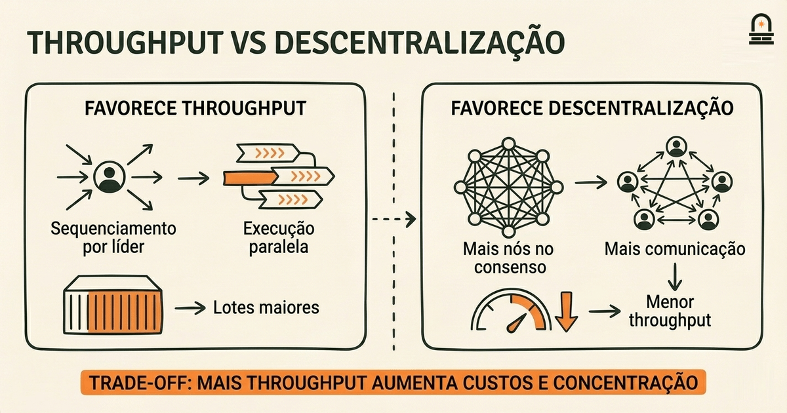
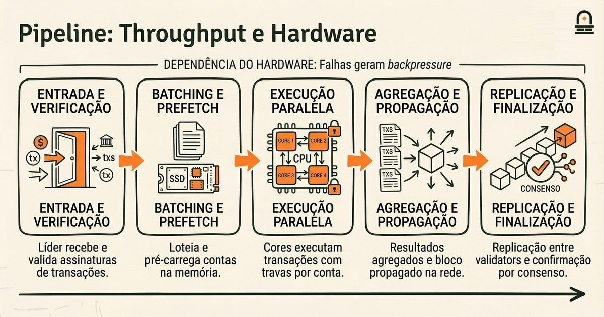
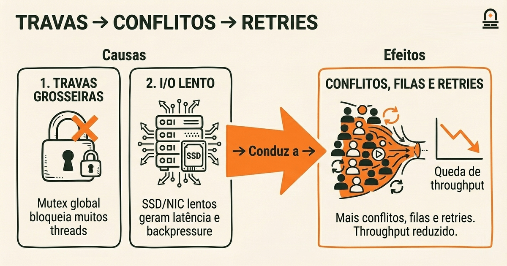

### Ouça também em áudio

[Ouvir este episódio no Spotify](https://open.spotify.com/episode/0zp2l9cgNYleTUQuAvr4c7)

---

**Objetivo:** Analisar os principais trade-offs arquiteturais e reconhecer as escolhas de design distintas que moldam a operação da Solana.

**Por que agora:** Após a análise de componentes e de fluxos, os aprendizes podem avaliar os trade-offs e como eles afetam o comportamento do sistema.

**Conceitos:** trade-offs entre escalabilidade e descentralização; considerações de projeto sobre throughput e latência; implicações da coordenação hardware e software; modos de falha e resiliência em nível de sistema; considerações operacionais e de manutenção

**Tempo de leitura:** 30 min

---

## Recapitulação & Introdução

O pipeline de transações da Solana depende de uma sequência específica de ordenação e validação: transações recebidas têm suas assinaturas verificadas, são empurradas para a fila do líder, passam por estágios de prefetch e travamento de contas, e então são executadas com detecção de conflitos antes da finalização. Você deve recordar como a ordenação e o tratamento de conflitos definem quais transações podem ser paralelizadas e quais precisam ser serializadas; essa interação concreta entre ordenação e travamento em nível de conta é central para como a Solana alcança alto throughput.

Agora avançamos da mecânica do fluxo de transações para os trade-offs arquiteturais que tornam essa mecânica possível. Você conectará os detalhes concretos que lembra — validação de assinaturas, o papel do líder, o grafo de conflitos e a finalização — às decisões de design mais amplas que trocam descentralização por desempenho, que trocam programabilidade generalizada por velocidade de execução determinística e que vinculam o comportamento do software a expectativas específicas de hardware.

Ao fim desta lição, você terá uma forma estruturada de nomear três trade-offs principais que a Solana aceita, explicar como throughput e latência são balanceados em relação à descentralização e rastrear como a coordenação entre hardware e software afeta tanto a operação normal quanto os modos de falha. Estes são os tópicos que cobriremos a seguir: trade-offs entre escalabilidade e descentralização, considerações de projeto sobre throughput e latência, implicações da coordenação hardware–software e considerações operacionais e de falhas em nível de sistema. Cada tópico ligará comportamentos concretos de processamento a consequências arquiteturais para que você possa sintetizar notas prontas para o próximo módulo sobre consenso e segurança.

## Objetivos de Aprendizagem

Você será capaz de articular claramente o trade-off entre escalabilidade e descentralização e descrever duas maneiras concretas pelas quais esse trade-off aparece no runtime da Solana. Você explicará como a Solana prioriza throughput e baixa latência, e identificará os mecanismos que impulsionam essa priorização (por exemplo, pipeline agressivo e coordenação inter-nós minimizada). Você mapeará as suposições de hardware — como desempenho de CPU, rede e SSD — para otimizações de software específicas e explicará como essas suposições afetam manutenção operacional e requisitos de validator. Finalmente, você produzirá uma síntese curta (notas) que liste três trade-offs arquiteturais e enquadre pelo menos duas perguntas em aberto sobre segurança ou consenso para levar adiante no próximo módulo.

## Escalabilidade vs Descentralização: Trade-offs Concretos

Em nível concreto, o trade-off entre escalabilidade e descentralização pergunta: quais restrições são afrouxadas para aumentar o número de transações por segundo, e quais restrições são endurecidas como consequência? No design da Solana, ganhos de throughput vêm de reduzir a sobrecarga de coordenação entre validators e transferir responsabilidade para um sequenciamento conduzido pelo líder, execução paralela agressiva e processamento determinístico de transações. Essas escolhas reduzem a necessidade de sincronização frequente entre nós, permitindo taxas de bloco mais altas e tamanhos de lote maiores, mas também elevam o patamar de hardware necessário para validators e podem concentrar alguma confiança no líder e em validators que atendem requisitos de alto desempenho.

O mecanismo importa. Quando você prioriza throughput, aceita que muitos validators precisem rodar hardware similar de alto desempenho e que algumas tarefas sejam temporariamente centralizadas (por exemplo, o papel de sequenciamento do líder). Quando você prioriza descentralização, aceita um throughput sustentável menor porque mais nós participam das decisões de consenso e mais metadados precisam ser trocados para manter o estado consistente. Esse trade-off aparece em três áreas concretas: a rotação de líderes e seu impacto em ataques de ordenação, a dependência do runtime em premissas de execução paralela e a necessidade de redes de baixa latência e alta velocidade entre validators.

A tabela abaixo resume como uma escolha por favorecer throughput se manifesta nas dimensões de design e o que isso implica para descentralização e custo operacional.

| Escolha de Design | Como melhora o throughput | Implicação para Descentralização e Operação |
| --- | --- | --- |
| Sequenciamento rápido conduzido pelo líder | Reduz coordenação entre nós; possibilita lotes maiores | Exige confiança na disponibilidade do líder; líderes rápidos precisam de hardware robusto |
| Execução paralela de transações (estilo Sealevel) | Executa transações independentes concorrentemente em múltiplos núcleos | Requer detecção de conflitos determinística; aumenta a complexidade do runtime |
| Assumir redes e armazenamento de alto desempenho | Mensagens de consenso com baixa latência; IO rápido de ledger | Aumenta o patamar de hardware dos validators; limita participantes por custo |

Você deve ser capaz de nomear cada linha e explicar como o mecanismo (o que) leva tanto a benefícios de desempenho (como) quanto à descentralização restringida (por que isso importa). Na prática, esses trade-offs explicam por que uma rede que alcança milhares de transações por segundo também pode ter requisitos de validator concentrados e por que operadores frequentemente medem tanto TPS quanto participação acessível de validators ao avaliar descentralização.



## Throughput, Latência e Coordenação Hardware–Software (Workflow)

Visão Geral do Processo: Você deve enxergar o comportamento de alto throughput da Solana como um fluxo de trabalho coordenado que liga escolhas de ordenação no software às capacidades do hardware. Comece pelo líder: o líder recebe transações e realiza batching e pré-processamento. Esses lotes são encaminhados para o runtime onde contas são prefetchadas para a memória, travas de leitura/escrita são aplicadas na granularidade de conta, e a execução paralela prossegue sob escalonamento determinístico. Após a execução, os resultados são coletados, assinaturas são agregadas e o bloco é propagado. Cada estágio desse pipeline é ajustado para reduzir latência e maximizar a utilização de núcleos de CPU, largura de banda de rede e throughput de NVMe.

Por que isso importa na prática: se qualquer suposição de hardware enfraquece — throughput de SSD mais lento, maior latência da NIC, redução no número de núcleos — o pipeline desenvolve backpressure. Backpressure causa filas maiores no líder, latências de cauda mais longas para algumas transações e potencialmente mais operações abortadas ou reexecutadas devido a contenção de travas de conta. Você reconhecerá esse comportamento ao monitorar: picos de latência de cauda frequentemente correlacionam com saturação de IO ou jitter de rede em vez de exaustão pura de CPU. Essa observação é prática e acionável quando você planeja ou avalia capacidade de validator e resposta a incidentes.

Aqui está o fluxo de trabalho de alto nível que você deve ser capaz de rastrear e explicar ao raciocinar sobre incidentes de desempenho:

1. Entrada de transações e verificação de assinaturas no líder.
2. Batching, prefetch do estado das contas e travamento em nível de conta.
3. Execução paralela entre núcleos com detecção de conflitos e retries quando necessário.
4. Colação de resultados, construção do bloco e propagação para validators.
5. Replicação e finalização via passos de consenso.

Cada estágio depende das suposições de hardware e software anteriores. Por exemplo, o estágio de prefetch assume leituras aleatórias rápidas de armazenamento local; se as leituras forem lentas, núcleos paralelos ficam ociosos ou executam menos trabalho, reduzindo o throughput efetivo. Da mesma forma, jitter de rede aumenta a latência efetiva de propagação e reduz a capacidade do líder de manter um sequenciamento rápido. Essas dependências criam alavancas operacionais: você pode melhorar throughput reduzindo IO por transação (otimizando o layout de dados), aumentando concorrência com particionamento cuidadoso de contas, ou reduzindo latência de cauda priorizando hardware de rede com baixo jitter. Ao escrever suas notas de síntese, mapeie cada estágio do fluxo de trabalho para um potencial gargalo e para uma mitigação operacional. Esse mapeamento ajuda você a traduzir trade-offs em nível de arquitetura em passos acionáveis de monitoramento e manutenção.



## Análise de Código: Execução Paralela Simplificada e Tratamento de Conflitos (Rust-like)

O código abaixo é um pequeno esboço simplificado do tipo Rust que modela execução paralela através de um pool de threads de trabalho. Foca no travamento em nível de conta e em como conflitos causam retries. Você usará esse trecho para raciocinar concretamente por que escalonamento determinístico, travas finas e acesso rápido à memória importam para o throughput.

```rust
// Pseudo-código simplificado para execução paralela de transações
use std::sync::{Arc, Mutex};
use std::thread;

struct Account { id: u64, balance: u64 }
struct Transaction { reads: Vec<u64>, writes: Vec<u64> }

fn execute_transactions_parallel(mut txs: Vec<Transaction>, accounts: Arc<Mutex<Vec<Account>>>) {
 let pool: Vec<_> = (0..4).map(|_| {
 let accs = Arc::clone(&accounts);
 thread::spawn(move || {
 loop {
 let tx_opt = {
 // Pop deve ser sincronizado; isto é simplificado e intencionalmente grosseiro
 let mut t = txs.pop();
 t
 };
 if tx_opt.is_none() { break; }
 let tx = tx_opt.unwrap();
 // Adquirir travas para contas envolvidas (simplificado)
 let mut a = accs.lock().unwrap();
 // realizar leituras e escritas diretamente
 for r in &tx.reads { let _ = a.iter().find(|x| x.id == *r); }
 for w in &tx.writes { if let Some(ae) = a.iter_mut().find(|x| x.id == *w) { ae.balance += 1; } }
 // a liberação da trava ocorre automaticamente ao final do escopo
 }
 })
 }).collect();

 for t in pool { let _ = t.join(); }
}
```
Explicação linha a linha e por blocos:

- Import e tipos: o trecho usa primitivos de sincronização de memória compartilhada. No runtime real, as travas são mais finas e evitam um único `Mutex` global; este exemplo mostra intencionalmente o custo quando as travas são grosseiras.
- Structs `Account` e `Transaction`: cada transação lista os IDs de contas que lê e escreve. Em produção, o runtime da Solana computa conjuntos de leitura/escrita e agenda transações não conflitantes concorrentemente.
- `execute_transactions_parallel`: threads são geradas para processar transações em paralelo. O problema crítico neste pseudocódigo é o único `Arc<Mutex<Vec<Account>>>` que serializa o acesso. Você deve notar como esse gargalo elimina o paralelismo apesar de existirem múltiplas threads.
- Aquisição de travas e trabalho: adquirir uma trava global serializa toda execução de transações. Em uma implementação realista, você travaria apenas as contas relevantes (travas finas), ou estruturaria a execução para que operações somente-leitura prossigam sem travas exclusivas, ou usaria escalonamento determinístico para evitar deadlocks.
- Comportamento de conflito e retry: este esboço não inclui lógica de retry. No runtime da Solana, uma transação que conflita é ou ordenada para evitar o conflito ou abortada e reexecutada pelo cliente; retries aumentam a latência e reduzem o throughput efetivo.

Como usar este exemplo ao analisar trade-offs: imagine substituir o `Mutex` global por travas por conta e adicionar uma ordenação determinística onde transações adquirem travas pela ordem de ID da conta. Você raciocinará sobre como essa mudança aumenta o paralelismo, mas adiciona complexidade ao gerenciamento de travas e aumenta o bookkeeping por transação. Esse é o cerne do trade-off de coordenação hardware–software: você ganha throughput, mas somente se padrões de acesso à memória, escalonamento de threads e subsistemas de IO alinharem-se com as suposições do software.



## Conclusão & Principais Lições

Você deve agora entender três princípios concretos que resumem os trade-offs de design da Solana. Primeiro, priorizar throughput leva a sequenciamento conduzido pelo líder e mecanismos de execução paralela que reduzem coordenação entre nós, mas aumentam os requisitos de hardware dos validators e a complexidade operacional. Segundo, baixa latência e alto throughput são alcançados alinhando o comportamento do software com suposições de hardware: SSDs rápidos, links de rede de baixa latência e CPUs multicore não são opcionais — são entradas de design que moldam escolhas do runtime. Terceiro, travamento fino e execução determinística aumentam o paralelismo efetivo, mas exigem complexidade adicional na detecção de conflitos e no tratamento de retries, o que por sua vez afeta latência de cauda e comportamento em falhas.

Enquadre essas conclusões como modelos mentais acionáveis: (1) throughput-como-troca-de-recurso — você troca descentralização e acessibilidade de hardware por TPS mais alto; (2) acoplamento-do-pipeline — degradação de hardware por estágio cria artefatos mensuráveis de latência de cauda; (3) paradoxo-da-complexidade-de-travas — maior granularidade de concorrência reduz serialização, mas aumenta bookkeeping do runtime e potencial para tempestades de retries. Use esses modelos ao escrever suas notas de síntese e ao preparar perguntas sobre consenso e segurança no próximo módulo.

## Recapitulação Rápida

- **Trade-offs de throughput:** sequenciamento pelo líder e execução paralela aumentam TPS, mas restringem a diversidade de validators.
- **Alinhamento de hardware:** otimizações de software assumem redes e armazenamento rápidos; hardware desalinhado causa backpressure e latência de cauda.
- **Travas e conflitos:** travas finas permitem concorrência, mas exigem escalonamento determinístico e gestão de retries.
- **Tarefa de síntese:** produza notas breves listando três trade-offs e duas perguntas em aberto sobre segurança/consenso.

## Próximos Passos

Prepare uma síntese curta: liste três trade-offs arquiteturais que você consiga explicar em duas frases cada, e adicione duas perguntas sobre como esses trade-offs afetam consenso e segurança. Esse artefato servirá como seu indicador visual de domínio. Em seguida, prossiga para a próxima lição, **Rust Syntax and Basic Types**, onde introduzimos os blocos de construção do Rust que você precisará para ler o código do runtime e explorar implementações concretas dos mecanismos discutidos aqui.

---

## Glossário

### Vazão (throughput)

Número de transações processadas por unidade de tempo; orienta escolhas sobre batching, paralelismo e capacidade de rede.

### Latência

Tempo desde a submissão da transação até a confirmação; a latência de cauda é especialmente sensível a IO e jitter de rede.

### Sequenciamento pelo Líder (leader sequencing)

O papel de um nó líder em ordenar transações antes da execução; reduz a coordenação entre nós ao custo de centralizar a responsabilidade de ordenação.

### Travas Finas (fine-grained locking)

Estratégia de travamento que mira contas individuais ou pequenas unidades de estado para permitir execução concorrente de transações não conflitantes.

### Escalonamento Determinístico

Política do runtime que impõe uma ordem repetível de operações para evitar mudanças de estado não determinísticas entre validators.

### Backpressure

Quando um estágio do pipeline desacelera devido a limites de recursos, fazendo filas a montante crescerem e aumentando latência ou abortos.

### Latência de Cauda (tail latency)

A latência em percentis altos experimentada pelas transações mais lentas; frequentemente revela contenção de recursos ou incompatibilidades de hardware.

---

## Referências & Leitura Complementar

- [Solana: A New Architecture for a High Performance Blockchain (Whitepaper)](https://solana.com/solana-whitepaper.pdf) — *Solana Labs* (Arquitetura & Design)
- [O Runtime da Solana no Validador](https://docs.anza.xyz/validator/runtime) — *Agave / Anza Docs* (Runtime & Execução Paralela)
- [Validator Hardware & Performance Recommendations](https://docs.anza.xyz/operations/requirements) — *Solana Docs* (Orientação Operacional)
- [Consenso e Geração de Forks na Solana](https://docs.anza.xyz/consensus/fork-generation) — *Agave / Anza Docs* (Consenso e Finalização)
