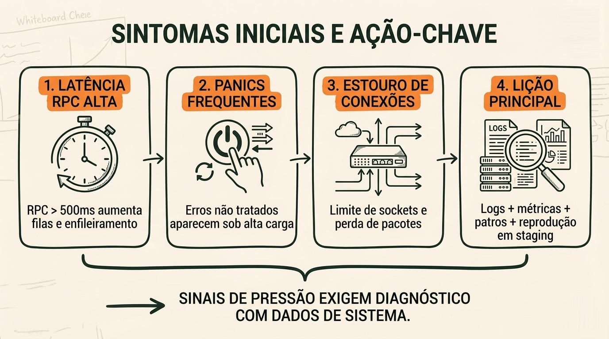
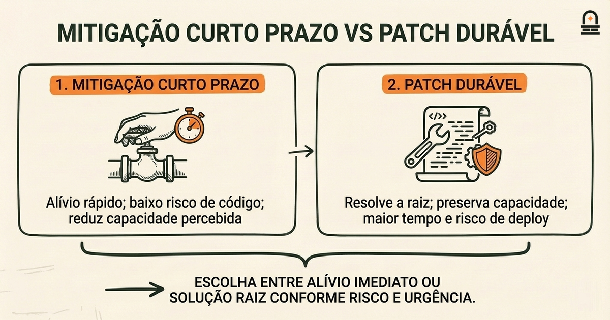
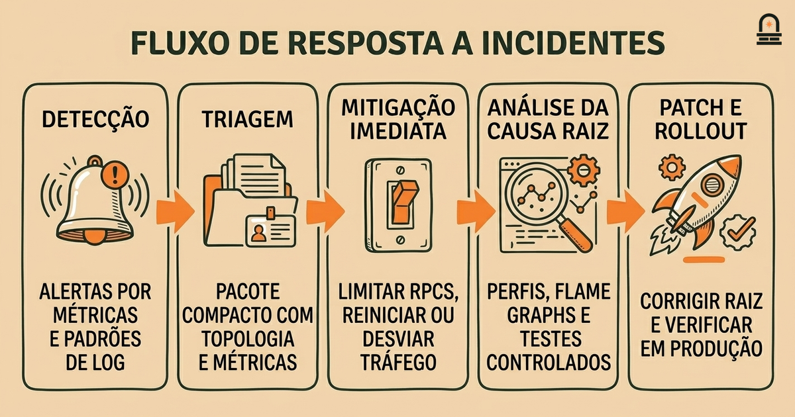

### Ouça também em áudio

[Ouvir este episódio no Spotify](https://open.spotify.com/episode/3pn4cMDQGqOZV9KCd44oDM)

---

**Objetivo:** Identificar os principais desafios que a Solana enfrentou durante o desenvolvimento inicial e como eles moldaram as prioridades.

**Por que agora:** Depois de aprender a história de origem, examine obstáculos concretos que redirecionaram o foco do desenvolvimento.

**Conceitos:** Estabilidade técnica e preocupações de confiabilidade; Crescimento da rede e restrições operacionais nos estágios iniciais; Incidentes de segurança e esforços de remediação iniciais; Compromissos entre financiamento e alocação de recursos; Canais de feedback da comunidade e respostas iniciais

**Tempo de leitura:** 30 min

---

## Recapitulação & Introdução

O whitepaper que você acabou de estudar enquadra a criptomoeda como um sistema de dinheiro eletrônico peer-to-peer que resolve o duplo gasto com marcação temporal e blocos encadeados. Você deve recordar a ideia específica de que ordenar transações de forma consistente (via timestamping e encadeamento) é o mecanismo que torna possível um livro razão canônico único apesar de participantes adversariais. Esse mecanismo concreto — ordenação + histórico acordado — é a âncora para entender por que uma blockchain deve priorizar tanto o progresso do consenso quanto a segurança.

Agora passamos do desenho conceitual do whitepaper para os obstáculos práticos que uma blockchain de alta vazão encontrou ao migrar do papel para a produção. A conexão é direta: o whitepaper assume um conjunto particular de trade-offs envolvendo latência, vazão e modelos de adversário, mas quando equipes tentaram implementar esses trade-offs em software real e em redes reais, realidades operacionais inesperadas surgiram. Nesta lição você vai identificar os principais desafios técnicos e organizacionais que a Solana enfrentou no início e verá como esses desafios deslocaram as prioridades de desenvolvimento de trade-offs puramente teóricos para trabalho pragmático de confiabilidade.

Comece esta lição esperando revisitar modos de falha e trade-offs familiares que você já deveria conhecer: partições de rede, exaustão de CPU e memória, pressuposições de tempo e os riscos de escolhas otimistas de desempenho. No segundo parágrafo apresentamos explicitamente os conceitos-chave da lição: preocupações de estabilidade técnica e confiabilidade, crescimento e restrições operacionais, incidentes de segurança e remediação, compromissos na alocação de recursos e como os canais de feedback da comunidade informaram respostas iniciais. Essas são as lentes que você usará para avaliar cada incidente histórico e suas consequências práticas.

---

## Objetivos de Aprendizagem

Ao final desta lição você será capaz de:

<ul class="lesson-objectives-checklist">
<li class="lesson-objective-item"><strong>Explicar</strong> os principais problemas de estabilidade técnica que surgiram quando a Solana passou de protótipo para rede ativa e por que esses problemas são importantes para o progresso do consenso.</li>
<li class="lesson-objective-item"><strong>Descrever</strong> pelo menos duas restrições operacionais concretas (limites de recursos, agendamento em tempo de execução) que influenciaram mudanças de design iniciais.</li>
<li class="lesson-objective-item"><strong>Traçar</strong> a sequência de um incidente inicial de segurança ou disponibilidade e resumir as etapas de remediação adotadas.</li>
<li class="lesson-objective-item"><strong>Articular</strong> como decisões de financiamento e alocação de recursos moldaram a priorização entre recursos de desempenho e engenharia de confiabilidade.</li>
<li class="lesson-objective-item"><strong>Avaliar</strong> o papel que os canais de feedback da comunidade desempenharam ao revelar problemas e orientar correções de curto prazo.</li>
</ul>

---

## Análise de Código: Analisador Simples de Logs para Eventos de Validador (Rust)

Quando problemas de estabilidade ocorrem em um validador em execução, engenheiros frequentemente começam extraindo eventos estruturados dos logs e buscando padrões como mensagens frequentes de "slot skipped", chamadas RPC falhas repetidas ou pausas de GC. O código abaixo é um exemplo compacto em Rust que analisa um log simplificado de validador, conta tipos de evento e sinaliza ocorrências incomumente frequentes de "slot skipped". Este é um diagnóstico pequeno que você pode adaptar para qualquer runtime que emita eventos com timestamp.

```
use std::collections::HashMap;
use std::fs::File;
use std::io::{self, BufRead};

fn main() -> io::Result<()> {
    let file = File::open("validator.log")?;
    let reader = io::BufReader::new(file);
    let mut counts: HashMap<String, usize> = HashMap::new();

    for line in reader.lines() {
        let line = line?;
        if let Some(event) = parse_event(&line) {
            *counts.entry(event).or_insert(0) += 1;
        }
    }

    for (event, count) in counts.iter() {
        println!("{}: {}", event, count);
    }
    Ok(())
}

fn parse_event(line: &str) -> Option<String> {
    if line.contains("slot skipped") {
        return Some("slot_skipped".to_string());
    }
    if line.contains("rpc error") {
        return Some("rpc_error".to_string());
    }
    if line.contains("panic") {
        return Some("panic".to_string());
    }
    None
}
```

Explicação linha a linha:

1. 
`use std::collections::HashMap;` e as linhas `use` subsequentes importam utilitários básicos de I/O e coleções. Você precisará deles para contar ocorrências e ler arquivos.

2. 
A função `main` abre um arquivo chamado `validator.log` e o envolve em um leitor com buffer para iterar as linhas de forma eficiente. Se o arquivo estiver ausente, o programa retorna um erro — na prática você pode ligar isso a uma fonte de streaming em vez de um arquivo.

3. 
`let mut counts: HashMap<String, usize> = HashMap::new();` cria um mapa onde as chaves são identificadores de evento e os valores são contagens. Os identificadores de evento são strings normalizadas como `slot_skipped`.

Dentro do loop, o programa chama `parse_event` para cada linha. Se o parsing retornar um evento, ele incrementa o contador correspondente. Esse padrão é robusto: separa a lógica de parsing da lógica de agregação para que você possa adicionar mais detectores sem mudar a estrutura de contagem.

4. 
A função `parse_event` demonstra uma abordagem mínima: checagens simples de substrings para marcadores conhecidos. Em produção, você substituiria isso por parsing estruturado (por exemplo, parsing JSON se os logs forem emitidos em JSON) e incluiria extração de timestamp para calcular taxas por minuto.

5. 
Após a agregação, o programa imprime cada evento e sua contagem. A partir dessas contagens você pode detectar rapidamente candidatos a anomalia, por exemplo se `slot_skipped` aparecer milhares de vezes em um segmento curto de log.

Por que isso importa: quando uma interrupção começa, saber quais tipos de eventos disparam ajuda a entender se você está olhando para quedas de rede, backpressure em RPC, panics do runtime ou pausas de garbage collection. Este código é intencionalmente pequeno: o primeiro passo prático em muitas respostas a incidentes é quantificar os sintomas antes de propor uma correção.

---

## Exemplo Concreto: Ciclo de Diagnóstico e Patch para um Interrupção por Esgotamento de Recursos

Examine um incidente representativo inicial: um período de alta vazão desencadeia esgotamento de recursos nos validadores, levando à perda de pacotes, consenso paralisado e, por fim, uma paralisação parcial da rede. Passamos por como os sintomas foram observados, como os engenheiros isolaram a causa e quais etapas de remediação seguiram. Este exemplo espelha padrões recorrentes em sistemas de produção e mostra como restrições técnicas moldam prioridades.

Primeiro, os engenheiros observaram três sintomas simultâneos: aumento da latência de RPC, panics de thread frequentes nos logs de runtime e um estouro no número de conexões reportado pelo monitoramento do sistema. Esses três sinais apontam para um problema de pressão de recursos em cascata em vez de um bug isolado: a latência de RPC sobe porque manipuladores de requisição enfileiram; manipuladores enfileirados consomem memória e threads, o que aumenta a troca de contexto e a contenção de CPU; panics aparecem quando o código encontra casos não tratados sob carga. O diagnóstico prático combinou agregação de logs, métricas e uma reprodução em pequena escala em um cluster de staging.

A linha do tempo de ações tipicamente seguiu este padrão: detecção de sintoma &rarr; triagem &rarr; mitigação de curto prazo &rarr; análise da causa raiz &rarr; patch direcionado &rarr; rollout e verificação. Mitigações de curto prazo podem envolver limitar temporariamente RPCs de entrada, reiniciar validadores sobrecarregados ou desviar tráfego. A fase de patch frequentemente envolvia corrigir vazamentos de memória específicos, adicionar backpressure nos handlers RPC ou ajustar pools de threads.

Para tornar os trade-offs visíveis, compare três escolhas de remediação que os engenheiros consideraram durante este incidente:

<table>
<thead>
<tr><th>Opção</th><th>O que muda</th><th>Prós</th><th>Contras</th></tr>
</thead>
<tbody>
<tr>
<td>Limitação rápida</td>
<td>Limitar a vazão de RPCs de entrada</td>
<td>Alívio imediato, baixo risco de código</td>
<td>Reduz capacidade e taxa de transferência percebida pelos usuários</td>
</tr>
<tr>
<td>Reiniciar validadores</td>
<td>Resetar memória/threads</td>
<td>Reinício rápido e efetivo do estado</td>
<td>Causa breves lacunas de disponibilidade e interrompe a rotação de líderes</td>
</tr>
<tr>
<td>Patch de código</td>
<td>Corrigir vazamento ou adicionar backpressure</td>
<td>Correção de longo prazo, preserva capacidade</td>
<td>Ciclo de desenvolvimento + revisão mais longo; risco de regressões</td>
</tr>
</tbody>
</table>

Engenheiros frequentemente combinam opções: aplicar uma limitação rápida para estabilizar a rede enquanto desenvolvem um patch de código para o vazamento subjacente. Um exemplo de remediação concreta da prática inicial da Solana foi adicionar limites no estilo token-bucket nos handlers RPC para que rajadas súbitas não esgotassem CPU e memória; essa alteração prioriza segurança sobre a vazão máxima até que um alocador ou correção de runtime mais refinada esteja pronta.

Por que este exemplo é útil pedagogicamente: conecta sintomas (o que você vê) a causas mecanicistas (o que está acontecendo em threads, memória e I/O) e a trade-offs de engenharia concretos (mitigação de curto prazo versus correções de longo prazo). Quando revisar o código ou o postmortem depois, pergunte: quais sinais foram mais informativos, quais controles temporários foram aceitáveis e como essa escolha reordenou prioridades de engenharia adiante?





---

## Fluxo de Trabalho: Da Detecção à Remediação Durável

**Visão Geral do Processo:** Transforme o diagnóstico prático em um fluxo de trabalho repetível que você pode seguir ou avaliar. Apresentamos um fluxo de resposta a incidentes em etapas adaptado para blockchains de alta vazão onde uptime, segurança do consenso e recuperação rápida são prioridades. Este fluxo condensa práticas que surgiram nas respostas iniciais da Solana e as generaliza para que você possa raciocinar sobre prioridades em vez de memorizar comandos.

Passo 1 — Detecção: mantenha tanto logs de alta cardinalidade quanto métricas leves. Use alertas para limites de métricas (por exemplo, latência RPC > 500ms, taxa de slot-skipped > 0.1% por minuto) e alertas baseados em padrões de log para mensagens de panic ou esgotamento de recursos. A detecção deve ser barulhenta por design: alarmar em tendências, não em cada blip transitório, mas fornecer contexto suficiente (mudanças de configuração recentes, agenda de líderes) para priorizar a triagem.

Passo 2 — Triagem: reúna um pacote compacto do incidente que inclua topologia recente, snapshot da agenda de líderes, métricas de CPU/memória/IO e trechos representativos de logs. Reproduza o problema em um testbed pequeno se possível. O objetivo é classificar rapidamente o incidente em categorias como rede, runtime, consenso ou subsistema RPC. Essa classificação orienta quem é responsável pela correção.

Passo 3 — Mitigação de curto prazo: escolha a ação menos invasiva que reduza o dano imediato. Opções são limitar novas conexões, aplicar circuit-breakers, desabilitar temporariamente subsistemas não essenciais ou reiniciar nós específicos. Documente a decisão de mitigação imediatamente para que a análise postmortem possa avaliar a adequação da reação.

Passo 4 — Análise da causa raiz: com o sistema estabilizado, execute experimentos controlados e testes instrumentados para reproduzir o modo de falha. Use flame graphs, perfis de heap e dumps de threads. Colete hipóteses e tente refutá-las. Esta etapa frequentemente revela interações surpreendentes entre subsistemas — por exemplo, latência do scheduler amplificando pausas de GC.

Passo 5 — Correção durável e rollout: desenhe uma correção que minimize regressões de comportamento. Para patches de alto risco prefira rollout gradual e feature gates. Crie critérios de aceitação tais como nenhum slot skipped por X horas sob carga Y, ou latência RPC abaixo do limite durante um teste de estresse de 24 horas. Use canários e aumente progressivamente o tráfego enquanto monitora.

Passo 6 — Comunicação e feedback da comunidade: publique um resumo conciso do incidente que declare fatos: o que aconteceu, mitigações imediatas, cronograma da correção e próximos passos. Convide casos de teste reproduzíveis de operadores da comunidade. A prática inicial da Solana mostrou que resumos transparentes de incidentes ajudaram operadores de validadores terceiros a coordenar upgrades e reduzir trabalho redundante de solução de problemas.

Passo 7 — Priorização e alocação de recursos: por fim, coloque o incidente no roadmap com prioridade clara. Decida se a correção é um hot patch, um projeto de engenharia que requer contratação, ou uma mudança de playbook operacional. Decisões de financiamento e equipe frequentemente seguem de quão frequentemente a classe de incidente reaparece e seu impacto sistêmico na segurança do consenso.

Este fluxo de trabalho enfatiza verificações mensuráveis em cada etapa: limites de alerta, completude do pacote de triagem, reprodução de teste e critérios de aceitação. Essas verificações convertem um incidente anedótico em itens de trabalho de engenharia, que por sua vez mudam prioridades de longo prazo de crescimento de recursos para resiliência da plataforma quando incidentes são frequentes ou severos.



---

## Conclusão & Principais Lições

Agora você deve entender três lições concretas sobre os desafios iniciais da Solana e como eles moldaram prioridades. Primeiro, escolhas de design para alta vazão revelaram modos de falha práticos — esgotamento de recursos, latência de agendamento e backpressure de I/O — que exigiram deslocar o foco da engenharia de desempenho bruto para comportamento robusto e previsível. Essa mudança não é uma crítica; é a progressão natural quando um sistema deixa condições de laboratório e encontra cargas de trabalho do mundo real variadas.

Segundo, a resposta a incidentes enfatizou detecção mensurável e mitigação em estágio. Limitações de curto prazo e reinícios são ferramentas valiosas para interromper falhas em cascata imediatas, mas confiabilidade durável exigiu patches direcionados, melhor instrumentação e mudanças de fluxo de trabalho. Esses esforços de remediação alteraram decisões de alocação de recursos: equipes frequentemente adiaram novas funcionalidades de desempenho para investir em observabilidade e programação defensiva.

Terceiro, canais da comunidade e comunicação transparente de incidentes foram alavancas operacionais cruciais. Publicar cronogramas, etapas de mitigação e orientações de upgrade acelerou respostas coordenadas de operadores e reduziu a carga operacional sobre a equipe central. O princípio prático a lembrar é este: quando existe uma rede ativa, coordenação social e triagem técnica clara são tão importantes quanto qualquer correção de código isolada.

---

## Recapitulação Rápida

<ul class="lesson-recap-takeaways">
<li>Problemas de estabilidade iniciais deslocaram prioridades de vazão máxima para comportamento previsível e observável.</li>
<li>O diagnóstico combina logs, métricas e pequenas reproduções; limitações de curto prazo estabilizam enquanto patches são desenvolvidos.</li>
<li>Fluxo de resposta a incidentes: detectar &rarr; triagem &rarr; mitigar &rarr; causa raiz &rarr; patch &rarr; comunicar.</li>
<li>Transparência com a comunidade ajudou a coordenar upgrades e reduzir esforço operacional duplicado.</li>
</ul>

---

## Próximos Passos

Prepare-se para ler a próxima lição, "Explicando os Mecanismos Centrais do Whitepaper", onde você examinará as peças técnicas que precisam ser implementadas de forma confiável para que uma blockchain funcione: consenso, mempool e ordenação de transações, e alinhamento de incentivos. Use o que aprendeu aqui para notar onde esses mecanismos introduzem restrições operacionais e onde escolhas de design trocam desempenho por segurança. Traga estas perguntas: qual mecanismo requer mais engenharia defensiva quando escalado e como as realidades operacionais alteram as prioridades do protocolo?

---

## Glossário

### Slot skipped

Um evento em que um líder ou validador agendado falha em produzir ou validar um bloco dentro da janela de tempo esperada, indicando problemas de liveness ou de agendamento.

### Backpressure

Um padrão defensivo que desacelera ou descarta requisições de entrada para prevenir esgotamento de recursos e preservar a estabilidade do sistema sob carga.

### Token-bucket throttling

Uma técnica de rate-limiting que permite rajadas até uma capacidade e reabastece a uma taxa constante, usada para suavizar picos de requisições.

### Canary rollout

Uma estratégia de implantação em estágios que expõe uma mudança a um pequeno subconjunto de nós ou usuários para detectar regressões antes do rollout completo.

### Triaging packet

Uma coleção compacta de artefatos de diagnóstico (logs, métricas, topologia) montada rapidamente para classificar um incidente e guiar os respondedores.

### Acceptance criteria

Condições concretas e testáveis que devem ser atendidas antes que uma correção seja considerada verificada e segura para implantar em toda a rede.

---

## Referências & Leitura Complementar

- [Operação e Manutenção de Validator](https://docs.solana.com/running-validator) — *Documentação Solana* (Documentação Oficial)
- [Solana Status - Histórico de Incidentes](https://status.solana.com/) — *Status da Solana* (Status e Incidentes)
- [Interrupção da Rede Solana: Discussão de Engenharia e Resposta (análise)](https://www.coindesk.com/markets/2021/09/15/solana-network-outage-explained/) — *CoinDesk* (Relatórios Postmortem)
- [GitHub - solana: PRs e issues de exemplo (arquivo pesquisável)](https://github.com/solana-labs/solana/issues) — *GitHub - solana-labs* (Código-Fonte e Correções)
