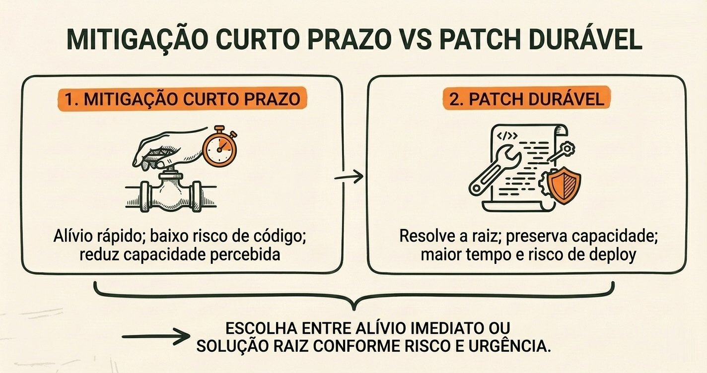
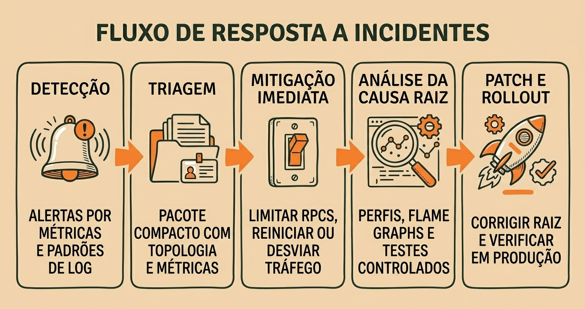

# Desafios e Obstáculos Iniciais

A transição de um protótipo arquitetural para uma rede descentralizada em produção inevitavelmente expõe restrições práticas de hardware, comunicação e escala.

Nesta lição, você examinará os principais problemas de **estabilidade técnica** enfrentados pela Solana em suas fases iniciais, a metodologia de **diagnóstico de logs e incidentes** e como essas lições redirecionaram o foco do desenvolvimento para **previsibilidade e observabilidade**.

---

## 1. Modos de Falha em Ambientes de Alta Vazão

Projetar uma rede para processar milhares de operações por segundo exige que cada componente do validador opere próximo aos limites de capacidade física da máquina. Quando as primeiras cargas intensas foram submetidas à rede, surgiram modos de falha característicos de sistemas de alto desempenho:

1. **Esgotamento de Recursos (*Resource Exhaustion*)**: Sob rajadas repentinas de tráfego, filas de processamento cresciam desordenadamente, consumindo toda a memória RAM disponível e gerando quedas de processos por falta de memória (*Out of Memory*).
2. **Pressão de E/S (*I/O Backpressure*)**: A velocidade de gravação no disco e de transmissão na placa de rede não acompanhava o fluxo de entrada, acumulando atrasos em cadeia nos módulos de validação.
3. **Latência de Agendamento e *Slot Skipping***: Validadores sobrecarregados demoravam para processar suas janelas de liderança ou enviar votos de consenso a tempo, resultando em blocos não produzidos (*slots* pulados) e desaceleração do consenso global.

---

## 2. Diagnóstico Operacional: Leitura de Logs de Validador

Quando um validador apresenta instabilidade, os engenheiros de operação começam analisando logs estruturados em busca de sinais de alerta:

- **Frequência de *Slot Skipped***: Indica que líderes não conseguiram produzir blocos ou que mensagens de consenso sofreram atraso excessivo.
- **Picos de Erros em Chamadas RPC**: Revelam que os nós de borda estão rejeitando conexões ou sofrendo com saturação de portas de rede.
- **Alertas de Uso Crítico de Memória**: Apontam para acúmulo excessivo em filas de mensagens antes da execução.

O diagnóstico eficaz depende de reproduzir o problema em ambientes de teste controlados com ferramentas de estresse, permitindo isolar se a lentidão decorre do consenso, do subsistema de rede ou do runtime de execução de programas.

---

## 3. Fluxo de Resposta a Incidentes: Da Detecção à Remediação Durável

Para lidar com paradas operacionais ou degradações de desempenho de forma metódica, a comunidade técnica adota um fluxo em etapas:

1. **Detectar**: Monitoramento em tempo real de telemetria (taxa de blocos por segundo, proporção de validadores votantes e latência de rede).
2. **Triar**: Classificar a gravidade da ocorrência (degradação pontual de nó versus risco iminente de paralisação do consenso da rede).
3. **Mitigar**: Aplicar configurações de contenção temporárias (como limites defensivos de conexão ou reinício coordenado de nós) para restabelecer o progresso do consenso.
4. **Isolar a Causa Raiz**: Analisar despejos de memória (*core dumps*), rastros de chamadas e logs para identificar a linha de código ou restrição de hardware responsável.
5. **Patch**: Desenvolver uma correção técnica no cliente validador acompanhada de testes de regressão que comprovem a resolução do defeito.
6. **Comunicar**: Publicar relatórios pós-incidente (*post-mortems*) detalhados para operadores de nós e usuários do ecossistema, reforçando a transparência.

---

## 4. A Mudança de Prioridades na Engenharia

Os desafios operacionais iniciais demonstraram que **vazão teórica isolada não garante a utilidade da rede**. A engenharia da Solana redirecionou seu foco para três pilares:

- **Comportamento Previsível**: Garantir que o validador mantenha desempenho estável mesmo quando submetido a volumes adversários de transações.
- **Defesas Contra Esgotamento**: Introdução de limites explícitos de filas, descarte antecipado de requisições inválidas e isolamento de recursos.
- **Observabilidade Completa**: Instrumentação rica em telemetria para que operadores consigam antecipar gargalos antes que afetem o consenso.

---

## 5. Principais Lições

1. **Sistemas rápidos falham de formas complexas**: Gargalos de memória, agendamento de threads e saturação de I/O são os verdadeiros desafios operacionais em blockchains de alto desempenho.
2. **Mitigação e causa raiz são etapas distintas**: Estabilizar a rede operacionalmente é a prioridade imediata; corrigir a causa raiz com patches testados é a exigência para a sustentabilidade de longo prazo.
3. **Transparência técnica gera maturidade**: Relatórios pós-incidente abertos e métricas claras constroem a confiança necessária para integradores e desenvolvedores.
