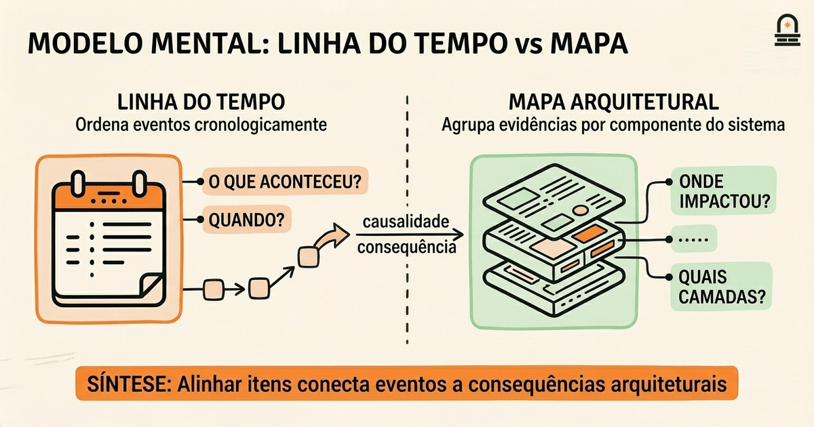
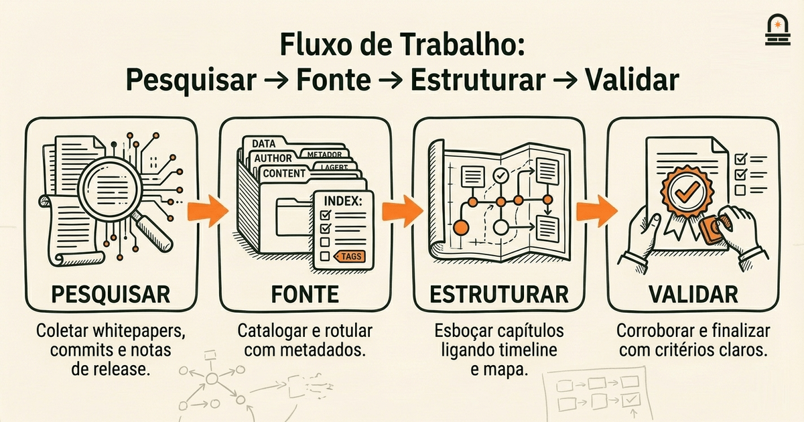
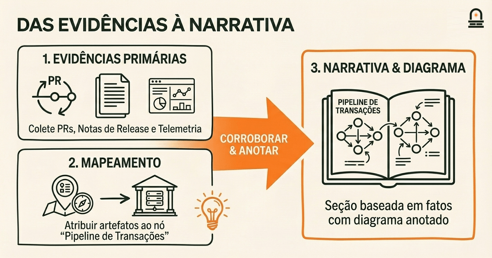

### Ouça também em áudio

[Ouvir este episódio no Spotify](https://open.spotify.com/episode/7Ma1avbfdI8pYeXcwjKo7M)

---

**Objetivo:** Definir o escopo do projeto final, critérios de sucesso e métodos de pesquisa para estruturar um relatório sobre a história e a arquitetura da Solana.

**Por que agora:** Agora alinhamos o conhecimento acumulado em direção a um relatório focado na história e na arquitetura da Solana.

**Conceitos:** História da Solana; Arquitetura da Solana; coleta de evidências e fontes; estruturar uma narrativa histórica; organização e seções do relatório; alinhamento de objetivos e critérios de avaliação

**Tempo de leitura:** 20 min

---

## Recapitulação & Introdução

Você concluiu recentemente "Navigating Solana Resources and Next Steps", onde praticou identificar tipos de recursos autoritativos para a visão geral do ecossistema Solana e aprendeu a construir e curar um glossário para a terminologia específica da Solana. Nessa lição você trabalhou com três verificações concretas de autoridade: artefatos primários do protocolo (whitepapers, RFCs, commits do repositório principal), documentação canônica (páginas oficiais em docs.solana.com e referências de API) e repositórios de código mantidos (commits ativos, mantenedores claros, triagem de issues). Você também usou sinais que indicam projetos ativos, como tags de release recentes, rastreadores de issues responsivos e propostas de governança atualizadas. Essas heurísticas concretas são a base de evidências imediata que reutilizaremos aqui.

Agora passamos de coletar e validar recursos para enquadrar o projeto final: decidir o que o relatório cobrirá, como você avaliará o sucesso e quais métodos usará para montar as seções de narrativa e arquitetura. Esta lição explica como traduzir os hábitos de pesquisa que você praticou em limites de escopo reproduzíveis, critérios de sucesso e métodos documentados para montar um relatório sobre a história e a arquitetura da Solana. No segundo parágrafo apresentamos os elementos centrais que você deve decidir agora: escopo temporal (quais anos ou marcos incluir), escopo temático (quais camadas arquiteturais e dinâmicas sociais tratar), estratégia de evidência (como converter sinais de recursos em afirmações citadas) e layout organizacional (como as seções mapeiam para fontes e critérios de avaliação).

Por que esta lição vem em seguida: você já tem as ferramentas básicas para identificar e avaliar fontes; agora precisa de um plano metodológico para que seu artefato final seja coerente, defensável e alinhado com a entrega do módulo: "Um relatório abrangente resumindo o desenvolvimento histórico e a visão arquitetural da Solana." Você usará as heurísticas da lição anterior — tipos de recursos autoritativos, curadoria de glossário e verificações de manutenção baseadas em sinais — como entradas nas decisões de escopo do projeto final. Mostraremos como converter essas entradas em pontos de verificação e critérios de aceitação que tornam o projeto final manejável, reproduzível e útil para leitores técnicos ou históricos.

## Objetivos de Aprendizagem

Ao final desta lição você será capaz de:

- **Definir um escopo claro** para o projeto final declarando limites temporais, camadas arquiteturais a cobrir e o nível do público (técnico, misto ou executivo).
- **Escrever critérios de sucesso mensuráveis** que vinculem entregáveis específicos (linha do tempo, diagrama de arquitetura, matriz de fontes) a verificações como número de citações, diversidade de fontes e status de corroboração.
- **Escolher e documentar métodos de pesquisa** que mapeiem tipos de recursos da lição anterior para seções do relatório e expliquem como você validará afirmações contestadas ou ambíguas.
- **Rascunhar um esboço de relatório de alto nível** que sequencie história e arquitetura de modo a apoiar afirmações causais (por exemplo, ligando mudanças de protocolo a eventos de desempenho ou governança).
- **Aplicar pontos de verificação de triagem** para priorizar fontes primárias e sinalizar fontes secundárias para corroboração durante a fase de síntese.

Esses objetivos são testáveis: um esboço com escopo definido, uma lista de verificação de critérios e um parágrafo documentando métodos servirão como artefatos que você pode apresentar na pasta de planejamento do projeto final.

## Modelo Mental: Linha do Tempo + Mapa de Arquitetura

O Modelo Mental: Adote um modelo mental combinado que trate o projeto final como dois mapas fortemente acoplados: uma linha do tempo cronológica de eventos e um mapa arquitetural dos componentes do sistema. A linha do tempo captura momentos discretos (lançamento da mainnet, forks notáveis, releases principais, marcos de crescimento da rede de validadores, integrações de terceiros importantes), enquanto o mapa arquitetural mostra elementos estruturais persistentes (camada de consenso, pipeline de transações, runtime, bibliotecas de runtime, camada RPC, topologia de validadores). Pense na linha do tempo como a espinha narrativa do relatório e no mapa arquitetural como a lente analítica que explica como esses eventos mudaram ou revelaram propriedades do sistema.

Mecanicamente, use a linha do tempo para ordenar evidências e o mapa arquitetural para categorizá-las. Por exemplo, quando encontrar um commit ou uma nota de release que mencione uma mudança no pipeline de transações, coloque esse item na linha do tempo na data apropriada e também anexe-o ao nó "pipeline de transações" no seu mapa de arquitetura. Essa dupla colocação ajuda a rastrear causalidade: a mudança no pipeline de transações ocorreu após um incidente de escala? Ela precedeu uma melhoria de throughput? Ao alinhar itens entre os dois mapas, você força ligações explícitas entre eventos históricos e consequências arquiteturais.

Para cada item mapeado você capturará três campos de metadados: tipo de fonte, status de corroboração e nível de confiança. Tipo de fonte usa as heurísticas de "Navigating Solana Resources and Next Steps" — marque itens como artefato primário do protocolo, documentação oficial, commit de código, comunicação de mantenedor (issue, comentário de PR) ou análise secundária (blogs, artigos acadêmicos). O status de corroboração registra se uma, duas ou três fontes primárias independentes confirmam o mesmo fato. Nível de confiança é seu juízo de trabalho (alto, médio, baixo) baseado no tipo de fonte e na corroboração. Esses campos de metadados criam um conjunto de dados pesquisável e auditável que apoia a narrativa e permite justificar por que certas afirmações são enfatizadas.

Concretamente, quando você coloca um marco como "implementação de uma otimização no runtime" na linha do tempo, anexe o hash do commit, a nota de release e qualquer discussão contemporânea em issues como entradas vinculadas. Então, no mapa de arquitetura, marque o nó runtime com uma anotação que referencia esses links. Se fontes secundárias interpretarem a mudança de forma diferente, observe a divergência e mantenha essas perspectivas para a seção de análise em vez da linha do tempo factual. Manter essa separação entre fatos verificáveis (entradas da linha do tempo com evidências primárias) e interpretação (análise que sintetiza fatos) preserva clareza e evita afirmações exageradas.

Esse modelo mental também orienta a priorização. Se você tiver tempo limitado, escolha itens da linha do tempo que conectem a múltiplos nós no mapa arquitetural — esses são eventos de alto impacto que moldaram vários subsistemas. Por outro lado, isole eventos periféricos (por exemplo, pequenas mudanças de tooling documentadas apenas em issues de repositórios) como "candidatos a apêndice" que oferecem profundidade sem distrair a narrativa principal. Pensar em mapas paralelos converte um corpo de evidências potencialmente difuso em um esqueleto narrativo estruturado que você pode rastrear e defender.

## Fluxo de Trabalho: Pesquisar, Fonte, Estruturar, Validar

Visão Geral do Processo: Estabeleça um fluxo de trabalho repetível que transforme recursos dispersos em um relatório em capítulos coerente. O fluxo de trabalho tem quatro fases: Research (coletar), Source (catalogar e rotular), Structure (esboçar e mapear) e Validate (corroborar e finalizar). Cada fase contém tarefas concretas e critérios de saída que você pode checar antes de avançar. Recomendamos executar esse fluxo iterativamente: complete uma passagem para temas de alto nível primeiro e depois itere mais profundamente nos capítulos priorizados.

Fase 1 — Research (coletar): Use os tipos de recurso e verificações de autoridade de "Navigating Solana Resources and Next Steps." Comece pelo whitepaper da Solana e pela documentação oficial, depois adicione logs de commits do repositório core, notas de release principais e comunicações primárias como propostas de governança ou anúncios da equipe central. Registre cada item com metadados bibliográficos: título, autor/mantenedor, data, URL e tipo. O critério de saída desta fase é uma coleção pesquisável que cubra seu escopo temporal com pelo menos um artefato primário por marco importante.

Fase 2 — Source (catalogar e rotular): Para cada item coletado atribua os campos de metadados descritos no modelo mental: tipo de fonte, status de corroboração e nível de confiança. Marque cada item com os(s) nó(s) arquiteturais do seu mapa. Gere uma matriz de fontes que resuma quantas fontes primárias, secundárias e terciárias suportam cada fato alegado. O critério de saída é uma matriz de fontes onde nenhuma alegação narrativa importante tem menos de duas fontes corroborantes, a menos que a alegação seja explicitamente rotulada como "fonte única" com justificativa.

Fase 3 — Structure (esboçar e mapear): Produza um esboço por capítulos que coloque a linha do tempo e o mapa arquitetural no centro. Decida como sequenciar capítulos: cronologicamente (por era) com subseções arquiteturais tópicas, ou capítulos temáticos que contenham mini-linhas do tempo para cada subsistema. O critério de saída é um esboço detalhado que lista as evidências primárias a serem citadas para cada subseção e especifica os diagramas que você incluirá (linha do tempo, mapa arquitetural, diagramas de componentes).

Fase 4 — Validate (corroborar e finalizar): Aplique as verificações cruzadas da lição anterior: verifique autores e timestamps de commits, avalie sinais de manutenção (branches ativas, releases recentes) e sinalize discrepâncias. Para afirmações que permanecerem contestadas, documente a discordância, mostre as fontes conflitantes e classifique o nível de confiança da alegação. O critério de saída é um conjunto pronto para rascunho de seções com citações anotadas e um apêndice de validação documentando ambiguidades não resolvidas.

Abaixo está uma tabela concisa que mapeia seções comuns do relatório para tipos de fontes primárias recomendadas e exemplos de verificações de validação. Use esta tabela como lista de verificação quando você atribuir recursos aos capítulos.

| Seção do Relatório | Fontes Primárias Recomendadas | Verificações de Validação |
| --- | --- | --- |
| História Inicial & Lançamento | Whitepaper, notas iniciais de lançamento da mainnet, commits de fundação | Verificar timestamps de commits, comparar notas de release com dados de gênese on-chain |
| Consenso & Topologia de Validadores | RFCs de protocolo, docs de clientes de validadores, snapshots de telemetria de nós | Confirmar datas de telemetria, verificar versões de clientes, corroborar com registros de governança |
| Pipeline de Transações & Desempenho | PRs do repositório core, relatórios de benchmark, painéis de métricas de rede | Reproduzir entradas de benchmark quando possível, comparar métricas reportadas vs. observadas |
| Integrações do Ecossistema | Anúncios de parceiros, releases de SDKs, páginas de documentação | Verificar atividade dos repositórios dos parceiros e respostas em issues |

Por que isso importa na prática: um fluxo de trabalho documentado evita que você retroaja evidências para uma narrativa preferida. Ao trabalhar iterativamente e anexar critérios de saída a cada fase, você torna o projeto final defensável: leitores podem inspecionar sua matriz de fontes e ver como você ponderou contas conflitantes. Essa abordagem transforma a triagem de fontes de uma atividade ad-hoc em uma pesquisa reproduzível que um público técnico pode auditar.

Finalmente, salve seus metadados e mapas em um formato portátil (por exemplo, CSV ou arquivo de notas estruturadas) para que você, revisores ou futuros mantenedores possam re-executar a fase de validação se novas fontes surgirem. A estrutura do fluxo de trabalho reduz a carga cognitiva e mantém o relatório focado em afirmações substanciadas em vez de especulação.

## Exemplo: Delimitação de uma Seção de Arquitetura — Das Fontes à Narrativa

Trabalhe com um exemplo concreto para ver como o modelo mental e o fluxo de trabalho operam de ponta a ponta. Suponha que você precise rascunhar uma seção intitulada "Processamento de Transações e Throughput: 2019–2023." Você converterá recursos coletados em uma narrativa curta, baseada em evidências, mais um diagrama de arquitetura anotado. Comece declarando o objetivo desta seção: explicar como mudanças no pipeline de transações afetaram o throughput e as ferramentas de desenvolvimento entre 2019 e 2023, e fornecer um diagrama anotado mostrando os componentes e interfaces do pipeline.

Passo 1: Reunir evidências primárias. Use as heurísticas de pesquisa da lição anterior para montar três tipos de artefatos primários: (a) PRs do repositório core que tratem de enfileiramento e paralelização de transações, (b) notas de release documentando mudanças relacionadas ao throughput, e (c) relatórios de benchmark ou snapshots de telemetria que afirmem valores de TPS específicos. Também colete discussões contemporâneas em threads de issues onde mantenedores debateram trade-offs de design. Registre cada item com metadados: data, autor/committer, URL e se o item é um commit, nota de release ou snapshot de telemetria.

Passo 2: Mapear evidências para o nó arquitetural. No seu mapa arquitetural marque o nó "Pipeline de Transações" com os artefatos coletados. Use os campos de corroboração e confiança do modelo mental: se uma afirmação de throughput aparece apenas em um blog secundário mas é sustentada por logs de commits e snapshots de telemetria, marque a afirmação como corroborada e defina confiança alta. Se uma afirmação aparece apenas em um post de marketing sem telemetria ou commits de suporte, marque como baixa confiança e coloque-a em um apêndice ou na lista de "afirmações a verificar".

Passo 3: Rascunhar o esboço da narrativa. Estruture a seção em três subseções curtas: contexto (descrever a arquitetura inicial do pipeline), intervenção (resumir as mudanças, citando commits e notas de release) e impacto (apresentar telemetria observada e interpretar correlações). Cada subseção deve referenciar explicitamente os artefatos primários. Por exemplo, na subseção de intervenção forneça o hash do commit e a data da nota de release ao descrever uma mudança de paralelização, e inclua um breve trecho citado da nota de release como âncora de citação. Mantenha a interpretação conservadora: afirme que a telemetria mostra uma correlação em vez de reivindicar um vínculo causal comprovado, a menos que você tenha dados de reprodução experimental.

Passo 4: Construir o diagrama e anotá-lo. Seu diagrama deve ser um diagrama de blocos simples mostrando os estágios do pipeline (ingest, verificação de assinatura, execução paralela, escrita no ledger). Ao lado de cada bloco anote os artefatos primários que o alteraram (por exemplo, "PR #1234 — escalonador de execução paralela; release vX.Y.Z — reduziu latência de commit em X ms") e o nível de confiança. Essas anotações são o elo prático entre arquitetura e evidência — elas permitem que leitores vejam quais partes do diagrama são bem suportadas e quais são tentativas.

Passo 5: Validar e sinalizar ambiguidades. Execute os critérios de saída de validação: garanta que cada afirmação importante seja suportada por pelo menos dois itens primários corroborantes ou esteja explicitamente rotulada como fonte única. Para interpretações contestadas, apresente ambos os lados e inclua os links brutos em um apêndice. Documente quaisquer suposições que você teve de fazer (por exemplo, inferir condições de operação para benchmarks) e observe como essas suposições afetam a confiança.

Por que isso importa: este exemplo mostra como converter sinais de fonte em uma seção de arquitetura defensável em vez de um texto opinativo. Ao vincular anotações em diagramas a artefatos específicos e rótulos de confiança, você torna a seção útil tanto para engenheiros que querem detalhes técnicos quanto para historiadores que precisam de evidência rastreável. Essa abordagem também prepara você para a próxima lição, onde sintetizaremos os itens de linha do tempo selecionados em uma narrativa integrada com citações explícitas e declarações de corroboração.

## Conclusão & Principais Lições

Agora você tem um plano claro para transformar os recursos brutos que coletou em um projeto final estruturado e defensável. Três princípios devem guiar seu trabalho daqui para frente. Primeiro, sempre separe fatos verificáveis da interpretação: represente artefatos primários em uma linha do tempo e reserve a análise para seções de síntese com classificações explícitas de confiança. Isso torna suas afirmações auditáveis e reduz o risco de exagerar as evidências.

Segundo, use o mapa de arquitetura como um quadro organizador: anexe evidências aos componentes para explicar por que eventos específicos importaram. Esse mapeamento converte commits e notas de release dispersos em uma narrativa analítica que leitores não especialistas conseguem seguir. Também ajuda a priorizar: eventos que afetam múltiplos nós de arquitetura são evidências de alto valor para o projeto final.

Terceiro, operacionalize seu fluxo de trabalho com critérios de saída para cada fase: colete até alcançar cobertura mínima do seu escopo temporal, catalogue com metadados de corroboração, esboce capítulos com evidências mapeadas e valide afirmações contestadas. Esses pontos de verificação impedem que você deslize para especulação e tornam o relatório reproduzível para revisores. Ao prosseguir para "Synthesizing Solana History", traga sua linha do tempo, mapa de arquitetura e matriz de fontes: eles são as matérias-primas que a próxima lição ensinará a converter em uma narrativa coerente e um capítulo arquitetural anotado.

## Recapitulação Rápida

- Use o modelo mental linha do tempo + mapa de arquitetura para ligar eventos a mudanças do sistema.
- Siga o fluxo Research → Source → Structure → Validate e atenda aos critérios de saída antes de avançar.
- Anote diagramas com artefatos primários e níveis de confiança para que as afirmações sejam auditáveis.
- Priorize eventos de alto impacto que toquem múltiplos nós de arquitetura para cobertura eficiente.

## Próximos Passos

Prepare-se para a próxima lição, "Synthesizing Solana History", completando três itens práticos: (1) monte sua planilha de linha do tempo com pelo menos cinco marcos principais e artefatos primários associados, (2) produza um mapa arquitetural em primeira versão que identifique pelo menos quatro componentes centrais e marque cada um com um ou dois links de evidência, e (3) rascunhe critérios de sucesso para a entrega do projeto final usando as verificações mensuráveis descritas aqui (limiares mínimos de corroboração, requisitos de diagramas e conteúdo de apêndice). Traga esses artefatos para a próxima lição; iremos sintetizá-los em uma narrativa integrada e mostrar como apresentar reivindicações contestadas de forma transparente.

---

## Glossário

### Primary Source

Uma fonte primária é um artefato original e contemporâneo, como um whitepaper, commit, nota de lançamento ou proposta de governança, usado como evidência direta.

### Secondary Source

Uma fonte secundária é um item interpretativo ou analítico, como um post de blog, artigo ou artigo acadêmico, que explica ou contextualiza fontes primárias mas requer corroboração.

### Corroboration

Corroboração: confirmação independente do mesmo fato por múltiplas fontes primárias ou por artefatos que se apoiam mutuamente.

### Architectural Map

Mapa Arquitetural: uma representação diagramática dos componentes do sistema e suas interfaces usada para anexar evidências e anotações.

### Confidence Level

Nível de Confiança: um juízo de trabalho (alto, médio, baixo) baseado no tipo de fonte, na corroboração e na consistência entre as evidências.

### Source Matrix

Matriz de Fontes: um resumo tabular que mapeia afirmações ou seções para suas fontes primárias e secundárias de apoio para verificação.

---

## Referências & Leitura Complementar

- [Solana: Uma nova arquitetura para uma blockchain de alto desempenho (Whitepaper)](https://solana.com/solana-whitepaper.pdf) — *Solana Labs* (Protocolo Principal)
- [Documentação para Desenvolvedores Solana — solana-docs](https://docs.solana.com/) — *Solana Docs* (Documentação)
- [Solana no GitHub — repositório principal e histórico de releases](https://github.com/solana-labs/solana) — *Solana on GitHub* (Repositório de Código)
- [Releases e Changelog da Solana (notas de release selecionadas)](https://github.com/solana-labs/solana/releases) — *Solana Releases* (Anúncio Técnico)
- [Propostas e Discussões de Governança da Solana](https://forums.solana.com/) — *Fóruns da Comunidade Solana / Governança* (Comunidade & Governança)
