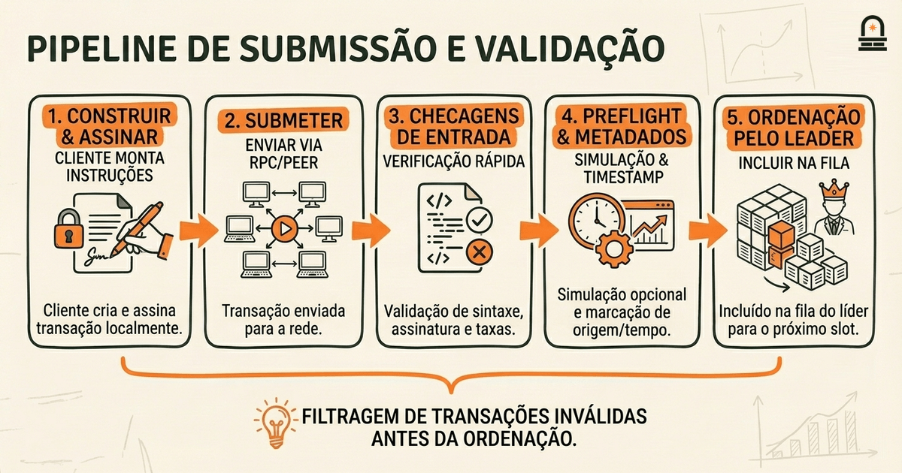
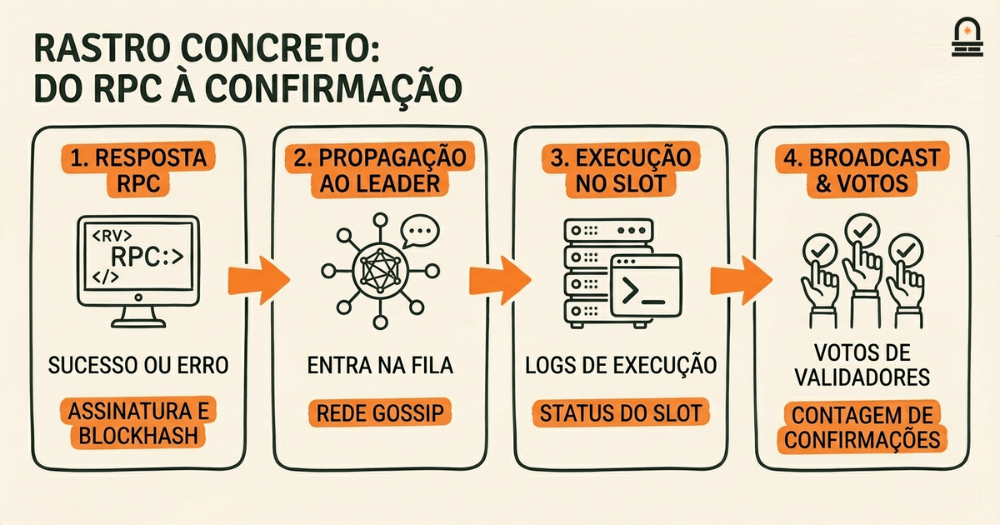
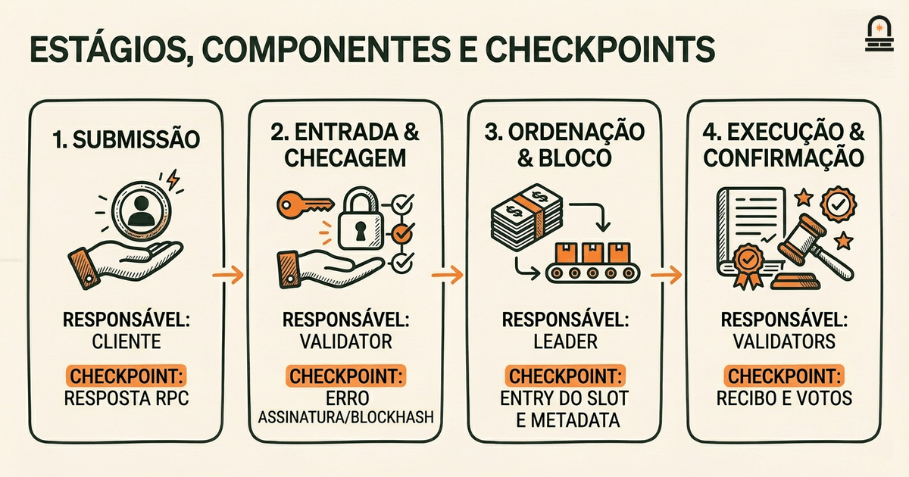

### Ouça também em áudio

[Ouvir este episódio no Spotify](https://open.spotify.com/episode/6PfbyVXcaGa1m5pBcODq4V)

---

**Objetivo:** Traçar o ciclo de vida de uma transação desde a submissão, validação, ordenação e confirmação dentro da arquitetura.

**Por que agora:** Depois de aprender os componentes e papéis, traçar uma transação real mostra essas peças em ação.

**Conceitos:** pipeline de submissão de transações; verificação de assinatura e etapas básicas de validação; visão geral de ordenação e tratamento de conflitos; conceitos de finalização e confirmação; considerações de latência e taxa de transferência

**Tempo de leitura:** 35 min

---

## Recapitulação & Introdução

Transações na Solana começam como mensagens roteadas para a rede; você acabou de ver responsabilidades concretas dos componentes do runtime que recebem, encaminham e armazenam essas mensagens. Lembre que os validators executam o runtime que roda programas, mantêm snapshots do estado do ledger e participam do roteamento de mensagens baseado em gossip. Essa ideia concreta — de que componentes separados controlam a entrada de mensagens, a aplicação de estado e a propagação entre nós — é a base necessária para traçar uma transação desde a submissão até a confirmação.

Agora passamos de papéis estáticos para fluxo: você irá traçar o que acontece com uma única transação enquanto ela percorre submissão, checagem de assinatura, validação preliminar, ordenação, execução e confirmação final. Ao conectar os componentes do runtime que você aprendeu a cada estágio do ciclo de vida da transação, você verá como roteamento de rede, escalonamento de leader, pipeline de processamento de transações e checkpoints de estado interagem. Esta lição vem a seguir porque entender os limites dos componentes não é suficiente até que você os veja coordenando sob uma carga de transações em tempo real.

Pense no ciclo de vida da transação como uma pequena linha de montagem. Estágios iniciais focam na correção sintática e de assinatura; estágios intermediários focam em ordenação, detecção de conflitos e execução pelo leader agendado; estágios finais focam na propagação dos resultados, votação e confirmação. Os conceitos-chave com que você irá trabalhar são o pipeline de submissão de transações, as etapas de verificação de assinatura e validação básica, ordenação e tratamento de conflitos, finalização versus confirmação, e como latência e taxa de transferência moldam trade-offs. Enfatizamos checkpoints práticos: onde uma transação é verificada, qual componente realiza essa verificação e que garantias (ou falta delas) cada checkpoint fornece.

Ao longo da lição você mapeará cada estágio para o componente responsável e para o checkpoint de verificação que prova que a transação progrediu corretamente. Não vamos executar operações em rede ao vivo; em vez disso, você construirá uma tabela comparativa conceitual que liga estágios, componentes e verificações para que possa aplicar o mesmo mapeamento ao ler a documentação do protocolo Solana ou inspecionar logs de validators. Ao final, você será capaz de apontar para uma entrada de log ou uma resposta RPC e explicar a que estágio ela corresponde e que verificação deve ser esperada.

## Objetivos de Aprendizagem

Ao final desta lição, você será capaz de mapear cada estágio do ciclo de vida de uma transação Solana para o subsistema ou processo responsável, explicar que verificação ocorre em cada estágio e descrever as implicações para latência e taxa de transferência. Você identificará onde ocorrem checagens de assinatura, verificações de taxa, leituras do estado do ledger e detecção de conflitos e qual componente realiza cada uma. Você também produzirá uma tabela comparativa que vincula estágios a checkpoints de verificação e artefatos observáveis esperados (logs, respostas RPC ou assinaturas).

Especificamente, você será capaz de: (1) descrever o pipeline de submissão do cliente até o ponto de entrada; (2) listar os passos básicos de validação realizados antes da ordenação; (3) explicar como os leaders ordenam e tratam transações conflitantes; (4) distinguir confirmação de finalização no modelo Solana; e (5) raciocinar sobre como cada estágio contribui para a latência de ponta a ponta e para a taxa de transferência sustentada. Esses objetivos são testáveis: você deve ser capaz de reconstruir a tabela de mapeamento de memória e explicar qual checkpoint inspecionaria para depurar uma transação travada.

## Conceitos Centrais de Transação: Submissão, Validação, Ordenação e Confirmação

Comece pelo pipeline de submissão: quando você constrói uma transação off-chain, ela contém instruções, endereços de contas e um conjunto de assinaturas provando autoridade. Você assina localmente e submete a transação para um endpoint RPC próximo ou diretamente para um validator via rede gossip ou transporte estilo QUIC. Na entrada, o nó receptor trata a mensagem como um candidato não processado e executa checagens sintáticas e de assinatura para confirmar que a mensagem está bem formada. Essas checagens de recebimento são projetadas para rejeitar pacotes malformados ou não assinados rapidamente, de forma que componentes a jusante vejam apenas transações plausíveis.

A verificação de assinatura é o primeiro obstáculo criptográfico significativo. Um nó verifica que o bloco de assinaturas corresponde ao conjunto de signatários exigido pelas instruções da transação. Essa checagem usa o campo `recent_blockhash` da transação para anexar limites de vivacidade e prevenir replay entre épocas. Se o bloco de assinatura for inválido ou o recent_blockhash estiver obsoleto, o nó rejeita a transação na entrada; você verá isso refletido em respostas de erro RPC que mencionam explicitamente verificação de assinatura ou expiração do blockhash. O desenho mantém operações caras fora da fila do leader se a transação já é inválida.

Após checagens sintáticas e de assinatura, o nó realiza validação básica: verificações da conta pagadora de taxas, existência de contas e uma simulação prévia (preflight) barata usada por endpoints RPC para prever falhas. Esse preflight é uma etapa opcional voltada ao cliente que replica um subconjunto das checagens do runtime sem cometer estado. Seu papel prático é evitar a submissão de transações condenadas e fornecer motivos determinísticos de falha. O nó também marca a transação com metadados (timestamp de chegada, peer originador) usados posteriormente para ordenação e métricas. Note como essas checagens iniciais são principalmente defensivas: evitam carga espúria nos estágios mais caros de ordenação e execução.

A ordenação ocorre quando o leader agendado para um slot coleciona transações em um bloco (ou pacote de entries) e as sequencia. Leaders escolhem transações usando heurísticas que priorizam taxas e visam maximizar a taxa de transferência enquanto evitam conflitos. A detecção de conflitos aqui é primariamente otimista: o leader sequencia transações e, mais tarde, durante a execução, identifica conflitos de read/write contra o estado atual. Se uma transação conflitar ao ser aplicada, ela falha no momento da execução e a falha é refletida no resultado da transação e propagada nos votos.

Confirmação e finalização são resultados distintos. Confirmação refere-se ao grau de endosso que um bloco recebe de leaders/votantes subsequentes — você verá confirmações aumentarem conforme mais blocos são construídos sobre o bloco que contém sua transação. Finalização é o ponto em que o cluster considera a transação irreversível sob operação normal, frequentemente após votação de supermaioria ou políticas de checkpoint. A abordagem da Solana enfatiza tempos rápidos de confirmação com finalidade probabilística; esse equilíbrio impacta como você interpreta confirmações observadas versus garantias absolutas.

Ao longo desses estágios, fontes de latência incluem propagação de rede para nós e para o leader, tempo de verificação de assinatura, atrasos de enfileiramento em leaders sob alta carga e tempo de execução dentro do runtime. A taxa de transferência é moldada pela duração do slot do leader, políticas de empacotamento de blocos, eficiência da propagação adiante e taxas de conflito entre transações. Entender as responsabilidades de cada estágio esclarece quais logs e métricas inspecionar quando uma transação está lenta, rejeitada ou falhando repetidamente.

## Como Isso Aparece no Mundo Real: Um Rastreamento Concreto

Imagine que você submeta uma instrução do tipo transferência a partir do seu cliente através de um nó RPC. O artefato imediato que você recebe é ou um sucesso RPC com a assinatura submetida ou um erro explicando a rejeição. Se você receber um reconhecimento de submissão, o nó RPC realizou checagens de entrada e encaminhou a transação para a rede gossip e para leaders prospectivos. Na prática, a primeira observação será se o RPC retornou um `blockhash not found` ou um erro de validação de assinatura; esses indicam falhas no checkpoint de entrada antes da ordenação.

Em seguida, a transação chega ao leader agendado para o slot seguinte. O leader coleta transações e constrói uma entry que inclui sua mensagem assinada. Na prática, você ou verá a transação incluída em fetches de blocos recentes ou não; se incluída, o leader executará a transação no runtime: carrega estado de contas, executa as instruções do programa, atualiza saldos e emite logs e uso de compute meter. Sinais concretos de execução incluem logs visíveis na metadata da transação retornada por chamadas RPC `getTransaction` e um status que indica `Ok` ou um erro de runtime como fundos insuficientes ou conta não encontrada.

O tratamento de conflitos aparece quando duas transações tocam as mesmas contas graváveis. Suponha que você submeta concorrentemente duas transações que ambas debitam da mesma conta. Um leader pode ordená-las consecutivamente; a primeira executará e atualizará o estado, enquanto a segunda falhará durante a execução devido a uma mudança no estado esperado da conta ou saldo insuficiente. O resultado observável é um status bem-sucedido e um status com falha nos recibos de transação. Para depuração em nível mais alto, examine os logs da transação e o slot em que cada uma foi confirmada para ver a sequência.

Após a execução, o leader broadcasta o bloco e o conjunto de validators vota sobre a validade do bloco. Você verá as confirmações aumentarem conforme validators a jusante incluem votos referenciando o bloco do leader. Na prática, o endpoint RPC expõe uma contagem de confirmações e a altura do bloco; observar esses valores ao longo do tempo demonstra como a confirmação se acumula. Se o cluster observar votos suficientes conforme sua política, o bloco caminha para a finalização. Do ponto de vista operacional, eventos relacionados à finalização são mais lentos e aparecem como comprometimento persistente de blocos em nós arquivistas e em consultas por blocos finalizados.

Finalmente, considerações de latência e taxa de transferência surgem em traços repetidos. Sob baixa contenção e carga leve, a latência ponta a ponta da submissão até uma confirmação pode variar de dezenas a centenas de milissegundos; sob carga alta, enfileiramentos em leaders e reexecuções por conflitos inflacionam a latência e reduzem a taxa de transferência efetiva. Passos concretos de depuração que você realizará incluem checar mensagens de rejeição na entrada, rastrear inclusão em um slot via `getSignatureStatuses`, inspecionar logs de execução via `getTransaction` e observar contagens de confirmação. Esses passos mapeiam-se diretamente para os checkpoints de verificação que incluiremos na tabela comparativa para que você possa raciocinar sobre onde um problema se originou.

## Tabela Comparativa: Estágios, Componentes Responsáveis e Checkpoints de Verificação

Diferenças-chave: Abaixo está um mapeamento estruturado que você usará como artefato: para cada estágio da transação, os componente(s) responsáveis e o checkpoint de verificação que você pode observar ou inspecionar. A tabela captura o caminho normal; tratamento excepcional (retries, rejeições) referenciará os mesmos checkpoints, mas com indicadores de erro.

| Estágio da Transação | Componente(s) Responsável(eis) | Checkpoint de Verificação / Artefato Observável |
| --- | --- | --- |
| Assinatura e Submissão pelo Cliente | Software cliente, endpoint RPC ou nó peer | Resposta de submissão RPC, assinatura pendente no mempool, assinatura presente no cliente |
| Entrada: Checagens de Sintaxe & Assinatura | Validator receptor ou nó RPC (camada gossip/QUIC) | Erro RPC imediato (assinatura inválida, blockhash expirado), logs mostrando verificação de assinatura |
| Validação Básica & Checagens de Taxa | Nó receptor, serviço de simulação preflight | Resposta de preflight (resultado da simulação), checagens de saldo do fee-payer, mensagens de erro explícitas |
| Propagação via Gossip / Entrega ao Leader | Transporte de rede, leader agendado | Inclusão na fila de transações do leader, timestamps de chegada, métricas de mempool, estado pendente em `getSignatureStatuses` |
| Ordenação & Construção de Bloco | Leader (produtor de slot), lógica de montagem de bloco | Transação aparece em entries do slot, metadata do cabeçalho do bloco, logs do leader mostrando empacotamento/seqüência |
| Execução & Detecção de Conflitos | Executor do runtime dentro do nó leader | Resultado de execução no recibo da transação, logs do programa, status de sucesso/falha, unidades de compute usadas |
| Broadcast & Votação | Leader, validators emitindo votos | Votos de validators referenciando o bloco, contagem de confirmações via RPC, mensagens gossip do cluster |
| Confirmação & Finalização | Conjunto de validators, agregação de votos, política de checkpoint/finality | Consultas a blocos finalizados, entradas persistentes do ledger em nós arquivistas, confirmações via RPC |

Use a tabela como checklist ao solucionar problemas. Por exemplo, se sua transação nunca for encontrada em um slot, verifique as linhas de entrada e propagação gossip: uma rejeição na entrada ou um gargalo de propagação aparecerá em erros RPC ou na ausência no mempool. Se sua transação aparece em um slot mas mostra execução com falha, inspecione a linha do executor do Runtime: logs do programa e códigos de status explicam a falha. Se as confirmações pararem de aumentar, monitore as linhas de Broadcast & Votação e Confirmação para determinar se particionamento de rede ou liveness de validators estão em jogo.

Como exercício, tente anotar cada linha da tabela com latências esperadas sob carga leve e pesada. Artefatos típicos de baixa carga incluem entrada subsegundo e inclusão no leader dentro de um ou dois slots. Sob carga alta, a entrada ainda pode ser rápida para transações válidas, mas enfileiramento em leaders e reexecuções por conflitos aumentam o tempo até confirmação. Essa anotação te treina a prever onde aparecem gargalos e quais dados de checkpoint coletar para análises post-mortem.

## Conclusão & Principais Lições

Agora você deve entender o ciclo de vida da transação como uma sequência de transferências de responsabilidade: submissão pelo cliente e checagens de assinatura, validação básica e checagens de taxa, propagação e entrega ao leader, ordenação e execução pelo leader e, finalmente, broadcast, votação e finalização. Lembre-se de três princípios práticos: primeiro, checkpoints iniciais (assinatura e preflight) são defesas baratas que previnem trabalho de execução desperdiçado; segundo, ordenação e execução são onde conflitos aparecem e onde logs observáveis do programa explicam falhas; terceiro, confirmação e finalização são sinais separados com garantias e latências diferentes.

Mantenha duas ferramentas mentais à mão. A primeira é a tabela de mapeamento que você criou: para qualquer estado de transação que você observar, identifique a qual estágio pertence e então consulte a tabela para encontrar o componente responsável e o checkpoint a inspecionar. A segunda é a lente latência-versus-taxa-de-transferência: alvos de confirmação rápida reduzem o tempo de espera mas dependem de garantias probabilísticas, enquanto checagens relacionadas à finalização reduzem ambiguidade ao custo de tempo. Essas ferramentas irão ajudá-lo a priorizar problemas e projetar sistemas que dependem das confirmações da Solana adequadamente.

Na prática, esta lição o prepara para ler detalhes de implementação e trade-offs de segurança na próxima lição. Você aplicará o mapeamento componente-estágio quando avaliar por que a Solana faz escolhas específicas em torno de ordenação, resolução de conflitos e performance do runtime. A tabela comparativa que você produziu é a ponte: use-a para fundamentar discussões futuras sobre consenso e comportamento de validators para que esses tópicos não sejam abstratos, mas atrelados a checkpoints concretos e observáveis que você já sabe onde encontrar.

## Recapitulação Rápida

• Transações passam por estágios de entrada, validação, ordenação pelo leader, execução e confirmação; cada estágio possui um componente responsável.

• Checagens de assinatura e preflight na entrada previnem carga desnecessária nos leaders; falhas em tempo de execução revelam conflitos ou erros de programa.

• Observáveis incluem respostas de submissão RPC, inclusão em um slot, recibos e logs de transação, votos de validators e consultas a blocos finalizados.

• Use a tabela comparativa para mapear sintomas a checkpoints e componentes responsáveis ao depurar.

## Próximos Passos

Para a próxima lição, prossiga para "Compromissos de Projeto e Características Distintivas." Você aplicará o mapeamento estágio-para-componente desta lição para avaliar por que a Solana faz escolhas específicas em torno de ordenação, finalidade e desempenho do runtime. Antes de avançar, revise a tabela comparativa e tente anotar latências esperadas e modos de falha para cada linha; esse trabalho preparatório tornará a discussão de trade-offs mais concreta e fácil de avaliar.

Recomendamos manter essa tabela à mão como referência quando você ler documentação em nível de protocolo ou logs de validators no próximo módulo sobre consenso e segurança.

---

## Glossário

### Recepção (transaction intake)

O recebimento inicial e as checagens leves que um nó realiza sobre uma transação submetida, incluindo validação sintática e verificação de assinatura antes da propagação ou enfileiramento.

### Simulação de preflight

Uma execução voltada ao cliente, sem commit, de uma transação em um nó para prever sucesso ou falha e expor erros de runtime esperados antes da submissão real.

### Líder (produtor de slot)

O validator agendado para montar, ordenar e executar transações para um slot específico; responsável por construir entries que se tornam blocos.

### Confirmação

Uma medida probabilística indicando que blocos subsequentes referenciam o bloco contendo a transação; as confirmações crescem à medida que validators votam em descendentes.

### Finalização

O estado em que a rede trata um bloco como irreversível sob condições normais, tipicamente após votos suficientes ou políticas de checkpoint serem atendidas.

### Detecção de conflitos

O processo de identificar transações que não podem ambas ter sucesso porque escrevem em estado sobreposto ou dependem de condições de conta mutuamente exclusivas.

---

## Referências & Leitura Complementar

- [Solana: Visão Técnica e Arquitetura](https://solana.com/docs) — *Documentação Solana* (Especificação do Protocolo)
- [Processamento de Transações e Runtime: Como as Transações São Processadas](https://solana.com/docs/rpc) — *Solana Docs - Transactions* (Runtime & Processamento de Transações)
- [Escala de Leaders e Mecanismos de Votação](https://docs.anza.xyz/consensus/leader-rotation) — *Recursos para Desenvolvedores Solana* (Escalonamento de Leader e Consenso)
- [Usando Métodos RPC para Rastrear o Ciclo de Vida da Transação](https://solana.com/docs/rpc) — *Guia da API RPC Solana* (Depuração Prática)
