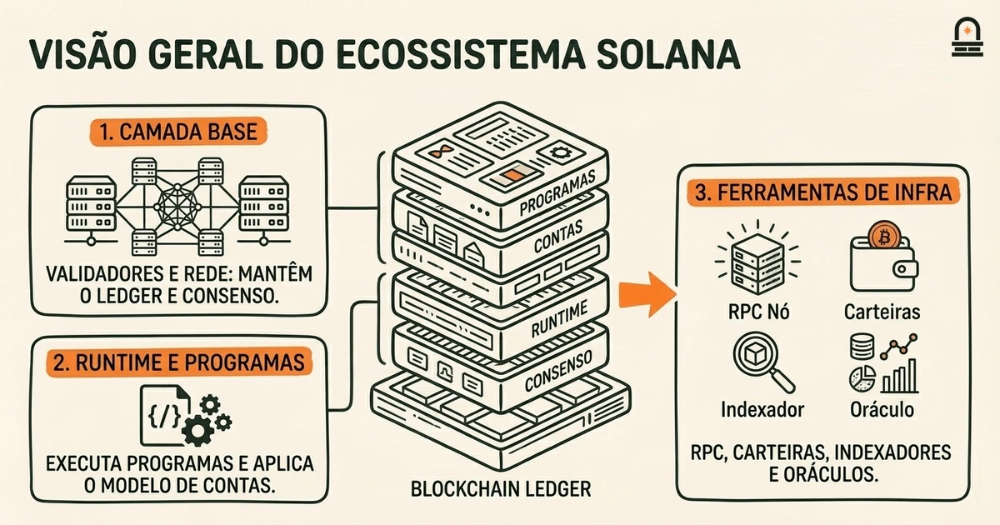
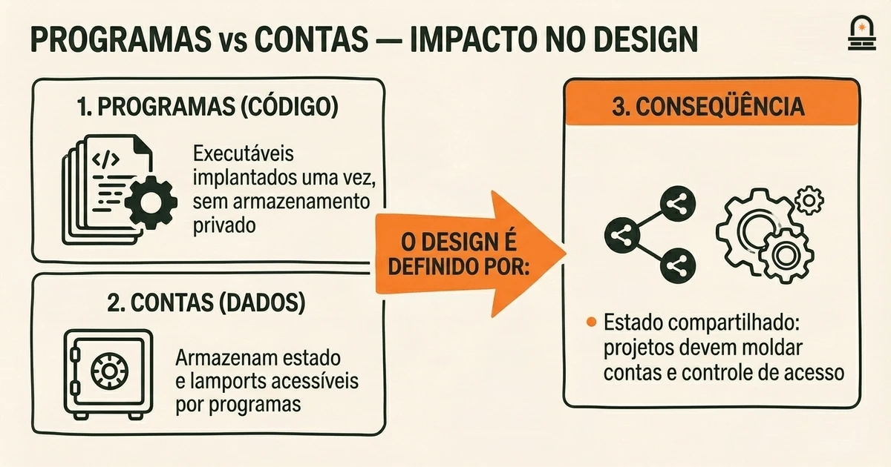
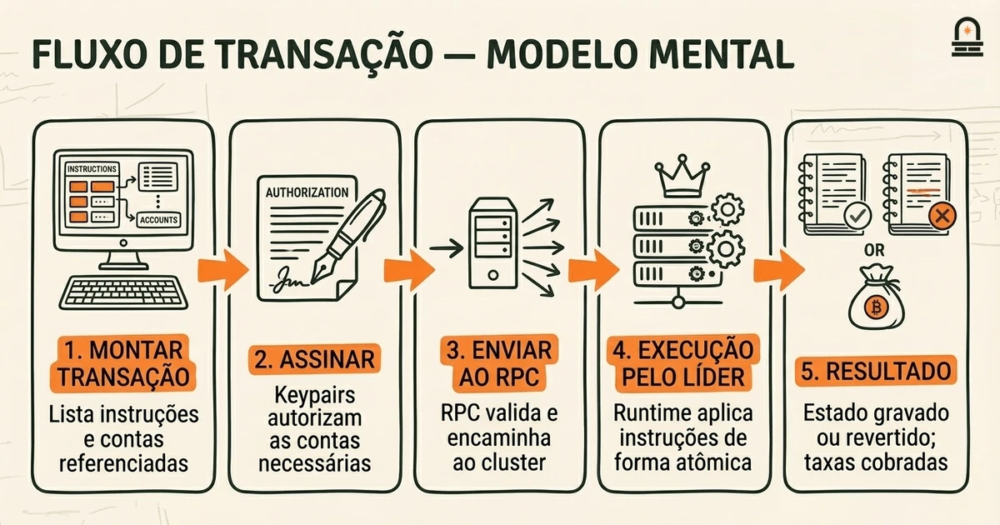
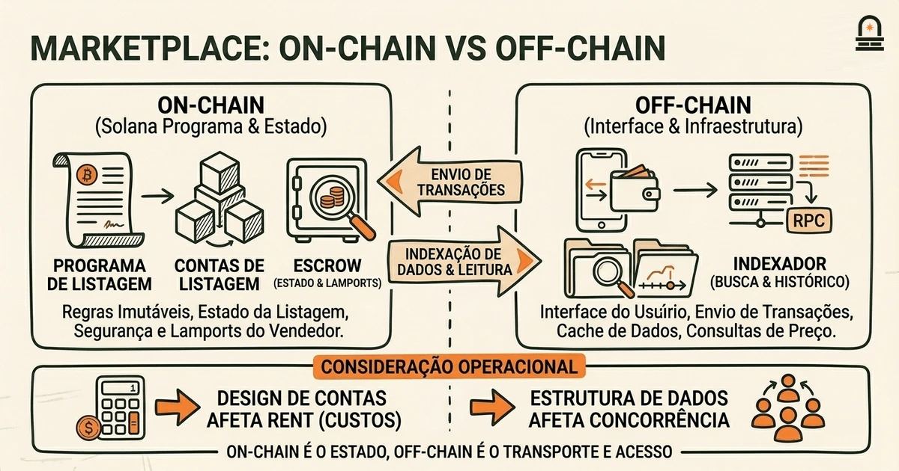

### Ouça também em áudio

[Ouvir este episódio no Spotify](https://open.spotify.com/episode/6KcKhB03fnvpIsPbaCgEtx)

---

**Objetivo:** Identificar os componentes principais da visão geral do ecossistema Solana e definir a terminologia comum da Solana relevante para iniciantes.

**Por que agora:** Estabelece um vocabulário e um escopo compartilhados para que as lições subsequentes se baseiem na mesma linha de partida.

**Conceitos:** Componentes da visão geral do ecossistema Solana; Terminologia comum da Solana e definições; Papéis dos participantes dentro do ecossistema Solana; Como projetos e elementos de infraestrutura se encaixam; Pontos de contato para desenvolvedores no ecossistema Solana

**Tempo de leitura:** 13 min

---

## Recapitulação & Introdução

A arquitetura da Solana enfatiza alto throughput combinando um único livro-razão global com técnicas que permitem que validadores processem transações em paralelo ao preservar um estado consistente. Da lição anterior você deve recordar um tradeoff concreto: aumentar o throughput exige coordenação mais rígida entre hardware (CPUs rápidas, links de rede com alta I/O) e software (escalonamento eficiente, paralelização de transações), o que afeta a pressão sobre a descentralização e a estrutura de custos dos validadores.

Essa percepção sobre a coordenação hardware/software conecta-se diretamente ao objetivo desta lição: antes de começar a explorar projetos, ferramentas ou APIs na Solana, você precisa de um vocabulário compartilhado que mapeie componentes para papéis e pontos de contato. Movemos dos tradeoffs de arquitetura para um mapa do ecossistema porque saber o que cada peça faz — e como ela se posiciona na pilha — permite que você faça as perguntas de implementação corretas depois. Se você consegue nomear os atores e a infraestrutura, pode casar necessidades de desenvolvedor com os serviços corretos sem confusão.

Ao final desta lição, você será capaz de identificar componentes essenciais do ecossistema, como validadores, nós RPC, programas em runtime e primitivas de token/identidade; definir termos específicos da Solana como modelo de contas, rent e epochs; e descrever como projetos e peças de infraestrutura se encaixam tanto da perspectiva do desenvolvedor quanto do operador. Estabelecemos esse vocabulário básico agora para que a próxima lição, que coloca a terminologia em exemplos concretos, se construa sobre uma base consistente em vez de repetir definições em contextos dispersos.

## Objetivos de Aprendizagem

Após trabalhar com esta lição, você será capaz de:

- **Identificar** os componentes primários do ecossistema Solana e explicar o papel de cada componente no ciclo de vida de uma transação.
- **Definir** termos específicos da Solana, como modelo de contas, programa, rent, epoch, leader schedule e stake com precisão e contexto.
- **Mapear** pontos de contato comuns para desenvolvedores — nós RPC, SDKs, carteiras, exploradores — para a infraestrutura subjacente da qual dependem.
- **Explicar** como validadores, clusters e infraestrutura off-chain interoperam e quais implicações práticas essas interações criam para a arquitetura de aplicações.

Cada objetivo é testável: você deverá ser capaz de relacionar um componente do ecossistema a uma tarefa de desenvolvedor, explicar por que um termo importa para decisões de design e descrever implicações práticas dos papéis dos participantes.

## Componentes Centrais do Ecossistema Solana

Comece imaginando o ecossistema Solana como uma pilha em camadas onde cada camada fornece serviços para a camada acima. Na base estão os validadores e o tecido de rede que mantêm o livro-razão compartilhado. Acima disso está o runtime que executa programas (os smart contracts da Solana) e aplica o modelo de contas. Ao redor dessas peças centrais estão componentes de infraestrutura voltados para desenvolvedores: nós RPC para chamadas remotas, indexadores e provedores de dados para leituras históricas e análises, carteiras que gerenciam chaves e assinam transações, e serviços off-chain como oráculos e servidores backend que interagem com programas on-chain.

Validadores: validadores executam o runtime da Solana e participam do processo de consenso proof-of-stake. Eles processam transações, produzem entradas no livro-razão e votam sobre estados do livro-razão. Validadores têm funções operacionais além do consenso: atendem RPCs quando configurados, armazenam dados de blocos e podem ser configurados para fornecer histórico arquivado. O leader schedule — intervalos determinísticos que designam um líder para produzir blocos — afeta quando um validador é responsável por agrupar transações e gerar prova de validade.

Programas e Contas: a Solana separa código (programas) de dados persistentes (contas). Programas são implantados uma vez e executados por transações que referenciam contas. O modelo de contas é central: contas armazenam dados binários arbitrários e lamports (a unidade base da Solana), e programas operam sobre as contas passadas nas transações. Esse modelo influencia a estrutura das aplicações porque programas não têm armazenamento privado; os desenvolvedores projetam o estado ao redor de contas que clientes e programas acessam em conjunto.

Nós RPC e SDKs clientes: nós RPC expõem endpoints JSON-RPC que permitem submeter transações, consultar estado de contas e assinar-se a eventos. SDKs clientes encapsulam esses RPCs com idiomatismos de linguagem e utilitários como construção de transações e serialização de instruções. Indexadores e provedores de dados complementam os RPCs oferecendo visões enriquecidas (saldos de tokens ao longo do histórico, rastros de eventos específicos de programas) úteis para front-ends e análises. Carteiras mediam a assinatura e aprovação de transações, conectando chaves dos usuários às aplicações por interfaces padronizadas.

| Layer | Primary Responsibility | Developer Touchpoint |
| --- | --- | --- |
| Consensus & Network | Maintain ledger, schedule leaders, propagate blocks | Validator configs, cluster RPC endpoints |
| Runtime & Programs | Execute program logic, manage accounts | Program deployment, accounts, instruction construction |
| Data & Indexing | Provide historical queries, analytics | Indexers, specialized RPCs, subgraph services |
| Client & UX | Key management, transaction signing, display | Wallet adapters, SDKs, explorers |

Entender esses componentes em termos de camadas esclarece quem faz o quê e onde residem as responsabilidades. Por exemplo, quando você observa uma resposta lenta de um RPC, pode determinar se o gargalo é o nó, a rede ou o pipeline do indexador. Ao projetar um dApp, você escolhe quais camadas controlar (programas, front end) e em quais confiar (indexadores, provedores de carteira). Esse mapeamento de responsabilidade para ponto de contato é a base prática que você usará nas lições subsequentes.

## Modelos Mentais: Contas, Programas e o Fluxo de Transações

O Modelo Mental: Um modelo mental prático que simplifica a arquitetura conta-programa da Solana é imaginar uma coleção de cofres etiquetados (contas) e um conjunto de instruções de chaveiro (programas) que podem abrir, alterar ou transferir o conteúdo quando apresentadas as chaves e autorizações corretas. Cada cofre armazena dados e valor; um chaveiro tem as regras sobre quais operações são permitidas no cofre. Um cliente leva uma lista de cofres e operações de chaveiro (uma transação) ao livro-razão, e o líder atual executa as instruções contra os cofres referenciados em um único passo atômico.

Use essa metáfora para raciocinar sobre perguntas comuns de desenvolvedores. Se você precisa de estado persistente de usuário, crie contas dedicadas para esse usuário e projete as instruções do programa para aceitar essas contas como entradas mutáveis. Se vários programas precisam operar sobre os mesmos dados persistentes, eles devem compartilhar acesso às mesmas contas, e você precisa considerar acesso concorrente. A natureza atômica das transações significa que ou todas as modificações nas contas referenciadas ocorrem ou nenhuma ocorre; essa propriedade ajuda a projetar atualizações consistentes sem coordenação por múltiplas transações para muitos fluxos comuns.

Agora traduza a metáfora para o ciclo de vida da transação. Um cliente monta uma transação que lista instruções de programas e referencia contas com papéis específicos (somente leitura versus leitura-escrita). A transação é assinada pelos keypairs necessários, enviada a um nó RPC, encaminhada aos validadores e incluída pelo líder para execução. Durante a execução, o runtime desserializa instruções, verifica restrições das contas (propriedade, saldos, isenção de rent), aplica mudanças de estado e registra o resultado no livro-razão. Se a execução falhar, o runtime reverte as mudanças de estado e cobra do pagador da taxa pelos recursos de computação e largura de banda consumidos.

Esse modelo revela três regras práticas de design que você reutilizará: primeiro, planeje o layout de contas intencionalmente — co-localize estados acessados com frequência para minimizar overhead entre contas; segundo, minimize o número de contas mutáveis em uma transação para reduzir contenção e preservar oportunidades de execução paralela; terceiro, extraia lógica frequentemente reutilizada para programas compartilhados em vez de implantar código duplicado. Essas regras derivam diretamente do mecanismo: contas são o único armazenamento persistente e programas são executores stateless que operam sobre contas que você passa.

Finalmente, a metáfora dos cofre-e-chaveiro também ajuda ao depurar ou ler rastros de transações. Quando uma transação falha por incompatibilidade de conta ou assinante faltante, trate a falha como uma lista de cofres mal especificada ou uma chave ausente. Quando a execução consumir unidades de computação inesperadas, inspecione quais instruções modificaram quais contas e se houve grandes cópias de contas ou operações criptográficas pesadas envolvidas. Usar a metáfora acelera mapear erros em tempo de execução para correções de projeto.

## Exemplo: Mapeando um dApp Simples no Ecossistema Solana

Percorra um exemplo concreto: um marketplace on-chain simples onde vendedores listam itens e compradores fazem ofertas. Use este cenário para mapear cada ator e peça de infraestrutura para os componentes que introduzimos. Você verá como escolhas de arquitetura e terminologia se aplicam a um fluxo de trabalho real de desenvolvedor.

Visão de design: o marketplace tem um programa que gerencia listagens e contas de escrow. Cada listagem é uma conta que armazena metadados do item e a chave pública do vendedor. Quando um comprador quer fazer uma oferta, o cliente constrói uma transação que referencia a conta da listagem, a conta de carteira do comprador e uma conta de escrow temporária. O programa aplica regras de negócio: somente o vendedor pode finalizar uma venda, ofertas bloqueiam lamports em escrow até a finalização, e o programa atualiza campos de propriedade nas contas quando uma venda se completa.

Pontos de contato do desenvolvedor e mapeamento da infraestrutura: primeiro, você usa um SDK cliente para criar e serializar instruções para o programa de listagem. O adapter de carteira constrói e assina a transação; a transação assinada é submetida a um endpoint RPC. Esse RPC ou encaminha a transação ao cluster ou retorna um erro imediato se a submissão falhar. Validadores recebem e agendam a transação para inclusão baseado no leader schedule atual. Um indexador observa blocos finalizados e atualiza um índice de busca off-chain para que o front end do marketplace possa mostrar listagens ativas e vendas históricas.

Considerações operacionais: armazenamento para contas de listagem consome rent a menos que a conta seja rent-exempt. Isso significa que você deve provisionar lamports ao criar contas de listagem para evitar recuperação posterior. Se a criação de listagens for frequente, você pode projetar um modelo de contas agrupadas para reduzir overhead de rent por listagem. Você também precisa considerar concorrência: se múltiplos compradores tentarem fazer ofertas para a mesma listagem simultaneamente, o programa deve lidar com potenciais transações conflitantes, possivelmente usando um padrão de bloqueio dentro dos dados da conta ou ordenando ofertas por meio de transações que consomem uma conta nonce única.

Por que esse mapeamento importa: ao conectar explicitamente as funcionalidades do marketplace às peças do ecossistema, você pode tomar decisões concretas. Por exemplo, escolha um provedor de indexador com atualizações rápidas e conscientes de finalidade se sua UI precisa de listagens quase em tempo real. Escolha uma integração de carteira que suporte a experiência de assinatura desejada (aprovação por pop-up, deep link mobile). Decida se hospedar seu próprio RPC para confiabilidade ou confiar em um provedor gerenciado com base na carga esperada e nos padrões de acesso. Este exemplo mostra como terminologia e papéis de componente moldam decisões práticas de arquitetura que você enfrentará ao construir na Solana.

## Conclusão & Principais Lições

Agora você deve ter um mapa mental claro do ecossistema Solana: uma pilha em camadas onde validadores e o runtime fornecem o livro-razão e o ambiente de execução, programas implementam a lógica e operam sobre contas, e infraestrutura externa — RPCs, indexadores, carteiras e oráculos — conecta desenvolvedores e usuários ao estado on-chain. Mantenha o fluxo conta-programa e a analogia cofre-e-chaveiro em mente ao projetar estado e depurar falhas de execução.

Três princípios práticos para lembrar: 1) projete o layout de contas intencionalmente porque contas são o único armazenamento persistente e o rent importa para dados de longa duração; 2) minimize contenção de contas mutáveis para preservar execução paralela e reduzir latência; 3) mapeie pontos de contato do desenvolvedor para responsabilidades da infraestrutura para que você possa escolher serviços apropriados (por exemplo, selecionar indexadores para consultas históricas ou decidir se deve rodar um RPC). Esses princípios traduzem a terminologia em escolhas acionáveis que você utilizará nas lições seguintes.

Esta lição estabelece o vocabulário e os padrões básicos de raciocínio necessários. A próxima lição — Terminologia Essencial da Solana em Contexto — colocará esses termos em exemplos concretos e rastros de transações para que você os veja usados em transações reais e arquiteturas de projeto. Com o vocabulário compartilhado estabelecido aqui, você poderá acompanhar esses exemplos contextualizados com menos atrito e fazer perguntas mais precisas sobre tradeoffs de design e técnicas de implementação.

## Recapitulação Rápida

- O ecossistema Solana é em camadas: consenso e validadores na base, runtime e programas no meio, e serviços voltados para desenvolvedores nas bordas.
- Programas são executores stateless; contas armazenam dados persistentes e lamports — projete layouts de contas considerando rent e concorrência.
- Nós RPC, indexadores e carteiras são pontos de contato do desenvolvedor; mapeie tarefas para o serviço correto ao construir ou depurar.
- Mantenha a analogia cofre-e-chaveiro à mão para raciocinar sobre transações, permissões e falhas.

## Próximos Passos

Prossiga para a próxima lição, "Terminologia Essencial da Solana em Contexto", onde colocaremos o vocabulário desta lição em rastros de transações concretos e em pequenos exemplos de código para que você veja os termos aplicados de ponta a ponta. À medida que avançar, esteja preparado para identificar as contas, programas e interações RPC em uma transação de exemplo e traçar como o estado muda ao longo dos blocos.

Antes da próxima lição, revise suas anotações sobre o modelo conta-programa e pense em um fluxo on-chain simples que você queira mapear (por exemplo: transferência de token, listagem em marketplace, fechamento de escrow). Ter um fluxo concreto em mente tornará os exemplos contextualizados seguintes mais fáceis de acompanhar.

---

## Glossário

### Conta

Um contêiner persistente on-chain que armazena dados binários e lamports; programas operam sobre contas passadas nas instruções.

### Programa

Código executável implantado na Solana que roda de forma determinística quando invocado pelas instruções de uma transação.

### Nó RPC

Um endpoint de chamada de procedimento remoto que aceita transações, retorna consultas de estado e encaminha requisições para o cluster de validadores.

### Validador

Um nó que participa do consenso, executa transações, vota sobre o estado do livro-razão e ajuda a manter a saúde do cluster.

### Rent (rent-exemption)

Um mecanismo em que contas devem manter lamports suficientes para evitar recuperação; contas rent-exempt exigem um saldo mínimo baseado no armazenamento utilizado.

### Leader Schedule

Uma atribuição determinística de validadores que se tornam produtores de blocos para slots ou intervalos de tempo específicos.

### Epoch

Um período de tempo usado para organizar ativação/desativação de stake e a escala de líderes; epochs agrupam slots em janelas manejáveis.

---

## Referências & Leitura Complementar

- [Solana: A Technical Overview](https://docs.anza.xyz/clusters) — *Documentação da Solana Labs* (Protocolo Central)
- [Accounts and Programs](https://solana.com/docs/core/programs) — *Documentação de Desenvolvedores da Solana* (Documentação para Desenvolvedores)
- [Configurando um Validador Agave](https://docs.anza.xyz/operations/setup-a-validator) — *Agave / Anza Docs* (Conceitos Operacionais)
- [Solana: A New Architecture for a High Performance Blockchain (whitepaper)](https://solana.com/solana-whitepaper.pdf) — *Solana Labs* (Fonte Primária)
- [JSON-RPC API Reference](https://solana.com/docs/rpc) — *Solana Labs* (Ferramentas do Ecossistema)
