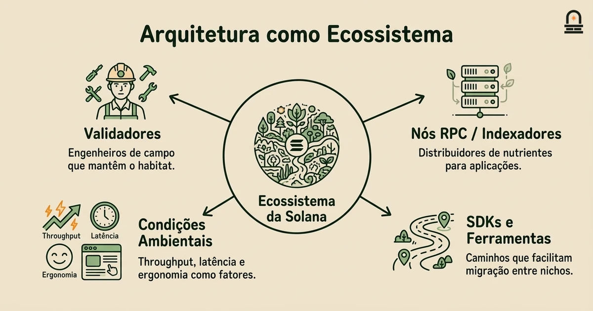
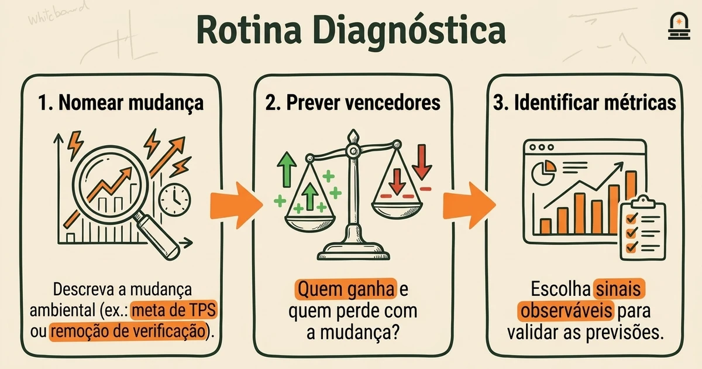
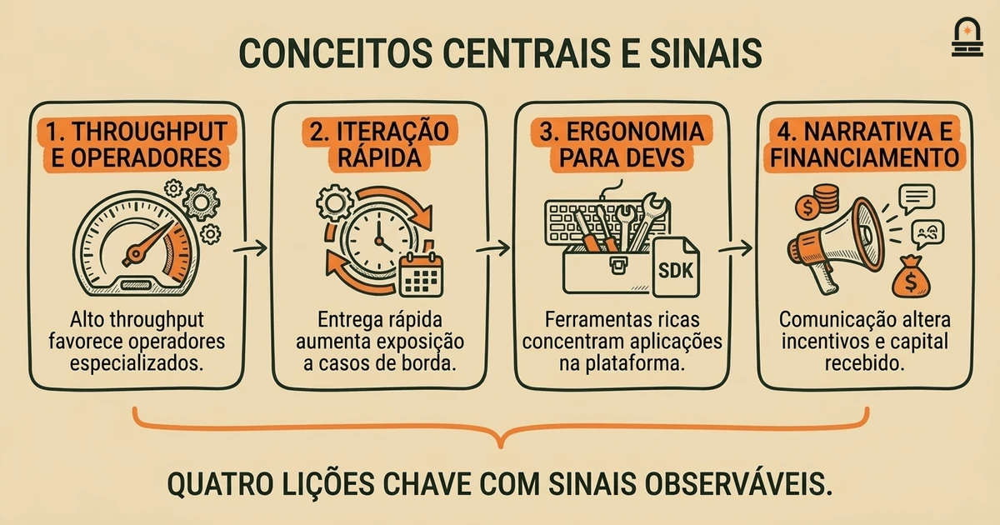
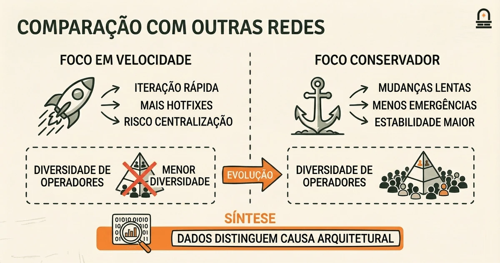

### Ouça também em áudio

[Ouvir este episódio no Spotify](https://open.spotify.com/episode/7MAbB9AG94PwlRNW3dXCBl)

---

**Objetivo:** Refletir sobre as principais lições da história inicial da Solana e identificar temas que orientem o estudo futuro de redes blockchain.

**Por que agora:** Concluir com reflexão consolida o aprendizado e prepara o aluno para comparar com outras redes.

**Conceitos:** Temas recorrentes do desenvolvimento inicial; Trade-offs que moldaram decisões estratégicas; Como a história inicial informa o comportamento posterior da rede; Sinais a observar no progresso futuro da rede; Formas de avaliar criticamente narrativas históricas

**Tempo de leitura:** 20 min

---

## Recapitulação & Introdução

A leitura crítica aguçou sua habilidade de identificar suposições dos autores e trade-offs implícitos dentro do whitepaper da Solana e das notas técnicas subsequentes, e você praticou anotar afirmações para que elas se conectem a questões de projeto testáveis. Essa habilidade específica — ligar uma afirmação à escolha de engenharia subjacente — é a ponte da crítica para a síntese que você usará nesta lição.

Agora mudamos de dissecar afirmações individuais para dar um passo atrás e perguntar o que a história inicial da Solana ensina como um todo. Você usará as afirmações anotadas e a linha do tempo de marcos que compilou anteriormente para identificar temas recorrentes, traduzir esses temas em sinais práticos a serem monitorados e formar modelos mentais simples que ajudam a comparar o arco de desenvolvimento da Solana com o de outras redes. Essa síntese é o próximo passo lógico porque entender mecânicas isoladas é incompleto até que você consiga conectá-las a padrões de tomada de decisão e resultados ao longo do tempo.

Ao final desta lição você será capaz de nomear os principais temas recorrentes da história inicial da Solana, explicar os trade-offs que moldaram escolhas estratégicas iniciais e aplicar um checklist curto para avaliar criticamente narrativas históricas. Essas habilidades o preparam para comparar comportamentos em nível de rede entre blockchains e para seguir ao próximo módulo sobre a rede e as transações do Bitcoin com uma lente mais clara de causa e efeito.

## Objetivos de Aprendizagem

Ao finalizar esta lição você será capaz de realizar as seguintes tarefas concretas:

- **Identificar** pelo menos três temas recorrentes da história inicial da Solana e vincular cada um a uma decisão concreta de design ou operação.
- **Explicar** os principais trade-offs (throughput vs. resiliência, vetores de centralização vs. ergonomia para desenvolvedores) que influenciaram escolhas iniciais do roadmap.
- **Aplicar** um checklist curto que ajuda a distinguir narrativa persuasiva de história respaldada por evidências ao ler postmortems ou blogs de equipes.
- **Reconhecer** os sinais específicos — métricas, cadência de upgrades, telemetria — que indicam se uma rede está caminhando para operação sustentável ou para estresse repetido.

Esses objetivos são testáveis: você deverá ser capaz de listar temas com evidências de suporte, mapear trade-offs para decisões e usar o checklist para anotar uma alegação histórica das leituras do módulo.

## Modelo Mental: Arquitetura como Ecossistema

O Modelo Mental: Use o modelo mental "arquitetura como ecossistema" para raciocinar sobre a história inicial da Solana. Nesse modelo você trata componentes do protocolo, operadores de validadores, ferramentas e equipes de aplicação como espécies em um ecossistema. Escolhas arquiteturais são condições ambientais: maior throughput é como alimento abundante porém volátil, consenso de menor latência é como uma correnteza rápida, e ferramentas amigáveis aos desenvolvedores são como abrigos ricos. O objetivo do modelo é tornar os trade-offs tangíveis: um ambiente otimizado para crescimento rápido favorece espécies que se reproduzem rapidamente, mas pode subapoiar espécies resilientes e de crescimento lento.

Na prática, aplique o modelo mapeando elementos concretos para papéis no ecossistema: validadores são os engenheiros de campo que mantêm o habitat, nós RPC e indexadores são distribuidores de nutrientes, e SDKs de cliente são os caminhos que as espécies usam para migrar entre nichos. Quando uma escolha de projeto aumenta o throughput à custa de complexidade, imagine a correnteza acelerando: algumas espécies (validadores de alto desempenho) podem prosperar, mas muitas (operadores casuais) podem ter dificuldade para permanecer conectadas. Isso ajuda a prever efeitos de segunda ordem, como centralização de operadores ou concentração da infraestrutura de nós completos entre provedores especializados.

Para operacionalizar o modelo mental, siga uma rotina diagnóstica curta ao ler um evento histórico ou mudança de design: primeiro, nomeie a mudança ambiental (por exemplo, meta de TPS mais alta, remoção de uma verificação de segurança). Segundo, preveja quais espécies ganham vantagem e quais perdem terreno. Terceiro, identifique métricas observáveis que confirmariam sua previsão dentro de meses (contagem de validadores, distribuições de latência RPC, proporção do stake operada por poucos provedores). Essa rotina transforma metáfora em hipóteses testáveis.

Aplicar o modelo a uma mudança inicial concreta da Solana clarifica por que os resultados ocorreram como ocorreram. Por exemplo, quando o projeto priorizou expansão horizontal do processamento de blocos e paralelização agressiva, o ambiente favoreceu implementações de validadores especializadas e operadores de nuvem com margens elevadas. O modelo sugere consequências observáveis: produção de blocos mais rápida em condições ideais, um conjunto mais restrito de implementações de validadores em produção e maior dependência de ferramentas sofisticadas dos operadores. Esses são precisamente os padrões que narrativas posteriores atribuem a escolhas iniciais de design; nosso trabalho é ligar a narrativa a sinais mensuráveis ao invés de aceitá-la sem questionamento.

Finalmente, use o modelo para avaliar ações corretivas. Se o ecossistema mostrar sinais de fragilidade, intervenções podem ser lançadas como ajustes ambientais: adicione redundância (introduza espécies mais lentas, porém mais numerosas), simplifique o habitat (reduza a complexidade para operadores) ou melhore a distribuição de nutrientes (melhor descentralização dos RPCs). O modelo mantém o foco nos mecanismos — o que altera o ambiente, como as espécies respondem e quais métricas capturam o resultado — para que você evite explicações puramente retóricas sobre "comunidade" ou "visão". Esse é o tipo de pensamento disciplinado que você aplicará ao comparar o arco da Solana com outros protocolos.

## Conceitos Centrais e Sinais Práticos

Existem alguns conceitos centrais que se repetem na história inicial da Solana; cada um vem com sinais práticos que você pode monitorar. Trate o conceito como a lição em alto nível, o mecanismo como a cadeia de ações que produziu os resultados, e o sinal como o que você deve observar para testar se a lição ainda se aplica.

Conceito 1: Design priorizando throughput molda a ecologia de operadores. Mecanismo: escolhas de engenharia que priorizam alto throughput frequentemente adicionam complexidade de implementação e envelopes de desempenho mais restritos para validadores. Sinal: diversidade de validadores, porcentagem do stake controlada por provedores especializados e frequência de nós saindo sob estresse.

Conceito 2: Iteração rápida acelera a entrega de funcionalidades e a exposição a casos de borda. Mecanismo: ciclos curtos de release e rollout agressivo de funcionalidades expõem a rede ao tráfego do mundo real rapidamente, trazendo à tona bugs sutis. Sinal: cadência de patches emergenciais, número de relatórios de incidentes pós-release e razão entre upgrades planejados e hotfixes não planejados.

Conceito 3: Ferramentas e ergonomia para desenvolvedores impulsionam a concentração de aplicações. Mecanismo: SDKs ricos e exemplos de primeira classe reduzem o custo de integração, o que incentiva muitas equipes a construir em uma única plataforma. Sinal: distribuição da atividade de aplicações entre projetos, concentração de volumes de transação e padrões de crescimento em ferramentas do ecossistema.

Conceito 4: Enquadramento narrativo molda percepção externa e financiamento. Mecanismo: como equipes comunicam trade-offs afeta o comportamento de parceiros e investidores, o que por sua vez altera incentivos para a evolução do protocolo. Sinal: mudanças na mensagem sobre descentralização, deslocamentos observados em governança ou prioridades de roadmap e ciclos de financiamento vinculados a novos compromissos arquiteturais.

Use a tabela abaixo como referência rápida para esses conceitos centrais e sinais.

| Conceito Central | Mecanismo (Como) | Sinal Observável (O que Observar) |
| --- | --- | --- |
| Design priorizando throughput | Validadores complexos, envelope de desempenho mais restrito | Diversidade de validadores, concentração de stake, churn de nós sob estresse |
| Iteração Rápida | Ciclos curtos de release, rollout agressivo | Patches emergenciais, taxa de incidentes, frequência de hotfixes |
| Ergonomia para Desenvolvedores | SDKs, ferramentas, apps de exemplo | Concentração de apps, métricas de adoção de SDKs, padrões de requisições RPC |
| Enquadramento Narrativo | Mensagens públicas, ênfase no roadmap | Mudanças de governança, compromissos de parceiros, cronogramas de financiamento |

Por que isso importa na prática: você usará esses sinais para priorizar monitoramento e formar comparações baseadas em evidências. Por exemplo, ao avaliar se uma queda observada reflete um bug isolado ou uma fragilidade sistêmica, verifique a cadência de patches emergenciais e o churn de validadores: um único bug com um patch rápido e isolado aponta para qualidade de implementação, enquanto quedas repetidas com causas raiz similares e centralização crescente apontam para estresse arquitetural. Essa distinção muda como você investiga mais a fundo e quais correções considera plausíveis.

## Comparação: O que as Lições Iniciais da Solana Sugerem Sobre Outras Redes

Principais Diferenças: Comparar as lições iniciais da Solana com histórias de outras redes ajuda a separar quais resultados são específicos ao protocolo e quais são dinâmicas genéricas de blockchains emergentes. Use a comparação para afiar o checklist que você usará ao ler outros projetos: o comportamento observado é consequência de uma escolha arquitetural única, ou é um caminho comum para qualquer projeto que priorize X? Mantenha a avaliação neutra e focada em evidências.

Áreas de foco para comparação incluem cadência de upgrades, diversidade de operadores e concentração do ecossistema. A cadência de upgrades importa porque a iteração rápida produz entrega de funcionalidades mais veloz, mas aumenta a exposição a interações não testadas. Muitas redes iniciais que priorizaram velocidade seguiram padrões previsíveis: aceleração de funcionalidades no curto prazo, seguida por períodos de estabilização e depois refatorações. Redes que privilegiam upgrades conservadores tendem a ter inovação mais lenta, mas menos patches emergenciais. Comparar esses resultados ajuda a prever os trade-offs que você pode ver em desenvolvimentos relacionados ao Bitcoin, onde a mudança é intencionalmente lenta e conservadora.

Diversidade de operadores é outro eixo comparativo. Ao comparar o panorama inicial de operadores da Solana com o de outras chains, observe o caminho desde os primeiros adotantes (frequentemente operadores grandes e tecnicamente sofisticados) até uma base de operadores mais distribuída. Redes com envelopes de desempenho apertados ou requisitos bespoke de hardware/software dificultam a participação de operadores casuais, aumentando o risco de centralização. Em contraste, redes que favorecem implementações mais simples e tolerantes tendem a manter uma base de operadores mais ampla. Essa comparação fornece uma lente concreta para ler afirmações sobre "descentralização": solicite números de distribuição de stake, diversidade de clientes e proporção de nós em hardware commodity versus setups especializados.

Concentração de aplicações é o terceiro eixo. Se os SDKs e as ferramentas de uma rede forem excepcionalmente fáceis, você pode ver crescimento rápido em algumas aplicações dominantes. Esse padrão não é exclusivo de uma chain; é uma dinâmica típica de ecossistema quando a ergonomia para desenvolvedores é forte, mas a economia da rede favorece escala. Ao comparar histórias, separe concentração impulsionada por ferramentas de concentração econômica que incentiva aplicações únicas e grandes. A diferença importa porque concentração por ferramentas pode ser abordada por medidas de nível de ecossistema, enquanto concentração econômica requer intervenções a nível de protocolo ou tokenômicas.

Para avaliar narrativas históricas criticamente, adote este checklist curto ao ler um postmortem ou retrospectiva: (1) Identifique as escolhas arquiteturais específicas feitas e a justificativa declarada; (2) Peça ou localize pelo menos dois sinais mensuráveis independentes que sustentem a narrativa (logs, telemetria, distribuição de stake); (3) Verifique se ações corretivas tratam mecanismos ou sintomas; (4) Considere explicações alternativas que se encaixem nos mesmos sinais. Usar esse checklist converte prosa persuasiva em investigação empírica e evita aceitar uma única história causal sem evidências corroborantes.

Aplicar esse enquadramento comparativo prepara você para o próximo módulo sobre o Bitcoin. A história do Bitcoin enfatiza mudança conservadora e incentivos econômicos robustos; compará-la com a abordagem inicial da Solana ilustrará como prioridades diferentes produzem ecologias de operadores, padrões de upgrades e paisagens de aplicações distintas. Esse contraste é útil porque ancora sua intuição sobre como prioridades de design mapeiam para comportamento de rede no longo prazo.

## Conclusão & Principais Lições

Agora você deve ser capaz de traduzir decisões técnicas isoladas em padrões recorrentes do ecossistema: quando um protocolo prioriza throughput e iteração rápida, espere operadores especializados, aplicações concentradas e uma maior taxa de correções emergenciais até a estabilização. Esse mapeamento é uma regra prática que ajuda a avaliar afirmações sobre robustez versus desempenho.

Dois aprendizados concretos para levar adiante: primeiro, sempre pareie afirmações narrativas com pelo menos dois sinais observáveis antes de aceitar explicações causais; segundo, considere escolhas de design como mudanças ambientais no modelo arquitetura-como-ecossistema para prever efeitos de segunda ordem como centralização ou concentração de ferramentas. Esses aprendizados dão a você uma forma disciplinada de interrogar tanto relatos históricos quanto relatórios em tempo real.

Também deixamos com você um heurístico simples para leitura futura: classifique cada evento histórico importante pelo seu mecanismo primário (complexidade de código, cadência de rollout, incentivo econômico) e então pergunte quais métricas mudariam se aquele mecanismo realmente tivesse dirigido o resultado. Esse hábito move você da aceitação retórica para o julgamento empírico e prepara um contraste eficaz com a história da rede do Bitcoin na próxima lição.

## Recapitulação Rápida

- Identifique temas recorrentes: design priorizando throughput, iteração rápida, concentração impulsionada por ferramentas e enquadramento narrativo.
- Use o modelo arquitetura-como-ecossistema para mapear escolhas à ecologia de operadores e aplicações.
- Observe sinais concretos: diversidade de validadores, cadência de patches emergenciais, concentração de apps e mensagens de governança.
- Aplique um checklist curto para avaliar narrativas retrospectivas contra evidências mensuráveis.

## Próximos Passos

Reflita sobre um ou dois itens das suas leituras anotadas: escolha uma afirmação sobre uma queda ou um upgrade e aplique o checklist da seção de comparação. Identifique os mecanismos alegados, liste pelo menos dois sinais observáveis que sustentariam ou contradiriam a alegação e anote quais dados adicionais você pediria para ficar confiante.

Após esse exercício, prepare-se para ler a próxima lição sobre a rede e as transações do Bitcoin com uma mentalidade comparativa. Recomendamos coletar sinais equivalentes para o Bitcoin quando aplicável — cadência de upgrades, diversidade de clientes e participação de operadores — para que você possa contrastar como prioridades diferentes moldam resultados práticos de rede.

---

## Glossário

### Compromisso implícito

Uma escolha de design não explicitamente declarada, mas implícita pela arquitetura; revela quais benefícios são privilegiados em detrimento de outros e afeta o comportamento de longo prazo.

### Diversidade de validadores

A variedade de implementações de software independentes e operadores que executam papéis de consenso; maior diversidade reduz o risco de dependência em uma única implementação.

### Sinal de telemetria

Uma métrica mensurável — como churn de nós, latência RPC ou frequência de patches emergenciais — que fornece evidência sobre o comportamento da rede.

### Ecologia de operadores

A distribuição e as capacidades das partes que executam nós e infraestrutura, incluindo seus incentivos, concentração e habilidade técnica.

### Enquadramento narrativo

Como uma equipe ou projeto descreve eventos e trade-offs publicamente; o enquadramento molda a percepção e pode influenciar financiamento e comportamento de parceiros.

### Dívida técnica (no contexto de protocolos)

Atalhos acumulados ou interdependências complexas no código ou design do protocolo que aumentam o ônus de manutenção e o risco durante upgrades.

### Cadência de atualizações

A frequência e velocidade das mudanças no protocolo; cadência rápida aumenta a exposição a interações, enquanto cadência lenta favorece estabilidade.

---

## Referências & Leitura Complementar

- [Solana: Uma nova arquitetura para blockchains de alto desempenho (whitepaper)](https://solana.com/solana-whitepaper.pdf) — *Solana Labs* (Fonte Primária)
- [Documentação Solana: Arquitetura do Cluster e Operação de Validadores](https://docs.anza.xyz/clusters) — *Documentação Solana* (Documentação Técnica)
- [Boas Práticas de Monitoramento de Validadores](https://docs.anza.xyz/operations/best-practices/monitoring) — *Agave / Anza Docs* (Operações)
- [Bitcoin: Um Sistema de Dinheiro Eletrônico Peer-to-Peer](https://bitcoin.org/bitcoin.pdf) — *Satoshi Nakamoto* (Contexto Comparativo)
