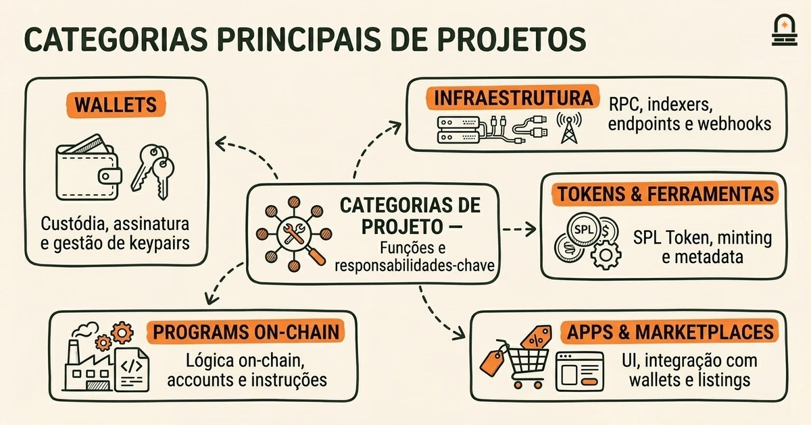
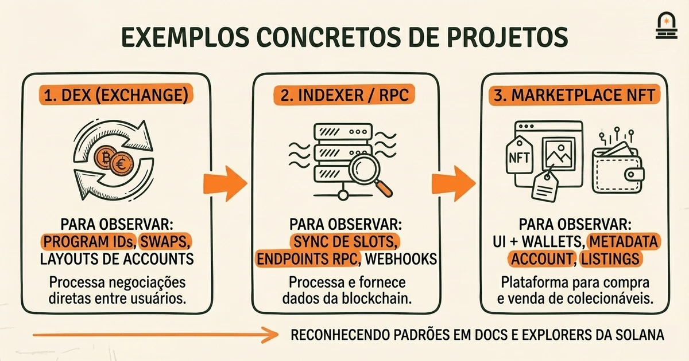
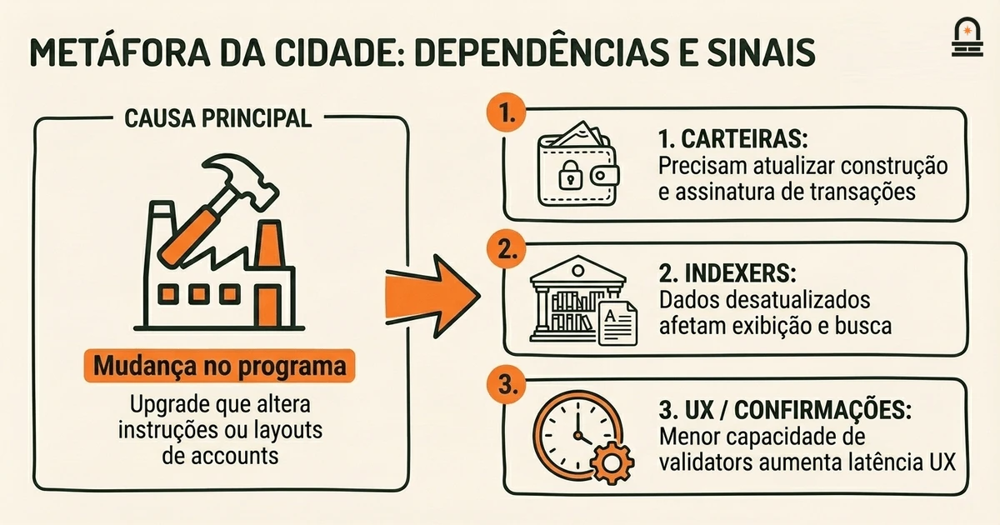

### Ouça também em áudio

[Ouvir este episódio no Spotify](https://open.spotify.com/episode/3rkcMBVVqYMyO0OPBs9wXp)

---

**Objetivo:** Categorizar os principais tipos de projetos na visão geral do ecossistema Solana e descrever como a terminologia se mapeia para esses tipos de projeto.

**Por que agora:** Com o vocabulário definido, os aprendizes podem classificar projetos e ver como os termos operam em iniciativas reais.

**Conceitos:** Principais categorias de projetos na visão geral do ecossistema Solana; Como a terminologia Solana se mapeia para diferentes tipos de projetos; Indicadores de participação ativa de desenvolvedores e saúde do projeto; Onde encontrar recursos autoritativos dentro do ecossistema Solana; Interdependências entre projetos e serviços da plataforma

**Tempo de leitura:** 30 min

---

## Recapitulação & Introdução

Validators na Solana processam e confirmam transações, programs são código executável on-chain, e accounts armazenam estado e tokens — você aprendeu como essas peças se encaixam na lição anterior. Lembre-se especificamente que um programa não armazena dados mutáveis de usuários por si só; em vez disso, ele opera sobre accounts passadas em uma transação, e que transações são a unidade de mudança com a qual os validators concordam. Essa separação concreta entre código (programs), dados (accounts) e execução (transações) é o vocabulário prático que você usará novamente nesta lição.

Com esse vocabulário em mãos, você agora pode classificar os tipos de projetos que povoam o ecossistema Solana. Passamos de definições para mapeamento: você agrupará projetos em categorias como wallets, infraestrutura, primitivas DeFi, apps para consumidores e tooling, e então conectará cada categoria à terminologia que você já conhece. Essa progressão importa porque saber o que é um "program" ou uma "account" só se torna útil quando você consegue reconhecer quais projetos operam como programs, quais gerenciam principalmente accounts e quais coordenam muitos programs pela rede.

No segundo parágrafo começamos o objetivo central: você verá as principais categorias de projetos na Solana, aprenderá os sinais identificadores de projetos saudáveis e descobrirá onde vivem os recursos autoritativos do ecossistema. Enfatizaremos como a terminologia mapeia para a função: por exemplo, quando você lê a documentação de um projeto e ela fala sobre "program ID" e "payer account", você reconhecerá se está olhando para uma tarefa de integração de wallet, para o deploy de um program, ou para uma responsabilidade de indexer/infraestrutura. Esse mapeamento — do termo ao papel prático — é a ponte que esta lição fornece entre vocabulário e aplicação.

## Objetivos de Aprendizagem

Após concluir esta lição você será capaz de:

- **Listar e definir** as principais categorias de projetos encontradas no ecossistema Solana e descrever a função primária de cada categoria.
- **Mapear a terminologia Solana** (programs, accounts, validators, RPC nodes, SPL tokens) para responsabilidades concretas de projeto e escolhas de design.
- **Identificar indicadores** de participação ativa de desenvolvedores e saúde do projeto, como atividade no repositório, padrões de upgrade de programas e sinais oficiais em roadmaps.
- **Localizar recursos autoritativos** para verificar detalhes de projetos dentro do ecossistema Solana, incluindo docs, registros de programs e páginas de explorers.
- **Explicar interdependências básicas** entre categorias (por exemplo, como wallets, indexers e on-chain programs interagem) para que você possa raciocinar sobre pontos de integração e modos de falha.

Esses objetivos são concretos e testáveis: você praticará classificando alguns projetos representativos e justificando sua classificação usando a terminologia e os indicadores acima.

## Conceitos Centrais: Principais Categorias de Projetos e Como os Termos se Mapeiam aos Papéis

Comece tratando o ecossistema Solana como uma pilha em camadas. No nível mais baixo está a própria rede: validators, blocos e estado do ledger. Acima disso estão serviços de infraestrutura — nós RPC, indexers e telemetria dos validators — cuja função é expor dados do ledger e aceitar transações. Sobre a infraestrutura ficam os on-chain programs (smart contracts) que implementam a lógica de aplicação. Clientes off-chain — wallets, apps front-end e serviços de backend — constroem e assinam transações e apresentam UX em torno das interações com programs. Quando você mapeia a terminologia para essas camadas, o mapeamento é concreto: um `program` implementa lógica que altera `accounts`, um nó RPC expõe endpoints para enviar transações e consultar estado de accounts, e uma wallet gerencia keypairs e paga taxas de transação.

Use a tabela a seguir como referência rápida para mapear termos comuns da Solana para categorias de projeto e suas responsabilidades. A tabela não é exaustiva, mas captura os emparelhamentos mais comuns que você encontrará.

| Project Category | Primary Responsibilities | Key Solana Terms You Expect to See |
| --- | --- | --- |
| Wallets / Key Management | Custódia de keypairs, assinatura de transações, delegação de taxas, criação de accounts | `payer`, `signature`, `account`, `associated token account` |
| Infrastructure (RPC, Indexers) | Expor dados do ledger, arquivar blocos, indexar eventos, entregar webhooks | RPC endpoint, slot, blockhash, program logs |
| On-chain Programs (DeFi, NFTs) | Codificar e executar lógica com estado; aceitar accounts como inputs | `program ID`, instruction, account meta, CPI (cross-program invocation) |
| Token Standards & Asset Tools | Definir comportamento de tokens, minting, metadata, marketplaces | SPL Token, metadata account, mint, token program |
| Consumer Apps & Marketplaces | UI/UX, roteamento de ordens, integração com wallets, exibição de dados on-chain | Transactions, confirmations, explorers, program interaction |

Ao avaliar um projeto, foque em como ele usa os termos centrais. Por exemplo, um projeto que documenta múltiplos `program ID`s provavelmente é uma suíte de on-chain programs (infraestrutura ou protocolo DeFi) em vez de um front-end puro. Projetos que enfatizam endpoints de indexer, webhooks ou logs arquivados são provedores de infraestrutura. Projetos que fornecem SDKs e exemplos centrados na construção e assinatura de transações são ou wallets ou clientes de aplicação. Esses são heurísticos práticos: a terminologia que um projeto enfatiza revela seu papel arquitetural.

Indicadores de participação ativa de desenvolvedores estão igualmente ligados a esses papéis. Para programs, procure commits frequentes no repositório do program, scripts de deploy claros referenciando program IDs e evidências on-chain de atividade de upgrade ou interações com o program. Para projetos de infraestrutura, verifique dashboards de uptime, relatórios de latência de RPC e status de sincronização de indexer. Para wallets e apps de consumidor, priorize notas de lançamento que mostrem compatibilidade com a runtime atual e vetores de teste explícitos para construção de transações. Usaremos esses indicadores específicos por categoria no exemplo prático que segue.

## Como Isso Aparece no Mundo Real: Exemplos Concretos de Projetos

Você internalizará melhor as categorias caminhando por três projetos concretos e vendo como terminologia e indicadores aparecem na prática. Para cada exemplo abaixo, observe quais termos são enfatizados na docs, onde o estado vive e de quais serviços externos eles dependem. Esses exemplos mostram como classificar projetos de forma rápida e defensável.

Exemplo 1 — Uma exchange descentralizada (DEX) construída na Solana: uma DEX centrará em um ou mais `program ID`s que codificam matching de ordens, pools de liquidez e swaps. A documentação incluirá layouts de instrução, esquemas de accounts e exemplos mostrando como um usuário cria e financia token accounts (SPL tokens). Um repositório de DEX frequentemente expõe testes que criam accounts, cunham tokens e emitem instruções de swap. Indicadores de saúde do desenvolvedor incluem cobertura de testes ativa, notas de upgrade do program e volume de transações on-chain visível através de explorers. Você pode verificar atividade do program buscando o program ID em um explorer e observando logs de instrução e atualizações de accounts.

Exemplo 2 — Um indexer ou provedor RPC: esse projeto enfatiza sincronização de slots, métricas de throughput de RPC e armazenamento histórico de blocos. Termos que você verá são endpoints RPC, limites de taxa, subscriptions a eventos e garantias de entrega de webhooks. A documentação incluirá referência de API para buscar assinaturas de transações, parsear program logs e indexar mudanças de accounts. Projetos de infraestrutura saudáveis publicam dashboards de uptime e latência e mantêm SDKs cliente com exemplos de consultas para program logs e estados de accounts desserializados.

Exemplo 3 — Um marketplace de NFT e storefront: marketplaces combinam uma UI off-chain, integração com wallets para assinar transações de marketplace e programs on-chain que gerenciam listings e bids. Procure por discussões sobre metadata account (SPL metadata), como royalties são codificados e o fluxo esperado de criação de associated token account, aprovação de instruções do market program e liquidação de transferências. Marketplaces bem feitos incluem exemplos concretos da sequência de transações: create associated token account & approve transfer → call listing instruction with account metas → settle trade instruction. Suas docs devem referenciar explorers para rastreabilidade e mostrar program IDs de exemplo para seus contratos.

Ao longo desses exemplos você usará as mesmas regras de classificação: onde um projeto documenta program IDs e esquemas de accounts, trate-o como um on-chain program ou protocolo; onde a documentação prioriza superfície de API e garantias de sincronização de dados, trate-o como infraestrutura; onde a ênfase está em fluxos de assinatura, chaves de usuário e UX, trate-o como um cliente ou integração de wallet. Esses mapeamentos são práticos: eles permitem decidir onde procurar verificação autoritativa (explorers on-chain para programs, páginas de status para infraestrutura, notes de release e SDKs para wallets e clientes).

## Modelo Mental: A Metáfora da Cidade para Interdependências e Sinais

O Modelo Mental: Use uma metáfora da cidade para raciocinar sobre interdependências. Trate a rede Solana como a infraestrutura da cidade: validators são usinas de energia e hubs de trânsito que mantêm a cidade funcionando; servidores RPC e indexers são os quiosques de informação e bibliotecas da cidade que indexam e retransmitem atualizações; programs on-chain são fábricas e serviços públicos que executam tarefas específicas; wallets e apps de consumidor são as casas e lojas onde as pessoas interagem com os serviços. Esse modelo mental facilita ver como mudanças em uma parte afetam outra.

Quando uma fábrica (um on-chain program) muda seu processo — por exemplo, um upgrade de program que altera o layout de instruções — as lojas (wallets, marketplaces) precisam atualizar como constroem e desserializam transações. Se a biblioteca da cidade (indexer) perder entradas, as lojas mostrarão dados defasados, levando usuários a refazer operações. Se uma usina (cluster de validators) reduzir capacidade, confirmações de transação ficam mais lentas e a UX degrada. Mapear esses papéis esclarece dependências: um marketplace saudável precisa tanto de fábricas estáveis (programs) quanto de bibliotecas responsivas (indexers) e de assinaturas confiáveis nas casas (wallets).

Traduza a metáfora de volta para checagens concretas que você pode executar ao classificar projetos. Para um program, pergunte: o program tem program IDs estáveis, atividade visível on-chain e layouts de accounts documentados? Para um indexer, pergunte: ele fornece queries históricas, webhooks e status de sync publicados? Para uma wallet, pergunte: ela publica exemplos de construção de transações, lida com associated token accounts e explica escolhas de payer de taxa? Essas perguntas se mapeiam aos papéis da cidade e dão diagnósticos claros e testáveis.

Usar a metáfora também ajuda ao avaliar riscos de interdependência. Se um marketplace depende de um único indexer para livros de ordem, isso é análogo a uma loja dependendo de uma única biblioteca para inventário — um ponto único de falha. Se a autoridade de upgrade de um program é centralizada e mal documentada, isso é como uma fábrica com um único gerente não listado: o risco existe, mas é distinto dos riscos a nível de rede. Mantenha a metáfora focada: ela simplifica a arquitetura em stakeholders e dependências para que você possa raciocinar sobre onde verificar fatos e onde esperar trabalho de integração.

Finalmente, o modelo da cidade ajuda a priorizar sinais de saúde de desenvolvedor. Commits frequentes e legíveis no repositório de um program são como construção visível contínua em uma fábrica; dashboards de uptime são como avisos públicos em bibliotecas; releases ativos de SDK são como vitrines de loja indicando compatibilidade com mudanças recentes de programas. Essas analogias dão um checklist rápido para classificar e validar projetos em termos práticos.

## Conclusão & Principais Lições

Agora você deve ser capaz de categorizar projetos Solana em grupos reconhecíveis — wallets, infraestrutura, on-chain programs, tooling de tokens e apps para consumidores — e mapear termos centrais da Solana para as responsabilidades que cada grupo carrega. Lembre-se de três pontos concretos: primeiro, a terminologia revela o papel arquitetural — se um projeto enfatiza `program ID` e esquemas de accounts, é provavelmente um on-chain program; segundo, os sinais de saúde do projeto dependem da categoria — a saúde de um program é melhor verificada on-chain e via program logs, enquanto a saúde da infraestrutura é verificada por dashboards de uptime e latência; terceiro, interdependências importam — wallets, indexers e programs formam uma cadeia onde uma mudança em uma camada normalmente exige atualizações nas outras.

Esses pontos são princípios práticos que você pode reutilizar ao explorar projetos do ecossistema: use program IDs e traces em explorers para validar atividade de protocolos, consulte páginas de status de RPC e indexers para confiabilidade de infraestrutura, e verifique SDKs e exemplos de assinatura para compatibilidade de clientes. Enfatizamos o mapeamento porque sua próxima tarefa é usar esses mapeamentos para encontrar e avaliar recursos; esta lição estabelece a fundação dando as ferramentas de classificação e os sinais que você precisa para avaliar projetos de forma rápida e defensável.

Mantenha a metáfora da cidade em mente como um atalho de raciocínio: ela torna as interdependências visíveis e ajuda você a fazer as perguntas de verificação corretas. Esse modelo mental também facilitará aprender sobre incentivos e conceitos de mineração em módulos posteriores, porque você já entenderá quais papéis capturam stake, acumulam taxas ou dependem de características de throughput e latência.

## Recapitulação Rápida

- Mapeie terminologia para papel: `program` = lógica on-chain; `account` = dados/estado; RPC/indexer = acesso a dados.
- Classifique projetos pelo que eles enfatizam na documentação: program IDs → protocolo; métricas RPC → infraestrutura; fluxos de assinatura → wallets/clients.
- Verifique saúde via sinais específicos por categoria: atividade on-chain para programs, uptime/latência para infraestrutura, SDKs e notas de release para wallets.
- Use a metáfora da cidade: validators=utilities, indexers=bibliotecas, programs=fábricas, wallets=casas.

## Próximos Passos

Seu próximo passo concreto é estudar "Navegando pelos Recursos da Solana e Próximos Passos", onde guiaremos você até os docs oficiais, registros de programs e explorers que permitem verificar as classificações que você aprendeu. Para praticar, prepare-se para classificar três projetos: um on-chain program, um RPC/indexer e uma wallet ou marketplace, usando as checagens e a terminologia desta lição. Na próxima lição mostraremos exatamente onde clicar e quais páginas ler para confirmar program IDs, uptime e logs de transação.

---

## Glossário

### Program ID

Um identificador único on-chain para um programa Solana implantado; você o usa para encontrar instruções do programa, logs e interações de accounts em explorers.

### Conta (account)

Um contêiner de dados on-chain que armazena estado mutável e saldos de tokens; programs operam sobre accounts passadas em instruções.

### Nó RPC

Um endpoint de remote procedure call que aceita transações e fornece dados do ledger; provedores de infraestrutura executam nós RPC para expor APIs.

### SPL Token

O padrão de token da Solana para tokens fungíveis e não-fungíveis; inclui mint, token accounts e o token program que aplica transferências.

### Indexador (indexer)

Um serviço off-chain que processa o histórico do ledger para fornecer streams de eventos consultáveis, históricos de mudanças de accounts e logs de programs para aplicações.

### Associated Token Account

Uma account padronizada para guardar SPL tokens vinculada a um endereço de wallet; muitos apps esperam esse padrão para custódia e transferências de tokens.

---

## Referências & Leitura Complementar

- [Documentação do desenvolvedor Solana: Programs](https://solana.com/docs/core/programs) — *Solana Docs* (Documentação Oficial)
- [Padrão SPL Token (spl-token)](https://www.solana-program.com/docs/token) — *Solana Labs* (Padrões de Token)
- [Solana Explorer: Busca de Programas e Transações](https://explorer.solana.com) — *Solana Explorer* (Exploradores e Ferramentas)
- [Operando um Validador (guias e melhores práticas)](https://docs.anza.xyz/operations) — *Agave / Anza Docs* (Guias de Infraestrutura)
