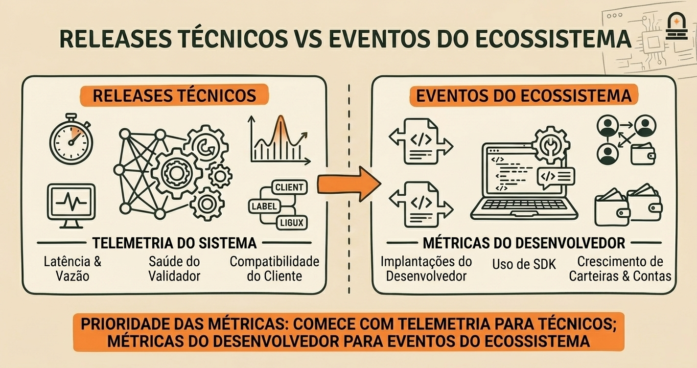

# Marcos e Linha do Tempo de Adoção

O desenvolvimento de uma blockchain pública segue uma sequência lógica de **marcos de engenharia**, **testes adversariais** e **expansão de integrações**.

Nesta lição, você aprenderá a usar um **modelo mental de construção em fases** para mapear o ciclo de vida da Solana, distinguir **releases técnicos** de **eventos do ecossistema** e identificar os **indicadores observáveis de adoção** on-chain e em ferramentas.

---

## 1. O Modelo Mental: Releases como Fases de Construção de uma Ponte

O ciclo de vida de uma rede descentralizada pode ser comparado ao processo de engenharia civil para erguer uma grande ponte:

1. **Fase 1: Fundações e Suportes Básicos**: Implementação das primitivas essenciais descritas no whitepaper (primitiva de tempo verificável, pipeline de transações e estruturas de consenso).
2. **Fase 2: Testes de Carga e Ambientes Adversariais (Testnets)**: Validação dos nós sob estresse com operadores distribuídos geograficamente, forçando falhas de latência e verificando a robustez de bibliotecas e RPCs.
3. **Fase 3: Abertura Pública (Mainnet Beta)**: Configurações de produção consolidadas, parâmetros econômicos habilitados e ambiente liberado para deploy de programas e custódia de valor real.
4. **Fase 4: Integrações e Expansão do Ecossistema**: Suporte maduro a carteiras, indexadores, ferramentas de desenvolvimento (SDKs) e interoperabilidade entre projetos independentes.

---

## 2. Mapeamento de Marcos e Sinais de Adoção Inicial

Ao examinar o histórico de evolução, cada marco técnico exercita um mecanismo específico e gera sinais mensuráveis:

| Marco | Mecanismo Primário Exercitado | Sinais de Adoção Inicial Observáveis |
| :--- | :--- | :--- |
| **Testnet Pública Inicial** | Consenso entre nós heterogêneos e validação da ordenação temporal | Número de validadores ingressando e remetentes distintos de transações |
| **Hackathons e Testes de Estresse** | Robustez das chamadas RPC, estabilidade de SDKs e durabilidade de ferramentas | Inscrições de projetos, envio de *Pull Requests* em repositórios de clientes e picos de volume |
| **Mainnet Beta** | Operação em ambiente de produção contínua com economia real | Deploys regulares de novos programas e tráfego estável fora de testes |
| **Integrações de Ecossistema** | Interoperabilidade entre contratos, suporte a carteiras e exploradores | Diversidade de tipos de transação, surgimento de ferramentas comunitárias e atividade técnica |

---

## 3. Comparação: Releases Técnicos vs Eventos do Ecossistema

Para avaliar criticamente notícias e comunicados da rede, é essencial classificar os marcos em duas categorias:

### Releases Técnicos
- **O que são**: Atualizações no código do protocolo, ajustes de parâmetros de consenso ou melhorias no runtime dos validadores.
- **Métricas para inspecionar**: **Telemetria de sistema** — tempos de bloco, latência de confirmação, utilização de memória/CPU nos validadores e taxas de erro em nós RPC.
- **Pergunta analítica**: *A estabilidade e a capacidade de processamento dos nós melhoraram sem aumentar a taxa de falha?*

### Eventos do Ecossistema
- **O que são**: Lançamentos de novas carteiras, bibliotecas para desenvolvedores, ferramentas de indexação ou plataformas de aplicação.
- **Métricas para inspecionar**: **Atividade de desenvolvedores e usuários** — novos deploys de programas, criação de contas ativas, downloads de SDKs e discussões técnicas em repositórios.
- **Pergunta analítica**: *Os novos construtores continuam ativos e mantendo seus programas após o evento inicial?*

---

## 4. Principais Lições

1. **Marcos são transições funcionais**: Cada etapa da linha do tempo representa uma hipótese de engenharia testada e aprovada, e não apenas uma data de calendário.
2. **Use a métrica certa para o tipo de marco**: Releases de protocolo são medidos por telemetria de validadores; crescimento de ecossistema é medido por atividade sustentada de desenvolvedores.
3. **Análise crítica supera marketing**: Mapear *mecanismo alterado → métrica observada → prioridade seguinte* é o método confiável para avaliar o progresso real de qualquer ecossistema blockchain.
