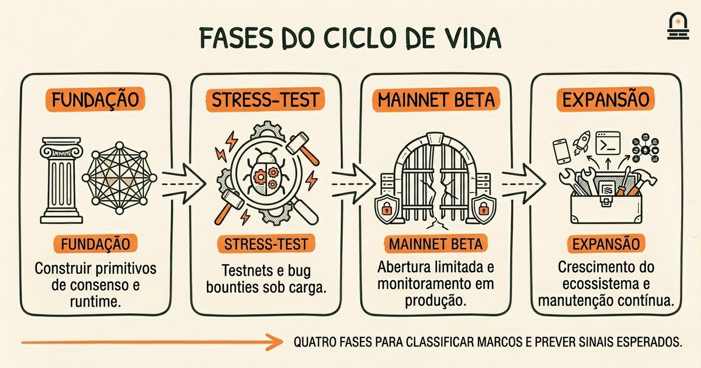
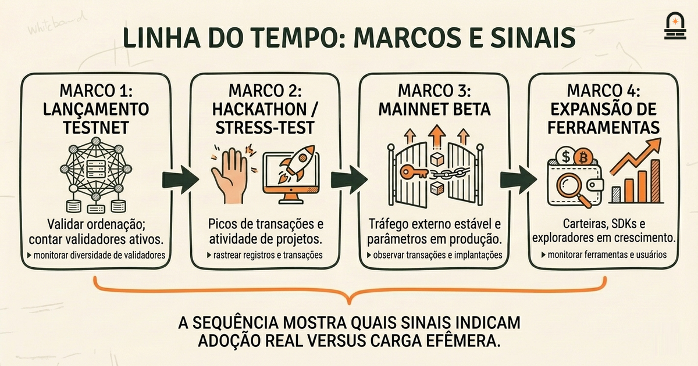
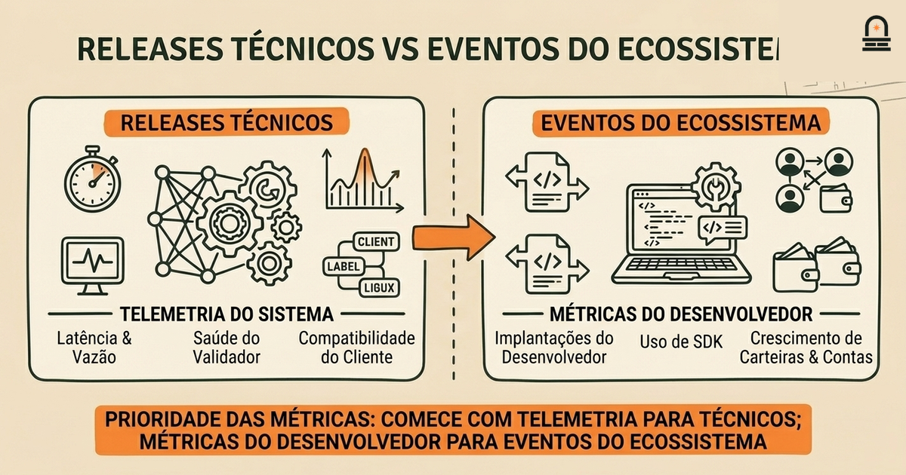

### Ouça também em áudio

[Ouvir este episódio no Spotify](https://open.spotify.com/episode/2EYDgXUPTSlatnc50iMwmK)

---

> **Objetivo:** Mapear os principais marcos no desenvolvimento inicial da Solana e entender padrões de adoção inicial e crescimento de projetos.  
> **Por que agora:** Uma linha do tempo liga as metas dos fundadores e os problemas iniciais a marcos observáveis no crescimento do projeto.  
> **Conceitos:**   
> **Tempo de leitura:** 30 min

---

## Recapitulação & Introdução

<strong>Por que agora:</strong> Uma linha do tempo liga as metas dos fundadores e os problemas iniciais a marcos observáveis no crescimento do projeto.
Principais lançamentos públicos Progressão de testnet para mainnet Colaborações e integrações notáveis Indicadores de adoção inicial e atividade de rede Como marcos influenciaram prioridades subsequentes

Fundação Conceitual
30 min de leitura

**Objetivo:** Mapear os principais marcos no desenvolvimento inicial da Solana e entender padrões de adoção inicial e crescimento de projetos.

**Por que agora:** Uma linha do tempo liga as metas dos fundadores e os problemas iniciais a marcos observáveis no crescimento do projeto.

**Conceitos:** Lançamentos públicos e releases importantes; Progressão de testnet para mainnet; Colaborações e integrações de projetos notáveis; Indicadores de adoção inicial e atividade de rede; Como marcos influenciaram prioridades subsequentes.

*Fundação Conceitual · 30 min de leitura*

Uma cadeia de registros com carimbo de tempo impõe uma história ordenada: cada registro referencia um estado anterior com ligação criptográfica, de modo que reordenamentos ou inserções tornam-se detectáveis. Você lembra da lição anterior que o whitepaper da Solana dá forte ênfase a primitivas orientadas ao tempo e ordenação para alcançar vazão e finalização, e que estruturas no estilo Merkle foram propostas para provas compactas de inclusão. Esses mecanismos concretos são as ferramentas básicas que são exercitadas e validadas pelos marcos de produto — cada release de rede, testnet e integração mostra uma forma de o projeto passar da teoria para um comportamento mensurável.

Mapear marcos é o próximo passo natural após examinar mecanismos porque os marcos revelam onde escolhas de design foram implementadas, testadas sob estresse e iteradas. Na prática, um marco não é apenas uma data; é uma mudança técnica, um lançamento coordenado ou uma parceria importante que altera o que você pode medir na rede: taxa de transações, contagem de validadores, disponibilidade de ferramentas e onboarding de desenvolvedores. Nesta lição mapeamos os principais lançamentos públicos, a progressão de testnet para mainnet, integrações notáveis e os sinais observáveis que indicam adoção inicial. Você conectará esses marcos de volta aos mecanismos que estudou anteriormente para ver como uma primitiva de ordenação com carimbo de tempo ou um ajuste de consenso aparece como uma mudança mensurável na atividade da rede.

---

## Objetivos de Aprendizagem

Ao final desta lição, você será capaz de:
<ul class="lesson-objectives-checklist"><li class="lesson-objective-item">Descrever a sequência dos principais marcos públicos iniciais da Solana, incluindo testnets importantes e etapas de mainnet, e explicar por que cada um foi relevante tecnicamente.</li><li class="lesson-objective-item">Identificar três indicadores concretos de adoção (por exemplo: endereços ativos, picos de volume de transações e integrações de projetos) e relacioná-los a marcos específicos.</li><li class="lesson-objective-item">Analisar como lançamentos técnicos iniciais mudaram prioridades do projeto (por exemplo, de vazão bruta para ferramentas ou descentralização de validadores).</li><li class="lesson-objective-item">Usar um modelo mental simples de linha do tempo para avaliar se um futuro marco provavelmente afetará a adoção por desenvolvedores ou a segurança da rede.</li></ul>
Cada objetivo está formulado para ser testável: você deve ser capaz de apontar para um marco e explicar qual mecanismo ele exerceu, quais métricas mudaram e qual prioridade estratégica essa mudança sinalizou.

---

## Um Modelo Mental: Releases como Fases de Construção

<strong class="lesson-structural-label">O Modelo Mental:</strong> Pense no ciclo de vida da rede como construir uma grande ponte em fases. Na primeira fase você assenta suportes fundamentais (primitivas de consenso e runtime core). Esses suportes são análogos aos mecanismos do whitepaper: ordenação com carimbo de tempo, pipeline de processamento de transações e estruturas de prova compacta. Na segunda fase você testa os suportes sob carga (testnets e bug bounties). Esses testes revelam fraquezas em tooling, onboarding de validadores e padrões padrão de parâmetros de rede. Na terceira fase você abre a ponte para tráfego limitado (mainnet beta), monitora padrões de tráfego e adiciona sinalização e faixas (ferramentas para desenvolvedores, carteiras, exploradores de blocos). Finalmente, a quarta fase traz tráfego comercial e manutenção contínua (projetos do ecossistema, otimizações de desempenho e ajustes de governança). Esse modelo em fases ajuda você a avaliar marcos por papel: fundamentais, de stress-test, abertura pública ou expansão do ecossistema.

Use esse modelo como filtro quando olhar qualquer marco. Pergunte: a que fase de construção pertence este marco? Um release rotulado como “mainnet beta” raramente é uma linha de chegada; é um convite para deslocar o monitoramento da correção para a escala. Um SDK ou integração de carteira importante não é necessariamente uma mudança no livro-razão, mas pode ser a sinalização crítica que permite o fluxo de tráfego. Ao mapear marcos contra as fases de construção, você ganha uma visão mais clara de causalidade: alguns marcos são habilitadores (correções de baixo nível e ganhos de desempenho), outros são catalisadores (parcerias ou tooling que de repente tornam a cadeia utilizável por projetos reais).

Concretamente, esse modelo mental ajuda você a raciocinar sobre trade-offs. Um marco da fase de fundação que aumenta a vazão bruta pode depois exigir mudanças de governança ou política de staking para preservar a descentralização. Um marco de stress-test que revela gargalos tipicamente deslocará prioridades para profiling e ergonomia de desenvolvedor. Mantenha o modelo ativo: sempre que inspecionar um marco histórico, anote-o com a fase, o mecanismo primário exercitado e o sinal de adoção imediato que se seguiu. Esse hábito de anotação curta treina você a ver não só datas, mas transições funcionais: o que mudou para validadores, para equipes de aplicativos e para usuários finais.

A metáfora da ponte também facilita a comunicação: quando você explicar adoção inicial a colegas, use rótulos de fase em vez de adjetivos vagos. Diga “estamos na fase pública-aberta porque o mainnet beta permitiu tráfego externo limitado” em vez de “a rede já está madura”. A nomenclatura em fases ajuda você a escolher perguntas apropriadas: trabalho de fase de fundação pergunta “os suportes estão corretos?” Público-aberto pergunta “o tráfego externo pode usar a ponte com segurança?” e expansão-do-ecossistema pergunta “terceiros acham que vale a pena construir faixas?” Essa clareza é a recompensa prática do modelo mental.

---

## Exemplo Concreto de Linha do Tempo e Sinais de Adoção

Percorra uma linha do tempo inicial concreta para ver como marcos e sinais de adoção se conectam. Apresentamos uma sequência destilada que enfatiza a relação entre um release, o mecanismo técnico que ele exerceu e o indicador mensurável que se seguiu. As datas são apresentadas como pontos de referência para ordenação, não como timestamps precisos.

Comece com um lançamento público inicial de testnet. O propósito do testnet é exercitar a ordenação e o consenso em condições distribuídas e validar que as primitivas de ordenação de transações se comportam como esperado. O sinal imediato de adoção que você deve observar é a diversidade e contagem de nós validadores que entram no testnet e o número de endereços ou chaves distintas que submetem transações. Crescimento rápido na diversidade de validadores sugere que a história de onboarding e a documentação são suficientes para operadores; um fluxo constante de transações vindas de poucos endereços sugere testes por mantenedores em vez de interesse orgânico.

Em seguida vem um marco de stress-test ou “hackathon”. Aqui, projetos de terceiros e equipes independentes constroem contra a cadeia em rajadas concentradas. Os indicadores de adoção incluem projetos ativos registrados, pull requests em SDKs e picos na carga de transações. Um pico sem aumento na participação independente de validadores pode indicar que os testes estão centralizados (equipes de projeto gerando o tráfego) em vez de distribuídos.

Depois, um lançamento de mainnet beta: esse marco é a abertura formal ao tráfego externo. O mecanismo técnico exercitado neste ponto geralmente inclui parâmetros de consenso em configuração de produção, configuração econômica inicial e endpoints RPC endurecidos. Os sinais-chave de adoção são volume de transações estável fora de janelas de teste, crescimento em deploys de programas únicos e expansão de ferramentas como carteiras e exploradores de blocos. Observar esses sinais ajuda a separar carga efêmera de uso real: métricas baseadas em ferramentas, como deploys de programas ativos por dia, são sinais mais fortes de adoção de desenvolvedores do que transações brutas sozinhas.

Finalmente, integrações e parcerias do ecossistema seguem. Esses são marcos em que aplicações externas, exchanges ou pontes cross-chain se integram. Você observa novos tipos de transações (por exemplo, chamadas específicas de programas em vez de simples transferências), aumentos no valor total travado em programas não custodiais (apresentado aqui como “adoção de funcionalidades programáticas” e não como conselho financeiro) e novas categorias de perguntas de desenvolvedores em fóruns e repositórios. A presença de tooling independente (exploradores, wrappers de SDK, painéis de monitoramento) é um sinal acionável de que terceiros consideram a plataforma utilizável o suficiente para investir tempo em ferramentas.

Abaixo há uma tabela compacta que você pode usar ao anotar uma linha do tempo inicial de marcos. Use-a como um template quando examinar registros históricos reais: substitua indicadores genéricos pelas métricas reais que você pode acessar no explorador da cadeia ou provedores de analytics.

<table><thead><tr><th>Marco</th><th>Mecanismo Primário Exercitado</th><th>Sinais de Adoção Inicial</th></tr></thead><tbody><tr><td>Testnet Pública Inicial</td><td>Consenso sob nós distribuídos; validação de ordenação</td><td>Contagem de validadores que entram, remetentes distintos de transações</td></tr><tr><td>Hackathon / Stress Tests</td><td>Robustez do SDK e RPC; durabilidade do tooling</td><td>Registros de projetos, PRs em SDKs, picos de transações</td></tr><tr><td>Mainnet Beta</td><td>Configs de produção; RPC e economia endurecidos</td><td>Deploys de programas, volume de transações estável fora de testes</td></tr><tr><td>Integrações do Ecossistema</td><td>Interoperabilidade entre projetos; suporte a carteiras e exploradores</td><td>Novos tipos de transação, projetos de tooling, atividade em fóruns</td></tr></tbody></table>

Quando você analisar um marco histórico real, alinhe o marco com esta tabela e anote o que mudou em métricas e o que alterou prioridades. Com o tempo a tabela virará uma checklist viva que você aplica a novos releases ou notícias do ecossistema, permitindo separar mudanças técnicas de efeitos de adoção. Esse hábito analítico é a habilidade prática que você está desenvolvendo: converte releases de imprensa em sinais testáveis que você pode observar on-chain ou em repositórios de desenvolvedores.

---

## Comparação: Releases Técnicos vs Eventos do Ecossistema

<strong class="lesson-structural-label">Diferenças Principais:</strong> Compare duas classes amplas de marcos para que você possa julgar rapidamente seu provável efeito na adoção: releases técnicos e eventos do ecossistema. Trate releases técnicos como mudanças que afetam primariamente o comportamento e o desempenho da rede; trate eventos do ecossistema como mudanças que afetam primariamente a experiência de desenvolvedor, integrador ou usuário. O objetivo pedagógico é ajudar você a priorizar quais métricas checar primeiro com base no tipo de marco.

Releases técnicos incluem otimizações de protocolo, atualizações de parâmetros de consenso ou mudanças de runtime. Quando você vê um release técnico, o primeiro lugar a observar é a telemetria de sistema: tempos de bloco, latência de confirmação, vazão de transações, taxas de erro nas respostas RPC e utilização de recursos dos validadores. Um release técnico que reduza latência de confirmação ou aumente vazão tende a mostrar melhorias imediatas na telemetria, mas o impacto na adoção depende de a comunidade confiar na nova configuração e de ferramentas e SDKs acompanharem. Para releases técnicos, as perguntas críticas de acompanhamento são: a participação dos validadores permaneceu estável, as taxas de erro aumentaram durante a janela de atualização e as bibliotecas cliente foram atualizadas simultaneamente?

Eventos do ecossistema incluem lançamentos de SDKs, integrações de carteiras, listagens ou lançamentos de projetos proeminentes na cadeia. Quando você vê um evento do ecossistema, as primeiras métricas a inspecionar são orientadas a desenvolvedores: número de novos deploys de programas, downloads de SDK ou forks de repositórios, perguntas/atividade em fóruns de desenvolvedores e mudanças nas taxas de criação de endereços de carteiras. Eventos do ecossistema frequentemente produzem um padrão temporal diferente: rajadas acentuadas de novas contas e deploys de programas, seguidas por uma rampa mais lenta em uso sustentado. Para esses eventos, os acompanhamentos importantes são: as novas contas permanecem ativas além da configuração inicial, os deploys de programas representam projetos independentes ou réplicas de uma única plataforma, e o ecossistema de tooling mostra sinais de atividade de manutenção?

Ambos os tipos de marcos importam, mas implicam intervenções diferentes. Se um release técnico produzir regressões, a equipe do projeto deve priorizar hotfixes e possivelmente rollbacks. Se um evento do ecossistema atrair novos construtores mas faltar tooling, a equipe deve priorizar melhorias no SDK e na documentação. Do seu ponto de vista como analista ou integrador, essa distinção ajuda a decidir quais dashboards monitorar e quais conversas iniciar com os mantenedores: telemetria para releases técnicos, e canais da comunidade e repositórios de SDK para eventos do ecossistema.

Use essa comparação como um heurístico de triagem rápida: classifique um marco e então escolha o pequeno conjunto de métricas mais provável de revelar se o marco alcançou seu efeito pretendido. Essa abordagem direcionada economiza tempo e torna suas avaliações mais rápidas e confiáveis.

---

## Conclusão & Principais Lições

Agora você deve ser capaz de mapear marcos específicos aos mecanismos subjacentes que estudou anteriormente e aos sinais observáveis que indicam adoção. Três princípios práticos são especialmente úteis: primeiro, trate marcos como transições funcionais (fundação, stress-test, público-aberto, expansão do ecossistema) em vez de manchetes isoladas; segundo, escolha métricas que correspondam ao tipo de marco — telemetria para trabalho de protocolo, atividade de desenvolvedor para trabalho de ecossistema; terceiro, anote marcos com notas curtas de causa-efeito: qual mecanismo mudou, qual métrica se moveu e qual prioridade mudou em seguida. Esses princípios permitem converter linhas do tempo históricas em análise acionável em vez de cronologia passiva.

Olhando adiante, esse mapeamento prepara você para ler comunicações de projetos criticamente. Quando uma equipe anunciar um novo release ou parceria, você será capaz de prever quais sinais de adoção monitorar e quais perguntas fazer: isso altera a economia dos validadores ou simplesmente facilita o desenvolvimento em nível de aplicação? Essa distinção orienta se o provável efeito a jusante será alteração na postura de segurança da rede ou aumento da atividade de desenvolvedores. Ao se preparar para a próxima lição sobre estratégias de leitura crítica, você achará mais fácil interrogar anúncios porque agora tem uma lente estruturada de linha do tempo: marcos são evidências, não apenas episódios.

---

## Recapitulação Rápida

- Marcos mapeiam passos de implementação para sinais de adoção mensuráveis — trate-os como transições funcionais, não meras datas.
- Use métricas diferentes dependendo do tipo de marco: telemetria para releases de protocolo, atividade de desenvolvedor para eventos de ecossistema.
- Anote cada marco com o mecanismo exercitado e o indicador observável imediato para converter história em análise.

---

## Próximos Passos

Prepare-se para a próxima lição, "Estratégias de Leitura Crítica e Próximos Passos", coletando dois itens que você usará como material de prática: um anúncio recente de projeto ou nota de release do ecossistema Solana, e um snapshot de explorador de blocos ou analytics mostrando atividade em torno do momento desse anúncio. Na próxima lição vamos avaliar como ler esses anúncios criticamente e como testar se os efeitos reivindicados aparecem nas métricas on-chain. Traga suas anotações sobre quais métricas você espera que mudem para o anúncio escolhido para que possa aplicar o modelo mental e a checklist de linha do tempo desta lição.

---

## Glossário

### Mainnet Beta

Uma fase de lançamento pública em que a configuração de produção é aberta ao tráfego externo, mas o monitoramento ativo e ajustes continuam.

### Testnet

Um ambiente de rede destinado a testes distribuídos que espelha o comportamento de produção sem usar ativos ou configurações da mainnet.

### Program Deployment

O ato de publicar um contrato inteligente ou programa on-chain em uma rede; indica atividade de desenvolvedor e adoção de funcionalidades.

### Validator Participation

O número e a diversidade de nós que processam e validam blocos ativamente; um sinal chave de descentralização e saúde operacional.

### Adoption Indicator

Um sinal mensurável, como endereços únicos, tipos de transação ou projetos de tooling, que sugere aumento de uso real da rede.

### SDK (Software Development Kit)

Uma coleção de bibliotecas e ferramentas que facilitam para desenvolvedores construir e interagir com programas on-chain e APIs.

### Telemetry

Métricas de nível de sistema, como tempo de bloco, latência e taxas de erro, usadas para avaliar a saúde técnica após um release.

---

## Referências & Leitura Complementar

- [Solana: Uma nova arquitetura para uma blockchain de alto desempenho (Whitepaper)](https://solana.com/solana-whitepaper.pdf) — *Solana Labs* (Técnico Primário)
- [Documentação da Solana: Visão Geral da Rede e Lançamentos](https://docs.solana.com/introduction/overview) — *Solana Docs* (Documentação)
- [Anúncio do Lançamento da Mainnet Beta da Solana](https://solana.com/news/solana-mainnet-beta-launch) — *Blog da Solana* (Anúncios)
- [Registro do Ecossistema Solana e Integrações de Projetos](https://solana.com/ecosystem) — *Solana* (Ecossistema)
- [Revisão Técnica e Padrões de Adoção Inicial](https://arxiv.org/abs/2011.09070) — *Análise Acadêmica / da Indústria* (Análise)
