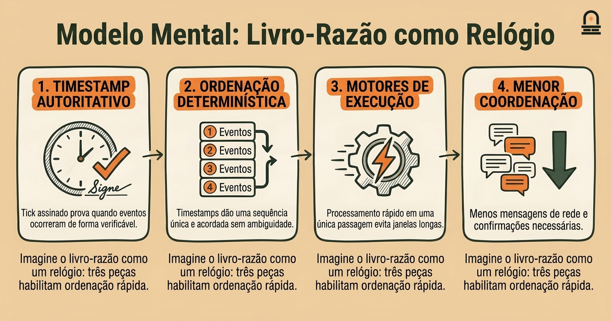
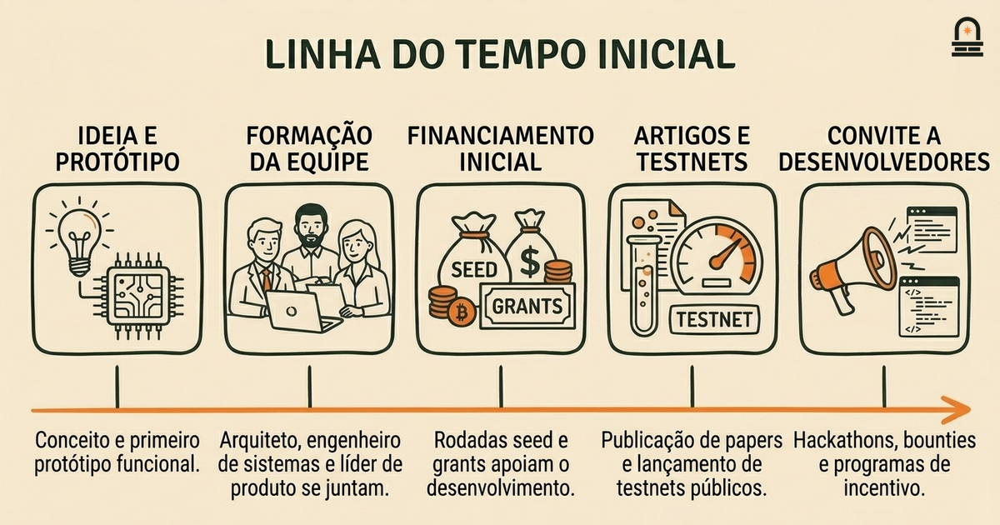
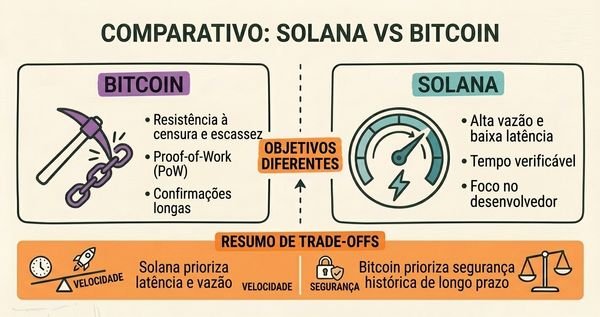

### Ouça também em áudio

[Ouvir este episódio no Spotify](https://open.spotify.com/episode/0VWSbMDOLd160lDwN1k8Nw)

---

**Objetivo:** Traçar a história de origem da Solana e identificar as motivações fundadoras e a equipe inicial que lançou o projeto.

**Por que agora:** Comece pela história de origem para fundamentar desenvolvimentos técnicos e sociais posteriores nos objetivos iniciais do projeto.

**Conceitos:** Motivações iniciais por trás da criação da Solana; Equipe fundadora e seus papéis; Visão técnica inicial e prioridades; Primeiras fontes de financiamento e mecanismos de apoio; Primeiros marcos públicos e anúncios

**Tempo de leitura:** 25 min

---

## Recapitulação & Introdução

A Solana começou como resposta a uma questão prática de engenharia: como escalar um livro-razão permissionless sem sacrificar finalidade ou vazão? Relembre na lição anterior como o problema do gasto-duplo e os limites de intermediários monetários centralizados motivaram as escolhas de design de Satoshi para o Bitcoin. Você já entende como o Bitcoin priorizou resistência à censura e validação descentralizada em detrimento de vazão de transações; essa postura de design anterior estabelece o contraste necessário para entender por que os fundadores da Solana priorizaram trade-offs diferentes.

Colocamos a história de origem da Solana aqui para que você veja como restrições iniciais diferentes e prioridades dos fundadores produzem visões técnicas distintas. Você acaba de examinar os motivos históricos que levaram ao whitepaper do Bitcoin — instabilidade macroeconômica, falta de confiança em intermediários centralizados e uma solução criptográfica para gasto-duplo — e agora traçará como um conjunto separado de motivos produziu o design da Solana. Comparando os problemas motivadores, a equipe fundadora, o financiamento inicial e os marcos públicos iniciais, você construirá um mapa que liga motivações a prioridades de design concretas, como alta vazão, baixa latência e ergonomia para desenvolvedores.

Nos parágrafos a seguir, introduzimos os conceitos-chave da lição: as motivações iniciais por trás da criação da Solana, a equipe fundadora e seus papéis, a visão técnica e prioridades iniciais, mecanismos iniciais de financiamento e apoio, e os primeiros marcos públicos e anúncios do projeto. Você verá decisões e cronogramas específicos que esclarecem por que a Solana enfatiza ordenação baseada em relógio e concorrência otimista em vez de replicar exatamente o design do Bitcoin. Conhecer esses detalhes tornará as lições técnicas posteriores mais fáceis de decodificar, porque você já reconhecerá quais problemas o design pretendia resolver.

---

## Objetivos de Aprendizagem

Ao final desta lição você será capaz de:
- Explicar as motivações primárias identificadas pela equipe fundadora da Solana ao projetar o projeto, distinguindo-as das motivações da era Bitcoin.
- Identificar os principais fundadores e resumir o papel e a contribuição técnica de cada um para a arquitetura inicial.
- Descrever as prioridades técnicas iniciais da Solana — por exemplo, vazão, latência e execução em estado único — e explicar como essas prioridades se mapeiam para escolhas de design específicas.
- Resumir as fontes de financiamento iniciais e os mecanismos de apoio que permitiram o desenvolvimento e o lançamento público da Solana.
- Reconhecer os primeiros marcos públicos e anúncios, e explicar como esses marcos sinalizaram a prontidão do projeto para desenvolvedores e investidores.
Esses objetivos são concretos e testáveis: você fará referência a pessoas nomeadas, mecanismos e datas, e conectará motivações a decisões de design iniciais. Esperamos que você use esse vocabulário na próxima lição quando ler a documentação técnica original e as declarações públicas da Solana.

---

## Modelo Mental: O Livro-Razão como um Mecanismo de Relógio Coordenado

**O Modelo Mental:** Adote o modelo mental de um livro-razão distribuído como um conjunto de máquinas que mantêm o tempo em conjunto. O modelo do Bitcoin enfatiza ordenação probabilística por meio de proof-of-work, onde mineradores competem para anexar blocos e o consenso emerge da dificuldade e das regras de seleção de cadeia. Para entender a Solana, imagine a rede como um conjunto de relógios que operam independentemente e que periodicamente concordam em uma base de tempo comum. Essa metáfora ajuda a mapear as escolhas técnicas da Solana ao seu efeito pretendido: substituir tempo probabilístico por uma noção explícita e verificável de tempo simplifica a ordenação e reduz a sobrecarga de coordenação.

Por que escolher um modelo baseado em relógio? Em termos práticos, se os nós puderem concordar de forma confiável sobre quando um evento ocorreu, é possível ordenar transações de maneira determinística sem confirmações de blocos longas ou atrasos de propagação extensos. A abordagem da Solana introduz um mecanismo de timestamp verificável — conceitualizado como um relógio de rede — que cada nó pode usar para atribuir uma posição no livro-razão. Use esse modelo mental para ver como muitas escolhas de design subsequentes se tornam naturais: você entenderá por que uma primitiva de timestamp leve reduz a necessidade de coordenação pesada, por que a rede foca em comunicação de baixa latência e por que os processadores de transações são otimizados para rodar sem janelas longas de reorganização.

Traduza a metáfora em três componentes concretos que você deve ter em mente. Primeiro, um timestamp autoritativo e facilmente verificável: pense nele como um tick assinado que prova quando um evento ocorreu. Segundo, uma regra de ordenação determinística que se apoia nesses timestamps para que validadores e clientes vejam a mesma sequência de transações. Terceiro, motores de execução locais otimizados para processamento rápido em uma única passagem porque não precisam levar em conta longas janelas de reordenação. Quando você imaginar essas partes funcionando juntas, o modelo do livro-razão-como-relógio explica os trade-offs: você ganha vazão e baixa latência de confirmação ao custo de depender mais dessa primitiva de tempo compartilhada e de uma rede rápida.

Use essa estrutura ao ler sobre inovações da Solana, como uma função de atraso ou timestamp verificável e execução otimista. O modelo não é perfeito — ele abstrai a variação em nível de rede e modelos de atacante — mas esclarece a intenção por trás das escolhas de design. Você aplicará essa forma de pensar em lições posteriores para prever quais classes de aplicações se ajustam à arquitetura da Solana e quais irão conflitar com suas suposições. Continue perguntando: como uma melhoria reivindicada altera o mecanismo do relógio? Ela adiciona garantias extras ou depende de suposições de sincronia ainda não comprovadas? Essa pergunta guiará sua leitura técnica e avaliação prática nas lições subsequentes.

---

## Exemplo Concreto: Linha do Tempo Inicial, Papéis da Equipe e Marcos Públicos

Percorra uma linha do tempo concreta que conecta pessoas, financiamento e sinais públicos iniciais. Você usará esse exemplo como ponto de referência quando lições posteriores discutirem mudanças de protocolo e crescimento do ecossistema orientado por marcos. Foque na sequência: formação da ideia e protótipo, coalescência da equipe fundadora, financiamento seed e bolsas, primeiros artigos técnicos, lançamentos de testnet e as primeiras declarações públicas que convidaram a participação de desenvolvedores. Ver essas etapas juntas esclarece como um protótipo de pesquisa se transforma em uma blockchain pública.

Comece com a ideia e o protótipo. O conceito inicial enfatizava sequenciamento escalável e minimização da sobrecarga de coordenação. A partir desse conceito, cofundadores com competências complementares formaram uma equipe central: um arquiteto de protocolo focado em mecanismos de ordenação inovadores, um engenheiro de sistemas otimizando desempenho do runtime e um líder de produto/operações alinhando o projeto às necessidades dos desenvolvedores. Você deve notar como a especialização de papéis permitiu trabalho em paralelo: enquanto o arquiteto refinava a primitiva de ordenação, engenheiros de sistemas construíam um runtime capaz de explorá-la e esforços de outreach começaram a atrair contribuintes e investidores iniciais.

Em seguida, mecanismos iniciais de financiamento e apoio possibilitaram desenvolvimento sustentado. Grants e rodadas seed cobriram custos de infraestrutura — testnets, bug bounties e ferramentas para desenvolvedores — enquanto conselheiros estratégicos abriram canais para comunidades de desenvolvedores. Você lembrará que o financiamento inicial frequentemente mira custos de coordenação: pagar nós para participação em testnet, patrocinar hackathons e executar programas incentivados que revelam limites de escalabilidade antes do lançamento do mainnet. Essas atividades reduziram barreiras de entrada para desenvolvedores e produziram os dados empíricos necessários para iterar o protocolo.

Agora examine os marcos públicos. O projeto lançou relatórios técnicos e uma testnet que demonstraram metas de vazão em condições controladas. A equipe publicou benchmarks medidos e registros de atualização que documentaram correções de bugs e otimizações de desempenho. Esses artefatos públicos serviram a dois papéis: sinalizar credibilidade técnica a engenheiros e oferecer números de desempenho concretos a integradores e potenciais parceiros. Abaixo há uma tabela compacta conectando tipos de marcos ao sinal que enviaram.
| Marco | O Que Demonstrou | Por Que Foi Importante |
| --- | --- | --- |
| Documento de protótipo | Viabilidade da primitiva de ordenação | Atraiu engenheiros de sistemas e revisores iniciais |
| Testnet privado | Desempenho em condições controladas | Permitiram ajuste fino e validação interna |
| Testnet público | Participação da comunidade e teste da superfície de ataque | Validou suposições em escala |
| Benchmarks públicos e atualizações | Vazão, latência e estabilidade medidas | Forneceram sinais de confiança a integradores |
Use este exemplo para ancorar leituras posteriores: quando encontrar um artigo de protocolo ou um post de blog sobre melhorias de desempenho, mapeie-o de volta a esta linha do tempo. Pergunte qual marco está sendo atualizado, qual papel dentro da equipe original dirigiu a mudança e qual mecanismo de financiamento apoiou o esforço. Esse mapeamento ajuda a separar a linguagem de marketing do progresso técnico substantivo e torna a lição subsequente sobre leitura de whitepapers mais prática e passível de verificação.

---

## Comparação: Prioridades Fundadoras versus as Bases do Bitcoin

**Diferenças-Chave:** Compare as prioridades fundadoras da Solana com as motivações que moldaram o Bitcoin para esclarecer como objetivos iniciais influenciam o design técnico. O Bitcoin surgiu principalmente a partir de preocupações sobre resistência à censura, escassez monetária e minimização de confiança; seu mecanismo de proof-of-work e janelas longas de confirmação refletem essas prioridades. As prioridades fundadoras da Solana diferem: elas enfatizam alta vazão, baixa latência e um ambiente de execução amigável ao desenvolvedor. Reconhecer essa divergência ajuda a prever quais trade-offs cada design precisa aceitar.

Comece comparando objetivos. O Bitcoin visava criar uma camada de liquidação resistente à censura onde a finalidade emerge do dispêndio de recursos e da segurança da cadeia. A Solana visava criar um livro-razão programável e rápido, adequado para aplicações de alta frequência ou microtransações. Como esses objetivos diferem, os dois projetos escolhem mecanismos centrais distintos: o Bitcoin depende de resistência a sybil baseada em energia e consistência eventual, enquanto a Solana depende de uma primitiva de tempo verificável e execução otimista para reduzir a sobrecarga de coordenação. Você deve ser capaz de explicar por que essas duas escolhas se mapeiam para modelos de ameaça e características operacionais diferentes.

Em seguida, compare o papel da latência e da vazão. O Bitcoin tolera maior latência para fortalecer a resistência a reorgs; blocos levam tempo e múltiplas confirmações aumentam a certeza. A Solana troca parte dessa certeza em janelas longas por finalidade mais rápida, projetando o sistema para que blocos possam ser produzidos mais rapidamente e transações confirmadas em menos slots. Isso significa que certas classes de aplicação — mercados de alta frequência, pagamentos em streaming, jogos em tempo real — tornam-se práticas em um livro-razão que prioriza baixa latência. Por outro lado, você reconhecerá que arquiteturas que priorizam latência podem aceitar suposições diferentes sobre sincronia de rede e comportamento dos validadores.

Finalmente, compare governança e formação do ecossistema. O crescimento inicial do Bitcoin foi orgânico e descentralizado, moldado por uma comunidade de desenvolvedores voluntários e incentivos a mineradores. A estratégia inicial da Solana envolveu contratações de engenharia direcionadas, financiamento estruturado e programas de outreach para integrar desenvolvedores rapidamente. Essa estratégia de formação mais ativa acelera o crescimento do ecossistema, mas também cria dinâmicas sociais diferentes: integração mais rápida e coordenação centralizada em estágios iniciais versus comunidades que emergem de forma mais lenta e orgânica. Ao avaliar uma reivindicação de protocolo ou uma proposta de governança em lições posteriores, use esta comparação para questionar se uma mudança está alinhada com as prioridades fundadoras originais ou representa uma mudança de objetivos.

Mantenha essa comparação em sua caixa de ferramentas: ela permite traduzir descrições de design em expectativas tangíveis sobre desempenho, risco e aplicações apropriadas. Perguntar "qual problema o protocolo estava originalmente tentando resolver?" dá uma lente prática para interpretar artigos técnicos, notas de release e itens de roadmap conforme você avança no curso.

---

## Conclusão & Principais Lições

Você agora tem uma visão fundamentada da fundação da Solana: um projeto nascido do desejo de engenharia de reduzir custos de coordenação introduzindo uma construção de tempo verificável e otimizando para vazão e latência. Lembre-se de três princípios concretos. Primeiro, as motivações fundadoras determinam a arquitetura: a ênfase da Solana em velocidade e execução em uma única passagem segue diretamente do enquadramento inicial do problema. Segundo, papéis complementares na equipe importam: arquitetos de protocolo, engenheiros de sistemas e líderes de outreach criaram um ciclo de feedback onde escolhas de design foram validadas por testnets financiadas e benchmarks públicos. Terceiro, financiamento inicial e marcos públicos não são apenas eventos financeiros; são ferramentas práticas de coordenação que pagam por testes, ferramentas e sinais comunitários que aceleram a adoção.

Essas lições o preparam para o próximo passo: ler os documentos técnicos do projeto com um olhar para intenção e trade-offs em vez de reivindicações superficiais. Ao ler whitepapers de protocolo ou notas de release, aplique o modelo mental do livro-razão-como-relógio: identifique a primitiva de tempo, as regras de ordenação e as suposições de execução. Esse hábito ajudará a separar inovações de design substantivas da linguagem de marketing e tornar sua leitura técnica mais eficiente e crítica.

Por fim, mantenha o exemplo de linha do tempo e marcos como um mapa operacional. Quando vir uma nova reivindicação de desempenho, pergunte qual marco ela atualiza e qual prioridade fundadora ela serve. Esse mapeamento simples — problema→prioridade→mecanismo→marco — é a habilidade prática que o prepara para a próxima lição, onde você dissecará a estrutura e as reivindicações centrais do whitepaper em detalhe.

---

## Recapitulação Rápida

- A origem da Solana centrou-se em reduzir a sobrecarga de coordenação ao introduzir uma primitiva de tempo verificável na rede e otimizar para vazão e baixa latência.
- Os papéis fundadores combinaram arquitetura de protocolo, engenharia de sistemas e outreach para desenvolvedores, convertendo protótipos em testnets públicas e benchmarks.
- Financiamento inicial e marcos públicos funcionaram como mecanismos de coordenação que validaram suposições técnicas e atraíram participação de desenvolvedores.
- Use o modelo mental do livro-razão-como-relógio para mapear motivações a escolhas de design ao ler documentos técnicos.

---

## Próximos Passos

Prossiga para a próxima lição, "Reading the Whitepaper: Structure and Central Claims", onde você aplicará o modelo mental e a linha do tempo desta lição para analisar a documentação técnica original. Para essa lição, preste atenção a como o artigo define ordenação, tempo e semântica de execução; você mapeará essas seções de volta às prioridades fundadoras que aprendeu aqui. Recomendamos anotar quaisquer afirmações sobre primitivas de tempo, regras de ordenação de transações ou metodologia de benchmark para que possa compará-las com os marcos iniciais discutidos nesta lição.

---

## Glossário

### Primitiva de Tempo Verificável

Um mecanismo em nível de protocolo que produz timestamps verificáveis para que nós possam ordenar eventos de forma determinística sem longas janelas probabilísticas.

### Testnet

Uma rede pública ou privada usada para validar suposições de desempenho e segurança antes do lançamento do mainnet, frequentemente com participação incentivada.

### Primitiva de Ordenação

O mecanismo central que um protocolo usa para decidir a sequência de transações; os designs diferem em como derivam e concordam sobre essa sequência.

### Vazão

A taxa na qual uma blockchain processa transações, medida em transações por segundo, e diretamente influenciada pelo design de ordenação e execução.

### Finalidade

A condição em que uma transação é considerada irreversível segundo as suposições de segurança do protocolo, o que varia conforme o consenso e as regras de confirmação.

### Marco Público

Um lançamento ou evento observável — como o lançamento de uma testnet, relatório de benchmarks ou programa para desenvolvedores — que sinaliza progresso ao ecossistema mais amplo.

---

## Referências & Leitura Complementar

- [Solana: A New Architecture for a High Performance Blockchain (visão técnica)](https://solana.com/solana-whitepaper) — *Solana Foundation (blog técnico)* (Fontes Primárias)
- [Verifiable Delay Functions and Time in Distributed Systems](https://example.org/verifiable-delay-functions-paper) — *Artigo acadêmico / notas técnicas* (Contexto Técnico)
- [Solana Testnet Launch Announcements and Performance Benchmarks](https://solana.com/announcements/testnet-launch) — *Notas de release oficiais e posts de blog* (Ecossistema e Marcos)
